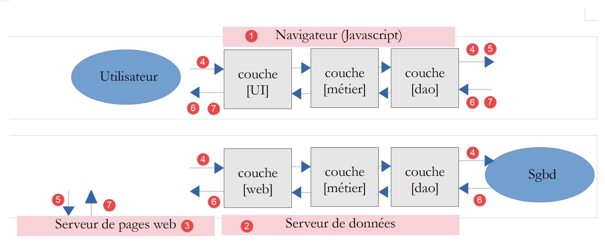
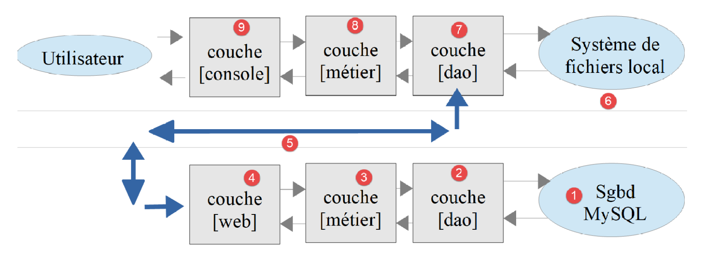
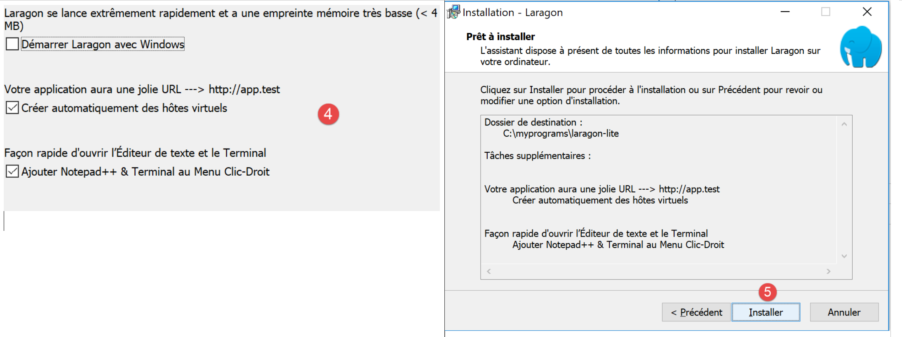

Introduction au langage PHP 7
=============================

Ce document fait partie d’une série de quatre articles :

1. [`Introduction au langage PHP7 par
   l’exemple <https://tahe.developpez.com/tutoriels-cours/php7>`__].
   **C’est le document présent** ;

2. [`Introduction au langage ECMASCRIPT 6 par
   l’exemple <https://tahe.developpez.com/tutoriels-cours/ecmascript6>`__] ;

3. [`Introduction au framework VUE.JS par
   l’exemple <https://tahe.developpez.com/tutoriels-cours/vuejs>`__] ;

4. [`Introduction au framework NUXT.JS par
   l’exemple <https://tahe.developpez.com/tutoriels-cours/nuxtjs>`__] ;

Ce sont tous des documents pour **débutants**. Les articles ont une
suite logique mais **sont faiblement couplés** :

-  le document [1] présente le langage PHP 7. Le lecteur seulement
   intéressé par le langage PHP et pas par le langage Javascript des
   articles suivants s’arrêtera là ;

-  les documents [2-4] visent à construire un client Javascript au
   serveur de calcul de l’impôt développé dans le document [1] ;

-  les frameworks Javascript [vue.js] et [nuxt.js] des articles 3 et 4
   nécessitent de connaître le Javascript des dernières versions
   d’ECMASCRIPT, celles de la version 6. Le document [2] est donc
   destiné à ceux qui ne connaissent pas cette version de Javascript. Il
   fait référence au serveur de calcul de l’impôt construit dans le
   document [1]. Le lecteur de [2] aura alors parfois besoin de se
   référer au document [1] ;

-  une fois ECMASCRIPT 6 maîtrisé, on peut aborder le framework VUE.JS
   qui permet de construire des clients Javascript s’exécutant dans un
   navigateur en mode SPA (Single Page Application). C’est le document
   [3]. Il fait référence à la fois au serveur de calcul de l’impôt
   construit dans le document [1] et au code du client Javascript
   autonome construit en [2]. Le lecteur de [3] aura alors parfois
   besoin de se référer aux documents [1] et [2] ;

-  une fois VUE.JS maîtrisé, on peut aborder le framework NUXT.JS qui
   permet de construire des clients Javascript s’exécutant dans un
   navigateur en mode SSR (Server Side Rendered). Il fait référence à la
   fois au serveur de calcul de l’impôt construit dans le document [1],
   au code du client Javascript autonome construit en [2] ainsi qu’à
   l’application [vue.js] développée dans le document [3]. Le lecteur de
   [4] aura alors parfois besoin de se référer aux documents [1] [2] et
   [3] ;

Ce document propose une liste de **scripts console** PHP 7 dans
différents domaines (structures du langage, accès aux fichiers, aux
bases de données, au réseau internet). La programmation web est abordée
via des **services web**. On a appelé dans ce document, service web,
toute application web produisant du texte brut. Ce sont des serveurs de
données et non des serveurs de pages web qui sont un mixte HTML, CSS et
Javascript. On y aborde des concepts web classiques (protocole HTTP,
réponses jSON ou XML, gestion de session, authentification) également
utilisés dans la programmation web classique.

De nos jours, il est fréquent de construire des applications web en mode
client / serveur :

|image0|

-  en **[1]**, le navigateur web affiche des pages web à destination
   d’un utilisateur **[5, 7]**. Ces pages contiennent du Javascript
   implémentant un client d’un service web de données **[2]** ainsi
   qu’un client d’un serveur de fragments de pages web **[3]**. Un
   framework JS bien établi dans ce domaine est **Angular 2** de Google
   (mai 2019) ;

-  en **[2]**, le serveur web est un serveur de données. Il peut être
   écrit dans n’importe quel langage. Il ne produit pas de pages web au
   sens classique (HTML, CSS, Javascript) sauf peut-être la 1ère fois.
   Mais cette 1ère page peut être obtenue d’un serveur web classique
   **[3]** (pas un serveur de données). Le Javascript de la page
   initiale va alors générer les différentes pages web de l’application
   en obtenant les données **[4]** à afficher auprès du serveur web qui
   agit comme un serveur de données **[2]**. Il peut également obtenir
   des fragments de page web **[5]** pour habiller ces données auprès du
   serveur de pages web **[3]** ;

-  en **[4]**, l’utilisateur initie une action ;

-  en **[6,7]** : il reçoit des données habillées par un fragment de
   page web ;

Nous allons dans ce document écrire des applications client / serveur en
PHP7 ayant la structure suivante :

|image1|

On a là une application client / serveur écrite en PHP. Un script
console **[9]** interrogera un serveur de données **[4]**. Ce qui sera
appris ici pour écrire le service de données pourra être réutilisé dans
une application web. Le service de données en PHP pourra être conservé
et le client PHP sera lui remplacé par un client Javascript.

Comme fil rouge du document, nous construirons un service de calcul de
l’impôt en 13 versions. La version 13 aura l’architecture suivante :

|image2|

La couche **[web]** du serveur aura une architecture MVC (Model – View –
Controller). Tout le cours PHP 7 vise à construire cette version.

Les scripts de ce document sont commentés et leur exécution console
reproduite. Des explications supplémentaires sont parfois fournies. Le
document nécessite une lecture active : pour comprendre un script, il
faut à la fois lire son code, ses commentaires et ses résultats
d'exécution.

Les exemples du document sont disponibles
\|\ `ici <https://tahe.developpez.com/tutoriels-cours/php7/documents/php7.rar>`__\ **\ \|**.

L’application serveur PHP 7 peut être testée
\|\ `ici <https://sergetahe.com/apps/impot/serveur-php7/>`__\ **\ \|**.

Serge Tahé, juillet 2019

