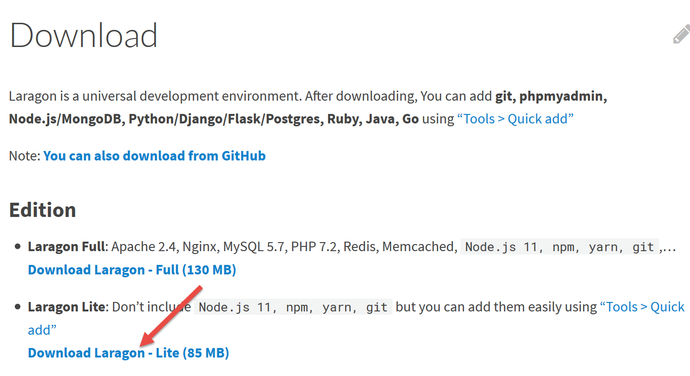
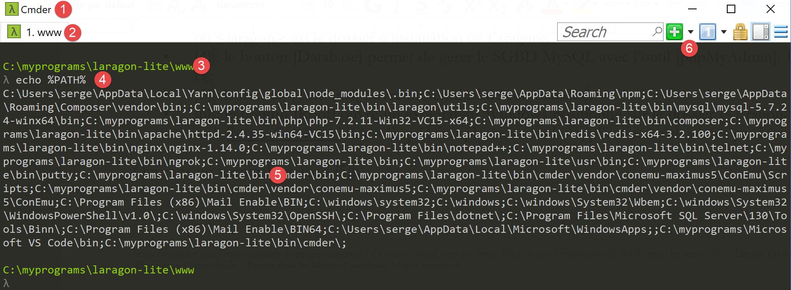
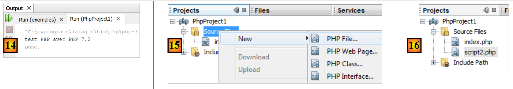
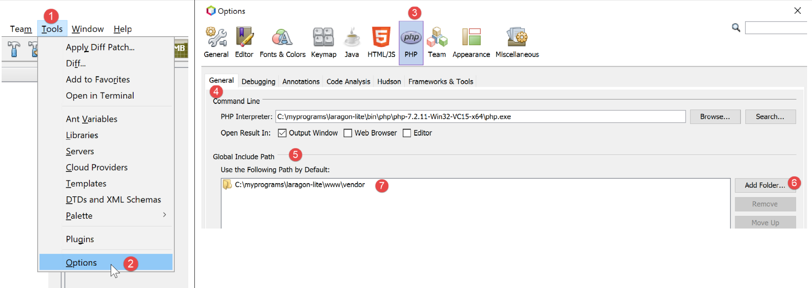
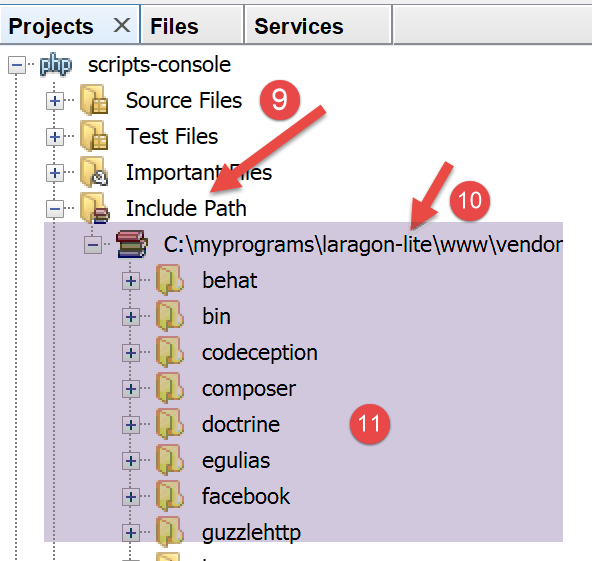

Installation d'un environnement de travail
==========================================

Les scripts ont été écrits et testés dans l'environnement suivant :

-  un environnement serveur web Apache / SGBD MySQL / PHP 7.3 appelé
   **Laragon ;**

-  l'IDE de développement **Netbeans 10.0 ;**

Installation de Laragon
-----------------------

Laragon est un package réunissant plusieurs logiciels :

-  un serveur web Apache. Nous l'utiliserons pour l'écriture de scripts
   web en PHP ;

-  le SGBD MySQL ;

-  le langage de script PHP ;

-  un serveur Redis implémentant un cache pour des applications web :

Laragon peut être téléchargé (mars 2019) à l'adresse suivante :

https://laragon.org/download/

|image0|

|image1|

|image2|

-  l'installation **[1-5]** donne naissance à l'arborescence suivante :

|image3|

-  en **[6]** le dossier d'installation de PHP ;

Le lancement de **[Laragon]** affiche la fenêtre suivante :

|image4|

-  **[1]** : le menu principal de Laragon ;

-  **[2]** : le bouton **[Start All]** lance le serveur web Apache et le
   SGBD MySQL ;

-  **[3]** : le bouton **[WEB]** affiche la page web
   **[http://localhost]** qui correspond au fichier PHP
   **[<laragon>/www/index.php]** où <laragon> est le dossier
   d’installation de Laragon ;

-  **[4]** : le bouton **[Database]** permet de gérer le SGBD MySQL avec
   l’outil **[phpMyAdmin]**. Il faut auparavant installer celui-ci ;

-  **[5]** : le bouton **[Terminal]** ouvre un terminal de commandes ;

-  **[6]** : le bouton **[Root]** ouvre un explorateur Windows
   positionné sur le dossier **[<laragon>/www]** qui est la racine du
   site web **[http://localhost]**. C’est là qu’il faut placer toutes
   les applications web gérées par le serveur Apache de Laragon ;

Ouvrons un terminal Laragon **[5]** :

|image5|

-  en **[1]**, le type du terminal. Trois types de terminaux sont
   disponibles en **[6]** ;

-  en **[2, 3]** : le dossier courant ;

-  en **[4]**, on tape la commande **[echo %PATH%]** qui affiche la
   liste des dossiers explorés lors de la recherche d’un exécutable.
   Tous les principaux dossiers de Laragon sont inclus dans ce chemin
   des exécutables, ce qui ne serait pas le cas si on ouvrait une
   fenêtre de commandes **[cmd]** dans Windows. Dans ce document,
   lorsqu’on est amené à taper des commandes pour installer tel ou tel
   logiciel, c’est en général dans un terminal Laragon que ces commandes
   sont tapées ;

Installation de l'IDE Netbeans 10.0
-----------------------------------

L'IDE Netbeans 10.0 peut être téléchargé à l'adresse suivante (mars
2019) :

`https://netbeans.apache.org/download/index.HTML <https://netbeans.apache.org/download/index.html>`__

|image6|

Le fichier téléchargé est un zip qu’il suffit de dézipper. Une fois
Netbeans installé et lancé, on peut créer un premier projet PHP.

|image7|

-  en **[1]**, prendre l'option File / New Project ;

-  en **[2]**, prendre la catégorie **[PHP]** ;

-  en **[3]**, prendre le type de projet **[PHP Application]** ;

|image8|

-  en **[4]**, donner un nom au projet ;

-  en **[5]**, choisir un dossier pour le projet ;

-  en **[6]**, choisir la version de PHP téléchargée ;

-  en **[7]**, choisir l'encodage UTF-8 pour les fichiers PHP ;

-  en **[8]**, choisir le mode **[Script]** pour exécuter les scripts
   PHP en mode ligne de commande. Choisir **[Local WEB Server]** pour
   exécuter un script PHP dans un environnement web ;

-  en **[9,10]**, indiquer le répertoire d'installation de
   l'interpréteur PHP du package Laragon :

|image9|

-  choisir **[Finish]** pour terminer l'assistant de création du projet
   PHP ;

|image10|

-  en **[11]**, le projet est créé avec un script **[index.php]** ;

-  en **[12]**, on écrit un script PHP minimal ;

-  en **[13]**, on exécute **[index.php]** ;

|image11|

-  en **[14]**, les résultats dans la fenêtre **[output]** de Netbeans ;

-  en **[15]**, on crée un nouveau script ;

-  en **[16]**, le nouveau script ;

Le lecteur pourra créer tous les scripts qui vont suivre dans différents
dossiers du même projet PHP. Les codes source des scripts de ce document
sont disponibles sous la forme de l’arborescence Netbeans suivante :

|image12|

Les scripts de ce document sont placés dans l’arborescence du projet
**[scripts-console]** **[1]**. Nous allons utiliser également des
bibliothèques PHP qui seront placées dans le dossier
**[<laragon-lite>/www/vendor]** **[2]** où <laragon-lite> est le dossier
d’installation du logiciel Laragon. Pour que Netbeans reconnaisse les
bibliothèques de **[2]** comme faisant partie du projet
**[scripts-console]**, il nous faut inclure le dossier **[vendor]**
**[2]** dans la branche **[Include Path]** **[3]** du projet. Nous
allons configurer Netbeans pour que le dossier
**[<laragon-lite>/www/vendor]** **[2]** soit inclus dans tout nouveau
projet PHP et pas seulement dans le projet **[scripts-console]** :

|image13|

-  en **[1-2]**, on va dans les options de Netbeans ;

-  en **[3-4]**, on configure les options de PHP ;

-  en **[5-7]**, on configure le **[Global Include Path]** de PHP : les
   dossiers indiqués en **[7]** sont automatiquement inclus dans le
   **[Include Path]** de tout projet PHP ;

|image14|

-  en **[9]**, on accède aux propriétés de la branche **[Include
   Path]** ;

-  en **[10-11]**, les nouvelles bibliothèques explorées par Netbeans.
   Netbeans explore le code PHP de ces bibliothèques et mémorise leurs
   classes, interfaces, fonctions… afin de pouvoir proposer de l’aide au
   développeur ;

|image15|

-  en **[12]**, un code utilise la classe **[PhpMimeMailParser\Parser]**
   de la bibliothèque **[vendor/php-mime-mail-parser]** ;

-  en **[13]**, Netbeans propose les méthodes de cette classe ;

-  en **[14-15]**, Netbeans affiche la documentation de la méthode
   sélectionnée ;

La notion d’\ **[Include Path]** est ici propre à Netbeans. PHP a
également cette notion mais ce sont a priori deux notions différentes.

Maintenant que l'environnement de travail a été installé, nous pouvons
aborder les bases de PHP.

.. |image1| image:: ./chap-02/media/image2.png
   :width: 5.58661in
   :height: 2.14173in

.. |image4| image:: ./chap-02/media/image5.png
   :width: 3.97638in
   :height: 2.61811in

.. |image6| image:: ./chap-02/media/image7.png
   :width: 5.15748in
   :height: 2.32717in
.. |image7| image:: ./chap-02/media/image8.png
   :width: 4.61378in
   :height: 1.32716in
.. |image8| image:: ./chap-02/media/image9.png
   :width: 6.6811in
   :height: 1.44528in
.. |image9| image:: ./chap-02/media/image10.png
   :width: 4.68898in
   :height: 1.88622in

.. |image12| image:: ./chap-02/media/image13.png
   :width: 5.84646in
   :height: 2.70079in

.. |image15| image:: ./chap-02/media/image16.png
   :width: 3.74449in
   :height: 4.65748in
