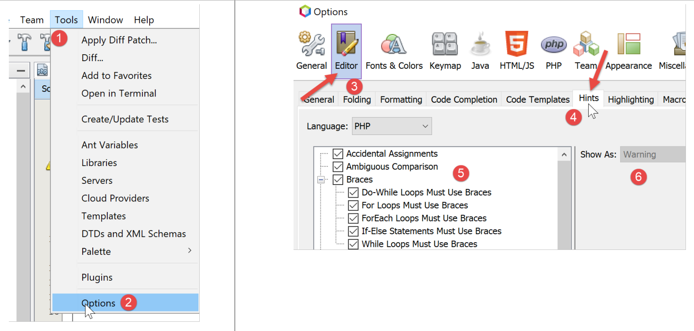
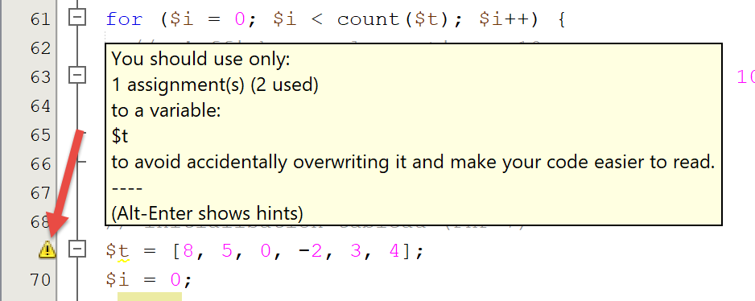

Les bases de PHP
================

L’arborescence des scripts
--------------------------

|image0|

Configuration de PHP
--------------------

PHP arrive préconfiguré par un fichier texte **[php.ini]**. Toutes ces
configurations peuvent être changées par programmation. La configuration
de PHP influence grandement l’exécution des scripts. Il est donc
important de la connaître. Le script suivant **[phpinfo.php]** le
permet :

.. code-block:: php 
   :linenos:

   <?php

   phpinfo();

**Commentaires**

-  ligne 3 : la fonction **[phpinfo]** affiche la configuration de PHP ;

**Résultats de l’exécution**

.. code-block:: php 
   :linenos:

   "C:\myprograms\laragon-lite\bin\php\php-7.2.11-Win32-VC15-x64\php.exe" "C:\Data\st-2019\dev\php7\php5-exemples\exemples\tests\phpinfo.php"
   phpinfo()
   PHP Version => 7.2.11

   System => Windows NT DESKTOP-528I5CU 10.0 build 17134 (Windows 10) AMD64
   Build Date => Oct 10 2018 01:57:32
   Compiler => MSVC15 (Visual C++ 2017)
   Architecture => x64
   Configure Command => cscript /nologo configure.js  "--enable-snapshot-build" "--enable-debug-pack" "--with-pdo-oci=c:\php-snap-build\deps_aux\oracle\x64\instantclient_12_1\sdk,shared" "--with-oci8-12c=c:\php-snap-build\deps_aux\oracle\x64\instantclient_12_1\sdk,shared" "--enable-object-out-dir=../obj/" "--enable-com-dotnet=shared" "--without-analyzer" "--with-pgo"
   Server API => Command Line Interface
   Virtual Directory Support => enabled
   Configuration File (php.ini) Path => C:\windows
   Loaded Configuration File => C:\myprograms\laragon-lite\bin\php\php-7.2.11-Win32-VC15-x64\php.ini
   Scan this dir for additional .ini files => (none)
   Additional .ini files parsed => (none)
   …
   Done.

La fonction **[phpinfo]** affiche ici plus de 800 lignes de
configuration. Nous n’allons pas les commenter car la plupart concerne
un usage avancé de PHP. Une ligne importante est la ligne 13 ci-dessus :
elle indique quel fichier **[php.ini]** a été utilisé pour configurer le
PHP que vous allez utiliser pour exécuter vos scripts. Si vous souhaitez
modifier la configuration d’exécution de PHP, c’est ce fichier qu’il
vous faut modifier. De nombreux commentaires sont présents dans ce
fichier pour expliquer le rôle des différentes configurations.

Un premier exemple
------------------

Le code
~~~~~~~

Ci-dessous, on trouvera un programme **[bases-01.php]** présentant les
premières caractéristiques de PHP.

.. code-block:: php 
   :linenos:

   <?php

   // ceci est un commentaire
   // variable utilisée sans avoir été déclarée
   $nom = "dupont";
   // un affichage écran
   print "nom=$nom\n";
   // un tableau avec des éléments de type différent
   $tableau = array("un", "deux", 3, 4);
   // son nombre d'éléments
   $n = count($tableau);
   // une boucle
   for ($i = 0; $i < $n; $i++) {
     print "tableau[$i]=$tableau[$i]\n";
   }
   // initialisation de 2 variables avec le contenu d'un tableau
   list($chaine1, $chaine2) = array("chaine1", "chaine2");
   // concaténation des 2 chaînes
   $chaine3 = $chaine1 . $chaine2;
   // affichage résultat
   print "[$chaine1,$chaine2,$chaine3]\n";
   // utilisation fonction
   affiche($chaine1);
   // le type d'une variable peut être connu
   afficheType("n", $n);
   afficheType("chaine1", $chaine1);
   afficheType("tableau", $tableau);
   // le type d'une variable peut changer en cours d'exécution
   $n = "a changé";
   afficheType("n", $n);
   // une fonction peut rendre un résultat
   $res1 = f1(4);
   print "res1=$res1\n";
   // une fonction peut rendre un tableau de valeurs
   list($res1, $res2, $res3) = f2();
   print "(res1,res2,res3)=[$res1,$res2,$res3]\n";
   // on aurait pu récupérer ces valeurs dans un tableau
   $t = f2();
   for ($i = 0; $i < count($t); $i++) {
     print "t[$i]=$t[$i]\n";
   }
   // des tests
   for ($i = 0; $i < count($t); $i++) {
     // n'affiche que les chaînes
     if (getType($t[$i]) === "string") {
       print "t[$i]=$t[$i]\n";
     }
   }
   // opérateurs de comparaison == et ===
   if("2"==2){
     print "avec l'opérateur ==, la chaîne 2 est égale à l'entier 2\n";
   }else{
     print "avec l'opérateur ==, la chaîne 2 n'est pas égale à l'entier 2\n";
   }
   if("2"===2){
     print "avec l'opérateur ===, la chaîne 2 est égale à l'entier 2\n";
   }
   else{
     print "avec l'opérateur ===, la chaîne 2 n'est pas égale à l'entier 2\n";
   }
   // d'autres tests
   for ($i = 0; $i < count($t); $i++) {
     // n'affiche que les entiers >10
     if (getType($t[$i]) === "integer" and $t[$i] > 10) {
       print "t[$i]=$t[$i]\n";
     }
   }
   // une boucle while
   $t = [8, 5, 0, -2, 3, 4];
   $i = 0;
   $somme = 0;
   while ($i < count($t) and $t[$i] > 0) {
     print "t[$i]=$t[$i]\n";
     $somme += $t[$i];   //$somme=$somme+$t[$i]
     $i++;               //$i=$i+1
   }//while
   print "somme=$somme\n";

   // fin programme
   exit;

   //----------------------------------
   function affiche($chaine) {
     // affiche $chaine
     print "chaine=$chaine\n";
   }

   //affiche
   //----------------------------------
   function afficheType($name, $variable) {
     // affiche le type de $variable
     print "type[variable $" . $name . "]=" . getType($variable) . "\n";
   }

   //afficheType
   //----------------------------------
   function f1($param) {
     // ajoute 10 à $param
     return $param + 10;
   }

   //----------------------------------
   function f2() {
     // rend 3 valeurs
     return array("un", 0, 100);
   }
   ?>

**Les résultats** :

.. code-block:: php 
   :linenos:

   nom=dupont
   tableau[0]=un
   tableau[1]=deux
   tableau[2]=3
   tableau[3]=4
   [chaine1,chaine2,chaine1chaine2]
   chaine=chaine1
   type[variable $n]=integer
   type[variable $chaine1]=string
   type[variable $tableau]=array
   type[variable $n]=string
   res1=14
   (res1,res2,res3)=[un,0,100]
   t[0]=un
   t[1]=0
   t[2]=100
   t[0]=un
   avec l'opérateur ==, la chaîne 2 est égale à l'entier 2
   avec l'opérateur ===, la chaîne 2 n'est pas égale à l'entier 2
   t[2]=100
   t[0]=8
   t[1]=5
   somme=13

**Commentaires**

-  ligne 5 : en PHP, on ne déclare pas le type des variables. Celles-ci
   ont un type dynamique qui peut varier au cours du temps. $\ **nom**
   représente la variable d'identifiant *nom ;*

-  ligne 7 : pour écrire à l'écran, on peut utiliser l'instruction
   *print* ou l'instruction *echo ;*

-  ligne 9 : le mot clé *array* permet de définir un tableau. La
   variable *$nom\ *\ **[$i]** représente l'élément *$i* du tableau
   *$tableau ;*

-  ligne 11 : la fonction *count($tableau)* rend le nombre d'éléments du
   tableau *$tableau* ;

-  lignes 13-15 : une boucle. Celle-ci n’ayant qu’une instruction, les
   accolades sont alors facultatives. Dans la suite de ce document, nous
   mettrons systématiquement les accolades quelque soit le nombre
   d’instructions ;

-  ligne 14 : les chaînes de caractères sont entourées de guillemets "
   ou d'apostrophes '. A l'intérieur de guillemets, les variables
   $\ *variable* sont évaluées mais pas à l'intérieur d'apostrophes ;

-  ligne 17 : la fonction *list* permet de rassembler des variables dans
   une liste et de leur attribuer une valeur avec une unique opération
   d'affectation. Ici *$chaine1="chaine1"* et *$chaine2="chaine2*" ;

-  ligne 19 : l'opérateur . est l'opérateur de concaténation de
   chaînes ;

-  lignes 83-86 : le mot clé *function* définit une fonction. Une
   fonction rend ou non des valeurs par l'instruction *return*. Le code
   appelant peut ignorer ou récupérer les résultats d'une fonction. Une
   fonction peut être définie n'importe où dans le code.

-  ligne 92 : la fonction prédéfinie *getType($variable)* rend une
   chaîne de caractères représentant le type de *$variable*. Ce type
   peut changer au cours du temps ;

-  ligne 45 : l’opérateur === compare deux éléments de façon stricte :
   il faut qu’ils aient le **même type** pour être comparés. L’opérateur
   == est moins strict : deux éléments peuvent être égaux **sans être du
   même type**. C’est ce que montrent les instructions des lignes 50-60.
   Dans le cas de l’opérateur ==, la comparaison se fait après
   transtypage des deux éléments comparés dans un même type. Des
   conversions implicites ont alors lieu. Il est assez facile
   « d’oublier » la présence de ces conversions implicites et d’aboutir
   ainsi à des résultats imprévus, tels que de découvrir qu’une
   condition est vraie alors que vous l’attendiez fausse. Pour éviter
   cet écueil, nous utiliserons systématiquement l’opérateur de
   compraison === ;

-  ligne 64 : on peut utiliser également les opérateurs booléens **or**
   et **! ;**

-  ligne 69 : à la place de la notation **array()**, on peut utiliser la
   notation **[]** pour initialiser un tableau depuis PHP7 ;

-  ligne 80 : la fonction prédéfinie *exit* arrête l’exécution du
   script ;

-  ligne 107 : la balise **?>** signale la fin du script PHP. Elle n’est
   pas indispensable. De plus, dans un contexte web, elle peut poser
   problème si elle est suivie par des espaces ou des marques de fin de
   ligne, difficiles à détecter car non visibles dans un éditeur de
   texte. Aussi dans la suite du document, nous omettrons
   systématiquement cette balise ;

**Note** : dans ce document, nous utiliserons le mot clé **[print]**
pour afficher du texte sur la console. Une autre méthode pour faire la
même chose est d’utiliser le mot clé **[echo]**. Il y a de subtiles
différences entre ces deux mots clés, mais dans le contexte de ce
document il n’y en aura aucune. Si donc vous préférez utiliser
**[echo]**, alors faites-le.

Usage de Netbeans
~~~~~~~~~~~~~~~~~

Netbeans émet divers avertissements qu’il est utile de vérifier. Prenons
l’exemple du script **[bases-01.php]** :

|image1|

A la ligne 5, Netbeans émet un avertissement comme quoi le fichier ne
respecte pas la recommandation PSR-1 (PHP Standard Recommendations n°
1). Les PSR sont des recommandations pour produire un code standard et
ainsi faciliter l’interopérabilité et la maintenance de codes écrits par
différentes personnes. Il peut être ennuyeux d’avoir des avertissements
si on veut transgresser délibérément les standards, parce que par
exemple l’équipe du projet en a d’autres. Ce que l’on souhaite vérifier
ou pas avec Netbeans est configurable :

|image2|

-  en **[5]**, on trouve les éléments que l’on veut contrôler avec
   Netbeans ;

-  en **[6]**, le niveau de sévérité assigné à l’erreur signalée par
   Netbeans ;

|image3|

On voit en **[7]** qu’on a demandé à contrôler que le code suit bien les
recommandations PSR-0 et PSR-1. Il n’y a rien d’obligatoire. En phase
d’apprentissage du langage, ll est conseillé de contrôler le maximum
d’options proposées par Netbeans. On apprend ainsi beaucoup de choses.
On adaptera ensuite ce contrôle de Netbeans aux normes de codage de
l’équipe d’un projet.

Voyons les normes de codage PSR-1 **[8, 9]** :

+----------------------------------+----------------------------------+
| **Option**                       | **Contrôle**                     |
+==================================+==================================+
| 1. **Class Constant              | Class constants MUST be declared |
|    Declaration**                 | in all upper case with           |
|                                  | underscore separators.           |
|                                  |                                  |
|                                  | Ex : *const TAUX_TVA*            |
+----------------------------------+----------------------------------+
| 2. **Method Declaration**        | Method names MUST be declared in |
|                                  | camelCase().                     |
|                                  |                                  |
|                                  | Ex : *public function            |
|                                  | executeBatchImpots{}*            |
+----------------------------------+----------------------------------+
| 3. **Property Name**             | Property names SHOULD be         |
|                                  | declared in $StudlyCaps,         |
|                                  | $camelCase, or $under_score      |
|                                  | format (consistently in a scope) |
|                                  |                                  |
|                                  | Ex : *public SalaireAnnuel*      |
|                                  | (StudlyCaps), *public            |
|                                  | salaireAnnuel* (camelCase),      |
|                                  | *public salaire_annuel*          |
|                                  | (under_score)                    |
+----------------------------------+----------------------------------+
| 4. **Side Effects**              | A file SHOULD declare new        |
|                                  | symbols and cause no other side  |
|                                  | effects, or it SHOULD execute    |
|                                  | logic with side effects, but     |
|                                  | SHOULD NOT do both.              |
+----------------------------------+----------------------------------+
| 5. **Type Declaration**          | Type names MUST be declared in   |
|                                  | StudlyCaps (Code written for     |
|                                  | 5.2.x and before SHOULD use the  |
|                                  | pseudonamespacing convention of  |
|                                  | Vendor\_ prefixes on type        |
|                                  | names). Each type is in a file   |
|                                  | by itself, and is in a namespace |
|                                  | of at least one level: a         |
|                                  | top-level vendor name.           |
|                                  |                                  |
|                                  | Ex : *class EtudiantBoursier {}* |
+----------------------------------+----------------------------------+

La recommandation PSR-1 / 4 dit que dans un fichier PHP, on doit
trouver :

-  soit la déclaration d’un type (classes, interface) ;

-  soit du code exécutable sans déclaration de nouveaux types ;

Il existe d’autres recommandations PHP non contrôlées par Netbeans :
PSR-3, PSR-4, PSR-6, PSR-7 et PSR-13.

Par facilité, les exemples du document ne vérifient pas tous la
recommandation PSR-1 car cela oblige à dispatcher le code des classes et
interfaces dans des fichiers séparés, ce qui est trop lourd pour des
exemples basiques. Il est alors plus facile de tout mettre dans un
fichier. Pour l’exemple de l’application présentée comme fil rouge de ce
document, on a cherché à observer au mieux la recommandation PSR-1.

Certains avertissements de Netbeans signalent une erreur potentielle :

|image4|

L’avertissement **[Unitialized Variables]** signale une erreur probable,
souvent une erreur de frappe sur le nom d’une variable. Il en est de
même pour l’avertissement **[Unused Variables]**.

Finalement, il est conseillé de vérifier tous les avertissements de
Netbeans signalés par un panneau dans la marge gauche du code et un
tiret jaune dans la marge droite :

|image5|

|image6|

La portée des variables
-----------------------

Exemple 1
~~~~~~~~~

Le script **[bases-02.php]** est le suivant :

.. code-block:: php 
   :linenos:

   <?php

   // portée des variables

   function f1() {
     // on utilise la variable globale $i
     global $i;
     $i++;
     $j = 10;
     print "f1[i,j]=[$i,$j]\n";
   }

   function f2() {
     // on utilise la variable globale $i
     global $i;
     $i++;
     $j = 20;
     print "f2[i,j]=[$i,$j]\n";
   }

   function f3() {
     // on utilise une variable locale $i
     $i = 4;
     $j = 30;
     print "f3[i,j]=[$i,$j]\n";
   }

   // tests
   $i = 0;
   $j = 0;  // ces deux variables ne sont connues d'une fonction f
   // que si celle-ci déclare explicitement par l'instruction global
   // qu'elle veut les utiliser
   f1();
   f2();
   f3();
   print "test[i,j]=[$i,$j]\n";

**Les résultats** :

.. code-block:: php 
   :linenos:

   f1[i,j]=[1,10]
   f2[i,j]=[2,20]
   f3[i,j]=[4,30]
   test[i,j]=[2,0]

**Commentaires**

-  lignes 29-30 : définissent 2 variables *$i* et *$j* du programme
   principal. Ces variables ne sont pas connues à l'intérieur des
   fonctions. Ainsi, ligne 9, la variable *$j* de la fonction *f1* est
   une variable **locale** à la fonction *f1* et est différente de la
   variable *$j* du programme principal. Une fonction peut accéder à une
   variable *$variable* du programme principal via le mot clé
   **global ;**

-  ligne 7, l’instruction désigne la variable globale *$i* du programme
   principal ;

   1. .. rubric:: Exemple 3
         :name: exemple-3

Le script **[bases-03.php]** est le suivant :

.. code-block:: php 
   :linenos:

   <?php

   // la portée d'une variable est globale aux blocs de code
   $i = 0; {
     $i = 4;
     $i++;
   }
   print "i=$i\n";

**Les résultats** :

.. code-block:: php 
   :linenos:

   i=5

**Commentaires**

Dans certains langages, une variable définie à l'intérieur d'accolades a
la portée de celles-ci : elle n'est pas connue à l'extérieur de
celles-ci. Les résultats ci-dessus montrent qu'il n'en est rien en PHP.
La variable $i définie ligne 5 à l'intérieur des accolades est la même
que celle utilisée lignes 4 et 8 à l'extérieur de celles-ci.

Les changements de types
------------------------

Les variables en PHP n’ont pas un type constant. Celui-ci peut changer
en cours d’exécution selon la valeur affectée à la variable. Dans des
opérations impliquant des données de divers types, l’interpréteur PHP
fait des conversions implicites pour ramener les opérandes dans un type
commun. Ces conversions implicites, si elles ne sont pas connues du
développeur, peuvent être une source d’erreurs difficiles à repérer. On
présente ci-dessous, un script **[bases-04.php]** montrant des
conversions implicites et explicites :

.. code-block:: php 
   :linenos:

   <?php

   // types stricts dans le passage des paramètres
   declare(strict_types=1);

   // changements implicites de types
   // type -->bool
   print "Conversion vers un booléen------------------------------\n";
   showBool("abcd", "abcd");
   showBool("", "");
   showBool("[1, 2, 3]", [1, 2, 3]);
   showBool("[]", []);
   showBool("NULL", NULL);
   showBool("0.0", 0.0);
   showBool("0", 0);
   showBool("4.6", 4.6);

   function showBool(string $prefixe, $var) : void {
     print "(bool) $prefixe : ";
     // la conversion de $var en booléen se fait automatiquement dans le test qui suit
     if ($var) {
       print "true";
     } else {
       print "false";
     }
     print "\n";
   }

**Commentaires**

-  ligne 4 : demande une vérification stricte du type des paramètres
   d’une fonction lorsque celui-ci est précisé ;

-  ligne 18 : la fonction **[showBool]** a pour but de montrer la
   transformation implicite (automatique) que fait l’interpréteur PHP
   lorsqu’une valeur de tout type doit être transformée en booléen
   (ligne 21) ;

-  ligne 18 : la paramètre $var n’a pas de type assigné. Le paramètre
   effectif pourra donc être de tout type. Le paramètre $\ *prefixe* lui
   devra être de type **string**. La fonction *showBool* ne rend aucune
   valeur (**void**) ;

-  ligne 21 : dans l’instruction **if($var)**, la valeur de $var doit
   être transformée en booléen pour que le *if* soit évalué. De façon
   étonnante l’interpréteur PHP a une réponse pour tout type de valeur
   qu’on lui donne ;

-  lignes 9-16 : la valeur du paramètre de la fonction **[showBool]**
   sera successivement :

   -  ligne 9 : une chaîne non vide : résultat TRUE (la casse n’est pas
      importante, TRUE=true) ;

   -  ligne 10 : une chaîne vide : résultat FALSE ;

   -  ligne 11 : un tableau non vide : résultat TRUE ;

   -  ligne 12 : un tableau vide : résultat FALSE ;

   -  ligne 14 : le nombre réel 0 : résultat FALSE ;

   -  ligne 15 : le nombre entier 0 : résultat FALSE ;

   -  ligne 16 : le nombre réel (ou entier) différent de 0 : résultat
      TRUE ;

C’est ce que montrent les affichages écrans obtenus :

.. code-block:: php 
   :linenos:

   Conversion vers un booléen------------------------------
   (bool) abcd : true
   (bool)  : false
   (bool) [1, 2, 3] : true
   (bool) [] : false
   (bool) NULL : false
   (bool) 0.0 : false
   (bool) 0 : false
   (bool) 4.6 : true

Continuons le code du script :

.. code-block:: php 
   :linenos:

   // changements implicites de type string vers un type numérique
   // string --> nombre
   print "Conversion chaîne vers nombre------------------------------\n";
   showNumber("12");
   showNumber("45.67");
   showNumber("abcd");

   function showNumber(string $var) : void {
     $nombre = $var + 1;
     var_dump($nombre);
     print "($var): $nombre\n";
   }

**Commentaires**

-  ligne 9 : la fonction **[showNumber]** admet un paramètre de type
   **string** et ne rend pas de résultat (**void**) ;

-  ligne 10 : ce paramètre est utilisé dans une opération arithmétique,
   ce qui va forcer l’interpréteur PHP à essayer de transformer $var en
   nombre ;

   -  ligne 5 : va transformer la chaîne “12” en nombre entier 12 ;

   -  ligne 6 : va transformer la chaîne “45.67” en nombre réel 45.67 ;

   -  ligne 7 : va émettre un avertissement mais va quand même
      transformer la chaîne “abcd” en nombre 0 ;

Voici les résultats de l’exécution :

.. code-block:: php 
   :linenos:

   Conversion chaîne vers nombre------------------------------
   int(13)
   (12): 13
   float(46.67)
   (45.67): 46.67

   Warning: A non-numeric value encountered in C:\Data\st-2019\dev\php7\php5-exemples\exemples\exemple_031.php on line 37
   int(1)
   (abcd): 1

Continuons le code du script :

.. code-block:: php 
   :linenos:

   // changements explicites de type
   // vers int
   showInt("12.45");
   showInt(67.8);
   showInt(TRUE);
   showInt(NULL);

   function showInt($var) : void {
     print "paramètre : ";
     var_dump($var);
     print "\n";
     print "résultat de la conversion : ";
     var_dump((int) $var);
     print "\n";
   }

**Commentaires**

-  ligne 21 : la fonction **[showInt]** reçoit un paramètre de n’importe
   quel type et ne rend pas de résultat. Elle essaie de convertir le
   paramètre $\ *var* en entier ligne 26. De façon générale, pour
   changer une variable $\ *var* en un type T, on écrit **(T) $var** où
   **T** peut être : **int, integer, bool, boolean, float, double, real,
   string, array, object, unset** ;

-  ligne 16 : convertit la chaîne “12.45” en entier 12 ;

-  ligne 17 : convertit le réel 67.8 en entier 67 ;

-  ligne 18 : convertit le booléen TRUE en l’entier 1 (le booléen FALSE
   en l’entier 0) ;

-  ligne 19 : convertit le pointeur NULL en entier 0 ;

C’est ce que montrent les affichages écran :

.. code-block:: php 
   :linenos:

   paramètre : string(5) "12.45"

   résultat de la conversion : int(12)

   paramètre : float(67.8)

   résultat de la conversion : int(67)

   paramètre : bool(true)

   résultat de la conversion : int(1)

   paramètre : NULL

   résultat de la conversion : int(0)

Nous continuons l’étude du script avec la conversion explicite de
valeurs en type **float** :

.. code-block:: php 
   :linenos:

   // vers float
   showFloat("12.45");
   showFloat(67);
   showFloat(TRUE);
   showFloat(NULL);

   function showFloat($var) : void {
     print "paramètre : ";
     var_dump($var);
     print "\n";
     print "résultat de la conversion : ";
     var_dump((float) $var);
     print "\n";
   }

**Commentaires**

-  ligne 35 : la fonction **[showFloat]** reçoit un paramètre de type
   quelconque et ne rend pas de résultat ;

-  ligne 40 : la valeur de ce paramètre est transformée explicitement en
   *float* ;

-  ligne 30 : la chaîne “12.45” est transformée en le nombre réel
   12.45 ;

-  ligne 31 : l’entier 67 est transformée en le nombre réel 67 ;

-  ligne 32 : le booléen TRUE est transformé en le nombre réel 1 (la
   valeur FALSE en le nombre 0) ;

-  ligne 33 : le pointeur NULL est transformé en le nombre réel 0 ;

C’est ce montrent les résultats écran :

.. code-block:: php 
   :linenos:

   paramètre : string(5) "12.45"

   résultat de la conversion : float(12.45)

   paramètre : int(67)

   résultat de la conversion : float(67)

   paramètre : bool(true)

   résultat de la conversion : float(1)

   paramètre : NULL

   résultat de la conversion : float(0)

Nous continuons la présentation du script en étudiant des conversions
vers le type **string** :

.. code-block:: php 
   :linenos:

   // vers string
   showstring(5);
   showString(6.7);
   showString(FALSE);
   showString(NULL);

   function showString($var) : void {
     print "paramètre : ";
     var_dump($var);
     print "\n";
     print "résultat de la conversion : ";
     var_dump((string) $var);
     print "\n";
   }

-  ligne 49 : la fonction **[showString]** reçoit un paramètre de type
   quelconque et ne rend pas de résultat ;

-  ligne 54 : la valeur du paramètre est transformée en un type
   **string** ;

-  ligne 44 : l’entier 5 sera transformé en la chaîne « 5 » ;

-  ligne 45 : le réel 6.7 sera transformé en la chaîne « 6.7 » ;

-  ligne 46 : le booléen FALSE sera ransformé en chaîne vide ;

-  ligne 47 : le pointeur NULL sera transformé en chaîne vide ;

Voici les résultats écran :

.. code-block:: php 
   :linenos:

   paramètre : int(5)

   résultat de la conversion : string(1) "5"

   paramètre : float(6.7)

   résultat de la conversion : string(3) "6.7"

   paramètre : bool(false)

   résultat de la conversion : string(0) ""

   paramètre : NULL

   résultat de la conversion : string(0) ""

Les tableaux
------------

Tableaux classiques à une dimension
~~~~~~~~~~~~~~~~~~~~~~~~~~~~~~~~~~~

Le script **[bases-05.php]** est le suivant :

.. code-block:: php 
   :linenos:

   <?php

   // tableaux classiques
   // initialisation
   $tab1 = array(0, 1, 2, 3, 4, 5);
   // parcours - 1
   print "tab1 a " . count($tab1) . " éléments\n";
   for ($i = 0; $i < count($tab1); $i++) {
       print "tab1[$i]=$tab1[$i]\n";
   }
   // parcours - 2
   print "tab1 a " . count($tab1) . " éléments\n";
   reset($tab1);
   while (list($clé, $valeur) = each($tab1)) {
       print "tab1[$clé]=$valeur\n";
   }
   // ajout d'éléments
   $tab1[] = $i++;
   $tab1[] = $i++;
   // parcours - 3
   print "tab1 a " . count($tab1) . " éléments\n";
   $i = 0;
   foreach ($tab1 as $élément) {
     print "tab1[$i]=$élément\n";
     $i++;
   }
   // suppression dernier élément
   array_pop($tab1);
   // parcours - 4
   print "tab1 a " . count($tab1) . " éléments\n";
   for ($i = 0; $i < count($tab1); $i++) {
       print "tab1[$i]=$tab1[$i]\n";
   }
   // suppression premier élément
   array_shift($tab1);
   // parcours - 5
   print "tab1 a " . count($tab1) . " éléments\n";
   for ($i = 0; $i < count($tab1); $i++) {
       print "tab1[$i]=$tab1[$i]\n";
   }
   // ajout en fin de tableau
   array_push($tab1, -2);
   // parcours - 6
   print "tab1 a " . count($tab1) . " éléments\n";
   for ($i = 0; $i < count($tab1); $i++) {
       print "tab1[$i]=$tab1[$i]\n";
   }
   // ajout en début de tableau
   array_unshift($tab1, -1);
   // parcours - 7
   print "tab1 a " . count($tab1) . " éléments\n";
   for ($i = 0; $i < count($tab1); $i++) {
       print "tab1[$i]=$tab1[$i]\n";
   }

**Les résultats** :

.. code-block:: php 
   :linenos:

   tab1 a 6 éléments
   tab1[0]=0
   tab1[1]=1
   tab1[2]=2
   tab1[3]=3
   tab1[4]=4
   tab1[5]=5
   tab1 a 6 éléments

   Deprecated: The each() function is deprecated. This message will be suppressed on further calls in C:\Data\st-2019\dev\php7\php5-exemples\exemples\exemple_04.php on line 14
   tab1[0]=0
   tab1[1]=1
   tab1[2]=2
   tab1[3]=3
   tab1[4]=4
   tab1[5]=5
   tab1 a 8 éléments
   tab1[0]=0
   tab1[1]=1
   tab1[2]=2
   tab1[3]=3
   tab1[4]=4
   tab1[5]=5
   tab1[6]=6
   tab1[7]=7
   tab1 a 7 éléments
   tab1[0]=0
   tab1[1]=1
   tab1[2]=2
   tab1[3]=3
   tab1[4]=4
   tab1[5]=5
   tab1[6]=6
   tab1 a 6 éléments
   tab1[0]=1
   tab1[1]=2
   tab1[2]=3
   tab1[3]=4
   tab1[4]=5
   tab1[5]=6
   tab1 a 7 éléments
   tab1[0]=1
   tab1[1]=2
   tab1[2]=3
   tab1[3]=4
   tab1[4]=5
   tab1[5]=6
   tab1[6]=-2
   tab1 a 8 éléments
   tab1[0]=-1
   tab1[1]=1
   tab1[2]=2
   tab1[3]=3
   tab1[4]=4
   tab1[5]=5
   tab1[6]=6
   tab1[7]=-2

**Commentaires**

Le programme ci-dessus montre des opérations de manipulation d'un
tableau de valeurs. Il existe deux notations pour les tableaux en PHP :

.. code-block:: php 
   :linenos:

   $tableau=array("un",2,"trois")
   $contraires=array("petit"=>"grand", "beau"=>"laid", "cher"=>"bon marché")

Le tableau 1 est appelé **tableau** et le tableau 2 un **dictionnaire**
ou **tableau associatif** où les éléments sont notés **clé => valeur**.
La notation *$contraires\ *\ **["beau"]** désigne la valeur associée à
la clé "beau". C'est donc ici la chaîne "laid". Le tableau 1 n'est
qu'une variante du dictionnaire et pourrait être noté :

.. code-block:: php 
   :linenos:

   $tableau=array(0=>"un",1=>2,2=>"trois")

On a ainsi *$tableau\ *\ **[2]**\ *\ ="trois"*. Finalement, il n'y a que
des dictionnaires. Dans le cas d'un tableau classique de *n* éléments,
les clés sont les nombres entiers de l'intervalle **[0,n-1]**.

-  ligne 14 : la fonction *each($tableau)* permet de parcourir un
   dictionnaire. A chaque appel, elle rend une paire (clé,valeur) de
   celui-ci. Comme le montre la ligne 10 des résultats, la fonction
   **each** est désormais **obsolète** dans PHP 7 ;

-  ligne 13 : la fonction *reset($dictionnaire)* positionne la fonction
   *each* sur la première paire (clé,valeur) du dictionnaire.

-  ligne 14 : la boucle *while* s'arrête lorsque la fonction *each* rend
   une paire vide à la fin du dictionnaire. C’est une conversion
   implicite qui agit ici : la paire vide est convertie en le booléen
   FALSE ;

-  ligne 18 : la notation *$tableau[]=valeur* ajoute l'élément *valeur*
   comme dernier élément de *$tableau ;*

-  ligne 23 : le tableau est parcouru avec un *foreach*. Cet élément
   syntaxique permet de parcourir un dictionnaire, donc un tableau,
   selon deux syntaxes :

.. code-block:: php 
   :linenos:

   foreach($dictionnaire as $clé=>$valeur)
   foreach($tableau as $valeur)

..

   La première syntaxe ramène une paire (*clé,valeur*) à chaque
   itération alors que la seconde syntaxe ne ramène que l'élément
   *valeur* du dictionnaire.

-  ligne 28 : la fonction *array_pop($tableau)* supprime le dernier
   élément de $\ *tableau ;*

-  ligne 35 : la fonction *array_shift($tableau)* supprime le premier
   élément de $\ *tableau ;*

-  ligne 42 : la fonction *array_push($tableau,valeur)* ajoute *valeur*
   comme dernier élément de $\ *tableau ;*

-  ligne 49 : la fonction *array_unshift($tableau,valeur)* ajoute
   *valeur* comme premier élément de $\ *tableau ;*

   1. .. rubric:: Le dictionnaire ou tableau associatif
         :name: le-dictionnaire-ou-tableau-associatif

Le script **[bases-06.php]** est le suivant :

.. code-block:: php 
   :linenos:

   <?php

   // dictionnaires
   $conjoints = ["Pierre" => "Gisèle", "Paul" => "Virginie", "Jacques" => "Lucette", "Jean" => ""];
   // parcours - 1
   print "Nombre d'éléments du dictionnaire : " . count($conjoints) . "\n";
   reset($conjoints);
   while (list($clé, $valeur) = each($conjoints)) {
       print "conjoints[$clé]=$valeur\n";
   }
   // tri du dictionnaire sur la clé
   ksort($conjoints);
   // parcours - 2
   reset($conjoints);
   while (list($clé, $valeur) = each($conjoints)) {
       print "conjoints[$clé]=$valeur\n";
   }
   // liste des clés du dictionaire
   $clés = array_keys($conjoints);
   for ($i = 0; $i < count($clés); $i++) {
       print "clés[$i]=$clés[$i]\n";
   }
   // liste des valeurs du dictionaire
   $valeurs = array_values($conjoints);
   for ($i = 0; $i < count($valeurs); $i++) {
       print "valeurs[$i]=$valeurs[$i]\n";
   }
   // recherche d'une clé
   existe($conjoints, "Jacques");
   existe($conjoints, "Lucette");
   existe($conjoints, "Jean");
   // suppression d'une clé-valeur
   unset($conjoints["Jean"]);
   print "Nombre d'éléments du dictionnaire : " . count($conjoints) . "\n";
   foreach ($conjoints as $clé => $valeur) {
     print "conjoints[$clé]=$valeur\n";
   }
   // fin
   exit;

   function existe($conjoints, $mari) {
     // vérifie si la clé $mari existe dans le dictionnaire $conjoints
     if (isset($conjoints[$mari])) {
           print "La clé [$mari] existe associée à la valeur [$conjoints[$mari]]\n";
       } else {
           print "La clé [$mari] n'existe pas\n";
       }
   }

**Les résultats** :

.. code-block:: php 
   :linenos:

   Nombre d'éléments du dictionnaire : 4

   Deprecated: The each() function is deprecated. This message will be suppressed on further calls in C:\Data\st-2019\dev\php7\php5-exemples\exemples\exemple_05.php on line 8
   conjoints[Pierre]=Gisèle
   conjoints[Paul]=Virginie
   conjoints[Jacques]=Lucette
   conjoints[Jean]=
   conjoints[Jacques]=Lucette
   conjoints[Jean]=
   conjoints[Paul]=Virginie
   conjoints[Pierre]=Gisèle
   clés[0]=Jacques
   clés[1]=Jean
   clés[2]=Paul
   clés[3]=Pierre
   valeurs[0]=Lucette
   valeurs[1]=
   valeurs[2]=Virginie
   valeurs[3]=Gisèle
   La clé [Jacques] existe associée à la valeur [Lucette]
   La clé [Lucette] n'existe pas
   La clé [Jean] existe associée à la valeur []
   Nombre d'éléments du dictionnaire : 3
   conjoints[Jacques]=Lucette
   conjoints[Paul]=Virginie
   conjoints[Pierre]=Gisèle

**Commentaires**

Le code précédent applique à un dictionnaire ce qui a été vu auparavant
pour un simple tableau. Nous ne commentons que les nouveautés :

-  ligne 12 : la fonction *ksort (key sort)* permet de trier un
   dictionnaire dans l'ordre naturel de la clé ;

-  ligne 19 : la fonction *array_keys($dictionnaire)* rend la liste des
   clés du dictionnaire sous forme de tableau ;

-  ligne 24 : la fonction *array_values($dictionnaire)* rend la liste
   des valeurs du dictionnaire sous forme de tableau ;

-  ligne 43 : la fonction *isset($variable)* rend TRUE si la variable
   $\ *variable* a été définie, FALSE sinon ;

-  ligne 33 : la fonction *unset($variable)* supprime la variable
   $\ *variable*.

   1. .. rubric:: Les tableaux à plusieurs dimensions
         :name: les-tableaux-à-plusieurs-dimensions

Le script **[bases-07.php]** est le suivant :

.. code-block:: php 
   :linenos:

   <?php

   // tableaux classiques multidimensionnels
   // initialisation
   $multi = array(array(0, 1, 2), array(10, 11, 12, 13), array(20, 21, 22, 23, 24));
   // parcours
   for ($i1 = 0; $i1 < count($multi); $i1++) {
     for ($i2 = 0; $i2 < count($multi[$i1]); $i2++) {
       print "multi[$i1][$i2]=" . $multi[$i1][$i2] . "\n";
     }
   }
   // dictionnaires multidimensionnels
   // initialisation
   $multi = array("zéro" => array(0, 1, 2), "un" => array(10, 11, 12, 13), "deux" => array(20, 21, 22, 23, 24));
   // parcours
   foreach ($multi as $clé => $valeur) {
       for ($i2 = 0; $i2 < count($valeur); $i2++) {
           print "multi[$clé][$i2]=" . $multi[$clé][$i2] . "\n";
       }
   }

**Résultats** :

.. code-block:: php 
   :linenos:

   multi[0][0]=0
   multi[0][1]=1
   multi[0][2]=2
   multi[1][0]=10
   multi[1][1]=11
   multi[1][2]=12
   multi[1][3]=13
   multi[2][0]=20
   multi[2][1]=21
   multi[2][2]=22
   multi[2][3]=23
   multi[2][4]=24
   multi[zéro][0]=0
   multi[zéro][1]=1
   multi[zéro][2]=2
   multi[un][0]=10
   multi[un][1]=11
   multi[un][2]=12
   multi[un][3]=13
   multi[deux][0]=20
   multi[deux][1]=21
   multi[deux][2]=22
   multi[deux][3]=23
   multi[deux][4]=24

**Commentaires**

-  ligne 5 : les éléments du tableau $\ *multi* sont eux-mêmes des
   tableaux ;

-  ligne 14 : le tableau $\ *multi* devient un dictionnaire
   (*clé,valeur*) où chaque *valeur* est un tableau ;

Les chaînes de caractères
-------------------------

Notation
~~~~~~~~

Le script **[bases-08.php]** est le suivant :

.. code-block:: php 
   :linenos:

   <?php

   // notation des chaînes
   $chaine1 = "un";
   $chaine2 = 'un';
   print "[$chaine1,$chaine2]\n";
   ?>

**Résultats** :

.. code-block:: php 
   :linenos:

   [un,un]

Comparaison
~~~~~~~~~~~

Le script **[bases-09.php]** est le suivant :

.. code-block:: php 
   :linenos:

   <?php

   // respect strict du type des paramètres des fonctions
   declare(strict_types=1);

   // fonction de comparaison
   function compareModele2Chaine(string $chaine1, string $chaine2): void {
     // compare chaine1 et chaine2
     if ($chaine1 === $chaine2) {
       print "[$chaine1] est égal à [$chaine2]\n";
     } else {
       print "[$chaine1] est différent de [$chaine2]\n";
     }
   }

   // tests de comparaisons de chaînes
   compareModele2Chaine("abcd", "abcd");
   compareModele2Chaine("", "");
   compareModele2Chaine("1", "");
   exit;

**Résultats** :

.. code-block:: php 
   :linenos:

   [abcd] est égal à [abcd]
   [] est égal à []
   [1] est différent de []

**Commentaires**

-  ligne 9 du code : on aurait pu utiliser le comparateur == plutôt que
   ===. Ce dernier opérateur est plus contraignant en ce sens qu’il
   impose que les deux opérandes soient de même type. A noter qu’ici, il
   pouvait être remplacé par l’opérateur == puisque le type des deux
   paramètres est fixé à **string** dans la signature de la fonction ;

   1. .. rubric:: Liens entre chaînes et tableaux
         :name: liens-entre-chaînes-et-tableaux

Le script **[bases-10.php]** est le suivant :

.. code-block:: php 
   :linenos:

   <?php

   // chaîne vers tableau
   $chaine = "1:2:3:4";
   $tab = explode(":", $chaine);
   // parcours tableau
   print "tab a " . count($tab) . " éléments\n";
   for ($i = 0; $i < count($tab); $i++) {
       print "tab[$i]=$tab[$i]\n";
   }
   // tableau vers chaîne
   $chaine2 = implode(":", $tab);
   print "chaine2=$chaine2\n";
   // ajoutons un champ vide
   $chaine .= ":";
   print "chaîne=$chaine\n";
   $tab = explode(":", $chaine);
   // parcours tableau
   print "tab a " . count($tab) . " éléments\n";
   for ($i = 0; $i < count($tab); $i++) {
       print "tab[$i]=$tab[$i]\n";
   } // on a maintenant 5 éléments, le dernier étant vide
   // ajoutons de nouveau un champ vide
   $chaine .= ":";
   print "chaîne=$chaine\n";
   $tab = explode(":", $chaine);
   // parcours tableau
   print "tab a " . count($tab) . " éléments\n";
   for ($i = 0; $i < count($tab); $i++) {
       print "tab[$i]=$tab[$i]\n";
   } // on a maintenant 6 éléments, les deux derniers étant vides

**Résultats** :

.. code-block:: php 
   :linenos:

   tab a 4 éléments
   tab[0]=1
   tab[1]=2
   tab[2]=3
   tab[3]=4
   chaine2=1:2:3:4
   chaîne=1:2:3:4:
   tab a 5 éléments
   tab[0]=1
   tab[1]=2
   tab[2]=3
   tab[3]=4
   tab[4]=
   chaîne=1:2:3:4::
   tab a 6 éléments
   tab[0]=1
   tab[1]=2
   tab[2]=3
   tab[3]=4
   tab[4]=
   tab[5]=

**Commentaires**

-  ligne 5 : la fonction *explode($séparateur,$chaine)* permet de
   récupérer les champs de $\ *chaine* séparés par $\ *séparateur*.
   Ainsi *explode(":",$chaine)* permet de récupérer sous forme de
   tableau les éléments de $\ *chaine* qui sont séparés par la chaîne
   ":" ;

-  ligne 12 : la fonction *implode*\ ($séparateur,$tableau) fait
   l'opération inverse de la fonction *explode*. Elle rend une chaîne de
   caractères formée des éléments de $\ *tableau* séparés par
   $\ *séparateur ;*

   1. .. rubric:: Les expressions régulières
         :name: les-expressions-régulières

Le script **[bases-11.php]** est le suivant :

.. code-block:: php 
   :linenos:

   <?php

   // type strict pour les paramètres de fonctions
   declare (strict_types=1);

   // expressions régulières en php
   // récupérer les différents champs d'une chaîne
   // le modèle : une suite de chiffres entourée de caractères quelconques
   // on ne veut récupérer que la suite de chiffres
   $modèle = "/(\d+)/";
   // on confronte la chaîne au modèle
   compareModele2Chaine($modèle, "xyz1234abcd");
   compareModele2Chaine($modèle, "12 34");
   compareModele2Chaine($modèle, "abcd");

   // le modèle : une suite de chiffres entourée de caractères quelconques
   // on veut la suite de chiffres ainsi que les champs qui suivent et précèdent
   $modèle = "/^(.*?)(\d+)(.*?)$/";
   // on confronte la chaîne au modèle
   compareModele2Chaine($modèle, "xyz1234abcd");
   compareModele2Chaine($modèle, "12 34");
   compareModele2Chaine($modèle, "abcd");

   // le modèle - une date au format jj/mm/aa
   $modèle = "/^\s*(\d\d)\/(\d\d)\/(\d\d)\s*$/";
   compareModele2Chaine($modèle, "10/05/97");
   compareModele2Chaine($modèle, "  04/04/01  ");
   compareModele2Chaine($modèle, "5/1/01");

   // le modèle - un nombre décimal
   $modèle = "/^\s*([+|-]?)\s*(\d+\.\d*|\.\d+|\d+)\s*/";
   compareModele2Chaine($modèle, "187.8");
   compareModele2Chaine($modèle, "-0.6");
   compareModele2Chaine($modèle, "4");
   compareModele2Chaine($modèle, ".6");
   compareModele2Chaine($modèle, "4.");
   compareModele2Chaine($modèle, " + 4");

   // fin
   exit;

   // --------------------------------------------------------------------------
   function compareModele2Chaine(string $modèle, string $chaîne): void {
     // compare la chaîne $chaîne au modèle $modèle
     // on confronte la chaîne au modèle
     $champs = [];
     $correspond = preg_match($modèle, $chaîne, $champs);
     // affichage résultats
     print "\nRésultats($modèle,$chaîne)\n";
     if ($correspond) {
       for ($i = 0; $i < count($champs); $i++) {
         print "champs[$i]=$champs[$i]\n";
       }
     } else {
       print "La chaîne [$chaîne] ne correspond pas au modèle [$modèle]\n";
     }
   }

**Résultats** :

.. code-block:: php 
   :linenos:

   Résultats(/(\d+)/,xyz1234abcd)
   champs[0]=1234
   champs[1]=1234

   Résultats(/(\d+)/,12 34)
   champs[0]=12
   champs[1]=12

   Résultats(/(\d+)/,abcd)
   La chaîne [abcd] ne correspond pas au modèle [/(\d+)/]

   Résultats(/^(.*?)(\d+)(.*?)$/,xyz1234abcd)
   champs[0]=xyz1234abcd
   champs[1]=xyz
   champs[2]=1234
   champs[3]=abcd

   Résultats(/^(.*?)(\d+)(.*?)$/,12 34)
   champs[0]=12 34
   champs[1]=
   champs[2]=12
   champs[3]= 34

   Résultats(/^(.*?)(\d+)(.*?)$/,abcd)
   La chaîne [abcd] ne correspond pas au modèle [/^(.*?)(\d+)(.*?)$/]

   Résultats(/^\s*(\d\d)\/(\d\d)\/(\d\d)\s*$/,10/05/97)
   champs[0]=10/05/97
   champs[1]=10
   champs[2]=05
   champs[3]=97

   Résultats(/^\s*(\d\d)\/(\d\d)\/(\d\d)\s*$/,  04/04/01  )
   champs[0]=  04/04/01  
   champs[1]=04
   champs[2]=04
   champs[3]=01

   Résultats(/^\s*(\d\d)\/(\d\d)\/(\d\d)\s*$/,5/1/01)
   La chaîne [5/1/01] ne correspond pas au modèle [/^\s*(\d\d)\/(\d\d)\/(\d\d)\s*$/]

   Résultats(/^\s*([+|-]?)\s*(\d+\.\d*|\.\d+|\d+)\s*/,187.8)
   champs[0]=187.8
   champs[1]=
   champs[2]=187.8

   Résultats(/^\s*([+|-]?)\s*(\d+\.\d*|\.\d+|\d+)\s*/,-0.6)
   champs[0]=-0.6
   champs[1]=-
   champs[2]=0.6

   Résultats(/^\s*([+|-]?)\s*(\d+\.\d*|\.\d+|\d+)\s*/,4)
   champs[0]=4
   champs[1]=
   champs[2]=4

   Résultats(/^\s*([+|-]?)\s*(\d+\.\d*|\.\d+|\d+)\s*/,.6)
   champs[0]=.6
   champs[1]=
   champs[2]=.6

   Résultats(/^\s*([+|-]?)\s*(\d+\.\d*|\.\d+|\d+)\s*/,4.)
   champs[0]=4.
   champs[1]=
   champs[2]=4.

   Résultats(/^\s*([+|-]?)\s*(\d+\.\d*|\.\d+|\d+)\s*/, + 4)
   champs[0]= + 4
   champs[1]=+
   champs[2]=4

**Commentaires**

-  nous utilisons ici les expression régulières pour récupérer les
   divers champs d'une chaîne de caractères. Les expressions régulières
   permettent de dépasser les limites de la fonction *implode*. Le
   principe est de comparer une chaîne de caractères à une autre chaîne
   appelée *modèle* à l'aide de la fonction *preg_match* :

.. code-block:: php 
   :linenos:

   $correspond = preg_match($modèle, $chaîne, $champs);

..

   La fonction *preg_match* rend un booléen TRUE si le *modèle* peut
   être trouvé dans la *chaîne*. Si oui, $\ *champs\ *\ **[0]**
   représente la sous-chaîne correspondant au modèle. Par ailleurs, si
   *modèle* contient des sous-modèles entre parenthèses,
   $\ *champs\ *\ **[1]** est le morceau de $\ *chaîne* correspondant au
   1\ :sup:`er` sous-modèle, $\ *champs\ *\ **[2]** est le morceau de
   $\ *chaîne* correspondant au 2\ :sup:`e` sous-modèle, etc…

   Considérons le 1\ :sup:`er` exemple. Le modèle est défini ligne 10 :
   il désigne une suite de un ou plusieurs (+) chiffres (\d) placés
   n'importe où dans une chaîne. Par ailleurs, le modèle définit un
   sous-modèle entouré de parenthèses ;

-  ligne 12 : le modèle **/(\d+)/** (suite d'un ou plusieurs chiffres
   n'importe où dans la chaîne) est comparé à la chaîne
   "**xyz1234abcd**". On voit que la sous-chaîne 1234 correspond au
   modèle. On aura donc $champs\ **[0]** égal à "1234". Par ailleurs, le
   modèle a des sous-modèles entre parenthèses. On aura
   $champs\ **[1]**\ ="1234" ;

-  ligne 13 : le modèle **/(\d+)/** est comparé à la chaîne "**12 34**".
   On voit que les sous-chaînes 12 et 34 correspondent au modèle. La
   comparaison s'arrête à la première sous-chaîne correspondant au
   modèle. On aura donc, $champs\ **[0]**\ =12 et
   $champs\ **[1]**\ =12 ;

-  ligne 14 : le modèle **/(\d+)/** est comparé à la chaîne "**abcd**".
   Aucune correspondance n'est trouvée ;

Explicitons les modèles utilisés dans la suite du code :

.. code-block:: php 
   :linenos:

   $modèle = "/^(.*?)(\d+)(.*?)$/";

..

   correspond à début de chaîne (^), puis 0 ou plusieurs (*) caractères
   quelconques (.) puis 1 ou plusieurs (+) chiffres, puis de nouveau 0
   ou plusieurs (*) caractères quelconques (.). Le modèle (.*) désigne 0
   ou plusieurs caractères quelconques. Un tel modèle va correspondre à
   n'importe quelle chaîne. Ainsi le modèle /^(.*)(\d+)(.*)$/ ne
   sera-t-il jamais trouvé car le premier sous-modèle (.*) va absorber
   toute la chaîne. Le modèle (.*?)(\d+) désigne lui 0 ou plusieurs
   caractères quelconques **jusqu'au sous-modèle suivant (?)**, ici
   \\d+. Donc les chiffres ne sont maintenant plus absorbés par le
   modèle (.*). Le modèle ci-dessus correspond donc à **[début de chaîne
   (^), une suite de caractères quelconques (.*?), une suite d'un ou
   plusieurs chiffres (\d+), une suite de caractères quelconques (.*?),
   la fin de la chaîne ($)]**.

.. code-block:: php 
   :linenos:

   $modèle = "/^\s*(\d\d)\/(\d\d)\/(\d\d)\s*$/";

..

   correspond à **[début de chaîne (^), 2 chiffres (\d\d), le caractère
   / (\/), 2 chiffres, /, 2 chiffres, une suite de 0 ou plusieurs
   espaces (\s*), la fin de chaîne ($)]**.

.. code-block:: php 
   :linenos:

   $modèle = "/^\s*([+|-]?)\s*(\d+\.\d*|\.\d+|\d+)\s*/";

..

   correspond à début de chaîne (^), 0 ou plusieurs espaces (\s*), un
   signe + ou - **[+|-]** présent 0 ou 1 fois (?), une suite de 0 ou
   plusieurs espaces (\s*), 1 ou plusieurs chiffres suivis d'un point
   décimal suivi de zéro ou plusieurs chiffres (\d+\.\d*) ou (|) un
   point décimal (\.) suivi d'un ou plusieurs chiffres (\d+) ou (|) un
   ou plusieurs chiffres (\d+), une suite de 0 ou plusieurs espaces
   (\s*)].

**Note** : le terme **[espace]** dans les expressions régulières désigne
un ensemble de caractères : blanc, saut de ligne \\n, tabulation \\t,
retour à la ligne \\r, saut de page \\f…

Les fonctions
-------------

Mode de passage des paramètres
~~~~~~~~~~~~~~~~~~~~~~~~~~~~~~

Le script **[base-12.php]** est le suivant :

.. code-block:: php 
   :linenos:

   <?php

   // mode de pasage des paramètres d'une fonction
   // respect strict du type des paramères
   declare(strict_types=1);

   function f(int &$i, int $j): void {
     // $i sera obtenu par référence
     // $j sera obtenu par valeur
     $i++;
     $j++;
     print "f[i,j]=[$i,$j]\n";
   }

   // tests
   $i = 0;
   $j = 0;
   // $i et $j sont passés à la fonction f
   f($i, $j);
   print "test[i,j]=[$i,$j]\n";

**Résultats** :

.. code-block:: php 
   :linenos:

   f[i,j]=[1,1]
   test[i,j]=[1,0]

**Commentaires**

Le code ci-dessus montre les deux modes de passage de paramètres à une
fonction. Prenons l'exemple suivant :

.. code-block:: php 
   :linenos:

   function f(&$a,$b){
   …
   }

   // programme principal
   $i=10; $j=20;
   f($i,$j);

-  ligne 1 : définit les paramètres formels $a et $b de la fonction f.
   Celle-ci manipule ces deux paramètres formels et rend un résultat ;

-  ligne 7 : appel de la fonction f avec deux paramètres effectifs $i et
   $j. Les liens entre les paramètres formels ($a,$b) et les paramètres
   effectifs ($i,$j) sont définis par les lignes 1 et 7 :

-  &$a : le signe **&** indique que le paramètre formel $a prendra pour
      valeur l'adresse du paramètre effectif $i. Dit autrement, $a et $i
      sont deux références sur un même emplacement mémoire. Manipuler le
      paramètre formel $a revient à manipuler le paramètre effectif $i.
      C'est ce que montre l'exécution du code. Ce mode de passage
      convient aux paramètres de sortie et aux données volumineuses
      telles que les tableaux et dictionnaires. On appelle ce mode
      passage, passage par **référence**.

-  $b : le paramètre formel $b prendra pour valeur celle du paramètre
      effectif $j. C'est un passage par **valeur**. Les paramètres
      formels et effectifs sont deux variables différentes. Manipuler le
      paramètre formel $b n'a aucune incidence sur le paramètre effectif
      $j. C'est ce que montre l'exécution du code. Ce mode de passage
      convient aux paramètres d'entrée.

-  Soit la fonction *échange* qui admet deux paramètres formels $\ *a*
      et $\ *b*. La fonction échange la valeur de ces deux paramètres.
      Ainsi lors d'un appel échange *($i,$j)*, le code appelant s'attend
      à ce que les valeurs des deux paramètres effectifs soient
      échangées. Ce sont donc des paramètres de sortie (ils sont
      modifiés). On écrira donc :

.. code-block:: php 
   :linenos:

   function échange(&$a,&$b){….}

Le script suivant **[base-13.php]** montre d’autres exemples :

.. code-block:: php 
   :linenos:

   <?php

   // types en mode strict
   // declare(strict_types = 1);

   // mode de passage des paramètres

   function f(&$i, $j) {
     // $i sera obtenu par référence
     // $j sera obtenu par valeur
     $i++;
     $j++;
     print "f[i,j]=[$i,$j]\n";
   }

   function g(int &$i, int $j) : void {
     // $i sera obtenu par référence
     // $j sera obtenu par valeur
     $i++;
     $j++;
     print "g[i,j]=[$i,$j]\n";
   }

   // tests
   $i = 0;
   $j = 0;
   // $i et $j sont passés à la fonction f
   f($i, $j);
   print "test[i,j]=[$i,$j]\n";
   // $i et $j sont passés à la fonction g
   g($i, $j);
   print "test[i,j]=[$i,$j]\n";
   // on passe des paramètres incorrects à f
   $a=5.3;
   $b=6.2;
   f($a, $b);
   print "test[a,b]=[$a,$b]\n";
   // on passe des paramètres incorrects à f
   $a=5.3;
   $b=6.2;
   g($a, $b);
   print "test[a,b]=[$a,$b]\n";

**Commentaires**

-  lignes 8-14 : la fonction **f** étudiée dans le paragraphe précédent
   mais on n’a pas typé les paramètres ;

-  lignes 16-22 : la fonction **g** fait la même chose que la fonction
   **f** mais on précise le type des paramètres attendus – c’est une
   nouveauté PHP 7. On attend deux paramètres de type **int.** On veut
   voir ce qui se passe lorsque le paramètre effectif passé à la
   fonction n’a pas le type attendu par celle-ci ;

-  lignes 25-26 : $i et $j sont deux entiers ;

-  lignes 28-29 : appel de la fonction **f** avec des paramètres du type
   attendu ;

-  lignes 31-32 : appel de la fonction **g** avec des paramètres du type
   attendu ;

-  lignes 34-35 : les variables $a et $b sont de type **float** ;

-  lignes 36-37 : appel de la fonction **f** avec des paramètres qui ne
   sont pas du type attendu ;

-  lignes 41-42 : appel de la fonction **g** avec des paramètres qui ne
   sont pas du type attendu ;

**Résultats**

.. code-block:: php 
   :linenos:

   f[i,j]=[1,1]
   test[i,j]=[1,0]
   g[i,j]=[2,1]
   test[i,j]=[2,0]
   f[i,j]=[6.3,7.2]
   test[a,b]=[6.3,6.2]
   g[i,j]=[6,7]
   test[a,b]=[6,6.2]

-  les lignes 5-6 montrent que la fonction **f** a accepté les deux
   paramètres de type **float** et a travaillé avec ;

-  les lignes 7-8 montrent que la fonction **g** a accepté les deux
   paramètres de type **float** mais qu’elle les a transformés en type
   **int** (ligne 7) ;

Maintenant décommentons la ligne 4 :

.. code-block:: php 
   :linenos:

   declare(strict_types = 1);

Cette instruction indique que les types des paramètres formels doivent
être respectés. Si ce n’est pas le cas, une erreur est signalée. Les
résultats de l’exécution deviennent alors :

.. code-block:: php 
   :linenos:

   f[i,j]=[1,1]
   test[i,j]=[1,0]
   g[i,j]=[2,1]
   test[i,j]=[2,0]
   f[i,j]=[6.3,7.2]
   test[a,b]=[6.3,6.2]

   Fatal error: Uncaught TypeError: Argument 1 passed to g() must be of the type integer, float given, called in C:\Data\st-2019\dev\php7\php5-exemples\exemples\exemple_111.php on line 40 and defined in C:\Data\st-2019\dev\php7\php5-exemples\exemples\exemple_111.php:15
   Stack trace:
   #0 C:\Data\st-2019\dev\php7\php5-exemples\exemples\exemple_111.php(40): g(5.3, 6.2)
   #1 {main}
     thrown in C:\Data\st-2019\dev\php7\php5-exemples\exemples\exemple_111.php on line 15

-  lignes 9-10 : l’interpréteur PHP 7 a lancé une exception pour
   indiquer que le 1\ :sup:`er` paramètre passé à la fonction **g**
   n’avait pas le bon type. Il est recommandé d’être strict sur les
   types des paramètres, chaque fois que c’est possible, pour détecter
   les erreurs d’appel de fonctions ;

   1. .. rubric:: Résultats rendus par une fonction
         :name: résultats-rendus-par-une-fonction

Le script **[base-15.php]** est le suivant :

.. code-block:: php 
   :linenos:

   <?php

   // types en mode strict
   declare(strict_types=1);

   // résultats rendus par une fonction
   // une fonction peut rendre plusieurs valeurs dans un tableau
   list($res1, $res2, $res3) = f1(10);
   print "[$res1,$res2,$res3]\n";
   $res = f1(10);
   for ($i = 0; $i < count($res); $i++) {
     print "f1 : res[$i]=$res[$i]\n";
   }

   // une fonction peut rendre un objet
   $res = f2(10);
   print "f2 : [$res->res1,$res->res2,$res->res3]\n";
   // objet de quelle nature ?
   print "nature de l'objet : ";
   var_dump($res);
   print "\n";

   // on fait la même chose avec la fonction f3
   $res = f3(10);
   print "f3 : [$res->res1,$res->res2,$res->res3]\n";
   // objet de quelle nature ?
   print "nature de l'objet : ";
   var_dump($res);
   print "\n";

   // fin
   exit;

   // fonction f1
   function f1(int $valeur): array {
     // rend un tableau ($valeur+1,$valeur+2,$valeur+3)
     return array($valeur + 1, $valeur + 2, $valeur + 3);
   }

   // fonction f2
   function f2(int $valeur): object {
     // rend un objet ($valeur+1,$valeur+2,$valeur+3)
     $res->res1 = $valeur + 1;
     $res->res2 = $valeur + 2;
     $res->res3 = $valeur + 3;
     // rend l'objet
     return $res;
   }

   // fonction f3 - fait la même chose que la fonction f2
   function f3(int $valeur): object {
     // rend un objet ($valeur+1,$valeur+2,$valeur+3)
     $res = new stdclass();
     $res->res1 = $valeur + 1;
     $res->res2 = $valeur + 2;
     $res->res3 = $valeur + 3;
     // rend l'objet
     return $res;
   }

**Résultats**

.. code-block:: php 
   :linenos:

   [11,12,13]
   f1 : res[0]=11
   f1 : res[1]=12
   f1 : res[2]=13

   Warning: Creating default object from empty value in C:\Data\st-2019\dev\php7\php5-exemples\exemples\bases\base-15.php on line 43
   f2 : [11,12,13]
   nature de l'objet : object(stdClass)#1 (3) {
     ["res1"]=>
     int(11)
     ["res2"]=>
     int(12)
     ["res3"]=>
     int(13)
   }

   f3 : [11,12,13]
   nature de l'objet : object(stdClass)#2 (3) {
     ["res1"]=>
     int(11)
     ["res2"]=>
     int(12)
     ["res3"]=>
     int(13)
   }

**Commentaires**

-  le programme précédent montre qu'une fonction PHP peut rendre un
   ensemble de résultats et non un seul, sous la forme d'un tableau ou
   d'un objet. La notion d'objet est explicitée un peu plus loin ;

-  lignes 35-38 : la fonction f1 rend plusieurs valeurs sous la forme
   d'un tableau (**array**) ;

-  lignes 41-48 : la fonction f2 rend plusieurs valeurs sous la forme
   d'un objet (**object**) ;

-  lignes 51-59 : la fonction f3 est identique à la fonction f2 si ce
   n’est qu’elle crée explicitement un objet, ligne 53 ;

-  la ligne 6 des résultats émet un avertissement (warning) indiquant
   que PHP a été obligé de créer un objet par défaut à la ligne 43 du
   code, ç-a-d lors de l’utilisation de la notation **[$res→res1]**. La
   fonction **var_dump** de la ligne 20 du code donne accès à la nature
   de l’objet et à son contenu. Dans les résultats, on voit que :

   -  ligne 8 : l’objet créé par défaut est de type **stdClass** ;

   -  lignes 9-10 : la propriété *res1* est de type *entier* et a la
      valeur 11 ;

   -  etc…

   -  pour éviter le warning de la ligne 6 des résultats, on crée
      explicitement, ligne 53 de la fonction f3, un objet de type
      **stdClass ;**

Les fichiers texte
------------------

Le script **[bases-16.php]** est le suivant :

.. code-block:: php 
   :linenos:

   <?php

   // respect strict du type des paramères des fonctions
   declare (strict_types=1);

   // exploitation séquentielle d'un fichier texte
   // celui-ci est un ensemble de lignes de la forme login:pwd:uid:gid:infos:dir:shell
   // chaque ligne est mis dans un dictionnaire sous la forme login => uid:gid:infos:dir:shell
   // on fixe le nom du fichier
   $INFOS = "infos.txt";
   // on l'ouvre en création
   if (!$fic = fopen($INFOS, "w")) {
     print "Erreur d'ouverture du fichier $INFOS en écriture\n";
     exit;
   }
   // on génère un contenu arbitraire
   for ($i = 0; $i < 100; $i++) {
     fputs($fic, "login$i:pwd$i:uid$i:gid$i:infos$i:dir$i:shell$i\n");
   }
   // on ferme le fichier
   fclose($fic);

   // on l'exploite - fgets garde la marque de fin de ligne
   // cela permet de ne pas récupérer une chaîne vide lors de la lecture d'une ligne blanche
   // on l'ouvre en lecture
   if (!$fic = fopen($INFOS, "r")) {
     print "Erreur d'ouverture du fichier $INFOS en lecture\n";
     exit;
   }

   // les lignes font moins de 1000 caractères
   // la lecture de la ligne s'arrête sur la marque de fin de ligne
   // ou celle de fin de fichier
   while ($ligne = fgets($fic, 1000)) {
     // on supprime la marque de fin de ligne si elle existe
     $ligne = cutNewLineChar($ligne);
     // on met la ligne dans un tableau
     $infos = explode(":", $ligne);
     // on récupère le login
     $login = array_shift($infos);
     // on néglige le pwd
     array_shift($infos);
     // on crée une entrée dans le dictionnaire
     $dico[$login] = $infos;
   }
   // on le ferme
   fclose($fic);

   // exploitation du dictionnaire
   afficheInfos($dico, "login10");
   afficheInfos($dico, "X");

   // fin
   exit;

   // --------------------------------------------------------------------------
   function afficheInfos(array $dico, string $clé): void {
     // affiche la valeur associée à clé dans le dictionnaire $dico si elle existe
     if (isset($dico[$clé])) {
       // valeur existe - est-ce un tableau ?
       $valeur = $dico[$clé];
       if (is_array($valeur)) {
         print "[$clé," . join(":", $valeur) . "]\n";
       } else {
         // $valeur n'est pas un tableau
         print "[$clé,$valeur]\n";
       }
     } else {
       // $clé n'est pas une clé du dictionnaire $dico
       print "la clé [$clé] n'existe pas\n";
     }
   }

   // --------------------------------------------------------------------------
   function cutNewLinechar(string $ligne): string {
     // on supprime la marque de fin de ligne de $ligne si elle existe
     $L = strlen($ligne);  // longueur ligne
     while (substr($ligne, $L - 1, 1) == "\n" or substr($ligne, $L - 1, 1) == "\r") {
       $ligne = substr($ligne, 0, $L - 1);
       $L--;
     }
     // fin
     return($ligne);
   }

Le fichier **infos.txt** :

.. code-block:: php 
   :linenos:

   login0:pwd0:uid0:gid0:infos0:dir0:shell0
   login1:pwd1:uid1:gid1:infos1:dir1:shell1
   login2:pwd2:uid2:gid2:infos2:dir2:shell2
   …
   login98:pwd98:uid98:gid98:infos98:dir98:shell98
   login99:pwd99:uid99:gid99:infos99:dir99:shell99

**Les résultats** :

.. code-block:: php 
   :linenos:

   [login10,uid10:gid10:infos10:dir10:shell10]
   la clé [X] n'existe pas

**Commentaires**

-  ligne 12 : *fopen(nom_fichier,"w")* ouvre le fichier *nom_fichier* en
   écriture (*w=write*). Si le fichier n'existe pas, il est créé. S'il
   existe, il est vidé. Si la création échoue, *fopen* rend la valeur
   *false*. Dans l'instruction **if**\ *(!$fic = fopen($INFOS, "w"))
   {…}*, il y a deux opérations successives : 1) *$fic=fopen(..)* 2)
   *if( ! $fic) {…} ;*

-  ligne 18 : *fputs($fic,$chaîne)* écrit *chaîne* dans le fichier
   $\ *fic. $chaine* est écrite avec la marque de fin de ligne \\n
   derrière ;

-  ligne 21 : *fclose($fic)* ferme le fichier $\ *fic ;*

-  ligne 26 : *fopen(nom_fichier,"r")* ouvre le fichier *nom_fichier* en
   lecture (*r=read*). Si l'ouverture échoue (le fichier n'existe pas
   par exemple), *fopen* rend la valeur *false ;*

-  ligne 34 : *fgets($fic,1000)* lit la ligne suivante du fichier dans
   la limite de 1000 caractères. Dans l'opération **while**\ *($ligne =
   fgets($fic, 1000)) {…}*, il y a deux opérations successives 1)
   *$ligne=fgets(…)* 2) *while ( ! $ligne)*. Après que le dernier
   caractère du fichier a été lu, la fonction *fgets* rend la valeur
   *false* et la boucle *while* s'arrête. La fonction *fgets* tente ici
   de lire au plus 1000 caractères mais s’arrête dès qu’une marque de
   fin de ligne est rencontrée. Ici toutes les lignes ayant moins de
   1000 caractères, **[fgets]** lit une ligne de texte, caractère de fin
   de ligne inclus. La fonction *cutNewLineChar* des lignes 75-84
   élimine les éventuels caractères de fin de ligne ;

-  ligne 77 : la fonction *strlen($chaîne)* rend le nombre de caractères
   de $\ *chaîne *;

-  ligne 78 : la fonction *substr($ligne, $position, $taille)* rend
   $\ *taille* caractères de $\ *ligne*, pris à partir du caractère n°
   $\ *position*, le 1\ :sup:`er` caractère ayant le n° 0. Sur les
   machines windows, la marque de fin de ligne est "\r\n". Sur les
   machines Unix, c'est la chaîne "\n" ;

-  ligne 40 : la fonction *array_shift($tableau)* élimine le
   1\ :sup:`er` élément de $\ *tableau* et le rend comme résultat. On
   néglige ici le résultat rendu par *array_shift* ;

-  ligne 62 : la fonction *is_array($variable)* rend *true* si
   $\ *variable* est un tableau, *false* sinon ;

-  ligne 63 : la fonction *join* fait la même chose que la fonction
   *implode* déjà rencontrée ;

Encodage / décodage jSON
------------------------

|image7|

L’encodage / décodage jSON (**J**\ avaScript **O**\ bject
**N**\ otation) est quelque chose que nous allons utiliser intensivement
dans l’exercice qui sert de fil rouge au document. Les scripts
**[json-01.php, json-02.php, json-03.php]** expliquent ce qui est à
savoir pour la suite.

Le script **[json-01.php]** est le suivant :

.. code-block:: php 
   :linenos:

   <?php

   $array1 = ["nom" => "séléné", "prénom" => "bénédicte", "âge" => 34];
   // encodage json du tableau array1 avec caractères Unicode échappés
   print "encodage json du tableau array1 avec caractères Unicode échappés\n";
   $json1 = json_encode($array1);
   print "json1=$json1\n";
   // encodage json du tableau array1 avec caractères Unicode non échappés
   print "encodage json du tableau array1 avec caractères Unicode non échappés\n";
   $json2 = json_encode($array1, JSON_UNESCAPED_UNICODE);
   print "json2=$json2\n";
   // décodage jSON dans tableau associatif
   print "décodage jSON de json2 dans tableau associatif\n";
   $array2 = json_decode($json2, true);
   var_dump($array2);
   foreach ($array2 as $key => $value) {
     print "$key:$value\n";
   }
   // décodage jSON dans objet
   print "décodage jSON de json2 dans objet stdClass\n";
   $array2 = json_decode($json2);
   var_dump($array2);
   print "prénom=$array2->prénom\n";
   print "nom=$array2->nom\n";
   print "âge=$array2->âge\n";

**Résultats**

.. code-block:: php 
   :linenos:

   encodage json du tableau array1 avec caractères Unicode échappés
   json1={"nom":"s\u00e9l\u00e9n\u00e9","pr\u00e9nom":"b\u00e9n\u00e9dicte","\u00e2ge":34}
   encodage json du tableau array1 avec caractères Unicode non échappés
   json2={"nom":"séléné","prénom":"bénédicte","âge":34}
   décodage jSON de json2 dans tableau associatif
   array(3) {
     ["nom"]=>
     string(9) "séléné"
     ["prénom"]=>
     string(11) "bénédicte"
     ["âge"]=>
     int(34)
   }
   nom:séléné
   prénom:bénédicte
   âge:34
   décodage jSON de json2 dans objet stdClass
   object(stdClass)#1 (3) {
     ["nom"]=>
     string(9) "séléné"
     ["prénom"]=>
     string(11) "bénédicte"
     ["âge"]=>
     int(34)
   }
   prénom=bénédicte
   nom=séléné
   âge=34

**Commentaires**

-  ligne 6 du code : la fonction **[json_encode]** transforme son
   paramètre en chaîne de caractères jSON ;

-  ligne 2 des résultats : la chaîne jSON produite. Les caractères
   Unicode éâ ont été remplacés par leur code Unicode qui commence par
   \\u ;

-  ligne 10 du code : on refait la même chose en demandant cette fois-ci
   à ce que les caractères Unicode soient conservés tels quels ;

-  ligne 4 des résultats : la chaîne jSON résultante. Elle est beaucoup
   plus lisible ;

-  lignes 14-18 du code : on fait l’opération inverse. On transforme une
   chaîne jSON en tableau associatif ;

-  lignes 6-13 des résultats : on voit qu’on a récupéré un tableau
   associatif ;

-  lignes 19-25 du code : on transforme une chaîne jSON en objet de type
   **[stdClass]** ;

-  lignes 18-25 des résultats : on voit qu’on a récupéré un objet de
   type **[stdClass]** ;

-  lignes 23-25 du code : l’attribut A d’un objet O est noté **[O→A]** ;

On peut encoder en jSON des tableaux à plusieurs niveaux comme le montre
le script **[json-02.php]** suivant :

.. code-block:: php 
   :linenos:

   <?php

   $array = ["nom" => "séléné", "prénom" => "bénédicte", "âge" => 34,
     "mari" => ["nom" => "icariù", "prénom" => "ignacio", "âge" => 35],
     "enfants" => [
       ["prénom" => "angèle", "age" => 8],
       ["prénom" => "andré", "age" => 2],
     ]];
   // encodage jSON du tableau à plusieurs niveaux
   print "encodage jSON d'un tableau à plusieurs niveaux\n";
   $json = json_encode($array, JSON_UNESCAPED_UNICODE);
   print "json=$json\n";

**Résultats**

.. code-block:: php 
   :linenos:

   encodage jSON d'un tableau à plusieurs niveaux
   json={"nom":"séléné","prénom":"bénédicte","âge":34,"mari":{"nom":"icariù","prénom":"ignacio","âge":35},"enfants":[{"prénom":"angèle","age":8},{"prénom":"andré","age":2}]}

**Commentaires**

Dans la chaîne jSON :

-  les tableaux non associatifs sont entourés de crochets [] ;

-  les tableaux associatifs sont entourés d’accolades {} ;

Le script **[json-03.php]** montre comment exploiter le fichier jSON
**[famille.json]** suivant :

.. code-block:: php 
   :linenos:

   {
       "épouse": {
           "nom": "séléné",
           "prénom": "bénédicte",
           "âge": 34
       },
       "mari": {
           "nom": "icariù",
           "prénom": "ignacio",
           "âge": 35
       },
       "enfants": [
           {
               "prénom": "angèle",
               "age": 8
           },
           {
               "prénom": "andré",
               "age": 2
           }
       ]
   }

Le script **[json-03.php]** est le suivant :

.. code-block:: php 
   :linenos:

   <?php

   // lecture du fichier jSON
   $json = file_get_contents("famille.json");
   // décodage json en objet
   $famille1 = json_decode($json);
   print "----famille1\n";
   var_dump($famille1);
   // décodage json en tableau associatif
   print "----famille2\n";
   $famille2 = json_decode($json, true);
   var_dump($famille2);

Commentaires

-  ligne 4 : la fonction **[file_get_contents]** lit le contenu du
   fichier nommé **[famille.json]** et le met dans la variable
   **[$json]** ;

-  la variable est ensuite décodée en objet (lignes 5-8) et en tableau
   associatif (lignes 9-12) ;

**Résultats**

.. code-block:: php 
   :linenos:

   ----famille1
   object(stdClass)#2 (3) {
     ["épouse"]=>
     object(stdClass)#1 (3) {
       ["nom"]=>
       string(9) "séléné"
       ["prénom"]=>
       string(11) "bénédicte"
       ["âge"]=>
       int(34)
     }
     ["mari"]=>
     object(stdClass)#3 (3) {
       ["nom"]=>
       string(7) "icariù"
       ["prénom"]=>
       string(7) "ignacio"
       ["âge"]=>
       int(35)
     }
     ["enfants"]=>
     array(2) {
       [0]=>
       object(stdClass)#4 (2) {
         ["prénom"]=>
         string(7) "angèle"
         ["age"]=>
         int(8)
       }
       [1]=>
       object(stdClass)#5 (2) {
         ["prénom"]=>
         string(6) "andré"
         ["age"]=>
         int(2)
       }
     }
   }
   ----famille2
   array(3) {
     ["épouse"]=>
     array(3) {
       ["nom"]=>
       string(9) "séléné"
       ["prénom"]=>
       string(11) "bénédicte"
       ["âge"]=>
       int(34)
     }
     ["mari"]=>
     array(3) {
       ["nom"]=>
       string(7) "icariù"
       ["prénom"]=>
       string(7) "ignacio"
       ["âge"]=>
       int(35)
     }
     ["enfants"]=>
     array(2) {
       [0]=>
       array(2) {
         ["prénom"]=>
         string(7) "angèle"
         ["age"]=>
         int(8)
       }
       [1]=>
       array(2) {
         ["prénom"]=>
         string(6) "andré"
         ["age"]=>
         int(2)
       }
     }
   }

**Commentaires**

-  lignes 1-38 : l’objet issu du décodage du fichier jSON
   **[famille.json]** ;

-  lignes 39-76 : le tableau associatif issu du décodage du fichier jSON
   **[famille.json]** ;

.. |image3| image:: ./chap-03/media/image4.png
   :width: 6.94094in
   :height: 1.46457in

.. |image5| image:: ./chap-03/media/image6.png
   :width: 6.88976in
   :height: 1.0752in

