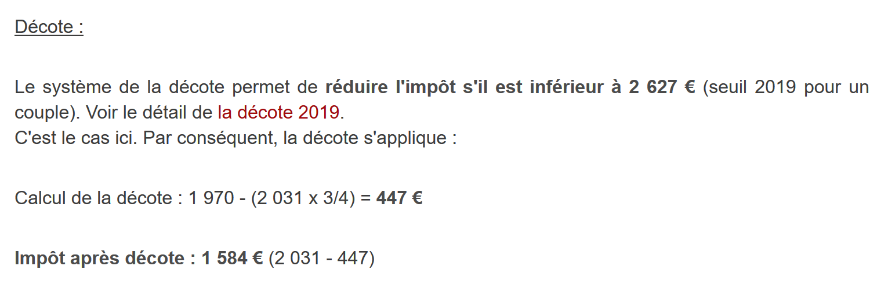
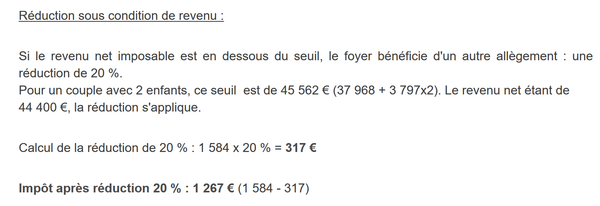

Exercice d'application – versions 1 et 2
========================================

Le problème
-----------

|image0|

Le tableau ci-dessus permet de calculer l’impôt dans le cas simplifié
d'un contribuable n'ayant que son seul salaire à déclarer. Comme
l’indique la note (1), l’impôt ainsi calculé est l’impôt avant trois
mécanismes :

-  le plafonnement du quotient familial qui intervient pour les hauts
   revenus ;

-  la décôte et la réduction d’impôts qui interviennent pour les faibles
   revenus ;

Ainsi le calcul de l’impôt comprend les étapes suivantes
**[http://impotsurlerevenu.org/comprendre-le-calcul-de-l-impot/1217-calcul-de-l-impot-2019.php]** :

|image1|

On se propose d'écrire un programme permettant de calculer l'impôt d'un
contribuable dans le cas simplifié d'un contribuable n'ayant que son
seul salaire à déclarer :

Calcul de l’impôt brut
~~~~~~~~~~~~~~~~~~~~~~

L’impôt brut peut être calculé de la façon suivante :

On calcule d’abord le nombre de parts du contribuable :

-  chaque parent amène 1 part ;

-  les deux premiers enfants amènent chacun 1/2 part ;

-  les enfants suivants amènent une part chacun :

Le nombre de part est donc :

-  **nbParts=1+nbEnfants*0,5+(nbEnfants-2)*0,5** si le salarié n’est pas
   marié ;

-  **nbParts=2+nbEnfants*0,5+(nbEnfants-2)*0,5** s'il est marié ;

..

   où *nbEnfants* est son nombre d'enfants ;

-  on calcule le revenu imposable **R=0.9*S** où *S* est le salaire
   annuel ;

-  on calcule le quotient familial **QF=R/nbParts ;**

-  on calcule l’impôt brut **I** d'après les données suivantes (2019) :

====== ==== ========
9964   0    0
27519  0.14 1394.96
73779  0.3  5798
156244 0.41 13913.69
0      0.45 20163.45
====== ==== ========

Chaque ligne a 3 champs : *champ1*, *champ2*, *champ3*. Pour calculer
l'impôt I, on recherche la première ligne où *QF<=champ1* et on prend
les valeurs de cette ligne. Par exemple, pour un salarié marié avec deux
enfants et un salaire annuel S de **50000** euros :

Revenu imposable : **R**\ =0,9*S=45000

Nombre de parts : **nbParts**\ =2+2*0,5=3

Quotient familial : **QF**\ =45000/3=15000

La 1\ :sup:`re` ligne où QF<=champ1 est la suivante :

.. code-block:: php 
   :linenos:

   	27519		0.14	1394.96

L'impôt *I* est alors égal à **0.14*R –
1394,96*nbParts**\ =\ **[0,14*45000-1394,96*3]**\ =\ **2115**. L’impôt
est arrondi à l’euro inférieur.

Si la relation *QF<=champ1* dès la 1\ :sup:`re` ligne, alors l’impôt est
nul.

Si QF est tel que la relation *QF<=champ1* n'est jamais vérifiée, alors
ce sont les coefficients de la dernière ligne qui sont utilisés. Ici :

.. code-block:: php 
   :linenos:

   	0			0.45		20163.45

ce qui donne l'impôt brut I=\ **0.45*R – 20163,45*nbParts**.

Plafonnement du quotient familial
~~~~~~~~~~~~~~~~~~~~~~~~~~~~~~~~~

|image2|

Pour savoir si le plafonnement du quotient familial QF s’applique, on
refait le calcul de l’impôt brut sans les enfants. Toujours pour le
salarié marié avec deux enfants et un salaire annuel S de **50000**
euros :

Revenu imposable : **R**\ =0,9*S=45000

Nombre de parts : **nbParts**\ =2 (on ne compte plus les enfants)

Quotient familial : **QF**\ =45000/2=22500

La 1\ :sup:`re` ligne où QF<=champ1 est la suivante :

.. code-block:: php 
   :linenos:

   	27519		0.14	1394.96

L'impôt *I* est alors égal à **0.14*R –
1394,96*nbParts**\ =\ **[0,14*45000-1394,96*2]**\ =\ **3510**.

Gain maximal lié aux enfants : 1551 \* 2 = 3102 euros

Impôt minimal : 3510-3102 = 408 euros

L’impôt brut avec 3 parts déjà calculé 2115 euros est supérieur à
l’impôt minimal 408 euros, donc le plafonnement familial ne s’applique
pas ici.

De façon générale, l’impôt brut est **sup(impôt1, impôt2)** où :

-  **[impôt1]** : est l’impôt brut calculé avec les enfants ;

-  **[impôt2]** : est l’impôt brut calculé sans les enfants et diminué
   du gain maximal (ici 1551 euros par demi-part) lié aux enfants ;

   1. .. rubric:: Calcul de la décôte
         :name: calcul-de-la-décôte

|image3|

Toujours pour le salarié marié avec deux enfants et un salaire annuel S
de **50000** euros :

L’impôt brut (2115) issu de l’étape précédente est inférieur à 2627
euros pour un couple (1595 euros pour un célibataire) : la décôte
s’applique donc. Elle est obtenue avec le calcul suivant :

décôte= seuil (couple=1970/célibataire=1196)-0,75\* Impôt brut

**décôte**\ =1970-0,75*2115=383,75 arrondi à **384** euros.

**Nouvel Impôt brut**\ = 2115-384= **1731** euros

Calcul de la réduction d’impôts
~~~~~~~~~~~~~~~~~~~~~~~~~~~~~~~

|image4|

Au-dessous d’un certain seuil, une réduction de 20 % est faite sur
l’impôt brut issu des calculs précédents. En 2019, les seuils sont les
suivants :

-  célibataire  : 21037 euros ;

-  couple : 42074 euros ; ( le chiffre 37968 utilisé dans l’exemple
   ci-dessus semble erroné) ;

Ce seuil est augmenté de la valeur : 3797 \* (nombre de demi-parts
amenées par les enfants).

Toujours pour le salarié marié avec deux enfants et un salaire annuel S
de **50000** euros :

-  son revenu imposable (45000 euros) est inférieur au seuil
   (42074+2*3797)=49668 euros ;

-  il a donc droit à une réduction réduction de 20 % de son impôt : 1731
   \* 0,2= 346,2 euros arrondi à 347 euros ;

-  l’impôt brut du contribuable devient : 1731-347= **1384** euros ;

   1. .. rubric:: Calcul de l’impôt net
         :name: calcul-de-limpôt-net

Notre calcul s’arrêtera là : l’impôt net à payer sera de **1384** euros.
Dans la réalité, le contribuable peut bénéficier d’autres réductions
notamment pour des dons à des organismes d’intérêt public ou général.

Cas des hauts revenus
~~~~~~~~~~~~~~~~~~~~~

Notre exemple précédent correspond à la majorité des cas de salariés.
Cependant le calcul de l’impôt est différent dans le cas des hauts
revenus.

Plafonnement de la réduction de 10 % sur les revenus annuels
^^^^^^^^^^^^^^^^^^^^^^^^^^^^^^^^^^^^^^^^^^^^^^^^^^^^^^^^^^^^

Dans la plupart des cas, le revenu imposable est obtenu par la formule :
R=0,9*S où S est le salaire annuel. On appelle cela la réduction des
10 %. Cette réduction est plafonnée. En 2019 :

-  elle ne peut être supérieure à 12502 euros ;

-  elle ne peut être inférieure à 437 euros ;

Prenons le cas d’un salarié non marié sans enfants et un salaire annuel
de 200000 euros :

-  la réduction de 10 % est de 20000 euros > 12502 euros. Elle est donc
   ramenée à 12502 euros ;

   1. .. rubric:: Plafonnement du quotient familial
         :name: plafonnement-du-quotient-familial-1

Prenon un cas où le plafonnement familial présenté au paragraphe
`lien <#plafonnement-du-quotient-familial>`__ intervient. Prenons le cas
d’un couple avec trois enfants et des revenus annuels de 100000 euros.
Reprenons les étapes du calcul :

-  l’abattement de 10 % est de 10000 euros < 12502 euros. Le revenu
   imposable **R** est donc 100000-10000=90000 euros ;

-  le couple a **nbParts**\ =2+0,5*2+1=\ **4** parts ;

-  son quotient familial est donc **QF**\ =
   R/nbParts=90000/4=\ **22500** euros ;

-  son impôt brut **I1** **avec** enfants est I1=0,14*90000-1394,96*4=
   7020 euros ;

-  son impôt brut **I2** **sans** enfants :

   -  **QF**\ =90000/2=45000 euros ;

   -  **I2**\ =0,3*90000-5798*2=15404 euros ;

   -  la règle du plafonnement du quotient familial dit que le gain
      amené par les enfants ne peut dépasser (1551*4 demi-parts)=6204
      euros. Or ici, il est I2-I1=15404-7020= 8384 euros, donc supérieur
      à 6204 euros ;

   -  l’impôt brut est donc recalculé comme
      **I3**\ =\ **I2**-6204=15404-6204= **9200** euros ;

Ce couple n’aura ni décôte, ni réduction et son impôt final sera de
**9200** euros.

Chiffres officiels
~~~~~~~~~~~~~~~~~~

Le calcul de l’impôt est complexe. Tout au long du document, les tests
seront faits avec les exemples suivants. Les résultats sont ceux du
simulateur de l’administration fiscale
**[**\ https://www3.impots.gouv.fr/simulateur/calcul_impot/2019/simplifie/index.htm\ **]** :

+----------------------+----------------------+----------------------+
| **Contribuable**     | **Résultats          | **Résultats de       |
|                      | officiels**          | l’algorithme du      |
|                      |                      | document**           |
+======================+======================+======================+
| Couple avec 2        | Impôt=\ **2815**     | Impôt=\ **2814**     |
| enfants et des       | euros                | euros                |
| revenus annuels de   |                      |                      |
| 55555 euros          | Taux                 | Taux                 |
|                      | d’imposition=14 %    | d’imposition=14 %    |
+----------------------+----------------------+----------------------+
| Couple avec 2        | Impôt=\ **1385**     | Impôt=\ **1384**     |
| enfants et des       | euros                | euros                |
| revenus annuels de   |                      |                      |
| 50000 euros          | Décôte=720 euros     | Décôte=384 euros     |
|                      |                      |                      |
|                      | Réduction=0 euros    | Réduction=347 euros  |
|                      |                      |                      |
|                      | Taux                 | Taux                 |
|                      | d’imposition=14 %    | d’imposition=14 %    |
+----------------------+----------------------+----------------------+
| Couple avec 3        | Impôt=\ **0** euro   | Impôt=\ **0** euro   |
| enfants et des       |                      |                      |
| revenus annuels de   | Décôte=384 euros     | Décôte=720 euros     |
| 50000 euros          |                      |                      |
|                      | Réduction=346 euros  | Réduction=0 euro     |
|                      |                      |                      |
|                      | Taux                 | Taux                 |
|                      | d’imposition=14 %    | d’imposition=14 %    |
+----------------------+----------------------+----------------------+
| Célibataire avec 2   | Impôt=\ **19884**    | Impôt=\ **19884**    |
| enfants et des       | euros                | euros                |
| revenus annuels de   |                      |                      |
| 100000 euros         | Décôte=0 euro        | Surcôte=4480 euros   |
|                      |                      |                      |
|                      | Réduction=0 euro     | Décôte=0 euro        |
|                      |                      |                      |
|                      | Taux                 | Réduction=0 euro     |
|                      | d’imposition=41 %    |                      |
|                      |                      | Taux                 |
|                      |                      | d’imposition=41 %    |
+----------------------+----------------------+----------------------+
| Célibataire avec 3   | Impôt=\ **16782**    | Impôt=\ **16782**    |
| enfants et des       | euros                | euros                |
| revenus annuels de   |                      |                      |
| 100000 euros         | Décôte=0 euro        | Surcôte=7176 euros   |
|                      |                      |                      |
|                      | Réduction=0 euro     | Décôte=0 euro        |
|                      |                      |                      |
|                      | Taux                 | Réduction=0 euro     |
|                      | d’imposition=41 %    |                      |
|                      |                      | Taux                 |
|                      |                      | d’imposition=41 %    |
+----------------------+----------------------+----------------------+
| Couple avec 3        | Impôt=\ **9200**     | Impôt=\ **9200**     |
| enfants et des       | euros                | euros                |
| revenus annuels de   |                      |                      |
| 100000 euros         | Décôte=0 euro        | Surcôte=2180 euros   |
|                      |                      |                      |
|                      | Réduction=0 euro     | Décôte=0 euro        |
|                      |                      |                      |
|                      | Taux                 | Réduction=0 euro     |
|                      | d’imposition=30 %    |                      |
|                      |                      | Taux                 |
|                      |                      | d’imposition=30 %    |
+----------------------+----------------------+----------------------+
| Couple avec 5        | Impôt=\ **4230**     | Impôt=\ **4230**     |
| enfants et des       | euros                | euros                |
| revenus annuels de   |                      |                      |
| 100000 euros         | Décôte=0 euro        | Décôte=0 euro        |
|                      |                      |                      |
|                      | Réduction=0 euro     | Réduction=0 euro     |
|                      |                      |                      |
|                      | Taux                 | Taux                 |
|                      | d’imposition=14 %    | d’imposition=14 %    |
+----------------------+----------------------+----------------------+
| Célibataire sans     | Impôt=\ **22986**    | Impôt= **22986**     |
| enfants et des       | euros                | euros                |
| revenus annuels de   |                      |                      |
| 100000 euros         | Décôte=0 euro        | Surcôte=0 euro       |
|                      |                      |                      |
|                      | Réduction=0 euro     | Décôte=0 euro        |
|                      |                      |                      |
|                      | Taux                 | Réduction=0 euro     |
|                      | d’imposition=41 %    |                      |
|                      |                      | Taux                 |
|                      |                      | d’imposition=41 %    |
+----------------------+----------------------+----------------------+
| Couple avec 2        | Impôt=\ **0** euro   | Impôt=\ **0** euro   |
| enfants et des       |                      |                      |
| revenus annuels de   | Décôte=0 euro        | Décôte=0 euro        |
| 30000 euros          |                      |                      |
|                      | Réduction=0 euro     | Réduction=0 euro     |
|                      |                      |                      |
|                      | Taux                 | Taux                 |
|                      | d’imposition=0 %     | d’imposition=0 %     |
+----------------------+----------------------+----------------------+
| Célibataire sans     | Impôt=\ **64211**    | Impôt= **64210**     |
| enfants et des       | euro                 | euros                |
| revenus annuels de   |                      |                      |
| 200000 euros         | Décôte=0 euro        | Surcôte=7498 euros   |
|                      |                      |                      |
|                      | Réduction=0 euro     | Décôte=0 euro        |
|                      |                      |                      |
|                      | Taux                 | Réduction=0 euro     |
|                      | d’imposition=45 %    |                      |
|                      |                      | Taux                 |
|                      |                      | d’imposition=45 %    |
+----------------------+----------------------+----------------------+
| Couple avec 3        | Impôt=\ **42843**    | Impôt=\ **42842**    |
| enfants et des       | euro                 | euros                |
| revenus annuels de   |                      |                      |
| 200000 euros         | Décôte=0 euro        | Surcôte=17283 euros  |
|                      |                      |                      |
|                      | Réduction=0 euro     | Décôte=0 euro        |
|                      |                      |                      |
|                      | Taux                 | Réduction=0 euro     |
|                      | d’imposition=41 %    |                      |
|                      |                      | Taux                 |
|                      |                      | d’imposition=41 %    |
+----------------------+----------------------+----------------------+

Ci-dessus, on appelle surcôte, ce que paient en plus les hauts revenus à
cause de deux phénomènes :

-  le plafonnement de l’abattement de 10 % sur les revenus annuels ;

-  le plafonnement du quotient familial ;

Cet indicateur n’a pu être vérifié car le simulateur de l’administration
fiscale ne le donne pas.

On voit que l’algorithme du document donne un impôt juste à chaque fois,
avec cependant une marge d’erreur de 1 euro. Cette marge d’erreur
provient des arrondis. Toutes les sommes d’argent sont arrondies parfois
à l’euro supérieur, parfois à l’euro inférieur. Comme je ne connaissais
pas les règles officielles, les sommes d’argent de l’algorithme du
document ont été arrondies :

-  à l’euro supérieur pour les décôtes et réductions ;

-  à l’euro inférieur pour les surcôtes et l’impôt final ;

Dans la suite, des tests seront établis pour vérifier la validité des
résultats. Ils seront faits avec les exemples du tableau précédent avec
une marge d’erreur acceptée de 1 euro.

L’arborescence des scripts
--------------------------

|image5|

Version 1
---------

L’algorithme
~~~~~~~~~~~~

Nous présentons un premier programme où :

-  les données nécessaires au calcul de l'impôt sont codées en dur dans
   le code sous forme de tableaux et de constantes ;

-  les données des contribuables (marié, enfants, salaire) sont dans un
   premier fichier texte **[taxpayersdata.txt]** ;

-  les résultats du calcul de l'impôt (marié, enfants, salaire, impôt)
   sont mémorisés dans un second fichier texte **[resultats.txt]** ;

Le script **[version-01/main.php]** est le suivant :

.. code-block:: php 
   :linenos:

   <?php

   // types stricts pour les paramètres de fonctions
   declare(strict_types=1);

   // constantes globales
   define("PLAFOND_QF_DEMI_PART", 1551);
   define("PLAFOND_REVENUS_CELIBATAIRE_POUR_REDUCTION", 21037);
   define("PLAFOND_REVENUS_COUPLE_POUR_REDUCTION", 42074);
   define("VALEUR_REDUC_DEMI_PART", 3797);
   define("PLAFOND_DECOTE_CELIBATAIRE", 1196);
   define("PLAFOND_DECOTE_COUPLE", 1970);
   define("PLAFOND_IMPOT_COUPLE_POUR_DECOTE", 2627);
   define("PLAFOND_IMPOT_CELIBATAIRE_POUR_DECOTE", 1595);
   define("ABATTEMENT_DIXPOURCENT_MAX", 12502);
   define("ABATTEMENT_DIXPOURCENT_MIN", 437);

   // définition des constantes locales
   $DATA = "taxpayersdata.txt";
   $RESULTATS = "resultats.txt";
   $limites = array(9964, 27519, 73779, 156244, 0);
   $coeffR = array(0, 0.14, 0.3, 0.41, 0.45);
   $coeffN = array(0, 1394.96, 5798, 13913.69, 20163.45);

   // lecture des données
   $data = fopen($DATA, "r");
   if (!$data) {
     print "Impossible d'ouvrir en lecture le fichier des données [$DATA]\n";
     exit;
   }

   // ouverture fichier des résultats
   $résultats = fopen($RESULTATS, "w");
   if (!$résultats) {
     print "Impossible de créer le fichier des résultats [$RESULTATS]\n";
     exit;
   }

   // on exploite la ligne courante du fichier des données
   while ($ligne = fgets($data, 100)) {
     // on enlève l'éventuelle marque de fin de ligne
     $ligne = cutNewLineChar($ligne);
     // on récupère les 3 champs marié:enfants:salaire qui forment $ligne
     list($marié, $enfants, $salaire) = explode(",", $ligne);
     // on calcule l'impôt
     $result = calculImpot($marié, (int) $enfants, (float) $salaire, $limites, $coeffR, $coeffN);
     // on inscrit le résultat dans le fichier des résultats
     $result = ["marié" => $marié, "enfants" => $enfants, "salaire" => $salaire] + $result;
     fputs($résultats, \json_encode($result, JSON_UNESCAPED_UNICODE) . "\n");
     // donnée suivante
   }
   // on ferme les fichiers
   fclose($data);
   fclose($résultats);

   // fin
   exit;

   // --------------------------------------------------------------------------
   function cutNewLinechar(string $ligne): string {
     // on supprime la marque de fin de ligne de $ligne si elle existe
     $L = strlen($ligne);  // longueur ligne
     while (substr($ligne, $L - 1, 1) === "\n" or substr($ligne, $L - 1, 1) === "\r") {
       $ligne = substr($ligne, 0, $L - 1);
       $L--;
     }
     // fin
     return($ligne);
   }

   // calcul de l'impôt
   // --------------------------------------------------------------------------
   function calculImpot(string $marié, int $enfants, float $salaire, array $limites, array $coeffR, array $coeffN): array {
     …
     // résultat
     return ["impôt" => floor($impot), "surcôte" => $surcôte, "décôte" => $décôte, "réduction" => $réduction, "taux" => $taux];
   }

   // --------------------------------------------------------------------------
   function calculImpot2(string $marié, int $enfants, float $salaire, array $limites, array $coeffR, array $coeffN): array {
     …
     // résultat
     return ["impôt" => $impôt, "surcôte" => $surcôte, "taux" => $coeffR[$i]];
   }

   // revenuImposable=salaireAnnuel-abattement
   // l'abattement a un min et un max
   function getRevenuImposable(float $salaire): float {
     …
     // résultat
     return floor($revenuImposable);
   }

   // calcule une décôte éventuelle
   function getDecote(string $marié, float $salaire, float $impots): float {
     …
     // résultat
     return ceil($décôte);
   }

   // calcule une réduction éventuelle
   function getRéduction(string $marié, float $salaire, int $enfants, float $impots): float {
     /…
     // résultat
     return ceil($réduction);
   }

Le fichier des données *taxpayersdata.txt* (marié, enfants, salaire) :

.. code-block:: php 
   :linenos:

   oui,2,55555
   oui,2,50000
   oui,3,50000
   non,2,100000
   non,3,100000
   oui,3,100000
   oui,5,100000
   non,0,100000
   oui,2,30000
   non,0,200000
   oui,3,200000

Les fichier *résultats.txt* (marié, enfants, salaire, impôt, surcôte,
décôte, réduction, taux d’imposition) des résultats obtenus :

.. code-block:: php 
   :linenos:

   {"marié":"oui","enfants":"2","salaire":"55555","impôt":2814,"surcôte":0,"décôte":0,"réduction":0,"taux":0.14}
   {"marié":"oui","enfants":"2","salaire":"50000","impôt":1384,"surcôte":0,"décôte":384,"réduction":347,"taux":0.14}
   {"marié":"oui","enfants":"3","salaire":"50000","impôt":0,"surcôte":0,"décôte":720,"réduction":0,"taux":0.14}
   {"marié":"non","enfants":"2","salaire":"100000","impôt":19884,"surcôte":4480,"décôte":0,"réduction":0,"taux":0.41}
   {"marié":"non","enfants":"3","salaire":"100000","impôt":16782,"surcôte":7176,"décôte":0,"réduction":0,"taux":0.41}
   {"marié":"oui","enfants":"3","salaire":"100000","impôt":9200,"surcôte":2180,"décôte":0,"réduction":0,"taux":0.3}
   {"marié":"oui","enfants":"5","salaire":"100000","impôt":4230,"surcôte":0,"décôte":0,"réduction":0,"taux":0.14}
   {"marié":"non","enfants":"0","salaire":"100000","impôt":22986,"surcôte":0,"décôte":0,"réduction":0,"taux":0.41}
   {"marié":"oui","enfants":"2","salaire":"30000","impôt":0,"surcôte":0,"décôte":0,"réduction":0,"taux":0}
   {"marié":"non","enfants":"0","salaire":"200000","impôt":64210,"surcôte":7498,"décôte":0,"réduction":0,"taux":0.45}
   {"marié":"oui","enfants":"3","salaire":"200000","impôt":42842,"surcôte":17283,"décôte":0,"réduction":0,"taux":0.41}

**Commentaires**

-  ligne 4 : on force le respect strict du type des paramètres des
   fonctions ;

-  lignes 7-16 : définition de toutes les constantes nécessaire au
   calcul de l’impôt ;

-  ligne 19 : le nom du fichier texte contenant les données des
   contribuables (marié, enfants, salaire) ;

-  ligne 20 : le nom du fichier texte contenant les résultats (marié,
   enfants, salaire, impôt) du calcul de l'impôt ;

-  lignes 21-23 : les trois tableaux des données définissant les
   différentes tranches d’imposition du calcul de l'impôt ;

-  lignes 26-30 : ouverture en lecture **[r]** du fichier des données
   contribuables. La fonction **[fopen]** rend le booléen FALSE si
   l’ouverture n’a pu se faire ;

-  lignes 33-37 : ouverture en écriture **[w]** du fichier des
   résultats ;

-  lignes 40-51 : boucle de lecture des lignes (marié, enfants, salaire)
   du fichier des données contribuables ;

-  ligne 40 : la fonction **[fgets]** lit 100 caractères et s’arrête à
   la 1\ :sup:`re` marque de fin de ligne rencontrée. Ici toutes les
   lignes font moins de 100 caractères. Si une marque de fin de ligne a
   été rencontrée, elle est incluse dans la chaîne rendue. Lorsque la
   fin du fichier est rencontrée, la fonction **[fgets]** rend la valeur
   FALSE ;

-  ligne 42 : la marque de fin de ligne est enlevée ;

-  ligne 44 : les composantes (marié, enfants, salaire) de la ligne sont
   récupérées ;

-  ligne 46 : l'impôt est calculé. Le résultat est rendu sous la forme
   d’un tableau associatif (ligne 76) ;

-  ligne 48 : au tableau récupéré précédemment, on rajoute les clés
   **[marié, enfants, salaire]** ;

-  ligne 49 : le résultat est mémorisé dans le fichier des résultats
   sous la forme d’une chaîne jSON ;

-  lignes 53-54 : une fois le fichier des données contribuables exploité
   totalement, les fichiers sont fermés ;

-  ligne 60 : la fonction qui supprime la marque de fin de ligne d'une
   ligne $\ *ligne*. La marque de fin de ligne est la chaîne "\r\n" sur
   les systèmes windows, "\n" sur les systèmes Unix. Le résultat est la
   chaîne d'entrée sans sa marque de fin de ligne.

-  lignes 63-64 : *substr($chaîne,$début,$taille)* est la sous-chaîne de
   $\ *chaîne* commençant au caractère $\ *début* et ayant au plus
   $\ *taille* caractères ;

La fonction **[calculImpot]** est la suivante :

.. code-block:: php 
   :linenos:

   // constantes globales
   define("PLAFOND_QF_DEMI_PART", 1551);
   // calcul de l'impôt
   // --------------------------------------------------------------------------
   function calculImpot(string $marié, int $enfants, float $salaire, array $limites, array $coeffR, array $coeffN): array {
     // $marié : oui, non
     // $enfants : nombre d'enfants
     // $salaire : salaire annuel
     // $limites, $coeffR, $coeffN : les tableaux des données permettant le calcul de l'impôt
     //
     // calcul de l'impôt avec enfants
     $result1 = calculImpot2($marié, $enfants, $salaire, $limites, $coeffR, $coeffN);
     $impot1 = $result1["impôt"];
     // calcul de l'impôt sans les enfants
     if ($enfants != 0) {
       $result2 = calculImpot2($marié, 0, $salaire, $limites, $coeffR, $coeffN);
       $impot2 = $result2["impôt"];
       // application du plafonnement du quotient familial
       if ($enfants < 3) {
         // $PLAFOND_QF_DEMI_PART euros pour les 2 premiers enfants
         $impot2 = $impot2 - $enfants * PLAFOND_QF_DEMI_PART;
       } else {
         // $PLAFOND_QF_DEMI_PART euros pour les 2 premiers enfants, le double pour les suivants
         $impot2 = $impot2 - 2 * PLAFOND_QF_DEMI_PART - ($enfants - 2) * 2 * PLAFOND_QF_DEMI_PART;
       }
     } else {
       $impot2 = $impot1;
       $result2 = $result1;
     }
     // on prend l'impôt le plus fort avec le taux et la surcôte qui vont avec
     if ($impot1 > $impot2) {
       $impot = $impot1;
       $taux = $result1["taux"];
       $surcôte = $result1["surcôte"];
     } else {
       $surcôte = $impot2 - $impot1 + $result2["surcôte"];
       $impot = $impot2;
       $taux = $result2["taux"];
     }
     // calcul d'une éventuelle décôte
     $décôte = getDecote($marié, $salaire, $impot);
     $impot -= $décôte;
     // calcul d'une éventuelle réduction d'impôts
     $réduction = getRéduction($marié, $salaire, $enfants, $impot);
     $impot -= $réduction;
     // résultat
     return ["impôt" => floor($impot), "surcôte" => $surcôte, "décôte" => $décôte, "réduction" => $réduction, "taux" => $taux];
   }

   // --------------------------------------------------------------------------
   function calculImpot2(string $marié, int $enfants, float $salaire, array $limites, array $coeffR, array $coeffN): array {
     …
     // résultat
     return ["impôt" => $impôt, "surcôte" => $surcôte, "taux" => $coeffR[$i]];
   }

   // revenuImposable=salaireAnnuel-abattement
   // l'abattement de 10 % a un min et un max
   function getRevenuImposable(float $salaire): float {
     …
   }

   // calcule une décôte éventuelle
   function getDecote(string $marié, float $salaire, float $impots): float {
     …
     // résultat
     return ceil($décôte);
   }

   // calcule une réduction éventuelle
   function getRéduction(string $marié, float $salaire, int $enfants, float $impots): float {
     …
     // résultat
     return ceil($réduction);
   }

**Commentaires**

-  ligne 10 : l’impôt brut est calculé avec les enfants. On obtient un
   résultat sous la forme **["impôt" => $impôt, "surcôte" => $surcôte,
   "taux" => $coeffR[$i]**] avec :

   -  **[‘impôt’]** : l’impôt brut ;

   -  **[‘surcôte’]** : le montant de la surcôte s’il y a. Celle-ci
      existe lorsque l’abattement de 10 % dépasse le seuil de 12502
      euros ;

   -  **[‘taux’]** : le taux d’imposition du contribuable ;

-  ligne 11 : l’impôt **[impot1]** brut à payer ;

-  lignes 13-14 : si le contribuable a au moins un enfant, le calcul de
   l’impôt est refait avec les mêmes données mais avec 0 enfant. Ce
   second calcul est nécessaire pour voir si la réduction amenée par les
   enfants (nbParts*coeffN) est supérieure à un certain seuil ;

-  ligne 15 : l’impôt brut **[impot2]** à payer ;

-  lignes 16-23 : pour l’impôt brut **[impot2]**, on fait jouer
   maintenant les enfants : chaque 1/2 part amenée par les enfants
   permet une réduction de **[PLAFOND_QF_DEMI_PART]** euros ;

-  lignes 25-26 : cas où le contribuable n’a pas d’enfants. Dans ce cas,
   le calcul de **[impot2]** est inutile. Il est égal à **[impot1]** ;

-  lignes 29-37 : deux impôts bruts ont été calculés **[impot1,
   impot2]**. L’administration fiscale retient le plus fort des deux. On
   obtient un impôt brut **[impot]** ;

-  lignes 39-40 : le montant brut **[impot]** peut subir une décôte ;

-  lignes 42-43 : le montant brut **[impot]** peut subir une réduction ;

-  ligne 45 : **[impot]** est désormais l’impôt net à payer. On rend les
   résultats ;

La fonction **[calculImpot2]** est la suivante :

.. code-block:: php 
   :linenos:

   // --------------------------------------------------------------------------
   function calculImpot2(string $marié, int $enfants, float $salaire, array $limites, array $coeffR, array $coeffN): array {
     // $marié : oui, non
     // $enfants : nombre d'enfants
     // $salaire : salaire annuel
     // $limites, $coeffR, $coeffN : les tableaux des données permettant le calcul de l'impôt
     //
     // nombre de parts
     $marié = strtolower($marié);
     if ($marié === "oui") {
       $nbParts = $enfants / 2 + 2;
     } else {
       $nbParts = $enfants / 2 + 1;
     }
     // 1 part par enfant à partir du 3e
     if ($enfants >= 3) {
       // une demi-part de + pour chaque enfant à partir du 3e
       $nbParts += 0.5 * ($enfants - 2);
     }
     // revenu imposable
     $revenuImposable = getRevenuImposable($salaire);
     // surcôte
     $surcôte = floor($revenuImposable - 0.9 * $salaire);
     // pour des pbs d'arrondi
     if ($surcôte < 0) {
       $surcôte = 0;
     }
     // quotient familial
     $quotient = $revenuImposable / $nbParts;
     // est mis à la fin du tableau limites pour arrêter la boucle qui suit
     $limites[count($limites) - 1] = $quotient;
     // calcul de l'impôt
     $i = 0;
     while ($quotient > $limites[$i]) {
       $i++;
     }
     // du fait qu'on a placé $quotient à la fin du tableau $limites, la boucle précédente
     // ne peut déborder du tableau $limites
     // maintenant on peut calculer l'impôt
     $impôt = floor($revenuImposable * $coeffR[$i] - $nbParts * $coeffN[$i]);
     // résultat
     return ["impôt" => $impôt, "surcôte" => $surcôte, "taux" => $coeffR[$i]];
   }

   // revenuImposable=salaireAnnuel-abattement
   // l'abattement a un min et un max
   function getRevenuImposable(float $salaire): float {
     
     // résultat
     return floor($revenuImposable);
   }

**Commentaires**

-  on applique ici le calcul de l’impôt dit au barême progressif ;

-  ligne 9 : *strtolower($chaîne)* rend $\ *chaîne* en minuscules ;

-  lignes 10-19 : calcul du nombre de parts du contribuable ;

-  ligne 21 : on calcule le revenu imposable à l’aide d’une fonction. En
   effet, on a vu que ce n’est pas toujours 0.9*revenusAnnuels.
   L’abattement de 10 % est en effet limité à 12502 euros ;

-  ligne 23 : calcul de l’éventuelle surcôte si le revenu imposable est
   supérieur à 0.9*revenusAnnuels ;

-  lignes 25-27 : corrige le fait qu’à cause d’erreurs d’arrondis, on a
   parfois **[$surcôte=-1]** ;

-  ligne 29 : le quotient familial ;

-  lignes 30-36 : ce quotient permet de trouver la tranche d’imposition
   du contribuable ;

-  ligne 40 : une fois la tranche d’imposition du contribuable trouvée,
   son impôt brut peut être calculé. La fonction *floor($x)* rend la
   valeur entière immédiatement inférieure à **[$x]** ;

-  ligne 42 : on rend les informations calculées ;

La fonction **[getRevenuImposable]** est la suivante :

.. code-block:: php 
   :linenos:

   // constantes globales
   define("ABATTEMENT_DIXPOURCENT_MAX", 12502);
   define("ABATTEMENT_DIXPOURCENT_MIN", 437);
   // revenuImposable=salaireAnnuel-abattement
   // l'abattement a un min et un max
   function getRevenuImposable(float $salaire): float {
     // abattement de 10% du salaire
     $abattement = 0.1 * $salaire;
     // cet abattement ne peut dépasser ABATTEMENT_DIXPOURCENT_MAX
     if ($abattement > ABATTEMENT_DIXPOURCENT_MAX) {
       $abattement = ABATTEMENT_DIXPOURCENT_MAX;
     }
     // l'abattement ne peut être inférieur à ABATTEMENT_DIXPOURCENT_MIN
     if ($abattement < ABATTEMENT_DIXPOURCENT_MIN) {
       $abattement = ABATTEMENT_DIXPOURCENT_MIN;
     }
     // revenu imposable
     $revenuImposable = $salaire - $abattement;
     // résultat
     return floor($revenuImposable);
   }

**Commentaires**

-  ligne 5 : l’abattement normal est de 10 % du salaire annuel ;

-  lignes 7-9 : l’abattement ne peut dépasser l’abattement maximal
   **[ABATTEMENT_DIXPOURCENT_MAX]** ;

-  lignes 10-13 : l’abattement ne peut être inférieur à l’abattement
   minimal **[ABATTEMENT_DIXPOURCENT_MIN]** ;

-  ligne 15 : calcul du revenu imposable ;

La fonction **[getDecote]** est la suivante :

.. code-block:: php 
   :linenos:

   // constantes globales
   define("PLAFOND_DECOTE_CELIBATAIRE", 1196);
   define("PLAFOND_DECOTE_COUPLE", 1970);
   define("PLAFOND_IMPOT_COUPLE_POUR_DECOTE", 2627);
   define("PLAFOND_IMPOT_CELIBATAIRE_POUR_DECOTE", 1595);
   // calcule une décôte éventuelle
   function getDecote(string $marié, float $salaire, float $impots): float {
     // au départ, une décôt nulle
     $décôte = 0;
     // montant maximal d'impôt pour avoir la décôte
     $plafondImpôtPourDécôte = $marié === "oui" ? PLAFOND_IMPOT_COUPLE_POUR_DECOTE : PLAFOND_IMPOT_CELIBATAIRE_POUR_DECOTE;
     if ($impots < $plafondImpôtPourDécôte) {
       // montant maximal de la décôte
       $plafondDécôte = $marié === "oui" ? PLAFOND_DECOTE_COUPLE : PLAFOND_DECOTE_CELIBATAIRE;
       // décôte théorique
       $décôte = $plafondDécôte - 0.75 * $impots;
       // la décôte ne peut dépasser le montant de l'impôt
       if ($décôte > $impots) {
         $décôte = $impots;
       }
       // pas de décôte <0
       if ($décôte < 0) {
         $décôte = 0;
       }
     }
     // résultat
     return ceil($décôte);
   }

**Commentaires**

-  ligne 6 : montant maximal de l’impôt brut pour avoir droit à une
   décôte. Ce montant est différent pour les célibataires et les
   couples ;

-  ligne 7 : si le contribuable a droit à la décôte ;

-  ligne 11 : la formule de la décôte. **[plafondDécôte]** est le
   montant maximal de la décôte. Ce montant maximal est calculé ligne 9.
   Là encore il dépend de la situation du contribuable, marié ou
   célibataire ;

-  lignes 13-15 : la décôte ne peut être supérieure à l’impôt brut à
   payer. C’est le cas par exemple si **[impots]** vaut 0 en ligne 11 ;

-  lignes 17-19 : pour éviter un arrondi à -1 ;

La fonction **[getRéduction]** est la suivante :

.. code-block:: php 
   :linenos:

   // constantes globales
   define("PLAFOND_REVENUS_CELIBATAIRE_POUR_REDUCTION", 21037);
   define("PLAFOND_REVENUS_COUPLE_POUR_REDUCTION", 42074);
   define("VALEUR_REDUC_DEMI_PART", 3797);
   // calcule une réduction éventuelle
   function getRéduction(string $marié, float $salaire, int $enfants, float $impots): float {
     // le plafond des revenus pour avoir droit à la réduction de 20%
     $plafondRevenuPourRéduction = $marié === "oui" ? PLAFOND_REVENUS_COUPLE_POUR_REDUCTION : PLAFOND_REVENUS_CELIBATAIRE_POUR_REDUCTION;
     $plafondRevenuPourRéduction += $enfants * VALEUR_REDUC_DEMI_PART;
     if ($enfants > 2) {
       $plafondRevenuPourRéduction += ($enfants - 2) * VALEUR_REDUC_DEMI_PART;
     }
     // revenu imposable
     $revenuImposable = getRevenuImposable($salaire);
     // réduction
     $réduction = 0;
     if ($revenuImposable < $plafondRevenuPourRéduction) {
       // réduction de 20%
       $réduction = 0.2 * $impots;
     }
     // résultat
     return ceil($réduction);
   }

**Commentaires**

-  lignes 4-10 : pour avoir droit à une réduction d’impôt, il faut que
   le revenu imposable (ligne 10) soit inférieur à un plafond calculé
   lignes 4-8 ;

-  lignes 13-16 : s’il remplit les conditions, le contribuable a droit à
   une réduction d’impôt de 20 % (ligne 15) ;

   1. .. rubric:: Résultats
         :name: résultats

Le fichier des données *taxpayersdata.txt* (marié, enfants, salaire) :

.. code-block:: php 
   :linenos:

   oui,2,55555
   oui,2,50000
   oui,3,50000
   non,2,100000
   non,3,100000
   oui,3,100000
   oui,5,100000
   non,0,100000
   oui,2,30000
   non,0,200000
   oui,3,200000

Les fichier *résultats.txt* (marié, enfants, salaire, impôt, surcôte,
décôte, réduction, taux d’imposition) des résultats obtenus :

.. code-block:: php 
   :linenos:

   {"marié":"oui","enfants":"2","salaire":"55555","impôt":2814,"surcôte":0,"décôte":0,"réduction":0,"taux":0.14}
   {"marié":"oui","enfants":"2","salaire":"50000","impôt":1384,"surcôte":0,"décôte":384,"réduction":347,"taux":0.14}
   {"marié":"oui","enfants":"3","salaire":"50000","impôt":0,"surcôte":0,"décôte":720,"réduction":0,"taux":0.14}
   {"marié":"non","enfants":"2","salaire":"100000","impôt":19884,"surcôte":4480,"décôte":0,"réduction":0,"taux":0.41}
   {"marié":"non","enfants":"3","salaire":"100000","impôt":16782,"surcôte":7176,"décôte":0,"réduction":0,"taux":0.41}
   {"marié":"oui","enfants":"3","salaire":"100000","impôt":9200,"surcôte":2180,"décôte":0,"réduction":0,"taux":0.3}
   {"marié":"oui","enfants":"5","salaire":"100000","impôt":4230,"surcôte":0,"décôte":0,"réduction":0,"taux":0.14}
   {"marié":"non","enfants":"0","salaire":"100000","impôt":22986,"surcôte":0,"décôte":0,"réduction":0,"taux":0.41}
   {"marié":"oui","enfants":"2","salaire":"30000","impôt":0,"surcôte":0,"décôte":0,"réduction":0,"taux":0}
   {"marié":"non","enfants":"0","salaire":"200000","impôt":64210,"surcôte":7498,"décôte":0,"réduction":0,"taux":0.45}
   {"marié":"oui","enfants":"3","salaire":"200000","impôt":42842,"surcôte":17283,"décôte":0,"réduction":0,"taux":0.41}

Les résultats obtenus sont conformes à ceux obtenus avec le simulateur
de l’administration fiscale.

Conclusion
~~~~~~~~~~

L’algorithme de calcul de l’impôt, même dans des cas réputés simples,
est complexe. Nous ne reviendrons plus dessus. Au fil des versions, son
cœur restera le même malgré quelques changements de présentation. On ne
commentera alors que ces derniers.

Version 2
---------

Les modifications
~~~~~~~~~~~~~~~~~

Dans la version précédente, les données nécessaires au calcul de l’impôt
étaient codées en dur sous la forme de constantes et de tableaux. Cette
méthode est à prohiber. Dans la nouvelle version, ces données sont
externalisées dans un fichier jSON :

|image6|

Le contenu du fichier **[taxadmindata.json]** est le suivant :

.. code-block:: php 
   :linenos:

   {
       "limites": [9964, 27519, 73779, 156244, 0],
       "coeffR": [0, 0.14, 0.3, 0.41, 0.45],
       "coeffN": [0, 1394.96, 5798, 13913.69, 20163.45],
       "PLAFOND_QF_DEMI_PART": 1551,
       "PLAFOND_REVENUS_CELIBATAIRE_POUR_REDUCTION": 21037,
       "PLAFOND_REVENUS_COUPLE_POUR_REDUCTION": 42074,
       "VALEUR_REDUC_DEMI_PART": 3797,
       "PLAFOND_DECOTE_CELIBATAIRE": 1196,
       "PLAFOND_DECOTE_COUPLE": 1970,
       "PLAFOND_IMPOT_COUPLE_POUR_DECOTE": 2627,
       "PLAFOND_IMPOT_CELIBATAIRE_POUR_DECOTE": 1595,
       "ABATTEMENT_DIXPOURCENT_MAX": 12502,
       "ABATTEMENT_DIXPOURCENT_MIN": 437
   }

La nouvelle version **[version-02/main.php]** est la suivante :

.. code-block:: php 
   :linenos:

   <?php

   // respect strict des types déclarés des paramètres des fonctions
   declare (strict_types=1);

   // définition des constantes
   $TAXPAYERSDATA = "taxpayersdata.txt";
   $RESULTATS = "resultats.txt";
   $TAXADMINDATA = "taxadmindata.json";

   // on récupère le contenu du fichier des données fiscales
   $fileContents = \file_get_contents($TAXADMINDATA);
   $erreur = FALSE;
   // erreur ?
   if (!$fileContents) {
     // on note l'erreur
     $erreur = TRUE;
     $message = "Le fichier des données [$TAXADMINDATA] n'existe pas";
   }

   if (!$erreur) {
     // on récupère le code jSON du fichier de configuration dans un tableau associatif
     $taxAdminData = \json_decode($fileContents, true);
     // erreur ?
     if (!$taxAdminData) {
       // on note l'erreur
       $erreur = TRUE;
       $message = "Le fichier de données jSON [$TAXADMINDATA] n'a pu être exploité correctement";
     }
   }

   // erreur ?
   if ($erreur) {
     print "$message\n";
     exit;
   }

   // ouverture fichier des résultats
   $résultats = fopen($RESULTATS, "w");
   if (!$résultats) {
     print "Impossible de créer le fichier des résultats [$RESULTATS]\n";
     // sortie
     exit;
   }

   // ouverture fichier des données contribuables
   $taxpayersdata = fopen($TAXPAYERSDATA, "r");
   if (!$taxpayersdata) {
     print "Impossible d'ouvrir le fichier des contribuables [$TAXPAYERSDATA]\n";
     // sortie
     exit;
   }

   // on exploite la ligne courante du fichier des données
   while ($ligne = fgets($taxpayersdata, 100)) {
     // on enlève l'éventuelle marque de fin de ligne
     $ligne = cutNewLineChar($ligne);
     // on récupère les 3 champs marié:enfants:salaire qui forment $ligne
     list($marié, $enfants, $salaire) = explode(",", $ligne);
     // on calcule l'impôt
     $result = calculImpot($taxAdminData, $marié, (int) $enfants, (int) $salaire);
     // on inscrit le résultat dans le fichier des résultats
     $result = ["marié" => $marié, "enfants" => $enfants, "salaire" => $salaire] + $result;
     fputs($résultats, \json_encode($result, JSON_UNESCAPED_UNICODE) . "\n");
     // donnée suivante
   }
   // on ferme les fichiers
   fclose($taxpayersdata);
   fclose($résultats);

   // fin
   exit;

   // --------------------------------------------------------------------------
   function cutNewLinechar(string $ligne) {
     …
     // fin
     return($ligne);
   }

   // calcul de l'impôt
   // --------------------------------------------------------------------------
   function calculImpot(array $taxAdminData, string $marié, int $enfants, float $salaire) {
     // $marié : oui, non
     // $enfants : nombre d'enfants
     // $salaire : salaire annuel
     // $taxAdminData : données de l'administration fiscale
     //
     // calcul de l'impôt avec enfants
     $result1 = calculImpot2($taxAdminData, $marié, $enfants, $salaire);
     $impot1 = $result1["impôt"];
     // calcul de l'impôt sans les enfants
     if ($enfants != 0) {
       $result2 = calculImpot2($taxAdminData, $marié, 0, $salaire);
       $impot2 = $result2["impôt"];
       // application du plafonnement du quotient familial
       if ($enfants < 3) {
         // $PLAFOND_QF_DEMI_PART euros pour les 2 premiers enfants
         $impot2 = $impot2 - $enfants * $taxAdminData["PLAFOND_QF_DEMI_PART"];
       } else {
         // $PLAFOND_QF_DEMI_PART euros pour les 2 premiers enfants, le double pour les suivants
         $impot2 = $impot2 - 2 * $taxAdminData["PLAFOND_QF_DEMI_PART"] - ($enfants - 2) * 2 * $taxAdminData["PLAFOND_QF_DEMI_PART"];
       }
     } else {
       $impot2 = $impot1;
       $result2 = $result1;
     }
     // on prend l'impôt le plus fort avec le taux et la surcôte qui vont avec
     if ($impot1 > $impot2) {
       $impot = $impot1;
       $taux = $result1["taux"];
       $surcôte = $result1["surcôte"];
     } else {
       $surcôte = $impot2 - $impot1 + $result2["surcôte"];
       $impot = $impot2;
       $taux = $result2["taux"];
     }
     // calcul d'une éventuelle décôte
     $décôte = getDecote($taxAdminData, $marié, $salaire, $impot);
     $impot -= $décôte;
     // calcul d'une éventuelle réduction d'impôts
     $réduction = getRéduction($taxAdminData, $marié, $salaire, $enfants, $impot);
     $impot -= $réduction;
     // résultat
     return ["impôt" => floor($impot), "surcôte" => $surcôte, "décôte" => $décôte, "réduction" => $réduction, "taux" => $taux];
   }

   // --------------------------------------------------------------------------
   function calculImpot2(array $taxAdminData, string $marié, int $enfants, float $salaire) {
     // $marié : oui, non
     …
     // résultat
     return ["impôt" => $impôt, "surcôte" => $surcôte, "taux" => $coeffR[$i]];
   }

   // revenuImposable=salaireAnnuel-abattement
   // l'abattement a un min et un max
   function getRevenuImposable(array $taxAdminData, float $salaire): float {
     …
     // résultat
     return floor($revenuImposable);
   }

   // calcule une décôte éventuelle
   function getDecote(array $taxAdminData, string $marié, float $salaire, float $impots): float {
     …
     // résultat
     return ceil($décôte);
   }

   // calcule une réduction éventuelle
   function getRéduction(array $taxAdminData, string $marié, float $salaire, int $enfants, float $impots): float {
     …
     // résultat
     return ceil($réduction);
   }

**Commentaires**

-  lignes 11-19 : on essaie de lire le contenu du fichier jSON nommé
   **[TAXADMINDATA]** ;

-  lignes 21-30 : si on a réussi à lire le fichier jSON, son contenu est
   décodé dans le tableau associatif **[$taxAdminData]** ;

-  lignes 32-36 : si on a rencontré une erreur dans une des deux
   opérations précédentes, on écrit un message d’erreur sur la console
   et on s’arrête ;

-  la différence avec la version 01 est qu’ici les données (tableaux et
   constantes) de l’administration fiscale sont dans le tableau
   associatif **[$taxAdminData]** alors que dans la version 01, elles
   étaient dans des tableaux et constantes globales. C’est la globalité
   de ces constantes qui fait la différence entre les deux versions :

   -  dans la version 01, les constantes étaient connues dans toutes les
      fonction de **[main.php]** ;

   -  pour arriver au même résultat dans la version 02, il faut passer
      le tableau associatif **[$taxAdminData]** en paramètre à toutes
      les fonctions (lignes 83, 129, 138, 145, 152) ;

-  chaque fonction de la version 02 doit utiliser le contenu du tableau
   **[$taxAdminData]** ;

-  lignes 83-126 : dans la fonction **[calculerImpot]**, là où on
   utilisait des constantes globales ou les tableaux **[limites, coeffR,
   coeffN]**, on utilise désormais le contenu du tableau
   **[$taxAdminData]** reçu en paramètre (lignes 99, 102) ;

-  toutes les autres fonctions sont réécrites de la même façon ;

Les résultats obtenus sont les mêmes que ceux obtenus dans la version
précédente.

.. _conclusion-1:

Conclusion
~~~~~~~~~~

La version 02 est bien plus souple que la version 01. En 2020,
l’algorithme de calcul de l’impôt sera probablement le même qu’en 2019.
Seules les tranches d’imposition et les constantes de calcul auront
changé. Il suffira alors de mettre à jour le fichier
**[taxadmindata.json]**. Avec la version 01, il faut aller dans le code
modifier les tranches d’imposition et les constantes de calcul. Or il
est probable que les gens qui ont à changer les valeurs des tranches
d’imposition et des constantes de calcul n’ont pas accès au code de
l’algorithme.

