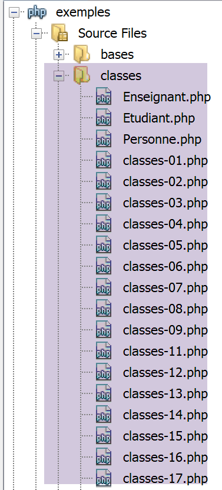
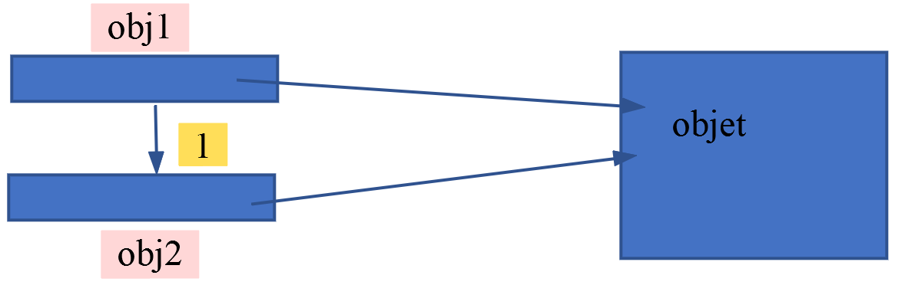
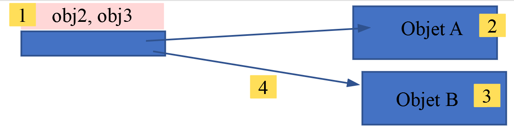
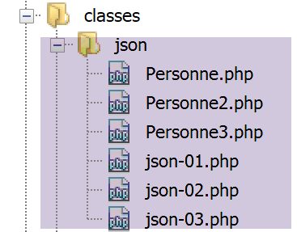

Les classes
===========

**Vocabulaire :** Une classe **class** est un type PHP. Une variable de
ce type est appelée **objet**. Un objet est une **instance**
(exemplaire) de classe.

L’arborescence des scripts
--------------------------

|image0|

Toute variable peut devenir un objet doté d'attributs
-----------------------------------------------------

Le script **[classes-01.php]** est le suivant :

.. code-block:: php 
   :linenos:

   <?php

   // un objet générique
   // $obj1=new stdClass();
   // tout variable peut avoir des attributs par construction
   $obj1->attr1 = "un";
   $obj1->attr2 = 100;
   // affiche l'objet
   print "objet1=[$obj1->attr1,$obj1->attr2]\n";
   // modifie l'objet
   $obj1->attr2 += 100;
   // affiche l'objet
   print "objet1=[$obj1->attr1,$obj1->attr2]\n";
   // copie la valeur de objet1 (adresse de l'objet pointé) dans objet2
   // les deux variables sont alors différentes mais pointent sur le même objet
   $obj2 = $obj1;
   // modifie obj2
   $obj2->attr2 = 0;
   // affiche les deux objets
   print "objet1=[$obj1->attr1,$obj1->attr2]\n";
   print "objet2=[$obj2->attr1,$obj2->attr2]\n";
   // change l'objet pointé par obj1
   $obj1 = new stdClass();
   print "obj1 :\n";
   print_r($obj1);
   print "obj2 :\n";
   print_r($obj2);
   // affecte la référence (l'adresse) de objet2 à objet3
   // $obj2 et $obj3 sont alors une seule et même variable
   $obj3 = &$obj2;
   print "obj2 :\n";
   print_r($obj2);
   print "obj3 :\n";
   print_r($obj3);
   // modifie obj3
   $obj3->attr2 = 10;
   // affiche les deux objets
   print "objet2=[$obj2->attr1,$obj2->attr2]\n";
   print "objet3=[$obj3->attr1,$obj3->attr2]\n";
   // change l'objet pointé par obj2
   $obj2 = new stdClass();
   $obj2->attr3 = "deux";
   $obj2->attr4 = 20;
   // affiche les deux objets $obj2 et $obj3
   print "obj2 :\n";
   print_r($obj2);
   print "obj3 :\n";
   print_r($obj3);

   // un objet est-il un dictionnaire ?
   print count($obj3) . "\n";
   while (list($attribut, $valeur) = each($obj3)) {
     print "obj3[$attribut]=$valeur\n";
   }
   // fin
   exit;

**Résultats** :

.. code-block:: php 
   :linenos:

   Warning: Creating default object from empty value in C:\Data\st-2019\dev\php7\php5-exemples\exemples\exemple_14.php on line 6
   objet1=[un,100]
   objet1=[un,200]
   objet1=[un,0]
   objet2=[un,0]
   obj1 :
   stdClass Object
   (
   )
   obj2 :
   stdClass Object
   (
       [attr1] => un
       [attr2] => 0
   )
   obj2 :
   stdClass Object
   (
       [attr1] => un
       [attr2] => 0
   )
   obj3 :
   stdClass Object
   (
       [attr1] => un
       [attr2] => 0
   )
   objet2=[un,10]
   objet3=[un,10]
   obj2 :
   stdClass Object
   (
       [attr3] => deux
       [attr4] => 20
   )
   obj3 :
   stdClass Object
   (
       [attr3] => deux
       [attr4] => 20
   )

   Warning: count(): Parameter must be an array or an object that implements Countable in C:\Data\st-2019\dev\php7\php5-exemples\exemples\exemple_14.php on line 50
   1

   Deprecated: The each() function is deprecated. This message will be suppressed on further calls in C:\Data\st-2019\dev\php7\php5-exemples\exemples\exemple_14.php on line 51
   obj3[attr3]=deux
   obj3[attr4]=20

**Commentaires**

-  ligne 6 : la notation *$obj->attr* désigne l'attribut *attr* de la
   variable $\ *obj*. S'il n'existe pas il est créé, faisant ainsi de la
   variable $\ *obj*, un objet avec attributs. Nous avons vu que PHP
   crée alors par défaut un objet de type **stdClass** ;

-  ligne 16 : l'expression *$obj2=$obj1*, lorsque $\ *obj1* est un
   objet, est une copie d'objets par **référence** : $\ *obj2* et
   $\ *obj1* sont des références (adresses) sur un même objet. L'objet
   lui-même peut être modifié par l'une ou l'autre des références ;

-  lignes 23-27 : visent à montrer que $\ *obj1* et $\ *obj2* sont deux
   variables différentes : elles ne sont pas à la même adresse mémoire :

   -  *$obj2=$obj1* a copié la valeur de $\ *obj1* dans la variable
      $\ *obj2* (opération 1 ci-dessus). La valeur de $\ *obj1* est
      l’adresse d’un l’objet. Ainsi $\ *obj1* et $\ *obj2* pointent sur
      le même objet. Lorsqu’on manipule une variable $\ *obj* et que
      celle-ci pointe sur un objet, PHP manipule l’objet pointé par la
      variable $\ *obj*. D’après le schéma ci-dessous, on voit qu’on
      peut modifier l’objet pointé soit via $\ *obj1* soit via
      $\ *obj2.* C’est ce que montrent les lignes 4 et 5 des résultats ;

|image1|

-  ligne 30 : l'expression *$obj3=&$obj2* fait que *$obj2 et $obj3* sont
   à la même adresse **[1 ci-dessous]**. On pourrait dire que les deux
   variables sont des alias du même emplacement mémoire. Elles pointent
   toutes les deux sur un objet, **Objet A** ci-dessous **[2]** ;

   -  l’opération *$obj2=new stdClass()* fait qu’un nouvel objet,
      **Objet B** est créé **[3 ci-dessous]** et l’adresse de ce nouvel
      objet est affectée à la variable $\ *obj2*. Puisque $\ *obj2* et
      $\ *obj3* sont deux alias du même emplacement mémoire, $\ *obj3*
      pointe également sur le nouvel objet **Objet B**. C’est ce que
      montrent les lignes 16-27 et 30-41 des résultats ;

|image2|

-  lignes 52-54 : montrent qu'un objet peut être parcouru comme un
   dictionnaire. Les clés du dictionnaire sont les noms des attributs et
   les valeurs du dictionnaire, les valeurs de ces mêmes attributs ;

-  ligne 51 : la fonction *count* peut être appliquée à un objet
   (moyennant un warning) mais ne donne pas, comme on aurait pu s'y
   attendre, le nombre d'attributs. Donc un objet présente des
   similitudes avec un dictionnaire mais n'en est pas un ;

Une classe Personne sans attributs déclarés
-------------------------------------------

Le script **[classes-02.php]** est le suivant :

.. code-block:: php 
   :linenos:

   <?php

   class Personne {

     // attributs de la classe
     // non déclarés - peuvent être créés dynamiquement
     // méthode
     function identite() {
       // a priori, utilise des attributs inexistants
       return "[$this->prenom,$this->nom,$this->age]";
     }

   }

   // test
   // les attributs sont publics et peuvent être créés dynamiquement
   $p = new Personne();
   $p->prenom = "Paul";
   $p->nom = "Langevin";
   $p->age = 48;
   // appel d'une méthode
   print "personne=" . $p->identite() . "\n";
   // fin
   exit;

**Résultats** :

.. code-block:: php 
   :linenos:

   personne=[Paul,Langevin,48]

**Commentaires**

-  lignes 3-13 : définissent une **classe** *Personne*. Une classe est
   un moule à partir duquel on crée des objets. Elle regroupe des
   **attributs** et des fonctions appelées **méthodes**. Il n'y a pas
   obligation à déclarer les attributs ;

-  lignes 8-11 : la méthode *identité* affiche la valeur de trois
   attributs non déclarés dans la classe. Le mot clé $\ **this** désigne
   l'objet auquel on applique la méthode ;

-  ligne 17 : on crée un objet $\ *p* de type *Personne*. Le mot clé
   **new** sert à créer un nouvel objet. L'opération rend une
   **référence** sur l'objet créé (donc une adresse). Diverses écritures
   sont possibles : *new Personne()*, *new Personne*, *new personne*. Le
   nom de la classe est insensible à la casse ;

-  lignes 18-20 : les trois attributs nécessaires à la méthode
   *identité* sont créés dans l'objet $p ;

-  ligne 22 : la méthode *identité* de la classe *Personne* est
   appliquée sur l'objet $\ *p*. Dans le code (lignes 8-11) de la
   méthode *identité*, $\ *this* référence le même objet que $\ *p ;*

La classe Personne avec attributs déclarés
------------------------------------------

Le script **[classes-03.php]** est le suivant :

.. code-block:: php 
   :linenos:

   <?php

   class Personne {

     // attributs de la classe
     var $prenom;
     var $nom;
     var $age;

     // méthode
     function identite() {
       return "[$this->prenom,$this->nom,$this->age]";
     }

   }

   // test
   // les attributs sont publics
   $p = new Personne();
   $p->prenom = "Paul";
   $p->nom = "Langevin";
   $p->age = 48;
   // appel d'une méthode
   print "personne=" . $p->identite() . "\n";
   // fin
   exit;

**Résultats** :

.. code-block:: php 
   :linenos:

   personne=[Paul,Langevin,48]

**Commentaires**

-  lignes 6-8 : les attributs de la classe sont explicitement déclarés
   avec le mot clé **var ;**

La classe Personne avec un constructeur
---------------------------------------

Les exemples précédents montraient des classes *Personne* exotiques
telles qu'on pouvait les trouver dans PHP 4. Il n'est pas conseillé de
suivre ces exemples. Nous présentons maintenant une classe *Personne*
**[classes-04.php]** correspondant aux bonnes pratiques de PHP 7 :

.. code-block:: php 
   :linenos:

   <?php

   // respect strict des types déclarés des paramètres de foctions
   declare (strict_types=1);
   class Personne {
   // attributs de la classe
     private $prenom;
     private $nom;
     private $age;

   // getters and setters
     public function getPrenom(): string {
       return $this->prenom;
     }

     public function getNom(): string {
       return $this->nom;
     }

     public function getAge(): int {
       return $this->age;
     }

     public function setPrenom(string $prenom): void {
       $this->prenom = $prenom;
     }

     public function setNom(string $nom): void {
       $this->nom = $nom;
     }

     public function setAge(int $age): void {
       $this->age = $age;
     }

   // constructeur
     public function __construct(string $prenom, string $nom, int $age) {
       // on passe par les set
       $this->setPrenom($prenom);
       $this->setNom($nom);
       $this->setAge($age);
     }

   // méthode toString
     public function __toString(): string {
       return "[$this->prenom,$this->nom,$this->age]";
     }

   }

   // test
   // création d'un objet Personne
   $p = new Personne("Paul", "Langevin", 48);
   // identité de cette personne
   print "personne=$p\n";
   // on change l'âge
   $p->setAge(14);
   // identité de la personne
   print "personne=$p\n";
   // fin
   exit;

**Résultats** :

.. code-block:: php 
   :linenos:

   personne=[Paul,Langevin,48]
   personne=[Paul,Langevin,14]

**Commentaires**

-  lignes 6-50 : la classe *Personne ;*

-  lignes 7-9 : les attributs privés (**private**) de la classe. Ces
   attributs ne sont visibles qu'à l'intérieur de la classe. Les autres
   mots clés utilisables sont :

-  **public **: fait de l'attribut un attribut *public* visible de
      l'extérieur de la classe,

-  **protected **: fait de l'attribut un attribut *protégé* visible de
      l'intérieur de la classe et des classes dérivées de celle-ci ;

-  parce que les attributs sont privés, on ne peut y accéder de
   l'extérieur de la classe. On ne peut donc écrire le code suivant :

.. code-block:: php 
   :linenos:

   $p=new Personne() ;
   $p->nom="Landru" ;

..

   Ici, on est en-dehors de la classe *Personne*. Comme l'attribut *nom*
   est privé, la ligne 2 est incorrecte. Pour initialiser les champs
   privés de l'objet $p, il y a deux moyens :

-  utiliser les méthodes publiques **set** et **get** (le nom de ces
   méthodes peut être quelconque) des lignes 12-34. On pourra alors
   écrire :

.. code-block:: php 
   :linenos:

   $p=new Personne() ;
   $p->setNom("Landru") ;

-  utiliser le constructeur des lignes 37-42. On écrira alors :

.. code-block:: php 
   :linenos:

   $p=new Personne("Michel","Landru",44) ;

..

   L'écriture ci-dessus, appelle automatiquement la méthode de la classe
   *Personne* appelée \_\_\ *construct ;*

-  ligne 59 : cette ligne affiche la personne $\ *p* sous la forme d'une
   chaîne de caractères. Pour ce faire, la méthode de la classe
   *Personne* appelée \_\_\ *toString* (lignes 45-47) est utilisée ;

-  toutes les méthodes de la classe (fonctions) ont été préfixées par le
   mot clé **public** qui indique que la fonction est visible en-dehors
   de la classe. Les autres mots clés utilisables sont, comme pour les
   attributs et avec la même signification, **private** et
   **protected.** Sans attribut explicite de visibilité, la fonction est
   de visibilité implicite **public** ;

La classe Personne avec contrôles de validité dans le constructeur
------------------------------------------------------------------

Le constructeur d'une classe est le bon endroit pour vérifier que les
valeurs d'initialisation de l'objet sont corrects. Mais un objet peut
être également initialisé par ses méthodes *set* ou équivalentes. Pour
éviter de mettre à deux endroits différents les mêmes vérifications, on
pourra mettre ces dernières dans les méthodes *set*. Si une valeur
d'initialisation d'un objet se révèle incorrecte, on lancera une
**exception**. Voici un exemple.

On déplace tout d’abord la définition de la classe *Personne* dans son
propre fichier **[Personne.php]** :

.. code-block:: php 
   :linenos:

   <?php

   // respect strict des types déclarés des paramètres de foctions
   declare (strict_types=1);

   // espace de noms;
   namespace Exemples;

   // classe Personne
   class Personne {
   // attributs de la classe
     private $prenom;
     private $nom;
     private $age;

   // getters et setters
     public function getPrenom(): string {
       return $this->prenom;
     }

     public function getNom(): string {
       return $this->nom;
     }

     public function getAge(): int {
       return $this->age;
     }

     public function setPrenom(string $prénom): void {
       // le prénom doit être non vide
       $prénom = trim($prénom);
       if ($prénom === "") {
         throw new \Exception("Le prénom doit être non vide");
       } else {
         $this->prenom = $prénom;
       }
     }

     public function setNom(string $nom): void {
       // le nom doit être non vide
       $nom = trim($nom);
       if ($nom === "") {
         throw new \Exception("Le nom doit être non vide");
       } else {
         $this->nom = $nom;
       }
     }

     public function setAge(int $âge): void {
       // l'âge doit être valide
       if ($âge < 0) {
         throw new \Exception("L'âge doit être un entier positif ou nul");
       } else {
         $this->age = $âge;
       }
     }

   // constructeur
     public function __construct(string $prenom, string $nom, int $age) {
       // on passe par les set
       $this->setPrenom($prenom);
       $this->setNom($nom);
       $this->setAge($age);
     }

     // méthode
     public function initWithPersonne(Personne $p): void {
       // initialise l'objet courant avec une personne $p
       $this->__construct($p->prenom, $p->nom, $p->age);
     }

     // méthode toString
     function __toString(): string {
       return "[$this->prenom,$this->nom,$this->age]";
     }

   }

**Commentaires**

-  ligne 4 : on demande à ce que le type des paramètres des fonctions
   soit respecté lorsqu’il est déclaré ;

-  ligne 7 : définit un espace de noms (**namespace**). Le nom complet
   (on dit *qualifié*) de la classe *Personne* est
   alors\ *\\Exemples\Personne*. Notez le caractère **\\** commençant le
   nom qualifié : on a alors un nom qualifié *absolu*. Si ce caractère
   est absent, on a un nom qualifié *relatif* (relatif à l’espace de
   noms courant). Ainsi si deux classes A et B font partie du même
   espace de noms E, dans le code de la classe A on pourra atteindre la
   classe B par la notation *relative* **B**. Si la classe A fait partie
   de l’espace de noms E1 et B de l’espace de noms E2, dans le code de
   A, B sera atteint par la notation *absolue* **\\E2\B**. Définir une
   classe à l’intérieur d’un espace de noms n’est pas obligatoire mais
   Netbeans émet un warning si on ne le fait pas. Donc on le fera. Par
   ailleurs, les espaces de noms devraient correspondre à l’arborescence
   des fichiers. Ainsi la classe A dans un espace de noms E1 devrait
   être dans un fichier **E1/A.php**. Ce n’est pas obligatoire mais là
   encore Netbeans émet un avertissement si on ne le fait pas. Sur
   l’exemple de la classe **[\Exemples\Personne]**, Netbeans émet un
   avertissement parce que l’arborescence du fichier **[Personne.php]**
   est **[exemples/classes/Personne.php]** et ne correspond donc pas à
   l’espace de noms. Il ne faut pas confondre arborescence et espace de
   noms. Le nom pleinement qualifié d’une classe utilise un espace de
   noms et **n’a rien à voir** avec l’arborescence du fichier PHP de la
   classe). Le lien arborescence / espace de noms est facultatif et peut
   ne pas être observé, comme nous l’avons fait ici;

-  lignes 12-14 : les trois attributs privés de la classe ;

-  lignes 29-37 : initialisation de l'attribut *prenom* et vérification
   de la valeur d'initialisation ;

-  ligne 31 : la fonction *trim($chaine)* élimine les espaces qui se
   trouvent en début et fin de $\ *chaine*. Ainsi *trim(« abcd «)* est
   la chaîne «abcd» et *trim « «* est la chaîne vide ;

-  ligne 32 : si le prénom est vide, alors on lance une exception (ligne
   33) sinon le prénom est mémorisé (ligne 35). Pour lancer une
   exception on a utilisé ici la classe prédéfinie **[Exception]**. On
   est obligés ici d’utiliser son nom absolu **[\Exception]**. Si on
   utilise son nom relatif **[Exception]** alors cette classe sera
   cherchée dans l’espace de noms du moment, ç-à-d l’espace de noms
   **[Exemples]** de la classe *Personne*. Ainsi l’interpréteur PHP
   cherchera une classe de nom absolu **[\Exemples\Exception]** qui
   n’existe pas ;

La classe **[Personne]** est utilisée par le script **[classes-05.php]**
suivant :

.. code-block:: php 
   :linenos:

   <?php

   // respect strict du type des paramètres des fonctions
   declare(strict_types=1);

   // inclusion définition de la classe Personne
   require_once __DIR__."/Personne.php";

   // nom qualifié de la classe Personne
   use \Exemples\Personne;

   // test
   // création d'un objet Personne
   $p = new Personne("Paul", "Langevin", 48);
   // identité de cette personne
   print "Exemple1, personne=$p\n";
   // création d'un objet Personne erroné
   try {
     $p = new Personne("xx", "yy", "zz");
   } catch (\Exception $e1) {
     print "Exemple2, erreur : " . $e1->getMessage() . "\n";
   } catch (\TypeError $e2) {
     print "Exemple2, erreur : " . $e2->getMessage() . "\n";
   }
   // création d'un objet Personne erroné
   try {
     $p = new Personne("", "yy", 10);
   } catch (\Exception $e1) {
     print "Exemple3, erreur : " . $e1->getMessage() . "\n";
   } catch (\TypeError $e2) {
     print "Exemple3, erreur : " . $e2->getMessage() . "\n";
   }

   // fin
   exit;

**Commentaires**

-  ligne 7 : le script va utiliser la classe **[Personne]**. Il faut
   alors dire à l’interpréteur PHP où il peut trouver la définition de
   cette classe. C’est le rôle des instructions **[include fichier]** et
   **[require fichier]**. Ici on a utilisé l’instruction **[include]**.
   La différence entre les deux instructions est la suivante : si
   l’instruction **[include fichier]** rencontre des erreurs lors du
   chargement de **[fichier]** une erreur de niveau **[E_WARNING]** est
   émise mais l’exécution continue alors que **[require]** dans le même
   cas génère une erreur fatale et l’exécution du script s’arrête.
   Chacune des deux instructions a une variante **[include_once]** et
   **[require_once]**. Ces deux variantes permettent de gérer le cas des
   inclusions multiples d’un même fichier. On peut imaginer ici un
   projet constitué de plusieurs scripts PHP dont plusieurs référencent
   la classe **[Personne]**. Leur exécution va alors provoquer plusieurs
   fois l’inclusion du fichier **[Personne.php]** et provoquer une
   erreur car une classe ne peut être définie deux fois. La solution est
   d’utiliser les variantes **[_once]** qui assurent que le fichier ne
   sera inclus qu’une fois dans le script global du projet ;

-  ligne 7 : la constante **[__DIR__]** est une constante PHP qui
   désigne le nom complet du dossier dans lequel se trouve le script
   contenant la constante **[__DIR__]**. Ainsi l’expression de la ligne
   17 :

.. code-block:: php 
   :linenos:

   require_once __DIR__."/Personne.php";

..

   sera équivalente à quelque chose comme :

.. code-block:: php 
   :linenos:

   require_once ‘C:\Data\st-2019\dev\php7\php5-exemples\exemples\classes/Personnes.php’

..

   Dans le chemin du fichier, on peut utiliser indifféremment les signes
   / et \\ ;

-  ligne 14 : on utilise la classe **[Personne]** que nous venons de
   définir. Le script **[classes-05.php]** n’a pas d’espaces de noms. La
   ligne 14 utilise le nom relatif de la classe **[Personne]** sans
   espace de noms. En l’absence d’espace de noms de la classe
   **[Personne]**, celle-ci est cherchée dans le script
   **[classes-05.php]** lui même et ne sera donc pas trouvée. Il y a
   deux solutions à ce problème :

   -  utiliser le nom complet de la classe **[\Exemples\Personne]** ;

   -  utiliser l’instruction **use** de la ligne 10. Celle-ci indique
      que le code qui suit utilise la classe **[\Exemples\Personne]** ;

-  ligne 10 : l’instruction **use** permet à l’interpréteur de savoir
   que la classe **[Personne]** référencée ligne 14 est en réalité la
   classe **[\Exemples\Personne]**. Ceci dit, où l’interpréteur va-t-il
   trouver le code de cette classe ? C’est la ligne 7 qui le lui dit.
   Celle-ci indique que pour exécuter le script courant il faut
   également charger le script **[Personne.php]**. On a utilisé ici le
   nom relatif du fichier. Il sera donc cherché dans le dossier qui
   contient le script **[classes-05.php]**. Il faut donc que les scripts
   **[Personne.php]** et **[classes-05.php]** soient dans le même
   dossier. C’est le cas ici où ils sont tous les deux dans le dossier
   **[exemples/classes]**. L’instruction de la ligne 10 est équivalente
   à :

.. code-block:: php 
   :linenos:

   use \Exemples\Personne as Personne;

..

   L’instruction **[use]** ci-dessus dit que **l’alias** **[Personne]**
   désigne la classe **[\Exemples\Personne]** ;

-  ligne 14 : un objet **[Personne]** est créé. C’est la méthode
   **[__construct]** de la classe **[Personne]** qui va être ici
   implicitement exécutée ;

-  ligne 16 : fait afficher la *Personne $p*. Pour être affichée, la
   valeur de la variable $p doit être transformée en chaîne de
   caractères. Implicitement c’est la méthode **[Personne.__toString]**
   qui est alors exécutée. Celle-ci doit donc rendre une chaîne de
   caractères ;

-  nous avons vu que le constructeur de la classe **[Personne]** pouvait
   lancer une exception de type **[\Exception]**. Il faut donc gérer
   celle-ci. Aussi le code de la ligne 14 est-il incomplet. Il faut
   utiliser celui des lignes 18-24 pour gérer correctement l’exception
   qui peut se produire. Ici on en produit volontairement une en passant
   un âge qui n’est pas un entier. Dans ce cas particulier l’exception
   qui se produit est lancée par l’interpréteur PHP et non par le code
   de la classe **[Personne]**. En effet, la signature de la méthode
   **[Personne.__construct]** est la suivante :

.. code-block:: php 
   :linenos:

   function __construct(string $prenom, string $nom, int $age)

..

   Il faut donc que le paramètre **[age]** passé au constructeur soit de
   type **entier**. Si ce n’est pas le cas, l’interpréteur PHP lance une
   erreur de type **[TypeError]**. Par ailleurs, les méthodes **[set]**
   de la classe **[Personne]** lancent, elles, une exception de type
   **[\Exception]**. Comme le constructeur qui les appelle n’a pas de
   structure *try / catch*, l’exception remonte d’un niveau, au code qui
   a appelé le constructeur, ç-à-d le code du script
   **[classes-05.php]**. Finalement, le script **[classes-05.php]** peut
   recevoir deux types d’exception : \\\ **Exception** ou
   \\\ **TypeError.** On notera que lorsque le développeur est sûr que
   certaines exceptions ne peuvent se produire, il n’utilisera pas les
   options **catch** correspondantes. Ici elles sont systématiquement
   utilisées par unique souci de démonstration. Les options **catch**
   seront cependant utilisées **pour toute exception possible, même peu
   probable** ;

   Pour cette raison, la structure **try** des lignes 18-24 a deux
   **catch** pour gérer séparément les deux types d’exception ;

-  ligne 20 : on peut écrire indifféremment **[Exception]** ou
   **[\Exception]** :

   -  le 1\ :sup:`re` version utilise le nom relatif de la classe,
      relatif à l’espace de noms du script. Celui-ci n’en a pas. Son
      espace de noms est alors la racine des espaces de noms : \\. Donc
      écrire ici **[Exception]** revient à écrire **[\Exception]**. Or
      la classe **[Exception]** se trouve bien dans l’espace de noms
      **[\]** ;

..

   Il est préférable d’utiliser le nom absolu des exceptions prédéfinies
   de PHP dans un script n’ayant pas d’espaces de noms lui-même. Ainsi
   si on décide de donner un espace de noms à ce script, l’écriture des
   noms absolus de classes reste valide alors que dans l’autre cas, le
   changement d’espace de noms va provoquer des erreurs sur les noms
   relatifs des classes ;

-  ligne 21 : lorsqu’il y a exception, la méthode
   **[Exception→getMessage]** permet d’obtenir le message d’erreur de
   l’exception. Il en est de même pour une erreur de type
   **[TypeError]**. Dans la méthode **[Personne.setPrenom]**, on a
   écrit :

.. code-block:: php 
   :linenos:

     public function setPrenom(string $prénom) {
       // le prénom doit être non vide
       $prénom = trim($prénom);
       if ($prénom === "") {
         throw new \Exception("Le prénom doit être non vide");
       } else {
         $this->prenom = $prénom;
       }
   }

..

   Ligne 5, une exception est lancée avec le message d’erreur **[Le
   prénom doit être non vide]**. C’est ce que récupèrera la méthode
   **[Exception→getMessage]** de la ligne 29 du script
   **[classes-05.php]**.

**Résultats** :

.. code-block:: php 
   :linenos:

   Exemple1, personne=[Paul,Langevin,48]
   Exemple2, erreur : Argument 3 passed to Exemples\Personne::__construct() must be of the type integer, string given, called in C:\Data\st-2019\dev\php7\php5-exemples\exemples\exemple_18.php on line 19
   Exemple3, erreur : Le prénom doit être non vide

Ajout d'une méthode faisant office de second constructeur
---------------------------------------------------------

En PHP 7, il n'est pas possible d'avoir plusieurs constructeurs avec des
paramètres différents qui permettraient de construire un objet de
diverses façons. On peut alors utiliser des méthodes faisant office de
constructeur :

.. code-block:: php 
   :linenos:

     // méthode
     public function initWithPersonne(Personne $p) {
       // initialise l'objet courant avec une personne $p
       $this->__construct($p->prenom, $p->nom, $p->age);
   }

**Commentaires**

-  lignes 2-5 : la méthode *initWithPersonne* permet d'affecter à
   l'objet courant les valeurs des attributs d'un autre objet
   *Personne*. Ici, elle fait appel au constructeur \_\_\ *construct*
   mais ce n'est pas obligatoire. Elle pourrait initialiser elle-même
   les attributs de la classe **[Personne]** ;

La nouvelle classe **[Personne]** est utilisée par le script
**[classes-06.php]** suivant :

.. code-block:: php 
   :linenos:

   <?php

   // inclusion définition de la classe Personne
   require_once __DIR__."/Personne.php";
   // déclaration du nom qualifié de la classe Personne
   use \Exemples\Personne;

   // test
   // création d'un objet Personne
   try {
     $p = new Personne("Paul", "Langevin", 48);
   } catch (\Exception $e) {
     print "erreur : " . $e->getMessage();
     exit;
   }
   // identité de cette personne
   print "personne=$p\n";
   // création d'une seconde personne
   try {
     $p2 = new Personne("Laure", "Adeline", 67);
   } catch (\Exception $e) {
     print "erreur : " . $e->getMessage();
     exit;
   }
   // initialisation de la première avec les valeurs de la seconde
   try {
     $p->initWithPersonne($p2);
   } catch (\Exception $e) {
     print "erreur : " . $e->getMessage();
     exit;
   }

   // vérification
   print "personne=$p\n";
   // fin
   exit;

-  lignes 14, 23, 30 : il est fréquent qu’après une exception, on doive
   arrêter l’exécution d’un script console si l’erreur rencontrée est
   irrécupérable. Ce n’est pas le cas dans un script web : on n’arrête
   pas l’exécution du script mais on fait afficher une page d’erreur. Si
   on est dans une fonction, ce n’est pas l’instruction **exit** qui
   sera utilisée mais **return** : on n’arrête pas l’exécution du script
   (**exit**) mais on sort de la fonction (**return**) après avoir
   positionné une erreur ;

**Résultats** :

.. code-block:: php 
   :linenos:

   personne=[Paul,Langevin,48]
   personne=[Laure,Adeline,67]

Un tableau d'objets [Personne]
------------------------------

L'exemple suivant **[classes-07.php]** montre qu'on peut avoir des
tableaux d'objets.

.. code-block:: php 
   :linenos:

   <?php

   require_once __DIR__."/Personne.php";
   use \Exemples\Personne;

   // test
   // création d'un tableau d'objets Personne
   // pour faciliter la compréhension du code, on ne gère pas l'éventuelle exception
   $groupe = [new Personne("Paul", "Langevin", 48), new Personne("Sylvie", "Lefur", 70)];

   // identité de ces personnes
   for ($i = 0; $i < count($groupe); $i++) {
     print "groupe[$i]=$groupe[$i]\n";
   }

   // fin
   exit;

**Résultats** :

.. code-block:: php 
   :linenos:

   groupe[0]=[Paul,Langevin,48]
   groupe[1]=[Sylvie,Lefur,70]

**Commentaires**

-  ligne 9 : création d'un tableau de 2 personnes ;

-  ligne 12 : parcours du tableau ;

-  ligne 13 : *$groupe\ *\ **[$i]** est un objet de type *Personne*. La
   méthode **[Personne.__toString]** est utilisée pour l'afficher ;

Création d'une classe dérivée de la classe Personne
---------------------------------------------------

On crée dans un fichier **[Enseignant.php]** la classe **[Enseignant]**
suivante :

.. code-block:: php 
   :linenos:

   <?php

   // respect strict des types déclarés des paramètres de fonctions
   declare (strict_types=1);

   // espace de noms
   namespace Exemples;

   // une classe dérivée de personne
   class Enseignant extends Personne {
     // attributs
     private $discipline;   // discipline enseignée

     // getter et setter

     public function getDiscipline(): string {
       return $this->discipline;
     }

     public function setDiscipline(string $discipline): void {
       $this->discipline = $discipline;
     }

     // constructeur
     public function __construct(string $prénom, string $nom, int $âge, string $discipline) {
       // attributs parent
       parent::__construct($prénom, $nom, $âge);
       // autres attributs
       $this->setDiscipline($discipline);
     }

     // surcharge de la fonction __toString de la classe parente
     public function __toString(): string {
       return "[" . parent::__toString() . ",$this->discipline]";
     }

   }

**Commentaires**

-  ligne 7 : la classe **[Enseignant]** fait partie elle aussi de
   l’espace de noms **[Exemples]** ;

-  ligne 10 : la classe *Enseignant* dérive (**extends**) de la classe
   *Personne.* La classe dérivée *Enseignant* hérite des attributs et
   des méthodes de sa classe mère ;

-  ligne 12 : la classe *Enseignant* ajoute un nouvel attribut
   *discipline* qui lui est propre ;

-  ligne 25 : le constructeur de la classe *Enseignant* reçoit 4
   paramètres :

-  3 pour initialiser sa classe parent (prénom, nom, âge), ligne 27 ;

-  1 pour sa propre initialisation (discipline), ligne 29 ;

-  ligne 27 : la classe dérivée a accès aux méthodes et constructeurs de
   sa classe parent via le mot clé **parent ::**. Ici on passe les
   paramètres (prénom, nom, âge) au constructeur de la classe parent ;

-  lignes 33-35 : la méthode \_\_\ *toString* de la classe dérivée
   utilise la méthode \_\_\ *toString* de la classe parent ;

La classe **[Enseignant]** est utilisée par le script
**[classes-08.php]** suivant :

.. code-block:: php 
   :linenos:

   <?php

   // inclusion de la définition des deux classes
   require_once __DIR__."/Personne.php";
   require_once __DIR__."/Enseignant.php";
   // déclaration des deux classes utilisées
   use \Exemples\Personne;
   use \Exemples\Enseignant;

   // test
   // création d'un tableau d'objets Personne et dérivés
   // pour la simplicité de l'exemple, on ne gère pas les exceptions
   $groupe = array(new Enseignant("Paul", "Langevin", 48, "anglais"), new Personne("Sylvie", "Lefur", 70));

   // identité de ces personnes
   for ($i = 0; $i < count($groupe); $i++) {
     print "groupe[$i]=$groupe[$i]\n";
   }
   // fin
   exit;

**Commentaires**

-  lignes 4-5 : il nous faut dire à l’interpréteur PHP où se trouvent
   les deux classes **[Enseignant, Personne]** ;

-  lignes 7-8 : déclaration des noms complets des deux classes. Ceci
   nous permettra de les désigner dans le code simplement par leur nom
   sans le suffixe de leurs espaces de noms ;

-  ligne 13 : on crée un tableau comportant un type **[Personne]** et un
   type **[Enseignant]** ;

-  lignes 16-18 : affichent les éléments du tableau ;

-  ligne 17 : la méthode \_\_\ *toString* de chaque élément
   *$groupe\ *\ **[$i]** va être appelée. La classe *Personne* a une
   méthode \_\_\ *toString*. La classe *Enseignant* en a deux : celle de
   sa classe parent et la sienne propre. On peut se demander laquelle va
   être appelée. L'exécution montre que c'est celle de la classe
   *Enseignant* qui a été appelée. C'est toujours ainsi : lorsqu'une
   méthode est appelée sur un objet, celle-ci est cherchée dans l'ordre
   suivant : dans l'objet lui-même, dans sa classe parent s'il en a une,
   puis dans la classe parent de la classe parent, etc … La recherche
   s'arrête dès que la méthode a été trouvée.

**Résultats** :

.. code-block:: php 
   :linenos:

   groupe[0]=[[Paul,Langevin,48],anglais]
   groupe[1]=[Sylvie,Lefur,70]

Création d'une seconde classe dérivée de la classe Personne
-----------------------------------------------------------

L'exemple suivant crée une classe *Etudiant* dérivée de la classe
*Personne*, dans le fichier **[Etudiant.php]** :

.. code-block:: php 
   :linenos:

   <?php

   // respect strict des types déclarés des paramètres de foctions
   declare (strict_types=1);

   // espace de noms
   namespace Exemples;

   class Etudiant extends Personne {
     // attributs
     private $formation;   // formation suivie

     // getter et setter
     public function getFormation(): string {
       return $this->formation;
     }

     public function setFormation(string $formation): void {
       $this->formation = $formation;
     }

     // constructeur
     public function __construct(string $prénom, string $nom, int $âge, string $formation) {
       // attributs parent
       parent::__construct($prénom, $nom, $âge);
       // autres attributs
       $this->setFormation($formation);
     }

     // surcharge de la fonction __toString de la classe parente
     public function __toString(): string {
       return "[" . parent::__toString() . ",$this->formation]]";
     }

   }

Cette classe est utilisée par le script **[classes-09.php]** suivant :

.. code-block:: php 
   :linenos:

   <?php

   // inclusion et définition des classes utilisées par le script
   require_once __DIR__."/Personne.php";
   use \Exemples\Personne;
   require_once __DIR__."/Enseignant.php";
   use \Exemples\Enseignant;
   require_once __DIR__."/Etudiant.php";
   use \Exemples\Etudiant;

   // test
   // création d'un tableau d'objets personne et dérivés
   // pour faciliter la compréhension de l'exemple, on ne gère pas les exceptions
   $groupe = array(new Enseignant("Paul", "Langevin", 48, "anglais"), new Personne("Sylvie", "Lefur", 70), new Etudiant("Steve", "Boer", 23, "iup2 qualité"));

   // identité de ces personnes
   for ($i = 0; $i < count($groupe); $i++) {
     print "groupe[$i]=$groupe[$i]\n";
   }
   // fin
   exit;

**Résultats** :

.. code-block:: php 
   :linenos:

   groupe[0]=[[Paul,Langevin,48],anglais]
   groupe[1]=[Sylvie,Lefur,70]
   groupe[2]=[[Steve,Boer,23],iup2 qualité]

Relation du constructeur d’une classe dérivée avec celui de la classe parent
----------------------------------------------------------------------------

Dans certains langages orientés objet, le constructeur d’une classe
dérivée appelle automatiquement celui de sa classe parent. Le code
suivant **[classes-16.php]** montre qu’avec PHP 7 ce n’est pas le cas :

.. code-block:: php 
   :linenos:

   <?php

   class Classe1 {

     // constructeur
     public function __construct() {
       print "constructeur de la classe Classe1\n";
     }

   }

   class Classe2 extends Classe1 {

     // constructeur
     public function __construct() {
       // le constructeur de la classe parent n'est pas appelé implicitement
       print "constructeur de la classe Classe2\n";
     }

   }

   class Classe3 extends Classe1 {

     // constructeur
     public function __construct() {
       // appel explicite du constructeur de la classe parent
       parent::__construct();
       // code propre à Classe3
       print "constructeur de la classe Classe3\n";
     }

   }

   // tests
   print "test1---------\n";
   new Classe2();
   print "test2---------\n";
   new Classe3();

**Résultats**

.. code-block:: php 
   :linenos:

   test1---------
   constructeur de la classe Classe2
   test2---------
   constructeur de la classe Classe1
   constructeur de la classe Classe3

Redéfinition d’une méthode de la classe parent
----------------------------------------------

Nous avons déjà vu qu’une méthode de la classe parent pouvait être
redéfinie dans une classe fille. Ainsi la méthode **[__toString]** de la
classe **[Personne]** (cf
`lien <#la-classe-personne-avec-contrôles-de-validité-dans-le-constructeur>`__)
a été redéfinie dans les classes filles **[Enseignant]** (cf.
`lien <#création-dune-classe-dérivée-de-la-classe-personne>`__) et
**[Etudiant]** (cf.
`lien <#création-dune-seconde-classe-dérivée-de-la-classe-personne>`__).
Le script **[classes-13.php]** illustre de nouveau le concept :

.. code-block:: php 
   :linenos:

   <?php

   // respect strict du type des paramètres des fonctions
   declare(strict_types=1);

   // classe principale
   class Classe1 {

     public function f(): int {
       return 1;
     }

     function g(): int {
       return 2;
     }

   }

   // classe dérivée
   class Classe2 extends Classe1 {

     // on redéfinit la fonction f de la classe parent
     public function f(): int {
       return parent::f() + 10;
     }

   }

   // code
   $c2 = new Classe2();
   print $c2->f() . "\n";
   print $c2->g() . "\n";
   $c1=new Classe1();
   print $c1->f()."\n";

**Commentaires**

-  lignes 7-17 : la classe **[Classe1]** définit deux méthodes **f** et
   **g** ;

-  lignes 20-27 : la classe **[Classe2]** étend la classe **[Classe1]**
   et redéfinit la méthode **f** de celle-ci ;

**Résultats**

.. code-block:: php 
   :linenos:

   11
   2
   1

**Commentaires**

-  la ligne 30 du code crée un objet $c2 de type **[Classe2]** ;

-  la ligne 31 du code appelle la méthode **f** de l’objet $\ **c2**.
   Comme celle-ci existe, elle est exécutée ;

-  la ligne 32 du code appelle la méthode **g** de l’objet $\ **c2**.
   Comme celle-ci n’existe pas, elle est recherchée dans la classe
   parent où elle est trouvée et exécutée ;

-  la ligne 33 du code crée un objet $\ **c1** de type **[Classe1]** ;

-  la ligne 34 du code appelle la méthode **f** de l’objet $\ **c1**.
   Comme celle-ci existe, elle est exécutée ;

Passage d’un objet en paramètre d’une fonction
----------------------------------------------

Considérons le script **[classes-14.php]** suivant :

.. code-block:: php 
   :linenos:

   <?php

   // respect strict du type des paramètres des fonctions
   declare(strict_types=1);

   // classe principale
   class Classe1 {

     public function f(): int {
       return 1;
     }

     function g(): int {
       return 2;
     }

   }

   // classe dérivée
   class Classe2 extends Classe1 {

     // on redéfinit la fonction f de la classe parent
     public function f(): int {
       return parent::f() + 10;
     }

   }

   // le paramètre de la fonction est de type Classe1 ou dérivé
   function doSomething(Classe1 $c1): void {
     print $c1->f() + $c1->g() . "\n";
   }

   // code
   // on crée un objet de type Classe2 dérivé de Classe1
   $c2 = new Classe2();
   // on appelle doSomething avec
   doSomething($c2);

**Commentaires**

-  lignes 7-17 : la classe **[Classe1]** ;

-  ligne 20-27 : une classe **[Classe2]** dérivée de **[Classe1]** ;

-  ligne 30 : une fonction qui attend un paramètre de type
   **[Classe1]**. Lorsque le type attendu est une classe alors le
   paramètre effectif peut être un objet du type attendu **ou dérivé **;

-  lignes 35-38 : on appelle la fonction **[doSomething]** avec un
   paramètre de type **[Classe2]** alors que c’est le type **[Classe1]**
   qui est attendu ;

**Résultats**

.. code-block:: php 
   :linenos:

   13

Classes abstraites
------------------

Une classe **abstraite** est une classe incomplète qui ne peut être
instanciée. Elle doit obligatoirement être dérivée pour être utilisable.

A quoi sert une classe abstraite ? On a parfois des classes qui
partagent une ou des méthodes mais qui se différencient par d’autres
méthodes ou d’autres attributs. Il est alors souhaitable de rassembler
tout ce qui est commun dans une classe parent. Pour l’instant on n’a pas
besoin de classe abstraite. Mais supposons que les classes filles ne
diffèrent que par une méthode **M** : la signature de la méthode serait
la même dans toutes les classes filles mais son implémentation
diffèrerait. Pour imposer aux classes filles d’implémenter la méthode
M :

-  on va déclarer la signature de la méthode M dans la classe parent.
   Comme celle-ci ne sait pas comment l’implémenter, on préfixe la
   méthode par le mot clé **abstract** : cela signifie que
   l’implémentation de la méthode M est reportée sur les classes
   filles ;

-  parce que la classe parent n’est pas totalement implémentée, elle est
   elle-aussi déclarée abstraite avec le même mot clé **abstract**. Ceci
   fait que la classe ne peut plus être instanciée. Il faut
   obligatoirement créer une classe fille qui définira l’implémentation
   de la méthode M, pour que le corps de la classe parent soit
   utilisable ;

Voici un exemple **[classes-15.php]** :

.. code-block:: php 
   :linenos:

   <?php

   // respect strict du type des paramètres des fonctions
   declare(strict_types=1);

   // classe principale abstraite
   abstract Class Classe1 {

     // méthode connue de toutes les classes dérivées
     public function f(): int {
       return 1;
     }

     // méthode g abstraite - sera définie par les classes dérivées
     abstract function g(): int;
   }

   // classe dérivée
   Class Classe2 extends Classe1 {

     // la méthode g de la classe parent doit être définie
     public function g(): int {
       return parent::f() + 10;
     }

   }

   // classe dérivée
   Class Classe3 extends Classe1 {

     // la méthode g de la classe parent doit être définie
     public function g(): int {
       return parent::f() + 20;
     }

     // on peut redéfinir la méthode f de la classe parent
     public function f(): int {
       return 2;
     }

   }

   // code
   $c2 = new Classe2();
   print $c2->f() . "\n";
   print $c2->g() . "\n";
   $c3 = new Classe3();
   print $c3->f() . "\n";
   print $c3->g() . "\n";

**Commentaires**

-  lignes 7-16 : la classe **[Classe1]** est abstraite (ligne 7) car
   elle ne sait pas implémenter la méthode g de la ligne 15. Elle doit
   donc être obligatoirement dérivée pour être utilisable ;

-  lignes 19-26 : la classe **[Classe2]** étend la classe **[Classe1]**
   et redéfinit la méthode **g** de sa classe parent (lignes 22-24) ;

-  lignes 29-41 : la classe **[Classe3]** étend la classe **[Classe1]**
   et redéfinit la méthode **g** de sa classe parent (lignes 32-34) ;

-  lignes 37-39 : la classe **[Classe3]** redéfinit la méthode **f** de
   sa classe parent ;

-  lignes 44-49 : on crée deux objets de type **[Classe2]** et
   **[Classe3]** et on appelle leurs méthodes **f** et **g** ;

**Résultats**

.. code-block:: php 
   :linenos:

   1
   11
   2
   21

Classes finales
---------------

Une classe finale est une classe qu’on ne peut dériver. Considérons le
script **[classes-11.php]** suivant :

.. code-block:: php 
   :linenos:

   <?php

   // espace de noms
   namespace Exemples;

   // classe non dérivable
   final Class Classe1 {
     
   }

   // classe dérivée
   Class Classe2 extends Classe1 {
     
   }

   // code - doit provoquer une erreur
   new Classe2();

**Commentaires**

-  lignes 7-9 : le mot clé **final**, fait de la classe **[Classe1]**
   une classe finale qu’on ne peut dériver ;

-  lignes 12-14 : la classe **[Classe2]** étend la classe finale
   **[Classe1]**, ce qui est une erreur ;

-  ligne 17 : l’erreur ne sera signalée qu’à l’exécution du script
   lorsqu’on essaiera de manipuler un objet de type **[Classe2]** ;

**Résultats**

.. code-block:: php 
   :linenos:

   Fatal error: Class Exemples\Classe2 may not inherit from final class (Exemples\Classe1) in C:\Data\st-2019\dev\php7\php5-exemples\exemples\classes\classes-11.php on line 14

Méthodes finales
----------------

Une méthode finale est une méthode qu’on ne peut redéfinir par
dérivation. Voici un exemple **[classes-12.php]** :

.. code-block:: php 
   :linenos:

   <?php

   // respect strict du type des paramètres des fonctions
   declare(strict_types=1);

   // espace de noms
   namespace Exemples;

   // classe principale
   Class Classe1 {

     // cette méthode ne peut être redéfinie dans une classe dérivée
     public final function f(): int {
       return 1;
     }

   }

   // classe dérivée
   Class Classe2 extends Classe1 {

     public function f(): int {
       return 2;
     }

   }

   // code - doit provoquer une erreur
   new Classe2();

**Commentaires**

-  ligne 13 : la méthode **f** de la classe **[Classe1]** est déclarée
   finale par le mot clé **final** ;

-  ligne 20 : la classe **[Classe2]** étend classe **[Classe1]** ;

-  lignes 22-23 : on redéfinit la fonction **f** de la classe parent
   **[Classe1]**. Cela doit provoquer une erreur ;

-  ligne 29 : on crée un objet de type **[Classe2]** pour forcer
   l’interpréteur PHP à inspecter la classe **[Classe2]** ;

**Résultats**

.. code-block:: php 
   :linenos:

   Fatal error: Cannot override final method Exemples\Classe1::f() in C:\Data\st-2019\dev\php7\php5-exemples\exemples\classes\classes-12.php on line 26

Méthodes et attributs statiques
-------------------------------

Une méthode **statique** est une méthode liée à la **classe** dans
laquelle elle est définie et non aux objets instances de la classe.
Ainsi si la classe **C** déclare une méthode statique **M**, pour
utiliser cette dernière on écrira :

-  **C::M** si on est à l’extérieur de la classe ;

-  **self::M** si on est dans la classe ;

Voici un exemple **[classes-17.php]** :

.. code-block:: php 
   :linenos:

   <?php

   class Classe1 {

     // méthode statique
     static function say(string $message): void {
       print "$message\n";
     }

   }

   // test -------------------
   Classe1::say("hello");

**Commentaires**

-  ligne 6 : la méthode **[say]** est déclarée statique avec le mot clé
   **static** ;

-  ligne 13 : appel de la méthode statique **[say]** avec la notation :
   **Classe1::say** ;

**Résultats**

.. code-block:: php 
   :linenos:

   hello

Considérons maintenant le code suivant **[classes-18.php]** :

.. code-block:: php 
   :linenos:

   <?php

   class Classe1 {
     // attribut statique
     private static $nbObjects = 0;

     public function __construct() {
       print "constructeur Classe1\n";
       self::$nbObjects++;
     }

     // méthode statique
     static function say(): void {
       print self::$nbObjects ." objets de type [Classe1] ont été construits\n";
     }

   }

   // test -------------------
   new Classe1();
   new Classe1();
   Classe1::say();

**Commentaires**

-  ligne 5 : on déclare un attribut **statique** qui va compter le
   nombre d’instances de la classe **[Classe1]** créées. Ce n’est pas un
   attribut qui peut appartenir à une instance de la classe. En effet,
   si deux objets O1 et O2 sont créés, aucun des deux n’a connaissance
   de l’autre. Avoir un compteur dans l’instance n’a pas de sens :
   lorsqu’un nouvel objet est créé, dans quelle instance va-t-on
   incrémenter un compteur ? On serait obliger d’incrémenter le compteur
   d’un objet particulier délaissant les compteurs des autres instances.
   Un attribut **statique** est un attribut de classe et non d’instance
   de la classe ;

-  lignes 7-10 : c’est dans le constructeur qu’on va compter les objets
   créés puisque la création de chaque nouvel objet provoque l’exécution
   du constructeur ;

-  ligne 14 : on notera la notation **self::$nbObjects** pour indiquer
   qu’on fait référence à un attribut statique de la classe dans
   laquelle se trouve le code exécuté ;

-  lignes 13-15 : la méthode statique **[say]** a pour rôle d’afficher
   le nombre d’objets créés ;

-  lignes 20-22 : on crée deux objets et on fait afficher le compteur
   d’objets ;

**Résultats**

.. code-block:: php 
   :linenos:

   constructeur Classe1
   constructeur Classe1
   2 objets de type [Classe1] ont été construits

Visibilité entre classe Parent et classe Fille
----------------------------------------------

Examinons le script **[classes-19.php]** suivant :

.. code-block:: php 
   :linenos:

   <?php

   class SomeParent {
     // attribut
     private $attributeOfParent = 4;

     // méthode
     public function doTest(): void {
       // qui appelle ?
       print "parent :\n";
       var_dump($this);
       // affichage parent
       print "parent : attributeOfParent={$this->attributeOfParent}\n";
       print "parent : attributeOfChild={$this->attributeOfChild}\n";
     }

   }

   class SomeChild extends SomeParent {
     // attribut
     private $attributeOfChild = 14;

     // méthode
     public function doTest(): void {
       // affichage enfant
       print "child : attributeOfParent={$this->attributeOfParent}\n";
       print "child : attributeOfChild={$this->attributeOfChild}\n";

       // parent
       parent::doTest();
     }
   }

   // script principal
   print "---test1\n";
   (new SomeParent())->doTest();
   print "---test2\n";
   (new SomeChild())->doTest();

**Commentaires**

-  lignes 3-17 : la classe **[SomeParent]** ;

-  lignes 19-32 : la classe fille **[SomeChild]**. On voit qu’elle étend
   la classe **[SomeParent]** (ligne 19) ;

-  ligne 5 : la classe **[SomeParent]** n’a qu’un attribut ;

-  lignes 8-17 : la méthode **[SomeParent::doTest]** a pour but
   d’afficher deux attributs :

   -  **[$attributeOfParent]** qui appartient à la classe
      **[SomeParent]** ;

   -  **[$attributeOfChild]** qui appartient à la classe **[SomeChild]**
      (ligne 21) ;

-  lignes 10-11 : on affiche l’identité de l’appelant : on va en effet
   appeler la méthode de deux façons différentes :

   -  à partir de la classe parent **[SomeParent]** ;

   -  à partir de la classe fille **[SomeChild]** ;

-  lignes 13-14 : affichage des deux attributs ;

-  lignes 19-32 : la classe fille **[SomeChild]** qui étend la classe
   **[SomeParent]** (ligne 19) ;

-  ligne 21 : la classe **[SomeChild]** n’a qu’un attribut ;

-  lignes 24 : la méthode **[SomeChild::doTest]** a pour but d’afficher
   deux attributs :

   -  **[$attributeOfParent]** qui appartient à la classe
      **[SomeParent]** ;

   -  **[$attributeOfChild]** qui appartient à la classe
      **[SomeChild]** ;

-  lignes 26-27 : affichage des deux attributs ;

-  ligne 30 : appel de la méthode **[doTest]** de la classe parent qui
   va à son tour afficher les deux attributs ;

-  ligne 36 : la méthode **[SomeParent::doTest]** est appelée ;

-  ligne 38 : la méthode **[SomeChild::doTest]** est appelée ;

Dans le 1\ :sup:`er` test, la visibilité des deux attributs est
**[private]**. On peut donc s’attendre à ce que la classe fille ne voit
pas l’attribut de sa classe parent. Il faudrait que celui-ci ait au
moins la visibilité **[protected]**. Mais qu’en est-il de l’attribut de
la classe fille ? Est-il visible dans la classe parent ?

Voici les résultats de ce 1\ :sup:`er` test :

.. code-block:: php 
   :linenos:

   ---------------------------test1
   parent :
   object(SomeParent)#1 (1) {
     ["attributeOfParent":"SomeParent":private]=>
     int(4)
   }
   parent : attributeOfParent=4

   Notice: Undefined property: SomeParent::$attributeOfChild in C:\Data\st-2019\dev\php7\poly\scripts-console\classes\classes-19.php on line 14
   parent : attributeOfChild=
   ---------------------------test2

   Notice: Undefined property: SomeChild::$attributeOfParent in C:\Data\st-2019\dev\php7\poly\scripts-console\classes\classes-19.php on line 26
   child : attributeOfParent=
   child : attributeOfChild=14
   parent :
   object(SomeChild)#1 (2) {
     ["attributeOfChild":"SomeChild":private]=>
     int(14)
     ["attributeOfParent":"SomeParent":private]=>
     int(4)
   }
   parent : attributeOfParent=4

   Fatal error: Uncaught Error: Cannot access private property SomeChild::$attributeOfChild in C:\Data\st-2019\dev\php7\poly\scripts-console\classes\classes-19.php:14
   Stack trace:
   #0 C:\Data\st-2019\dev\php7\poly\scripts-console\classes\classes-19.php(30): SomeParent->doTest()
   #1 C:\Data\st-2019\dev\php7\poly\scripts-console\classes\classes-19.php(39): SomeChild->doTest()
   #2 {main}
     thrown in C:\Data\st-2019\dev\php7\poly\scripts-console\classes\classes-19.php on line 14

**Commentaires**

-  lignes 1-10 : résultats du 1\ :sup:`er` test où la méthode
   **[SomeParent::doTest]** est appelée ;

-  lignes 3-6 : on voit que l’objet qui appelle la méthode est de type
   **[SomeParent]** ;

-  ligne 7 : affichage de l’attribut **[$attributeOfParent]** ;

-  lignes 9-10 : on voit que l’attribut
   **[SomeParent::$attributeOfChild]** n’existe pas. Il n’est donc pas
   affiché ;

-  lignes 11-30 : résultats du :sup:`2e` test où la méthode
   **[SomeChild::doTest]** est appelée ;

-  lignes 13-14 : on voit que l’attribut
   **[SomeChild::$attributeOfParent]** n’existe pas. Il n’est donc pas
   affiché. C’est normal : l’attribut
   **[SomeParent::$attributeOfParent]** est **[private]** et donc pas
   connu dans la classe fille ;

-  ligne 15 : affichage de l’attribut **[$attributeOfChild]** ;

-  lignes 16-30 : on est dans la méthode **[SomeParent::doTest]**
   appelée par la classe fille ;

-  lignes 17-22 : on voit que **[$this]** est de type **[SomeChild]**
   avec deux attributs privés ;

-  ligne 23 : de façon très étonnante, **[$this]** de type
   **[SomeChild]** voit ici l’attribut du parent
   **[$attributeOfParent]** ;

-  lignes 25-30 : de façon tout aussi étonnante, **[$this]** de type
   **[SomeChild]** ne voit pas son attribut **[$attributeOfChild]** ;

Ce résultat est très étonnant : bien que les lignes 17-21 indiquent que
**[$this]** est de type **[SomeChild]**, ce **[$this]** à l’intérieur de
la méthode **[SomeParent::doTest]** se comporte comme s’il était une
instance de la classe **[SomeParent]** et non de la classe
**[SomeChild]**.

Faisons un nouveau test avec le script **[classes-20.php]**. L’attribut
**[$attributeOfParent]** a maintenant une visibilité **[protected]**
(ligne 5) :

.. code-block:: php 
   :linenos:

   <?php

   class SomeParent {
     // attribut
     protected $attributeOfParent = 4;

     // méthode
     public function doTest(): void {
       // qui appelle ?
       print "parent :\n";
       var_dump($this);
       // affichage parent
       print "parent : attributeOfParent={$this->attributeOfParent}\n";
       print "parent : attributeOfChild={$this->attributeOfChild}\n";
     }

   }

   class SomeChild extends SomeParent {
     // attribut
     private $attributeOfChild = 14;

     // méthode
     public function doTest(): void {
       // affichage enfant
       print "child : attributeOfParent={$this->attributeOfParent}\n";
       print "child : attributeOfChild={$this->attributeOfChild}\n";

       // parent
       parent::doTest();
     }

   }

   // script principal
   print "---------------------------test1\n";
   (new SomeParent())->doTest();
   print "---------------------------test2\n";
   (new SomeChild())->doTest();

**Résultats**

.. code-block:: php 
   :linenos:

   ---------------------------test1
   parent :
   object(SomeParent)#1 (1) {
     ["attributeOfParent":protected]=>
     int(4)
   }
   parent : attributeOfParent=4

   Notice: Undefined property: SomeParent::$attributeOfChild in C:\Data\st-2019\dev\php7\poly\scripts-console\classes\classes-20.php on line 14
   parent : attributeOfChild=
   ---------------------------test2
   child : attributeOfParent=4
   child : attributeOfChild=14
   parent :
   object(SomeChild)#1 (2) {
     ["attributeOfChild":"SomeChild":private]=>
     int(14)
     ["attributeOfParent":protected]=>
     int(4)
   }
   parent : attributeOfParent=4

   Fatal error: Uncaught Error: Cannot access private property SomeChild::$attributeOfChild in C:\Data\st-2019\dev\php7\poly\scripts-console\classes\classes-20.php:14
   Stack trace:
   #0 C:\Data\st-2019\dev\php7\poly\scripts-console\classes\classes-20.php(30): SomeParent->doTest()
   #1 C:\Data\st-2019\dev\php7\poly\scripts-console\classes\classes-20.php(39): SomeChild->doTest()
   #2 {main}
     thrown in C:\Data\st-2019\dev\php7\poly\scripts-console\classes\classes-20.php on line 14

**Commentaires**

-  ligne 12 : la classe **[SomeChild]** voit désormais l’attribut de son
   parent **[$attributeOfParent]**. C’est normal puisque celui-ci a
   maintenant une portée **[protected]** ;

-  dans la méthode **[someParent::doTest]**, l’objet **[$this]** est de
   type **[SomeChild]** (lignes 15-20). Il voit l’attribut de son parent
   **[$attributeOfparent]** (ligne 21) mais toujours pas son propre
   attribut **[$attributeOfChild]** (lignes 23-28) ;

Dans le 3\ :sup:`e` essai, l’attribut **[$attributeOfChild]** a lui
également une portée **[protected]** :

.. code-block:: php 
   :linenos:

   <?php

   class SomeParent {
     // attribut
     protected $attributeOfParent = 4;

     // méthode
     public function doTest(): void {
       // qui appelle ?
       print "parent :\n";
       var_dump($this);
       // affichage parent
       print "parent : attributeOfParent={$this->attributeOfParent}\n";
       print "parent : attributeOfChild={$this->attributeOfChild}\n";
     }

   }

   class SomeChild extends SomeParent {
     // attribut
     protected $attributeOfChild = 14;

     // méthode
     public function doTest(): void {
       // affichage enfant
       print "child : attributeOfParent={$this->attributeOfParent}\n";
       print "child : attributeOfChild={$this->attributeOfChild}\n";

       // parent
       parent::doTest();
     }

   }

   // script principal
   print "---------------------------test1\n";
   (new SomeParent())->doTest();
   print "---------------------------test2\n";
   (new SomeChild())->doTest();

Les résultats de l’exécution sont les suivants :

.. code-block:: php 
   :linenos:

   ---------------------------test1
   parent :
   object(SomeParent)#1 (1) {
     ["attributeOfParent":protected]=>
     int(4)
   }
   parent : attributeOfParent=4

   Notice: Undefined property: SomeParent::$attributeOfChild in C:\Data\st-2019\dev\php7\poly\scripts-console\classes\classes-21.php on line 14
   parent : attributeOfChild=
   ---------------------------test2
   child : attributeOfParent=4
   child : attributeOfChild=14
   parent :
   object(SomeChild)#1 (2) {
     ["attributeOfChild":protected]=>
     int(14)
     ["attributeOfParent":protected]=>
     int(4)
   }
   parent : attributeOfParent=4
   parent : attributeOfChild=14

-  ligne 22 : cette fois-ci, à l’intérieur du parent, **[$this]** de
   type **[SomeChild]** (lignes 15-20) voit l’attribut protégé
   **[$attributeOfChild]** de sa propre classe **[SomeChild]**.

Que retenir de ces tests ?

-  que le **[$this]** instance d’une classe parent, utilisée dans une
   méthode de la classe parent voit :

   -  les attributs et méthodes de la classe parent quelque soit leur
      visibilité ;

   -  ne voit rien des attributs et méthodes de ses classes filles ;

C’est le comportement attendu.

-  que le **[$this]** instance d’une classe fille, utilisée dans une
   méthode de la classe fille voit :

   -  les attributs et méthodes de la classe parent s’ils ont au moins
      la visibilité **[protected]**. Ceux qui ont la visibilité
      **[private]** ne sont pas vus ;

   -  les attributs et méthodes de la classe fille quelque soit leur
      visibilité ;

..

   C’est le comportement attendu.

-  que le **[$this]** instance d’une classe fille, utilisée dans une
   méthode de la classe parent voit :

   -  les attributs et méthodes de la classe parent quelque soit leur
      visibilité ;

   -  les attributs et méthodes de sa propre classe uniquement s’ils ont
      au moins la visibilité **[protected]**. Ceux qui ont la visibilité
      **[private]** ne sont pas vus ;

..

   C’est un comportement inattendu.

Encodage jSON d’une classe
--------------------------

Dans une classe la méthode **[__toString]** est souvent présente : elle
est censée rendre une chaîne de caractères représentant l’objet qui
l’appelle. Il peut être tentant que cette chaîne soit une chaîne jSON.
Nous explorons cette voie maintenant.

|image3|

Nous utiliserons la classe **[Personne]** suivante :

.. code-block:: php 
   :linenos:

   <?php

   class Personne {
     // attributs
     private $nom;
     private $prénom;
     private $âge;
     private $enfants;

     // setter global
     public function setFromArray(array $arrayOfAttributes): Personne {
       // initialisation de certains attributs de la classe
       foreach ($arrayOfAttributes as $attribute => $value) {
         $this->$attribute = $value;
       }
       // on retourne l'objet
       return $this;
     }

     // getters
     public function getNom() {
       return $this->nom;
     }

     public function getPrénom() {
       return $this->prénom;
     }

     public function getÂge() {
       return $this->âge;
     }

     public function getEnfants() {
       return $this->enfants;
     }

     // __toString
     public function __toString(): string {
       // on identifie l'objet
       var_dump($this);
       // on récupère ses attributs
       $attributes = \get_object_vars($this);
       var_dump($attributes);
       // on rend la chaîne jSON des attributs
       return \json_encode($attributes, JSON_UNESCAPED_UNICODE);
     }

   }

**Commentaires**

-  lignes 5-8 : les quatre attributs de la classe ;

-  lignes 20-35 : les getters qui permettent d’avoir la valeur de ces
   attributs ;

-  lignes 11-18 : un setter global qui permet d’initialiser les
   attributs à partir d’un tableau associatif **[$arrayOfAttributes]**
   ayant des clés **identiques** aux attributs de la classe ;

-  lignes 38-46 : la méthode **[__toString]** de la classe ;

-  ligne 42 : la fonction PHP **[get_object_vars]** permet d’obtenir la
   valeur des attributs de la classe sous la forme d’un tableau
   associatif **[‘nom’=>’nom1’, ‘prénom’=>’prénom1, ‘âge’=>âge1,
   ‘enfants’=>[]**] ;

-  ligne 45 : on rend la chaîne jSON de ce tableau d’attributs ;

Examinons le script **[json-01.php]** qui exploite la classe
**[Personne]** :

.. code-block:: php 
   :linenos:

   <?php

   // classe Personne
   require "Personne.php";

   // instanciation du père
   $père = new Personne();
   // initialisation du père
   $père->setFromArray([
     "nom" => "Bertholomé",
     "prénom" => "Dieudonné",
     "âge" => 58
   ]);
   // instanciation et initialisation enfant1
   $enfant1 = (new Personne())->setFromArray([
     "nom" => "Bertholomé",
     "prénom" => "Sylvain",
     "âge" => 17
     ]);
   // instanciation et initialisation enfant2
   $enfant2 = (new Personne())->setFromArray([
     "nom" => "Bertholomé",
     "prénom" => "Géraldine",
     "âge" => 12
     ]);
   // initialisation enfants du père
   $père->setFromArray([
     "enfants" => [$enfant1, $enfant2]
   ]);

   // affichage éléments du père
   $enfant1=($père->getEnfants())[0];
   $enfant2=($père->getEnfants())[1];
   print "------------------------enfant1\n";
   print "enfant1=$enfant1\n";
   print "------------------------enfant2\n";
   print "enfant2=$enfant2\n";
   print "------------------------père\n";
   print "père=$père\n";

**Commentaires**

-  lignes 6-13 : on initialise un objet **[Personne]** **[$père]** avec
   la méthode **[Personne::setFromArray]** qui permet d’initialiser un
   objet **[Personne]** avec un tableau ayant des clés identiques aux
   attributs de la classe **[Personne]** ;

-  lignes 14-19 : on initialise un objet **[Personne]** **[$enfant1]**
   de la même façon ;

-  lignes 21-25 : on initialise un objet **[Personne]** **[$enfant2]** ;

-  lignes 27-29 : on initialise l’attribut **[$père→enfants]** avec un
   tableau des deux enfants ;

-  lignes 32-33 : on affecte les deux enfants au père ;

-  ligne 35 : l’opération **[print]** va chercher à transformer l’objet
   **[$enfant1]** en chaîne de caractères. Pour cela, elle utilise la
   méthode **[__toString]** de l’objet. On espère donc voir la chaîne
   jSON de l’objet ;

-  lignes 38-39 : on fait de même avec le père ;

Les résultats sont les suivants :

.. code-block:: php 
   :linenos:

   ------------------------enfant1
   object(Personne)#2 (4) {
     ["nom":"Personne":private]=>
     string(11) "Bertholomé"
     ["prénom":"Personne":private]=>
     string(7) "Sylvain"
     ["âge":"Personne":private]=>
     int(17)
     ["enfants":"Personne":private]=>
     NULL
   }
   array(4) {
     ["nom"]=>
     string(11) "Bertholomé"
     ["prénom"]=>
     string(7) "Sylvain"
     ["âge"]=>
     int(17)
     ["enfants"]=>
     NULL
   }
   enfant1={"nom":"Bertholomé","prénom":"Sylvain","âge":17,"enfants":null}
   ------------------------enfant2
   object(Personne)#3 (4) {
     ["nom":"Personne":private]=>
     string(11) "Bertholomé"
     ["prénom":"Personne":private]=>
     string(10) "Géraldine"
     ["âge":"Personne":private]=>
     int(12)
     ["enfants":"Personne":private]=>
     NULL
   }
   array(4) {
     ["nom"]=>
     string(11) "Bertholomé"
     ["prénom"]=>
     string(10) "Géraldine"
     ["âge"]=>
     int(12)
     ["enfants"]=>
     NULL
   }
   enfant2={"nom":"Bertholomé","prénom":"Géraldine","âge":12,"enfants":null}
   ------------------------père
   object(Personne)#1 (4) {
     ["nom":"Personne":private]=>
     string(11) "Bertholomé"
     ["prénom":"Personne":private]=>
     string(10) "Dieudonné"
     ["âge":"Personne":private]=>
     int(58)
     ["enfants":"Personne":private]=>
     array(2) {
       [0]=>
       object(Personne)#2 (4) {
         ["nom":"Personne":private]=>
         string(11) "Bertholomé"
         ["prénom":"Personne":private]=>
         string(7) "Sylvain"
         ["âge":"Personne":private]=>
         int(17)
         ["enfants":"Personne":private]=>
         NULL
       }
       [1]=>
       object(Personne)#3 (4) {
         ["nom":"Personne":private]=>
         string(11) "Bertholomé"
         ["prénom":"Personne":private]=>
         string(10) "Géraldine"
         ["âge":"Personne":private]=>
         int(12)
         ["enfants":"Personne":private]=>
         NULL
       }
     }
   }
   array(4) {
     ["nom"]=>
     string(11) "Bertholomé"
     ["prénom"]=>
     string(10) "Dieudonné"
     ["âge"]=>
     int(58)
     ["enfants"]=>
     array(2) {
       [0]=>
       object(Personne)#2 (4) {
         ["nom":"Personne":private]=>
         string(11) "Bertholomé"
         ["prénom":"Personne":private]=>
         string(7) "Sylvain"
         ["âge":"Personne":private]=>
         int(17)
         ["enfants":"Personne":private]=>
         NULL
       }
       [1]=>
       object(Personne)#3 (4) {
         ["nom":"Personne":private]=>
         string(11) "Bertholomé"
         ["prénom":"Personne":private]=>
         string(10) "Géraldine"
         ["âge":"Personne":private]=>
         int(12)
         ["enfants":"Personne":private]=>
         NULL
       }
     }
   }
   père={"nom":"Bertholomé","prénom":"Dieudonné","âge":58,"enfants":[{},{}]}

**Commentaires**

-  lignes 2-11 : l’objet **[$enfant1]** ;

-  lignes 12-21 : le tableau des attributs de l’objet **[$enfant1]**. On
   les a bien tous ;

-  ligne 22 : on a bien la chaîne jSON de l’objet **[$enfant1]** ;

-  lignes 23-44 : idem pour l’objet **[$enfant2]** ;

-  lignes 45-112 : pour le père c’est un peu différent puisque son
   attribut **[enfants]** n’est pas NULL comme il l’était chez les
   enfants ;

-  ligne 112 : on voit que dans la chaîne jSON du père, il manque les
   enfants ;

-  lignes 79-111 : on voit que dans le tableau d’attributs du père,
   l’enfant 1 (lignes 89-98) est resté un objet, de même pour l’enfant 2
   (lignes 99-110). En clair, l’expression **[\get_object_vars($this)]**
   où **[$this]** représente le père n’est pas récursive : si un
   attribut de la classe **[Personne]** est lui-même un objet,
   l’expression **[\get_object_vars($this)]** n’essaie pas d’obtenir son
   tableau d’attributs ;

On peut améliorer les choses. On modifie la classe **[Personne]** en la
classe **[Personne2]** suivante :

.. code-block:: php 
   :linenos:

   <?php

   class Personne2 {
     // attributs
     private $nom;
     private $prénom;
     private $âge;
     private $enfants;

     // setter global
     public function setFromArray(array $arrayOfAttributes): Personne2 {
       …
       // on retourne l'objet
       return $this;
     }

     // getters
     public function getNom() {
       return $this->nom;
     }

     …

     // __toString
     public function __toString(): string {
       // on récupère les attributs de l'objet
       $attributes = $this->getAttributes($this);
       $enfants = $attributes["enfants"];
       if ($enfants != NULL) {
         $attributes["enfants"] = [$enfants[0]->getAttributes(), $enfants[1]->getAttributes()];
       }
       // on rend la chaîne JSON des attributs
       return \json_encode($attributes, JSON_UNESCAPED_UNICODE);
     }

     public function getAttributes(): array {
       return \get_object_vars($this);
     }

   }

**Commentaires**

-  lignes 36-38 : la fonction **[getAttributes]** rend le tableau des
   attributs de l’objet qui l’appelle ;

-  lignes 25-34 : la fonction **[__toString]** ;

-  ligne 27 : on récupère les attributs de la classe **[Personne]** dans
   le tableau **[$attributes]** ;

-  ligne 28 : on sait, d’après l’exemple précédent, que
   **[$attributes["enfants"]**] est un tableau de deux objets de type
   **[Personne]** ;

-  lignes 29-31 : les deux objets sont remplacés par leur tableau
   d’attributs ;

-  ligne 33 : il ne reste plus qu’à encoder en jSON le tableau des
   attributs construit ;

Le script **[json-02.php]** exploite la classe **[Personne2]** de la
façon suivante :

.. code-block:: php 
   :linenos:

   <?php

   // classe Personne2
   require "Personne2.php";

   // instanciation du père
   $père = new Personne2();
   // initialisation
   $père->setFromArray([
     "nom" => "Bertholomé",
     "prénom" => "Dieudonné",
     "âge" => 58
   ]);
   // instanciation et initialisation enfant1
   $enfant1 = (new Personne2())->setFromArray([
     "nom" => "Bertholomé",
     "prénom" => "Sylvain",
     "âge" => 17
     ]);
   // instanciation et initialisation enfant2
   $enfant2 = (new Personne2())->setFromArray([
     "nom" => "Bertholomé",
     "prénom" => "Géraldine",
     "âge" => 12
     ]);
   // initialisation enfants du père
   $père->setFromArray([
     "enfants" => [$enfant1, $enfant2]
   ]);

   // affichage père
   print "------------------------père\n";
   print "père=$père\n";

Le script **[json-02.php]** est identique au script **[json-01.php]** si
ce n’est que la classe **[Personne2]** a remplacé la classe
**[Personne]**.

Les résultats de l’exécution sont les suivants :

.. code-block:: php 
   :linenos:

   ------------------------père
   père={"nom":"Bertholomé","prénom":"Dieudonné","âge":58,"enfants":[{"nom":"Bertholomé","prénom":"Sylvain","âge":17,"enfants":null},{"nom":"Bertholomé","prénom":"Géraldine","âge":12,"enfants":null}]}

Cette fois, on a bien obtenu les enfants avec le père.

La solution précédente n’est pas satisfaisante car les enfants peuvent
avoir eux-mêmes des enfants. On retrouve alors le problème précédent.

La classe **[Personne3]** résoud ce problème de la façon suivante :

.. code-block:: php 
   :linenos:

   <?php

   class Personne3 {
     // attributs
     private $nom;
     private $prénom;
     private $âge;
     private $enfants;

     // setter global
     public function setFromArray(array $arrayOfAttributes): Personne3 {
       …
     }

     // getters
     …

     // __toString
     public function __toString(): string {
       // on rend la chaîne JSON des attributs
       $attributes = [];
       $this->getRecursiveAttributes($attributes, $this, []);
       // chaîne JSON des attributs
       return \json_encode($attributes, JSON_UNESCAPED_UNICODE);
     }

     public function getAttributes(): array {
       return \get_object_vars($this);
     }

     private function getRecursiveAttributes(array &$attributes, $value, $keys): void {
       // analyse de la valeur [$value]
       // $keys est un tableau [key1, key2, .., keyn]
       // $value=$attributes[key1][key2]….[keyn]
       // si [$value] est un objet on utilise sa méthode [getAttributes]
       if (\is_object($value)) {
         // attributs de l'objet [$value]
         $objectAttributes = $value->getAttributes();
         // que fait-on du résultat ?
         if ($keys) {
           // dans [$attributes], on va remplacer $value par le tableau de ses attributs
           // il faut construire l'élément $attributes[key1][key2]…[keyn]
           // où $keys est le tableau [key1, key2, .., keyn]
           // on prend la référence du tableau [$attributes]
           $attribute = &$attributes;
           // on scanne le tableau des clés
           foreach ($keys as $key) {
             // on prend la référence de l'attribut
             $attribute = &$attribute[$key];
           }
           // ici $attribut et $attributes[key1][key2]…[key(n)] sont identiques
           // ils partagent le même emplacement mémoire
           // l'objet [$value] est remplacé par son tableau d'attributs;
           // il faut écrire $attributes[key1][key2]…[keyn]=$objectAttributes
           // ce qui équivaut à $attribute = $objectAttributes
           $attribute = $objectAttributes;
         } else {
           // pas de clés - on est au début de l'exploration de l'objet
           // $objectAttributes représente les attributs de 1er niveau de la classe
           $attributes += $objectAttributes;
         }
         // peut-être que dans [$objectAttributes] il y a encore des objets
         // on explore les attributs de [$objectAttributes]
         $this->getRecursiveAttributes($attributes, $objectAttributes, $keys);
       } else {
         if (\is_array($value)) {
           // on a un tableau - on analyse chacun de ses éléments
           foreach ($value as $key => $élément) {
             // on rajoute la clé courante au tableau $keys
             \array_push($keys, $key);
             // on analyse $élément
             $this->getRecursiveAttributes($attributes, $élément, $keys);
             // on enlève du tableau $keys la clé qui vient d'être analysée
             \array_pop($keys);
           }
         }
       }
     }

**Commentaires**

-  lignes 21-22 : cette fois-ci, la méthode **[__toString]** demande les
   attributs de sa classe et demande à ce que ce soit fait
   récursivement : si un attribut est un objet ou un tableau d’objets,
   alors chaque objet doit être remplacé par son tableau d’attributs
   dans le tableau d’attributs final de la classe ;

-  lignes 31-78 : la fonction **[getRecursiveAttributes]** fait ce
   travail. On a commenté son code. L’écriture d’une fonction récursive
   est souvent quelque chose de complexe. C’est le cas ici. Le lecteur
   ne perdra rien s’il ne le comprend pas. Il existe des bibliothèques
   qui font ce travail. L’appel récursif a lieu aux lignes 64 et 72 ;

-  l’intérêt de ce code est qu’il n’a pas été écrit pour la seule classe
   **[Personne3]**. Il est valable pour toute classe ayant des attributs
   ayant pour valeurs des types d’objets différents, tant que les
   classes utilisées par la classe principale, ont comme elle la méthode
   **[getAttributes]** des lignes 27-29

Le script **[json-03.php]** utilise la classe **[Personne3]** de la
façon suivante :

.. code-block:: php 
   :linenos:

   <?php

   // classe Personne3
   require "Personne3.php";

   // instanciation du père
   $père = new Personne3();
   // initialisation
   $père->setFromArray([
     "nom" => "Bertholomé",
     "prénom" => "Dieudonné",
     "âge" => 58
   ]);
   // instanciation et initialisation enfant1
   $enfant1 = (new Personne3())->setFromArray([
     "nom" => "Bertholomé",
     "prénom" => "Sylvain",
     "âge" => 27
     ]);
   // instanciation et initialisation enfant2
   $enfant2 = (new Personne3())->setFromArray([
     "nom" => "Bertholomé",
     "prénom" => "Géraldine",
     "âge" => 12
     ]);
   // initialisation enfants du père
   $père->setFromArray([
     "enfants" => [$enfant1, $enfant2]
   ]);
   // instanciation et initialisation enfant11
   $enfant11 = (new Personne3())->setFromArray([
     "nom" => "Bertholomé",
     "prénom" => "Gaëtan",
     "âge" => 2
     ]);
   // instanciation et initialisation enfant12
   $enfant12 = (new Personne3())->setFromArray([
     "nom" => "Bertholomé",
     "prénom" => "Mathilde",
     "âge" => 1
     ]);
   // initialisation enfants de enfant1
   $enfant1->setFromArray([
     "enfants" => [$enfant11, $enfant12]
   ]);
   // affichage père
   print "------------------------père\n";
   print "père=$père\n";

-  lignes 30-45 : on donne deux enfants à **[$enfant1]** ;

Les résultats de l’exécution sont les suivants :

.. code-block:: php 
   :linenos:

   ------------------------père
   père={"nom":"Bertholomé","prénom":"Dieudonné","âge":58,"enfants":[{"nom":"Bertholomé","prénom":"Sylvain","âge":27,"enfants":[{"nom":"Bertholomé","prénom":"Gaëtan","âge":2,"enfants":null},{"nom":"Bertholomé","prénom":"Mathilde","âge":1,"enfants":null}]},{"nom":"Bertholomé","prénom":"Géraldine","âge":12,"enfants":null}]}

Si on met en forme ce résultat, on obtient la chose suivante :

.. code-block:: php 
   :linenos:

   père={
   	"nom": "Bertholomé",
   	"prénom": "Dieudonné",
   	"âge": 58,
   	"enfants": [
   		{
   			"nom": "Bertholomé",
   			"prénom": "Sylvain",
   			"âge": 27,
   			"enfants": [
   				{
   					"nom": "Bertholomé",
   					"prénom": "Gaëtan",
   					"âge": 2,
   					"enfants": null
   				},
   				{
   					"nom": "Bertholomé",
   					"prénom": "Mathilde",
   					"âge": 1,
   					"enfants": null
   				}
   			]
   		},
   		{
   			"nom": "Bertholomé",
   			"prénom": "Géraldine",
   			"âge": 12,
   			"enfants": null
   		}
   	]
   }

On a bien récupéré les chaîne jSON de tous les objets **[Personne]**
formant le père.

