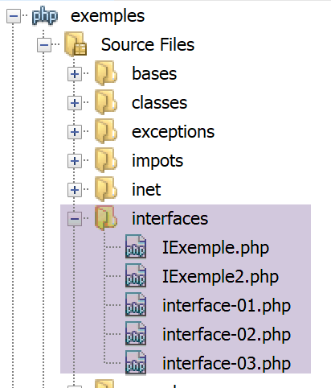

Les interfaces
==============

Une interface est une structure définissant des prototypes de méthodes.
Une classe implémentant une interface doit définir le code de toutes les
méthodes de l'interface.

L’arborescence des scripts
--------------------------

|image0|

Une première interface
----------------------

Nous définissons une interface **[IExemple]** dans un script
**[IExemple.php]**. Dans ce même script, nous définissons deux classes
implémentant l’interface **[IExemple]** :

.. code-block:: php 
   :linenos:

   <?php

   // respect strict des types des paramètres des fonctions
   declare(strict_types=1);

   // espace de noms
   namespace Exemples;

   // une interface
   interface IExemple {
       // les méthodes de l'interface
       public function ajouter(int $i, int $j): int;
       public function soustraire(int $i, int $j): int;
   }

   // implémentation 1 de l'interface IExemple
   class Classe1 implements IExemple {
       public function ajouter(int $a, int $b): int {
           return $a + $b + 10;
       }

       public function soustraire(int $a, int $b): int {
           return $a - $b + 20;
       }

   }

   // implémentation 2 de l'interface IExemple
   class Classe2 implements IExemple {
       public function ajouter(int $a, int $b) : int{
           return $a + $b + 100;
       }

       public function soustraire(int $a, int $b) : int {
           return $a - $b + 200;
       }

   }

**Commentaires**

-  lignes 10-14 : l'interface *IExemple* définit deux méthodes : la
   fonction *ajouter* (ligne 12) et la fonction *soustraire* (ligne 13).
   L'interface ne définit pas le code de ces méthodes. Ce sont les
   classes implémentant l'interface qui vont le faire ;

-  ligne 17 : la classe *Classe1* implémente (**implements**)
   l'interface *IExemple*. Elle définit donc un code pour les méthodes
   *ajouter* (ligne 18) et *soustraire* (ligne 22) ;

-  lignes 29-38 : idem pour la classe *Classe2 ;*

Nous utilisons l’interface **[IExemple]** dans le script
**[interfaces-01.php]** suivant :

.. code-block:: php 
   :linenos:

   <?php

   require_once "IExemple.php";
   use \Exemples\Classe1;
   use \Exemples\Classe2;
   use \Exemples\IExemple;

   // fonction
   function calculer(int $a, int $b, IExemple $interface) : void {
     print $interface->ajouter($a, $b)."\n";
     print $interface->soustraire($a, $b)."\n";
   }

   // ------------------- main
   // création de 2 objets de type Classe1 et Classe2
   $c1 = new Classe1();
   $c2 = new Classe2();
   // appel de la fonction calculer
   calculer(4, 3, $c1);
   calculer(14, 13, $c2);

**Commentaires**

-  lignes 3-6 : inclusion et définition des classes et interfaces
   utilisées par le script ;

-  ligne 3 : au lieu de l’instruction **include** nous avons utilisé ici
   l’instruction **require_once**. L’instruction **include** inclut un
   fichier dans le script en cours même si celui-ci a déjà été inclus
   alors que l’instruction **require_once** ne l’inclut qu’une fois.
   Donc pour ce qui est de l’inclusion de code, on préfèrera
   l’instruction **require_once **;

-  lignes 9-12 : on définit une fonction ;

-  ligne 9 : nous avons déclaré ici le type des trois paramètres. Si à
   l’exécution, le paramètre effectif n’est pas du type attendu, une
   erreur est lancée. Le 3\ :sup:`e` paramètre est de type
   **[IExemple]**. Cela veut dire que le paramètre effectif doit être
   une instance de classe implémentant l’interface **[IExemple]**, donc
   dans notre exemple, une instance des classes **[Classe1]** ou
   **[Classe2]** ;

-  lignes 10-11 : nous utilisons les méthodes **[ajouter, soustraire]**
   de l’interface **[IExemple]** ;

-  ligne 19 : le 3\ :sup:`e` paramètre effectif est de type
   **[Classe1]** compatible avec le type **[IExemple]** du 3\ :sup:`e`
   paramètre formel de la fonction ;

-  ligne 20 : idem pour la classe **[Classe2]** ;

**Résultats**

.. code-block:: php 
   :linenos:

   17
   21
   127
   201

Dérivation d’une interface
--------------------------

De la même façon qu’une classe fille peut étendre une classe parent, une
interface fille peut étendre une interface parent.

Considérons l’interface **[IExemple2]** définie dans le fichier
**[IExemple2.php]** :

.. code-block:: php 
   :linenos:

   <?php

   // respect strict des types des paramètres des fonctions
   declare(strict_types=1);
   // espace de noms
   namespace Exemples;

   // inclusion de la définition de l'interface IExemple
   require_once __DIR__."/IExemple.php";

   // une interface qui dérive de IExemple
   interface IExemple2 extends IExemple {
       // la méthode de l'interface
       public function multiplier(int $i, int $j): int;
   }

   // implémentation de l'interface IExemple2
   class Classe3 extends Classe2 implements IExemple2 {
      
       public function multiplier(int $a, int $b): int {
           return $a * $b;
       }

   }

**Commentaires**

-  ligne 6 : l’interface **[IExemple2]** sera dans le même espace de
   noms que l’interface **[Iexemple]** ;

-  ligne 9 : on inclut le fichier de définition de l’interface
   **[Iexemple]** ;

-  lignes 12-15 : définissent l’interface **[IExemple2]** qui étend
   (hérite) l’interface **[Iexemple]** (**extends**) et lui ajoute une
   nouvelle méthode (ligne 14);

-  lignes 18-24 : la classe **[Classe3]** étend la classe **[Classe2]**.
   Comme celle-ci implémente l’interface **[IExemple]**, ce sera
   également le cas de la classe **[Classe3]**. En effet, **[Classe3]**
   hérite de toutes les méthodes publiques et protégées de la classe
   **[Classe2]**, donc des méthodes **ajouter** et **soustraire**. Par
   ailleurs, on indique que **[Classe3]** implémente l’interface
   **[IExemple2]**. A ce titre, elle doit également implémenter la
   méthode **multiplier**, ce que ne fait pas **[Classe2]**. C’est ce
   que font les lignes 20-22;

L’interface **[IExemple2]** est exploitée par le script
**[interfaces-02]** suivant:

.. code-block:: php 
   :linenos:

   <?php

   // respect strict des types des paramètres des fonctions
   declare(strict_types=1);

   // inclusion et qualifications des classes et interfaces nécessaires au script
   require_once __DIR__."/Iexemple2.php";
   use \Exemples\IExemple2;
   use \Exemples\Classe3;

   // fonction
   function calculer(int $a, int $b, IExemple2 $interface) {
       print $interface->ajouter($a, $b) . "\n";
       print $interface->soustraire($a, $b) . "\n";
       print $interface->multiplier($a, $b) . "\n";
   }

   // ------------------- main
   // création d'1 objet de type Classe3 qui implémente IExemple2
   $c3 = new Classe3();
   // appel de la fonction calculer
   calculer(4, 3, $c3);

**Commentaires**

-  ligne 12 : le 3\ :sup:`e` paramètre de la fonction **[calculer]** est
   de type **[IExemple2]** ;

-  lignes 13-15 : on utilise les trois méthodes de l’interface
   **[IExemple2]** ;

-  ligne 22 : on appelle la fonction **[calculer]** avec comme
   3\ :sup:`e` paramètre un objet de type **[IExemple2]** (ligne 20) ;

**Résultats**

.. code-block:: php 
   :linenos:

   107
   201
   12

Passage d’une interface en paramètre d’une fonction
---------------------------------------------------

Nous avons vu au `paragraphe <#_Passage_d’un_objet>`__ que lorsque le
type attendu pour un paramètre de fonction est une classe alors le
paramètre effectif peut être un objet du type attendu **ou dérivé**. Il
en est de même pour les interfaces comme le montre le script suivant
**[interfaces-03.php]** :

.. code-block:: php 
   :linenos:

   <?php

   // respect strict des types des paramètres des fonctions
   declare(strict_types=1);

   // inclusion et qualifications des classes et interfaces nécessaires au script
   require_once __DIR__."/IExemple.php";
   use \Exemples\IExemple;
   require_once __DIR__."/IExemple2.php";
   use \Exemples\Classe3;

   // fonction
   function calculer(int $a, int $b, IExemple $interface) {
     print $interface->ajouter($a, $b) . "\n";
     print $interface->soustraire($a, $b) . "\n";
   }

   // ------------------- main
   // création d'1 objet de type Classe3 qui implémente IExemple2 et donc IExemple
   $c3 = new Classe3();
   // appel de la fonction calculer
   calculer(4, 3, $c3);

**Commentaires**

-  ligne 13, la fonction **[calculer]** attend comme troisième paramètre
   un type **[IExemple]**. Cela signifie que le type du paramètre
   effectif pourra être de type **[IExemple]** **ou dérivé** ;

-  ligne 20 : on instancie un objet $\ **c3** de type **[Classe3]**,
   classe qui implémente l’interface **[IExemple2]** qui elle-même étend
   l’interface **[IExemple]**. Donc finalement $\ **c3** implémente
   l’interface **[IExemple]** ;

-  ligne 22 : on appelle la fonction **[calculer]** avec comme troisième
   paramètre un objet $\ **c3** de type **[Classe3]**. Par le jeu des
   héritages de classes et des implémentations, on a vu que l’objet
   $\ **c3** implémentait le type **[IExemple]**. On peut donc
   l’utiliser comme troisième paramètre ;

**Résultats**

.. code-block:: php 
   :linenos:

   107
   201

