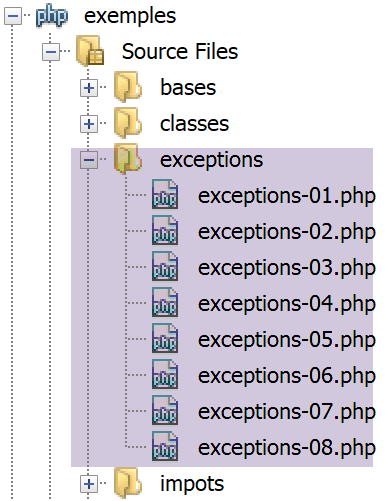

Les exceptions et erreurs
=========================

Lorsqu’une méthode d’une classe rencontre une erreur irrécupérable
(fichier inexistant, base de données non connectée, connexion réseau
hors service), elle n’affiche pas une erreur sur une console (fichier,
base de données) mais **lance une exception**. Toutes les exceptions
étendent la classe **[\Exception]**. Outre des exceptions, le
fonctionnement interne de PHP émet également des erreurs dont la classe
de base est la classe **[\Error]**. Les deux classes implémentent
l’interface PHP **[\Throwable]**.

L’arborescence des scripts
--------------------------

|image0|

L’interface [\Throwable]
------------------------

L’interface **[\Throwable]** est la suivante :

|image1|

Le rôle des méthodes de l’interface est le suivant :

|image2|

Les exceptions prédéfinies dans PHP 7
-------------------------------------

PHP 7 définit plusieurs classes d’exceptions :

|image3|

-  en **[1]**, les exceptions prédéfinies dans PHP ;

-  en **[2]**, les exceptions de la bibliothèque SPL (Standard PHP
   Library) de PHP 7. la bibliothèque SPL est une collection de classes
   et d’interfaces destinées à résoudre des problèmes rencontrés
   fréquemment par les développeurs.

Les erreurs prédéfinies dans PHP 7
----------------------------------

PHP 7 définit plusieurs classes d’erreurs :

|image4|

La classe **[\Error]** est la classe parent de toutes les erreurs
prédéfinies dans PHP. La classe **[ErrorException]** permet d’encapsuler
une instance de la classe **[\Error]** dans une instance de la classe
**[\Exception]**. Ceci permet d’uniformiser la gestion des erreurs en ne
traitant que des exceptions.

Exemple 1
---------

Le premier exemple **[exceptions-01.php]** montre à la fois des erreurs
PHP et une exception :

.. code-block:: php 
   :linenos:

   <?php

   // affichage de toutes les erreurs
   ini_set("error_reporting", E_ALL);
   ini_set("display_errors", "on");
   // code --------
   $var=[];
   // clé inconnue
   print $var["abcd"];
   // division par zéro
   $var=7/0;
   var_dump($var);
   // tableau à bornes fixes
   $array = new \SplFixedArray(5);
   $array[1] = 2;
   $array[4] = "foo";
   // indice en-dehors des bornes
   $array[5]=8;

**Commentaires**

-  ligne 4 : on demande à PHP de signaler toutes les erreurs. Le second
   paramètre est le niveau d’erreurs demandé :

|image5|

|image6|

-  ligne 5 : on demande d’afficher les erreurs sur la console ;

-  ligne 9 : on accède à un élément inexistant du tableau **[$var]** ;

-  ligne 11 : on fait une division par zéro ;

-  ligne 14 : on crée une instance de la classe **[SplFixedArray]**.
   Cette classe permet de créer un tableau à bornes fixes et à indices
   entiers ;

-  ligne 18 : on accède à un élément inexistant du tableau ;

**Résultats**

.. code-block:: php 
   :linenos:

   Notice: Undefined index: abcd in C:\Data\st-2019\dev\php7\php5-exemples\exemples\exceptions\exceptions-01.php on line 9

   Warning: Division by zero in C:\Data\st-2019\dev\php7\php5-exemples\exemples\exceptions\exceptions-01.php on line 11
   float(INF)

   Fatal error: Uncaught RuntimeException: Index invalid or out of range in C:\Data\st-2019\dev\php7\php5-exemples\exemples\exceptions\exceptions-01.php:18
   Stack trace:
   #0 {main}
   thrown in C:\Data\st-2019\dev\php7\php5-exemples\exemples\exceptions\exceptions-01.php on line 18

**Commentaires**

-  ligne 1 des résultats : accéder à une clé inexistante d’un tableau
   provoque une erreur PHP de niveau **[E_NOTICE]**. Cela n’interrompt
   pas l’exécution du script ;

-  ligne 3 des résultats : diviser un nombre par zéro provoque une
   erreur PHP de niveau **[E_WARNING]**. Cela n’interrompt pas
   l’exécution du script ;

-  lignes 6-9 des résultats : accéder à un indice inexistant d’un
   tableau **[SplFixedArray]** provoque une exception de type
   **[RuntimeException]** et interrompt l’exécution du script ;

Gérer les exceptions
--------------------

Le script **[exceptions-02.php]** montre comment gérer les exceptions :

.. code-block:: php 
   :linenos:

   <?php

   // on affiche toutes les erreurs
   ini_set("error_reporting", E_ALL);
   ini_set("display_errors", "on");
   // on entoure le code par un try / catch
   try {
     $var = [];
     // clé inconnue
     print $var["abcd"];
     // division par zéro
     $var = 7 / 0;
     var_dump($var);
     // tableau à bornes fixes
     $array = new \SplFixedArray(5);
     $array[1] = 2;
     $array[4] = "foo";
     // indice en-dehors des bornes
     $array[5] = 8;
     // vérification
     print "ce message ne sera pas affiché\n";
   } catch (\Throwable $ex) {
     // \Throwable est l'interface implémentée par la plupart des erreurs et exceptions
     // on affiche l'exception
     print "erreur, message : " . $ex->getMessage() . ", type : " . get_class($ex) . "\n";
   }

**Commentaires**

-  le script est celui qui a été présenté au paragraphe précédent.
   Seulement maintenant on a entouré le code des lignes 8-19 susceptible
   de provoquer des erreurs par une structure **try / catch** : si le
   code des lignes 8-21 provoque (lance) une exception ou une erreur,
   celle-ci sera gérée par la clause **catch** des lignes 22-26 ;

-  ligne 22 : le paramètre de la clause **[catch]** est le type
   d’exception ou d’erreur que l’on veut gérer. En mettant comme type
   **[\Throwable]** qui est une interface, on indique qu’on veut gérer
   toute instance de classe implémentant l’interface **[\Throwable]**.
   Comme toutes les classes d’erreurs et d’exceptions implémentent cette
   interface, la clause **[catch]** gère ici toute erreur / exception
   encapsulée dans une classe ;

-  ligne 19 : l’instruction qui déclenche l’erreur et donne naissance à
   l’exception. Dès qu’il y a exception, il y a branchement sur la
   clause **[catch]**. Le code derrière la ligne 19 ne sera donc pas
   exécuté ;

**Résultats**

.. code-block:: php 
   :linenos:

   Notice: Undefined index: abcd in C:\Data\st-2019\dev\php7\php5-exemples\exemples\exceptions\exceptions-02.php on line 10

   Warning: Division by zero in C:\Data\st-2019\dev\php7\php5-exemples\exemples\exceptions\exceptions-02.php on line 12
   float(INF)
   erreur, message : Index invalid or out of range, type : RuntimeException

**Commentaires des résultats**

-  lignes 1 et 3 : on retrouve les erreurs de niveau **[E_NOTICE]** et
   **[E_WARNING]**. Ces erreurs ne sont pas des exceptions et ne sont
   donc pas gérées par la clause **[catch]** ;

-  ligne 5 : on a le message d’erreur écrit dans la clause **[catch]**.
   Il s’est donc produit une exception dérivée de **[\Exception]** ou
   une erreur dérivée de **[\Error]**. Nous voyons ici qu’il s’agit de
   la classe **[\RuntimeException]** ;

Paramètres de la clause [catch]
-------------------------------

Examinons le script **[exceptions-03.php]** suivant :

.. code-block:: php 
   :linenos:

   <?php

   // on affiche toutes les erreurs
   ini_set("error_reporting", E_ALL);
   ini_set("display_errors", "on");

   // un tableau à bornes fixes
   $array = new \SplFixedArray(5);
   try {
     // indice en-dehors des bornes
     $array[5] = 8;
   } catch (\Throwable $ex) {
     // affichage message d'erreur
     print "Erreur 1 : " . $ex->getMessage() . "\n";
   }

   try {
     // indice en-dehors des bornes
     $array[5] = 8;
   } catch (\Exception $ex) {
     // affichage message d'erreur
     print "Erreur 2 : " . $ex->getMessage() . "\n";
   }

   try {
     // indice en-dehors des bornes
     $array[5] = 8;
   } catch (\RuntimeException $ex) {
     // affichage message d'erreur
     print "Erreur 3 : " . $ex->getMessage() . "\n";
   }
   try {
     // division par 0
     intdiv(5, 0);
   } catch (\Throwable $ex) {
     // affichage message d'erreur
     print "Erreur 4 : " . $ex->getMessage() . "\n";
   }

   try {
     // division par 0
     intdiv(5, 0);
   } catch (\DivisionByzeroError $ex) {
     // affichage message d'erreur
     print "Erreur 5 : " . $ex->getMessage() . "\n";
   }

   try {
     // division par 0
     intdiv(5, 0);
   } catch (\Error $ex) {
     // affichage message d'erreur
     print "Erreur 6 : " . $ex->getMessage() . "\n";
   }

   try {
     // division par 0
     intdiv(5, 0);
   } catch (\Exception $ex) {
     // affichage message d'erreur
     print "Erreur 6 : " . $ex->getMessage() . "\n";
   }

**Commentaires**

-  lignes 8-31 : 3 façons différentes de gérer l’exception générée par
   l’utilisation d’un indice incorrect avec la classe
   **[\SplFixedArray]**. Nous avons vu que cette erreur générait une
   exception de type **[RuntimeException]** ;

   -  ligne 12 : gère une erreur de type **[\Throwable]**. C’est valide
      puisque le type **[RuntimeException]** dérive du type
      **[\Exception]** qui implémente l’interface **[\Throwable]** ;

   -  ligne 20 : gère une erreur de type **[\Exception]**. C’est valide
      puisque le type **[RuntimeException]** dérive du type
      **[\Exception]** ;

   -  ligne 28 : gère une erreur de type **[\RuntimeException]**. C’est
      la méthode à privilégier puisque c’est le type exact de
      l’exception générée ;

-  lignes 32-62 : 4 façons différentes de gérer l’exception générée par
   la fonction **[intdiv]** lorsqu’on passe à celle-ci un diviseur égal
   à 0. La fonction **[ intdiv ( int $dividend , int $divisor ) : int]**
   fait la division entière $dividend / $divisor. Lorsque le diviseur
   est nul, l’exception **[\DivisionByzeroError]** est lancée ;

   -  ligne 35 : on intercepte toute erreur implémentant l’interface
      **[\Throwable]**. C’est valide ;

   -  ligne 43 : on intercepte le type exact de l’erreur : c’est la
      méthode à privilégier ;

   -  ligne 51 : on intercepte le type **[\Error]**. C’est valide
      puisque la classe **[DivisionByzeroError]** étend la classe
      **[Error]** ;

   -  ligne 59 : on intercepte le type **[\Exception]**. C’est invalide
      car la classe **[DivisionByzeroError]** n’a aucun lien avec la
      classe **[\Exception]** ;

**Résultats**

.. code-block:: php 
   :linenos:

   Erreur 1 : Index invalid or out of range
   Erreur 2 : Index invalid or out of range
   Erreur 3 : Index invalid or out of range
   Erreur 4 : Division by zero
   Erreur 5 : Division by zero
   Erreur 6 : Division by zero

   Fatal error: Uncaught DivisionByZeroError: Division by zero in C:\Data\st-2019\dev\php7\php5-exemples\exemples\exceptions\exceptions-03.php:58
   Stack trace:
   #0 C:\Data\st-2019\dev\php7\php5-exemples\exemples\exceptions\exceptions-03.php(58): intdiv(5, 0)
   #1 {main}
   thrown in C:\Data\st-2019\dev\php7\php5-exemples\exemples\exceptions\exceptions-03.php on line 58

Clause [finally]
----------------

La structure try / catch peut avoir un troisième élément et devenir une
structure **try / catch / finally**. Le code de la clausse **[finally]**
est exécuté dans les deux cas suivants :

-  la clause **[try]** ne lance pas d’exception. Elle est alors exécutée
   entièrement puis l’exécution du code passe à la clause **[finally]**
   qui est exécutée entièrement ;

-  la clause **[try]** lance une exception. Elle est alors exécutée
   jusqu’à l’instruction qui lance l’exception. L’exécution du code
   passe alors à la clause **[catch]** qui est exécutée entièrement.
   Puis l’exécution du code passe à la clause **[finally]** qui est
   exécutée entièrement ;

Finalement, le code de la clause **[finally]** est toujours exécuté. Ce
scénario est utile dans le cas suivant :

-  dans le **[try]**, le code a obtenu des ressources (fichiers, bases
   de données, connexions réseau, files d’attente). En général ces
   ressources sont coûteuses en mémoire. Il faut alors les rendre (on
   dit le plus souvent **fermer**) dès que c’est possible ;

-  si l’acquisition des ressources a été faite dans le **[try]**, on
   mettra leur restitution dans le **[finally]**. Cela nous assure que
   dans tous les cas (erreur ou pas), les ressources acquises sont
   restituées au système ;

Le script suivant **[exemples/exceptions/exceptions-04.php]** nous
montre le fonctionnement de la clause **[finally]** dans diverses
situations :

.. code-block:: php 
   :linenos:

   <?php

   // ou crée une instance d'exception
   $e = new \Exception("Erreur…");	
   var_dump($e);

   // premier test
   try {
     print "Premier test\n";
     throw $e;
   } catch (\Exception $ex1) {
     print $ex1->getMessage() . "\n";
   } finally {
     print "Terminé\n";
   }

   // second test
   try {
     print "Second test\n";
   } catch (\Exception $ex1) {
     print $ex1->getMessage() . "\n";
   } finally {
     print "Terminé\n";
   }

   // trosième test
   try {
     print "Troisième test\n";
     return;
   } catch (\Exception $ex1) {
     print $ex1->getMessage() . "\n";
   } finally {
     print "Terminé\n";
   }

**Commentaires du code**

-  ligne 4 : $e est une instance de la classe prédéfinie
   **[\Exception]**. On va la lancer à différents endroits ;

-  lignes 8-15 : l’exception $e est lancée dans le **[try]** (ligne
   10) ;

-  ligne 11 : l’exception **[\Exception]** est interceptée et son
   message d’erreur écrit sur la console ;

-  lignes 13-15 : la clause **[finally]** écrit un message. D’après ce
   qui a été dit précédemment, ce message devrait être tout le temps
   écrit, erreur ou pas dans le **[try]** ;

-  lignes 18-24 : il n’y a pas d’erreur dans le **[try]**. On devrait là
   également passer dans le **[finally]** ;

-  lignes 27-34 : il y a une instruction **[return]** dans le try et pas
   d’erreur. On peut se demander alors si on va passer dans la clause
   **[finally]**. L’exécution montre que oui ;

**Résultats**

.. code-block:: php 
   :linenos:

   Premier test
   Erreur…
   Terminé
   Second test
   Terminé
   Troisième test
   Terminé

Examinons un autre cas **[exceptions-05.php]** :

.. code-block:: php 
   :linenos:

   <?php

   // quatrième test
   try {
     print "Quatrième test\n";
     exit;
   } finally {
     print "Terminé\n";
   }

**Commentaires**

-  ligne 6 : l’instruction **[exit]** arrête immédiatement l’exécution
   du script : la clause **[finally]** n’est pas exécutée ;

-  lignes 4-9 : un exemple de try / catch / finally sans clause
   **[catch]**. C’est possible ;

**Résultats**

.. code-block:: php 
   :linenos:

   Quatrième test

Créer ses propres classes d’exceptions
--------------------------------------

Dans un projet un peu important, il est utile de différentier les
différentes erreurs en les encapsulant dans différentes classes
d’exceptions. Dans le script précédent, nous avons vu que toute
exception pouvait être interceptée par une clause **[catch
(\Throwable]**. C’est recommandé si on n’a aucune idée de l’erreur
interceptée et que le traitement est le même pour toutes les erreurs.
C’est parfois le cas mais on a souvent besoin d’adapter le traitement au
type exact de l’erreur. Il faut alors différentier les erreurs
entre-elles.

Examinons le script **[exceptions-06.php]** suivant :

.. code-block:: php 
   :linenos:

   <?php

   // on définit notre propre famille d'exceptions
   class Exception1 extends \RuntimeException {
     
   }

   class Exception2 extends \RuntimeException {
     
   }

   // ou utilise nos exceptions
   $e1 = new Exception1("Erreur1…");
   var_dump($e1);
   $e2 = new Exception2("Erreur2…");
   var_dump($e2);

   // premier test
   print ("premier test\n");
   try {
     // on lance un type Exception1
     throw $e1;
   } catch (Exception1 $ex1) {
     print "Exception 1" . "\n";
     print $ex1->getMessage() . "\n";
   } catch (Exception2 $ex2) {
     print "Exception 2" . "\n";
     print $ex2->getMessage() . "\n";
   }

   // second test
   print ("second test\n");
   try {
     // on lance un type Exception2
     throw $e2;
   } catch (Exception1 $ex1) {
     print "Exception 1" . "\n";
     print $ex1->getMessage() . "\n";
   } catch (Exception2 $ex2) {
     print "Exception 2" . "\n";
     print $ex2->getMessage() . "\n";
   }

   // troisième test
   print ("troisième test\n");
   try {
     // on lance un type Exception1
     throw $e1;
   } catch (Exception1 | Exception2 $ex) {
     print "Exception 1 ou 2" . "\n";
     print $ex->getMessage() . "\n";
   }

   // quatrième test
   print ("quatrième test\n");
   try {
     // on lance un type Exception2
     throw $e2;
   } catch (Exception1 | Exception2 $ex) {
     print "Exception 1 ou 2" . "\n";
     print $ex->getMessage() . "\n";
   }

**Commentaires**

-  lignes 4-10 : on définit deux classes **[Exception1]** et
   **[Exception2]** toutes deux dérivées de la classe prédéfinie
   **[\RuntimeException]**. Le corps de ces classes est vide. Autrement
   dit, on ne les utilise que pour leurs types : c’est parce qu’elles
   ont des types différents qu’on va pouvoir différentier ces deux
   exceptions dans les clauses **[catch]** ;

-  lignes 13-16 : on définit deux variables $e1 et $e2 ayant
   respectivement les types **[Exception1]** et **[Exception2]** ;

-  lignes 20-29 : on a une structure try / catch / catch. Cela permet de
   gérer différents types d’exception avec différentes clauses
   **[catch]** ;

-  ligne 23 : intercepte les exceptions de type **[Exception1]** ;

-  ligne 26 : intercepte les exceptions de type **[Exception2]** ;

-  ligne 49 : intercepte les exceptions de type **[Exception1]** ou (|)
   **[Exception2]** ;

**Résultats**

.. code-block:: php 
   :linenos:

   object(Exception1)#1 (7) {
     ["message":protected]=>
     string(10) "Erreur1…"
     ["string":"Exception":private]=>
     string(0) ""
     ["code":protected]=>
     int(0)
     ["file":protected]=>
     string(76) "C:\Data\st-2019\dev\php7\php5-exemples\exemples\exceptions\exceptions-06.php"
     ["line":protected]=>
     int(13)
     ["trace":"Exception":private]=>
     array(0) {
     }
     ["previous":"Exception":private]=>
     NULL
   }
   object(Exception2)#2 (7) {
     ["message":protected]=>
     string(10) "Erreur2…"
     ["string":"Exception":private]=>
     string(0) ""
     ["code":protected]=>
     int(0)
     ["file":protected]=>
     string(76) "C:\Data\st-2019\dev\php7\php5-exemples\exemples\exceptions\exceptions-06.php"
     ["line":protected]=>
     int(15)
     ["trace":"Exception":private]=>
     array(0) {
     }
     ["previous":"Exception":private]=>
     NULL
   }
   premier test
   Exception 1
   Erreur1…
   second test
   Exception 2
   Erreur2…
   troisième test
   Exception 1 ou 2
   Erreur1…
   quatrième test
   Exception 1 ou 2
   Erreur2…

**Commentaires des résultats**

-  lignes 1-17 : le ‘contenu’ d’une exception :

   -  lignes 2-3 : le message d’erreur ;

   -  lignes 6-7 : le code d’erreur ;

   -  lignes 8-9 : le nom du fichier dans lequel s’est produite
      l’exception ;

   -  lignes 10-11 : la ligne à laquelle s’est produite l’exception ;

   -  lignes 15-16 : l’exception précédente. Une exception peut
      encapsuler une autre exception et définir ainsi une pile
      d’exceptions. L’attribut **[previous]** va permettre d’exploiter
      cette pile ;

Relancer une exception
----------------------

Une exception peut être lancée plusieurs fois comme le montre le script
**[exceptions-07.php]** suivant :

.. code-block:: php 
   :linenos:

   <?php

   try {
     try {
       // on lance une exception
       throw new \Exception("test");
     } catch (\Exception $ex) {
       // on relance l'exception interceptée
       throw $ex;
     } finally {
       // on passera bien dans le finally
       print "finally 1\n";
     }
   } catch (\Exception $ex2) {
     // on récupère bien l'exception initiale
     print $ex2->getMessage() . " dans try / catch / finally externe\n";
   } finally {
     // on passera bien dans le finally
     print "finally 2\n";
   }

**Commentaires**

-  ligne 6 : on lance une exception ;

-  ligne 7 : on l’intercepte ;

-  ligne 9 : on la relance. Elle passe alors dans la structure try /
   catch / finally du niveau supérieur ;

-  ligne 14 : on l’intercepte de nouveau ;

-  lignes 10-12 : l’exécution montre que même après le **[throw]** de la
   ligne 9, on passe bien dans la clause **[finally]** du try / catch /
   finally ;

**Résultats**

.. code-block:: php 
   :linenos:

   finally 1
   test dans try / catch / finally externe
   finally 2

Exploitation d’une pile d’exceptions
------------------------------------

Une exception peut encapsuler une autre exception qui elle-même peut en
encapsuler une autre formant finalement une pile d’exceptions. Voici un
exemple **[exceptions-08.php]** :

.. code-block:: php 
   :linenos:

   <?php

   // on définit notre propre famille d'exceptions
   class Exception1 extends \RuntimeException {
     
   }

   class Exception2 extends \RuntimeException {
     
   }

   class Exception3 extends \RuntimeException {
     
   }

   // ou utilise nos exceptions
   $e1 = new Exception1("Erreur 1…", 1, new Exception2("Erreur 2…", 2, new Exception3("Erreur 3…")));
   var_dump($e1);
   // exploitation de l'exception courante
   print $e1->getMessage() . "\n";
   $e = $e1;
   while ($e->getPrevious() !== NULL) {
     // exception précédente
     $e = $e->getPrevious();
     // message d'erreur
     print $e->getMessage() . "\n";
   }

**Commentaires**

-  lignes 4-14 : définissent trois classes d’exceptions dérivées de
   l’exception prédéfinie **[RuntimeException]** ;

-  ligne 17 : une instance de la classe **[Exception3]** est encapsulée
   dans une instance de la classe **[Exception2]** qui elle-même est
   encapsulée dans une instance de la classe **[Exception1]**. Le
   constructeur utilisé ici est le constructeur de la classe
   **[Exception]** :

|image7|

   Le 3\ :sup:`e` paramètre du constructeur permet d’encapsuler une
   exception. Cela peut être utile dans le scénario suivant :

-  on définit une méthode M qui peut générer une exception de type
   **[Exception1]** et seulement de ce type pour des raisons de
   compatibilité par exemple avec une interface ;

-  or dans la méthode M peuvent se produire d’autres types d’exceptions.
   Pour remonter une erreur au code appelant la méthode M, on
   encapsulera alors ces exceptions dans le type **[Exception1]** que
   l’on lancera. Cela permet de ne pas perdre l’information contenue
   dans l’exception encapsulée et qui a été la cause originelle de
   l’erreur ;

-  les lignes 20-27 montrent comment gérer la pile des exceptions
   internes à une exception ;

**Résultats**

.. code-block:: php 
   :linenos:

   object(Exception1)#1 (7) {
     ["message":protected]=>
     string(11) "Erreur 1…"
     ["string":"Exception":private]=>
     string(0) ""
     ["code":protected]=>
     int(1)
     ["file":protected]=>
     string(76) "C:\Data\st-2019\dev\php7\php5-exemples\exemples\exceptions\exceptions-08.php"
     ["line":protected]=>
     int(17)
     ["trace":"Exception":private]=>
     array(0) {
     }
     ["previous":"Exception":private]=>
     object(Exception2)#2 (7) {
       ["message":protected]=>
       string(11) "Erreur 2…"
       ["string":"Exception":private]=>
       string(0) ""
       ["code":protected]=>
       int(2)
       ["file":protected]=>
       string(76) "C:\Data\st-2019\dev\php7\php5-exemples\exemples\exceptions\exceptions-08.php"
       ["line":protected]=>
       int(17)
       ["trace":"Exception":private]=>
       array(0) {
       }
       ["previous":"Exception":private]=>
       object(Exception3)#3 (7) {
         ["message":protected]=>
         string(11) "Erreur 3…"
         ["string":"Exception":private]=>
         string(0) ""
         ["code":protected]=>
         int(0)
         ["file":protected]=>
         string(76) "C:\Data\st-2019\dev\php7\php5-exemples\exemples\exceptions\exceptions-08.php"
         ["line":protected]=>
         int(17)
         ["trace":"Exception":private]=>
         array(0) {
         }
         ["previous":"Exception":private]=>
         NULL
       }
     }
   }
   Erreur 1…
   Erreur 2…
   Erreur 3…

