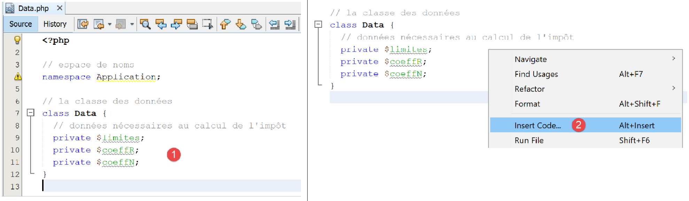
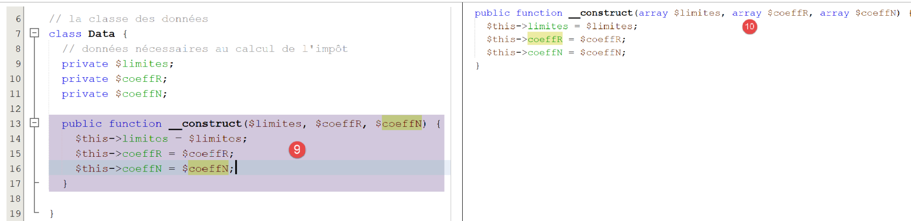
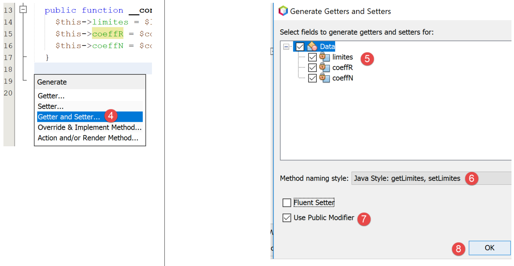
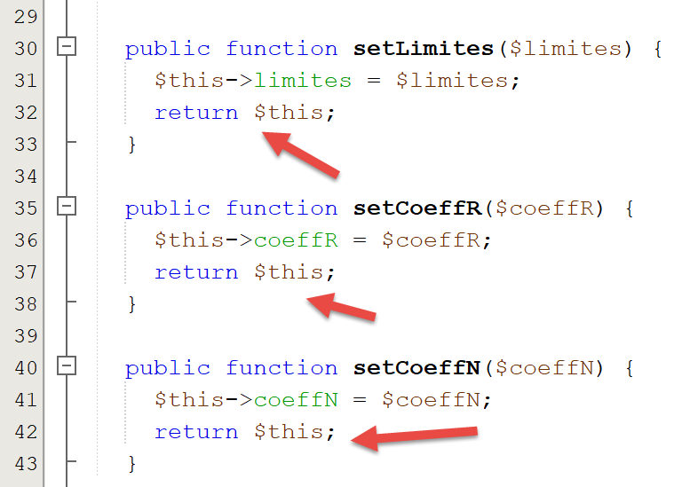

Exercice d'application – version 3
==================================

On reprend l'exercice déjà étudié précédemment (paragraphes
`lien <chap-04.html#version_1>`__ et `lien <chap-04.html#version_2>`__)
pour le résoudre avec un code PHP utilisant une classe.

L’arborescence des scripts
--------------------------

|image0|

L’exception [ExceptionImpots]
-----------------------------

Dans la version 03, lorsqu’un constructeur ou une méthode de classe
rencontrera une erreur, elle lancera une exception de type
**[ExceptionImpots]** suivant :

.. code-block:: php 
   :linenos:

   <?php

   // espace de noms
   namespace Application;

   class ExceptionImpots extends \RuntimeException {

     public function __construct(string $message, int $code=0) {
       parent::__construct($message, $code);
     }

   }

**Commentaires**

-  ligne 4 : la classe **[ExceptionImpots]** est dans l’espace de noms
   **[Application]** ;

-  ligne 6 : la classe **[ExceptionImpots]** étend la classe prédéfinie
   dans PHP **[RuntimeException]** ;

-  ligne 8 : le constructeur attend deux paramètres :

   -  $\ **message** : est le message d’erreur associée à l’exception ;

   -  $\ **code** : est le code d’erreur associé à l’exception. S’il
      n’est pas présent, alors le code 0 sera utilisé ;

La classe [TaxAdminData]
------------------------

Dans la version 02, les données de l’administration fiscale ont été
rassemblées :

-  d’abord dans un fichier jSON ;

-  puis de ce fichier jSON à un tableau associatif ;

Dans la version 03, les données de l’administration fiscale sont
toujours dans le fichier **[taxadmindata.json]** mais avec des noms
d’attribut différents :

.. code-block:: php 
   :linenos:

   {
   	"limites": [
   		9964,
   		27519,
   		73779,
   		156244,
   		0
   	],
   	"coeffR": [
   		0,
   		0.14,
   		0.3,
   		0.41,
   		0.45
   	],
   	"coeffN": [
   		0,
   		1394.96,
   		5798,
   		13913.69,
   		20163.45
   	],
   	"plafondQfDemiPart": 1551,
   	"plafondRevenusCelibatairePourReduction": 21037,
   	"plafondRevenusCouplePourReduction": 42074,
   	"valeurReducDemiPart": 3797,
   	"plafondDecoteCelibataire": 1196,
   	"plafondDecoteCouple": 1970,
   	"plafondImpotCouplePourDecote": 2627,
   	"plafondImpotCelibatairePourDecote": 1595,
   	"abattementDixPourcentMax": 12502,
   	"abattementDixPourcentMin": 437
   }

Dans la version 02, ce fichier servait à initialiser un tableau
associatif. Dans la version 03 le fichier va initialiser la classe
**[TaxAdminData]** suivante :

.. code-block:: php 
   :linenos:

   <?php

   namespace Application;

   class TaxAdminData {
     // tranches d'impôt
     private $limites;
     private $coeffR;
     private $coeffN;
     // constantes de calcul de l'impôt
     private $plafondQfDemiPart;
     private $plafondRevenusCelibatairePourReduction;
     private $plafondRevenusCouplePourReduction;
     private $valeurReducDemiPart;
     private $plafondDecoteCelibataire;
     private $plafondDecoteCouple;
     private $plafondImpotCouplePourDecote;
     private $plafondImpotCelibatairePourDecote;
     private $abattementDixPourcentMax;
     private $abattementDixPourcentMin;

     // initialisation
     public function setFromJsonFile(string $taxAdminDataFilename): TaxAdminData {
       // on récupère le contenu du fichier des données fiscales
       $fileContents = \file_get_contents($taxAdminDataFilename);
       $erreur = FALSE;
       // erreur ?
       if (!$fileContents) {
         // on note l'erreur
         $erreur = TRUE;
         $message = "Le fichier des données [$taxAdminDataFilename] n'existe pas";
       }
       if (!$erreur) {
         // on récupère le code jSON du fichier de configuration dans un tableau associatif
         $arrayTaxAdminData = \json_decode($fileContents, true);
         // erreur ?
         if ($arrayTaxAdminData === FALSE) {
           // on note l'erreur
           $erreur = TRUE;
           $message = "Le fichier de données jSON [$taxAdminDataFilename] n'a pu être exploité correctement";
         }
       }
       // erreur ?
       if ($erreur) {
         // on lance une exception
         throw new ExceptionImpots($message);
       }
       // initialisation des attributs de la classe
       foreach ($arrayTaxAdminData as $key => $value) {
         $this->$key = $value;
       }
       // on vérifie que toutes les clés ont été initialisées
       $arrayOfAttributes = \get_object_vars($this);
       foreach ($arrayOfAttributes as $key => $value) {
         if (!isset($this->$key)) {
           throw new ExceptionImpots("L'attribut [$key] de [TaxAdminData] n'a pas été initialisé");
         }
       }
       // on vérifie qu'on a que des valeurs réelles
       foreach ($this as $key => $value) {
         // $value doit être un nbre réel >=0 ou un tableau de réels >=0
         $result = $this->check($value);
         // erreur ?
         if ($result->erreur) {
           // on lance une exception
           throw new ExceptionImpots("La valeur de l'attribut [$key] est invalide");
         } else {
           // on note la valeur
           $this->$key = $result->value;
         }
       }
       // on rend l'objet
       return $this;
     }

     private function check($value): \stdClass {
       …
       return $result;
     }

       // toString
     public function __toString() {
       // chaîne Json de l'objet
       return \json_encode(\get_object_vars($this), JSON_UNESCAPED_UNICODE);
     }

     // getters et setters
     public function getLimites() {
       return $this->limites;
     }

     public function getCoeffR() {
       return $this->coeffR;
     }

     …
     }

     public function setLimites($limites) {
       $this->limites = $limites;
       return $this;
     }

     public function setCoeffR($coeffR) {
       $this->coeffR = $coeffR;
       return $this;
     }

     …

   }

**Commentaires**

-  lignes 6-20 : les attributs qui vont accueillir les attributs de même
   nom du fichier jSON **[taxadmindata.json]**. C’est un point
   important : les attributs de la classe **[TaxAdminData]** sont
   **identiques** à ceux du fichier jSON **[taxadmindata.json]**. Cette
   particularité facilite beaucoup l’écriture du code ;

-  la classe **[TaxAdminData]** n’a pas de constructeur. En PHP, il
   n’est pas possible d’avoir plusieurs constructeurs. En fixer un
   empêche alors d’initialiser l’objet d’une autre façon. Dans la suite,
   nos classes n’auront pas de constructeur mais plusieurs méthodes de
   type **[setFromQqChose]** qui permettront de l’initialiser de
   différentes façons. La construction d’un objet de type
   **[TaxAdminData]** se fait alors avec l’expression :

.. code-block:: php 
   :linenos:

   (new TaxAdminData())→setFromQqChose(…)

-  ligne 23 : la méthode **[setFromJsonFile]** initialise les attributs
   de la classe avec ceux de même nom dans le fichier
   **[$jsonFilename]** ;

-  lignes 24-42 : le fichier jSON est exploité pour construire le
   tableau associatif **[$arrayTaxAdminData]**. Nous avons déjà
   rencontré ce code dans le script **[main.php]** de la version 02 ;

-  lignes 44-47 : si on a rencontré une erreur dans l’exploitation du
   fichier jSON, on lance une exception. Celle-ci remontera jusqu’au
   script principal **[main.php]** ;

-  lignes 48-51 : les attributs de la classe sont initialisés. On
   profite ici du fait que le tableau associatif
   **[$arrayTaxAdminData]** et la classe **[TaxAdminData]** ont des
   attributs de mêmes noms que les valeurs provenant du fichier jSON ;

-  lignes 53-57 : on vérifie que tous les attributs de la classe
   **[TaxAdminData]** ont été initialisés ;

-  ligne 53 : l’expression **[get_object_vars($this)]** rend un tableau
   associatif dont les attributs sont ceux de l’objet **[$this]**, donc
   les attributs de la classe **[TaxAdminData]**. Ici il faut comprendre
   que l’opération d’initialisation des lignes 48-51 a pu ajouter des
   attributs à l’objet **[$this]**. Ainsi si on écrit :

.. code-block:: php 
   :linenos:

       $this->x = "1000";

..

   alors l’attribut **[x]** est ajouté à l’objet **[$this]** même si cet
   attribut n’a pas été déclaré dans la classe **[TaxAdminData]**. Ce
   qui est sûr, c’est que les attributs des lignes 6-20 font bien partie
   de l’objet **[$this]**, mais ils ont pu être non initialisés. C’est
   une erreur facile à faire, il suffit de se tromper dans un nom
   d’attribut dans le fichier **[taxadmindata.json]** ;

-  lignes 54-57 : on passe en revue tous les attributs de **[$this]** et
   si l’un d’eux n’a pas été initialisé, on lance une exception ;

-  un attribut peut être initialisé avec une valeur incorrecte. En PHP,
   il n’est pas possible de donner un type aux attributs. Ainsi
   l’opération :

.. code-block:: php 
   :linenos:

   $this→plafondQfDemiPart=’abcd’

..

   est possible alors que l’attribut **[$plafondQfDemiPart]** devrait
   être réel ;

-  lignes 59-71 : on vérifie que chacun des attributs de la classe a une
   valeur numérique réelle positive ou nulle. C’est la fonction
   **[check]** de la ligne 76 qui fait ce travail. Son paramètre
   **[$value]** est soit une unique valeur soit un tableau de valeurs ;

-  ligne 62 : la fonction **[check]** rend un objet de type
   **[\stdClass]** avec deux attributs :

   -  **[erreur]** : à TRUE s’il y a eu erreur, à FALSE sinon ;

   -  **[value]** : la valeur numérique réelle correspondant au
      paramètre **[$value]** passé en paramètre, ligne 62 ;

-  ligne 64 : on regarde si la vérification a réussi ou pas ;

-  ligne 66 : si un attribut n’est pas un nombre réel positif ou nul, on
   lance une exception ;

-  ligne 69 : sinon on note sa valeur numérique ;

-  ligne 73 : on rend l’objet **[$this]** comme résultat ;

La fonction **[check]** est la suivante :

.. code-block:: php 
   :linenos:

   private function check($value): \stdClass {
       // $value est soit un tableau d'éléments soit un unique élément
       // on crée un tableau
       if (!\is_array($value)) {
         $tableau = [$value];
       } else {
         $tableau = $value;
       }
       // on transforme le tableau d'éléments de type non connu en tableau de réels
       $newTableau = [];
       $result = new \stdClass();
       // les éléments du tableau doivent être des nombres décimaux positifs ou nuls
       $modèle = '/^\s*([+]?)\s*(\d+\.\d*|\.\d+|\d+)\s*$/';
       for ($i = 0; $i < count($tableau); $i ++) {
         if (preg_match($modèle, $tableau[$i])) {
           // on met le float dans newTableau
           $newTableau[] = (float) $tableau[$i];
         } else {
           // on note l'erreur
           $result->erreur = TRUE;
           // on quitte
           return $result;
         }
       }
       // on rend le résultat
       $result->erreur = FALSE;
       if (!\is_array($value)) {
         // une seule valeur
         $result->value = $newTableau[0];
       } else {
         // une liste de valeurs
         $result->value = $newTableau;
       }
       return $result;
     }

**Commentaires**

-  ligne 1 : le paramètre **[$value]** est soit un tableau soit un
   unique élément. Par ailleurs, on ne connaît pas son type. La valeur
   provient du fichier **[taxadmindata.json]**. Selon les valeurs
   inscrites dans ce fichier, les valeurs lues peuvent être des entiers,
   des réels, des chaînes, des booléens. Par exemple :

.. code-block:: php 
   :linenos:

   "plafondQfDemiPart": 1551,
   "plafondQfDemiPart": 1551.78,
   "plafondQfDemiPart": "1551",
   "plafondQfDemiPart": "xx",

..

   Dans le cas 1, la valeur est de type **[entier]**, dans le cas 2 de
   type **[réel]**, dans le cas 3 de type **[string]** pouvant être
   converti en nombre, dans le cas 4 de type **[string]** ne pouvant pas
   être converti en nombre ;

-  lignes 4-8 : on crée un tableau à partir du paramètre **[$value]**
   reçu en paramètre ligne 1 ;

-  ligne 10 : le tableau qu’on va remplir avec des nombres réels ;

-  ligne 11 : le résultat sera un objet de type **[\stdClass]** ;

-  ligne 13 : expression relationnelle d’un nombre réel positif ou nul ;

-  lignes 14-24 : on vérifie que tous les éléments du tableau
   **[$tableau]** sont des nombres réels positifs ou nuls et on remplit
   le tableau **[$newTableau]** avec ces éléments transformés en type
   **[float]** (ligne 17) ;

-  lignes 18-23 : dès qu’on détecte un élément qui n’est pas un nombre
   réel positif ou nul, on note l’erreur dans le résultat et on rend
   celui-ci ;

-  lignes 25-34 : cas où tous les éléments du tableau **[$tableau]** ont
   été déclarés corrects ;

-  ligne 32 : la valeur rendue **[$result→value]** est un tableau de
   réels **[float]** ou un réel unique ;

La fonction **[__toString]** des lignes 82-85 rend la chaîne jSON des
attributs et valeurs de l’objet **[$this]**.

Lignes 87-110 : les getters et setters de la classe ;

**Note** : il peut être parfois un peu pénible d’avoir à écrire tous les
get / set d’une classe surtout lorsqu’il y a beaucoup d’attributs.
Netbeans peut générer automatiquement ceux-ci ainsi que le constructeur.
Pour ce faire, mettez simplement les attributs **[1]** :

|image1|

-  en **[2]**, cliquez droit là ou voulez insérer du code puis
   choisissez l’option **[Insert Code]** ;

|image2|

-  en **[4]**, indiquez que vous voulez générer le constructeur ;

-  en **[5]**, cochez tous les attributs : cela veut dire que vous
   voulez que le constructeur ait un paramètre pour chacun des
   attributs ;

-  en **[6]**, prenez le style des constructeurs Java ;

-  en **[7]**, indiquez que vous voulez explicitement le mot clé
   **[public]** devant le constructeur ;

-  en **[8]**, validez ;

|image3|

-  en **[9]**, Netbeans a généré le constructeur. Cependant il n’a pas
   pu mettre le type des paramètres parce qu’il ne les connaît pas.
   Ajoutez-les vous-même **[10]** ;

Pour générer les getters et setters, recommencez les étapes 2-4, et à
l’étape 4, choissez **[Getter and Setter]** :

|image4|

-  en **[5]**, indiquez que vous voulez les getters et setters pour
   chacun des attributs ;

-  en **[6]**, indiquez que vous voulez les getters et setters dans le
   style utilisé par Java : setAttribut, getAttribut ;

-  en **[7]**, indiquez que vous que ces getters et setters soient
   publics ;

-  en **[8]**, validez ;

|image5|

-  en **[9]**, les getters et setters générés par Netbeans ;

Effacez ces getters et setters et recommencez les étapes 2-7.

-  en **[8]**, cochez l’option **[Fluent Setter]** que nous n’avions pas
   cochée précédemment ;

Le résultat obtenu est le suivant :

|image6|

Chaque setter se termine par une opération **[return $this]**. Ceci
permet d’initialiser les attributs de la façon suivante :

.. code-block:: php 
   :linenos:

   $data→setLimites($limites)→setCoeffR($coeffR)→setCoeffN($coeffN) ;

En effet, la valeur de **[$data→setLimites($limites)]** (ligne 32 du
code) est **[$this]**, donc ici **[$data]**. On peut donc appeler la
méthode **[setCoeffR($coeffR)]** de cet objet et ainsi de suite,
puisqu’à son tour, cette méthode rend elle aussi **[$this]** (ligne 37
du code). Cette écriture des méthodes d’une classe qui fait que les
méthodes qui ne devraient rien rendre rendent l’objet **[$this]**
s’appellent une écriture **fluente**. Elle facilite l’utilisation de ces
méthodes.

L’interface [InterfaceImpots]
-----------------------------

Nous définissons maintenant l’interface **[InterfaceImpots]** suivante
**[InterfaceImpots.php]** :

.. code-block:: php 
   :linenos:

   <?php

   // espace de noms
   namespace Application;

   interface InterfaceImpots {

     // récupérer les données des tranches d'impôt permettant le calcul de l'impôt
     // peut lancer l'exception ExceptionImpots
     public function getTaxAdminData(): TaxAdminData;

     // l'interface sait calculer un impôt
     public function calculerImpot(string $marié, int $enfants, int $salaire): array;

     // l'interface sait exploiter des données dans des fichiers texte
     // $usersFilename : fichier des données utilisateur sous la forme statut marital, nombre d'enfants, salaire annuel
     // $resultsFilename : fichier des des résultats sous la forme statut marital, nombre d'enfants, salaire annuel, montat de l'impôt
     // $errorsFilename : fichier des erreurs rencontrées
     // peut lancer l'exception ExceptionImpots
     public function executeBatchImpots(string $usersFileName, string $resultsFileName, string $errorsFileName): void;
   }

**Commentaires**

-  ligne 4 : l’interface est placée dans l’espace de noms
   **[Application]** ;

-  ligne 6 : l’interface permettant le calcul des impôts ;

-  ligne 10 : la méthode **[getTaxAdminData]** permettra d’acquérir les
   données de l’administration fiscale dans un objet de type
   **[TaxAdminData]** que nous venons de présenter. Comme ces données
   peuvent être dans un fichier ou une base de données voire sur le
   réseau, la méthode **[getTaxAdminData]** peut échouer à obtenir les
   données. Dans ce cas, elle lancera une exception de type
   **[ExceptionImpots]**. C’est la méthode standard en programmation
   objet pour signaler une erreur rencontrée dans une méthode ou un
   constructeur ;

-  ligne 13 : la méthode **[calculerImpot]** permettra de calculer
   l’impôt d’un usager ;

-  ligne 20 : la méthode **[executeBatchImpots]** permettra de calculer
   l’impôt de plusieurs contribuables :

   -  **[$usersFileName]** est le nom du fichier texte contenant les
      données des contribuables ;

   -  **[$resultsFileName]** est le nom du fichier texte contenant le
      montant de l’impôt pour ces contribuables ;

   -  **[$errorsFileName]** est le nom du fichier texte contenant les
      erreurs rencontrées lors de l’exploitation de ces fichiers ;

Le contenu du fichier texte **[$usersFileName]** pourrait être le
suivant :

.. code-block:: php 
   :linenos:

   oui,2,55555
   oui,2,50000
   oui,3,50000
   non,2,100000
   non,3x,100000
   oui,3,100000
   oui,5,100000x
   non,0,100000
   oui,2,30000
   non,0,200000
   oui,3,200000

On notera que les lignes 5 et 7 contiennent des éléments erronés.

Le contenu du fichier texte **[$resultsFileName]** sera alors le
suivant :

.. code-block:: php 
   :linenos:

   {"marié":"oui","enfants":2,"salaire":55555,"impôt":2814,"surcôte":0,"décôte":0,"réduction":0,"taux":0.14}
   {"marié":"oui","enfants":2,"salaire":50000,"impôt":1384,"surcôte":0,"décôte":384,"réduction":347,"taux":0.14}
   {"marié":"oui","enfants":3,"salaire":50000,"impôt":0,"surcôte":0,"décôte":720,"réduction":0,"taux":0.14}
   {"marié":"non","enfants":2,"salaire":100000,"impôt":19884,"surcôte":4480,"décôte":0,"réduction":0,"taux":0.41}
   {"marié":"oui","enfants":3,"salaire":100000,"impôt":9200,"surcôte":2180,"décôte":0,"réduction":0,"taux":0.3}
   {"marié":"non","enfants":0,"salaire":100000,"impôt":22986,"surcôte":0,"décôte":0,"réduction":0,"taux":0.41}
   {"marié":"oui","enfants":2,"salaire":30000,"impôt":0,"surcôte":0,"décôte":0,"réduction":0,"taux":0}
   {"marié":"non","enfants":0,"salaire":200000,"impôt":64210,"surcôte":7498,"décôte":0,"réduction":0,"taux":0.45}
   {"marié":"oui","enfants":3,"salaire":200000,"impôt":42842,"surcôte":17283,"décôte":0,"réduction":0,"taux":0.41}

et celui du fichier texte **[$errorsFileName]** le suivant :

.. code-block:: php 
   :linenos:

   la ligne 5 du fichier taxpayersdata.txt est erronée
   la ligne 7 du fichier taxpayersdata.txt est erronée

La classe [Utilitaires]
-----------------------

Nous définissons par ailleurs une classe **[Utilitaires]** dans un
fichier **[Utilitaires.php]** :

.. code-block:: php 
   :linenos:

   <?php

   // espace de noms
   namespace Application;

   // une classe de fonctions utilitaires
   abstract class Utilitaires {

     public static function cutNewLinechar(string $ligne): string {
       // on supprime la marque de fin de ligne de $ligne si elle existe
       $longueur = strlen($ligne);  // longueur ligne
       while (substr($ligne, $longueur - 1, 1) == "\n" or substr($ligne, $longueur - 1, 1) == "\r") {
         $ligne = substr($ligne, 0, $longueur - 1);
         $longueur--;
       }
       // fin - on rend la ligne
       return($ligne);
     }
   }

**Commentaires**

-  ligne 4 : la classe **[Utilitaires]** est également placée dans
   l’espace de noms **[Exemples]** ;

-  ligne 9 : la méthode **[cutNewLinechar]** enlève l’éventuel caractère
   de fin de ligne du texte qu’on lui a passé en paramètre. Elle rend la
   nouvelle ligne ainsi formée. On notera que c’est une méthode
   **statique**, c’est à dire qu’elle sera appelée sous la former
   **[Utilitaires::cutNewLineChar]** ;

La classe abstraite [AbstractBaseImpots]
----------------------------------------

L’interface **[InterfaceImpots]** sera implémentée par la classe
abstraite **[AbstractBaseImpots]** suivante
**[AbstractBaseImpots.php]** :

.. code-block:: php 
   :linenos:

   <?php

   // espace de noms
   namespace Application;

   // définition d'une classe abstraite AbstractBaseImpots
   abstract class AbstractBaseImpots implements InterfaceImpots {
     // les données de l’administration fiscale
     private $taxAdminData = NULL;

     // données nécessaires au calcul de l'impôt
     abstract function getTaxAdminData(): TaxAdminData;

   // calcul de l'impôt
   // --------------------------------------------------------------------------
     public function calculerImpot(string $marié, int $enfants, int $salaire): array {
       // $marié : oui, non
       // $enfants : nombre d'enfants
       // $salaire : salaire annuel
       // $this->taxAdminData : données de l'administration fiscale
       //
       // on vérifie qu'on a bien les données de l'administration fiscale
       if ($this->taxAdminData === NULL) {
         $this->taxAdminData = $this->getTaxAdminData();
       }
       // calcul de l'impôt avec enfants
       $result1 = $this->calculerImpot2($marié, $enfants, $salaire);
       $impot1 = $result1["impôt"];
       // calcul de l'impôt sans les enfants
       if ($enfants != 0) {
         $result2 = $this->calculerImpot2($marié, 0, $salaire);
         $impot2 = $result2["impôt"];
         // application du plafonnement du quotient familial
         $plafonDemiPart = $this->taxAdminData->getPlafondQfDemiPart();
         if ($enfants < 3) {
           // $PLAFOND_QF_DEMI_PART euros pour les 2 premiers enfants
           $impot2 = $impot2 - $enfants * $plafonDemiPart;
         } else {
           // $PLAFOND_QF_DEMI_PART euros pour les 2 premiers enfants, le double pour les suivants
           $impot2 = $impot2 - 2 * $plafonDemiPart - ($enfants - 2) * 2 * $plafonDemiPart;
         }
       } else {
         $impot2 = $impot1;
         $result2 = $result1;
       }
       // on prend l'impôt le plus fort
       if ($impot1 > $impot2) {
         $impot = $impot1;
         $taux = $result1["taux"];
         $surcôte = $result1["surcôte"];
       } else {
         $surcôte = $impot2 - $impot1 + $result2["surcôte"];
         $impot = $impot2;
         $taux = $result2["taux"];
       }
       // calcul d'une éventuelle décôte
       $décôte = $this->getDecôte($marié, $salaire, $impot);
       $impot -= $décôte;
       // calcul d'une éventuelle réduction d'impôts
       $réduction = $this->getRéduction($marié, $salaire, $enfants, $impot);
       $impot -= $réduction;
       // résultat
       return ["impôt" => floor($impot), "surcôte" => $surcôte, "décôte" => $décôte, "réduction" => $réduction, "taux" => $taux];
     }

   // --------------------------------------------------------------------------
     private function calculerImpot2(string $marié, int $enfants, float $salaire): array {
       …
       // résultat
       return ["impôt" => $impôt, "surcôte" => $surcôte, "taux" => $coeffR[$i]];
     }

     // revenuImposable=salaireAnnuel-abattement
     // l'abattement a un min et un max
     private function getRevenuImposable(float $salaire): float {
       …
       // résultat
       return floor($revenuImposable);
     }

   // calcule une décôte éventuelle
     private function getDecôte(string $marié, float $salaire, float $impots): float {
       …
       // résultat
       return ceil($décôte);
     }

   // calcule une réduction éventuelle
     private function getRéduction(string $marié, float $salaire, int $enfants, float $impots): float {
       …
       // résultat
       return ceil($réduction);
     }

     public function executeBatchImpots(string $usersFileName, string $resultsFileName, string $errorsFileName): void {
       …
     }

   }

**Commentaires**

-  ligne 4 : la classe **[AbstractBaseImpots]** sera dans l’espace de
   noms **[Application]** comme les autres éléments de l’application en
   cours d’écriture ;

-  ligne 7 : la classe **[AbstractBaseImpots]** implémente l’interface
   **[InterfaceImpots]** ;

-  ligne 9 : les données de l’administration fiscale seront placées dans
   l’attribut **[$taxAdminData] ;**

-  ligne 12 : implémentation de la méthode **[getTaxAdminData]** de
   l’interface. On ne sait pas encore définir cette méthode : nous avons
   vu un exemple où les données de l’administration fiscale ont été
   prises dans un fichier jSON au
   `paragraphe <chap-04.html#version_2>`__. Nous verrons un autre cas où
   les données seront à chercher dans une base de données. Ce sera aux
   classes dérivées de définir le contenu de la méthode
   **[getTaxAdminData]**. Les deux cas précédents donneront naissance à
   deux classes dérivées. La méthode **[getTaxAdminData]** est donc
   déclarée abstraite ce qui automatiquement rend la classe elle-même
   abstraite (ligne 7) ;

-  lignes 15-64 : la fonction de calcul de l’impôt déjà rencontrée aux
   paragraphes `lien <chap-04.html#version_1>`__ et
   `lien <chap-04.html#version_1>`__ ;

-  la version 02 mettait les données de l’administration fiscale dans un
   tableau associatif **[$taxAdminData]**. La version 03 les met dans
   l’attribut **[$this→taxAdminData]**. La 1\ :sup:`re` différence entre
   ces deux solutions est une différence de visibilité des données
   fiscales :

   -  dans la version 02, le tableau associatif **[$taxAdminData]**
      n’avait pas une visibilité globale. Il était donc passé en
      paramètre à toutes les fonctions de calcul de l’impôt ;

   -  dans la version 03, l’attribut **[$this→taxAdminData]** a une
      visibilité globale pour toutes les méthodes de la classe. Il n’est
      donc pas passé en paramètre à toutes les fonctions de calcul de
      l’impôt ;

-  une seconde différence vient du fait que la version 03 remplace des
   fonctions par des méthodes de classe. Chaque appel de méthode se fait
   désormais avec une expression **[$this→getMéthode(…)]** (lignes 27,
   31, 57, 60) ;

-  une troisième différence est que lorsque la méthode
   **[calculerImpot]** démarre son travail, elle ne sait pas si
   l’attribut **[private $taxAdminData]** dont elle a besoin a été
   initialisé. En effet, le constructeur de la classe ne l’initialise
   pas. C’est donc à la méthode **[calculerImpot]** de le faire à l’aide
   de la méthode **[getTaxAdminData]** de la ligne 12. C’est ce qui est
   fait aux lignes 23-25 ;

-  en-dehors de ces différences, les méthodes de calcul de l’impôt
   restent ce qu’elles étaient dans les versions précédentes ;

La fonction **[executeBatchImpots]** est la suivante :

.. code-block:: php 
   :linenos:

   public function executeBatchImpots(string $usersFileName, string $resultsFileName, string $errorsFileName): void {
       // pas mal d'erreurs peuvent se produire dès qu'on gère des fichiers
       try {
         // ouverture fichier des erreurs
         $errors = fopen($errorsFileName, "w");
         if (!$errors) {
           throw new ExceptionImpots("Impossible de créer le fichier des erreurs [$errorsFileName]", 10);
         }
         // ouverture fichier des résultats
         $results = fopen($resultsFileName, "w");
         if (!$results) {
           throw new ExceptionImpots("Impossible de créer le fichier des résultats [$resultsFileName]", 11);
         }
         // lecture des données utilisateur
         // chaque ligne a la forme statut marital, nombre d'enfants, salaire annuel
         $data = fopen($usersFileName, "r");
         if (!$data) {
           throw new ExceptionImpots("Impossible d'ouvrir en lecture les déclarations des contribuables [$usersFileName]", 12);
         }
         // on exploite la ligne courante du fichier des données utilisateur
         // qui a la forme statut marital, nombre d'enfants, salaire annuel
         $num = 1;         // n° ligne courante
         $nbErreurs = 0;   // nbre d'erreurs rencontrées
         while ($ligne = fgets($data, 100)) {
           // debug
           //  print "ligne n° " . ($i + 1) . " : " . $ligne;
           // on enlève l'éventuelle marque de fin de ligne
           $ligne = Utilitaires::cutNewLineChar($ligne);
           // on récupère les 3 champs marié:enfants:salaire qui forment $ligne
           list($marié, $enfants, $salaire) = explode(",", $ligne);
           // on les vérifie
           // le statut marital doit être oui ou non
           $marié = trim(strtolower($marié));
           $erreur = ($marié !== "oui" and $marié !== "non");
           if (!$erreur) {
             // le nombre d'enfants doit être un entier
             $enfants = trim($enfants);
             if (!preg_match("/^\s*\d+\s*$/", $enfants)) {
               $erreur = TRUE;
             } else {
               $enfants = (int) $enfants;
             }
           }
           if (!$erreur) {
             // le salaire est un entier sans les centimes d'euros
             $salaire = trim($salaire);
             if (!preg_match("/^\s*\d+\s*$/", $salaire)) {
               $erreur = TRUE;
             } else {
               $salaire = (int) $salaire;
             }
           }
           // erreur ?
           if ($erreur) {
             fputs($errors, "la ligne [$num] du fichier [$usersFileName] est erronée\n");
             $nbErreurs++;
           } else {
             // on calcule l'impôt
             $result = $this->calculerImpot($marié, (int) $enfants, (int) $salaire);
             // on inscrit le résultat dans le fichier des résultats
             $result = ["marié" => $marié, "enfants" => $enfants, "salaire" => $salaire] + $result;
             fputs($results, \json_encode($result, JSON_UNESCAPED_UNICODE) . "\n");
           }
           // ligne suivante
           $num++;
         }
         // des erreurs ?
         if ($nbErreurs > 0) {
           throw new ExceptionImpots("Il y a eu des erreurs", 15);
         }
       } catch (ExceptionImpots $ex) {
         // on relance l'exception
         throw $ex;
       } finally {
         // on ferme tous les fichiers
         fclose($data);
         fclose($results);
         fclose($errors);
       }
     }

**Commentaires du code**

-  ligne 1 : la fonction reçoit trois paramètres :

   -  **[$usersFileName]** : le nom du fichier texte contenant les
      données des contribuables. Chaque ligne de texte contient les
      données d’un contribuable sous la forme : statut marital (oui /
      non), nombre d’enfants, salaire annuel :

.. code-block:: php 
   :linenos:

   oui,2,55555
   oui,2,50000

-  **[$resultsFileName]** : le nom du fichier texte qui contiendra les
   résultats. Chaque ligne de texte aura la forme suivante  :

.. code-block:: php 
   :linenos:

   {"marié":"oui","enfants":2,"salaire":50000,"impôt":1384,"surcôte":0,"décôte":384,"réduction":347,"taux":0.14}
   {"marié":"oui","enfants":3,"salaire":50000,"impôt":0,"surcôte":0,"décôte":720,"réduction":0,"taux":0.14}

-  **[$errorsFileName]** : le nom du fichier texte des erreurs :

.. code-block:: php 
   :linenos:

   la ligne [5] du fichier [taxpayersdata.txt] est erronée
   la ligne [7] du fichier [taxpayersdata.txt] est erronée

-  ligne 3 : parce qu’un certain nombre d’opérations peuvent lancer une
   exception, un try / catch / finally entoure tout le code de la
   méthode ;

-  lignes 3-19 : les trois fichiers sont ouverts. Une exception est
   lancée dès qu’une ouverture échoue ;

-  ligne 24 : les lignes du fichier **[$data]** sont lues une par une à
   raison de 100 caractères au plus (les lignes font toutes moins de 100
   caractères) ;

-  ligne 28 : on utilise la méthode statique
   **[Utilitaires::cutNewLineChar]** pour enlever l’éventuelle marque de
   fin de ligne ;

-  ligne 30 : on récupère les trois éléments de la ligne lue ;

-  lignes 33-52 : la validité des trois éléments est vérifiée. Ici, on
   ne lance pas une exception s’il y a eu erreur mais on écrit le
   message de celle-ci dans le fichier texte **[$errors]** (ligne 55) ;

-  ligne 59 : si la ligne lue est valide, le calcul de l’impôt est fait.
   On obtient un résultat sous forme de tableau associatif **["impôt" =>
   floor($impot), "surcôte" => $surcôte, "décôte" => $décôte,
   "réduction" => $réduction, "taux" => $taux]** ;

-  ligne 61 : au résultat obtenu, on ajoute les clés **[marié, enfants,
   salaire]** ;

-  ligne 61 : le résultat est inscrit dans le fichier texte
   **[$results]** sous la forme de la chaîne jSON du résultat obtenu ;

-  lignes 68-70 : à la fin de l’exploitation du fichier **[$data]**, on
   regarde le nombre de lignes erronées rencontrées. S’il y en a au
   moins une, on lance une exception ;

-  lignes 71-74 : on intercepte l’exception qu’a pu lancer le code et on
   la relance immédiatement (ligne 73). Le but de cet artifice est de
   pouvoir avoir une clause **[finally]** aux lignes 74-79 : quelque
   soit la façon dont se termine l’exécution du code de la méthode, les
   trois fichiers qui ont pu être ouverts par ce code sont fermés.
   Fermer un fichier qui n’a pas été ouvert ne provoque pas d’erreur ;

La classe [ImpotsWithTaxAdminDataInJsonFile]
--------------------------------------------

La classe abstraite **[AbstractBaseImpots]** n’implémente pas la méthode
**[getTaxAdminData]** de l’interface **[InterfaceImpots]**. Il nous faut
donc la définir dans une classe dérivée. Nous le faisons dans la classe
dérivée **[ImpotsWithTaxAdminDataInJsonFile]** suivante :

.. code-block:: php 
   :linenos:

   <?php

   // espace de noms
   namespace Application;

   // définition d'une classe ImpotsWithDataInArrays
   class ImpotsWithTaxAdminDataInJsonFile extends AbstractBaseImpots {
     // un attribut de type Data
     private $taxAdminData;

     // le constructeur
     public function __construct(string $jsonFileName) {
       // on initialise $this->taxAdminData à partir du fichier jSON
       $this->taxAdminData = (new TaxAdminData())->setFromJsonFile($jsonFileName);
     }

     // retourne les données permettant le calcul de l'impôt
     public function getTaxAdminData(): TaxAdminData {
       // on rend l'attribut [$this->taxAdminData]
       return $this->taxAdminData;
     }

   }

**Commentaires**

-  ligne 7 : la classe **[ImpotsWithTaxAdminDataInJsonFile]** étend la
   classe abstraite **[AbstractBaseImpots]**. Elle aura à définir la
   méthode **[getTaxAdminData]** que sa classe parent n’a pas définie ;

-  ligne 9 : l’attribut **[$taxAdminData]** contiendra les données de
   l’administration fiscale ;

-  lignes 12-15 : le constructeur reçoit comme unique paramètre le nom
   du fichiet jSON contenant les données fiscales ;

-  ligne 14 : un objet de type **[TaxAdminData]** est créé puis
   initialisé. Cette opération peut lancer une exception de type
   **[ExceptionImpots]**. Celle-ci remontera jusqu’au script principal
   **[main.php]** ;

-  lignes 18-20 : on donne un corps à la méthode **[getTaxAdminData]**
   que la classe parent n’avait pas définie. Ici, il suffit de rendre
   l’attribut **[$this->taxAdminData]** initialisé par le constructeur ;

Le script [main.php]
--------------------

Ces classes et interface sont exploitées par le script **[main.php]**
suivant :

.. code-block:: php 
   :linenos:

   <?php

   // respect strict des types déclarés des paramètres de foctions
   declare(strict_types = 1);

   // espace de noms
   namespace Application;

   // inclusion interface et classes
   require_once __DIR__ . '/InterfaceImpots.php';
   require_once __DIR__ . "/TaxAdminData.php";
   require_once __DIR__ . '/ExceptionImpots.php';
   require_once __DIR__ . '/Utilitaires.php';
   require_once __DIR__ . '/AbstractBaseImpots.php';
   require_once __DIR__ . "/ImpotsWithTaxAdminDataInJsonFile.php";

   // test -----------------------------------------------------
   // définition des constantes
   const TAXPAYERSDATA_FILENAME = "taxpayersdata.txt";
   const RESULTS_FILENAME = "resultats.txt";
   const ERRORS_FILENAME = "errors.txt";
   const TAXADMINDATA_FILENAME = "taxadmindata.json";

   try {
     // on crée un objet ImpotsWithTaxAdminDataInJsonFile
     $impots = new ImpotsWithTaxAdminDataInJsonFile(TAXADMINDATA_FILENAME);
     // on exécute le batch des impôts
     $impots->executeBatchImpots(TAXPAYERSDATA_FILENAME, RESULTS_FILENAME, ERRORS_FILENAME);
   } catch (ExceptionImpots $ex) {
     // on affiche l'erreur
     print $ex->getMessage() . "\n";
   }
   // fin
   print "Terminé\n";
   exit();

**Commentaires**

-  ligne 4 : on impose le respect strict des types des paramètres des
   fonctions ;

-  ligne 7 : le script **[main.php]** est lui aussi placé dans l’espace
   de noms **[Application]** ;

-  lignes 10-15 : on indique à l’interpréteur PHP où se trouvent les
   classes et interfaces utilisées par le script. On notera qu’ici nous
   n’avons pas utilisé d’intruction *use* pour déclarer le nom complet
   des classes utilisées par le script. C’est en effet inutile parce que
   le script et les classes sont dans le même espace de noms
   **[Application]** ;

-  lignes 18-22 : les noms des fichiers texte utilisés dans le script ;

-  lignes 24-29 : un objet **[ImpotsWithTaxAdminDataInJsonFile]** est
   créé et l’éventuelle exception est gérée ;

-  ligne 28 : on exécute la méthode **[executeBatchImpots]** qui va
   faire le calcul des impôts pour tous les contribuables du fichier
   **[TAXPAYERSDATA_FILENAME]**. Les résultats seront mis dans le
   fichier **[RESULTS_FILENAME]** et les erreurs éventuelles dans le
   fichier **[ERRORS_FILENAME]** ;

-  lignes 29-32 : en cas d’erreur irrécupérable, on affiche le message
   de l’erreur ;

**Résultats**

Avec le fichier des contribuables **[taxpayersdata.txt]** suivants :

.. code-block:: php 
   :linenos:

   oui,2,55555
   oui,2,50000
   oui,3,50000
   non,2,100000
   non,3x,100000
   oui,3,100000
   oui,5,100000x
   non,0,100000
   oui,2,30000
   non,0,200000
   oui,3,200000

on obtient le fichier des erreurs **[errors.txt]** suivant :

.. code-block:: php 
   :linenos:

   la ligne [5] du fichier [taxpayersdata.txt] est erronée
   la ligne [7] du fichier [taxpayersdata.txt] est erronée

et le fichier des résultats **[resultats.txt]** suivant :

.. code-block:: php 
   :linenos:

   {"marié":"oui","enfants":2,"salaire":55555,"impôt":2814,"surcôte":0,"décôte":0,"réduction":0,"taux":0.14}
   {"marié":"oui","enfants":2,"salaire":50000,"impôt":1384,"surcôte":0,"décôte":384,"réduction":347,"taux":0.14}
   {"marié":"oui","enfants":3,"salaire":50000,"impôt":0,"surcôte":0,"décôte":720,"réduction":0,"taux":0.14}
   {"marié":"non","enfants":2,"salaire":100000,"impôt":19884,"surcôte":4480,"décôte":0,"réduction":0,"taux":0.41}
   {"marié":"oui","enfants":3,"salaire":100000,"impôt":9200,"surcôte":2180,"décôte":0,"réduction":0,"taux":0.3}
   {"marié":"non","enfants":0,"salaire":100000,"impôt":22986,"surcôte":0,"décôte":0,"réduction":0,"taux":0.41}
   {"marié":"oui","enfants":2,"salaire":30000,"impôt":0,"surcôte":0,"décôte":0,"réduction":0,"taux":0}
   {"marié":"non","enfants":0,"salaire":200000,"impôt":64210,"surcôte":7498,"décôte":0,"réduction":0,"taux":0.45}
   {"marié":"oui","enfants":3,"salaire":200000,"impôt":42842,"surcôte":17283,"décôte":0,"réduction":0,"taux":0.41}

.. |image5| image:: ./chap-08/media/image6.png
   :width: 5.70827in
   :height: 2.66929in

