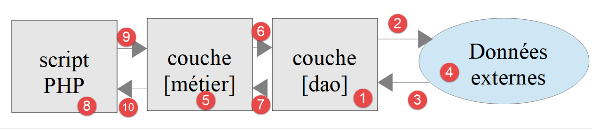
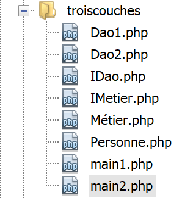

Applications en couches
=======================

Introduction
------------

|image0|

Nous allons découvrir maintenant comment structurer une application PHP
en couches :

|image1|

Dans ce schéma, c’est la **couche de gauche qui prend l’initiative
d’utiliser la couche de droite**. Le rôle des couches est le suivant :

-  **[1]** : la couche appelée **[dao]** (Data Access Objects) s'occupe
   des échanges avec des entrepôts de données externes **[4]**
   (fichiers, bases de données, services web…). Cette couche est parfois
   appelée **[DAL]** (Data Access Layer) un terme qui décrit mieux le
   rôle de la couche. Cette couche peut lire des données **[3]** ou en
   écrire **[2]**. Elle est sollicitée par la couche **[métier]**
   **[6]** et lui rend des résultats **[7]** ;

-  **[5]** :une couche appelée **[métier]** qui rassemble des procédures
   ‘métier’ à qui on fournit toutes les données dont elles ont besoin.
   C’est généralement la couche la plus stable d’un projet car elle ne
   dépend pas de la façon dont les données sont acquises. Celles-ci ont
   deux sources :

   -  **[9]** : les données fournies par le script PHP ;

   -  **[6,7]** : les données demandées à la couche **[dao]**.

-  **[8]** : le script principal est le chef d’orchestre. Dans une
   application console, il va :

   -  créer les couches **[métier]** et **[dao]** ;

   -  dérouler l’algorithme de l’application. Cet algorithme est celui
      d’un chef d’orchestre : on n’y trouve aucun code ‘métier’ ou
      d’accès aux données. Le script principal se contente d’appeler les
      procédures de la couche **[métier]** **[9]**. Il ignore totalement
      la couche **[dao]** et les données externes. Il peut fournir à la
      couche **[métier]** des données **[9]**. Dans une application
      console, celles-ci peuvent provenir de fichiers de configuration
      ou de l’utilisateur du script. Il reçoit des résultats **[10]** de
      la couche **[métier]**. Il peut avoir besoin de stocker certains
      résultats : pour cela il utilise de nouveau les procédures de la
      couche **[métier]** qui elles vont s’adresser à la couche
      **[dao]** qui va faire le travail ;

   -  parmi les résultats, le script principal peut recevoir des
      exceptions. C’est son rôle de gérer les exceptions qui remontent
      de toutes les couches ;

Ce découpage en couches est destiné à faciliter l’évolution de
l’application. Pour cela, chaque couche implémente une interface.
Supposons que :

-  la couche **[dao]** est implémentée par une classe **[Dao]** qui
   implémente une interface **[IDao]** ;

-  la couche **[métier]** est implémentée par une classe **[Métier]**
   qui implémente une interface **[IMétier]** ;

Les procédures de la couche **[métier]** vont alors utiliser l’interface
**[IDao]** plutôt que la classe **[Dao]**. Ceci permet de faire évoluer
la couche **[Dao]** sans toucher à la couche **[Métier]**. Supposons que
dans une version 1, la couche **[Dao1]** utilise des données d’une base
de données. Suite à une évolution, ces données sont maintenant fournies
par un service web dans une version 2, **[Dao2]**. On s’assurera que les
deux classes **[Dao1]** et **[Dao2]** implémentent la même interface
**[IDao]** et qu’elles lancent les mêmes exceptions. Si ceci est
vérifié, la couche **[Métier]** qui travaille avec l’interface
**[IDao]** restera inchangée ;

Le même raisonnement s’applique à la couche **[Métier]**.

Voyons une implémentation avec des classes et interfaces :

|image2|

L’application va implémenter la structure en couches suivante :

|image3|

Objets échangés entre couches
-----------------------------

En temps normal, les couches échangent divers objets. Ici elles
échangeront la classe suivante **[Personne.php]** :

.. code-block:: php 
   :linenos:

   <?php

   // une personne
   class Personne {
     // identifiant
     private $id;

     // constructeur
     public function __construct(int $id) {
       $this->id = $id;
     }

     // toString
     public function __toString(): string {
       return "[Personne($this->id)]";
     }

   }

**Commentaires**

-  ligne 6 : la personne n’a qu’un attribut, son identifiant **[$id]**.
   On va supposer que celui-ci désigne une personne unique dans un
   entrepôt de données ;

-  lignes 9-11 : le constructeur qui permet de construire un type
   **[Personne]** avec son identifiant ;

-  lignes 14-16 : la méthode **[__toString]** qui affiche l’identifiant
   de la personne ;

Couche [dao]
------------

L’interface **[IDao]** implémentée par la couche **[dao, 1]** est la
suivante **[IDao.php]** :

.. code-block:: php 
   :linenos:

   <?php

   // couche [dao] ------------------------
   interface IDao {

     // récupération d'une personne dans un entrepôt externe
     // on passe l'identifiant de la personne
     public function get(int $id): Personne;

     // sauvegarde d'une personne dans un entrepôt externe
     public function save(Personne $p): void;
   }

Cette interface est implémentée par la classe **[Dao1]** suivante
**[Dao1.php]** :

.. code-block:: php 
   :linenos:

   <?php

   class Dao1 implements IDao {

     // sauvegarde d'une personne dans un entrepôt externe
     public function save(Personne $p): void {
       print "[Dao1] : Sauvegarde de la personne $p en base de données [locale]\n";
     }

     // récupération d'une personne dans un entrepôt externe
     public function get(int $id): Personne {
       print "[Dao1] : Récupération de la personne d'identité ($id) en base de données [locale]\n";
       return new Personne($id);
     }

   }

**Commentaires**

-  la classe n’interagit pas avec un entrepôt de données. On se contente
   d’afficher des messages pour suivre le déroulement du code (lignes 7
   et 12) ;

-  ligne 13 : on rend bien une personne ayant l’identifiant passé en
   paramètre à la méthode (ligne 11) ;

Nous implémentons également l’interface **[IDao]** avec la classe
**[Dao2]** suivante **[Dao2.php]** :

.. code-block:: php 
   :linenos:

   <?php

   class Dao2 implements IDao {

     // sauvegarde d'une personne dans un entrepôt externe
     public function save(Personne $p): void {
       print "[Dao2] : Sauvegarde de la personne $p en base de données [distante]\n";
     }

     // récupération d'une personne dans un entrepôt externe
     public function get(int $id): Personne {
       print "[Dao2] : Récupération de la personne d'identité ($id) en base de données [distante]\n";
       return new Personne($id);
     }

   }

La classe **[Dao2]** est similaire à la classe **[Dao1]** si ce n’est
que nous avons modifié les messages affichés.

Couche [métier]
---------------

La couche **[métier, 2]** offre l’interface **[IMétier]** suivante
**[IMetier.php]** :

.. code-block:: php 
   :linenos:

   <?php

   // couche [métier] ------------------------
   interface IMétier extends IDao {

     // on exploite une personne identifiée par son id
     public function doSomething(Personne $p): void;
   }

**Commentaires**

-  l’interface **[IMétier]** étend l’interface **[IDao]**. Ce n’est pas
   du tout obligatoire. On le fait ici parce que l’exemple est simple ;

-  ligne 7 : la méthode **[doSomething]** est propre à la couche
   **[Métier]** ;

L’interface **[IMétier]** sera implémentée par la classe **[Métier]**
suivante **[Métier.php]** :

.. code-block:: php 
   :linenos:

   <?php

   class Métier implements IMétier {
     // couche [dao]
     private $dao;

     // getter / setter
     public function setDao(IDao $dao): void {
       $this->dao = $dao;
     }

     public function getDao(): IDao {
       return $this->dao;
     }

     // on exploite une personne
     public function doSomething(Personne $p): void {
       // traitement
       print "Métier : Traitement métier de la personne $p\n";
     }

     // sauvegarde de la personne
     public function save(Personne $p): void {
       print "[Métier] : Sauvegarde de la personne $p\n";
       // on demande à la couche [dao] de faire la sauvegarde
       $this->dao->save($p);
     }

     public function get(int $id): Personne {
       print "[Métier] : récupération de la personne d'identifiant $id\n";
       // on demande la personne à la couche [dao]
       $personne = $this->dao->get($id);
       return $personne;
     }

   }

**Commentaires**

-  ligne 5 : la couche **[métier]** doit avoir une référence sur la
   couche **[dao]** pour pouvoir utiliser les méthodes de celle-ci ;

-  lignes 8-10 : la méthode **[setDao]** permet de donner à la couche
   **[métier]** la référence de la couche **[dao]**. On notera que le
   type du paramètre est **[IDao]**. Ainsi la couche **[métier]** va
   être capable de travailler avec toute classe implémentant l’interface
   **[IDao]**. Si on passe d’une couche **[Dao1]** à une couche
   **[Dao2]** et que toutes deux implémentent l’interface **[IDao]**, la
   couche **[métier]** n’a pas à être réécrite ;

-  lignes 17-20 : implémentation de **[IMetier::doSomething]** ;

-  lignes 23-27 : implémentation de **[IMetier::save]**. Cette méthode
   doit sauvegarder une personne dans un entrepôt de données. La couche
   **[métier]** ne sait pas faire ça. Elle s’adresse à la couche
   **[dao]** pour faire cette sauvegarde ;

-  lignes 29-34 : implémentation de **[IMetier::get]**. Cette méthode
   doit récupérer dans un entrepôt de données la personne dont
   l’identifiant lui est passé en paramètre. La couche **[métier]** ne
   sait pas faire ça. Elle s’adresse à la couche **[dao]** pour faire le
   travail (ligne 32) ;

**Conclusion**

Dès que la couche **[métier]** a besoin d’accéder aux données stockées
dans l’entrepôt de données, elle doit passer par la couche **[dao]** qui
a été créée pour accéder à ces données.

Script principal
----------------

Nous allons écrire deux scripts, chefs d’orchestre pour cette
application. Le 1\ :sup:`er` **[main1.php]** utilisera la couche
**[Dao1]** alors que le second **[main2.php]** utilisera la couche
**[Dao2]**. Nous voulons montrer que cela n’a aucune incidence sur le
code de la couche **[Métier]**.

Le script **[main1.php]** est le suivant :

.. code-block:: php 
   :linenos:

   <?php

   // respect strict des paramètres des fonctions
   declare (strict_types=1);

   // inclusion classes et interfaces
   require_once __DIR__."/Personne.php";
   require_once __DIR__."/IDao.php";
   require_once __DIR__."/IMetier.php";
   require_once __DIR__."/Dao1.php";
   require_once __DIR__."/Métier.php";

   // test ----------------
   // création des couches
   $dao1 = new Dao1();
   $métier = new Métier();
   $métier->setDao($dao1);
   // utilisation de la couche [métier]
   $personne = $métier->get(4);
   $métier->doSomething($personne);
   $métier->save($personne);

**Commentaires**

-  rappelons quelques points : le script **[main1.php]** est le chef
   d’orchestre de l’application. Il crée la structure en couches de
   l’application (lignes 15-17) puis ensuite commence à dialoguer avec
   la couche **[métier]** (lignes 19-21). La structure en couches est en
   effet la suivante :

|image4|

   Selon ce schéma, le script **[main1.php]** ne doit s’adresser qu’à la
   couche **[métier]**. Elle ne doit pas s’adresser à la couche
   **[dao]** même si c’est théoriquement possible.

Les résultats de l’exécution sont les suivants :

.. code-block:: php 
   :linenos:

   [Métier] : récupération de la personne d'identifiant 4
   [Dao1] : Récupération de la personne d'identité (4) en base de données [locale]
   [Métier] : Traitement métier de la personne [Personne(4)]
   [Métier] : Sauvegarde de la personne [Personne(4)]
   [Dao1] : Sauvegarde de la personne [Personne(4)] en base de données [locale]

**Commentaires**

-  la ligne 10 du code a provoqué l’écriture des lignes 1 et 2 des
   résultats ;

-  la ligne 20 du code a provoqué l’écriture de la ligne 3 des
   résultats ;

-  la ligne 21 du code a provoqué l’écriture des lignes 4 et 5 des
   résultats ;

Le script **[main2.php]** est le suivant :

.. code-block:: php 
   :linenos:

   <?php

   // respect strict des paramètres des fonctions
   declare (strict_types=1);

   // inclusion classes et interfaces
   require_once __DIR__."/Personne.php";
   require_once __DIR__."/IDao.php";
   require_once __DIR__."/IMetier.php";
   require_once __DIR__."/Dao2.php";
   require_once __DIR__."/Métier.php";

   // test ----------------
   // création des couches
   $dao2 = new Dao2();
   $métier = new Métier();
   $métier->setDao($dao2);
   // utilisation de la couche [métier]
   $personne = $métier->get(4);
   $métier->doSomething($personne);
   $métier->save($personne);

**Commentaires**

-  lignes 36-38 : la structure en couches utilise désormais la couche
   **[Dao2]** ;

Les résultats de l’exécution sont les suivants :

.. code-block:: php 
   :linenos:

   [Métier] : récupération de la personne d'identifiant 4
   [Dao2] : Récupération de la personne d'identité (4) en base de données [distante]
   [Métier] : Traitement métier de la personne [Personne(4)]
   [Métier] : Sauvegarde de la personne [Personne(4)]
   [Dao2] : Sauvegarde de la personne [Personne(4)] en base de données [distante]

La couche **[Dao1]** simule un accès à une base de données locale alors
que la couche **[Dao2]** simule un accès à une base de données distante.
Tant que ces deux couches respectent l’interface **[IDao]**, on voit que
le code de la couche **[Métier]** n’a pas eu à être changé.

Nous allons appliquer ce que nous venons d’apprendre à l’exercice du
calcul d’impôts qui nous sert de fil rouge.

.. |image0| image:: ./chap-10/media/image1.png
   :width: 1.40984in
   :height: 1.72441in

.. |image3| image:: ./chap-10/media/image4.png
   :width: 2.5752in
   :height: 0.74016in
.. |image4| image:: ./chap-10/media/image4.png
   :width: 2.5752in
   :height: 0.74016in
