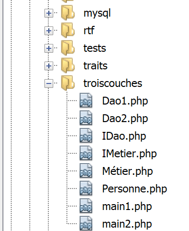

Les Traits
==========

Les **Traits** sont des structures analogues à des classes. Néanmoins on
ne peut les instancier. Elles sont destinées à être incluses dans des
classes. L’inclusion d’un **Trait** dans une classe a le même effet que
si l’on avait copié le code du **Trait** dans la classe. On met dans un
**Trait** du code susceptible d’être réutilisé dans plusieurs classes.

L’arborescence des scripts
--------------------------

|image0|

Inclusion d’un trait dans une classe
------------------------------------

Le script **[traits-01.php]** montre une utilisation basique d’un trait
dans une classe :

.. code-block:: php 
   :linenos:

   <?php

   class Class04 {
     // attribut
     private $name;

     // constructeur
     public function __construct(string $name) {
       $this->name = $name;
     }

     // getters et setters
     public function getName(): string {
       return $this->name;
     }

     public function setName(string $name): void {
       $this->name = $name;
     }

   }

   trait Trait04 {
     // attribut
     private $name;

     // getters et setters
     public function getName(): string {
       return $this->name;
     }

     public function setName(string $name): void {
       $this->name = $name;
     }

   }

   class Class05 {
     // inclusion du Trait
     use Trait04;

     // constructeur
     public function __construct(string $name) {
       $this->name = $name;
     }

   }

   // test --------------
   $class04 = new Class04("Tim");
   $class05 = new Class05("Burton");
   print $class04->getName() . "\n";
   print $class05->getName() . "\n";
   // affichage des deux classes
   print_r($class04);
   print_r($class05);

**Commentaires du code**

-  lignes 3-21 : définition de la classe **[Class04]** avec un attribut,
   ses get / set et un constructeur ;

-  lignes 23-36 : on reprend le code de **[Class04]** sans son
   constructeur et on le transfère dans le trait **[Trait04]** tel quel.
   On ne reprend pas le constructeur puisqu’un Trait n’est pas
   instanciable ;

-  ligne 23 : c’est le mot clé **[trait]** qui fait de **[Trait04]** un
   trait plutôt qu’une classe ;

-  lignes 38-45 : on définit une classe **[Class05]** qui reprend le
   code du trait **[Trait04]** (ligne 40) et lui ajoute un constructeur
   (lignes 43-45), identique à celui de la classe **[Class04]** pour
   rendre la classe instanciable ;

-  ligne 40 : c’est le mot clé **[use]** qui permet l’inclusion d’un
   Trait dans une classe ;

-  lignes 50-56 : des tests montrent que les classes **[Class04]** et
   **[Class05]** fonctionnent de la même façon ;

**Résultats**

.. code-block:: php 
   :linenos:

   Tim
   Burton
   Class04 Object
   (
       [name:Class04:private] => Tim
   )
   Class05 Object
   (
       [name:Class05:private] => Burton
   )

Les résultats des lignes 3-10 montrent que les classes **[Class04]** et
**[Class05]** ont la même contenu ;

**Conclusion**

L’utilisation de l’instruction **[use Trait]** dans une classe est
équivalente à inclure le code de **[Trait]** dans la classe.

Utiliser un même trait dans différentes classes
-----------------------------------------------

Un premier intérêt du **trait** semble être la réutilisation d’un même
code (attributs +méthodes) entre différentes classes. Nous allons voir
cependant qu’on peut arriver au même objectif en utilisant de simples
classes.

Le partage d’un *trait* entre classes est illustré par le script
**[trait-02.php]** suivant :

.. code-block:: php 
   :linenos:

   <?php

   trait Trait01 {
     // attribut
     private $id = 0;

     // méthode
     public function doSomething() {
       print "Trait01::doSomething… ($this->id)\n";
     }

   }

   class Class02 {
     // inclusion Trait01
     use Trait01 {
       // la méthode [Trait01::doSomething] est accessible
       // dans la classe sous le nom [doSomethingInTrait]
       Trait01::doSomething as doSomethingInTrait;
     }

     // méthode propre à la classe
     public function doSomething(): void {
       // attribut id
       $this->id += 10;
       // utilisation méthode de Trait01
       $this->doSomethingInTrait();
       // afichage local
       print "Class02->doSomething\n";
     }

   }

   class Class03 {
     // inclusion Trait01
     use Trait01;

     // méthode locale à la classe
     public function doSomethingElse(): void {
       // attribut id
       $this->id += 10;
       // utilisation méthode de Trait01
       $this->doSomething();
       // affichage local
       print "Class03->doSomethingElse\n";
     }

   }

   // test01 ----------------
   function test01(): void {
     $class02 = new Class02();
     $class03 = new Class03();
     $class02->doSomething();
     $class03->doSomethingElse();
   }

   // test01
   print "test01-----------------\n";
   test01();

**Commentaires**

-  lignes 3-10 : un trait définissant un attibut (ligne 5) et une
   méthode (lignes 8-10).

-  le trait **[Trait01]** est injecté dans deux classes **[Class02]**
   (lignes 14-32) et **[Class03]** (lignes 34-46).

-  lignes 16-20 : injection de **[Trait01]** dans **[Class02]** ;

-  la ligne 19 vise à résoudre un conflit : **[Trait01]** et
   **[Class02]** ont tous les deux une méthode appelée
   **[doSomething]**. Il y a deux cas à prévoir :

   -  la méthode **[Class02::doSomething]** est appelée de l’extérieur
      de la classe. Dans ce cas, la méthode **[Class02::doSomething]**
      est prioritaire sur la méthode **[Trait01::doSomething]** et c’est
      elle qui est appelée ;

   -  la méthode **[Class02::doSomething]** est appelée de l’intérieur
      de la classe. Dans ce cas il y a conflit : l’interpréteur PHP ne
      sait pas quelle méthode appeler ;

..

   La ligne 19 permet de renommer **[doSomethingInTrait]** la méthode
   **[Trait01::doSomething]**. Ainsi, à l’intérieur de **[Class02]** on
   utilisera les notations :

-  **[doSomethingInTrait]** pour appeler la méthode
   **[Trait01::doSomething]** ;

-  **[doSomething]** pour appeler la méthode
   **[Class02::doSomething]** ;

-  lignes 25, 27 : la classe **[Class02]** utilisent l’attribut et la
   méthode de **[Trait01]** comme s’ils lui étaient propres ;

-  lignes 34-48 : la classe **[Class03]** est identique à la classe
   **[Class02]**. L’inclusion de **[Trait01]** est ici plus simple parce
   qu’il n’y pas collision entre les méthodes de **[Trait01]** et
   **[Class03]** ;

**Résultats**

.. code-block:: php 
   :linenos:

   test01-----------------
   Trait01::doSomething… (10)
   Class02->doSomething
   Trait01::doSomething… (10)
   Class03->doSomethingElse

On notera bien qu’il n’y a pas partage du trait **[Trait01]** entre les
classes **[Class02]** et **[Class03]**. Ainsi l’attribut
**[Trait01::i]** devient par inclusion de **[Trait01]** dans les classes
**[Class02]** et **[Class03]** deux attributs différents
**[Class02::i]** et **[Class03::i]**. C’est ce que montrent les lignes 2
et 4 des résultats. Si l’attribut **[Trait01::i]** avait été partagé
entre les classes **[Class02]** et **[Class03]** on aurait eu 20 à la
ligne 4 au lieu de 10.

Le script **[trait-03.php]** montre qu’on peut arriver au même résultat
en utilisant une classe au lieu du trait :

.. code-block:: php 
   :linenos:

   <?php

   // classe qui remplace le trait
   class Class01 {
     // attribut
     private $id = 0;

     // setter
     public function setId(int $id) {
       $this->id = $id;
     }

     // getter
     public function getId(): int {
       return $this->id;
     }

     // méthode
     public function doSomething(): void {
       print "Class01::doSomething… ($this->id)\n";
     }

   }

   class Class02 {
     // inclusion Class01
     private $class01;

     // setter
     public function setClass01(Class01 $class01) {
       $this->class01 = $class01;
     }

     // méthode propre à la classe
     public function doSomething(): void {
       // chgt attribut de Class01
       $id = $this->class01->getId();
       $id += 10;
       $this->class01->setId($id);
       // utilisation méthode de Class01
       $this->class01->doSomething();
       // afichage local
       print "Class02->doSomething\n";
     }

   }

   class Class03 {
     // inclusion Class01
     private $class01;

     // setter
     public function setClass01(Class01 $class01) {
       $this->class01 = $class01;
     }

     // méthode locale à la classe
     public function doSomethingElse(): void {
       // chgt attribut de Class01
       $id = $this->class01->getId();
       $id += 10;
       $this->class01->setId($id);
       // utilisation méthode de Class01
       $this->class01->doSomething();
       // affichage local
       print "Class03->doSomethingElse\n";
     }

   }

   // test01 ----------------
   function test01(): void {
     // deux objets
     $class02 = new Class02();
     $class03 = new Class03();
     // vont accéder à deux instances différentes de [Class01]
     $class02->setClass01(new Class01());
     $class03->setClass01(new Class01());
     // vérification
     $class02->doSomething();
     $class03->doSomethingElse();
   }

   // test02 ----------------
   function test02(): void {
     // instance partagée de [Class01]
     $class01 = new Class01();
     // deux objets
     $class02 = new Class02();
     $class03 = new Class03();
     // vont accéder à la même instance de [Class01]
     $class02->setClass01($class01);
     $class03->setClass01($class01);
     // vérification
     $class02->doSomething();
     $class03->doSomethingElse();
   }

   // test01
   print "test01-----------------\n";
   test01();
   // test02
   print "test02-----------------\n";
   test02();

**Commentaires**

-  lignes 4-23 : la classe **[Class01]** remplace le trait
   **[Trait01]**. Le code de **[Trait01]** était incorporé au code des
   classes **[Class02]** et **[Class03]**. Ici, ce ne sera pas le cas.
   Ce sera une référence au code de la classe **[Class01]** qui sera
   injectée dans les classes **[Class02]** et **[Class03]**. Ce qui fait
   que les attributs de la classe **[Class01]** seront extérieurs au
   code des **[Class02]** et **[Class03]**. Comme ici, l’attribut
   **[id]** est privé (ligne 6), il faut prévoir un getter (lignes
   14-16) et un setter (lignes 9-11). C’est la 1\ :sup:`re` différence
   avec le trait : il faut créer le code d’accès aux attributs privés de
   la classe. On aurait pu passer la visibilité de l’attribut **[id]** à
   **[public]** mais il n’est jamais conseillé de faire cela. Passer par
   un setter pour fixer la valeur d’un attribut permet d’en vérifier la
   validité ;

-  ligne 27 : inclusion dans le code de **[Class02]** d’une référence à
   la classe **[Class01]**. Parce que cet attribut est privé, il nous
   faut créer un setter (lignes 30-32) pour l’initialiser ;

-  lignes 37-41 : pour tout usage du code de **[Class01]**, il nous faut
   passer par l’attribut **[$this→class01]** ;

-  lignes 48-69 : la classe **[Class03]** est un clône de la classe
   **[Classe02]** si ce n’est que sa méthode a un nom différent ;

-  lignes 72-82 : le 1\ :sup:`er` test. Celui-ci consiste à injecter
   dans les classes **[Class02]** et **[Class03]** **deux instances
   différentes** de la classe **[Class01]** (lignes 77 et 78) ;

-  lignes 85-97 : le 2\ :sup:`e` test injecte dans les classes
   **[Class02]** et **[Class03]** **la même instance** de la classe
   **[Class01]** (lignes 97, 92, 93) ;

-  lignes 100-101 : exécution du test **[test01]** ;

-  lignes 103-104 : exécution du test **[test02]** ;

**Résultats**

.. code-block:: php 
   :linenos:

   test01-----------------
   Class01::doSomething… (10)
   Class02->doSomething
   Class01::doSomething… (10)
   Class03->doSomethingElse
   test02-----------------
   Class01::doSomething… (10)
   Class02->doSomething
   Class01::doSomething… (20)
   Class03->doSomethingElse

**Commentaires des résultats**

-  lignes 2-5 : on obtient les mêmes résultats qu’avec le trait
   **[Trait01]**. On en conclura que l’usage du trait n’est ici pas
   indispensable mais qu’il amène une réduction du code dû au fait qu’il
   n’y a pas besoin de méthodes pour accéder aux attributs du trait :
   ceux-ci font partie intégrante du code dans lequel le trait a été
   incorporé ;

-  lignes 7-10 : du fait qu’on a injecté la même référence de
   **[Class01]** dans les classes **[Class02]** et **[Class03]**,
   l’attribut **[Class01::id]** a été partagé entre les deux classes.
   C’est pour cela que la ligne 9 des résultats affiche 20 al lieu de 10
   avec le trait. On en conclura que si des attributs du trait doivent
   être **partagés** entre des classes, alors le trait n’est pas
   utilisable et il faut alors utiliser une classe ;

Regrouper des méthodes dans un trait
------------------------------------

Dans l’exemple précédent, le **trait** comportait attributs et méthodes.
Nous considérons ici le cas où il ne contient que des méthodes. Dans ce
cas, le **trait** ressemble à une factorisation de méthodes qu’on peut
alors utiliser dans différentes classes. Comme le **trait** n’a ici pas
d’attribut, on va considérer le cas où les méthodes qu’ils rassemblent
travaillent uniquement sur des paramètres qu’on leur passe. En fait, ce
n’est pas obligatoire : un trait peut travailler sur un attribut
**[$this→attribut1]** sans avoir cet attribut. C’est alors aux classes
qui utilisent ce trait de fournir l’attribut **[$this→attribut1]**.

Dans le cas où le **trait** n’a que des méthodes qui travaillent
uniquement sur des paramètres qu’on leur passe, nous montrerons que le
**trait** peut alors être remplacé par une **classe** ayant les mêmes
méthodes que le **trait** et déclarées statiques.

L’utilisation du trait est illustré par le script **[trait-04.php]** qui
reprend le **trait** de l’exemple précédent en lui enlevant tout
attribut :

.. code-block:: php 
   :linenos:

   <?php

   trait Trait01 {

     // méthode à partager
     public function doSomething() {
       print "Trait01::doSomething ….\n";
     }

   }

   class Class02 {
     // inclusion Trait01
     use Trait01 {
       // la méthode [Trait01::doSomething] est accessible
       // dans la classe sous le nom [doSomethingInTrait]
       Trait01::doSomething as doSomethingInTrait;
     }

     public function doSomething(): void {
       // appel méthode de Trait01
       $this->doSomethingInTrait();
       // affichage local
       print "Class02->doSomething\n";
     }

   }

   class Class03 {
     // inclusion Trait01
     use Trait01;

     // méthode locale à la classe
     public function doSomethingElse(): void {
       // appel méthode de Trait01
       $this->doSomething();
       // affichage local
       print "Class03->doSomethingElse\n";
     }

   }

   // test ----------------
   (new Class02())->doSomething();
   (new Class03())->doSomethingElse();

**Commentaires**

-  lignes 3-10 : le trait **[Trait01]** n’a plus d’attributs ;

-  lignes 14-18 : inclusion de **[Trait01]** dans **[Class02]**. La
   méthode de **[Trait01]** est utilisée ligne 22 ;

-  ligne 31 : inclusion de **[Trait01]** dans **[Class03]**. La méthode
   de **[Trait01]** est utilisée ligne 36 ;

**Résultats**

.. code-block:: php 
   :linenos:

   Trait01::doSomething ….
   Class02->doSomething
   Trait01::doSomething ….
   Class03->doSomethingElse

Dans ce cas d’usage, le trait **[Trait01]** peut aisément être remplacé
par une classe. Ceci est montré par le script **[trait-05.php]**
suivant :

.. code-block:: php 
   :linenos:

   <?php

   abstract class Class01 {

     // méthode statique à partager
     public static function doSomething() {
       print "Class01::doSomething ….\n";
     }

   }

   class Class02 {

     public function doSomething(): void {
       // appel méthode de Class01
       Class01::doSomething();
       // affichage local
       print "Class02->doSomething\n";
     }

   }

   class Class03 {

     // méthode locale à la classe
     public function doSomethingElse(): void {
       // appel méthode de Class01
       Class01::doSomething();
       // affichage local
       print "Class03->doSomethingElse\n";
     }

   }

   // test ----------------
   (new Class02())->doSomething();
   (new Class03())->doSomethingElse();

**Commentaires**

-  lignes 3-10 : le trait **[Trait01]** est remplacé par une classe
   abstraite **[Class01]** dont toutes les méthodes sont déclarées
   statiques. La classe est déclarée abstraite uniquement pour empêcher
   son **instanciation**. On aurait voulu écrire également **[final]**
   pour empêcher sa **dérivation** mais PHP 7 n’accepte pas le préfixe
   **[final abstract]** pour une classe. C’est l’un ou l’autre mais pas
   les deux ;

-  ligne 16 : au lieu d’écrire **[$this→doSomethingInTrait]** on écrit
   maintenant **[Class01::doSomething]**, ç-à-d qu’on appelle la méthode
   statique **[doSomething]** de la classe **[Class01]** ;

-  ligne 28 : on répète la même démarche dans **[Class03]** ;

**Résultats**

.. code-block:: php 
   :linenos:

   Class01::doSomething ….
   Class02->doSomething
   Class01::doSomething ….
   Class03->doSomethingElse

On a bien le même résultat qu’avec le trait **[Trait01]** ce qui montre
que l’usage de celui-ci peut être évité. On a écrit que les méthodes
d’un trait peuvent travailler sur un attribut **[$this→attribut1]** sans
que le trait ait cet attribut. C’est alors aux classes qui utilisent ce
trait de fournir l’attribut **[$this→attribut1]**. C’est un cas
exotique : autant ‘remonter’ l’attribut **[$this→attribut1]** que les
classes utilisant le trait doivent avoir, dans le trait lui-même. Ainsi
il fera forcément partie des attributs de la classe utilisant le trait.

Héritage multiple avec un trait
-------------------------------

Il est fréquent de lire dans la littérature PHP que le trait permettrait
l’héritage multiple : la possibilité pour une classe d’hériter de
plusieurs classes. Le langage C++ possède cette possibilité mais pas les
langages Java ou C# qui ne connaissent que l’héritage simple. Nous
allons montrer que si effectivement l’usage d’un trait dans une classe
dérivée permet d’implémenter quelque chose qui ressemble à l’héritage
multiple, ce cas d’usage peut là encore s’implémenter avec de simples
classes.

Le script **[trait-06.php]** met en œuvre une classe dérivée et un
trait :

.. code-block:: php 
   :linenos:

   <?php

   trait Trait01 {
     // attribut
     private $i;

     // méthode à partager
     public function doSomethingInTrait01() {
       // modification Trait01::$i
       $this->i++;
       // affichage
       print "Trait01::doSomethingInTrait01… i=$this->i\n";
     }

   }

   class Class02 {
     // attribut
     protected $j = 0;

     // méthode
     public function doSomethingInClass02(): void {
       // modification Class02::j
       $this->j += 10;
       // affichage
       print "Class02->doSomethingInClass02… j=$this->j\n";
     }

   }

   // classe dérivée
   class Class03 extends Class02 {
     // hérite de Class02:j et Trait01::i
     // inclusion Trait01
     use Trait01;

     // méthode
     public function doSomethingInClass03(): void {
       // utilisation méthode de Trait01
       $this->doSomethingInTrait01();
       // modification Trait01::i
       $this->i += 100;
       // modification Class03::j (==Class02::j)
       $this->j += 1000;
       // affichage
       print "Class03->doSomethingInClass03… i=$this->i, j=$this->j\n";
     }

   }

   // test ----------------
   (new Class02())->doSomethingInClass02();
   (new Class03())->doSomethingInClass03();

**Commentaires**

-  lignes 3-15 : on revient à un trait **[Trait01]** avec un attribut et
   une méthode manipulant celui-ci ;

-  lignes 17-29 : une classe **[Class02]** qui n’a rien à voir avec le
   trait **[Trait01]**. Elle ne l’utilise pas ;

-  ligne 19 : on a déclaré l’unique attribut de **[Class02]** avec une
   visibilité **[protected]** pour que celui-ci soit accessible dans les
   classes dérivées ;

-  ligne 32 : la classe **[Class03]** étend la classe **[Class02]**. De
   plus elle incorpore le trait **[Trait01]** (ligne 35). Finalement,
   elle hérite des attributs et méthodes de **[Class02]** et incorpore
   les attributs et méthodes de **[Trait01]**. On a donc bien quelque
   chose d’analogue à l’héritage multiple ;

**Résultats**

.. code-block:: php 
   :linenos:

   Class02->doSomethingInClass02… j=10
   Trait01::doSomethingInTrait01… i=1
   Class03->doSomethingInClass03… i=101, j=1000

De la même façon qu’il a été fait dans un exemple précédent, nous allons
montrer que :

-  le trait peut être remplacé par une classe ;

-  au lieu d’incorporer le trait dans la classe dérivée, on incorpore la
   référence d’une instance de la classe ;

Le script **[trait-07.php]** est le suivant :

.. code-block:: php 
   :linenos:

   <?php

   class Class01 {
     // attribut
     protected $i;

     // getter et setter
     public function getI(): int {
       return $this->i;
     }

     public function setI(int $i): void {
       $this->i = $i;
     }

     // méthode
     public function doSomethingInClass01(): void {
       // modification Class01::$i
       $this->i++;
       // affichage
       print "Class01::doSomething in Class01… i=$this->i\n";
     }

   }

   class Class02 {
     // attribut
     protected $j = 0;

     // méthode propre à la classe
     public function doSomethingInClass02(): void {
       // modification Class02::j
       $this->j += 10;
       // affichage
       print "Class02->doSomethingInClass02… j=$this->j\n";
     }

   }

   class Class03 extends Class02 {
     // inclusion Class01
     private $class01;

     // setter
     public function setClass01(Class01 $class01) {
       $this->class01 = $class01;
     }

     // méthode locale à la classe
     public function doSomethingInClass03(): void {
       // utilisation méthode de Class01
       $this->class01->doSomethingInClass01();
       // modification Class01::i
       $i = $this->class01->getI();
       $i += 100;
       $this->class01->setI($i);
       // modification Class03::j
       $this->j += 1000;
       // affichage
       print "Class03->doSomethingInClass03… i=$i, j=$this->j\n";
     }

   }

   // test ----------------
   $class01 = new Class01();
   $class02 = new Class02();
   $class03 = new Class03();
   $class03->setClass01($class01);
   $class02->doSomethingInClass02();
   $class03->doSomethingInClass03();

**Commentaires**

-  lignes 3-24 : la classe **[Class01]** remplace le trait
   **[Trait01]**. Comme la classe **[Class01]** va être incorporée dans
   les classes via une référence, on a prévu des get / set pour
   l’attribut **[$i]** ;

-  lignes 26-38 : la classe **[Classe02]** ne change pas ;

-  ligne 40 : la classe **[Class03]** étend la classe **[Classe02]** ;

-  ligne 42 : la classe **[Classe01]** est incorporée à **[Classe03]**
   via une référence ;

-  lignes 45-47 : on prévoit un *setter* pour initialiser la référence à
   la classe **[Classe01]** ;

-  lignes 50-61 : la méthode **[doSomethingInClass03]** fait la même
   chose que précédemment avec cependant un code plus complexe ;

**Résultats**

.. code-block:: php 
   :linenos:

   Class02->doSomethingInClass02… j=10
   Class01::doSomething in Class01… i=1
   Class03->doSomethingInClass03… i=101, j=1000

De cet exemple, on peut conclure que là encore le trait n’est pas
indispensable mais il faut reconnaître qu’il permet l’écriture d’un code
plus court dans la classe dérivée.

Utiliser un trait à la place d’une classe abstraite
---------------------------------------------------

On rencontre souvent le cas d’utilisation suivant : on crée une
interface **I** assez générale qui peut donner naissance à plusieurs
implémentations. Celles-ci partagent un code commun mais diffèrent par
d’autres méthodes. On peut implémenter ce cas d’utilisation de deux
façons :

1. on crée une classe **abstraite** **C** qui regroupe le code commun
   aux classes dérivées. La classe C implémente l’interface I mais
   certaines méthodes qui doivent être déclarées dans les classes
   dérivées sont dans la classe C déclarées abstraites et donc la classe
   C est elle-même abstraite. On crée ensuite des classes C1 et C2
   dérivées de C qui implémentent chacune à leur manière les méthodes
   non définies (abstraites) de leur classe parent C ;

2. on crée un **trait** **T** quasi identique à la classe abstraite C de
   la solution précédente. Ce trait n’implémente pas l’interface I car
   syntaxiquement elle ne le peut pas. On crée ensuite des classes C1 et
   C2 implémentant l’interface I et utilisant le trait T. Il ne reste
   plus à ces classes qu’à implémenter les méthodes de l’interface I non
   implémentées par le trait T qu’elles importent ;

Voici un exemple qui montre la grande proximité de ces deux solutions.

L’application 1 implémente la solution 1 décrite précédemment
**[trait-08.php]** :

.. code-block:: php 
   :linenos:

   <?php

   interface Interface1 {

     public function doSomething(): void;

     public function doSomethingElse(): void;
   }

   abstract class AbstractClass implements Interface1 {
     // attributs
     protected $attr1 = 11;
     protected $attr2 = 12;

     // getters et setters
     public function getAttr1() {
       return $this->attr1;
     }

     public function getAttr2() {
       return $this->attr2;
     }

     public function setAttr1($attr1) {
       $this->attr1 = $attr1;
       return $this;
     }

     public function setAttr2($attr2) {
       $this->attr2 = $attr2;
       return $this;
     }

     // méthode implémentée
     public function doSomething(): void {
       print "AbstractClass::doSomething [$this->attr1,$this->attr2]\n";
     }

     // méthode non implémentée
     abstract public function doSomethingElse(): void;
   }

   // classe dérivée 1
   class Class1 extends AbstractClass {
     // attribut
     private $attr3 = 13;

     // getter et setter
     public function getAttr3() {
       return $this->attr3;
     }

     public function setAttr3($attr3) {
       $this->attr3 = $attr3;
       return $this;
     }

     // implémentation doSomethingElse
     public function doSomethingElse(): void {
       print "Class1::doSomethingElse [$this->attr1,$this->attr2,$this->attr3]\n";
     }

   }

   // classe dérivée 2
   class Class2 extends AbstractClass {
     // attribut
     private $attr4 = 14;

     public function getAttr4() {
       return $this->attr4;
     }

     public function setAttr4($attr4) {
       $this->attr4 = $attr4;
       return $this;
     }

     // implémentation doSomethingElse
     public function doSomethingElse(): void {
       print "Class2::doSomethingElse [$this->attr1,$this->attr2,$this->attr4]\n";
     }

   }

   // fonction externe
   function useInterfaceWith(Interface1 $interface):void{
     $interface->doSomething();
     $interface->doSomethingElse();
   }

   // tests
   useInterfaceWith(new Class1());
   useInterfaceWith(new Class2());

**Commentaires**

-  lignes 3-8 : **l’interface** **[Interface1]** a deux méthodes ;

-  lignes 10-41 : la **classe abstraite** **[AbstractClass]** implémente
   l’interface **[Interface1]** (ligne 10). Elle a deux attributs avec
   leurs getters et setters (lignes 12-32), implémente la méthode
   **[doSomething]** de l’interface **[Interface1]** (lignes 35-37) mais
   ne sait pas implémenter la méthode **[doSomethingElse]**. Celle-ci
   est donc déclarée abstraite (ligne 40). La classe abstraite
   **[AbstractClass]** ne peut être instanciée et pour servir à quelque
   chose elle doit obligatoirement être dérivée ;

-  lignes 44-63 : la classe **Class1** étend la classe abstraite
   **[AbstractClass]** et donc implémente l’interface **[Interface1]**
   (ligne 14). Elle donne un corps à la méthode **[doSomethingElse]**
   que sa classe parent n’avait pas définie (lignes 59-61). Elle ajoute
   également un attribut à ceux de sa classe parent (lignes 46-56) ;

-  lignes 66-82 : la classe **Class2** étend la classe abstraite
   **[AbstractClass]** et donc implémente l’interface **[Interface1]**
   (ligne 66). Elle donne un corps à la méthode **[doSomethingElse]**
   que sa classe parent n’avait pas définie (lignes 80-82). Elle ajoute
   également un attribut à ceux de sa classe parent (lignes 68-77) ;

-  lignes 87-90 : la fonction **[useInterfaceWith]** reçoit en paramètre
   un type **[Interface1]** et appelle les deux méthodes de cette
   interface ;

-  lignes 93-94 : on appelle la fonction **[useInterfaceWith]** la
   1\ :sup:`re` fois avec un type **[Class1]** et la seconde fois avec
   un type **[Class2]**. C’est correct puisque ces deux types
   implémentent l’interface **[Interface1]** ;

**Résultats**

.. code-block:: php 
   :linenos:

   AbstractClass::doSomething [11,12]
   Class1::doSomethingElse [11,12,13]
   AbstractClass::doSomething [11,12]
   Class2::doSomethingElse [11,12,14]

Maintenant nous implémentons la solution 2 avec le script
**[trait-09.php]**. Cela consiste à remplacer la classe abstraite par un
trait :

.. code-block:: php 
   :linenos:

   <?php

   interface Interface1 {

     public function doSomething(): void;

     public function doSomethingElse(): void;
   }

   trait Trait1 {
     // attributs
     private $attr1 = 11;
     private $attr2 = 12;

     // getters et setters
     public function getAttr1() {
       return $this->attr1;
     }

     public function getAttr2() {
       return $this->attr2;
     }

     public function setAttr1($attr1) {
       $this->attr1 = $attr1;
       return $this;
     }

     public function setAttr2($attr2) {
       $this->attr2 = $attr2;
       return $this;
     }

     // méthode implémentée
     public function doSomething(): void {
       print "Trait::doSomething [$this->attr1,$this->attr2]\n";
     }
   }

   // classe dérivée 1
   class Class1 implements Interface1 {
     // utilisation du trait
     use Trait1;
     // attribut
     private $attr3 = 13;

     // getter et setter
     public function getAttr3() {
       return $this->attr3;
     }

     public function setAttr3($attr3) {
       $this->attr3 = $attr3;
       return $this;
     }

     // implémentation doSomethingElse
     public function doSomethingElse(): void {
       print "Class1::doSomethingElse [$this->attr1,$this->attr2,$this->attr3]\n";
     }

   }

   // classe dérivée 2
   class Class2 implements Interface1 {
     // utilisation du trait
     use Trait1;
     // attribut
     private $attr4 = 14;

     public function getAttr4() {
       return $this->attr4;
     }

     public function setAttr4($attr4) {
       $this->attr4 = $attr4;
       return $this;
     }

     // implémentation doSomethingElse
     public function doSomethingElse(): void {
       print "Class2::doSomethingElse [$this->attr1,$this->attr2,$this->attr4]\n";
     }

   }

   // fonction externe utilisant l'interface
   function useInterfaceWith(Interface1 $interface): void {
     $interface->doSomething();
     $interface->doSomethingElse();
   }

   // tests
   useInterfaceWith(new Class1());
   useInterfaceWith(new Class2());

**Commentaires**

-  lignes 3-8 : l’interface **[Interface1]** n’a pas changé ;

-  lignes 10-41 : le trait **[Trait1]** remplace la classe abstraite
   **[AbstractClass]** de la solution 1. Le code est le même aux détails
   près suivants :

   -  ligne 10 : le trait **[Trait1]** n’implémente pas l’interface
      **[Interface1]**. C’est syntaxiquement impossible ;

   -  lignes 12-13 : l’attribut de visibilité **[protected]** des
      attributs de la classe abstraite **[AbstractClass]** devient ici
      **[private]**. Ces deux attributs visent à donner aux classes
      dérivées un accès direct aux attributs de la classe parent
      (protected) ou du trait (private) sans avoir à passer par les
      getters et setters ;

   -  le trait **[Trait1]** ne déclare pas la méthode abstraite
      **[doSomethingElse]** ;

-  lignes 41-62 : la classe **[Class1]** de la solution 2 est identique
   à la classe **[Class1]** de la solution 1 aux détails près suivants :

   -  ligne 41 : la classe **[Class1]** implémente l’interface
      **[Interface1]** alors que dans la solution 1, elle étendait la
      classe abstraite **[AbstractClass]** ;

   -  ligne 43 : elle utilise le trait **[Trait1]** pour implémenter une
      partie de l’interface ;

-  lignes 65-85 : on peut faire les mêmes commentaires que pour
   **[Class1]** ;

-  lignes 87-95 : le reste du code ne change pas ;

**Résultats**

.. code-block:: php 
   :linenos:

   Trait::doSomething [11,12]
   Class1::doSomethingElse [11,12,13]
   Trait::doSomething [11,12]
   Class2::doSomethingElse [11,12,14]

On obtient bien les mêmes résultats.

Conclusion
----------

Des exemples précédents, il ressort que les cas d’utilisation où l’usage
du trait amènerait un avantage net ne sont pas clairs. Sur nos exemples
on peut toujours s’en passer en le remplaçant par une classe. Il semble
cependant que son utilisation soit pratique pour factoriser du code
entre différentes classes dérivées, comme si ce code appartenait à une
classe parent. C’est ce que nous ferons dans un exemple à suivre.

