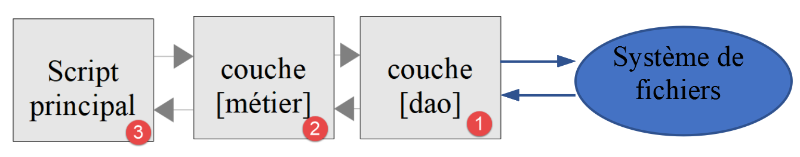

Exercice d’application – version 4
==================================

L’application de calcul d’impôts va implémenter la structure en couches
suivante :

|image0|

Nous allons reprendre les éléments de la version 3 du paragraphe
`lien <chap-08.html#version_3>`__ en les modifiant pour les adapter à la
nouvelle architecture de l’application. On appelle parfois cela du
‘refactoring’. Nous supposons ici que les données nécessaires à
l’application sont dans des fichiers texte. C’est la couche **[Dao]**
qui va s’occuper des échanges avec ces fichiers.

Arborescence des scripts
------------------------

|image1|

Objets échangés entre couches
-----------------------------

Nous allons garder certains objets de la version 3. Nous les redonnons
ici pour rappel.

L’exception **[ExceptionImpots]** est l’exception que lancera la couche
**[Dao]** lorsqu’elle rencontrera un problème soit avec l’accès aux
données soit avec la nature des données (données incorrectes).

.. code-block:: php 
   :linenos:

   <?php

   // espace de noms
   namespace Application;

   class ExceptionImpots extends \RuntimeException {

     public function __construct(string $message, int $code=0) {
       parent::__construct($message, $code);
     }
   }

La classe **[Utilitaires]** rassemble des méthodes utiles à la gestion
des fichiers texte (ici une seule méthode) :

.. code-block:: php 
   :linenos:

   <?php

   // espace de noms
   namespace Application;

   // une classe de fonctions utilitaires
   abstract class Utilitaires {

     public static function cutNewLinechar(string $ligne): string {
       // on supprime la marque de fin de ligne de $ligne si elle existe
       $longueur = strlen($ligne);  // longueur ligne
       while (substr($ligne, $longueur - 1, 1) == "\n" or substr($ligne, $longueur - 1, 1) == "\r") {
         $ligne = substr($ligne, 0, $longueur - 1);
         $longueur--;
       }
       // fin - on rend la ligne
       return($ligne);
     }
   }

La classe **[TaxAdminData]** est la classe qui encapsule les données de
l’administration fiscale :

.. code-block:: php 
   :linenos:

   <?php

   namespace Application;

   class TaxAdminData {
     // tranches d'impôt
     private $limites;
     private $coeffR;
     private $coeffN;
     // constantes de calcul de l'impôt
     private $plafondQfDemiPart;
     private $plafondRevenusCelibatairePourReduction;
     private $plafondRevenusCouplePourReduction;
     private $valeurReducDemiPart;
     private $plafondDecoteCelibataire;
     private $plafondDecoteCouple;
     private $plafondImpotCouplePourDecote;
     private $plafondImpotCelibatairePourDecote;
     private $abattementDixPourcentMax;
     private $abattementDixPourcentMin;

     // initialisation
     public function setFromJsonFile(string $taxAdminDataFilename): TaxAdminData {
       // on récupère le contenu du fichier des données fiscales
       $fileContents = \file_get_contents($taxAdminDataFilename);
       …
       // on rend l'objet
       return $this;
     }

     private function check($value): \stdClass {
       …
       return $result;
     }

       // toString
     public function __toString() {
       // chaîne Json de l'objet
       return \json_encode(\get_object_vars($this), JSON_UNESCAPED_UNICODE);
     }

     // getters et setters
     public function getLimites() {
       return $this->limites;
     }

     …

     public function setLimites($limites) {
       $this->limites = $limites;
       return $this;
     }

     …
   }

Nous ajoutons une nouvelle classe **[TaxPayerData]** qui encapsule les
données écrites dans le fichier des résultats :

.. code-block:: php 
   :linenos:

   <?php

   // espace de noms
   namespace Application;

   // la classe des données
   class TaxPayerData {
     // données nécessaires au calcul de l'impôt du contribuable
     private $marié;
     private $enfants;
     private $salaire;
     // résultats du calcul de l'impôt
     private $montant;
     private $surcôte;
     private $décôte;
     private $réduction;
     private $taux;

     // setter
     public function setFromParameters(string $marié, int $nbEnfants, int $salaireAnnuel) : TaxPayerData{
       // données du contribuable nécessaires au calcul de l'impôt
       $this->marié = $marié;
       $this->enfants = $nbEnfants;
       $this->salaire = $salaireAnnuel;
       // on rend l'objet initialisé
       return $this;
     }

     // getters et setters
     public function getMarié() {
       return $this->marié;
     }

     …

     public function setMarié($marié) {
       $this->marié = $marié;
       return $this;
     }

     …

       // toString
     public function __toString() {
       // chaîne Json de l'objet
       return \json_encode(\get_object_vars($this), JSON_UNESCAPED_UNICODE);
     }

   }

**Note** : utilisez la génération automatique de code pour générer le
constructeur, les getters et setters (cf paragraphe
`lien <chap-08.html#taxadmindata>`__). Remarquez que les setters sont
‘fluents’.

La couche [dao]
---------------

Nous nous intéressons ici à la couche **[1]** de notre application :

|image2|

L’interface [InterfaceDao]
~~~~~~~~~~~~~~~~~~~~~~~~~~

L’interface de la couche **[dao]** sera la suivante
**[InterfaceDao.php]** :

.. code-block:: php 
   :linenos:

   <?php

   // espace de noms
   namespace Application;

   interface InterfaceDao {

     // lecture des données contribuables
     public function getTaxPayersData(string $taxPayersFilename, string $errorsFilename): array;

     // lecture des données de l'administration fiscale (tranches d'impôts)
     public function getTaxAdminData(): TaxAdminData;

     // enregistrement des résultats
     public function saveResults(string $resultsFilename, array $taxPayersData): void;
   }

**Commentaires**

-  le cahier des charges est ici le suivant :

   -  les données des contribuables sont dans un fichier texte ;

   -  on enregistre les résultats du calcul d’impôts dans un fichier
      texte ;

   -  on enregistre les éventuelles erreurs dans un fichier texte ;

   -  on ne sait pas sous quelle forme sont disponibles les données de
      l’administration fiscale. Pour chaque nouvelle forme, l’interface
      **[InterfaceDao]** devra être implémentée par une nouvelle
      classe ;

   -  les méthodes de l’interface qui rencontrent une erreur
      irrécupérable lors de l’accès aux données doivent lancer une
      exception de type **[ExceptionImpots]** ;

-  ligne 9 : la méthode qui permet d’obtenir les données du contribuable
   **[statut marital, nombre d’enfants, salaire annuel]** ;

   -  le 1er paramètre est le nom du fichier texte dans lequel se
      trouvent ces données ;

   -  le second paramètre est le nom du fichier texte dans lequel
      enregistrer les éventuelles erreurs rencontrées ;

-  ligne 12 : la méthode qui permet d’obtenir les données de
   l’administration fiscale. On ne lui passe ici aucun paramètre car on
   ne sait pas comment elles sont stockées ;

-  ligne 15 : la méthode qui permet d’enregistrer les résultats du
   calcul de l’impôt dans un fichier texte dont on passe le nom en
   paramètre ;

Lorsqu’on écrit l’interface **[InterfaceDao]**, on sait qu’il y aura
différentes façons d’écrire la méthode **[getTaxAdminData]** selon la
façon dont seront stockées les données de l’administration fiscale.
L’interface **[InterfaceDao]** sera donc implémentée par différentes
classes, chacune s’occupant d’un stockage particulier de ces données
(tableaux, fichiers texte, base de données, service web). Ces classes
dérivées auront néanmoins un code commun, celui de l’implémentation des
méthodes **[getTaxPayersData, saveResults]**. On sait que ce cas
d’utilisation peut être implémenté de deux façons (cf paragraphe
`lien <chap-09.html#trait_classe_abstraite>`__):

1. on crée une classe **abstraite** **C** qui regroupe le code commun
   aux classes dérivées. La classe C implémente l’interface I mais
   certaines méthodes qui doivent être déclarées dans les classes
   dérivées sont dans la classe C déclarées abstraites et donc la classe
   C est elle-même abstraite. On crée ensuite des classes C1 et C2
   dérivées de C qui implémentent chacune à leur manière les méthodes
   non définies (abstraites) de leur classe parent C ;

2. on crée un **trait** **T** quasi identique à la classe abstraite C de
   la solution précédente. Ce trait n’implémente pas l’interface I car
   syntaxiquement elle ne le peut pas. On crée ensuite des classes C1 et
   C2 implémentant l’interface I et utilisant le trait T. Il ne reste à
   ces classes qu’à implémenter les méthodes de l’interface I non
   implémentées par le trait T qu’elles importent ;

Pour l’exemple, nous allons utiliser ici un trait **[TraitDao]**.

Le trait [TraitDao]
~~~~~~~~~~~~~~~~~~~

Le code du trait **[TraitDao]** est le suivant **[TraitDao.php]** :

.. code-block:: php 
   :linenos:

   <?php

   // espace de noms
   namespace Application;

   trait TraitDao {

     // lecture des données contribuables
     public function getTaxPayersData(string $taxPayersFilename, string $errorsFilename): array {
       // tableau des données contribuables
       $taxPayersData = [];
       // tableau des erreurs
       $errors = [];
       // pas mal d'erreurs peuvent se produire dès qu'on gère des fichiers
       try {
         // lecture des données utilisateur
         // chaque ligne a la forme statut marital, nombre d'enfants, salaire annuel
         $taxPayersFile = fopen($taxPayersFilename, "r");
         if (!$taxPayersFile) {
           throw new ExceptionImpots("Impossible d'ouvrir en lecture les déclarations des contribuables [$taxPayersFilename]", 12);
         }
         // on exploite la ligne courante du fichier des données utilisateur
         // qui a la forme statut marital, nombre d'enfants, salaire annuel
         $num = 1;         // n° ligne courante
         $nbErreurs = 0;   // nbre d'erreurs rencontrées
         while ($ligne = fgets($taxPayersFile, 100)) {
           // on néglige les lignes vides
           $ligne = trim($ligne);
           if (strlen($ligne) == 0) {
             // ligne suivante
             $num++;
             // on reboucle
             continue;
           }
           // on enlève l'éventuelle marque de fin de ligne
           $ligne = Utilitaires::cutNewLineChar($ligne);
           // on récupère les 3 champs marié:enfants:salaire qui forment $ligne
           list($marié, $enfants, $salaire) = explode(",", $ligne);
           // on les vérifie
           // le statut marital doit être oui ou non
           $marié = trim(strtolower($marié));
           $erreur = ($marié !== "oui" and $marié !== "non");
           if (!$erreur) {
             // le nombre d'enfants doit être un entier
             $enfants = trim($enfants);
             if (!preg_match("/^\d+$/", $enfants)) {
               $erreur = TRUE;
             } else {
               $enfants = (int) $enfants;
             }
           }
           if (!$erreur) {
             // le salaire est un entier sans les centimes d'euros
             $salaire = trim($salaire);
             if (!preg_match("/^\d+$/", $salaire)) {
               $erreur = TRUE;
             } else {
               $salaire = (int) $salaire;
             }
           }
           // erreur ?
           if ($erreur) {
             $errors[] = "la ligne [$num] du fichier [$taxPayersFilename] est erronée";
             $nbErreurs++;
           } else {
             // on mémorise les informations
             $taxPayersData[] = (new TaxPayerData())->setFromParameters($marié, $enfants, $salaire);
           }
           // ligne suivante
           $num++;
         }
         // est-on à la fin du fichier ?
         if (!feof($taxPayersFile)) {
           // on est sorti de la boucle sur une erreur de lecture
           throw new ExceptionImpots("Erreur lors de la lecture de la ligne n° [$num] du fichier [$taxPayersFilename]");
         } else {
           // on est sorti de la boucle sur la marque de fin de fichier
           // on sauve les erreurs dans un fichier texte
           $this->saveString($errorsFilename, implode("\n", $errors));
           // résultat de la fonction
           return $taxPayersData;
         }
       } finally {
         // on ferme le fichier s'il est ouvert
         if ($taxPayersFile) {
           fclose($taxPayersFile);
         }
       }
     }

     // enregistrement des résultats
     public function saveResults(string $resultsFilename, array $taxPayersData): void {
       // enregistrement du tableau [$taxPayersData] dans le fichier texte [$resultsFileName]
       // si le fichier texte [$resultsFileName] n'existe pas, il est créé
       $this->saveString($resultsFilename, implode("\n", $taxPayersData));
     }

     // enregistrement d'es résultats d'un tableau dans un fichier texte
     private function saveString(string $fileName, string $data): void {
       // enregistrement du tableau [$data] dans le fichier texte [$fileName]
       // si le fichier texte [$fileName] n'existe pas, il est créé
       if (file_put_contents($fileName, $data) === FALSE) {
         throw new ExceptionImpots("Erreur lors de l'enregistrement de données dans le fichier texte [$fileName]");
       }
     }

   }

**Commentaires**

-  ligne 6 : nous définissons ici un **trait** et non une **classe** ;

-  lignes 9-89 : la méthode **[getTaxPayersData]** implémente la méthode
   de même nom de l’interface **[InterfaceDao]**. Elle récupère dans un
   fichier texte nommé **[$taxPayersFilename]** les données des
   contribuables **[statut marital, nombre d’enfants, salaire annuel]**.
   Elle rend celles-ci sous la forme d’un tableau **[$taxPayersData]**
   d’éléments de type **[TaxPayerData]** (lignes 67, 81) ;

-  la méthode **[getTaxPayersData]** est très semblable à la méthode
   **[AbstractBaseImpots::executeBatchImpots]** décrite au paragraphe
   `lien <chap-11.html#objets_échangés_couches>`__ avec les différences
   suivantes :

   -  la méthode **[getTaxPayersData]** ne fait que récupérer les
      données des contribuables. **Elle ne fait pas de calcul d’impôt**.
      Ici c’est le rôle de la couche **[métier]** ;

   -  comme le faisait la méthode **[executeBatchImpots]** elle signale
      les erreurs. Ici les erreurs sont d’abord mémorisées dans un
      tableau **[$errors]** (ligne 13), tableau qui est mémorisé dans un
      fichier texte à la fin du traitement (ligne 79). Selon les cas, il
      est vide ou non ;

   -  dans le cas d’erreur irrécupérable, une exception de type
      **[ExceptionImpots]** est lancée (lignes 20, 75) ;

-  ligne 73 : on notera le traitement fait à la sortie de la boucle des
   lignes 26-71. En effet la fonction **[fgets]** a l’inconvénient de
   rendre le booléen FALSE aussi bien lorsque la lecture des lignes a
   rencontré la marque de fin de fichier que si cette lecture n’a pu
   aboutir à cause d’une erreur. Pour différentier les deux cas, on
   teste si on est rendu à la fin du fichier avec la fonction
   **[feof]**. Si on n’est pas rendu à la fin du fichier, c’est qu’une
   erreur s’est produite et on lance alors une exception ;

-  lignes 83-88 : le **[finally]** est exécuté qu’il y ait eu exception
   ou pas lors de l’exploitation du fichier ;

-  ligne 85 : si le fichier a été ouvert, alors le ‘handle’
   **[$taxPayersFile]** du fichier a la valeur booléenne TRUE, FALSE
   sinon ;

-  lignes 99-105 : la méthode privée **[saveString]** utilisée ligne 79
   pour enregistrer le tableau des erreurs dans un fichier texte ;

-  ligne 99 : la méthode **[saveString]** reçoit deux paramètres :

   -  **[string $filename]** qui est le nom du fichier texte utilisé
      pour enregistrer les données ;

   -  **[string $data]** qui est la chaîne de caractères à enregistrer
      dans le fichier texte. Cette chaîne sera un ensemble de lignes
      terminée par le caractère de fin de ligne \\n ;

-  ligne 102 : la fonction PHP **[file_puts_contents]** enregistre une
   chaîne de caractères dans un fichier texte. Elle s’occupe d’ouvrir le
   fichier, d’écrire la chaîne dedans et de fermer le fichier. Elle rend
   le booléen FALSE si une erreur s’est produite ;

-  ligne 103 : si une erreur se produit, on lance une exception ;

-  lignes 92-96 : implémentation de la méthode **[saveResults]** de
   l’interface **[InterfaceDao]**. On utilise de nouveau la méthode
   privée **[saveString]**. Ici le second paramètre de **[saveString]**
   est une chaîne construite à partir du tableau **[$taxPayersData]**
   dont les éléments sont de type **[TaxPayerData]**. On peut se
   demander quel va être le résultat de l’opération :

.. code-block:: php 
   :linenos:

   implode("\n", $taxPayersData)

..

   Nous avons défini dans la classe **[TaxPayerData]** (paragraphe
   `lien <#objets-échangés-entre-couches>`__) la méthode
   **[__toString]** suivante :

1. **public function** \__toString() {

2. // chaîne Json de l'objet

3. **return** \\\ *json_encode*\ (\\\ *get_object_vars*\ ($this),
      *JSON_UNESCAPED_UNICODE*);

4. }

..

   L’opération

.. code-block:: php 
   :linenos:

   implode("\n", $taxPayersData)

..

   va concaténer chaque élément du tableau **[$taxPayersData]**
   transformé en chaîne de caractères par sa méthode **[__toString]**
   avec la marque de fin de ligne \\n. Cela va donner une chaîne de
   caractères de la forme :

   **json1\njson2\n**\ …

**Conclusion**

Le trait **[TraitDao]** a implémenté deux des méthodes de l’interface
**[InterfaceDao]**, **[getTaxPayersData]** et **[saveResults]** :

.. code-block:: php 
   :linenos:

   <?php

   // espace de noms
   namespace Application;

   interface InterfaceDao {

     // lecture des données contribuables
     public function getTaxPayersData(string $taxPayersFilename, string $errorsFilename): array;

     // lecture des données de l'administration fiscale (tranches d'impôts)
     public function getTaxAdminData(): TaxAdminData;

     // enregistrement des résultats
     public function saveResults(string $resultsFilename, array $taxPayersData): void;
   }

Il nous reste à implémenter la méthode **[getTaxAdminData]** qui
récupère les données de l’administration fiscale.

La classe [ImpotsWithTaxAdminDataInJsonFile]
~~~~~~~~~~~~~~~~~~~~~~~~~~~~~~~~~~~~~~~~~~~~

La classe **[ImpotsWithTaxAdminDataInJsonFile]** implémente l’interface
**[InterfaceDao]** de la façon suivante :

.. code-block:: php 
   :linenos:

   <?php

   // espace de noms
   namespace Application;

   // définition d'une classe ImpotsWithDataInFile
   class DaoImpotsWithTaxAdminDataInJsonFile implements InterfaceDao {
     // usage d'un trait
     use TraitDao;
     // l'objet de type TaxAdminData qui contient les données des tranches d'impôts
     private $taxAdminData;

     // le constructeur
     public function __construct(string $taxAdminDataFilename) {
       // on veut initialiser l'attribut [$this->taxAdminData]
       $this->taxAdminData = (new TaxAdminData())->setFromJsonFile($taxAdminDataFilename);
     }

     // retourne les données permettant le calcul de l'impôt
     public function getTaxAdminData(): TaxAdminData {
       return $this->taxAdminData;
     }
   }

**Commentaires**

-  ligne 7 : la classe **[ImpotsWithTaxAdminDataInJsonFile]** implémente
   l’interface **[InterfaceDao]** ;

-  ligne 9 : la classe **[ImpotsWithTaxAdminDataInJsonFile]** utilise le
   trait **[traitDao]** qui on le sait implémente les méthodes
   **[getTaxPayersData]** et **[saveResults]** de l’interface
   **[InterfaceDao]**. Il ne reste donc plus, à la classe
   **[ImpotsWithTaxAdminDataInJsonFile]** qu’à implémenter la méthode
   **[getTaxAdminData]** qui récupère les données de l’administration
   fiscale ;

-  ligne 11 : l’attribut de type **[TaxAdminData]** que rend la méthode
   **[getTaxAdminData]** des lignes 20-22. Cet attribut est initialisé
   par le constructeur des lignes 14-17 ;

Nous en avons terminé avec la couche **[dao]** de notre application :
nous avons une classe qui implémente totalement l’interface
**[InterfaceDao]** que nous nous sommes imposés. Nous pouvons désormais
passer à la couche\ **[métier]**.

La couche [métier]
------------------

Nous allons maintenant implémenter la couche **[2]** de notre
architecture :

|image3|

L’interface [InterfaceMétier]
~~~~~~~~~~~~~~~~~~~~~~~~~~~~~

L’interface de la couche **[métier]** sera la suivante :

.. code-block:: php 
   :linenos:

   <?php

   // espace de noms
   namespace Application;

   interface InterfaceMetier {

     // calcul des impôts d'un contribuable
     public function calculerImpot(string $marié, int $enfants, int $salaire): array;

     // calcul des impôts en mode batch
     public function executeBatchImpots(string $taxPayersFileName, string $resultsFileName, string $errorsFileName): void;
   }

**Commentaires**

-  ligne 9 : l’interface **[InterfaceMétier]** sait calculer le montant
   de l’impôt d’un contribuable particulier pourvu qu’on lui donne les
   informations suivantes : statut marital, nombre d’enfants, salaire
   annuel. La méthode **[calculerImpot]** n’utilise pas la couche
   **[dao]** aussi ne lance-t-elle pas d’exceptions ;

-  ligne 9 : l’interface **[InterfaceMétier]** peut aussi calculer le
   montant de l’impôt d’un ensemble de contribuables dont les données
   sont rassemblées dans le fichier texte nommé
   **[$taxPayersFileName]**. Elle met les résultats dans un fichier
   texte nommé **[$resultsFileName]**. La méthode
   **[executeBatchImpots]** doit s’adresser à la couche **[dao]** qui
   s’occupe des accès au système de fichiers. Des exceptions peuvent
   alors remonter de la couche **[dao]** que la méthode
   **[executeBatchImpots]** n’interceptera pas : elle les laissera
   remonter au script principal. Les erreurs non fatales sont
   enregistrées dans le fichier texte nommé **[$errorsFileName]** ;

-  ligne 9 : la méthode **[calculerImpot]** est une méthode purement
   **[métier]**. Elle ne se préoccupe pas d’où viennent les données
   qu’elle utilise ;

-  ligne 12 : la méthode **[executeBatchImpots]** va s’adresser à la
   couche **[dao]** pour lire et écrire des données dans des fichiers
   texte. Elle va appeler de façon répétée la méthode métier
   **[calculerImpot]** ;

   1. .. rubric:: La classe [Metier]
         :name: la-classe-metier

La classe **[Metier]** implémente l’interface **[InterfaceMetier]** de
la façon suivante :

.. code-block:: php 
   :linenos:

   <?php

   // espace de noms
   namespace Application;

   class Metier implements InterfaceMetier {
     // couche Dao
     private $dao;
     // données administration fiscale
     private $taxAdminData;

     //---------------------------------------------
     // setter couche [dao]
     public function setDao(InterfaceDao $dao) {
       $this->dao = $dao;
       return $this;
     }

     public function __construct(InterfaceDao $dao) {
       // on mémorise une référence sur la couche [dao]
       $this->dao = $dao;
       // on récupère les données permettant le calcul de l'impôt
       // la méthode [getTaxAdminData] peut lancer une exception ExceptionImpots
       // on la laisse alors remonter au code appelant
       $this->taxAdminData = $this->dao->getTaxAdminData();
     }

   // calcul de l'impôt
   // --------------------------------------------------------------------------
     public function calculerImpot(string $marié, int $enfants, int $salaire): array {
       …
       // résultat
       return ["impôt" => floor($impot), "surcôte" => $surcôte, "décôte" => $décôte, "réduction" => $réduction, "taux" => $taux];
     }

   // --------------------------------------------------------------------------
     private function calculerImpot2(string $marié, int $enfants, float $salaire): array {
       …
       // résultat
       return ["impôt" => $impôt, "surcôte" => $surcôte, "taux" => $coeffR[$i]];
     }

     // revenuImposable=salaireAnnuel-abattement
     // l'abattement a un min et un max
     private function getRevenuImposable(float $salaire): float {
       …
       // résultat
       return floor($revenuImposable);
     }

   // calcule une décôte éventuelle
     private function getDecôte(string $marié, float $salaire, float $impots): float {
       …
       // résultat
       return ceil($décôte);
     }

   // calcule une réduction éventuelle
     private function getRéduction(string $marié, float $salaire, int $enfants, float $impots): float {
       …
       // résultat
       return ceil($réduction);
     }

     // calcul des impôts en mode batch
     public function executeBatchImpots(string $taxPayersFileName, string $resultsFileName, string $errorsFileName): void {
       …
       // enregistrement des résultats
       $this->dao->saveResults($resultsFileName, $results);
     }

   }

**Commentaires**

-  ligne 6 : la classe **[Metier]** implémente l’interface
   **[InterfaceMetier]**, ç-à-d les méthodes **[calculerImpot]** (lignes
   30-34) et **[executeBatchImpots]** (lignes 66-70) ;

-  ligne 8 : une référence sur la couche **[dao]**. Il en faut
   obligatoirement une pour que la couche **[métier]** sache à qui
   s’adresser lorsqu’elle veut des données externes. Cet attribut sera
   initialisé via le setter des lignes 14-17 ou via le constructeur des
   lignes 19-26 ;

-  ligne 10 : l’objet de type **[TaxAdminData]** qui encapsule les
   données de l’administration fiscale. Ces données sont nécessaires à
   la méthode métier **[calculerImpot]**. Cet attribut est initialisé
   via le constructeur des lignes 19-26 ;

-  lignes 19-26 : le constructeur initialise les deux attributs de la
   classe :

   -  l’attribut **[$dao]** est initialisé avec la référence passée en
      paramètre au constructeur. On notera que le type de ce paramètre
      est celui de l’interface **[InterfaceDao]** permettant ainsi à la
      classe **[Metier]** d’être initialisée par n’importe quelle classe
      implémentant cette interface ;

   -  l’attribut **[$taxAdminData]** est initialisé en faisant appel à
      la méthode **[getTaxAdminData]** de la couche **[dao]** ;

On en conclut que lorsque les méthodes **[calculerImpots]** et
**[executeBatchImpots]** s’exécutent, les deux attributs **[$dao]** et
**[$taxAdminData]** sont initialisés.

La méthode **[calculerImpots]** est la suivante :

.. code-block:: php 
   :linenos:

   public function calculerImpot(string $marié, int $enfants, int $salaire): array {
       // $marié : oui, non
       // $enfants : nombre d'enfants
       // $salaire : salaire annuel
       // $this->taxAdminData : données de l'administration fiscale
       //
       // on vérifie qu'on a bien les données de l'administration fiscale
       if ($this->taxAdminData === NULL) {
         $this->taxAdminData = $this->getTaxAdminData();
       }
       // calcul de l'impôt avec enfants
       $result1 = $this->calculerImpot2($marié, $enfants, $salaire);
       $impot1 = $result1["impôt"];
       // calcul de l'impôt sans les enfants
       if ($enfants != 0) {
         $result2 = $this->calculerImpot2($marié, 0, $salaire);
         $impot2 = $result2["impôt"];
         // application du plafonnement du quotient familial
         $plafonDemiPart = $this->taxAdminData->getPlafondQfDemiPart();
         if ($enfants < 3) {
           // $PLAFOND_QF_DEMI_PART euros pour les 2 premiers enfants
           $impot2 = $impot2 - $enfants * $plafonDemiPart;
         } else {
           // $PLAFOND_QF_DEMI_PART euros pour les 2 premiers enfants, le double pour les suivants
           $impot2 = $impot2 - 2 * $plafonDemiPart - ($enfants - 2) * 2 * $plafonDemiPart;
         }
       } else {
         $impot2 = $impot1;
         $result2 = $result1;
       }
       // on prend l'impôt le plus fort
       if ($impot1 > $impot2) {
         $impot = $impot1;
         $taux = $result1["taux"];
         $surcôte = $result1["surcôte"];
       } else {
         $surcôte = $impot2 - $impot1 + $result2["surcôte"];
         $impot = $impot2;
         $taux = $result2["taux"];
       }
       // calcul d'une éventuelle décôte
       $décôte = $this->getDecôte($marié, $salaire, $impot);
       $impot -= $décôte;
       // calcul d'une éventuelle réduction d'impôts
       $réduction = $this->getRéduction($marié, $salaire, $enfants, $impot);
       $impot -= $réduction;
       // résultat
       return ["impôt" => floor($impot), "surcôte" => $surcôte, "décôte" => $décôte, "réduction" => $réduction, "taux" => $taux];
     }

**Commentaires**

-  ce code est celui de la méthode
   **[AbstractBaseImpots::calculerImpot]** de la version 3, expliquée au
   paragraphe `lien <#_La_classe_abstraite>`__. Il en est de même pour
   les méthodes privées **[calculerImpot2, getDecôte, getRéduction,
   getRevenuImposable]** ;

La méthode **[Metier::executeBatchImpots]** est la suivante :

.. code-block:: php 
   :linenos:

   public function executeBatchImpots(string $taxPayersFileName, string $resultsFileName, string $errorsFileName): void {
       // on laisse remonter les exceptions qui proviennent de la couche [dao]
       // on récupère les données contribuables
       $taxPayersData = $this->dao->getTaxPayersData($taxPayersFileName, $errorsFileName);
       // tableau des résultats
       $results = [];
       // on les exploite
       foreach ($taxPayersData as $taxPayerData) {
         // on calcule l'impôt
         $result = $this->calculerImpot(
           $taxPayerData->getMarié(),
           $taxPayerData->getEnfants(),
           $taxPayerData->getSalaire());
         // on complète [$taxPayerData]
         $taxPayerData->setMontant($result["impôt"]);
         $taxPayerData->setDécôte($result["décôte"]);
         $taxPayerData->setSurCôte($result["surcôte"]);
         $taxPayerData->setTaux($result["taux"]);
         $taxPayerData->setRéduction($result["réduction"]);
         // on met le résultat dans le tableau des résultats
         $results [] = $taxPayerData;
       }
       // enregistrement des résultats
       $this->dao->saveResults($resultsFileName, $results);
     }

**Commentaires**

-  ligne 1 : la méthode doit appeler de façon répétée la méthode
   **[calculerImpot]** pour chacun des contribuables trouvés dans le
   fichier texte nommé **[$taxPayersFileName]**. Elle doit mettre les
   résultats dans le fichier texte nommé **[$resultsFileName]**. Les
   erreurs non fatales rencontrées sont enregistrées dans dans le
   fichier texte nommé **[$errorsFileName]**. La méthode ne lance pas
   d’exceptions elle-même mais laisse remonter celles que la couche
   **[dao]** lance ;

-  ligne 4 : les données des contribuables sont demandées à la couche
   **[dao]**. Celle-ci renvoie un tableau d’élements de type
   **[TaxPayerData]** qui est une classe d’attributs **[marié,
   nbEnfants, salaire, montant, décôte, réduction, surcôte, taux]** (cf
   paragraphe `lien <#objets-échangés-entre-couches>`__). S’il se
   produit une exception ici, comme elle n’est pas interceptée par un
   *catch*, elle remontera automatiquement au code appelant. Cela
   signifie qu’en cas d’exception, la ligne 6 n’est pas exécutée ;

-  ligne 6 : le tableau des résultats de type **[TaxPayerData]** ;

-  lignes 8-22 : on calcule l’impôt pour chacun des éléments du tableau
   des contribuables **[$taxPayersData]**. Pour cela, on fait appel à la
   méthode interne **[calculerImpot]** (ligne 10) ;

-  lignes 15-19 : le résultat obtenu est utilisé pour initialiser les
   attributs de **[TaxPayerData]** qui ne l’étaient pas encore ;

-  ligne 21 : le résultat obtenu est cumulé dans le tableau des
   résultats **[$results]** ;

-  ligne 24 : une fois l’impôt calculé pour tous les contribuables, les
   résultats sont mémorisés dans un fichier texte. C’est la couche
   **[dao]** qui fait ce travail ;

**Conclusion**

En général la couche **[métier]** est assez simple à écrire car elle
s’adresse à la couche **[dao]** qui, elle, gère l’accès aux données avec
la gestion des erreurs qui va avec.

Le script principal
-------------------

On écrit maintenant le script de la couche **[3]** de notre
architecture :

|image4|

Le script principal est le suivant **[main.php]** :

.. code-block:: php 
   :linenos:

   <?php

   // respect strict des types déclarés des paramètres de foctions
   declare (strict_types=1);

   // espace de noms
   namespace Application;

   // gestion des erreurs par PHP
   //ini_set("display_errors", "0");

   // inclusion interface et classes
   require_once __DIR__ . "/TaxAdminData.php";
   require_once __DIR__ . "/TaxPayerData.php";
   require_once __DIR__ . "/ExceptionImpots.php";
   require_once __DIR__ . "/Utilitaires.php";
   require_once __DIR__ . "/InterfaceDao.php";
   require_once __DIR__ . "/TraitDao.php";
   require_once __DIR__ . "/DaoImpotsWithTaxAdminDataInJsonFile.php";
   require_once __DIR__ . "/InterfaceMetier.php";
   require_once __DIR__ . "/Metier.php";
   // test -----------------------------------------------------
   // définition des constantes
   const TAXPAYERSDATA_FILENAME = "taxpayersdata.txt";
   const RESULTS_FILENAME = "resultats.txt";
   const ERRORS_FILENAME = "errors.txt";
   const TAXADMINDATA_FILENAME = "taxadmindata.json";

   try {
     // création de la couche [dao]
     $dao = new DaoImpotsWithTaxAdminDataInJsonFile(TAXADMINDATA_FILENAME);
     // création de la couche [métier]
     $métier = new Metier($dao);
     // calcul de l'impôts en mode batch
     $métier->executeBatchImpots(TAXPAYERSDATA_FILENAME, RESULTS_FILENAME, ERRORS_FILENAME);
   } catch (ExceptionImpots $ex) {
     // on affiche l'erreur
     print $ex->getMessage() . "\n";
   }
   // fin
   print "Terminé\n";
   exit;

**Commentaires**

-  ligne 24 : le nom du fichier des données contribuables ;

-  ligne 25 : le nom du fichier des résultats ;

-  ligne 26 : le nom du fichier des erreurs ;

-  ligne 27 : le nom du fichier jSON contenant les données de
   l’administration fiscale;

-  ligne 31 : création de la couche **[dao]** ;

-  ligne 33 : création de la couche **[métier]** s’appuyant sur cette
   couche **[dao]** ;

-  ligne 35 : exécution de la méthode **[executeBatchImpots]** de la
   couche **[métier]** ;

-  lignes 36-39 : on a vu que la couche **[métier]** pouvait remonter
   des exceptions. Elles sont interceptées ici ;

Tests visuels
-------------

Test n° 1
~~~~~~~~~

Avec le fichier des contribuables **[taxpayersdata.txt]** suivants :

.. code-block:: php 
   :linenos:

   oui,2,55555
   oui,2,50000
   oui,3,50000
   non,2,100000
   non,3x,100000
   oui,3,100000
   oui,5,100000x
   non,0,100000
   oui,2,30000
   non,0,200000
   oui,3,200000

on obtient le fichier des erreurs **[errors.txt]** suivant :

.. code-block:: php 
   :linenos:

   la ligne [5] du fichier [taxpayersdata.txt] est erronée
   la ligne [7] du fichier [taxpayersdata.txt] est erronée

et le fichier des résultats **[resultats.txt]** suivant :

.. code-block:: php 
   :linenos:

   {"marié":"oui","enfants":2,"salaire":55555,"impôt":2814,"surcôte":0,"décôte":0,"réduction":0,"taux":0.14}
   {"marié":"oui","enfants":2,"salaire":50000,"impôt":1384,"surcôte":0,"décôte":384,"réduction":347,"taux":0.14}
   {"marié":"oui","enfants":3,"salaire":50000,"impôt":0,"surcôte":0,"décôte":720,"réduction":0,"taux":0.14}
   {"marié":"non","enfants":2,"salaire":100000,"impôt":19884,"surcôte":4480,"décôte":0,"réduction":0,"taux":0.41}
   {"marié":"oui","enfants":3,"salaire":100000,"impôt":9200,"surcôte":2180,"décôte":0,"réduction":0,"taux":0.3}
   {"marié":"non","enfants":0,"salaire":100000,"impôt":22986,"surcôte":0,"décôte":0,"réduction":0,"taux":0.41}
   {"marié":"oui","enfants":2,"salaire":30000,"impôt":0,"surcôte":0,"décôte":0,"réduction":0,"taux":0}
   {"marié":"non","enfants":0,"salaire":200000,"impôt":64210,"surcôte":7498,"décôte":0,"réduction":0,"taux":0.45}
   {"marié":"oui","enfants":3,"salaire":200000,"impôt":42842,"surcôte":17283,"décôte":0,"réduction":0,"taux":0.41}

Test n° 2
~~~~~~~~~

Dans le script principal, on met pour le fichier des contribuables un
nom de fichier qui n’existe pas :

.. code-block:: php 
   :linenos:

   const TAXPAYERS_DATA_FILENAME = "taxpayersdata2.txt";

Les résultats obtenus à la console alors sont les suivants :

.. code-block:: php 
   :linenos:

   Warning: fopen(taxpayersdata2.txt): failed to open stream: No such file or directory in C:\Data\st-2019\dev\php7\poly\scripts-console\impots\version-04\TraitDao.php on line 18
   Impossible d'ouvrir en lecture les déclarations des contribuables [taxpayersdata2.txt]
   Terminé
   Done.

-  ligne 1 : avertissements (warning) de l’interpréteur PHP ;

-  ligne 2 : le message d’erreur de l’exception lancée par la couche
   **[dao]** ;

Il est possible de mettre en sourdine les messages d’erreur de
l’interpréteur PHP :

|image5|

La ligne 21 du code ci-dessus demande à ce que les erreurs PHP ne soient
pas affichées. Pendant la phase de développement il est nécessaire
qu’elles soient affichées. En mode production, il faut les cacher.

Les résultats de l’exécution sont alors les suivants :

.. code-block:: php 
   :linenos:

   Impossible d'ouvrir en lecture les déclarations des contribuables [taxpayersdata2.txt]
   Terminé

Tests [Codeception]
-------------------

Les tests visuels sont très insuffisants :

-  on se limite en général à quelques tests ;

-  on est plus ou moins attentif lors de cette vérification visuelle et
   des détails peuvent nous échapper ;

Dans la réalité du développement professionnel, les tests sont rédigés
par des personnes dédiées dont c’est le rôle principal. Elles cherchent
alors à faire les tests les plus complets possible(s). Pour cela elles
utilisent des frameworks de test.

Nous allons ici utiliser le framework **Codeception**
**[https://codeception.com/]** car il peut être intégré à Netbeans.
C’est un framework avec un large éventail de possibilités. Nous n’allons
en utiliser que quelques-unes. L’idée est d’avoir un moyen rapide, après
chaque nouvelle version de l’exercice d’application, de vérifier que
celle-ci fonctionne. L’existence de tests réussis donne au développeur
confiance dans le code qu’il a écrit. C’est un facteur important.

Installation du framework [Codeception]
~~~~~~~~~~~~~~~~~~~~~~~~~~~~~~~~~~~~~~~

Comme beaucoup de bibliothèques PHP, le framework **[Codeception]**
s’installe avec **[Composer]**. Nous ouvrons donc un terminal Laragon
(cf paragraphe `lien <#_Installation_de_Laragon>`__).

Il nous faut tout d’abord installer le framework de tests PHPUnit
**[https://phpunit.de/]**. En effet Codeception utilise en sous-main le
framework PHPUnit:

|image6|

Ensuite, nous installons le framework Codeception :

|image7|

C’est tout. Maintenant voyons l’intégration de **[Codeception]** dans
Netbeans.

Intégration de [CodeCeption] dans Netbeans
~~~~~~~~~~~~~~~~~~~~~~~~~~~~~~~~~~~~~~~~~~

|image8|

-  en **[1-2]**, on accède aux propriétés du projet ;

-  en **[3-4]**, on fait de **[Codeception]** l’un des frameworks de
   test du projet ;

|image9|

|image10|

-  en **[5-8]**, on initialise le framework **[Codeception]** pour le
   projet ;

|image11|

-  en **[9]**, un dossier **[tests]** a été créé, ainsi qu’un fichier de
   configuration **[codeception.yml]** en **[10-11]**. Le fichier
   **[11]** est le même que le fichier **[10]**. Codeception a
   simplement créé un dossier **[Important Files]** pour donner une
   signification particulière au fichier **[10]** ;

-  en **[12-13]**, on revient aux propriétés du projet ;

|image12|

-  en **[14-16]**, on désigne le dossier **[tests]** **[16]**, comme le
   dossier de tests du projet ;

-  en **[16]**, le dossier **[tests]** apparaît alors sous le nouveau
   nom **[Test Files]**. La présence de ce dossier dans un projet PHP
   montre que ce projet intègre un framework de tests programmés ;

-  nous créerons nos tests dans le dossier **[unit]** **[17] ;**

   1. .. rubric:: Tests de la couche [dao]
         :name: tests-de-la-couche-dao

|image13|

-  nous allons créer tous nos tests dans le dossier **[unit]** **[1]** ;

-  les noms des classes de test **[Codeception]** **doivent se terminer
   par le mot clé [Test], sinon les classes ne seront pas reconnues
   comme classes de test** ;

Nos classes de test **[Codeception]** auront la forme suivante
**[https://codeception.com/docs/05-UnitTests]** :

.. code-block:: php 
   :linenos:

   <?php

   // respect strict des types déclarés des paramètres de foctions
   declare (strict_types=1);

   // espace de noms
   namespace Application;

   // chargement de l’environnement de test
   …

   class DaoTest extends \Codeception\Test\Unit {
     // attributs du test
     private $attribut1;

     public function __construct() {
       parent::__construct();
       // initialisation de l’environnement de test
       …
     }

     // tests
     public function testTaxAdminData() {
       // tests
       $this->assertEquals($expected, $actual);
       $this->assertEqualsWithDelta($expected, $actual, $delta);
       $this->assertTrue($actual);
       $this->assertFalse($actual);
       $this->assertNull($actual);
       $this->assertEmpty($actual);
       $this→assertSame($expected, $actual);
   …
     }

   }

**Commentaires**

-  ligne 7 : les classes de test seront dans le même espace de noms que
   l’application testée ;

-  lignes 9-10 : ici on trouvera les opérations **[require]** pour
   charger les classes et interfaces testées ;

-  ligne 12 : le nom de la classe de test **doit obligatoirement se
   terminer par le mot clé [Test]**. Cette classe doit étendre la classe
   **[\Codeception\Test\Unit]** ;

-  lignes 16-20 : le constructeur nous permettra d’initialiser
   l’environnement du test ;

-  ligne 23 : les noms des méthodes de test **doivent obligatoirement
   commencer par le mot clé [test]** ;

-  lignes 25-31 : diverses méthodes de test peuvent être utilisées ;

La classe de test **[DaoTest]** sera la suivante :

.. code-block:: php 
   :linenos:

   <?php

   // respect strict des types déclarés des paramètres de foctions
   declare (strict_types=1);

   // espace de noms
   namespace Application;

   // constantes
   define("ROOT", "C:/Data/st-2019/dev/php7/poly/scripts-console/impots/version-04");
   define("VENDOR", "C:/myprograms/laragon-lite/www/vendor");
   // inclusion interface et classes
   require_once ROOT . "/TaxAdminData.php";
   require_once ROOT . "/TaxPayerData.php";
   require_once ROOT . "/ExceptionImpots.php";
   require_once ROOT . "/Utilitaires.php";
   require_once ROOT . "/InterfaceDao.php";
   require_once ROOT . "/TraitDao.php";
   require_once ROOT . "/DaoImpotsWithTaxAdminDataInJsonFile.php";
   require_once ROOT . "/InterfaceMetier.php";
   require_once ROOT . "/Metier.php";
   require_once VENDOR. "/autoload.php";;
   // test -----------------------------------------------------
   // définition des constantes
   const TAXADMINDATA_FILENAME = "taxadmindata.json";

   class DaoTest extends \Codeception\Test\Unit {
     // TaxAdminData
     private $taxAdminData;

     public function __construct() {
       parent::__construct();
       // création de la couche [dao]
       $dao = new DaoImpotsWithTaxAdminDataInJsonFile(ROOT . "/" . TAXADMINDATA_FILENAME);
       $this->taxAdminData = $dao->getTaxAdminData();
     }

     // tests
     public function testTaxAdminData() {
       …
     }
   }

**Commentaires**

Pour construire les tests d’une version de l’exercice d’application,
nous utiliserons un environnement identique à celui utilisé par le
script principal de la version. Celui de la version 04 est le script
**[main.php]** suivant :

.. code-block:: php 
   :linenos:

   <?php

   // respect strict des types déclarés des paramètres de foctions
   declare (strict_types=1);

   // espace de noms
   namespace Application;

   // gestion des erreurs par PHP
   ini_set("display_errors", "0");

   // inclusion interface et classes
   require_once __DIR__ . "/TaxAdminData.php";
   require_once __DIR__ . "/TaxPayerData.php";
   require_once __DIR__ . "/ExceptionImpots.php";
   require_once __DIR__ . "/Utilitaires.php";
   require_once __DIR__ . "/InterfaceDao.php";
   require_once __DIR__ . "/TraitDao.php";
   require_once __DIR__ . "/DaoImpotsWithTaxAdminDataInJsonFile.php";
   require_once __DIR__ . "/InterfaceMetier.php";
   require_once __DIR__ . "/Metier.php";
   // test -----------------------------------------------------
   // définition des constantes
   const TAXPAYERSDATA_FILENAME = "taxpayersdata.txt";
   const RESULTS_FILENAME = "resultats.txt";
   const ERRORS_FILENAME = "errors.txt";
   const TAXADMINDATA_FILENAME = "taxadmindata.json";

   try {
     // création de la couche [dao]
     $dao = new DaoImpotsWithTaxAdminDataInJsonFile(TAXADMINDATA_FILENAME);
     // création de la couche [métier]
     $métier = new Metier($dao);
     // calcul de l'impôts en mode batch
     $métier->executeBatchImpots(TAXPAYERSDATA_FILENAME, RESULTS_FILENAME, ERRORS_FILENAME);
   } catch (ExceptionImpots $ex) {
     // on affiche l'erreur
     print $ex->getMessage() . "\n";
   }
   // fin
   print "Terminé\n";
   exit;

Pour tester la couche **[dao]**, dans la classe de test :

-  nous reprenons l’environnement des lignes 13-27 de **[main.php]** ;

-  dans le constructeur de la classe de test, nous construisons la
   couche **[dao]** comme en ligne 31 ;

-  nous écrivons les méthodes de tests;

Nous procéderons de cette façon pour toutes les classes de test.

Revenons au code complet de la classe de test :

.. code-block:: php 
   :linenos:

   <?php

   // respect strict des types déclarés des paramètres de foctions
   declare (strict_types=1);

   // espace de noms
   namespace Application;

   // constantes
   define("ROOT", "C:/Data/st-2019/dev/php7/poly/scripts-console/impots/version-04");
   define("VENDOR", "C:/myprograms/laragon-lite/www/vendor");
   // inclusion interface et classes
   require_once ROOT . "/TaxAdminData.php";
   require_once ROOT . "/TaxPayerData.php";
   require_once ROOT . "/ExceptionImpots.php";
   require_once ROOT . "/Utilitaires.php";
   require_once ROOT . "/InterfaceDao.php";
   require_once ROOT . "/TraitDao.php";
   require_once ROOT . "/DaoImpotsWithTaxAdminDataInJsonFile.php";
   require_once ROOT . "/InterfaceMetier.php";
   require_once ROOT . "/Metier.php";
   require_once VENDOR. "/autoload.php";;
   // test -----------------------------------------------------
   // définition des constantes
   const TAXADMINDATA_FILENAME = "taxadmindata.json";

   class DaoTest extends \Codeception\Test\Unit {
     // TaxAdminData
     private $taxAdminData;

     public function __construct() {
       parent::__construct();
       // création de la couche [dao]
       $dao = new DaoImpotsWithTaxAdminDataInJsonFile(ROOT . "/" . TAXADMINDATA_FILENAME);
       $this->taxAdminData = $dao->getTaxAdminData();
     }

     // tests
     public function testTaxAdminData() {
       // constantes de calcul
       $this->assertEquals(1551, $this->taxAdminData->getPlafondQfDemiPart());
       $this->assertEquals(21037, $this->taxAdminData->getPlafondRevenusCelibatairePourReduction());
       $this->assertEquals(42074, $this->taxAdminData->getPlafondRevenusCouplePourReduction());
       $this->assertEquals(3797, $this->taxAdminData->getValeurReducDemiPart());
       $this->assertEquals(1196, $this->taxAdminData->getPlafondDecoteCelibataire());
       $this->assertEquals(1970, $this->taxAdminData->getPlafondDecoteCouple());
       $this->assertEquals(1595, $this->taxAdminData->getPlafondImpotCelibatairePourDecote());
       $this->assertEquals(2627, $this->taxAdminData->getPlafondImpotCouplePourDecote());
       $this->assertEquals(12502, $this->taxAdminData->getAbattementDixPourcentMax());
       $this->assertEquals(437, $this->taxAdminData->getAbattementDixPourcentMin());
       // tranches de l'impôt
       $this->assertSame([9964.0, 27519.0, 73779.0, 156244.0, 0.0], $this->taxAdminData->getLimites());
       $this->assertSame([0.0, 0.14, 0.30, 0.41, 0.45], $this->taxAdminData->getCoeffR());
       $this->assertSame([0.0, 1394.96, 5798.0, 13913.69, 20163.45], $this->taxAdminData->getCoeffN());
     }

   }

**Commentaires**

-  lignes 10-25 : chargement de l’environnement nécessaire aux tests et
   définitions de constantes ;

-  lignes 31-36 : construction de la couche **[dao]**, ligne 34, puis
   initialisation de l’attribut **[$taxAdminData]** de la ligne 29. Cet
   attribut contient les données de l’administration fiscale ;

-  lignes 39-55 : l’unique méthode de test. Celui-ci consiste à vérifier
   que le contenu de l’attribut **[$taxAdminData]** correspond à ce qui
   est attendu ;

-  lignes 41-50 : vérifications des constantes du calcul de l’impôt ;

-  lignes 52-55 : vérifications des tranches d’imposition. La méthode
   **[assertSame]** vérifie que deux entités PHP, ici des tableaux, sont
   identiques ;

Pour exécuter cette classe de test, on procède de la façon suivante :

|image14|

-  en **[1-2]**, on exécute le test ;

-  **[3]** : la fenêtre des résultats des tests ;

-  **[4]** : la classe de test exécutée ;

-  **[5]** : les résultats. Ici l’unique méthode de test a été réussie ;

-  **[6]** : lorsque le test échoue ou plus fréquemment lorsqu’aucun
   test n’a été exécuté, il faut aller voir la fenêtre **[6]**. Le plus
   souvent, c’est le chargement de l’environnement du test qui a échoué
   et aucun test n’a alors pu être exécuté. Les erreurs affichées dans
   **[6]** sont celles qu’on aurait avec l’exécution d’un script PHP
   classique ;

Montrons un exemple de test erroné :

Dans la classe de test, nous introduisons une erreur dans la définition
d’une constante :

// constantes

*define*\ (*"ROOT"*,
"C:/Data/st-2019/dev/php7/poly/scripts-console/impots/version-04\ **x**");

puis nous exécutons le test. Le résultat obtenu est le suivant :

|image15|

Dans la fenêtre **[4]** :

|image16|

Tests de la couche [métier]
~~~~~~~~~~~~~~~~~~~~~~~~~~~

La classe de test **[MetierTest]** suit les mêmes règles de construction
que la classe **[DaoTest]** mais il y a plus de méthodes de test :

.. code-block:: php 
   :linenos:

   <?php

   // respect strict des types déclarés des paramètres de foctions
   declare (strict_types=1);

   // espace de noms
   namespace Application;

   // constantes
   define("ROOT", "C:/Data/st-2019/dev/php7/poly/scripts-console/impots/version-04");
   define("VENDOR", "C:/myprograms/laragon-lite/www/vendor");
   // inclusion interface et classes
   require_once ROOT . "/TaxAdminData.php";
   require_once ROOT . "/TaxPayerData.php";
   require_once ROOT . "/ExceptionImpots.php";
   require_once ROOT . "/Utilitaires.php";
   require_once ROOT . "/InterfaceDao.php";
   require_once ROOT . "/TraitDao.php";
   require_once ROOT . "/DaoImpotsWithTaxAdminDataInJsonFile.php";
   require_once ROOT . "/InterfaceMetier.php";
   require_once ROOT . "/Metier.php";
   require_once VENDOR. "/autoload.php";;
   // test -----------------------------------------------------
   // définition des constantes
   const TAXADMINDATA_FILENAME = "taxadmindata.json";

   class MetierTest extends \Codeception\Test\Unit {
     // couche métier
     private $métier;

     public function __construct() {
       parent::__construct();
       // création de la couche [dao]
       $dao = new DaoImpotsWithTaxAdminDataInJsonFile(ROOT . "/" . TAXADMINDATA_FILENAME);
       // création de la couche [métier]
       $this->métier = new Metier($dao);
     }

     // tests
     public function test1() {
       $result = $this->métier->calculerImpot("oui", 2, 55555);
       $this->assertEqualsWithDelta(2815, $result["impôt"], 1);
       $this->assertEqualsWithDelta(0, $result["surcôte"], 1);
       $this->assertEqualsWithDelta(0, $result["décôte"], 1);
       $this->assertEqualsWithDelta(0, $result["réduction"], 1);
       $this->assertEquals(0.14, $result["taux"]);
     }

     public function test2() {
       $result = $this->métier->calculerImpot("oui", 2, 50000);
       $this->assertEqualsWithDelta(1385, $result["impôt"], 1);
       $this->assertEqualsWithDelta(0, $result["surcôte"], 1);
       $this->assertEqualsWithDelta(384, $result["décôte"], 1);
       $this->assertEqualsWithDelta(347, $result["réduction"], 1);
       $this->assertEquals(0.14, $result["taux"]);
     }

     public function test3() {
       $result = $this->métier->calculerImpot("oui", 3, 50000);
       $this->assertEqualsWithDelta(0, $result["impôt"], 1);
       $this->assertEqualsWithDelta(0, $result["surcôte"], 1);
       $this->assertEqualsWithDelta(720, $result["décôte"], 1);
       $this->assertEqualsWithDelta(0, $result["réduction"], 1);
       $this->assertEquals(0.14, $result["taux"]);
     }

     public function test4() {
       $result = $this->métier->calculerImpot("non", 2, 100000);
       $this->assertEqualsWithDelta(19884, $result["impôt"], 1);
       $this->assertEqualsWithDelta(4480, $result["surcôte"], 1);
       $this->assertEqualsWithDelta(0, $result["décôte"], 1);
       $this->assertEqualsWithDelta(0, $result["réduction"], 1);
       $this->assertEquals(0.41, $result["taux"]);
     }

     public function test5() {
       $result = $this->métier->calculerImpot("non", 3, 100000);
       $this->assertEqualsWithDelta(16782, $result["impôt"], 1);
       $this->assertEqualsWithDelta(7176, $result["surcôte"], 1);
       $this->assertEqualsWithDelta(0, $result["décôte"], 1);
       $this->assertEqualsWithDelta(0, $result["réduction"], 1);
       $this->assertEquals(0.41, $result["taux"]);
     }

     public function test6() {
       $result = $this->métier->calculerImpot("oui", 3, 100000);
       $this->assertEqualsWithDelta(9200, $result["impôt"], 1);
       $this->assertEqualsWithDelta(2180, $result["surcôte"], 1);
       $this->assertEqualsWithDelta(0, $result["décôte"], 1);
       $this->assertEqualsWithDelta(0, $result["réduction"], 1);
       $this->assertEquals(0.3, $result["taux"]);
     }

     public function test7() {
       $result = $this->métier->calculerImpot("oui", 5, 100000);
       $this->assertEqualsWithDelta(4230, $result["impôt"], 1);
       $this->assertEqualsWithDelta(0, $result["surcôte"], 1);
       $this->assertEqualsWithDelta(0, $result["décôte"], 1);
       $this->assertEqualsWithDelta(0, $result["réduction"], 1);
       $this->assertEquals(0.14, $result["taux"]);
     }

     public function test8() {
       $result = $this->métier->calculerImpot("non", 0, 100000);
       $this->assertEqualsWithDelta(22986, $result["impôt"], 1);
       $this->assertEqualsWithDelta(0, $result["surcôte"], 1);
       $this->assertEqualsWithDelta(0, $result["décôte"], 1);
       $this->assertEqualsWithDelta(0, $result["réduction"], 1);
       $this->assertEquals(0.41, $result["taux"]);
     }

     public function test9() {
       $result = $this->métier->calculerImpot("oui", 2, 30000);
       $this->assertEqualsWithDelta(0, $result["impôt"], 1);
       $this->assertEqualsWithDelta(0, $result["surcôte"], 1);
       $this->assertEqualsWithDelta(0, $result["décôte"], 1);
       $this->assertEqualsWithDelta(0, $result["réduction"], 1);
       $this->assertEquals(0, $result["taux"]);
     }

     public function test10() {
       $result = $this->métier->calculerImpot("non", 0, 200000);
       $this->assertEqualsWithDelta(64210, $result["impôt"], 1);
       $this->assertEqualsWithDelta(7498, $result["surcôte"], 1);
       $this->assertEqualsWithDelta(0, $result["décôte"], 1);
       $this->assertEqualsWithDelta(0, $result["réduction"], 1);
       $this->assertEquals(0.45, $result["taux"]);
     }

     public function test11() {
       $result = $this->métier->calculerImpot("oui", 3, 200000);
       $this->assertEqualsWithDelta(42842, $result["impôt"], 1);
       $this->assertEqualsWithDelta(17283, $result["surcôte"], 1);
       $this->assertEqualsWithDelta(0, $result["décôte"], 1);
       $this->assertEqualsWithDelta(0, $result["réduction"], 1);
       $this->assertEquals(0.41, $result["taux"]);
     }
   }

**Commentaires**

-  lignes 10-25 : chargements des fichiers définissant l’environnement
   du test. Celui-ci est le même que pour la couche **[dao]** ;

-  lignes 31-37 : instanciation des couches **[dao]** et **[métier]** ;

-  lignes 40-47 : un test de calcul d’impôt ;

-  ligne 41 : un certain calcul d’impôt est fait avec la couche
   **[métier]** ;

-  lignes 42-46 : on vérifie que les résultats obtenus sont ceux du
   simulateur de l’administration fiscale
   **[https://www3.impots.gouv.fr/simulateur/calcul_impot/2019/simplifie/index.htm]** ;

-  lignes 23-26 : les tests d’égalité sont faits à 1 euro près. En
   effet, on a vu que des problèmes d’arrondi faisaient que l’algorithme
   du document donnait les résultats attendus à 1 euro près ;

-  ligne 27 : le taux d’imposition est lui calculé sans marge d’erreur ;

-  lignes 49-137 : on répète ce type de tests 10 fois avec à chaque fois
   une configuration du contribuable différente ;

Les tests donnent les résultats suivants :

|image17|

Tests des prochaines versions
~~~~~~~~~~~~~~~~~~~~~~~~~~~~~

Dans la suite, les tests des couches **[dao]** et **[métier]** seront
identiques à ceux de la version 04. Seul changera l’environnement du
test. Nous ne présenterons donc que celui-ci et les résultats des tests.

.. |image13| image:: ./chap-11/media/image14.png
   :width: 1.69291in
   :height: 3.08268in

.. |image15| image:: ./chap-11/media/image16.png
   :width: 4.07087in
   :height: 0.75984in

