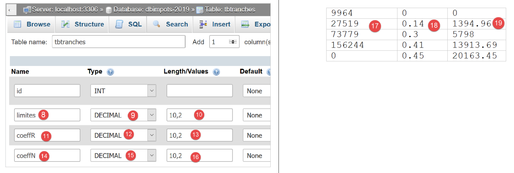
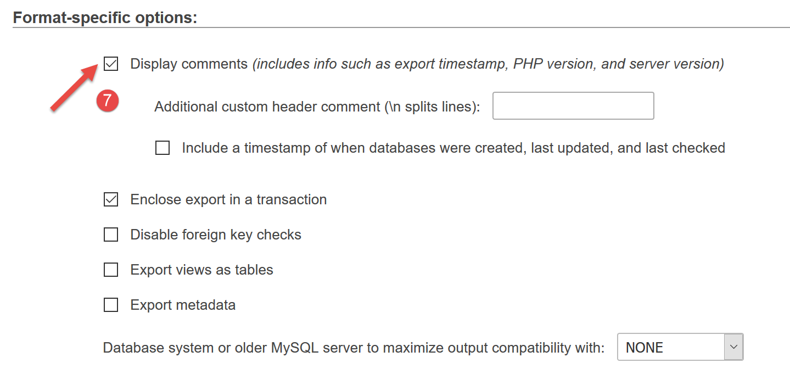
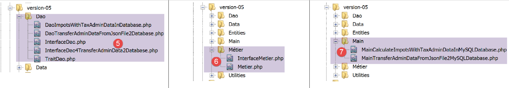
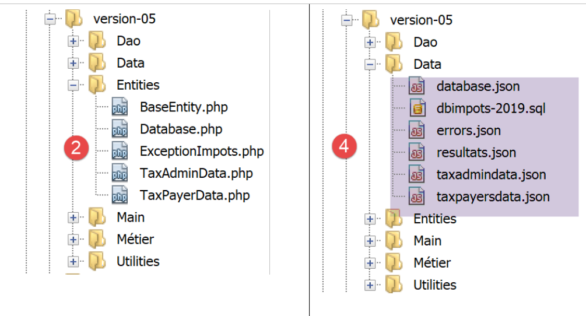
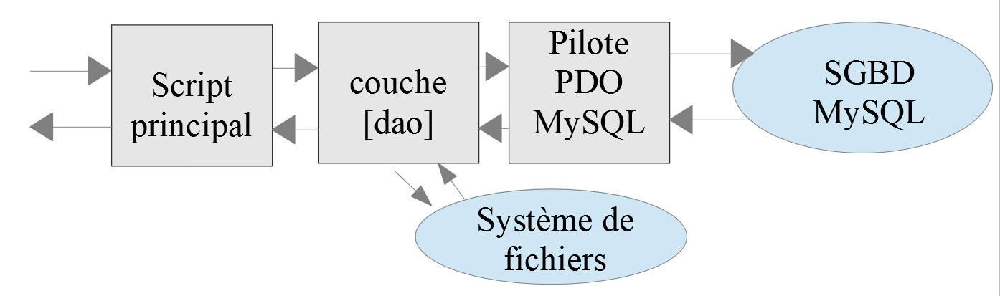
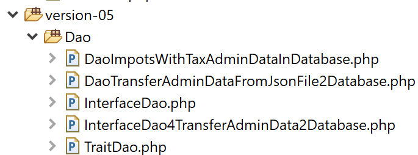
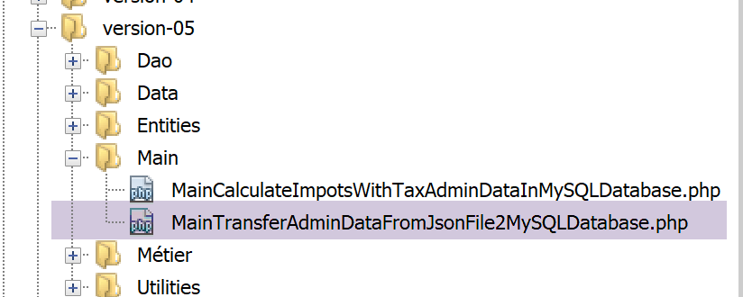

Utilisation du SGBD MySQL
=========================

|image0|

Nous allons maintenant écrire des scripts PHP utilisant une base de
données MySQL :

|image1|

Dans l’architecture ci-dessus, le script PHP (1) ne dialogue pas
directement avec le SGBD (**S**\ ystème de **G**\ estion de **B**\ ases
de **D**\ onnées) (3). Il dialogue avec un intermédiaire appelé
**pilote** de SGBD ou encore **driver** de SGBD. PHP fournit une
interface standard pour ces pilotes, l’interface **PDO** (**P**\ HP
**D**\ ata **O**\ bjects). Cette interface est implémentée par
différentes classes adaptées à chaque SGBD : une classe pour le SGBD
MySQL, une autre pour le SGBD PostgreSQL… Pour changer de SGBD, on
change de pilote :

|image2|

Le pilote PDO isole le script PHP (1) du SGBD (3, 6). Comme ces pilotes
implémentent une interface standard, on peut s’attendre à ce que le
script PHP (1) ne change pas si on passe du SGBD MySQL (3) au SGBD
PostgreSQL (6). Dans la réalité cet idéal n’existe pas. En effet pour
dialoguer avec le SGBD, le script PHP envoie des ordres SQL
(**S**\ tandard **Q**\ uery **L**\ anguage). C’est un langage implémenté
par tous les SGBD mais qui est incomplet. Aussi les SGBD lui ont-ils
ajouté des ordres propriétaires. C’est une première cause
d’incompatibilité entre SGBD. Par ailleurs les types de données
utilisables dans les bases de données peuvent être différents d’un SGBD
à l’autre. Ainsi PostgreSQL accepte un nombre de types de données bien
plus grand que le SGBD MySQL. C’est une seconde cause d’incompatibilité.
Une autre cause est la gestion des clés primaires automatiques (générées
par le SGBD) : quasiment chaque SGBD a sa propre politique. Etc… Les
causes d’incompatibilité sont nombreuses.

Si on veut éviter de réécrire le script PHP (1) en passant de MySQL (3)
à PostgreSQL (6), on est généralement amenés à insérer une nouvelle
couche entre le script PHP (1) et le pilote PDO (2, 5) dont le rôle sera
de gommer les incompatibilités entre les deux SGBD. Cependant dans les
cas simples que nous allons rencontrer, cette couche supplémentaire ne
sera pas nécessaire.

Nous allons maintenant utiliser le SGBD MySQL. Celui-ci est inclus dans
le paquetage Laragon (cf paragraphe
`lien <#_Installation_de_Laragon>`__).

Si le lecteur est novice avec la notion de base de données et de langage
SQL, il pourra lire le document
**[http://sergetahe.com/cours-tutoriels-de-programmation/cours-tutoriel-sql-avec-le-sgbd-firebird/]**.
Ce document utilise le SGBD Firebird et non pas MySQL mais donne les
fondamentaux des bases de données et du langage SQL. Comme MySQL,
Firebird dispose d’une version librement utilisable et de faible
empreinte mémoire.

Création d’une base de données
------------------------------

Nous montrons maintenant comment créer une base de données ainsi qu'un
utilisateur MySQL avec l’outil Laragon.

|image3|

-  une fois lancé, Laragon **[1]** peut être administré à partir d'un
   menu **[2]** ;

-  en **[3-5]**, on installe l'outil **[phpMyAdmin]** d'administration
   de MySQL s’il n’a pas déjà été installé ;

|image4|

-  en **[6]**, on démarre le serveur web Apache ainsi que le SGBD
   MySQL ;

-  en **[7]**, le serveur Apache est lancé ;

-  en **[8]**, le SBD MySQL est lancé ;

|image5|

-  en **[8-10]**, on crée une base de données qu’on nomme
   **[dbpersonnes]** **[11]**. On va construire une base de données de
   personnes ;

|image6|

-  en **[11]**, on va gérer la base de données qu’on vient de créer ;

|image7|

-  l’opération **[Bases de données]** émet une requête web vers l’URL
   **[http://localhost/phpmyadmin]**. C’est le serveur web Apache de
   Laragon qui répond. L’URL **[http://localhost/phpmyadmin]** est l’URL
   de l’utilitaire **[phpMyAdmin]** que nous avons installé précédemment
   **[5]**. Cet utilitaire permet de gérer les bases de données MySQL ;

-  par défaut, les identifiants de connexion de l’administrateur de la
   base sont : **root** **[13]** sans mot de passe **[14]** ;

|image8|

-  en **[16]**, la base de données que nous avons créée précédemment ;

|image9|

-  on a pour l’instant une base **[dbpersonnes]** **[17]** qui est vide
   **[18]** ;

On crée un utilisateur **[admpersonnes]** avec le mot de passe
**[nobody]** qui va avoir tous les droits sur la base de données
**[dbpersonnes]** :

|image10|

-  en **[19]**, on est positionnés sur la base **[dbpersonnes]** ;

-  en **[20]**, on sélectionne l’onglet **[Privileges]** ;

-  en **[21-22]**, on voit que l’utilisateur **[root]** a tous les
   droits sur la base **[dbpersonnes]** ;

-  en **[23]**, on crée un nouvel utilisateur ;

|image11|

-  en **[25-26]**, l’utilisateur aura l’identifiant
   **[admdbpersonnes]** ;

-  en **[27-29]**, son mot de passe sera **[nobody]** ;

-  en **[30]**, phpMyAdmin signale que le mot de passe est très faible
   (facile à craquer). En production, il est préférable de générer un
   mot de passe fort avec **[31]** ;

-  en **[32]**, on indique que l’utilisateur **[admdbpersonnes]** doit
   avoir tous les droits sur la base **[dbpersonnes]** ;

-  en **[33]**, on valide les renseignements donnés ;

|image12|

-  en **[35]**, phpMyAdmin indique que l’utilisateur a été créé ;

-  en **[36]**, l’ordre SQL qui a été émis sur la base ;

-  en **[37]**, l’utilisateur **[admpersonnes]** a tous les droits sur
   la base de données **[dbpersonnes]** ;

Désormais nous avons :

-  une base de données MySQL **[dbpersonnes]** ;

-  un utilisateur **[admpersonnes/nobody]** qui a tous les droits sur
   cette base de données ;

Nous allons écrire des scripts PHP pour exploiter la base de données.
PHP dispose de diverses bibliothèques pour gérer les bases de données.
Nous utiliserons la bibliothèque PDO (PHP Data Objects) qui s'intercale
entre le code PHP et le SGBD :

|image13|

La bibliothèque PDO permet au script PHP de s'abstraire de la nature
exacte du SGBD utilisé. Ainsi ci-dessus, le SGBD **MySQL** peut être
remplacé par le SGBD **PostgreSQL** avec un impact minimum sur le code
du script PHP. Cette bibliothèque n'est pas disponible par défaut. On
peut vérifier sa disponibilité de la façon suivante :

|image14|

-  en **[1-4]**, on vérifie les extensions PDO actives ;

-  en **[5]**, on voit que l’extension PDO pour le SGBD MySQL est
   active. Les autres ne le sont pas. Il suffirait de les cliquer pour
   les activer ;

Une autre façon d’activer une extension est de modifier directement le
fichier **[php.ini]** (paragraphe `lien <#_Configuration_de_PHP>`__) qui
configure PHP :

|image15|

-  en **[1]**, l’extension PDO de MySQL est activée ;

-  en **[2]**, l’extension PDO de Firebird est désactivée ;

Après avoir modifié le fichier **[php.ini]**, il faut **relancer** le
PHP de Laragon pour que les modifications soient prises en compte.

Connexion à une base de données MySQL
-------------------------------------

La connexion à un SGBD se fait par la construction d'un objet PDO. Le
constructeur admet différents paramètres :

.. code-block:: php 
   :linenos:

   $dbh=new PDO(string $dsn,string $user,string $passwd,array $driver_options)

La signification des paramètres est la suivante :

   $\ **dsn** (Data Source Name) est une chaîne précisant la nature du
   SGBD et sa localisation sur internet. La chaîne
   "*mysql:host=localhost*" indique qu'on a affaire à un SGBD MySQL
   opérant sur le serveur local. Cette chaîne peut comprendre d'autres
   paramètres, notamment le port d'écoute du SGBD et le nom de la base à
   laquelle on veut se connecter :
   "*mysql:host=localhost:port=3306:dbname=dbpersonnes*" ;

   $\ **user** identifiant de l'utilisateur qui se connecte ;

   $\ **passwd** son mot de passe ;

   $\ **driver_options** un tableau d'options pour le pilote du SGBD ;

Seul le premier paramètre est obligatoire. L'objet ainsi construit sera
ensuite le support de toutes les opérations faites sur la base de
données à laquelle on s'est connecté. Si l'objet PDO n'a pu être
construit, une exception de type **PDOException** est lancée.

Voici un exemple de connexion **[mysql-01.php]** :

.. code-block:: php 
   :linenos:

   <?php

   // connexion à une base MySql locale
   // l'identité de l'utilisateur est (admpersonnes,nobody)
   const ID = "admpersonnes";
   const PWD = "nobody";
   const HOTE = "localhost";

   try {
     // connexion
     $dbh = new PDO("mysql:host=".HOTE, ID, PWD);
     print "Connexion réussie\n";
     // fermeture de la connexion
     $dbh = NULL;
   } catch (PDOException $e) {
     print "Erreur : " . $e->getMessage() . "\n";
     exit();
   }

**Résultats** :

.. code-block:: php 
   :linenos:

   Connexion réussie

**Commentaires**

-  ligne 11 : la connexion à un SGBD se fait par la construction d'un
   objet PDO. Le constructeur est ici utilisé avec les paramètres
   suivants :

-  une chaîne précisant la nature du SGBD et sa localisation sur
      internet. La chaîne "*mysql:host=localhost*" indique qu'on a
      affaire à un SGBD MySQL opérant sur le serveur local. Le port n'a
      pas été précisé. Le port 3306 est alors utilisé par défaut. Le nom
      de la base de données n'est pas indiqué non plus. Il y aura alors
      connexion au SGBD MySQL, la sélection d'une base précise se
      faisant plus tard ;

-  un identifiant d'utilisateur ;

-  son mot de passe ;

-  ligne 14 : la fermeture de la connexion se fait par suppression de
   l'objet PDO créé initialement ;

-  ligne 15 : la connexion à un SGBD peut échouer. Dans ce cas, une
   exception de type PDOException est lancée. Celle-ci dérive de
   l’exception PHP **[RuntimeException]** ;

-  ligne 16 : on affiche le message d’erreur de l’exception ;

Réexécutons le script en mettant ligne 6 un mot de passe erroné. Le
résultat est alors le suivant :

.. code-block:: php 
   :linenos:

   Erreur : SQLSTATE[HY000] [1045] Access denied for user 'admpersonnes'@'localhost' (using password: YES)

Création d'une table
--------------------

Le script **[mysql-02.php]** montre la création d’une table dans une
base de données :

.. code-block:: php 
   :linenos:

   <?php

   // identité de la base de données
   const DSN = "mysql:host=localhost;dbname=dbpersonnes";
   // identifiants de l'utilisateur
   const ID = "admpersonnes";
   const PWD = "nobody";

   try {
     // connexion à la base MySql
     $connexion = new PDO(DSN, ID, PWD);
     // suppression de la table personnes si elle existe
     $sql = "drop table personnes";
     $connexion->exec($sql);
     // création de la table personnes
     $sql = "create table personnes (prenom varchar(30) NOT NULL, nom varchar(30) NOT NULL, age integer NOT NULL, primary key(nom,prenom))";
     $connexion->exec($sql);
   } catch (PDOException $ex) {
     // affichage erreur
     print "Erreur : " . $ex->getMessage() . "\n";
   } finally {
     // on se déconnecte si besoin est
     $connexion = NULL;
   }
   // fin
   print "Terminé\n";
   exit;

**Commentaires**

-  ligne 11 : connexion à la base de données. C’est toujours la
   1\ :sup:`re` chose à faire. Le résultat de la connexion est un objet
   **[PDO]** au travers duquel vont prendre les opérations sur la base
   de données ;

-  ligne 13 : l’ordre SQL **[drop table personnes]** va supprimer la
   table **[personnes]** de la base de données **[dbpersonnes]**. Si la
   table **[personnes]** n’existe pas, cela ne provoque pas d’erreur ;

-  ligne 14 : exécution de l’ordre SQL précédent sur la base de données
   **[dbpersonnes]**. Cet exécution peut lancer une **[PDOException]**
   qui sera interceptée ligne 18 ;

-  ligne 16 : cet ordre SQL crée une table **[personnes]**. Une table
   contient des lignes et des colonnes. Les colonnes forment ce qu’on
   appelle la **structure** de la table. Les lignes forment le
   **contenu** de la table. Une base de données peut contenir une ou
   plusieurs tables. La table **[personnes]** aura ici trois colonnes :

   -  **prenom** : le prénom d’une personne sous la forme d’une chaîne
      d’au plus 30 caractères ;

   -  **nom** : le nom de cette même personne sous la forme d’une chaîne
      d’au plus 30 caractères ;

   -  **age** : l’âge de la personne sous la forme d’un entier ;

   -  l’attribut **NOT NULL** sur une colonne impose que la colonne ait
      une valeur. Ne pas lui en donner provoque une **[PDOException]** ;

   -  **[primary key(nom,prenom)]** fixe une **clé primaire** à la table
      **[personnes]**. Une clé primaire a une valeur **unique** pour
      chaque ligne de la table. Ici la clé primaire sera obtenue par
      concaténation des colonnes **[nom]** et **[prenom]** de la ligne.
      Cette contrainte fait que dans la table on ne pourra pas avoir
      deux personnes ayant les mêmes nom et prénom, donc deux homonymes.
      Créer un homonyme d’une personne dans la table provoque une
      **[PDOException]** ;

-  ligne 17 : exécution de l’ordre SQL sur la base de données
   **[dbpersonnes]** ;

-  ligne 20 : s’il se produit une **[PDOException]**, on affiche le
   message d’erreur associé ;

-  lignes 21-24 : on passe dans la clause **[finally]** dans tous les
   cas, exception ou pas, pour fermer la connexion à la base de données
   (ligne 23) ;

**Résultats** :

Si l’exécution du script se passe sans erreurs, on peut voir la présence
de la table dans phpMyAdmin  :

|image16|

|image17|

-  en **[3]** la base de données ;

-  en **[4]**, la table présentée ;

-  en **[5]**, la structure des tables est présentée dans l’onglet
   **[Structure]** ;

-  en **[6-8]**, les trois colonnes de la table ;

-  en **[9]**, aucune des trois colonnes ne peut être vide ;

|image18|

-  en **[10]**, la liste des index de la table. Un index permet de
   retrouver dans la table les lignes ayant tel index, plus vite que si
   on parcourait séquentiellement les lignes de la table. La clé
   primaire fait toujours partie des index mais un index peut ne pas
   être une clé primaire ;

-  en **[11]**, l’index est ici la clé primaire ;

-  en **[12]**, l’index est constitué des colonnes **[nom, prenom]** de
   chaque ligne ;

Maintenant, voyons ce qui se passe si on crée des erreurs,
respectivement sur le nom de la base, le nom de l’utilisateur, son mot
de passe :

Si on met un nom de base inexistante :

.. code-block:: php 
   :linenos:

   Erreur : SQLSTATE[HY000] [1044] Access denied for user 'admpersonnes'@'%' to database 'dbpersonnes2'

Si on met un nom d’utilisateur inexistant :

.. code-block:: php 
   :linenos:

   Erreur : SQLSTATE[HY000] [1045] Access denied for user 'admpersonnes2'@'localhost' (using password: YES)

Si on met un mot de passe erroné :

.. code-block:: php 
   :linenos:

   Erreur : SQLSTATE[HY000] [1045] Access denied for user 'admpersonnes'@'localhost' (using password: YES)

Remplissage d’une table
-----------------------

Nous allons écrire un script PHP qui exécute des ordres SQL trouvés dans
le fichier texte **[creation.txt]** suivant :

.. code-block:: php 
   :linenos:

   drop table if exists personnes
   SET NAMES 'utf8'
   create table personnes (prenom varchar(30) not null, nom varchar(30) not null, age integer not null, primary key (nom,prenom))
   insert into personnes (prenom, nom, age) values('Paul','Langevin',48)
   insert into personnes (prenom, nom, age) values ('Sylvie','Lefur',70)
   insert into personnes (prenom, nom, age) values ('Sylvie','Lefur',70)
   insert into personnes (prenom, nom, age) values ('Pierre','Nicazou',35)
   insert into personnes (prenom, nom, age) values ('Géraldine','Colou',26)
   insert into personnes (prenom, nom, age) values ('Paulette','Girond',56)
   insert into personnes (prenom, nom, age) values ('Paulette','Girond',56)

**Commentaires**

-  le langage SQL (Structured Query Language) n’est pas sensible à la
   casse (majuscules, minuscules) des ordre SQL ;

-  ligne 1 : on supprime la table **[personnes]** si elle existe ;

-  ligne 2 : on indique au serveur MySQL qu’on va lui envoyer des
   caractères codés en UTF-8. Cet ordre SQL propre à MySQL est
   nécessaire ici par exemple pour avoir ligne 7, le é de Géraldine dans
   la base. Si on ne met pas la ligne 2, le é va être traduit en une
   suite de deux caractères étranges. Le client est le script PHP écrit
   sous Netbeans. Or celui-ci code les fichiers en UTF-8 **[1-4]**
   ci-dessous :

|image19|

-  ligne 3 : création de la table **[personnes]** avec les trois
   colonnes (prenom, nom, age) et la clé primaire (nom, prenom) ;

-  lignes 4-10 : insertion de 7 lignes dans la table **[personnes]** ;

-  ligne 6 : cet ordre d’insertion devrait échouer car il tente la même
   insertion que ligne 5. La contrainte de clé primaire devrait empêcher
   cette insertion : on ne peut avoir deux personnes ayant mêmes nom et
   prénom ;

-  ligne 10 : cet ordre d’insertion devrait échouer car il tente la même
   insertion que ligne 9 ;

Le script PHP chargé d’exécuter les ordres SQL de ce fichier texte est
le suivant **[mysql-03.php]** :

.. code-block:: php 
   :linenos:

   <?php

   // identité de la base de données
   const DSN = "mysql:host=localhost;dbname=dbpersonnes";
   // identifiants de l'utilisateur
   const ID = "admpersonnes";
   const PWD = "nobody";
   // identité du fichier texte des commandes SQL à exécuter
   const SQL_COMMANDS_FILENAME = "creation.txt";

   // ouverture connexion à la base MySql
   try {
     $connexion = new PDO(DSN, ID, PWD);
   } catch (PDOException $ex) {
     // affichage erreur
     print "Erreur : " . $ex->getMessage() . "\n";
     exit;
   }
   // on veut qu'à chaque erreur de SGBD, une exception soit lancée
   $connexion->setAttribute(PDO::ATTR_ERRMODE, PDO::ERRMODE_EXCEPTION);
   // exécution du fichier d'ordres SQL
   $erreurs = exécuterCommandes($connexion, SQL_COMMANDS_FILENAME, TRUE, FALSE);
   // fermeture connexion
   $connexion = NULL;
   //affichage nombre d'erreurs
   printf("\n-----------------------\nIl y a eu %d erreur(s)\n", count($erreurs));
   for ($i = 0; $i < count($erreurs); $i++) {
     print "$erreurs[$i]\n";
   }

   // c'est fini
   print "Terminé\n";
   exit;

   // ---------------------------------------------------------------------------------
   function exécuterCommandes(PDO $connexion, string $SQLFileName, bool $suivi = FALSE, bool $arrêt = TRUE): array {
   // utilise la connexion $connexion
   // exécute les commandes SQL contenues dans le fichier texte SQLFileName
   // ce fichier est un fichier de commandes SQL à exécuter à raison d'une par ligne
   // si $suivi=1 alors chaque exécution d'un ordre SQL fait l'objet d'un affichage indiquant sa réussite ou son échec
   // si $arrêt=1, la fonction s'arrête sur la 1re erreur rencontrée sinon elle exécute ttes les commandes sql
   // la fonction rend un tableau (nb d'erreurs, erreur1, erreur2…)
   // on vérifie la présence du fichier SQLFileName

     if (!file_exists($SQLFileName)) {
       return ["Le fichier [$SQLFileName] n'existe pas"];
     }

     // exécution des requêtes SQL contenues dans SQLFileName
     // on les met dans un tableau
     $requêtes = file($SQLFileName);
     // erreur ?
     if ($requêtes === FALSE) {
       return ["Erreur lors de l'exploitation du fichier SQL [$SQLFileName]"];
     }
     // on exécute les requêtes une par une - au départ pas d'erreurs
     $erreurs = [];
     $i = 0;
     $fini = FALSE;
     while ($i < count($requêtes) && !$fini) {
       // on récupère le texte de la requête
       // trim va enlever la marque de fin de ligne
       $requête = trim($requêtes[$i]);
       // requête vide ?
       if (strlen($requête) == 0) {
         // on ignore la requête et on passe à la requête suivante
         $i++;
         continue;
       }
       try {
         // exécution de la requête - une exception peut être lancée
         $connexion->exec($requête);
         // suivi écran ou non ?
         if ($suivi) {
           print "$requête : Exécution réussie\n";
         }
       } catch (PDOException $ex) {
         // il s'est produit une erreur
         addError($erreurs, $requête, $ex->getMessage(), $suivi);
         // est-ce qu'on s'arrête ?
         $fini = $arrêt;
       }
       // requête suivante
       $i++;
     }
     // résultat
     return $erreurs;
   }

   function addError(array &$erreurs, string $requête, string $msg, bool $suivi): void {
     // on ajoute un msg d'erreur
     $msg = "$requête : Erreur (" . $msg . ")";
     $erreurs[] = $msg;
     // suivi écran ou non ?
     if ($suivi) {
       print "$msg\n";
     }
   }

**Commentaires**

-  la fonction **[exécuterCommandes]** (lignes 36-89) est chargée
   d’exécuter les commandes SQL qu’elle trouve dans le fichier texte
   **[$SQLFileName]** (paramètre 2). Pour les exécuter elle utilise la
   connexion ouverte **[$connexion]** (paramètre 1) avec le serveur
   MySQL. Le troisième paramètre **[$suivi]** est un booléen qui
   contrôle les affichages écran : à TRUE, l’ordre SQL exécuté est
   affiché à l’écran avec sa réussite ou son échec, sinon l’exécution de
   l’ordre SQL est silencieux. Le quatrième paramètre **[$arrêt]**
   contrôle ce qu’il faut faire lorsq’une commande SQL échoue : à TRUE,
   il indique que l’exécution des commandes SQL doit s’arrêter, sinon
   celle-ci continue. La fonction **[exécuterCommandes]** rend un
   tableau de messages d’erreurs, vide s’il n’y a pas eu d’erreurs ;

-  lignes 11-18 : on ouvre la connexion vers la base MySQL
   **[dbpersonnes]**. Si l’ouverture échoue, un message d’erreur est
   affiché et on s’arrête (lignes 14-18) ;

-  ligne 22 : on passe donc une connexion ouverte à la fonction
   **[exécuterCommandes]**. Elle sera fermée au retour de la fonction
   (ligne 24) ;

-  ligne 20 : avant de la passer à la fonction **[exécuterCommandes]**,
   on configure la connexion. En cas d’erreur, les opérations SQL avec
   un objet **[PDO]** peuvent soit rendre le booléen **FALSE** (valeur
   par défaut), soit lancer une exception. La ligne 20 choisit ce second
   cas. En effet, il est facile ‘d’oublier’ de vérifier le résultat
   booléen de l’exécution d’un ordre SQL. Cela produira une erreur
   ultérieurement mais ailleurs dans le code rendant ainsi plus
   difficile le lieu originel de celle-ci. Dans le cas d’une exception
   non gérée (absence de *catch*), l’exception va remonter dans le code
   jusqu’à rencontrer un *catch* ou jusqu’à remonter à l’interpréteur
   PHP qui lui interceptera l’exception. Dans ce cas, la nature de
   l’exception et son lieu d’origine dans le code sont affichés ;

-  ligne 22 : la fonction **[exécuterCommandes]** est appelée pour
   exécuter le fichier d’ordres SQL **[$SQLFileName]** ;

-  lignes 45-47 : on vérifie que le fichier des ordres SQL existe bien.
   Si ce n’est pas le cas, on note l’erreur et on retourne ce résultat ;

-  ligne 51 : on met les ordres SQL dans un tableau **[$requêtes]**.
   Lignes 53-55, si l’opération échoue, on rend un tableau d’erreurs
   avec un unique message ;

-  ligne 57 : on va cumuler les erreurs dans le tableau **[$erreurs]** ;

-  ligne 58 : n° de la requête ;

-  ligne 59 : le booléen **[$fini]** contrôle l’exécution des ordres SQL
   du tableau **[$requêtes]**. Lorsqu’il passe à TRUE, l’exécution
   s’arrête ;

-  ligne 60 : on boucle sur toutes les requêtes ;

-  ligne 63 : on extrait le texte de l’ordre SQL n° i. La fonction
   **[trim]** va enlever les espaces qui précèdent et suivent le texte
   de l’ordre SQL. Par ‘espaces’, il faut entendre le blanc \\b, le
   retour chariot \\r, la marque de fin de ligne \\n, le saut de page
   \\f, la tabulation \\t… Ce qui nous importe ici c’est que la marque
   de fin de ligne du texte SQL va disparaître ;

-  lignes 65-69 : si le texte SQL est vide, alors on ignore la requête
   et on passe à la suivante ;

-  ligne 72 : on envoie l’ordre SQL au serveur MySQL. La méthode
   **[PDO::exec]** va lancer une exception si l’exécution échoue. On
   rappelle que ce comportement est dû à la configuration faite à la
   ligne 20 ;

-  ligne 79 : le message d’erreur est ajouté au tableau des erreurs ;

-  ligne 81 : on positionne le booléen **[$fini]** qui contrôle la
   boucle. Si le paramètre **[$arrêt]** (ligne 36) vaut TRUE, on doit
   arrêter la boucle ;

-  lignes 74-76 : si l’exécution de l’ordre SQL a réussi, on l’affiche à
   l’écran si le paramètre **[$suivi]** (ligne 36) vaut TRUE ;

-  ligne 87 : une fois toutes les ordres SQL exécutés, on rend le
   tableau des erreurs **[$erreurs]** ;

La fonction **[adError]** des lignes 90-97 permet d’ajouter une erreur
au tableau des erreurs **[$erreurs]** :

-  ligne 90 : la fonction reçoit 4 paramètres :

   -  le paramètre **[$erreurs]** est passé par référence. En effet on
      veut agir sur le tableau qui est passé en paramètre et non sur une
      copie de celui-ci ;

   -  le paramètre **[$requête]** est le texte SQL de l’ordre qui a
      échoué ;

   -  le paramètre **[$msg]** est le message d’erreur lié à l’ordre qui
      a échoué ;

   -  le booléen **[$suivi]** indique si le message d’erreur doit être
      affiché ($suivi=TRUE) ou non ($suivi=FALSE) sur la console ;

La fonction **[exécuterCommandes]** est appelé par le script des lignes
3-33 :

-  lignes 11-18 : une connexion est faite avec la base de données MySQL
   **[dbpersonnes]** ;

-  ligne 20 : la connexion est configurée ;

-  ligne 22 : le fichier des ordres SQL est ensuite exécuté ;

-  ligne 24 : on ferme la connexion ;

-  lignes 26-29 : on affiche les erreurs rendues par la fonction
   **[exécuterCommandes]** ;

Les **résultats** écran :

.. code-block:: php 
   :linenos:

   drop table if exists personnes : Exécution réussie
   SET NAMES 'utf8' : Exécution réussie
   create table personnes (prenom varchar(30) not null, nom varchar(30) not null, age integer not null, primary key (nom,prenom)) : Exécution réussie
   insert into personnes (prenom, nom, age) values('Paul','Langevin',48) : Exécution réussie
   insert into personnes (prenom, nom, age) values ('Sylvie','Lefur',70) : Exécution réussie
   insert into personnes (prenom, nom, age) values ('Sylvie','Lefur',70) : Erreur (SQLSTATE[23000]: Integrity constraint violation: 1062 Duplicate entry 'Lefur-Sylvie' for key 'PRIMARY')
   insert into personnes (prenom, nom, age) values ('Pierre','Nicazou',35) : Exécution réussie
   insert into personnes (prenom, nom, age) values ('Géraldine','Colou',26) : Exécution réussie
   insert into personnes (prenom, nom, age) values ('Paulette','Girond',56) : Exécution réussie
   insert into personnes (prenom, nom, age) values ('Paulette','Girond',56) : Erreur (SQLSTATE[23000]: Integrity constraint violation: 1062 Duplicate entry 'Girond-Paulette' for key 'PRIMARY')

   -----------------------
   Il y a eu 2 erreur(s)
   insert into personnes (prenom, nom, age) values ('Sylvie','Lefur',70) : Erreur (SQLSTATE[23000]: Integrity constraint violation: 1062 Duplicate entry 'Lefur-Sylvie' for key 'PRIMARY')
   insert into personnes (prenom, nom, age) values ('Paulette','Girond',56) : Erreur (SQLSTATE[23000]: Integrity constraint violation: 1062 Duplicate entry 'Girond-Paulette' for key 'PRIMARY')
   Terminé

Les insertions faites sont visibles avec phpMyAdmin :

|image20|

Exécution d’ordres SQL quelconques
----------------------------------

Le script suivant montre l'exécution des ordres SQL du fichier texte
**[sql.txt]** suivant :

.. code-block:: php 
   :linenos:

   select * from personnes
   select nom,prenom from personnes order by nom asc, prenom desc
   select * from personnes where age between 20 and 40 order by age desc, nom asc, prenom asc
   insert into personnes values('Josette','Bruneau',46)
   update personnes set age=47 where nom='Bruneau'
   select * from personnes where nom='Bruneau'
   delete from personnes where nom='Bruneau'
   select * from personnes where nom='Bruneau'
   xselect * from personnes where nom='Bruneau'

Parmi ces ordres SQL, il y a l'ordre **select** qui ramène des résultats
de la base de données, les ordres **insert**, **update**, **delete** qui
modifient la base sans ramener de résultats et enfin des ordres erronés
tels que le dernier (**xselect**). Le script **[mysql-04.php]** est le
suivant :

.. code-block:: php 
   :linenos:

   <?php

   // identité de la base de données
   const DSN = "mysql:host=localhost;dbname=dbpersonnes";
   // identifiants de l'utilisateur
   const ID = "admpersonnes";
   const PWD = "nobody";
   // identité du fichier texte des commandes SQL à exécuter
   const SQL_COMMANDS_FILENAME = "sql.txt";

   try {
     // connexion à la base MySql
     $connexion = new PDO(DSN, ID, PWD);
   } catch (PDOException $ex) {
     // affichage erreur
     print "Erreur : " . $ex->getMessage() . "\n";
     exit;
   }
   // on veut qu'à chaque erreur de SGBD, une exception soit lancée
   $connexion->setAttribute(PDO::ATTR_ERRMODE, PDO::ERRMODE_EXCEPTION);
   // exécution du fichier d'ordres SQL
   $erreurs = exécuterCommandes($connexion, SQL_COMMANDS_FILENAME, TRUE, FALSE);
   // fermeture connexion
   $connexion = NULL;
   //affichage nombre d'erreurs
   printf("\n-----------------------\nIl y a eu %d erreur(s)\n", count($erreurs));
   for ($i = 0; $i < count($erreurs); $i++) {
     print "$erreurs[$i]\n";
   }

   // c'est fini
   print "Terminé\n";
   exit;

   // ---------------------------------------------------------------------------------
   function exécuterCommandes(PDO $connexion, string $SQLFileName, bool $suivi = FALSE, bool $arrêt = TRUE): array {
   ………………………………………………………….
     // on exécute les requêtes une par une - au départ pas d'erreurs
     $erreurs = [];
     $i = 0;
     $fini = FALSE;
     while ($i < count($requêtes) && !$fini) {
       // on récupère le texte de la requête
       // trim va enlever la marque de fin de ligne
       $requête = trim($requêtes[$i]);
       // requête vide ?
       if (strlen($requête) == 0) {
         // on ignore la requête et on passe à la requête suivante
         $i++;
         continue;
       }
       // exécution de la requête
       // on récupère son nom
       $commande = "";
       if (preg_match("/^\s*(\S+)/", $requête, $champs)) {
         $commande = strtolower($champs[0]);
       }
       try {
         // est-ce un ordre SELECT ?
         if ($commande === "select") {
           $résultat = $connexion->query($requête);
         } else {
           $résultat = $connexion->exec($requête);
         }
         // suivi écran ou non ?
         if ($suivi) {
           print "[$requête] : Exécution réussie\n";
         }
         // on affiche le résultat de l'exécution
         afficherInfos($commande, $résultat);
       } catch (PDOException $ex) {
         // il s'est produit une erreur
         addError($erreurs, $requête, $ex->getMessage(), $suivi);
         // est-ce qu'on s'arrête ?
         $fini = $arrêt;
       }
       // requête suivante
       $i++;
     }
     // résultat
     return $erreurs;
   }

   function addError(array &$erreurs, string $requête, string $msg, bool $suivi): void {
     …
   }

   // ---------------------------------------------------------------------------------
   function afficherInfos(string $commande, $résultat): void {
     // affiche le résultat $résultat d'une requête sql
     // s'agissait-il d'un select ?
     switch ($commande) {
       case "select" :
         // on affiche les noms des champs
         $titre = "";
         $nbColonnes = $résultat->columnCount();
         for ($i = 0; $i < $nbColonnes; $i++) {
           $infos = $résultat->getColumnMeta($i);
           $titre .= $infos['name'] . ",";
         }
         // on enlève le dernier caractère ,
         $titre = substr($titre, 0, strlen($titre) - 1);
         // on affiche la liste des champs
         print "$titre\n";
         // ligne séparatrice
         $séparateurs = "";
         for ($i = 0; $i < strlen($titre); $i++) {
           $séparateurs .= "-";
         }
         print "$séparateurs\n";
         // données
         foreach ($résultat as $ligne) {
           $data = "";
           for ($i = 0; $i < $nbColonnes; $i++) {
             $data .= $ligne[$i] . ",";
           }
           // on enlève le dernier caractère ,
           $data = substr($data, 0, strlen($data) - 1);
           // on affiche
           print "$data\n";
         }
         break;
       case "update":
       case "insert":
       case "delete";
         print " $résultat lignes(s) a (ont) été modifiée(s)\n";
         break;
     }
   }

**Commentaires**

-  lignes 36-83 : la fonction **[exécuterCommandes]** est légèrement
   modifiée : l’ordre SQL **[select]** ne s’exécute pas de la même façon
   que les autres ordres SQL. Cet ordre est le seul à ramener comme
   résultat une table, ç-à-d un ensemble de lignes et de colonnes de la
   base de données ;

-  lignes 55-57 : on isole le 1\ :sup:`er` mot de l’ordre SQL à l’aide
   d’une expression régulière ;

-  lignes 60-64 : si la commande SQL est **[select]**, on utilise la
   méthode **[PDO::query]** sinon la méthode **[PDO::exec]** pour
   exécuter l’ordre SQL. Dans les deux cas, si l’exécution échoue, une
   exception sera lancée et interceptée lignes 71-77. Si l’exécution
   réussit, la ligne 70 affiche son résultat ;

-  lignes 90-130 : la fonction *afficherInfos* affiche des informations
   sur le résultat de l’exécution d’un ordre SQL ;

-  ligne 94 : on traite le cas du **[select]**. Son résultat est un
   objet de type **[PDOStatement]** ;

-  ligne 96 : la méthode **[PDOStatement::getColumnCount()]** rend le
   nombre de colonnes de la table résultat du *select* ;

-  lignes 98-99 : la méthode **[PDOStatement::getMeta(i)]** rend un
   dictionnaire d'informations sur la colonne n° *i* de la table
   résultat du *select.* Dans ce dictionnaire, la valeur associée à la
   clé '*name*' est le nom de la colonne ;

-  lignes 97-102 : les noms des colonnes de la table résultat du
   *select* sont concaténées dans une chaîne de caractères ;

-  lignes 105-110 : on construit une ligne de séparation ayant la même
   longueur que la chaîne de caractères construite précédemment ;

-  lignes 112-121 : un objet de type *PDOStatement* peut être parcouru
   par une boucle *foreach*. A chaque itération, l'élément obtenu est
   une ligne de la table résultat du *select* sous la forme d'un tableau
   de valeurs représentant les valeurs des différentes colonnes de la
   ligne. On affiche toutes ces valeurs avec une boucle *for* (lignes
   114-116)\ * *;

-  lignes 123-127 : le résultat de l'exécution d'un ordre *insert*,
   *update*, *delete* est le nombre de lignes modifiées par l'ordre ;

Les **résultats** écran :

.. code-block:: php 
   :linenos:

   [set names 'utf8'] : Exécution réussie
   [select * from personnes] : Exécution réussie
   prenom,nom,age
   --------------
   Géraldine,Colou,26
   Paulette,Girond,56
   Paul,Langevin,48
   Sylvie,Lefur,70
   Pierre,Nicazou,35
   [select nom,prenom from personnes order by nom asc, prenom desc] : Exécution réussie
   nom,prenom
   ----------
   Colou,Géraldine
   Girond,Paulette
   Langevin,Paul
   Lefur,Sylvie
   Nicazou,Pierre
   [select * from personnes where age between 20 and 40 order by age desc, nom asc, prenom asc] : Exécution réussie
   prenom,nom,age
   --------------
   Pierre,Nicazou,35
   Géraldine,Colou,26
   [insert into personnes values('Josette','Bruneau',46)] : Exécution réussie
    1 lignes(s) a (ont) été modifiée(s)
   [update personnes set age=47 where nom='Bruneau'] : Exécution réussie
    1 lignes(s) a (ont) été modifiée(s)
   [select * from personnes where nom='Bruneau'] : Exécution réussie
   prenom,nom,age
   --------------
   Josette,Bruneau,47
   [delete from personnes where nom='Bruneau'] : Exécution réussie
    1 lignes(s) a (ont) été modifiée(s)
   [select * from personnes where nom='Bruneau'] : Exécution réussie
   prenom,nom,age
   --------------
   [insert into personnes values('Josette','Bruneau',46)] : Exécution réussie
    1 lignes(s) a (ont) été modifiée(s)
   [xselect * from personnes where nom='Bruneau'] : Erreur (SQLSTATE[42000]: Syntax error or access violation: 1064 You have an error in your SQL syntax; check the manual that corresponds to your MySQL server version for the right syntax to use near 'xselect * from personnes where nom='Bruneau'' at line 1)

   -----------------------
   Il y a eu 1 erreur(s)
   [xselect * from personnes where nom='Bruneau'] : Erreur (SQLSTATE[42000]: Syntax error or access violation: 1064 You have an error in your SQL syntax; check the manual that corresponds to your MySQL server version for the right syntax to use near 'xselect * from personnes where nom='Bruneau'' at line 1)
   Terminé

Utilisation d’ordres SQL préparés
---------------------------------

Exemple 1
~~~~~~~~~

Examinons le script suivant **[mysql-05.php]** :

.. code-block:: php 
   :linenos:

   <?php

   // identité de la base de données
   const DSN = "mysql:host=localhost;dbname=dbpersonnes";
   // identifiants de l'utilisateur
   const ID = "admpersonnes";
   const PWD = "nobody";

   try {
     // connexion à la base MySql
     $connexion = new PDO(DSN, ID, PWD);
     // on veut qu'à chaque erreur de SGBD, une exception soit lancée
     $connexion->setAttribute(PDO::ATTR_ERRMODE, PDO::ERRMODE_EXCEPTION);
     // on vide la table des personnes
     $connexion->exec("delete from personnes");
     // une liste de personnes
     $personnes = [];
     $personnes[] = ["nom" => "Langevin", "prenom" => "Paul", "age" => 47];
     $personnes[] = ["nom" => "Lefur", "prenom" => "Sylvie", "age" => 28];
     // on va mettre ces personnes dans la base de données
     $statement = $connexion->prepare("insert into personnes (nom, prenom, age) values (:nom, :prenom, :age)");
     for ($i = 0; $i < count($personnes); $i++) {
       $statement->execute($personnes[$i]);
     }
   } catch (PDOException $ex) {
     // affichage erreur
     print "Erreur : " . $ex->getMessage() . "\n";
   } finally {
   // fermeture connexion
     $connexion = NULL;
   }

   // c'est fini
   print "Terminé\n";
   exit;

**Commentaires**

Nous nous intéressons ici aux lignes 16-24 qui insèrent deux personnes
dans la table des personnes de la base **[dbpersonnes]**.

-  ligne 21 : on ‘prépare’ un ordre SQL paramétré. Les paramètres sont
   précédés du caractère : :**nom**, :**prenom**, :**age**. Pour
   ‘préparer’ un ordre SQL, on utilise la méthode **[PDO::prepare]**. Le
   résultat est un type **[PDOStatement]**. La ‘préparation’ n’est pas
   une exécution : rien n’est exécuté ;

-  ligne 23 : exécution de l’ordre ‘préparé’ avec la méthode
   **[PDOStatement::execute]**. Pour ce faire, il faut donner des
   valeurs aux paramètres :**nom**, :**prenom** et :**age**. Il y a
   plusieurs façons de faire cela. On utilise ici un dictionnaire ayant
   pour clés les paramètres de l’ordre préparé que l’on passe à la
   méthode **[PDOStatement::execute]**. Une autre façon de faire est de
   donner aux paramètres une valeur avec la méthode
   **[PDOStatement::bindValue($paramètre,$valeur)]**. Par exemple ici :

.. code-block:: php 
   :linenos:

   $statement→bindValue(“nom”,”Langevin”);
   $statement→bindValue(“prenom”,”Paul”);
   $statement→bindValue(“age”,47);
   $statement→execute();

..

   L’inconvénient est qu’il faut réitérer cette instruction pour chaque
   paramètre. La méthode du dictionnaire peut alors être plus pratique.
   La méthode **[PDOStatement::execute]** rend FALSE si l’exécution
   échoue ;

-  la méthode utilisée ici pour faire les insertions :

   -  **une** méthode préparée ;

   -  **n** exécutions de l’ordre préparé ;

..

   est plus économique en temps d’exécution que d’exécuter **n** ordres
   SQL **différents**. Cette méthode est donc à privilégier. Elle est
   utilisable pour les ordres SQL *select, update, delete, insert*. Dans
   le cas de l’ordre SQL *select*, après son exécution avec
   **[PDOStatement::execute]**, on récupère les lignes du résultat avec
   la méthode **[PDOStatement::fetchAll]** ;

Exemple 2
~~~~~~~~~

Le script suivant **[mysql-06.php]** montre l’utilisation d’un ordre
préparé pour l’opération SQL **select**, ainsi que diverses façons de
récupérer les lignes ramenées par cette opération :

.. code-block:: php 
   :linenos:

   <?php

   // identité de la base de données
   const DSN = "mysql:host=localhost;dbname=dbpersonnes";
   // identifiants de l'utilisateur
   const ID = "admpersonnes";
   const PWD = "nobody";

   try {
     // connexion à la base MySql
     $connexion = new PDO(DSN, ID, PWD);
     // on veut qu'à chaque erreur de SGBD, une exception soit lancée
     $connexion->setAttribute(PDO::ATTR_ERRMODE, PDO::ERRMODE_EXCEPTION);
     // on vide la table des personnes
     $connexion->exec("delete from personnes");
     // on va mettre ces personnes dans la base de données
     $statement = $connexion->prepare("insert into personnes (nom, prenom, age) values (:nom, :prenom, :age)");
     for ($i = 0; $i < 10; $i++) {
       $statement->execute(["nom" => "nom" . $i, "prenom" => "prenom" . $i, "age" => $i * 10]);
     }
     // on interroge la base
     $statement = $connexion->prepare("select nom, prenom, age from personnes");
     $statement->execute();
     // 1re ligne
     $ligne = $statement->fetch();
     var_dump($ligne);
     // 2e ligne
     $ligne = $statement->fetch(PDO::FETCH_ASSOC);
     var_dump($ligne);
     // 3e ligne
     $ligne = $statement->fetch(PDO::FETCH_OBJ);
     var_dump($ligne);
     // 4e ligne
     $statement->setFetchMode(PDO::FETCH_CLASS, "Person");
     $ligne = $statement->fetch();
     var_dump($ligne);
     // lecture séquentielle de toutes les lignes
     $statement = $connexion->prepare("select nom, prenom, age from personnes");
     $statement->execute();
     $statement->setFetchMode(PDO::FETCH_CLASS, "Person");
     while ($personne = $statement->fetch()) {
       print "$personne\n";
     }
   } catch (PDOException $ex) {
     // affichage erreur
     print "Erreur : " . $ex->getMessage() . "\n";
   } finally {
   // fermeture connexion
     $connexion = NULL;
   }

   // c'est fini
   print "Terminé\n";
   exit;

   class Person {
     private $nom;
     private $prenom;
     private $age;

     public function __toString() {
       return "Personne[$this->nom,$this->prenom,$this->age]";
     }

   }

**Commentaires**

-  lignes 17-20 : on insère 10 lignes dans la table **[personnes]** de
   la base **[admpersonnes]** :

|image21|

-  ligne 22 : on « prépare » un ordre SQL **[select]** qu’on exécute
   ligne 23 ;

-  ligne 25 : on récupère avec la méthode **[PDOStatement::fetch]** une
   ligne du résultat de l’opération SQL **[select]** exécutée. La
   méthode **[PDOStatement::fetch]** peut récupérer de diverses façons
   les lignes résultats d’une opération SQL **[select]** préparée. Le
   script en présente quelques unes. La méthode
   **[PDOStatement::fetch]** sans paramètres ramène la ligne courante du
   **[select]** sous la forme d’un dictionnaire indexé à la fois sur les
   n°s de colonnes et leurs noms ;

-  ligne 26 : affiche le résultat suivant :

.. code-block:: php 
   :linenos:

   array(6) {
     ["nom"]=>
     string(4) "nom0"
     [0]=>
     string(4) "nom0"
     ["prenom"]=>
     string(7) "prenom0"
     [1]=>
     string(7) "prenom0"
     ["age"]=>
     string(1) "0"
     [2]=>
     string(1) "0"
   }

-  lignes 28-29 : le paramètre **[PDO::FETCH_ASSOC]** fait que la ligne
   ramenée est un dictionnaire indexé par les noms des colonnes de la
   table :

.. code-block:: php 
   :linenos:

   array(3) {
     ["nom"]=>
     string(4) "nom1"
     ["prenom"]=>
     string(7) "prenom1"
     ["age"]=>
     string(2) "10"
   }

-  lignes 31-32 : le paramètre **[PDO::FETCH_OBJ]** fait que la ligne
   ramenée est un objet de type **[stdclass]** dont les attributs sont
   les noms des colonnes de la table :

.. code-block:: php 
   :linenos:

   object(stdClass)#2 (3) {
     ["nom"]=>
     string(4) "nom2"
     ["prenom"]=>
     string(7) "prenom2"
     ["age"]=>
     string(2) "20"
   }

-  ligne 34 : on fixe le mode de recherche de la méthode **[fetch]**
   avec la méthode **[PDOStatement::setFetchMode]**. Ce mode devient
   alors le mode par défaut tant qu’il n’est pas changé soit par une
   autre opération **[PDOStatement::setFetchMode]** soit en passant un
   mode en paramètre à la méthode **[PDOStatement::fetch]** comme il a
   été fait précédemment. L’opération **[setFetchMode(PDO::FETCH_CLASS,
   "Person")]** indique que la ligne lue doit être placée dans un objet
   de type **[Person]**. Cette classe doit avoir parmi ces attributs,
   des attributs portant le nom des colonnes de la ligne lue. C’est le
   cas de la classe **[Person]** définie aux lignes 56-63 ;

-  la ligne 36 affiche le résultat suivant :

.. code-block:: php 
   :linenos:

   object(Person)#4 (3) {
     ["nom":"Person":private]=>
     string(4) "nom3"
     ["prenom":"Person":private]=>
     string(7) "prenom3"
     ["age":"Person":private]=>
     string(2) "30"
   }

-  lignes 38-43 : montrent comment exploiter séquentiellement les
   résultats du **[select]** ;

-  ligne 42 : l’affichage de **[$personne]** va utiliser la méthode
   **[__toString]** de la classe **[Person]** ;

Utilisation de transactions
---------------------------

Une transaction permet de regrouper une séquence d’ordres SQL en une
unité d’exécution : soit tous les ordres réussissent soit l’un d’eux
échoue et alors tous les ordres SQL qui ont précédé celui-ci sont
annulés. Dit autrement, lorsqu’on utilise une transaction pour exécuter
des ordres SQL, après l’exécution de celle-ci la base de données est
dans un état **stable** :

-  soit dans un **état nouveau** créé par l’exécution réussie de tous
   les ordres SQL de la transaction ;

-  soit dans **l’état dans laquelle elle était** avant que la
   transaction ne commence à être exécutée ;

Nous allons reprendre l’exemple de l’exécution des ordres SQL contenus
dans un fichier texte étudié au paragraphe
`lien <#exécution-dordres-sql-quelconques>`__. Nous allons inclure cette
exécution dans une transaction. Les ordres SQL seront contenus dans le
fichier **[sql2.txt]** suivant :

.. code-block:: php 
   :linenos:

   set names 'utf8'
   select * from personnes
   select nom,prenom from personnes order by nom asc, prenom desc
   select * from personnes where age between 20 and 40 order by age desc, nom asc, prenom asc
   insert into personnes values('Josette','Bruneau',46)
   update personnes set age=47 where nom='Bruneau'
   select * from personnes where nom='Bruneau'
   delete from personnes where nom='Bruneau'
   select * from personnes where nom='Bruneau'
   insert into personnes values('Josette','Bruneau',46)
   select * from personnes where nom='Bruneau'
   xselect * from personnes where nom='Bruneau'

L’ordre erroné de la ligne 12 va faire échouer toute la transaction. On
devrait donc retrouver la base comme elle était avant la transaction.
Dans l’exemple ci-dessus, on ne devrait donc pas voir dans la table la
ligne insérée par la ligne 10 ci-dessus. Le script évolue très peu. On
redonne cependant la totalité du code **[mysql-07.php]** :

.. code-block:: php 
   :linenos:

   <?php

   // identité de la base de données
   const DSN = "mysql:host=localhost;dbname=dbpersonnes";
   // identifiants de l'utilisateur
   const ID = "admpersonnes";
   const PWD = "nobody";
   // identité du fichier texte des commandes SQL à exécuter
   const SQL_COMMANDS_FILENAME = "sql2.txt";

   try {
     // connexion à la base MySql
     $connexion = new PDO(DSN, ID, PWD);
   } catch (PDOException $ex) {
     // affichage erreur
     print "Erreur : " . $ex->getMessage() . "\n";
     exit;
   }
   // on veut qu'à chaque erreur de SGBD, une exception soit lancée
   $connexion->setAttribute(PDO::ATTR_ERRMODE, PDO::ERRMODE_EXCEPTION);
   // exécution du fichier d'ordres SQL
   $erreurs = exécuterCommandes($connexion, SQL_COMMANDS_FILENAME, TRUE);
   // fermeture connexion
   $connexion = NULL;
   //affichage nombre d'erreurs
   printf("\n-----------------------\nIl y a eu %d erreur(s)\n", count($erreurs));
   for ($i = 0; $i < count($erreurs); $i++) {
     print "$erreurs[$i]\n";
   }

   // c'est fini
   print "Terminé\n";
   exit;

   // ---------------------------------------------------------------------------------
   function exécuterCommandes(PDO $connexion, string $SQLFileName, bool $suivi = FALSE): array {
   // utilise la connexion $connexion
   // exécute les commandes SQL contenues dans le fichier texte SQLFileName
   // ce fichier est un fichier de commandes SQL à exécuter à raison d'une par ligne
   // les commandes SQL sont exécutées dans une transaction
   // si l'un des ordres échoue, la transaction est annulée et on retrouve la base de données dans l'état où elle était avant la transaction
   // si $suivi=1 alors chaque exécution d'un ordre SQL fait l'objet d'un affichage indiquant sa réussite ou son échec
   // la fonction rend un tableau (nb d'erreurs, erreur1, erreur2…)
   //
   // on vérifie la présence du fichier SQLFileName
     if (!file_exists($SQLFileName)) {
       return ["Le fichier [$SQLFileName] n'existe pas"];
     }
     // exécution des requêtes SQL contenues dans SQLFileName
     // on les met dans un tableau
     $requêtes = file($SQLFileName);
     // erreur ?
     if ($requêtes === FALSE) {
       return ["Erreur lors de l'exploitation du fichier SQL [$SQLFileName]"];
     }
     // les requêtes vont être placées dans une transaction
     $connexion->beginTransaction();
     // on exécute les requêtes une par une - au départ pas d'erreurs
     $erreurs = [];
     $i = 0;
     $fini = FALSE;
     while ($i < count($requêtes) && !$fini) {
       // on récupère le texte de la requête
       // trim va enlever la marque de fin de ligne
       $requête = trim($requêtes[$i]);
       // requête vide ?
       if (strlen($requête) == 0) {
         // on ignore la requête et on passe à la requête suivante
         $i++;
         continue;
       }
       // exécution de la requête
       // on récupère son nom
       $commande = "";
       if (preg_match("/^\s*(\S+)/", $requête, $champs)) {
         $commande = strtolower($champs[0]);
       }
       try {
         // est-ce un ordre SELECT ?
         if ($commande === "select") {
           $résultat = $connexion->query($requête);
         } else {
           $résultat = $connexion->exec($requête);
         }
         // suivi écran ou non ?
         if ($suivi) {
           print "[$requête] : Exécution réussie\n";
         }
         // on affiche le résultat de l'exécution
         afficherInfos($commande, $résultat);
       } catch (PDOException $ex) {
         // il s'est produit une erreur
         addError($erreurs, $requête, $ex->getMessage(), $suivi);
         // on s'arrête au tour suivant
         $fini = TRUE;
       }
       // requête suivante
       $i++;
     }
     // fin de la transaction
     if (!$fini) {
       // il n'y a pas eu d'erreurs : on valide la transaction
       $connexion->commit();
     } else {
       // il y a eu des erreurs : on annule la transaction
       $connexion->rollBack();
       // ajout erreur
       addError($erreurs, "", "Transaction annulée", $suivi);
     }
     // résultat
     return $erreurs;
   }

   function addError(array &$erreurs, string $requête, string $msg, bool $suivi): void {
     …
   }

   // ---------------------------------------------------------------------------------
   function afficherInfos(string $commande, $résultat): void {
     …
   }

**Commentaires**

Nous avons surligné les modifications du script original
**[mysql-04.php]**.

-  lignes 22, 36 : la fonction **[exécuterCommandes]** a perdu son
   quatrième paramètre **[$arrêt=TRUE]**. En effet, comme les ordres SQL
   s’exécutent au sein d’une transaction, toute erreur provoquera
   l’arrêt de la transaction ;

-  lignes 40-41 : rappel de la fonction d’une transaction ;

-  ligne 57 : on démarre une transaction. A partir de maintenant, tout
   ordre SQL exécuté dans la boucle des lignes 62-99 l’est au sein de
   cette transaction ;

-  lignes 101-109 : le booléen **[$fini]** est à TRUE s’il y a eu erreur
   (ligne 95). Lorsqu’il est à FALSE, il n’y a pas eu d’erreurs et on
   valide alors la transaction (ligne 103). Lorsqu’il est à TRUE, il y a
   eu des erreurs et on annule alors la transaction (ligne 106) et on
   rajoute l’erreur de transaction dans la liste des erreurs (ligne
   108) ;

**Résultats**

Avant exécution du script, la base **[admpersonnes]** est dans l’état
suivant :

|image22|

On exécute le script **[mysql-07.php]**. Les affichages écran sont alors
les suivants :

.. code-block:: php 
   :linenos:

   [set names 'utf8'] : Exécution réussie
   [select * from personnes] : Exécution réussie
   prenom,nom,age
   --------------
   prenom0,nom0,0
   prenom1,nom1,10
   prenom2,nom2,20
   prenom3,nom3,30
   prenom4,nom4,40
   prenom5,nom5,50
   prenom6,nom6,60
   prenom7,nom7,70
   prenom8,nom8,80
   prenom9,nom9,90
   [select nom,prenom from personnes order by nom asc, prenom desc] : Exécution réussie
   nom,prenom
   ----------
   nom0,prenom0
   nom1,prenom1
   nom2,prenom2
   nom3,prenom3
   nom4,prenom4
   nom5,prenom5
   nom6,prenom6
   nom7,prenom7
   nom8,prenom8
   nom9,prenom9
   [select * from personnes where age between 20 and 40 order by age desc, nom asc, prenom asc] : Exécution réussie
   prenom,nom,age
   --------------
   prenom4,nom4,40
   prenom3,nom3,30
   prenom2,nom2,20
   [insert into personnes values('Josette','Bruneau',46)] : Exécution réussie
    1 lignes(s) a (ont) été modifiée(s)
   [update personnes set age=47 where nom='Bruneau'] : Exécution réussie
    1 lignes(s) a (ont) été modifiée(s)
   [select * from personnes where nom='Bruneau'] : Exécution réussie
   prenom,nom,age
   --------------
   Josette,Bruneau,47
   [delete from personnes where nom='Bruneau'] : Exécution réussie
    1 lignes(s) a (ont) été modifiée(s)
   [select * from personnes where nom='Bruneau'] : Exécution réussie
   prenom,nom,age
   --------------
   [insert into personnes values('Josette','Bruneau',46)] : Exécution réussie
    1 lignes(s) a (ont) été modifiée(s)
   [select * from personnes where nom='Bruneau'] : Exécution réussie
   prenom,nom,age
   --------------
   Josette,Bruneau,46
   [xselect * from personnes where nom='Bruneau'] : Erreur (SQLSTATE[42000]: Syntax error or access violation: 1064 You have an error in your SQL syntax; check the manual that corresponds to your MySQL server version for the right syntax to use near 'xselect * from personnes where nom='Bruneau'' at line 1)
   [] : Erreur (Transaction annulée)

   -----------------------
   Il y a eu 2 erreur(s)
   [xselect * from personnes where nom='Bruneau'] : Erreur (SQLSTATE[42000]: Syntax error or access violation: 1064 You have an error in your SQL syntax; check the manual that corresponds to your MySQL server version for the right syntax to use near 'xselect * from personnes where nom='Bruneau'' at line 1)
   [] : Erreur (Transaction annulée)
   Terminé

-  ligne 53 : une erreur se produit sur la commande **[xselect]** ;

-  ligne 54 : la transaction est alors annulée ;

Si on vérifie l’état de la base, on la trouve dans le même état qu’avant
l’exécution du script. On n’y voit pas notamment la ligne **[Josette,
Bruneau, 46]** de la ligne 52 des résultats ci-dessus.

|image23|

**Résumé**

-  une transaction commence avec la méthode
   **[PDO::beginTransaction]** ;

-  on la termine sur un succès avec la méthode **[PDO::commit]** ;

-  on la termine sur un échec avec la méthode **[PDO::rollback]** ;

Lorsqu’on exploite une base de données, c’est une bonne habitude de
mettre toute opération SQL dans une transaction pour s’isoler des autres
utilisateurs de la base (elle a également ce rôle). Une transaction doit
être la plus courte possible. Il ne faut donc pas oublier de la terminer
par un **[commit]** ou un **[rollback]** selon les cas.

.. |image1| image:: ./chap-13/media/image2.png
   :width: 5.67717in
   :height: 0.82283in

