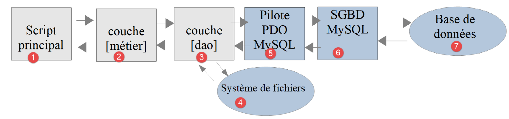
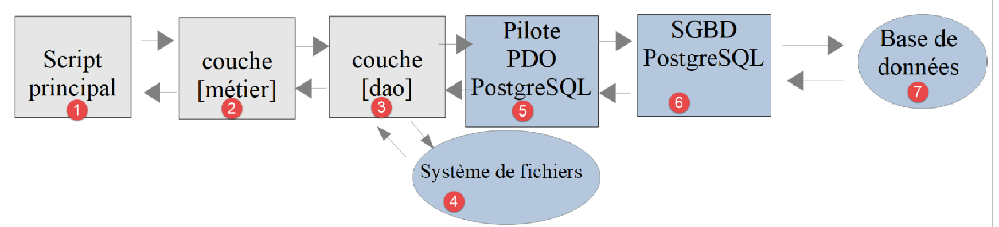
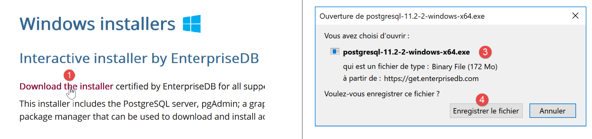
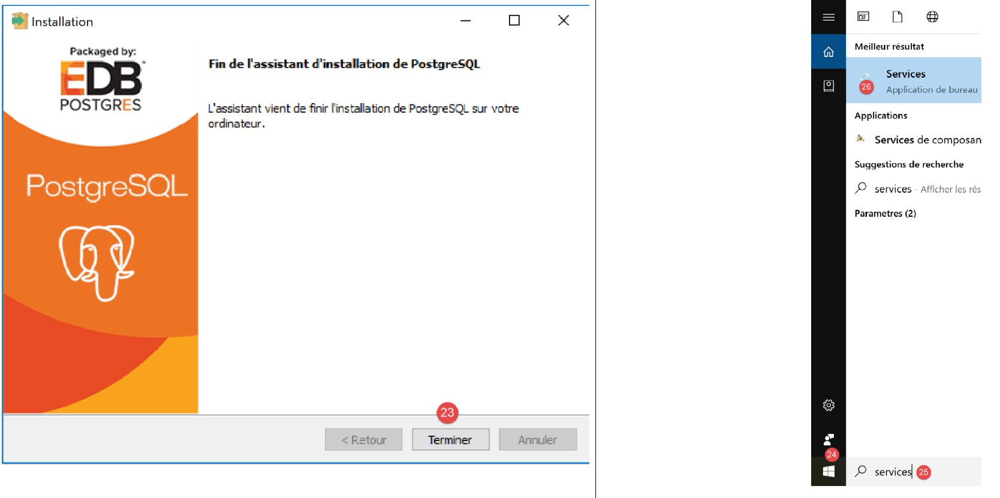
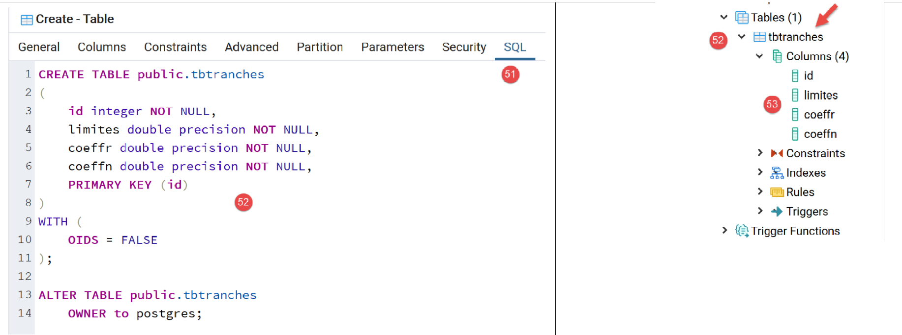
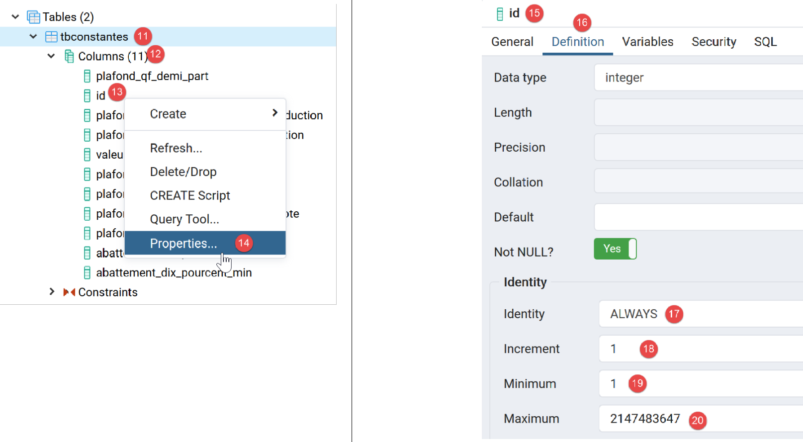
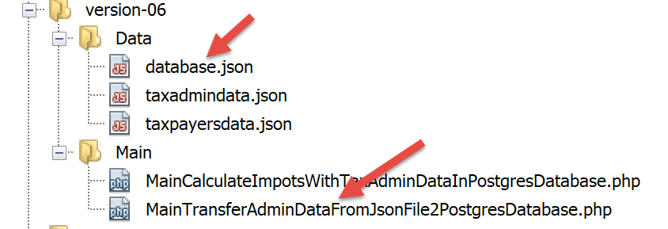
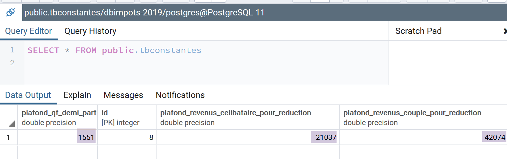

Exercice d’application – version 5
==================================

|image0|

Nous avons déjà écrit plusieurs versions de cet exercice. La dernière
version utilisait une architecture en couches :

|image1|

La couche **[dao]** implémente une interface **[InterfaceDao]**. Nous
avons construit une classe implémentant de cette interface :

-  **[DaoImpotsWithTaxAdminDataInJsonFile]** qui allait chercher les
   données fiscales dans un fichier jSON ;

Nous allons implémenter l’interface **[InterfaceDao]** par une nouvelle
classe **[DaoImpotsWithTaxAdminDataInDatabase]** qui ira chercher les
données de l’administration fiscale dans une base de données MySQL.

Création de la base de données [dbimpots-2019]
----------------------------------------------

En suivant l’exemple du paragraphe `lien <#_Création_d’une_base>`__,
nous construisons une base de données MySQL nommée **[dbimpots-2019]**
dont le propriétaire sera **[admimpots]** avec le mot de passe
**[mdpimpots]** :

|image2|

-  en **[1-4]** ci-dessus, nous voyons la base **[dbimpots-2019]** qui
   pour l’instant n’a pas de tables ;

|image3|

-  

-  en **[1-5]** ci-dessus, nous voyons que l’utilisateur **[admimpots]**
   a tous les droits sur la base **[dbimpots-2019]**. Ce que nous ne
   voyons pas ici c’est que cet utilisateur a le mot de passe
   **[admimpots]** ;

Nous créons maintenant la table **[tbtranches]**\ qui contiendra les
tranches d’imposition :

|image4|

-  en **[1-7]**, nous créons une table nommée **[tbtranches]** ayant 4
   colonnes ;

|image5|

-  en **[3-6]** nous définissons une colonne nommée **[id]** (3), de
   type entier **[int]** (4), qui sera clé primaire **[6]** de la table
   et sera autoincrémentée **[5]** par le SGBD. Cela signifie que MySQL
   va gérer lui-même les valeurs de la clé primaire au moment des
   insertions. Il affectera la valeur 1 à la clé primaire de la 1ière
   insertion, puis 2 à la suivante, etc … ;

-  en **[7]**, l’assistant nous propose d’autres options de
   configuration de la clé primaire. Ici on se contente de valider
   **[7]** les valeurs par défaut ;

|image6|

-  en **[8-16]**, on définit les trois autres colonnes de la table :

   -  **[limites]** (8) de type nombre décimal (9) à 10 chiffres dont 2
      décimales (10) contiendra les éléments de la colonne 17 des
      tranches d’impôts ;

   -  **[coeffR]** (11) de type nombre décimal (12) à 6 chiffres dont 2
      décimales (13) contiendra les éléments de la colonne 18 des
      tranches d’impôts ;

   -  **[coeffN]** (14) de type nombre décimal (15) à 10 chiffres dont 2
      décimales (16) contiendra les éléments de la colonne 19 des
      tranches d’impôts ;

Après avoir validé cette structure, nous obtenons le résultat suivant :

|image7|

-  en **[5]**, l’icône de la clé indique que la colonne **[id]** est clé
   primaire. On voit également que cette clé primaire a des valeurs
   entières (6) et qu’elle est gérée (autoincrémentée) par MySQL ;

De la même façon que nous avons créé la table **[tbtranches]** nous
construisons la table **[tbconstantes]** qui contiendra les constantes
du calcul de l’impôt :

|image8|

Il est possible d’exporter la structure de la base de données dans un
fichier texte sous forme d’une suite d’ordres SQL :

|image9|

L’option **[5]** n’exporte ici que la structure de la base de données et
pas son contenu. Dans notre cas, la base n’a pas encore de contenu.

|image10|

|image11|\ |image12|

L’option **[11]** produit le fichier SQL **[dbimpots-2019.sql]**
suivant :

.. code-block:: php 
   :linenos:

   -- phpMyAdmin SQL Dump
   -- version 4.8.5
   -- https://www.phpmyadmin.net/
   --
   -- Host: localhost:3306
   -- Generation Time: Jun 30, 2019 at 01:10 PM
   -- Server version: 5.7.24
   -- PHP Version: 7.2.11

   SET SQL_MODE = "NO_AUTO_VALUE_ON_ZERO";
   SET AUTOCOMMIT = 0;
   START TRANSACTION;
   SET time_zone = "+00:00";

   /*!40101 SET @OLD_CHARACTER_SET_CLIENT=@@CHARACTER_SET_CLIENT */;
   /*!40101 SET @OLD_CHARACTER_SET_RESULTS=@@CHARACTER_SET_RESULTS */;
   /*!40101 SET @OLD_COLLATION_CONNECTION=@@COLLATION_CONNECTION */;
   /*!40101 SET NAMES utf8mb4 */;

   --
   -- Database: `dbimpots-2019`
   --
   CREATE DATABASE IF NOT EXISTS `dbimpots-2019` DEFAULT CHARACTER SET utf8 COLLATE utf8_general_ci;
   USE `dbimpots-2019`;

   -- --------------------------------------------------------

   --
   -- Table structure for table `tbconstantes`
   --

   DROP TABLE IF EXISTS `tbconstantes`;
   CREATE TABLE `tbconstantes` (
     `id` int(11) NOT NULL,
     `plafondQfDemiPart` decimal(10,2) NOT NULL,
     `plafondRevenusCelibatairePourReduction` decimal(10,2) NOT NULL,
     `plafondRevenusCouplePourReduction` decimal(10,2) NOT NULL,
     `valeurReducDemiPart` decimal(10,2) NOT NULL,
     `plafondDecoteCelibataire` decimal(10,2) NOT NULL,
     `plafondDecoteCouple` decimal(10,2) NOT NULL,
     `plafondImpotCelibatairePourDecote` decimal(10,2) NOT NULL,
     `plafondImpotCouplePourDecote` decimal(10,2) NOT NULL,
     `abattementDixPourcentMax` decimal(10,2) NOT NULL,
     `abattementDixPourcentMin` decimal(10,2) NOT NULL
   ) ENGINE=InnoDB DEFAULT CHARSET=utf8;

   -- --------------------------------------------------------

   --
   -- Table structure for table `tbtranches`
   --

   DROP TABLE IF EXISTS `tbtranches`;
   CREATE TABLE `tbtranches` (
     `id` int(11) NOT NULL,
     `limites` decimal(10,2) NOT NULL,
     `coeffR` decimal(10,2) NOT NULL,
     `coeffN` decimal(10,2) NOT NULL
   ) ENGINE=InnoDB DEFAULT CHARSET=utf8;

   --
   -- Indexes for dumped tables
   --

   --
   -- Indexes for table `tbconstantes`
   --
   ALTER TABLE `tbconstantes`
     ADD PRIMARY KEY (`id`);

   --
   -- Indexes for table `tbtranches`
   --
   ALTER TABLE `tbtranches`
     ADD PRIMARY KEY (`id`);

   --
   -- AUTO_INCREMENT for dumped tables
   --

   --
   -- AUTO_INCREMENT for table `tbconstantes`
   --
   ALTER TABLE `tbconstantes`
     MODIFY `id` int(11) NOT NULL AUTO_INCREMENT;

   --
   -- AUTO_INCREMENT for table `tbtranches`
   --
   ALTER TABLE `tbtranches`
     MODIFY `id` int(11) NOT NULL AUTO_INCREMENT;
   COMMIT;

   /*!40101 SET CHARACTER_SET_CLIENT=@OLD_CHARACTER_SET_CLIENT */;
   /*!40101 SET CHARACTER_SET_RESULTS=@OLD_CHARACTER_SET_RESULTS */;
   /*!40101 SET COLLATION_CONNECTION=@OLD_COLLATION_CONNECTION */;

Vous pouvez utiliser ce fichier SQL pour régénérer la base
**[dbimpots-2019]** si elle a été détruite ou altérée. Il n’y a pas lieu
ici de supprimer la base avant de la régénérer puisque le script SQL
prend soin de le faire lui-même :

|image13|

|image14|

Organisation du code
--------------------

Pour mieux montrer le rôle des différents scripts PHP que nous écrivons,
nous allons organiser notre code en dossiers :

|image15|

-  en **[1]**, vue d’ensemble de la version 05 ;

-  en **[2]**, les entités de l’application, entités échangées entre
   couches ;

-  en **[3]**, les utilitaires de l’application ;

-  en **[4]**, les données utilisées ou produites par l’application.
   Nous prenons ici la décision de n’utiliser que des fichiers jSON pour
   les fichiers texte. Ceux-ci présentent plusieurs avantages :

   -  ils sont reconnus par beaucoup d’outils ;

   -  ces outils ont une coloration syntaxique. Par ailleurs, la
      notation jSON a des règles. Lorsque celles-ci ne sont pas
      respectées les outils les signalent. Par exemple, une erreur
      difficile à détecter dans un fichier texte basique est
      l’utilisation de O majuscule / minuscule à la place de zéros. Si
      cette erreur se produit elle sera signalée. En effet dans le code
      jSON :

..

   "plafondRevenusCouplePourReduction": 42O74

   où on a mis par inadvertance un O majuscule à la place du zéro dans
   **[42074]**, Netbeans signale la faute :

|image16|

   En effet, Netbeans reconnaît le O majuscule qui fait de **[49O74]**
   une chaîne de caractères. Il en conclut que la syntaxe devrait être
   **[4-5]** : la chaîne **[47O74]** devrait être entourée de
   guillemets. L’attention du développeur est donc attirée par la faute
   et peut la corriger : soit mettre les guillemets, soit remplacer le O
   par un zéro ;

Les autres éléments de la version 05 sont les suivants :

|image17|

-  en **[6]**, les interfaces et classes de la couche **[Dao]** ;

-  en **[7]**, les interfaces et classes de la couche **[métier]** ;

-  en **[8]**, les scripts principaux de la version 05 ;

La version 05 a deux objectifs distincts :

-  remplir la base MySQL **[dbimpots-2019]** avec le contenu du fichier
   jSON **[Data/txadmindata.json]** ;

-  implémenter le calcul de l’impôt avec des données fiscales venant
   désormais de la base MySQL **[dbimpots-2019]** ;

Nous allons traiter ces deux objectifs séparément.

Remplissage de base de données [dbimpots-2019]
----------------------------------------------

Objectif
~~~~~~~~

Le fichier texte *taxadmindata.json* contient les données de
l’administration fiscale :

.. code-block:: php 
   :linenos:

   {
       "limites": [
           9964,
           27519,
           73779,
           156244,
           0
       ],
       "coeffR": [
           0,
           0.14,
           0.3,
           0.41,
           0.45
       ],
       "coeffN": [
           0,
           1394.96,
           5798,
           13913.69,
           20163.45
       ],
       "plafondQfDemiPart": 1551,
       "plafondRevenusCelibatairePourReduction": 21037,
       "plafondRevenusCouplePourReduction": 42074,
       "valeurReducDemiPart": 3797,
       "plafondDecoteCelibataire": 1196,
       "plafondDecoteCouple": 1970,
       "plafondImpotCouplePourDecote": 2627,
       "plafondImpotCelibatairePourDecote": 1595,
       "abattementDixPourcentMax": 12502,
       "abattementDixPourcentMin": 437
   }

Notre objectif est de transférer ces données dans la base MySQL
**[dbimpots-2019]** créée précédemment.

Les entités
~~~~~~~~~~~

|image18|

L’entité **[Database]** servira à encapsuler les données du fichier jSON
**[database.json]** suivant :

.. code-block:: php 
   :linenos:

   {
       "dsn": "mysql:host=localhost;dbname=dbimpots-2019",
       "id": "admimpots",
       "pwd": "mdpimpots",
       "tableTranches": "tbtranches",
       "colLimites": "limites",
       "colCoeffR": "coeffr",
       "colCoeffN": "coeffn",
       "tableConstantes": "tbconstantes",
       "colPlafondQfDemiPart": "plafondQfDemiPart",
       "colPlafondRevenusCelibatairePourReduction": "plafondRevenusCelibatairePourReduction",
       "colPlafondRevenusCouplePourReduction": "plafondRevenusCouplePourReduction",
       "colValeurReducDemiPart": "valeurReducDemiPart",
       "colPlafondDecoteCelibataire": "plafondDecoteCelibataire",
       "colPlafondDecoteCouple": "plafondDecoteCouple",
       "colPlafondImpotCelibatairePourDecote": "plafondImpotCelibatairePourDecote",
       "colPlafondImpotCouplePourDecote": "plafondImpotCouplePourDecote",
       "colAbattementDixPourcentMax": "abattementDixPourcentMax",
       "colAbattementDixPourcentMin": "abattementDixPourcentMin"
   }

L’entité **[TaxAdminData]** servira à encapsuler les données du fichier
jSON **[taxadmindata.json]** suivant :

.. code-block:: php 
   :linenos:

   {
   	"limites": [
   		9964,
   		27519,
   		73779,
   		156244,
   		0
   	],
   	"coeffR": [
   		0,
   		0.14,
   		0.3,
   		0.41,
   		0.45
   	],
   	"coeffN": [
   		0,
   		1394.96,
   		5798,
   		13913.69,
   		20163.45
   	],
   	"plafondQfDemiPart": 1551,
   	"plafondRevenusCelibatairePourReduction": 21037,
   	"plafondRevenusCouplePourReduction": 42074,
   	"valeurReducDemiPart": 3797,
   	"plafondDecoteCelibataire": 1196,
   	"plafondDecoteCouple": 1970,
   	"plafondImpotCouplePourDecote": 2627,
   	"plafondImpotCelibatairePourDecote": 1595,
   	"abattementDixPourcentMax": 12502,
   	"abattementDixPourcentMin": 437
   }

L’entité **[TaxPayerData]** servira à encapsuler les données du fichier
jSON **[taxpayerdata.json]** suivant :

.. code-block:: php 
   :linenos:

   [
       {
           "marié": "oui",
           "enfants": 2,
           "salaire": 55555
       },
       {
           "marié": "ouix",
           "enfants": "2x",
           "salaire": "55555x"
       },
       {
           "marié": "oui",
           "enfants": "2",
           "salaire": 50000
       },
       {
           "marié": "oui",
           "enfants": 3,
           "salaire": 50000
       },
       {
           "marié": "non",
           "enfants": 2,
           "salaire": 100000
       },
       {
           "marié": "non",
           "enfants": 3,
           "salaire": 100000
       },
       {
           "marié": "oui",
           "enfants": 3,
           "salaire": 100000
       },
       {
           "marié": "oui",
           "enfants": 5,
           "salaire": 100000
       },
       {
           "marié": "non",
           "enfants": 0,
           "salaire": 100000
       },
       {
           "marié": "oui",
           "enfants": 2,
           "salaire": 30000
       },
       {
           "marié": "non",
           "enfants": 0,
           "salaire": 200000
       },
       {
           "marié": "oui",
           "enfants": 3,
           "salaire": 20000
       }
   ]

La classe de base [BaseEntity]
^^^^^^^^^^^^^^^^^^^^^^^^^^^^^^

Pour simplifier le code des entités, nous adopterons la règle suivante :
**les attributs d’une entité ont les mêmes noms que les attributs du
fichier jSON que l’entité doit encapsuler**. Moyennant cette règle, les
entités **[Database, TaxAdminData, TaxPayerData]** ont des points
communs qui peuvent être factorisés dans une classe parent. Ce sera la
classe **[BaseEntity]** suivante :

.. code-block:: php 
   :linenos:

   <?php

   namespace Application;

   class BaseEntity {
     // attribut
     protected $arrayOfAttributes;

     // initialisation à partir d'un fichier jSON
     public function setFromJsonFile(string $jsonFilename) {
       // on récupère le contenu du fichier des données fiscales
       $fileContents = \file_get_contents($jsonFilename);
       $erreur = FALSE;
       // erreur ?
       if (!$fileContents) {
         // on note l'erreur
         $erreur = TRUE;
         $message = "Le fichier des données [$jsonFilename] n'existe pas";
       }
       if (!$erreur) {
         // on récupère le code jSON du fichier de configuration dans un tableau associatif
         $this->arrayOfAttributes = \json_decode($fileContents, true);
         // erreur ?
         if ($this->arrayOfAttributes === FALSE) {
           // on note l'erreur
           $erreur = TRUE;
           $message = "Le fichier de données jSON [$jsonFilename] n'a pu être exploité correctement";
         }
       }
       // erreur ?
       if ($erreur) {
         // on lance une exception
         throw new ExceptionImpots($message);
       }
       // initialisation des attributs de la classe
       foreach ($this->arrayOfAttributes as $key => $value) {
         $this->$key = $value;
       }
       // on rend l'objet
       return $this;
     }

     public function checkForAllAttributes() {
       // on vérifie que toutes les clés ont été initialisées
       foreach (\array_keys($this->arrayOfAttributes) as $key) {
         if ($key !== "arrayOfAttributes" && !isset($this->$key)) {
           throw new ExceptionImpots("L'attribut [$key] de la classe "
             . get_class($this) . " n'a pas été initialisé");
         }
       }
     }

     public function setFromArrayOfAttributes(array $arrayOfAttributes) {
       // on initialise certains attributs de la classe
       foreach ($arrayOfAttributes as $key => $value) {
         $this->$key = $value;
       }
       // on retourne l'objet
       return $this;
     }

     // toString
     public function __toString() {
       // attributs de l'objet
       $arrayOfAttributes = \get_object_vars($this);
       // on enlève l'attribut de la classe parent
       unset($arrayOfAttributes["arrayOfAttributes"]);
       // chaîne Json de l'objet
       return \json_encode($arrayOfAttributes, JSON_UNESCAPED_UNICODE);
     }

     // getter
     public function getArrayOfAttributes() {
       return $this->arrayOfAttributes;
     }

   }

**Commentaires**

-  ligne 5 : la classe **[BaseEntity]** est destinée à être étendue par
   les classes **[Database, TaxAdminData, TaxPayerData]** ;

-  ligne 7 : l’attribut **[$arrayOfAttributes]** est un tableau
   contenant tous les attributs de la classe fille ayant étendu
   **[BaseEntity]** ainsi que leurs valeurs ;

-  lignes 9-41 : l’attribut **[$arrayOfAttributes]** est initialisé à
   partir du fichier jSON **[$jsonFilename]** passé en paramètre. Une
   exception de type **[ExceptionImpot]** est lancée si le fichier jSON
   n’a pu être lu ou si ce n’est pas un fichier jSON valide ;

-  lignes 36-38 : on a là un code spécial s’il est exécuté par une
   classe fille. Dans ce cas, **[$this]** représente une instance de la
   classe fille **[Database, TaxAdminData, TaxPayerData]** et dans ce
   cas là, **les lignes 36-38 initialisent les attributs de cette classe
   fille,** à condition que ces attributs aient la visibilité
   **protected** (ou public) (cf paragraphe
   `lien <#_Visibilité_entre_classe>`__). On a dit en effet que les
   attributs des entités **[Database, TaxAdminData, TaxPayerData]**
   étaient les mêmes que les attributs du fichier jSON qu’ils
   encapsulaient. Finalement, la méthode **[setFromJsonFile]** permet à
   une classe fille de s’initialiser à partir d’un fichier jSON ;

-  ligne 40 : on rend l’objet **[$this]** donc une instance de classe
   fille si la méthode **[setFromJsonFile]** a été appelée par une
   classe fille ;

-  lignes 43-51 : la méthode **[checkForAllAttributes]** permet à une
   classe fille de vérifier que tous ses attributs ont été initialisés.
   Si ce n’est pas le cas, une exception **[ExceptionImpots]** est
   lancée. Cette méthode permet à la classe fille de vérifier que son
   fichier jSON n’a pas oublié certains attributs ;

-  lignes 53-60 : la méthode **[setFromArrayOfAttributes]** permet à une
   classe fille d’initialiser tout ou partie de ses attributs à partir
   d’un tableau associatif dont les clés ont les mêmes noms que les
   attributs de la classe fille à initialiser ;

-  lignes 63-70 : la méthode **[__toString]** permet d’avoir la
   représentation jSON d’une classe fille ;

   1. .. rubric:: L’entité [Database]
         :name: lentité-database

L’entité **[Database]** est la suivante :

.. code-block:: php 
   :linenos:

   <?php

   namespace Application;

   class Database extends BaseEntity {
     // attributs
     protected $dsn;
     protected $id;
     protected $pwd;
     protected $tableTranches;
     protected $colLimites;
     protected $colCoeffR;
     protected $colCoeffN;
     protected $tableConstantes;
     protected $colPlafondQfDemiPart;
     protected $colPlafondRevenusCelibatairePourReduction;
     protected $colPlafondRevenusCouplePourReduction;
     protected $colValeurReducDemiPart;
     protected $colPlafondDecoteCelibataire;
     protected $colPlafondDecoteCouple;
     protected $colPlafondImpotCelibatairePourDecote;
     protected $colPlafondImpotCouplePourDecote;
     protected $colAbattementDixPourcentMax;
     protected $colAbattementDixPourcentMin;

    …

   }

La classe **[Database]** est utilisée pour encapsuler les données du
fichier jSON **[database.json]** suivant :

.. code-block:: php 
   :linenos:

   {
       "dsn": "mysql:host=localhost;dbname=dbimpots-2019",
       "id": "admimpots",
       "pwd": "mdpimpots",
       "tableTranches": "tbtranches",
       "colLimites": "limites",
       "colCoeffR": "coeffr",
       "colCoeffN": "coeffn",
       "tableConstantes": "tbconstantes",
       "colPlafondQfDemiPart": "plafondQfDemiPart",
       "colPlafondRevenusCelibatairePourReduction": "plafondRevenusCelibatairePourReduction",
       "colPlafondRevenusCouplePourReduction": "plafondRevenusCouplePourReduction",
       "colValeurReducDemiPart": "valeurReducDemiPart",
       "colPlafondDecoteCelibataire": "plafondDecoteCelibataire",
       "colPlafondDecoteCouple": "plafondDecoteCouple",
       "colPlafondImpotCelibatairePourDecote": "plafondImpotCelibatairePourDecote",
       "colPlafondImpotCouplePourDecote": "plafondImpotCouplePourDecote",
       "colAbattementDixPourcentMax": "abattementDixPourcentMax",
       "colAbattementDixPourcentMin": "abattementDixPourcentMin"
   }

La classe et le fichier jSON ont les mêmes attributs. Ceux-ci décrivent
les caractéristiques de la base de données MySQL **[dbimpots-2019]** :

+----------------------------------+----------------------------------+
| dsn                              | Nom DSN de la base               |
+==================================+==================================+
| id                               | Propriétaire de la base          |
+----------------------------------+----------------------------------+
| pwd                              | Son mot de passe                 |
+----------------------------------+----------------------------------+
| tableTranches                    | Nom de la table contenant les    |
|                                  | tranches d’imposition            |
+----------------------------------+----------------------------------+
| colLimites                       | Noms des colonnes de la table    |
|                                  | **[tableTranches]**              |
| colCoeffR                        |                                  |
|                                  |                                  |
| colCoeffN                        |                                  |
+----------------------------------+----------------------------------+
| tableConstantes                  | Nom de la table contenant les    |
|                                  | constantes de calcul de l’impôt  |
+----------------------------------+----------------------------------+
| colPlafondQfDemiPart             | Noms des colonnes de la table    |
|                                  | **[tableConstantes]** contenant  |
| colPlafon                        | les constantes de calcul de      |
| dRevenusCelibatairePourReduction | l’impôt                          |
|                                  |                                  |
| colP                             |                                  |
| lafondRevenusCouplePourReduction |                                  |
|                                  |                                  |
| colValeurReducDemiPart           |                                  |
|                                  |                                  |
| colPlafondDecoteCelibataire      |                                  |
|                                  |                                  |
| colPlafondDecoteCouple           |                                  |
|                                  |                                  |
| colP                             |                                  |
| lafondImpotCelibatairePourDecote |                                  |
|                                  |                                  |
| colPlafondImpotCouplePourDecote  |                                  |
|                                  |                                  |
| colAbattementDixPourcentMax      |                                  |
|                                  |                                  |
| colAbattementDixPourcentMin      |                                  |
+----------------------------------+----------------------------------+

Pourquoi nommer les tables et les colonnes alors qu’on connaît déjà
leurs noms et que ce n’est pas quelque chose amené à changer ? Après le
SGBD MySQL, on va utiliser le SGBD PostgreSQL pour stocker les données
de l’administration fiscale. Or les noms des colonnes et tables Postgres
ne suivent pas les mêmes règles que MySQL. On va être obligés d’utiliser
d’autres noms. C’est également vrai pour d’autres SGBD. Si on veut avoir
du code portable entre SGBD, il est alors préférable d’utiliser des
paramètres plutôt que les noms en dur des tables et colonnes.

Revenons au code de la classe **[Database]** :

.. code-block:: php 
   :linenos:

   <?php

   namespace Application;

   class Database extends BaseEntity {
     // attributs
     protected $dsn;
     protected $id;
     protected $pwd;
     protected $tableTranches;
     protected $colLimites;
     protected $colCoeffR;
     protected $colCoeffN;
     protected $tableConstantes;
     protected $colPlafondQfDemiPart;
     protected $colPlafondRevenusCelibatairePourReduction;
     protected $colPlafondRevenusCouplePourReduction;
     protected $colValeurReducDemiPart;
     protected $colPlafondDecoteCelibataire;
     protected $colPlafondDecoteCouple;
     protected $colPlafondImpotCelibatairePourDecote;
     protected $colPlafondImpotCouplePourDecote;
     protected $colAbattementDixPourcentMax;
     protected $colAbattementDixPourcentMin;

     // setter
     // initialisation
     public function setFromJsonFile(string $jsonFilename) {
       // parent
       parent::setFromJsonFile($jsonFilename);
       // on vérifie que tous les attributs ont été initialisés
       parent::checkForAllAttributes();
       // on retourne l'objet
       return $this;
     }

     // getters et setters
     public function getDsn() {
       return $this->dsn;
     }

     …

     public function setDsn($dsn) {
       $this->dsn = $dsn;
       return $this;
     }

     …

   }

**Commentaires**

-  lignes 7-24 : tous les attributs de la classe ont la visibilité
   **[protected]**. C’est la condition pour qu’ils puissent être
   modifiés depuis la classe parent **[BaseEntity]** (cf paragraphe
   `lien <#_Visibilité_entre_classe>`__) ;

-  lignes 28-35 : la méthode **[setFromJsonFile]** permet d’initialiser
   les attributs de la classe **[Database]** à partir du contenu d’un
   fichier jSON passé en paramètre. Il faut que les attributs du fichier
   jSON et ceux de la classe **[Database]** soient identiques. Si le
   fichier jSON n’est pas exploitable, une exception est lancée ;

-  ligne 30 : c’est la classe parent qui fait l’initialisation ;

-  ligne 32 : on demande à la classe parent de vérifier que tous les
   attributs de la classe **[Database]** ont été initialisés. Si ce
   n’est pas le cas, une exception est lancée ;

-  ligne 34 : on rend l’instance **[Database]** qui vient d’être
   initialisée ;

-  lignes 37 et au-delà : les getters et setters des attributs de la
   classe ;

   1. .. rubric:: L’entité [TaxAdminData]
         :name: lentité-taxadmindata

L’entité **[TaxAdminData]** est la suivante :

.. code-block:: php 
   :linenos:

   <?php

   namespace Application;

   class TaxAdminData extends BaseEntity {
     // tranches d'impôt
     protected $limites;
     protected $coeffR;
     protected $coeffN;
     // constantes de calcul de l'impôt
     protected $plafondQfDemiPart;
     protected $plafondRevenusCelibatairePourReduction;
     protected $plafondRevenusCouplePourReduction;
     protected $valeurReducDemiPart;
     protected $plafondDecoteCelibataire;
     protected $plafondDecoteCouple;
     protected $plafondImpotCouplePourDecote;
     protected $plafondImpotCelibatairePourDecote;
     protected $abattementDixPourcentMax;
     protected $abattementDixPourcentMin;

     …
   }

La classe **[TaxAdminData]** est utilisée pour encapsuler les données du
fichier jSON **[taxadmindata.json]** suivant :

.. code-block:: php 
   :linenos:

   {
       "limites": [
           9964,
           27519,
           73779,
           156244,
           0
       ],
       "coeffR": [
           0,
           0.14,
           0.3,
           0.41,
           0.45
       ],
       "coeffN": [
           0,
           1394.96,
           5798,
           13913.69,
           20163.45
       ],
       "plafondQfDemiPart": 1551,
       "plafondRevenusCelibatairePourReduction": 21037,
       "plafondRevenusCouplePourReduction": 42074,
       "valeurReducDemiPart": 3797,
       "plafondDecoteCelibataire": 1196,
       "plafondDecoteCouple": 1970,
       "plafondImpotCouplePourDecote": 2627,
       "plafondImpotCelibatairePourDecote": 1595,
       "abattementDixPourcentMax": 12502,
       "abattementDixPourcentMin": 437
   }

La classe et le fichier jSON ont les mêmes attributs. Ceux-ci
représentent les données de l’administration fiscale. Le reste du code
de la classe **[TaxAdminData]** est le suivant :

.. code-block:: php 
   :linenos:

   <?php

   namespace Application;

   class TaxAdminData extends BaseEntity {
     // tranches d'impôt
     protected $limites;
     protected $coeffR;
     protected $coeffN;
     // constantes de calcul de l'impôt
     protected $plafondQfDemiPart;
     protected $plafondRevenusCelibatairePourReduction;
     protected $plafondRevenusCouplePourReduction;
     protected $valeurReducDemiPart;
     protected $plafondDecoteCelibataire;
     protected $plafondDecoteCouple;
     protected $plafondImpotCouplePourDecote;
     protected $plafondImpotCelibatairePourDecote;
     protected $abattementDixPourcentMax;
     protected $abattementDixPourcentMin;

     // initialisation
     public function setFromJsonFile(string $taxAdminDataFilename) {
       // parent
       parent::setFromJsonFile($taxAdminDataFilename);
       // on vérifie que tous les attributs ont été initialisés
       parent::checkForAllAttributes();
       // on vérifie que les valeurs des attributs sont des réels >=0
       foreach ($this as $key => $value) {
         if ($key !== "arrayOfAttributes") {
           // $value doit être un nbre réel >=0 ou un tableau de réels >=0
           $result = $this->check($value);
           // erreur ?
           if ($result->erreur) {
             // on lance une exception
             throw new ExceptionImpots("La valeur de l'attribut [$key] est invalide");
           } else {
             // on note la valeur
             $this->$key = $result->value;
           }
         }
       }
       // on rend l'objet
       return $this;
     }

     protected function check($value): \stdClass {
       // $value est un tableau d'éléments de type string ou un unique élément
       if (!\is_array($value)) {
         $tableau = [$value];
       } else {
         $tableau = $value;
       }
       // on transforme le tableau de strings en tableau de réels
       $newTableau = [];
       $result = new \stdClass();
       // les éléments du tableau doivent être des nombres décimaux positifs ou nuls
       $modèle = '/^\s*([+]?)\s*(\d+\.\d*|\.\d+|\d+)\s*$/';
       for ($i = 0; $i < count($tableau); $i ++) {
         if (preg_match($modèle, $tableau[$i])) {
           // on met le float dans newTableau
           $newTableau[] = (float) $tableau[$i];
         } else {
           // on note l'erreur
           $result->erreur = TRUE;
           // on quitte
           return $result;
         }
       }
       // on rend le résultat
       $result->erreur = FALSE;
       if (!\is_array($value)) {
         // une seule valeur
         $result->value = $newTableau[0];
       } else {
         // une liste de valeurs
         $result->value = $newTableau;
       }
       return $result;
     }

     // getters et setters
    …
   }

**Commentaires**

-  ligne 23 : la méthode **[setFromJsonFile]** sert à initialiser les
   attributs de la classe **[TaxAdminData]** à partir d’un fichier jSON
   passé en paramètre. Il faut que les attributs du fichier jSON
   existent sous le même nom dans la classe ;

-  ligne 25 : c’est la classe parent qui fait ce travail ;

-  ligne 27 : on demande à la classe parent de vérifier que tous les
   attributs de la classe fille ont été initialisés ;

-  lignes 29-42 : on vérifie localement que tous les attributs ont eu
   une valeur réelle positive ou nulle. Cette vérification a déjà été
   discutée au paragraphe `lien <#_La_classe_[TaxAdminData]>`__ de la
   version 03 ;

   1. .. rubric:: La couche [dao]
         :name: la-couche-dao

Maintenant nous pouvons écrire le code qui va transférer les données du
fichier texte **[taxadmindata.json]** dans les tables **[tbtranches,
tbconstantes]** de la base MySQL **[dbimpots-2019]**. Nous adopterons
l’architecture suivante :

|image19|

|image20|

La couche **[dao]** implémentera l’interface
**[InterfaceDao4TransferAdminDataFromFile2Database]** suivante :

.. code-block:: php 
   :linenos:

   <?php

   // espace de noms
   namespace Application;

   interface InterfaceDao4TransferAdminData2Database {

     public function transferAdminData2Database(): void;
   }

**Commentaires**

-  ligne 8 : la méthode **[transferAdminData2Database]** a pour rôle de
   stocker les données de l’administration fiscale dans une base de
   données ;

L’interface **[InterfaceDao4TransferAdminData2Database]** sera
implémentée par la classe
**[DaoTransferAdminDataFromJsonFile2Database]** suivante :

.. code-block:: php 
   :linenos:

   <?php

   // espace de noms
   namespace Application;

   // définition d'une classe TransferAdminDataFromFile2DatabaseDao
   class DaoTransferAdminDataFromJsonFile2Database implements InterfaceDao4TransferAdminData2Database {
     // attributs de la base de données cible
     private $database;
     // données de l'administration fiscale
     private $taxAdminData;

     // constructeur
     public function __construct(string $databaseFilename, string $taxAdminDataFilename) {
       // on mémorise la configuration de la bd
       $this->database = (new Database())->setFromJsonFile($databaseFilename);
       // on mémorise les données fiscales
       $this->taxAdminData = (new TaxAdminData())->setFromJsonFile($taxAdminDataFilename);
     }

     // transfère les données des tranches d'impôts d'un fichier texte
     // vers la base de données
     public function transferAdminData2Database(): void {
       // on travaille sur la base
       $database = $this->database;
       try {
         // on ouvre la connexion à la base de données
         $connexion = new \PDO($database->getDsn(), $database->getId(), $database->getPwd());
         // on veut qu'à chaque erreur de SGBD, une exception soit lancée
         $connexion->setAttribute(\PDO::ATTR_ERRMODE, \PDO::ERRMODE_EXCEPTION);
         // on démarre une transaction
         $connexion->beginTransaction();
         // on remplit la table des tranches d'impôt
         $this->fillTableTranches($connexion);
         // on remplit la table des constantes
         $this->fillTableConstantes($connexion);
         // on termine la transaction sur un succès
         $connexion->commit();
       } catch (\PDOException $ex) {
         // y-a-t-il une transaction en cours ?
         if (isset($connexion) && $connexion->inTransaction()) {
           // on termine la transaction sur un échec
           $connexion->rollBack();
         }
         // on remonte l'exception au code appelant
         throw new ExceptionImpots($ex->getMessage());
       } finally {
         // on ferme la connexion
         $connexion = NULL;
       }
     }

     // remplissage de la table des tranches d'impôt
     private function fillTableTranches($connexion): void {
       …
     }

     // remplissage de la table des constantes
     private function fillTableConstantes($connexion): void {
       …
     }

   }

**Commentaires**

Nous utilisons ici ce que nous avons appris dans le chapitre sur MySQL.

-  ligne 7 : la classe **[DaoTransferAdminDataFromJsonFile2Database]**
   implémente l’interface
   **[InterfaceDao4TransferAdminData2Database]** ;

-  ligne 9 : l’attribut **[$database]** est l’objet de type
   **[Database]** encapsulant les données du fichier
   **[database.json]** ;

-  ligne 11 : l’attribut **[$taxAdminData]** est l’objet de type
   **[TaxAdminData]** encapsulant les données du fichier
   **[taxadmindata.json]** ;

-  lignes 14-19 : le constructeur reçoit en paramètres les noms des
   fichiers **[database.json, taxadmindata.json]** ;

-  ligne 16 : initialisation de l’attribut **[$database]** ;

-  ligne 18 : initialisation de l’attribut **[$taxAdminData]** ;

-  ligne 23 : on implémente l’unique méthode de l’interface
   **[InterfaceDao4TransferAdminData2Database]** ;

-  lignes 26-38 : on remplit les tables **[tbtranches, tbconstantes]**
   en deux temps :

   -  ligne 34 : on remplit d’abord la table **[tbtranches]**. Cela se
      fait au sein d’une transaction (lignes 32, 38). La méthode
      **[fillTableTranches]** (ligne 55) lance une exception dès que
      quelque chose se passe mal. Dans ce cas, l’exécution se poursuit
      avec le catch / finally des lignes 39-50 ;

   -  ligne 36 : on remplit la table **[tbconstantes]** de la même façon
      à l’aide de la méthode **[fillTableConstantes]** (ligne 60) ;

-  lignes 39-47 : cas où une exception a été lancée par le code ;

-  lignes 41-44 : si une transaction existe, elle est annulée ;

-  ligne 46 : on lance une exception de type **[ExceptionImpots]** avec
   le message de l’exception originelle qui est, elle, d’un type
   quelconque ;

-  lignes 47-50 : dans la clause **[finally]**, la connexion est
   fermée ;

Le code de la méthode **[fillTableTranches]** est le suivant :

.. code-block:: php 
   :linenos:

   private function fillTableTranches($connexion): void {
       // raccourci pour la bd
       $database = $this->database;
       // les données à insérer dans la base de données
       $limites = $this->taxAdminData->getLimites();
       $coeffR = $this->taxAdminData->getCoeffR();
       $coeffN = $this->taxAdminData->getCoeffN();
       // on vide la table au cas où il y aurait qq chose dedans
       $statement = $connexion->prepare("delete from " . $database->getTableTranches());
       $statement->execute();
       // on prépare les insertions
       $sqlInsert = "insert into {$database->getTableTranches()} "
         . "({$database->getColLimites()}, {$database->getColCoeffR()},"
         . " {$database->getColCoeffN()}) values (:limites, :coeffR, :coeffN)";
       $statement = $connexion->prepare($sqlInsert);
       // on exécute l'ordre préparé avec les valeurs des tranches d'impôts
       for ($i = 0; $i < count($limites); $i++) {
         $statement->execute([
           "limites" => $limites[$i],
           "coeffR" => $coeffR[$i],
           "coeffN" => $coeffN[$i]]);
       }
     }

**Commentaires**

-  ligne 1 : la méthode **[fillTableTranches]** reçoit en paramètre une
   connexion ouverte. On sait de plus qu’une transaction a démarré au
   sein de cette connexion ;

-  lignes 5-7 : les valeurs à insérer dans la table sont fournies par
   l’attribut **[$taxAdminData]** ;

-  lignes 9-10 : on supprime le contenu actuel de la table
   **[tbtranches]** ;

-  lignes 12-15 : on prépare l’insertion de lignes dans la table. On
   utilise ici les noms des colonnes fournis par l’attribut
   **[$database]** ;

-  lignes 17-22 : on exécute autant de fois que nécessaire,
   l’instruction d’insertion préparée aux lignes 12-15 ;

Le code de la méthode **[fillTableConstantes]** est le suivant :

.. code-block:: php 
   :linenos:

   private function fillTableConstantes($connexion): void {
       // raccourci
       $database = $this->database;
       // on vide la table au cas où il y aurait qq chose dedans
       $statement = $connexion->prepare("delete from {$database->getTableConstantes()}");
       $statement->execute();
       // on prépare l'insertion
       $taxAdminData = $this->taxAdminData;
       $sqlInsert = "insert into {$database->getTableConstantes()}"
         . " ({$database->getColPlafondQfDemiPart()},"
         . " {$database->getColPlafondRevenusCelibatairePourReduction()},"
         . " {$database->getColPlafondRevenusCouplePourReduction()},"
         . " {$database->getColValeurReducDemiPart()},"
         . " {$database->getColPlafondDecoteCelibataire()},"
         . " {$database->getColPlafondDecoteCouple()},"
         . " {$database->getColPlafondImpotCelibatairePourDecote()},"
         . " {$database->getColPlafondImpotCouplePourDecote()},"
         . " {$database->getColAbattementDixPourcentMax()},"
         . " {$database->getColAbattementDixPourcentMin()})"
         . " values ("
         . ":plafondQfDemiPart,"
         . ":plafondRevenusCelibatairePourReduction,"
         . ":plafondRevenusCouplePourReduction,"
         . ":valeurReducDemiPart,"
         . ":plafondDecoteCelibataire,"
         . ":plafondDecoteCouple,"
         . ":plafondImpotCelibatairePourDecote,"
         . ":plafondImpotCouplePourDecote,"
         . ":abattementDixPourcentMax,"
         . ":abattementDixPourcentMin)";
       $statement = $connexion->prepare($sqlInsert);
       // on exécute l'ordre préparé
       $statement->execute([
         "plafondQfDemiPart" => $taxAdminData->getPlafondQfDemiPart(),
         "plafondRevenusCelibatairePourReduction" => $taxAdminData->getPlafondRevenusCelibatairePourReduction(),
         "plafondRevenusCouplePourReduction" => $taxAdminData->getPlafondRevenusCouplePourReduction(),
         "valeurReducDemiPart" => $taxAdminData->getValeurReducDemiPart(),
         "plafondDecoteCelibataire" => $taxAdminData->getPlafondDecoteCelibataire(),
         "plafondDecoteCouple" => $taxAdminData->getPlafondDecoteCouple(),
         "plafondImpotCelibatairePourDecote" => $taxAdminData->getPlafondImpotCelibatairePourDecote(),
         "plafondImpotCouplePourDecote" => $taxAdminData->getPlafondImpotCouplePourDecote(),
         "abattementDixPourcentMax" => $taxAdminData->getAbattementDixPourcentMax(),
         "abattementDixPourcentMin" => $taxAdminData->getAbattementDixPourcentMin()
       ]);
     }

**Commentaires**

-  ligne 1 : la méthode **[fillTableConstantes]** reçoit en paramètre
   une connexion ouverte. On sait de plus qu’une transaction a démarré
   au sein de cette connexion ;

-  lignes 5-6 : la table **[tbconstantes]** est vidée ;

-  lignes 9-31 : préparation de l’ordre SQL d’insertion. Il est complexe
   du fait qu’il y a 10 colonnes à initialiser dans cette opération
   d’insertion et qu’il faut aller chercher les noms des colonnes dans
   l’attribut **[$database]** ;

-  ligne 33-44 : exécution de l’ordre d’insertion. Il n’y a qu’une ligne
   à insérer. Là encore, le code est rendu complexe du fait qu’il faille
   chercher les valeurs à insérer dans l’attribut **[$taxAdminData]** ;

   1. .. rubric:: Le script principal
         :name: le-script-principal

|image21|

|image22|

Le script principal s’appuie sur la couche **[dao]** pour opérer le
transfert de données :

.. code-block:: php 
   :linenos:

   <?php

   // respect strict des types déclarés des paramètres de foctions
   declare (strict_types=1);

   // espace de noms
   namespace Application;

   // gestion des erreurs par PHP
   // ini_set("display_errors", "0");
   // inclusion interface et classes
   require_once __DIR__ . "/../Entities/BaseEntity.php";
   require_once __DIR__ . "/../Entities/TaxAdminData.php";
   require_once __DIR__ . "/../Entities/TaxPayerData.php";
   require_once __DIR__ . "/../Entities/Database.php";
   require_once __DIR__ . "/../Entities/ExceptionImpots.php";
   require_once __DIR__ . "/../Utilities/Utilitaires.php";
   require_once __DIR__ . "/../Dao/InterfaceDao.php";
   require_once __DIR__ . "/../Dao/TraitDao.php";
   require_once __DIR__ . "/../Dao/InterfaceDao4TransferAdminData2Database.php";
   require_once __DIR__ . "/../Dao/DaoTransferAdminDataFromJsonFile2Database.php";
   //
   // définition des constantes
   const DATABASE_CONFIG_FILENAME = "../Data/database.json";
   const TAXADMINDATA_FILENAME = "../Data/taxadmindata.json";

   //
   try {
     // création de la couche [dao]
     $dao = new DaoTransferAdminDataFromJsonFile2Database(DATABASE_CONFIG_FILENAME, TAXADMINDATA_FILENAME);
     // transfert des données dans la base
     $dao->transferAdminData2Database();
   } catch (ExceptionImpots $ex) {
     // on affiche l'erreur
     print "L'erreur suivante s'est produite : " . utf8_encode($ex->getMessage()) . "\n";
   }
   // fin
   print "Terminé\n";
   exit;

**Commentaires**

-  lignes 12-21 : chargement des classes et interfaces de
   l’application ;

-  lignes 24-24 : les deux fichiers jSON ;

-  ligne 30 : on instancie la couche **[dao]** en passant au
   constructeur les deux fichiers jSON ;

-  ligne 32 : on opère le transfert de données ;

Lorsque nous exécutons ce code, nous obtenons le résultat suivant dans
la base de données :

|image23|

Colonne **[3]**, on voit les valeurs attribuées par MySQL à la clé
primaire **[id]**. La numérotation démarre à 1. La copie d’écran
ci-dessus a été obtenue après plusieurs exécutions du script.

|image24|\ |image25|

Calcul de l’impôt
-----------------

|image26|

Architecture
~~~~~~~~~~~~

La version 04 de l’application de calcul d’impôt utilisait une
architecture en couches :

|image27|

La couche **[dao]** implémente une interface **[InterfaceDao]**. Nous
avons construit une classe implémentant cette interface :

-  **[DaoImpotsWithTaxAdminDataInJsonFile]** qui allait chercher les
   données fiscales dans un fichier jSON. C’était la version 04 ;

Nous allons implémenter l’interface **[InterfaceDao]** par une nouvelle
classe **[DaoImpotsWithTaxAdminDataInDatabase]** qui ira chercher les
données de l’administration fiscale dans une base de données MySQL. La
couche **[dao]**, comme précédemment, écrira les résultats et les
erreurs dans des fichiers texte et trouvera les données des
contribuables également dans un fichier texte. Seulement cette fois-ci,
ces fichiers texte seront des fichiers jSON. Par ailleurs, nous savons
que si nous continuons à respecter l’interface **[InterfaceDao]**, la
couche **[métier]** n’aura pas à être modifiée.

|image28|

L’entité [TaxPayerData]
~~~~~~~~~~~~~~~~~~~~~~~

|image29|

La classe **[TaxPayerData]** sert à encapsuler dans une classe les
données du fichier jSON **[taxpayersdata.json]** suivant :

.. code-block:: php 
   :linenos:

   [
       {
           "marié": "oui",
           "enfants": 2,
           "salaire": 55555
       },
       {
           "marié": "ouix",
           "enfants": "2x",
           "salaire": "55555x"
       },
       {
           "marié": "oui",
           "enfants": "2",
           "salaire": 50000
       },
       {
           "marié": "oui",
           "enfants": 3,
           "salaire": 50000
       },
       {
           "marié": "non",
           "enfants": 2,
           "salaire": 100000
       },
       {
           "marié": "non",
           "enfants": 3,
           "salaire": 100000
       },
       {
           "marié": "oui",
           "enfants": 3,
           "salaire": 100000
       },
       {
           "marié": "oui",
           "enfants": 5,
           "salaire": 100000
       },
       {
           "marié": "non",
           "enfants": 0,
           "salaire": 100000
       },
       {
           "marié": "oui",
           "enfants": 2,
           "salaire": 30000
       },
       {
           "marié": "non",
           "enfants": 0,
           "salaire": 200000
       },
       {
           "marié": "oui",
           "enfants": 3,
           "salaire": 20000
       }
   ]

La classe **[TaxPayerData]** est la suivante :

.. code-block:: php 
   :linenos:

   <?php

   // espace de noms
   namespace Application;

   // la classe des données
   class TaxPayerData extends BaseEntity {
     // données nécessaires au calcul de l'impôt du contribuable
     protected $marié;
     protected $enfants;
     protected $salaire;
     // résultats du calcul de l'impôt
     protected $impôt;
     protected $surcôte;
     protected $décôte;
     protected $réduction;
     protected $taux;

     // getters et setters
     …
   }

**Commentaires**

-  ligne 7 : la classe **[TaxPayerData]** étend la classe
   **[BaseEntity]**. Les méthodes de sa classe parent étant suffisantes,
   la classe **[TaxPayerData]** n’en définit pas elle-même. On rappelle
   que les attributs de la classe **[TaxPayerData]** sont identiques à
   ceux du fichier jSON **[taxpayersdata.json]** ;

   1. .. rubric:: La couche [dao]
         :name: la-couche-dao-1

      1. .. rubric:: Le trait [TraitDao]
            :name: le-trait-traitdao

Le trait **[TraitDao]** implémente une partie de l’interface
**[InterfaceDao]**. Rappelons celle-ci :

.. code-block:: php 
   :linenos:

   <?php

   // espace de noms
   namespace Application;

   interface InterfaceDao {

     // lecture des données contribuables
     public function getTaxPayersData(string $taxPayersFilename, string $errorsFilename): array;

     // lecture des données de l'administration fiscale (tranches d'impôts)
     public function getTaxAdminData(): TaxAdminData;

     // enregistrement des résultats
     public function saveResults(string $resultsFilename, array $taxPayersData): void;
   }

Le trait **[TraitDao]** implémente les méthodes **[getTaxPayersData,
saveResults]** de l’interface **[InterfaceDao]**. Du fait qu’entre les
versions 04 et 05, on a changé la définition de l’entité
**[TaxPayerData]**, il nous faut revoir le code de **[TraitDao]** :

.. code-block:: php 
   :linenos:

   <?php

   // espace de noms
   namespace Application;

   trait TraitDao {

     // lecture des données contribuables
     public function getTaxPayersData(string $taxPayersFilename, string $errorsFilename): array {
       // on récupère les données des contribuables dans un tableau
       $baseEntity = new BaseEntity();
       $baseEntity->setFromJsonFile($taxPayersFilename);
       $arrayOfAttributes = $baseEntity->getArrayOfAttributes();
       // tableau des données contribuables
       $taxPayersData = [];
       // tableau des erreurs
       $errors = [];
       // on boucle sur le tableau des attributs d'élements de type [TaxPayerData]
       $i = 0;
       foreach ($arrayOfAttributes as $attributesOfTaxPayerData) {
         // vérification
         $error = $this->check($attributesOfTaxPayerData);
         if (!$error) {
           // un contribuable de +
           $taxPayersData[] = (new TaxPayerData())->setFrOmArrayOfAttributes($attributesOfTaxPayerData);
         } else {
           // une erreur de + - on note le numéro de la donnée invalide
           $error = ["numéro" => $i] + $error;
           $errors[] = $error;
         }
         // suivant
         $i++;
       }
       // on sauve les erreurs dans un fichier json
       $string = "";
       foreach ($errors as $error) {
         $string .= \json_encode($error, JSON_UNESCAPED_UNICODE) . "\n";
       }
       $this->saveString($errorsFilename, $string);
       // résultat de la fonction
       return $taxPayersData;
     }

     private function check(array $attributesOfTaxPayerData): array {
       // on vérifie les données de [$taxPayerData]
       // la liste des atributs erronés
       $attributes = [];
       // le statut marital doit être oui ou non
       $marié = trim(strtolower($attributesOfTaxPayerData["marié"]));
       $erreur = ($marié !== "oui" and $marié !== "non");
       if ($erreur) {
         // on note l'erreur
         $attributes[] = ["marié" => $marié];
       }
       // le nombre d'enfants doit être un entier positif ou nul
       $enfants = trim($attributesOfTaxPayerData["enfants"]);
       if (!preg_match("/^\d+$/", $enfants)) {
         // on note l'erreur
         $erreur = TRUE;
         $attributes[] = ["enfants" => $enfants];
       } else {
         $enfants = (int) $enfants;
       }

       // le salaire doit être un entier positif ou nul (sans les centimes d'euros)
       $salaire = trim($attributesOfTaxPayerData["salaire"]);
       if (!preg_match("/^\d+$/", $salaire)) {
         // on note l'erreur
         $erreur = TRUE;
         $attributes[] = ["salaire" => $salaire];
       } else {
         $salaire = (int) $salaire;
       }

       // erreur ?
       if ($erreur) {
         // retour avec erreur
         return ["erreurs" => $attributes];
       } else {
         // retour sans erreur
         return [];
       }
     }

     // enregistrement des résultats
     public function saveResults(string $resultsFilename, array $taxPayersData): void {
       // enregistrement du tableau [$taxPayersData] dans le fichier texte [$resultsFileName]
       // si le fichier texte [$resultsFileName] n'existe pas, il est créé
       // construction de la chaîne jSON des résultats
       $string = "[" . implode(",
   ", $taxPayersData) . "]";
       // enregistrement de cette chaîne
       $this->saveString($resultsFilename, $string);
     }

     // enregistrement d'es résultats d'un tableau dans un fichier texte
     private function saveString(string $fileName, string $data): void {
       // enregistrement de la chaîne [$data] dans le fichier texte [$fileName]
       // si le fichier texte [$fileName] n'existe pas, il est créé
       if (file_put_contents($fileName, $data) === FALSE) {
         throw new ExceptionImpots("Erreur lors de l'enregistrement de données dans le fichier texte [$fileName]");
       }
     }

   }

**Commentaires**

-  **[TraitDao]** implémente les méthodes **[getTaxPayersData]** (ligne
   9) et **[saveResults]** (ligne 86) de l’interface
   **[InterfaceDao]** ;

-  ligne 9 : la méthode **[getTaxPayersData]** reçoit en paramètres :

   -  **[$taxPayersFilename]** : le nom du fichier jSON des données des
      contribuables **[taxpayersdata.json]** ;

   -  **[$errorsFilename]** : le nom du fichier jSON des erreurs
      **[errors.json]** ;

-  lignes 11-13 : le contenu du fichier jSON des données des
   contribuables est transféré dans un tableau associatif
   **[$arrayOfAttributes]**. Si le fichier jSON s’avère inexploitable,
   une exception **[ExceptionImpots]** a été lancée ;

-  ligne 15 : le tableau **[$taxPayersData]** va contenir les données
   des contribuables encapsulées dans des objets de type
   **[TaxPayerData]** ;

-  ligne 17 : on va cumuler les erreurs dans le tableau **[$errors]** ;

-  lignes 99-33 : construction du tableau **[$taxPayersData]** ;

-  ligne 22 : avant d’être encapsulées dans un type **[TaxPayerData]**,
   les données sont vérifiées. La méthode **[check]** rend :

   -  un tableau **[‘erreurs’=>[…]**] avec les attributs erronés si les
      données sont incorrectes ;

   -  un tableau vide si les données sont correctes ;

-  ligne 25 : cas où les données sont valides. Un nouvel objet
   **[TaxPayerData]** est construit et ajouté au tableau
   **[$taxPayersData]** ;

-  lignes 26-30 : cas où les données sont invalides. On note dans
   l’erreur, le n° de l’objet **[TaxPayerData]** erroné dans le fichier
   jSON pour que l’utilisateur puisse le retrouver, puis l’erreur est
   ajoutée au tableau **[$errors]** ;

-  lignes 35-39 : on enregistre les erreurs rencontrées dans le fichier
   jSON **[$errorsFilename]** passé en paramètre, ligne 9 ;

-  ligne 41 : on rend le tableau des objets **[TaxPayerData]**
   construits : c’était l’objectif de la méthode ;

-  lignes 44-83 : la méthode privée **[check]** vérifie la validité des
   paramètres **[marié, enfants, salaire]** du tableau
   **[$attributesOfTaxPayerData]** passé en paramètre ligne 44. S’il y a
   des attributs erronés, elle les cumule dans le tableau
   **[$attributes]** (lignes 47, 53, 60, 70) sous la forme d’un tableau
   **[‘attribut erroné’=> valeur de l’attribut erroné]** ;

-  ligne 78 : s’il y a des erreurs, on rend un tableau
   **[‘erreurs’=>$attributes]** ;

-  ligne 81 : s’il n’y a pas d’erreurs, on rend un tableau d’erreurs
   vide ;

-  lignes 86-93 : implémentation de la méthode **[saveResults]** de
   l’interface **[InterfaceDao]** ;

-  ligne 90 : on construit la chaîne jSON à enregistrer dans le fichier
   jSON **[$resultsFilename]** passé en paramètre ligne 86. on doit
   construire la chaîne jSON d’un tableau :

   -  chaque élément du tableau est séparé du suivant par une virgule et
      un saut de ligne ;

   -  l’ensemble du tableau est entouré de crochets [] ;

-  ligne 92 : la chaîne jSON est enregistrée dans le fichier jSON
   **[$resultsFilename]** ;

   1. .. rubric:: La classe [DaoImpotsWithTaxAdminDataInDatabase]
         :name: la-classe-daoimpotswithtaxadmindataindatabase

La classe **[DaoImpotsWithTaxAdminDataInDatabase]** implémente
l’interface **[InterfaceDao]** de la façon suivante :

.. code-block:: php 
   :linenos:

   <?php

   // espace de noms
   namespace Application;

   // définition d'une classe ImpotsWithDataInDatabase
   class DaoImpotsWithTaxAdminDataInDatabase implements InterfaceDao {
     // usage d'un trait
     use TraitDao;
     // l'objet de type TaxAdminData qui contient les données des tranches d'impôts
     private $taxAdminData;
     // l'objet de type [Database] contennat les caractéristiques de la BD
     private $database;

     // constructeur
     public function __construct(string $databaseFilename) {
       // on mémorise la configuration jSON de la bd
       $this->database = (new Database())->setFromJsonFile($databaseFilename);
       // on prépare l'attribut
       $this->taxAdminData = new TaxAdminData();
       try {
         // on ouvre la connexion à la base de données
         $connexion = new \PDO(
           $this->database->getDsn(),
           $this->database->getId(),
           $this->database->getPwd());
         // on veut qu'à chaque erreur de SGBD, une exception soit lancée
         $connexion->setAttribute(\PDO::ATTR_ERRMODE, \PDO::ERRMODE_EXCEPTION);
         // on démarre une transaction
         $connexion->beginTransaction();
         // on remplit la table des tranches d'impôt
         $this->getTranches($connexion);
         // on remplit la table des constantes
         $this->getConstantes($connexion);
         // on termine la transaction sur un succès
         $connexion->commit();
       } catch (\PDOException $ex) {
         // y-a-t-il une transaction en cours ?
         if (isset($connexion) && $connexion->inTransaction()) {
           // on termine la transaction sur un échec
           $connexion->rollBack();
         }
         // on remonte l'exception au code appelant
         throw new ExceptionImpots($ex->getMessage());
       } finally {
         // on ferme la connexion
         $connexion = NULL;
       }
     }

     // lecture des données de la base
     private function getTranches($connexion): void {
       …
     }

     // lecture de la table des constantes
     private function getConstantes($connexion): void {
       …
     }

     // retourne les données permettant le calcul de l'impôt
     public function getTaxAdminData(): TaxAdminData {
       return $this->taxAdminData;
     }

   }

**Commentaires**

-  ligne 4 : on garde l’espace de noms déjà utilisé pour les autres
   implémentations de la couche **[dao]** ;

-  ligne 7 : la classe **[DaoImpotsWithTaxAdminDataInDatabase]**
   implémente l’interface **[InterfaceDao]** ;

-  ligne 9 : on importe le trait **[TraitDao]**. On sait que ce trait
   implémente une partie de l’interface. La seule méthode qui reste à
   implémenter est la méthode **[getTaxAdminData]** des lignes 62-64.
   Cette méthode se contente de rendre l’attribut privé
   **[taxAdminData]** de la ligne 11. On en déduit que le constructeur
   devra initialiser cet attribut. C’est son unique rôle ;

-  ligne 16 : le constructeur reçoit comme unique paramètre
   **[$databaseFilename]** qui est le nom du fichier jSON
   **[database.json]** qui définit la base de données MySQL
   **[dbimpots-2019]** ;

-  ligne 18 : le fichier jSON **[$databaseFilename]** est utilisé pour
   créer un objet de type **[Database]** construit et mémorisé dans
   l’attribut **[$database]** de la ligne 13. Si le fichier jSON n’a pu
   être exploité correctement, une exception **[ExceptionImpots]** a été
   lancée ;

-  ligne 20 : on crée l’objet **[$this→taxAdminData]** que le
   constructeur doit initialiser ;

-  lignes 22-26 : on ouvre la connexion à la base de données. Notez la
   notation **[\PDO]** pour désigner la classe **[PDO]** de PHP. En
   effet, comme on est dans l’espace de noms **[Application]**, si on
   écrivait simplement **[PDO]**, ce nom relatif serait préfixé par
   l’espace de noms courant et donnerait donc la classe
   **[Application\PDO]** qui n’existe pas ;

-  ligne 28 : lors d’une erreur, le SGBD lancera une \\PDOException
   (ligne 37) ;

-  ligne 30 : on démarre une transaction. Celle-ci n’est pas vraiment
   utile car seuls deux ordres SQL vont être exécutés, ordres qui ne
   modifient pas la base. On le fait néanmoins pour s’isoler des autres
   utilisateurs de la base ;

-  ligne 32 : la lecture de la table des tranches d’imposition
   **[tbtranches]** est faite par la méthode privée **[getTranches]** de
   la ligne 52 ;

-  ligne 34 : la lecture de la table des constantes de calcul
   **[tbconstantes]** est faite par la méthode privée
   **[getConstantes]** de la ligne 57 ;

-  ligne 36 : si on arrive à cette ligne c’est que tout s’est bien
   passé. On valide donc la transaction;

-  lignes 37-42 : si on arrive là c’est qu’une exception s’est produite.
   On invalide donc la transaction s’il y en avait une en cours (lignes
   39-42). Ligne 44, pour avoir des exceptions homogènes, on relance le
   message de l’exception reçue sous la forme cette fois d’une exception
   de type **[ExceptionImpots]** ;

-  lignes 45-48 : dans tous les cas (exception ou pas) on ferme la
   connexion ;

La méthode **[getTranches]** est la suivante :

.. code-block:: php 
   :linenos:

   private function getTranches($connexion): void {
       // raccourcis
       $database = $this->database;
       $taxAdminData = $this->taxAdminData;
       // on prépare la requête SELECT
       $statement = $connexion->prepare(
         "select {$database->getColLimites()}," .
         " {$database->getColCoeffR()}," .
         " {$database->getColCoeffN()}" .
         " from {$database->getTableTranches()}");
       // on exécute l'ordre préparé avec les valeurs des tranches d'impôts
       $statement->execute();
       // on exploite le résultat
       $limites = [];
       $coeffR = [];
       $coeffN = [];
       // remplissage des trois tableaux
       while ($tranche = $statement->fetch(\PDO::FETCH_OBJ)) {
         $limites[] = (float) $tranche->{$database->getColLimites()};
         $coeffR[] = (float) $tranche->{$database->getColCoeffR()};
         $coeffN[] = (float) $tranche->{$database->getColCoeffN()};
       }
       // on mémorise les données dans l'attribut [$taxAdminData] de la classe
       $taxAdminData->setFromArrayOfAttributes([
         "limites" => $limites,
         "coeffR" => $coeffR,
         "coeffN" => $coeffN
       ]);
     }

**Commentaires**

-  ligne 1 : la méthode reçoit en paramètre **[$connexion]** qui est une
   connexion ouverte et dans laquelle une transaction est en cours ;

-  lignes 2-4 : on crée deux raccourcis pour éviter d’avoir à écrire
   **[$this->database]** et **[$taxAdminData = $this->taxAdminData]**
   dans tout le code. On a là des copies de références d’objets et non
   pas une copie des objets eux-mêmes ;

-  ligne 6-10 : l’ordre SELECT est préparé, puis exécuté en ligne 12 ;

-  lignes 13-22 : le résultat du SELECT est exploité. Les informations
   reçues sont cumulées dans trois tableaux **[limites, coeffR,
   coeffN]** ;

-  lignes 24-28 : les trois tableaux sont utilisés pour initialiser
   l’attribut **[$this->taxAdminData]** de la classe ;

La méthode privée **[getConstantes]** est la suivante :

.. code-block:: php 
   :linenos:

   private function getConstantes($connexion): void {
       // raccourcis
       $database = $this->database;
       $taxAdminData = $this->taxAdminData;
       // on prépare la requête SELECT
       $select = "select {$database->getColPlafondQfDemiPart()}," .
         "{$database->getColPlafondRevenusCelibatairePourReduction()}," .
         "{$database->getColPlafondRevenusCouplePourReduction()}," . "{$database->getColValeurReducDemiPart()}," .
         "{$database->getColPlafondDecoteCelibataire()}," . "{$database->getColPlafondDecoteCouple()}," .
         "{$database->getColPlafondImpotCelibatairePourDecote()}," . "{$database->getColPlafondImpotCouplePourDecote()}," .
         "{$database->getColAbattementDixPourcentMax()}," . "{$database->getColAbattementDixPourcentMin()}" .
         " from {$database->getTableConstantes()}";
       $statement = $connexion->prepare($select);
       // on exécute l'ordre préparé
       $statement->execute();
       // on exploite le résultat - 1 seule ligne ici
       $row = $statement->fetch(\PDO::FETCH_OBJ);
       // on initialise l'attribut [$taxAdminData]
       $taxAdminData->setPlafondQfDemiPart($row->{$database->getColPlafondQfDemiPart()});
       $taxAdminData->setPlafondRevenusCelibatairePourReduction(
         $row->{$database->getColPlafondRevenusCelibatairePourReduction()});
       $taxAdminData->setPlafondRevenusCouplePourReduction($row->{$database->getColPlafondRevenusCouplePourReduction()});
       $taxAdminData->setValeurReducDemiPart($row->{$database->getColValeurReducDemiPart()});
       $taxAdminData->setPlafondDecoteCelibataire($row->{$database->getColPlafondDecoteCelibataire()});
       $taxAdminData->setPlafondDecoteCouple($row->{$database->getColPlafondDecoteCouple()});
       $taxAdminData->setPlafondImpotCelibatairePourDecote($row->{$database->getColPlafondImpotCelibatairePourDecote()});
       $taxAdminData->setPlafondImpotCouplePourDecote($row->{$database->getColPlafondImpotCouplePourDecote()});
       $taxAdminData->setAbattementDixPourcentMax($row->{$database->getColAbattementDixPourcentMax()});
       $taxAdminData->setAbattementDixPourcentMin($row->{$database->getColAbattementDixPourcentMin()});
     }

**Commentaires**

-  ligne 1 : la méthode reçoit en paramètre **[$connexion]** qui est une
   connexion ouverte et dans laquelle une transaction est en cours ;

-  lignes 2-4 : on crée deux raccourcis pour éviter d’avoir à écrire
   **[$this->database]** et **[$taxAdminData = $this->taxAdminData]**
   dans tout le code. On a là des copies de références d’objets et non
   pas une copie des objets eux-mêmes ;

-  ligne 6-15 : l’ordre SELECT est préparé, puis exécuté en ligne 15 ;

-  lignes 17-29 : le résultat du SELECT est exploité. Les informations
   récupérées sont utilisées pour initialiser l’attribut
   **[$this->taxAdminData]** de la classe ;

**Note** : on remarquera que la classe ne dépend pas du SGBD MySQL.
C’est le code appelant qui fixe le SGBD utilisé via le DSN de la base de
données.

La couche [métier]
~~~~~~~~~~~~~~~~~~

|image30|

-  nous venons d’implémenter la couche **[dao]** (3) ;

-  parce que nous avons respecté l’interface **[InterfaceDao]**, la
   couche **[métier]** (2) peut en théorie rester inchangée. Cependant,
   nous n’avons pas seulement modifié la couche **[dao]**. Nous avons
   également modifié les entités qui elles sont partagées par toutes les
   couches ;

La couche **[métier]** implémente l’interface **[InterfaceMetier]**
suivante :

.. code-block:: php 
   :linenos:

   <?php

   // espace de noms
   namespace Application;

   interface InterfaceMetier {

     // calcul des impôts d'un contribuable
     public function calculerImpot(string $marié, int $enfants, int $salaire): array;

     // calcul des impôts en mode batch
     public function executeBatchImpots(string $taxPayersFileName, string $resultsFileName, string $errorsFileName): void;
   }

-  ligne 12 : la méthode **[executeBatchImpots]** utilise désormais le
   fichier jSON **[$taxPayersFileName]** alors que dans la version 04,
   c’était un fichier texte basique. ;

Dans la version 04, la méthode **[executeBatchImpots]** était la
suivante :

.. code-block:: php 
   :linenos:

   public function executeBatchImpots(string $taxPayersFileName, string $resultsFileName, string $errorsFileName): void {
       // on laisse remonter les exceptions qui proviennent de la couche [dao]
       // on récupère les données contribuables
       $taxPayersData = $this->dao->getTaxPayersData($taxPayersFileName, $errorsFileName);
       // tableau des résultats
       $results = [];
       // on les exploite
       foreach ($taxPayersData as $taxPayerData) {
         // on calcule l'impôt
         $result = $this->calculerImpot(
           $taxPayerData->getMarié(),
           $taxPayerData->getEnfants(),
           $taxPayerData->getSalaire());
         // on complète [$taxPayerData]
         $taxPayerData->setMontant($result["impôt"]);
         $taxPayerData->setDécôte($result["décôte"]);
         $taxPayerData->setSurCôte($result["surcôte"]);
         $taxPayerData->setTaux($result["taux"]);
         $taxPayerData->setRéduction($result["réduction"]);
         // on met le résultat dans le tableau des résultats
         $results [] = $taxPayerData;
       }
       // enregistrement des résultats
       $this->dao->saveResults($resultsFileName, $results);
     }

-  la ligne 15 est désormais erronée. Dans la nouvelle définition de la
   classe **[TaxPayerData]**, la méthode **[setMontant]** n’existe
   plus ;

Dans la version 05, la méthode **[executeBatchImpots]** sera la
suivante :

.. code-block:: php 
   :linenos:

   public function executeBatchImpots(string $taxPayersFileName, string $resultsFileName, string $errorsFileName): void {
       // on laisse remonter les exceptions qui proviennent de la couche [dao]
       // on récupère les données contribuables
       $taxPayersData = $this->dao->getTaxPayersData($taxPayersFileName, $errorsFileName);
       // tableau des résultats
       $results = [];
       // on les exploite
       foreach ($taxPayersData as $taxPayerData) {
         // on calcule l'impôt
         $result = $this->calculerImpot(
           $taxPayerData->getMarié(),
           $taxPayerData->getEnfants(),
           $taxPayerData->getSalaire());
         // on complète [$taxPayerData]
         $taxPayerData->setFromArrayOfAttributes($result);
         // on met le résultat dans le tableau des résultats
         $results [] = $taxPayerData;
       }
       // enregistrement des résultats
       $this->dao->saveResults($resultsFileName, $results);
     }

**Commentaires**

-  ligne 15 : au lieu d’utiliser les setters individuels de la la classe
   **[TaxPayerData]**, on utilise son setter global
   **[setFromArrayOfAttributes]** ;

-  le reste du code n’a pas à être modifié ;

   1. .. rubric:: Le script principal
         :name: le-script-principal-1

|image31|

-  nous venons d’implémenter les couches **[dao]** (3) et **[métier]**
   (2) ;

-  il nous reste à écrire le script principal (1) ;

Le script principal est analogue à celui de la version 04 :

.. code-block:: php 
   :linenos:

   <?php

   // respect strict des types déclarés des paramètres de foctions
   declare (strict_types=1);

   // espace de noms
   namespace Application;

   // gestion des erreurs par PHP
   //ini_set("display_errors", "0");
   // inclusion interface et classes
   require_once __DIR__ . "/../Entities/BaseEntity.php";
   require_once __DIR__ . "/../Entities/TaxAdminData.php";
   require_once __DIR__ . "/../Entities/TaxPayerData.php";
   require_once __DIR__ . "/../Entities/Database.php";
   require_once __DIR__ . "/../Entities/ExceptionImpots.php";
   require_once __DIR__ . "/../Utilities/Utilitaires.php";
   require_once __DIR__ . "/../Dao/InterfaceDao.php";
   require_once __DIR__ . "/../Dao/TraitDao.php";
   require_once __DIR__ . "/../Dao/DaoImpotsWithTaxAdminDataInDatabase.php";
   require_once __DIR__ . "/../Métier/InterfaceMetier.php";
   require_once __DIR__ . "/../Métier/Metier.php";
   //
   // définition des constantes
   const DATABASE_CONFIG_FILENAME = "../Data/database.json";
   const TAXADMINDATA_FILENAME = "../Data/taxadmindata.json";
   const RESULTS_FILENAME = "../Data/resultats.json";
   const ERRORS_FILENAME = "../Data/errors.json";
   const TAXPAYERSDATA_FILENAME = "../Data/taxpayersdata.json";

   try {
     // création de la couche [dao]
     $dao = new DaoImpotsWithTaxAdminDataInDatabase(DATABASE_CONFIG_FILENAME);
     // création de la couche [métier]
     $métier = new Metier($dao);
     // calcul de l'impôts en mode batch
     $métier->executeBatchImpots(TAXPAYERSDATA_FILENAME, RESULTS_FILENAME, ERRORS_FILENAME);
   } catch (ExceptionImpots $ex) {
     // on affiche l'erreur
     print "Une erreur s'est produite : " . utf8_encode($ex->getMessage()) . "\n";
   }
   // fin
   print "Terminé\n";
   exit;

**Commentaires**

-  lignes 12-22 : chargement de tous les fichiers de la version 05;

-  lignes 25-29 : les noms des différents fichiers jSON de
   l’application ;

-  ligne 33 : construction de la couche **[dao]** ;

-  ligne 35 : construction de la couche **[métier]** ;

-  ligne 37 : appel de la méthode **[executeBatchImpots]** de la couche
   **[métier]** ;

**Résultats**

L’application produit deux fichiers jSON :

-  **[resultats.json]** : les résultats des différents calcul d’impôts ;

-  **[errors.json]** : qui signale les erreurs trouvées dans le fichier
   jSON **[taxpayersdata.json]** ;

Le fichier **[errors.json]** est le suivant :

.. code-block:: php 
   :linenos:

   {
   	"numéro": 1,
   	"erreurs": [
   		{
   			"marié": "ouix"
   		},
   		{
   			"enfants": "2x"
   		},
   		{
   			"salaire": "55555x"
   		}
   	]
   }

Cela signifie que dans **[taxpayersdata.json]**, l’élément n° 1 du
tableau des contribuables est erroné. Le fichier
**[taxpayersdata.json]** était le suivant :

.. code-block:: php 
   :linenos:

   [
       {
           "marié": "oui",
           "enfants": 2,
           "salaire": 55555
       },
       {
           "marié": "ouix",
           "enfants": "2x",
           "salaire": "55555x"
       },
       {
           "marié": "oui",
           "enfants": "2",
           "salaire": 50000
       },
       {
           "marié": "oui",
           "enfants": 3,
           "salaire": 50000
       },
       {
           "marié": "non",
           "enfants": 2,
           "salaire": 100000
       },
       {
           "marié": "non",
           "enfants": 3,
           "salaire": 100000
       },
       {
           "marié": "oui",
           "enfants": 3,
           "salaire": 100000
       },
       {
           "marié": "oui",
           "enfants": 5,
           "salaire": 100000
       },
       {
           "marié": "non",
           "enfants": 0,
           "salaire": 100000
       },
       {
           "marié": "oui",
           "enfants": 2,
           "salaire": 30000
       },
       {
           "marié": "non",
           "enfants": 0,
           "salaire": 200000
       },
       {
           "marié": "oui",
           "enfants": 3,
           "salaire": 20000
       }
   ]

Le fichier des résultats **[resultats.json]** est lui le suivant :

.. code-block:: php 
   :linenos:

   [
   	{
   		"marié": "oui",
   		"enfants": 2,
   		"salaire": 55555,
   		"impôt": 2814,
   		"surcôte": 0,
   		"décôte": 0,
   		"réduction": 0,
   		"taux": 0.14
   	},
   	{
   		"marié": "oui",
   		"enfants": "2",
   		"salaire": 50000,
   		"impôt": 1384,
   		"surcôte": 0,
   		"décôte": 384,
   		"réduction": 347,
   		"taux": 0.14
   	},
   	{
   		"marié": "oui",
   		"enfants": 3,
   		"salaire": 50000,
   		"impôt": 0,
   		"surcôte": 0,
   		"décôte": 720,
   		"réduction": 0,
   		"taux": 0.14
   	},
   	{
   		"marié": "non",
   		"enfants": 2,
   		"salaire": 100000,
   		"impôt": 19884,
   		"surcôte": 4480,
   		"décôte": 0,
   		"réduction": 0,
   		"taux": 0.41
   	},
   	{
   		"marié": "non",
   		"enfants": 3,
   		"salaire": 100000,
   		"impôt": 16782,
   		"surcôte": 7176,
   		"décôte": 0,
   		"réduction": 0,
   		"taux": 0.41
   	},
   	{
   		"marié": "oui",
   		"enfants": 3,
   		"salaire": 100000,
   		"impôt": 9200,
   		"surcôte": 2180,
   		"décôte": 0,
   		"réduction": 0,
   		"taux": 0.3
   	},
   	{
   		"marié": "oui",
   		"enfants": 5,
   		"salaire": 100000,
   		"impôt": 4230,
   		"surcôte": 0,
   		"décôte": 0,
   		"réduction": 0,
   		"taux": 0.14
   	},
   	{
   		"marié": "non",
   		"enfants": 0,
   		"salaire": 100000,
   		"impôt": 22986,
   		"surcôte": 0,
   		"décôte": 0,
   		"réduction": 0,
   		"taux": 0.41
   	},
   	{
   		"marié": "oui",
   		"enfants": 2,
   		"salaire": 30000,
   		"impôt": 0,
   		"surcôte": 0,
   		"décôte": 0,
   		"réduction": 0,
   		"taux": 0
   	},
   	{
   		"marié": "non",
   		"enfants": 0,
   		"salaire": 200000,
   		"impôt": 64210,
   		"surcôte": 7498,
   		"décôte": 0,
   		"réduction": 0,
   		"taux": 0.45
   	},
   	{
   		"marié": "oui",
   		"enfants": 3,
   		"salaire": 20000,
   		"impôt": 0,
   		"surcôte": 0,
   		"décôte": 0,
   		"réduction": 0,
   		"taux": 0
   	}
   ]

Ces résultats sont conformes à ceux de la version 04.

Tests [Codeception]
-------------------

Comme il a été fait au paragraphe `lien <#_Tests_[Codeception]>`__ pour
la version 04, nous allons écrire des tests **[Codeception]** pour la
version 05.

|image32|

Test de la couche [dao]
~~~~~~~~~~~~~~~~~~~~~~~

Le test **[DaoTest.php]** est le suivant :

.. code-block:: php 
   :linenos:

   <?php

   // respect strict des types déclarés des paramètres de foctions
   declare (strict_types=1);

   // espace de noms
   namespace Application;

   // répertoires racines
   define("ROOT", "C:/Data/st-2019/dev/php7/poly/scripts-console/impots/version-05");
   define("VENDOR", "C:/myprograms/laragon-lite/www/vendor");

   // inclusion interface et classes
   require_once ROOT . "/Entities/BaseEntity.php";
   require_once ROOT . "/Entities/TaxAdminData.php";
   require_once ROOT . "/Entities/TaxPayerData.php";
   require_once ROOT . "/Entities/Database.php";
   require_once ROOT . "/Entities/ExceptionImpots.php";
   require_once ROOT . "/Utilities/Utilitaires.php";
   require_once ROOT . "/Dao/InterfaceDao.php";
   require_once ROOT . "/Dao/TraitDao.php";
   require_once ROOT . "/Dao/DaoImpotsWithTaxAdminDataInDatabase.php";
   require_once ROOT . "/Métier/InterfaceMetier.php";
   require_once ROOT . "/Métier/Metier.php";
   // bibliothèques tierces
   require_once VENDOR . "/autoload.php";

   // définition des constantes
   const DATABASE_CONFIG_FILENAME = ROOT ."/Data/database.json";
   const TAXADMINDATA_FILENAME = ROOT ."/Data/taxadmindata.json";
   const RESULTS_FILENAME = ROOT ."/Data/resultats.json";
   const ERRORS_FILENAME = ROOT ."/Data/errors.json";
   const TAXPAYERSDATA_FILENAME = ROOT ."/Data/taxpayersdata.json";

   class DaoTest extends \Codeception\Test\Unit {
     // TaxAdminData
     private $taxAdminData;

     public function __construct() {
       parent::__construct();
       // création de la couche [dao]
       $dao = new DaoImpotsWithTaxAdminDataInDatabase(DATABASE_CONFIG_FILENAME);
       $this->taxAdminData = $dao->getTaxAdminData();
     }

     // tests
     public function testTaxAdminData() {
       // constantes de calcul
       $this->assertEquals(1551, $this->taxAdminData->getPlafondQfDemiPart());
       …
     }

   }

**Commentaires**

-  lignes 9-33 : définition de l’environnement du test. Nous utilisons
   le même que celui utilisé par le script principal
   **[MainCalculateImpotsWithTaxAdminDataInMySQLDatabase]** décrit au
   paragraphe `lien <#le-script-principal-1>`__ ;

-  lignes 39-44 : construction de la couche **[dao]** ;

-  ligne 43 : l’attribut **[$this→taxAdminData]** contient les données à
   tester ;

-  lignes 47-51 : la méthode **[testTaxAdminData]** est celle décrite au
   paragraphe `lien <#_Tests_de_la>`__ ;

Les résultats du test sont les suivants :

|image33|

Test de la couche [métier]
~~~~~~~~~~~~~~~~~~~~~~~~~~

Le test **[MetierTest.php]** est le suivant :

.. code-block:: php 
   :linenos:

   <?php

   // respect strict des types déclarés des paramètres de foctions
   declare (strict_types=1);

   // espace de noms
   namespace Application;

   // répertoires racines
   define("ROOT", "C:/Data/st-2019/dev/php7/poly/scripts-console/impots/version-05");
   define("VENDOR", "C:/myprograms/laragon-lite/www/vendor");

   // inclusion interface et classes
   require_once ROOT . "/Entities/BaseEntity.php";
   require_once ROOT . "/Entities/TaxAdminData.php";
   require_once ROOT . "/Entities/TaxPayerData.php";
   require_once ROOT . "/Entities/Database.php";
   require_once ROOT . "/Entities/ExceptionImpots.php";
   require_once ROOT . "/Utilities/Utilitaires.php";
   require_once ROOT . "/Dao/InterfaceDao.php";
   require_once ROOT . "/Dao/TraitDao.php";
   require_once ROOT . "/Dao/DaoImpotsWithTaxAdminDataInDatabase.php";
   require_once ROOT . "/Métier/InterfaceMetier.php";
   require_once ROOT . "/Métier/Metier.php";
   // bibliothèques tierces
   require_once VENDOR . "/autoload.php";

   // définition des constantes
   const DATABASE_CONFIG_FILENAME = ROOT ."/Data/database.json";
   const TAXADMINDATA_FILENAME = ROOT ."/Data/taxadmindata.json";
   const RESULTS_FILENAME = ROOT ."/Data/resultats.json";
   const ERRORS_FILENAME = ROOT ."/Data/errors.json";
   const TAXPAYERSDATA_FILENAME = ROOT ."/Data/taxpayersdata.json";

   class MetierTest extends \Codeception\Test\Unit {
     // couche métier
     private $métier;

     public function __construct() {
       parent::__construct();
       // création de la couche [dao]
       $dao = new DaoImpotsWithTaxAdminDataInDatabase(DATABASE_CONFIG_FILENAME);
       // création de la couche [métier]
       $this->métier = new Metier($dao);
     }

     // tests
     public function test1() {
       $result = $this->métier->calculerImpot("oui", 2, 55555);
       $this->assertEqualsWithDelta(2815, $result["impôt"], 1);
       $this->assertEqualsWithDelta(0, $result["surcôte"], 1);
       $this->assertEqualsWithDelta(0, $result["décôte"], 1);
       $this->assertEqualsWithDelta(0, $result["réduction"], 1);
       $this->assertEquals(0.14, $result["taux"]);
     }
   …………………………………………………………………………………………………………………..
   public function test11() {
       $result = $this->métier->calculerImpot("oui", 3, 200000);
       $this->assertEqualsWithDelta(42842, $result["impôt"], 1);
       $this->assertEqualsWithDelta(17283, $result["surcôte"], 1);
       $this->assertEqualsWithDelta(0, $result["décôte"], 1);
       $this->assertEqualsWithDelta(0, $result["réduction"], 1);
       $this->assertEquals(0.41, $result["taux"]);
     }

   }

**Commentaires**

-  lignes 9-33 : définition de l’environnement du test. Nous utilisons
   le même que celui utilisé par le script principal
   **[MainCalculateImpotsWithTaxAdminDataInMySQLDatabase]** décrit au
   paragraphe `lien <#le-script-principal-1>`__ ;

-  lignes 39-45 : construction des couches **[dao]** et **[métier]** ;

-  ligne 44 : l’attribut **[$this→métier]** référence la couche
   **[métier]** ;

-  lignes 47-64 : les méthodes **[test1, test2…, test11]** sont celles
   décrites au paragraphe `lien <#_Tests_de_la_1>`__ ;

Les résultats du test sont les suivants :

|image34|

.. |image4| image:: ./chap-14/media/image5.png
   :width: 3.93661in
   :height: 1.8626in
.. |image5| image:: ./chap-14/media/image6.png
   :width: 7.05157in
   :height: 3.5in
.. |image6| image:: ./chap-14/media/image7.png
   :width: 5.70827in
   :height: 1.9252in
.. |image7| image:: ./chap-14/media/image8.png
   :width: 5.47638in
   :height: 1.57835in

.. |image9| image:: ./chap-14/media/image10.png
   :width: 3.74449in
   :height: 3.20472in

.. |image11| image:: ./chap-14/media/image12.png
   :width: 4.49567in
   :height: 2.18898in

.. |image14| image:: ./chap-14/media/image15.png
   :width: 3.63386in
   :height: 2.44843in
.. |image15| image:: ./chap-14/media/image16.png
   :width: 5.87008in
   :height: 1.65748in

.. |image17| image:: ./chap-14/media/image18.png
   :width: 7.01929in
   :height: 1.22441in
.. |image18| image:: ./chap-14/media/image19.png
   :width: 3.66535in
   :height: 1.9689in
.. |image19| image:: ./chap-14/media/image20.png
   :width: 4.35433in
   :height: 1.29173in
.. |image20| image:: ./chap-14/media/image21.png
   :width: 2.49567in
   :height: 0.9252in

.. |image23| image:: ./chap-14/media/image24.png
   :width: 3.18465in
   :height: 2.54291in

.. |image25| image:: ./chap-14/media/image26.png
   :width: 6.72008in
   :height: 1.8937in
.. |image26| image:: ./chap-14/media/image27.png
   :width: 2.1374in
   :height: 1.35433in

.. |image28| image:: ./chap-14/media/image29.png
   :width: 5.26378in
   :height: 1.30709in
.. |image29| image:: ./chap-14/media/image30.png
   :width: 4.31535in
   :height: 1.72008in

.. |image34| image:: ./chap-14/media/image35.png
   :width: 5.20079in
   :height: 1.32716in
