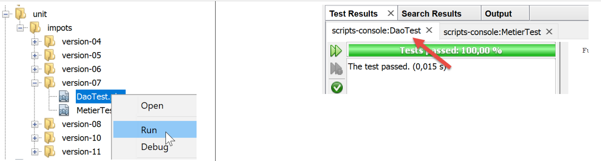
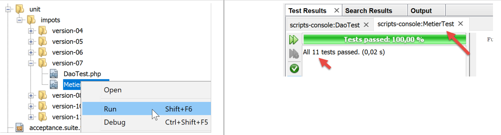

Exercice d’application – version 7
==================================

|image0|

Implémentation
--------------

Nous allons ici reprendre la version 6 en externalisant dans un fichier
de configuration les constantes utilisées dans les scripts principaux.
Le fichier de configuration sera un fichier jSON dont le contenu sera le
suivant :

.. code-block:: php 
   :linenos:

   {
       "rootDirectory": "C:/Data/st-2019/dev/php7/poly/scripts-console/impots/version-07",
       "databaseFilename": "Data/database.json",
       "taxAdminDataFileName": "Data/taxadmindata.json",
       "taxPayersDataFileName": "Data/taxpayersdata.json",
       "resultsFileName": "Data/results.json",
       "errorsFileName": "Data/errors.json",
       "dependencies": {
           "BaseEntity": "/../version-05/Entities/BaseEntity.php",
           "TaxAdminData": "/../version-05/Entities/TaxAdminData.php",
           "TaxPayerData": "/../version-05/Entities/TaxPayerData.php",
           "Database": "/../version-05/Entities/Database.php",
           "ExceptionImpots": "/../version-05/Entities/ExceptionImpots.php",
           "Utilitaires": "/../version-05/Utilities/Utilitaires.php",
           "InterfaceDao": "/../version-05/Dao/InterfaceDao.php",
           "TraitDao": "/../version-05/Dao/TraitDao.php",
           "InterfaceDao4TransferAdminData2Database": "/../version-05/Dao/InterfaceDao4TransferAdminData2Database.php",
           "DaoTransferAdminDataFromJsonFile2Database": "/../version-05/Dao/DaoTransferAdminDataFromJsonFile2Database.php",        
           "DaoImpotsWithTaxAdminDataInDatabase": "/../version-05/Dao/DaoImpotsWithTaxAdminDataInDatabase.php",
           "InterfaceMetier": "/../version-05/Métier/InterfaceMetier.php",
           "Metier": "/../version-05/Métier/Metier.php"
       },
       "dependencies4calculate": [
           "BaseEntity",
           "TaxAdminData",
           "TaxPayerData",
           "Database",
           "ExceptionImpots",
           "Utilitaires",
           "InterfaceDao",
           "TraitDao",
           "DaoImpotsWithTaxAdminDataInDatabase",
           "InterfaceMetier",
           "Metier"],
       "dependencies4transfer": [
           "BaseEntity",
           "TaxAdminData",
           "Database",
           "ExceptionImpots",
           "Utilitaires",
           "InterfaceDao",
           "TraitDao",  
           "InterfaceDao4TransferAdminData2Database",
           "DaoTransferAdminDataFromJsonFile2Database"]
   }

Dans cette configuration :

-  ligne 2 : le dossier à partir duquel tous les chemins de ce fichier
   de configuration sont mesurés ;

-  lignes 3-7 : les chemins de tous les fichiers jSON de l’application ;

-  lignes 8-22 : les chemins de tous les fichiers de l’application, sous
   la formé **[clé=>chemin]** ;

-  lignes 23-34 : les dépendances pour le calcul de l’impôt sous la
   forme d’une liste de clés du dictionnaire **[dependencies]** (lignes
   8-22) ;

-  lignes 35-44 : les dépendances pour le transfert en base des données
   du fichier jSON **[taxadmindata.json]** sous la forme d’une liste de
   clés du dictionnaire **[dependencies]** (lignes 8-22) ;

Le script de transfert en base des données de l’administration fiscale
**[MainTransferAdminDataFromFile2PostgresSQLDatabase.php]** devient le
suivant :

.. code-block:: php 
   :linenos:

   <?php

   // respect strict des types déclarés des paramètres de foctions
   declare (strict_types=1);

   // espace de noms
   namespace Application;

   // gestion des erreurs par PHP
   // ini_set("display_errors", "0");
   //
   // chemin du fichier de configuration
   define("CONFIG_FILENAME", "../Data/config.json");

   // on récupère la configuration
   $config = \json_decode(\file_get_contents(CONFIG_FILENAME), true);

   // on inclut les dépendances nécessaires au script
   $rootDirectory = $config["rootDirectory"];
   foreach ($config["dependencies4transfer"] as $dependency) {
     require $rootDirectory . $config["dependencies"][$dependency];
   }

   // définition des constantes
   define("DATABASE_CONFIG_FILENAME", "$rootDirectory/{$config["databaseFilename"]}");
   define("TAXADMINDATA_FILENAME", "$rootDirectory/{$config["taxAdminDataFileName"]}");

   //
   try {
     // création de la couche [dao]
     $dao = new DaoTransferAdminDataFromJsonFile2Database(DATABASE_CONFIG_FILENAME, TAXADMINDATA_FILENAME);
     // transfert des données dans la base
     $dao->transferAdminData2Database();
   } catch (ExceptionImpots $ex) {
     // on affiche l'erreur
     print $ex->getMessage() . "\n";
   }
   // fin
   print "Terminé\n";
   exit;

**Commentaires**

Le code reste celui qu’il était au paragraphe
`lien <chap-14.html#version6_remplissage_tbtranches>`__. La seule
différence est l’exploitation du fichier **[config.json]** en lieu et
place des constantes aux lignes 18-26 ;

-  ligne 16 : la fonction **[file_get_contents]** transfère le fichier
   **[config.json]** dans une chaîne de caractères. La fonction
   **[json_decode]** exploite ensuite cette chaîne pour construire le
   dictionnaire **[$config]**. Le second paramètre **[true]** de la
   fonction **[json_decode]** indique qu’on veut construire un
   dictionnaire ;

-  lignes 19-22 : on inclut les dépendances nécessaires au script de
   transfert des données du fichier **[taxadmindata.json]** vers la base
   de données ;

   -  **[$config["dependencies4transfer"]**] est le tableau des
      dépendances nécessaires au script de transfert. C’est une liste de
      **clés**. Les chemins des fichiers à inclure dans le projet sont
      trouvés dans le dictionnaire **[$config["dependencies"]**] ;

   -  $config\ **["rootDirectory"]** représente le chemin avec lequel
      les fichiers à inclure doivent être préfixés ;

De la même façon, le script de calcul de l’impôt devient le suivant
**[MainCalculateImpotsWithTaxAdminDataInPostgresDatabase]** :

.. code-block:: php 
   :linenos:

   <?php

   // respect strict des types déclarés des paramètres de foctions
   declare (strict_types=1);

   // espace de noms
   namespace Application;

   // gestion des erreurs par PHP
   // ini_set("display_errors", "0");
   //
   // chemin du fichier de configuration
   define("CONFIG_FILENAME", "../Data/config.json");

   // on récupère la configuration
   $config = \json_decode(\file_get_contents(CONFIG_FILENAME), true);

   // on inclut les dépendances nécessaires au script
   $rootDirectory = $config["rootDirectory"];
   foreach ($config["dependencies4calculate"] as $dependency) {
     require $rootDirectory . $config["dependencies"][$dependency];
   }

   // définition des constantes
   define("DATABASE_CONFIG_FILENAME", "$rootDirectory/{$config["databaseFilename"]}");
   define("TAXPAYERSDATA_FILENAME", "$rootDirectory/{$config["taxPayersDataFileName"]}");
   define("RESULTS_FILENAME", "$rootDirectory/{$config["resultsFileName"]}");
   define("ERRORS_FILENAME", "$rootDirectory/{$config["errorsFileName"]}");

   //
   try {
     // création de la couche [dao]
     $dao = new DaoImpotsWithTaxAdminDataInDatabase(DATABASE_CONFIG_FILENAME);
     // création de la couche [métier]
     $métier = new Metier($dao);
     // calcul de l'impôts en mode batch
     $métier->executeBatchImpots(TAXPAYERSDATA_FILENAME, RESULTS_FILENAME, ERRORS_FILENAME);
   } catch (ExceptionImpots $ex) {
     // on affiche l'erreur
     print "Une erreur s'est produite : " . utf8_encode($ex->getMessage()) . "\n";
   }
   // fin
   print "Terminé\n";
   exit;

Tests [Codeception]
-------------------

Cette version comme les précédentes est validée par des tests
**[Codeception]**.

|image1|

Test de la couche [dao]
~~~~~~~~~~~~~~~~~~~~~~~

Le test **[DaoTest.php]** est le suivant :

.. code-block:: php 
   :linenos:

   <?php

   // respect strict des types déclarés des paramètres de fonctions
   declare (strict_types=1);

   // espace de noms
   namespace Application;

   // définition de constantes
   define("ROOT", "C:/Data/st-2019/dev/php7/poly/scripts-console/impots/version-07");
   // chemin du fichier de configuration
   define("CONFIG_FILENAME", ROOT."/Data/config.json");
   // on récupère la configuration
   $config = \json_decode(\file_get_contents(CONFIG_FILENAME), true);
   // on inclut les dépendances nécessaires au script
   $rootDirectory = $config["rootDirectory"];
   foreach ($config["dependencies4calculate"] as $dependency) {
     require $rootDirectory . $config["dependencies"][$dependency];
   }
   // autres constantes
   define("DATABASE_CONFIG_FILENAME", "$rootDirectory/{$config["databaseFilename"]}");

   // test -----------------------------------------------------

   class DaoTest extends \Codeception\Test\Unit {
     // TaxAdminData
     private $taxAdminData;

     public function __construct() {
       parent::__construct();
       // création de la couche [dao]
       $dao = new DaoImpotsWithTaxAdminDataInDatabase(DATABASE_CONFIG_FILENAME);
       $this->taxAdminData = $dao->getTaxAdminData();
     }

     // tests
     public function testTaxAdminData() {
       …
     }

   }

**Commentaires**

-  lignes 9-21 : définition de l’environnement du test. Nous utilisons
   le même, sans la couche **[métier]**, que celui utilisé par le script
   principal **[MainCalculateImpotsWithTaxAdminDataInPostgresDatabase]**
   décrit au paragraphe `lien <chap-14.html#version6_calcul_impot>`__ ;

-  lignes 29-34 : construction de la couche **[dao]** ;

-  ligne 33 : l’attribut **[$this→taxAdminData]** contient les données à
   tester ;

-  lignes 37-39 : la méthode **[testTaxAdminData]** est celle décrite au
   paragraphe `lien <chap-11.html#version4_tests_dao>`__ ;

Les résultats du test sont les suivants :

|image2|

Test de la couche [métier]
~~~~~~~~~~~~~~~~~~~~~~~~~~

Le test **[MetierTest.php]** est le suivant :

.. code-block:: php 
   :linenos:

   <?php

   // respect strict des types déclarés des paramètres de foctions
   declare (strict_types=1);

   // espace de noms
   namespace Application;

   // définition de constantes
   define("ROOT", "C:/Data/st-2019/dev/php7/poly/scripts-console/impots/version-07");
   // chemin du fichier de configuration
   define("CONFIG_FILENAME", ROOT . "/Data/config.json");
   // on récupère la configuration
   $config = \json_decode(\file_get_contents(CONFIG_FILENAME), true);
   // on inclut les dépendances nécessaires au script
   $rootDirectory = $config["rootDirectory"];
   foreach ($config["dependencies4calculate"] as $dependency) {
     require $rootDirectory . $config["dependencies"][$dependency];
   }
   // autres constantes
   define("DATABASE_CONFIG_FILENAME", "$rootDirectory/{$config["databaseFilename"]}");

   // classe de test
   class MetierTest extends \Codeception\Test\Unit {
     // couche métier
     private $métier;

     public function __construct() {
       parent::__construct();
       // création de la couche [dao]
       $dao = new DaoImpotsWithTaxAdminDataInDatabase(DATABASE_CONFIG_FILENAME);
       // création de la couche [métier]
       $this->métier = new Metier($dao);
     }

     // tests
     public function test1() {
       …
     }

     -----------------------------------

     public function test11() {
       …
     }

   }

**Commentaires**

-  lignes 9-21 : définition de l’environnement du test. Nous utilisons
   le même que celui utilisé par le script principal
   **[MainCalculateImpotsWithTaxAdminDataInPostgresDatabase]** décrit au
   paragraphe `lien <chap-14.html#version6_main_calculate_impots>`__ ;

-  lignes 28-34 : construction de la couche **[dao]** ;

-  ligne 33 : l’attribut **[$this→métier]** est une référence sur la
   couche **[métier]** à tester ;

-  lignes 37-45 : les méthodes **[test1, test2…, test11]** sont celles
   décrites au paragraphe `lien <chap-11.html#version4_tests_métier>`__
   ;

Les résultats du test sont les suivants :

|image3|

.. |image0| image:: ./chap-15/media/image1.png
   :width: 3.06339in
   :height: 1.23622in
.. |image1| image:: ./chap-15/media/image2.png
   :width: 1.50748in
   :height: 2.24449in

