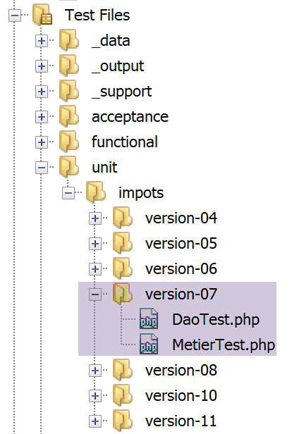

Exercice d’application – version 6
==================================

|image0|

Nous venons d’implémenter la structure en couches suivante :

|image1|

Le SGBD utilisé dans les exemples était MySQL. Au paragraphe
`lien <#_Architecture>`__ nous avions remarqué que rien dans la classe
implémentant la couche **[dao]** ne laissait supposer qu’on utilisait un
SGBD particulier. C’est ce que nous allons vérifier maintenant en
utilisant un autre SGBD, le SGBD PostgreSQL. L’architecture en couches
devient la suivante :

|image2|

Installation du SGBD PostgreSQL
-------------------------------

Les distributions du SGBD PostgreSQL sont disponibles à l’URL
**[https://www.postgresql.org/download/]** (mai 2019). Nous montrons
l’installation de la version pour Windows 64 bits :

|image3|

|image4|

-  en **[1-4]**, on télécharge l’installateur du SGBD ;

On lance l’installateur téléchargé :

|image5|

-  en **[6]**, indiquez un dossier d’installation ;

|image6|

-  en **[8]**, l’option **[Stack Builder]** est inutile pour ce qu’on
   veut faire ici ;

-  en **[10]**, laissez la valeur qui vous sera présentée ;

|image7|

-  en **[12-13]**, on a mis ici le mot de passe **[root]**. Ce sera le
   mot de passe de l’administrateur du SGBD qui s’appelle
   **[postgres]**. PostgreSQL l’appelle également le super-utilisateur ;

-  en **[15]**, laissez la valeur par défaut : c’est le port d’écoute du
   SGBD ;

|image8|

-  en **[17]**, laissez la valeur par défaut ;

-  en **[19]**, le résumé de la configuration de l’installation ;

|image9|

|image10|

Sous windows, le SGBD PostgreSQL est installé comme un service windows
lancé automatiquement. La plupart du temps ce n’est pas souhaitable.
Nous allons modifier cette configuration. Tapez **[services]** dans la
barre de recherche de Windows **[24-26]** :

|image11|

-  en **[29]**, on voit que le service du SGBD PostgreSQL est en mode
   automatique. On change cela en accédant aux propriétés du service
   **[30]** :

|image12|

-  en **[31-32]**, mettez le démarrage en mode manuel ;

-  en **[33]**, arrêtez le service ;

Lorsque vous voudrez démarrer manuellement le SGBD, revenez à
l’application **[services]**, cliquez droit sur le service
**[postgresql]** (34) et lancez le (35).

Activation de l’extension PDO du SGBD PostgreSQL
------------------------------------------------

Nous allons modifier le fichier **[php.ini]** qui configure PHP (cf
paragraphe `lien <#_Configuration_de_PHP>`__) :

|image13|

-  en **[2]**, vérifiez que l’extension PDO de PostgreSQL est activée.
   Ceci fait, sauvegardez la modification puis relancez Laragon pour
   être sûrs que la modification va être prise en compte. Ensuite
   vérifiez la configuration de PHP directement à partir de Laragon
   **[3-5]**.

Administrer PostgreSQL avec l’outil [pgAdmin]
---------------------------------------------

Lancez le service windows du SGBD PostgreSQL (cf paragraphe
`lien <#installation-du-sgbd-postgresql>`__). Puis de la même façon que
vous avez lancé l’outil **[services]**, lancez l’outil **[pgadmin]** qui
permet d’administrer le SGBD PostgreSQL **[1-3]** :

|image14|

Il est possible qu’à un moment donné on vous demande le mot de passe du
super-utilisateur. Celui-ci s’appelle **[postgres]**. Vous avez défini
son mot de passe lors de l’installation du SGBD. Dans ce document, nous
avons donné le mot de passe **[root]** au super-utilisateur lors de
l’installation.

-  en **[4]**, **[pgAdmin]** est une application web ;

-  en **[5]**, la liste des serveurs PostgreSQL détectés par
   **[pgAdmin]**, ici 1 ;

-  en **[6]**, le serveur PostgreSQL que nous avons lancé ;

-  en **[7]**, les bases de données du SGBD, ici 1 ;

-  en **[8]**, la base **[postgresql]** est gérée par le
   super-utilisateur **[postgres]** ;

Créons tout d’abord un utilisateur **[admimpots]** avec le mot de passe
**[mdpimpots]** :

|image15|

|image16|

-  en **[17]**, on a mis **[mdpimpots]** ;

|image17|

-  en **[21]**, le code SQL que va émettre l’outil **[pgAdmin]** vers le
   SGBD PostgreSQL. C’est une façon d’apprendre le langage SQL
   propriétaire de PostgreSQL ;

-  en **[22]**, après validation de l’assistant **[Save]**,
   l’utilisateur **[admimpots]** a été créé ;

Maintenant nous créons la base **[dbimpots-2019]** :

|image18|

On clique droit sur **[23]**, puis **[24-25]** pour créer une nouvelle
base de données. Dans l’onglet **[26]**, on définit le nom de la base
**[27]** et son propriétaire **[admimpots]** **[28]**.

|image19|

-  en **[30]**, le code SQL de création de la base ;

-  en **[31]**, après validation de l’assistant **[Save]**, la base
   **[dbimpots-2019]** est créée ;

Maintenant, nous allons créer la table **[tbtranches]** avec les
colonnes **[id, limites, coeffr, coeffn]**. Une particularité de
PostgreSQL est que les noms de colonnes sont sensibles à la casse
(majuscules / minuscules) ce qui n’est habituellement pas le cas avec
les autres SGBD. Ainsi avec MySQL, l’ordre **[select limites, coeffR,
coeffN from tbtranches]** fonctionnera même si les colonnes réelles de
la table **[tbtranches]** sont **[LIMITES, COEFFR, COEFFN]**. Avec
PostgreSQL, l’ordre SQL ne fonctionnera pas. On pourrait alors écrire
**[select LIMITES, COEFFR, COEFFN from tbtranches]** mais ça ne
fonctionnera toujours pas, car PostgreSQL va exécuter l’ordre **[select
limites, coeffr, coeffn from tbtranches]** : il passe par défaut les
noms des colonnes en minuscules. Pour qu’il ne fasse pas cela, il faut
écrire : **[select "LIMITES", "COEFFR", "COEFFN" from tbtranches]**,
ç-à-d qu’il faut protéger les noms des colonnes avec des guillemets.
Pour ces raisons, nous allons donner aux colonnes des noms en
minuscules. Les noms des objets d’une base de données peuvent être une
source d’incompatibilité entre SGBD, certains noms étant des mots
réservés dans certains SGBD et pas dans d’autres.

Nous créons la table **[tbtranches]** :

|image20|

-  utilisez le bouton **[40]** pour créer des colonnes ;

|image21|

|image22|

-  après avoir terminé l’assistant de création par **[Save]**, la table
   **[tbtranches]** est créée **[52-53]** ;

Il nous faut indiquer au SGBD qu’il doit lui-même générer la clé
primaire **[id]** lors de l’insertion d’une ligne dans la table :

|image23|

-  en **[56]** on accède aux propriétés de la clé primaire **[id]** ;

-  en **[59]**, on indique que la colonne est de type **[Identity]**.
   Cela va entraîner que le SGBD va générer les valeurs de la clé
   primaire ;

|image24|

-  en **[62]**, le code SQL généré pour cette opération ;

La table **[tbtranches]** est désormais prête.

Nous refaisons les mêmes opérations pour créer la table
**[tbconstantes]**. Nous donnons le résultat à obtenir :

|image25|

|image26|

|image27|

La base **[dbimpots-2019]** est désormais prête. Nous allons la remplir
avec des données.

Comme nous l’avons fait avec MySQL, il est possible d’exporter la base
de données **[dbimpots-2019]** dans un fichier SQL. On peut ensuite
importer ce fichier SQL pour recréer la base si on l’a perdue ou
détériorée. Nous n’exporterons ici que la structure de la base et non
ses données :

|image28|

|image29|

Le fichier généré est le suivant :

.. code-block:: php 
   :linenos:

   --
   -- PostgreSQL database dump
   --

   -- Dumped from database version 11.2
   -- Dumped by pg_dump version 11.2

   -- Started on 2019-07-04 08:20:31

   SET statement_timeout = 0;
   SET lock_timeout = 0;
   SET idle_in_transaction_session_timeout = 0;
   SET client_encoding = 'UTF8';
   SET standard_conforming_strings = on;
   SELECT pg_catalog.set_config('search_path', '', false);
   SET check_function_bodies = false;
   SET client_min_messages = warning;
   SET row_security = off;

   SET default_tablespace = '';

   SET default_with_oids = false;

   --
   -- TOC entry 198 (class 1259 OID 16408)
   -- Name: tbconstantes; Type: TABLE; Schema: public; Owner: postgres
   --

   CREATE TABLE public.tbconstantes (
       plafond_qf_demi_part double precision NOT NULL,
       id integer NOT NULL,
       plafond_revenus_celibataire_pour_reduction double precision NOT NULL,
       plafond_revenus_couple_pour_reduction double precision NOT NULL,
       valeur_reduc_demi_part double precision NOT NULL,
       plafond_decote_celibataire double precision NOT NULL,
       plafond_decote_couple double precision NOT NULL,
       plafond_impot_celibataire_pour_decote double precision NOT NULL,
       plafond_impot_couple_pour_decote double precision NOT NULL,
       abattement_dix_pourcent_max double precision NOT NULL,
       abattement_dix_pourcent_min double precision NOT NULL
   );

   ALTER TABLE public.tbconstantes OWNER TO postgres;

   --
   -- TOC entry 199 (class 1259 OID 16411)
   -- Name: tbconstantes_id_seq; Type: SEQUENCE; Schema: public; Owner: postgres
   --

   ALTER TABLE public.tbconstantes ALTER COLUMN id ADD GENERATED ALWAYS AS IDENTITY (
       SEQUENCE NAME public.tbconstantes_id_seq
       START WITH 1
       INCREMENT BY 1
       NO MINVALUE
       NO MAXVALUE
       CACHE 1
   );

   --
   -- TOC entry 196 (class 1259 OID 16399)
   -- Name: tbtranches; Type: TABLE; Schema: public; Owner: admimpots
   --

   CREATE TABLE public.tbtranches (
       limites double precision NOT NULL,
       id integer NOT NULL,
       coeffr double precision NOT NULL,
       coeffn double precision NOT NULL
   );

   ALTER TABLE public.tbtranches OWNER TO admimpots;

   --
   -- TOC entry 197 (class 1259 OID 16404)
   -- Name: tbimpots_id_seq; Type: SEQUENCE; Schema: public; Owner: admimpots
   --

   ALTER TABLE public.tbtranches ALTER COLUMN id ADD GENERATED ALWAYS AS IDENTITY (
       SEQUENCE NAME public.tbimpots_id_seq
       START WITH 1
       INCREMENT BY 1
       NO MINVALUE
       NO MAXVALUE
       CACHE 1
   );

   --
   -- TOC entry 2694 (class 2606 OID 16429)
   -- Name: tbconstantes tbconstantes_pkey; Type: CONSTRAINT; Schema: public; Owner: postgres
   --

   ALTER TABLE ONLY public.tbconstantes
       ADD CONSTRAINT tbconstantes_pkey PRIMARY KEY (id);

   --
   -- TOC entry 2692 (class 2606 OID 16403)
   -- Name: tbtranches tbimpots_pkey; Type: CONSTRAINT; Schema: public; Owner: admimpots
   --

   ALTER TABLE ONLY public.tbtranches
       ADD CONSTRAINT tbimpots_pkey PRIMARY KEY (id);

   --
   -- TOC entry 2821 (class 0 OID 0)
   -- Dependencies: 198
   -- Name: TABLE tbconstantes; Type: ACL; Schema: public; Owner: postgres
   --

   GRANT ALL ON TABLE public.tbconstantes TO admimpots;

   -- Completed on 2019-07-04 08:20:32

   --
   -- PostgreSQL database dump complete
   --

Remplissage de la table [tbtranches]
------------------------------------

Nous avons déjà fait ce travail avec le SGBD MySQL au paragraphe
`lien <#_Remplissage_de_base>`__. Il nous suffit de modifier le fichier
**[database.json]** qui décrit la base de données :

|image30|

Le fichier **[database.json]** devient le suivant :

.. code-block:: php 
   :linenos:

   {
       "dsn": "pgsql:host=localhost;dbname=dbimpots-2019",
       "id": "admimpots",
       "pwd": "mdpimpots",
       "tableTranches": "public.tbtranches",
       "colLimites": "limites",
       "colCoeffR": "coeffr",
       "colCoeffN": "coeffn",
       "tableConstantes": "public.tbconstantes",
       "colPlafondQfDemiPart": "plafond_qf_demi_part",
       "colPlafondRevenusCelibatairePourReduction": "plafond_revenus_celibataire_pour_reduction",
       "colPlafondRevenusCouplePourReduction": "plafond_revenus_couple_pour_reduction",
       "colValeurReducDemiPart": "valeur_reduc_demi_part",
       "colPlafondDecoteCelibataire": "plafond_decote_celibataire",
       "colPlafondDecoteCouple": "plafond_decote_couple",
       "colPlafondImpotCelibatairePourDecote": "plafond_impot_celibataire_pour_decote",
       "colPlafondImpotCouplePourDecote": "plafond_impot_couple_pour_decote",
       "colAbattementDixPourcentMax": "abattement_dix_pourcent_max",
       "colAbattementDixPourcentMin": "abattement_dix_pourcent_min"
   }

-  ligne 2 : le DSN a changé, **[pgsql]** indiquant qu’on a affaire au
   SGBD Postgres ;

-  lignes 5 et 9 : on a précédé le nom des tables par le nom du schéma
   auquel elles appartiennent **[public]**. Ce n’était pas indispensable
   puisque que **[public]** est le schéma utilisé par défaut
   lorsqu’aucun schéma n’est précisé dans le nom de la table ;

-  lignes 6-8, 10-19 : les noms des colonnes ont changé ;

Le script **[MainTransferAdminDataFromJsonFile2PostgresDatabase.php]**
de remplissage de la base **[dbimpots-2019]** est le suivant :

.. code-block:: php 
   :linenos:

   <?php

   // respect strict des types déclarés des paramètres de foctions
   declare (strict_types=1);

   // espace de noms
   namespace Application;

   // gestion des erreurs par PHP
   // ini_set("display_errors", "0");
   // inclusion interface et classes
   require_once __DIR__ . "/../../version-05/Entities/BaseEntity.php";
   require_once __DIR__ . "/../../version-05/Entities/TaxAdminData.php";
   require_once __DIR__ . "/../../version-05/Entities/TaxPayerData.php";
   require_once __DIR__ . "/../../version-05/Entities/Database.php";
   require_once __DIR__ . "/../../version-05/Entities/ExceptionImpots.php";
   require_once __DIR__ . "/../../version-05/Utilities/Utilitaires.php";
   require_once __DIR__ . "/../../version-05/Dao/InterfaceDao.php";
   require_once __DIR__ . "/../../version-05/Dao/TraitDao.php";
   require_once __DIR__ . "/../../version-05/Dao/InterfaceDao4TransferAdminData2Database.php";
   require_once __DIR__ . "/../../version-05/Dao/DaoTransferAdminDataFromJsonFile2Database.php";
   //
   // définition des constantes
   const DATABASE_CONFIG_FILENAME = "../Data/database.json";
   const TAXADMINDATA_FILENAME = "../Data/taxadmindata.json";

   //
   try {
     // création de la couche [dao]
     $dao = new DaoTransferAdminDataFromJsonFile2Database(DATABASE_CONFIG_FILENAME, TAXADMINDATA_FILENAME);
     // transfert des données dans la base
     $dao->transferAdminData2Database();
   } catch (ExceptionImpots $ex) {
     // on affiche l'erreur
     print "L'erreur suivante s'est produite : " . utf8_encode($ex->getMessage()) . "\n";
   }
   // fin
   print "Terminé\n";
   exit;

**Commentaires**

Seules les lignes 12-21 qui chargent les fichiers nécessaires à
l’exécution de l’application changent. Elles changent parce que la
valeur **[__DIR__]** change : elle désigne désormais le dossier
**[version-07/Main]**.

Lorsqu’on exécute ce script, on obtient le résultat suivant dans la
table **[tbtranches]** :

|image31|

-  on clique droit sur **[1]**, puis ensuite **[2-3]** ;

-  en **[4]**, on a bien les données des tranches d’impôts ;

On refait la même chose pour la table des constantes
**[tbconstantes]** :

|image32|

|image33|

|image34|

On notera que pour l’exécution du script, l’application Laragon n’a pas
besoin d’être active : on n’a besoin ni du serveur Apache, ni du SGBD
MySQL. On a seulement besoin du SGBD PostgreSQL dont on a lancé le
service windows.

Calcul de l’impôt
-----------------

|image35|

Les couches **[dao]** (3) et **[métier]** (2) ont déjà été écrites. Nous
avons déjà écrit le script principal pour le SGBD MySQL au paragraphe
`lien <#_Calcul_de_l’impôt>`__. Il nous suffit de reprendre le script
**[MainCalculateImpotsWithTaxAdminDataInMySQLDatabase.php]** et de
l’adapter au SGBD PostgreSQL. Il s’appelle désormais
**[MainCalculateImpotsWithTaxAdminDataInPostgresDatabase.php]** :

|image36|

Le script
**[MainCalculateImpotsWithTaxAdminDataInPostgresDatabase.php]** est le
suivant :

.. code-block:: php 
   :linenos:

   <?php

   // respect strict des types déclarés des paramètres de foctions
   declare (strict_types=1);

   // espace de noms
   namespace Application;

   // gestion des erreurs par PHP
   //ini_set("display_errors", "0");
   // inclusion interface et classes
   require_once __DIR__ . "/../../version-05/Entities/BaseEntity.php";
   require_once __DIR__ . "/../../version-05/Entities/TaxAdminData.php";
   require_once __DIR__ . "/../../version-05/Entities/TaxPayerData.php";
   require_once __DIR__ . "/../../version-05/Entities/Database.php";
   require_once __DIR__ . "/../../version-05/Entities/ExceptionImpots.php";
   require_once __DIR__ . "/../../version-05/Utilities/Utilitaires.php";
   require_once __DIR__ . "/../../version-05/Dao/InterfaceDao.php";
   require_once __DIR__ . "/../../version-05/Dao/TraitDao.php";
   require_once __DIR__ . "/../../version-05/Dao/DaoImpotsWithTaxAdminDataInDatabase.php";
   require_once __DIR__ . "/../../version-05/Métier/InterfaceMetier.php";
   require_once __DIR__ . "/../../version-05/Métier/Metier.php";
   //
   // définition des constantes
   const DATABASE_CONFIG_FILENAME = "../Data/database.json";
   const TAXADMINDATA_FILENAME = "../Data/taxadmindata.json";
   const RESULTS_FILENAME = "../Data/resultats.json";
   const ERRORS_FILENAME = "../Data/errors.json";
   const TAXPAYERSDATA_FILENAME = "../Data/taxpayersdata.json";

   try {
     // création de la couche [dao]
     $dao = new DaoImpotsWithTaxAdminDataInDatabase(DATABASE_CONFIG_FILENAME);
     // création de la couche [métier]
     $métier = new Metier($dao);
     // calcul de l'impôts en mode batch
     $métier->executeBatchImpots(TAXPAYERSDATA_FILENAME, RESULTS_FILENAME, ERRORS_FILENAME);
   } catch (ExceptionImpots $ex) {
     // on affiche l'erreur
     print "Une erreur s'est produite : " . utf8_encode($ex->getMessage()) . "\n";
   }
   // fin
   print "Terminé\n";
   exit;

**Commentaires**

Seules les lignes 12-22 qui chargent les fichiers nécessaires à
l’exécution de l’application changent. Elles changent parce que la
valeur **[__DIR__]** change : elle désigne désormais le dossier
**[version-07/Main]**.

**Résultats d’exécution**

Les mêmes que ceux obtenus dans les versions précédentes.

Tests [Codeception]
-------------------

Comme pour les versions précédentes, nous validons cette version avec
des tests **[Codeception]** :

|image37|

Test de la couche [dao]
~~~~~~~~~~~~~~~~~~~~~~~

Le test **[DaoTest.php]** est le suivant :

.. code-block:: php 
   :linenos:

   <?php

   // respect strict des types déclarés des paramètres de foctions
   declare (strict_types=1);

   // espace de noms
   namespace Application;

   // répertoires racines
   define("ROOT", "C:/Data/st-2019/dev/php7/poly/scripts-console/impots/version-06");
   define("VENDOR", "C:/myprograms/laragon-lite/www/vendor");

   // inclusion interface et classes
   require_once ROOT . "/../version-05/Entities/BaseEntity.php";
   require_once ROOT . "/../version-05/Entities/TaxAdminData.php";
   require_once ROOT . "/../version-05/Entities/TaxPayerData.php";
   require_once ROOT . "/../version-05/Entities/Database.php";
   require_once ROOT . "/../version-05/Entities/ExceptionImpots.php";
   require_once ROOT . "/../version-05/Utilities/Utilitaires.php";
   require_once ROOT . "/../version-05/Dao/InterfaceDao.php";
   require_once ROOT . "/../version-05/Dao/TraitDao.php";
   require_once ROOT . "/../version-05/Dao/DaoImpotsWithTaxAdminDataInDatabase.php";

   // bibliothèques tierces
   require_once VENDOR . "/autoload.php";

   // définition des constantes
   const DATABASE_CONFIG_FILENAME = ROOT ."../Data/database.json";

   class DaoTest extends \Codeception\Test\Unit {
     // TaxAdminData
     private $taxAdminData;

     public function __construct() {
       parent::__construct();
       // création de la couche [dao]
       $dao = new DaoImpotsWithTaxAdminDataInDatabase(DATABASE_CONFIG_FILENAME);
       $this->taxAdminData = $dao->getTaxAdminData();
     }

     // tests
     public function testTaxAdminData() {
       …
     }

   }

**Commentaires**

-  lignes 9-28 : définition de l’environnement du test. Nous utilisons
   le même, sans la couche **[métier]**, que celui utilisé par le script
   principal **[MainCalculateImpotsWithTaxAdminDataInPostgresDatabase]**
   décrit au paragraphe `lien <#calcul-de-limpôt>`__ ;

-  lignes 34-39 : construction de la couche **[dao]** ;

-  ligne 38 : l’attribut **[$this→taxAdminData]** contient les données à
   tester ;

-  lignes 42-44 : la méthode **[testTaxAdminData]** est celle décrite au
   paragraphe `lien <#_Tests_de_la>`__ ;

Les résultats du test sont les suivants :

|image38|

Test de la couche [métier]
~~~~~~~~~~~~~~~~~~~~~~~~~~

Le test **[MetierTest.php]** est le suivant :

.. code-block:: php 
   :linenos:

   <?php

   // respect strict des types déclarés des paramètres de foctions
   declare (strict_types=1);

   // espace de noms
   namespace Application;

   // répertoires racines
   define("ROOT", "C:/Data/st-2019/dev/php7/poly/scripts-console/impots/version-06");
   define("VENDOR", "C:/myprograms/laragon-lite/www/vendor");

   // inclusion interface et classes
   require_once ROOT . "/../version-05/Entities/BaseEntity.php";
   require_once ROOT . "/../version-05/Entities/TaxAdminData.php";
   require_once ROOT . "/../version-05/Entities/TaxPayerData.php";
   require_once ROOT . "/../version-05/Entities/Database.php";
   require_once ROOT . "/../version-05/Entities/ExceptionImpots.php";
   require_once ROOT . "/../version-05/Utilities/Utilitaires.php";
   require_once ROOT . "/../version-05/Dao/InterfaceDao.php";
   require_once ROOT . "/../version-05/Dao/TraitDao.php";
   require_once ROOT . "/../version-05/Dao/DaoImpotsWithTaxAdminDataInDatabase.php";
   require_once ROOT . "/../version-05/Métier/InterfaceMetier.php";
   require_once ROOT . "/../version-05/Métier/Metier.php";
   // bibliothèques tierces
   require_once VENDOR . "/autoload.php";
   // définition des constantes
   const DATABASE_CONFIG_FILENAME = ROOT . "../Data/database.json";

   class MetierTest extends \Codeception\Test\Unit {
     // couche métier
     private $métier;

     public function __construct() {
       parent::__construct();
       // création de la couche [dao]
       $dao = new DaoImpotsWithTaxAdminDataInDatabase(DATABASE_CONFIG_FILENAME);
       // création de la couche [métier]
       $this->métier = new Metier($dao);
     }

     // tests
     public function test1() {
       …
     }
   --------------------------------------------------------------------
     public function test11() {
       …
     }

   }

**Commentaires**

-  lignes 9-28 : définition de l’environnement du test. Nous utilisons
   le même que celui utilisé par le script principal
   **[MainCalculateImpotsWithTaxAdminDataInPostgresDatabase]** décrit au
   paragraphe `lien <#calcul-de-limpôt>`__ ;

-  lignes 34-40 : construction des couches **[dao]** et **[métier]** ;

-  ligne 39 : l’attribut **[$this→métier]** référence la couche
   **[métier]**

-  lignes 43-49 : les méthodes **[test1, test2…, test11]** sont celles
   décrites au paragraphe `lien <#_Tests_de_la_1>`__ ;

Les résultats du test sont les suivants :

|image39|

.. |image2| image:: ./chap-15/media/image3.png
   :width: 5.44528in
   :height: 1.24016in
.. |image3| image:: ./chap-15/media/image4.png
   :width: 5.92913in
   :height: 1.39803in

.. |image8| image:: ./chap-15/media/image9.png
   :width: 6.28346in
   :height: 2.52795in

.. |image10| image:: ./chap-15/media/image11.png
   :width: 6.08268in
   :height: 3.0311in

.. |image12| image:: ./chap-15/media/image13.png
   :width: 6.11024in
   :height: 2.40157in
.. |image13| image:: ./chap-15/media/image14.png
   :width: 6.11378in
   :height: 3.33898in

.. |image16| image:: ./chap-15/media/image17.png
   :width: 5.37008in
   :height: 2.20472in

.. |image21| image:: ./chap-15/media/image22.png
   :width: 4.38976in
   :height: 2.3626in

.. |image24| image:: ./chap-15/media/image26.png
   :width: 3.09843in
   :height: 1.07087in

.. |image27| image:: ./chap-15/media/image29.png
   :width: 5.04724in
   :height: 2.77992in

.. |image30| image:: ./chap-15/media/image32.png
   :width: 3.07835in
   :height: 1.05472in
.. |image31| image:: ./chap-15/media/image33.png
   :width: 5.96457in
   :height: 2.14921in
.. |image32| image:: ./chap-15/media/image34.png
   :width: 5.12205in
   :height: 1.61378in
.. |image33| image:: ./chap-15/media/image35.png
   :width: 4.98819in
   :height: 1.60197in

.. |image39| image:: ./chap-15/media/image41.png
   :width: 5.72008in
   :height: 1.43346in
