Fonctions réseau
================

Nous abordons maintenant les fonctions réseau de PHP qui nous permettent
de faire de la programmation TCP / IP (**T**\ ransfer **C**\ ontrol
**P**\ rotocol / **I**\ nternet **P**\ rotocol).

|image0|

Les bases de la programmation internet
--------------------------------------

Généralités
~~~~~~~~~~~

Considérons la communication entre deux machines distantes A et B :

|image1|

Lorsque une application *AppA* d'une machine A veut communiquer avec une
application *AppB* d'une machine B de l'Internet, elle doit connaître
plusieurs choses :

-  l'adresse IP (**I**\ nternet **P**\ rotocol) ou le nom de la machine
   B ;

-  le numéro du port avec lequel travaille l'application *AppB*. En
   effet la machine B peut supporter de nombreuses applications qui
   travaillent sur l'Internet. Lorsqu'elle reçoit des informations
   provenant du réseau, elle doit savoir à quelle application sont
   destinées ces informations. Les applications de la machine B ont
   accès au réseau via des guichets appelés également des **ports de
   communication**. Cette information est contenue dans le paquet reçu
   par la machine B afin qu'il soit délivré à la bonne application ;

-  les protocoles de communication compris par la machine B. Dans notre
   étude, nous utiliserons uniquement les protocoles TCP-IP ;

-  le protocole de dialogue accepté par l'application *AppB*. En effet,
   les machines A et B vont se "parler". Ce qu'elles vont dire va être
   encapsulé dans les protocoles TCP-IP. Néanmoins, lorsqu'au bout de la
   chaîne, l'application *AppB* va recevoir l'information envoyée par
   l'applicaton *AppA*, il faut qu'elle soit capable de l'interpréter.
   Ceci est analogue à la situation où deux personnes A et B
   communiquent par téléphone : leur dialogue est transporté par le
   téléphone. La parole va être codée sous forme de signaux par le
   téléphone A, transportée par des lignes téléphoniques, arriver au
   téléphone B pour y être décodée. La personne B entend alors des
   paroles. C'est là qu'intervient la notion de protocole de dialogue :
   si A parle français et que B ne comprend pas cette langue, A et B ne
   pourront dialoguer utilement ;

..

   Aussi les deux applications communicantes doivent-elles être d'accord
   sur le type de dialogue qu'elles vont adopter. Par exemple, le
   dialogue avec un service *ftp* n'est pas le même qu'avec un service
   *pop* : ces deux services n'acceptent pas les mêmes commandes. Elles
   ont un protocole de dialogue différent ;

Les caractéristiques du protocole TCP
~~~~~~~~~~~~~~~~~~~~~~~~~~~~~~~~~~~~~

Nous n'étudierons ici que des communications réseau utilisant le
protocole de transport TCP dont voici les principales caractéristiques :

-  le processus qui souhaite émettre établit tout d'abord une
   **connexion** avec le processus destinataire des informations qu'il
   va émettre. Cette connexion se fait entre un port de la machine
   émettrice et un port de la machine réceptrice. Il y a entre les deux
   ports un chemin virtuel qui est ainsi créé et qui sera réservé aux
   deux seuls processus ayant réalisé la connexion ;

-  tous les paquets émis par le processus source suivent ce chemin
   virtuel et arrivent dans l'ordre où ils ont été émis ;

-  l'information émise a un aspect continu. Le processus émetteur envoie
   des informations à son rythme. Celles-ci ne sont pas nécessairement
   envoyées tout de suite : le protocole TCP attend d'en avoir assez
   pour les envoyer. Elles sont stockées dans une structure appelée
   *segment TCP*. Ce segment une fois rempli sera transmis à la couche
   IP où il sera encapsulé dans un paquet IP ;

-  chaque segment envoyé par le protocole TCP est numéroté. Le protocole
   TCP destinataire vérifie qu'il reçoit bien les segments en séquence.
   Pour chaque segment correctement reçu, il envoie un accusé de
   réception à l'expéditeur ;

-  lorsque ce dernier le reçoit, il l'indique au processus émetteur.
   Celui-ci peut donc savoir qu'un segment est arrivé à bon port ;

-  si au bout d'un certain temps, le protocole TCP ayant émis un segment
   ne reçoit pas d'accusé de réception, il retransmet le segment en
   question, garantissant ainsi la qualité du service d'acheminement de
   l'information ;

-  le circuit virtuel établi entre les deux processus qui communiquent
   est *full-duplex* : cela signifie que l'information peut transiter
   dans les deux sens. Ainsi le processus destination peut envoyer des
   accusés de réception alors même que le processus source continue
   d'envoyer des informations. Cela permet par exemple au protocole TCP
   source d'envoyer plusieurs segments sans attendre d'accusé de
   réception. S'il réalise au bout d'un certain temps qu'il n'a pas reçu
   l'accusé de réception d'un certain segment n° *n*, il reprendra
   l'émission des segments à ce point ;

   1. .. rubric:: La relation client-serveur
         :name: la-relation-client-serveur

Souvent, la communication sur Internet est dissymétrique : la machine A
initie une connexion pour demander un service à la machine B : il
précise qu'il veut ouvrir une connexion avec le service SB1 de la
machine B. Celle-ci accepte ou refuse. Si elle accepte, la machine A
peut envoyer ses demandes au service SB1. Celles-ci doivent se conformer
au protocole de dialogue compris par le service SB1. Un dialogue
demande-réponse s'instaure ainsi entre la machine A qu'on appelle
machine **cliente** et la machine B qu'on appelle machine **serveur**.
L'un des deux partenaires fermera la connexion.

Architecture d'un client
~~~~~~~~~~~~~~~~~~~~~~~~

L'architecture d'un programme réseau demandant les services d'une
application serveur sera la suivante :

.. code-block:: php 
   :linenos:

   ouvrir la connexion avec le service SB1 de la machine B
   si réussite alors
   	tant que ce n'est pas fini
   		préparer une demande
   		l'émettre vers la machine B
   		attendre et récupérer la réponse
   		la traiter
   	fin tant que
   finsi
   fermer la connexion

Architecture d'un serveur
~~~~~~~~~~~~~~~~~~~~~~~~~

L'architecture d'un programme offrant des services sera la suivante :

.. code-block:: php 
   :linenos:

   ouvrir le service sur la machine locale
   tant que le service est ouvert
   	se mettre à l'écoute des demandes de connexion sur un port dit port d'écoute
   	lorsqu'il y a une demande, la faire traiter par une autre tâche sur un autre port dit port de service
   fin tant que

Le programme serveur traite différemment la demande de connexion
initiale d'un client de ses demandes ultérieures visant à obtenir un
service. Le programme n'assure pas le service lui-même. S'il le faisait,
pendant la durée du service il ne serait plus à l'écoute des demandes de
connexion et des clients ne seraient alors pas servis. Il procède donc
autrement : dès qu'une demande de connexion est reçue sur le port
d'écoute puis acceptée, le serveur crée une tâche chargée de rendre le
service demandé par le client. Ce service est rendu sur un autre port de
la machine serveur appelé **port de service**. On peut ainsi servir
plusieurs clients en même temps.

Une tâche de service aura la structure suivante :

.. code-block:: php 
   :linenos:

   tant que le service n'a pas été rendu totalement
   		attendre une demande sur le port de service
   		lorsqu'il y en a une, élaborer la réponse
   		transmettre la réponse via le port de service
   fin tant que
   libérer le port de service

Découvrir les protocoles de communication de l'internet
-------------------------------------------------------

Introduction
~~~~~~~~~~~~

Lorsqu'un client s'est connecté à un serveur, s'établit ensuite un
dialogue entre-eux. La nature de celui-ci forme ce qu'on appelle le
protocole de communication du serveur. Parmi les protocoles les plus
courants de l'internet on trouve les suivants :

-  HTTP : **H**\ yper\ **T**\ ext **T**\ ransfer **P**\ rotocol - le
   protocole de dialogue avec un serveur web (serveur HTTP) ;

-  SMTP : **S**\ imple **M**\ ail **T**\ ransfer **P**\ rotocol - le
   protocole de dialogue avec un serveur d'envoi de courriers
   électroniques (serveur SMTP) ;

-  POP : **P**\ ost **O**\ ffice **P**\ rotocol - le protocole de
   dialogue avec un serveur de stockage du courrier électronique
   (serveur POP). Il s'agit là de récupérer les courriers électroniques
   reçus et non d'en envoyer ;

-  IMAP : **I**\ nternet **M**\ essage **A**\ ccess **P**\ rotocol - le
   protocole de dialogue avec un serveur de stockage du courrier
   électronique (serveur IMAP). Ce protocole a remplacé progressivement
   le protocole POP plus ancien ;

-  FTP : **F**\ ile **T**\ ransfer **P**\ rotocol - le protocole de
   dialogue avec un serveur de stockage de fichiers (serveur FTP) ;

Tous ces protocoles ont la particularité d'être des protocoles à lignes
de texte : le client et le serveur s'échangent des lignes de texte. Si
on a un client capable de :

-  créer une connexion avec un serveur TCP ;

-  afficher à la console les lignes de texte que le serveur lui envoie ;

-  envoyer au serveur les lignes de texte qu'un utilisateur saisirait au
   clavier ;

alors on est capable de dialoguer avec un serveur TCP ayant un protocole
à lignes de texte pour peu qu'on connaisse les règles de ce protocole.

Utilitaires TCP
~~~~~~~~~~~~~~~

|image2|

Dans les codes associés à ce document, on trouve deux utilitaires de
communication TCP :

-  **[RawTcpClient]** permet de se connecter sur le port P d’un serveur
   S ;

-  **[RawTcpServer]** permet de créer un serveur qui attend des clients
   sur un port P ;

Le serveur TCP **[RawTcpServer]** s’appelle avec la syntaxe
**[RawTcpServeur port]** pour créer un service TCP sur le port
**[port]** de la machine locale (l’ordinateur sur lequel vous
travaillez) :

-  le serveur peut servir plusieurs clients simultanément ;

-  le serveur exécute les commandes tapées par l’utilisateur tapées au
   clavier. Celles-ci sont les suivantes :

   -  **list** : liste les clients actuellement connectés au serveur.
      Ceux-ci sont affichés sous la forme **[id=x-nom=y]**. Le champ
      **[id]** sert à identifier les clients ;

   -  **send x [texte]** : envoie **texte** au client n° **x** (id=x).
      Les crochets [] ne sont pas envoyés. Ils sont nécessaires dans la
      commande. Ils servent à délimiter visuellement le texte envoyé au
      client ;

   -  **close x** : ferme la connexion avec le client n° **x** ;

   -  **quit** : ferme toutes les connexions et arrête le service ;

-  les lignes envoyées par le client au serveur sont affichées sur la
   console ;

-  l’ensemble des échanges est logué dans un fichier texte portant le
   nom **[machine-portService.txt]** où

   -  **[machine]** est le nom de la machine sur laquelle s’exécute le
      code ;

   -  **[port]** est le port de service qui répond aux demandes du
      client ;

Le client TCP **[RawTcpClient]** s’appelle avec la syntaxe
**[RawTcpClient serveur port]** pour se connecter au port **[port]** du
serveur **[serveur]** :

-  les lignes tapées par l’utilisateur au clavier sont envoyées au
   serveur ;

-  les lignes envoyées par le serveur sont affichées sur la console ;

-  l’ensemble des échanges est logué dans un fichier texte portant le
   nom **[serveur-port.txt]** ;

Voyons un exemple. On ouvre deux fenêtres de commandes Windows et on se
positionne dans chacune d’elles sur le dossier des utilitaires. Dans
l’une des fenêtres on lance le serveur **[RawTcpServer]** sur le port
100 :

|image3|

-  en **[1]**, nous sommes placés dans le dossier des utilitaires ;

-  en **[2]**, nous lançons le serveur TCP sur le port 100 ;

-  en **[3]**, le serveur se met en attente d’un client TCP ;

-  en **[4]**, le serveur attend une commande tapée par l’utilisateur au
   clavier ;

Dans l’autre fenêtre de commandes, on lance le client TCP :

|image4|

-  en **[5]**, nous sommes placés dans le dossier des utilitaires ;

-  en **[6]**, nous lançons le client TCP : nous lui disons de se
   connecter au port 100 de la machine locale (celle avec laquelle vous
   travaillez) ;

-  en **[7]**, le client a réussi à se connecter au serveur. On indique
   les coordonnées du client : il est sur la machine
   **[DESKTOP-528I5CU]** (la machine locale dans cet exemple) et utilise
   le port **[50405]** pour communiquer avec le serveur :

-  en **[8]**, le client attend une commande tapée par l’utilisateur au
   clavier ;

Revenons sur la fenêtre du serveur. Son contenu a évolué :

|image5|

-  en **[9]**, un client a été détecté. Le serveur lui a donné le n° 1.
   Le serveur a correctement identifié le client distant (machine et
   port) ;

-  en **[10]**, le serveur se remet en attente d’un nouveau client ;

Revenons sur la fenêtre du client et envoyons une commande au serveur :

|image6|

-  en **[11]**, la commande envoyée au serveur ;

Revenons sur la fenêtre du serveur. Son contenu a évolué :

|image7|

-  en **[12]**, entre cochets, le message reçu par le serveur ;

Envoyons une réponse au client :

|image8|

-  en **[13]**, la réponse envoyée au client 1. Seul le texte entre les
   crochets est envoyé, pas les crochets eux-mêmes ;

Revenons à la fenêtre du client :

|image9|

-  en **[14]**, la réponse reçue par le client. Le texte reçu est celui
   entre crochets ;

Revenons à la fenêtre du serveur pour voir d’autres commandes :

|image10|

-  en **[15]**, nous demandons la liste des clients ;

-  en **[16]**, la réponse ;

-  en **[17]**, nous fermons la connexion avec le client n° 1 ;

-  en **[18]**, la confirmation du serveur ;

-  en **[19]**, nous arrêtons le serveur ;

-  en **[20]**, la confirmation du serveur ;

Revenons à la fenêtre du client :

|image11|

-  en **[21]**, le client a détecté la fin du service ;

Deux fichiers de logs ont été créés, un pour le serveur, un autre pour
le client :

|image12|

-  en **[25]**, les logs du serveur : le nom du fichier est le nom du
   client **[machine-port]** ;

-  en **[26]**, les logs du client : le nom du fichier est le nom du
   serveur **[machine-port]** ;

Les logs du serveur sont les suivants :

.. code-block:: php 
   :linenos:

   <-- [hello from client]
   --> [hello from server]

Les logs du client sont les suivants :

.. code-block:: php 
   :linenos:

   --> [hello from client]
   <-- [hello from server]

Obtenir le nom ou l'adresse IP d'une machine de l'Internet
----------------------------------------------------------

|image13|

Les machines de l’internet sont identifiées par une adresse IP (IPv4 ou
IPv6) et le plus souvent par un nom. Mais finalement seule l’adresse IP
est utilisée. Il faut donc parfois connaître l’adresse IP d’une machine
identifiée par son nom.

Le script **[ip-01.php]** est le suivant :

.. code-block:: php 
   :linenos:

   <?php

   // respect strict des types déclarés des paramètres de fonctions
   declare (strict_types=1);
   //
   // gestion des erreurs
   error_reporting(E_ALL & E_STRICT);
   ini_set("display_errors", "on");
   //
   // constantes
   $HOTES = array("istia.univ-angers.fr", "www.univ-angers.fr", "www.ibm.com", "localhost", "", "xx");
   // adresses IP et noms des machines de $HOTES
   for ($i = 0; $i < count($HOTES); $i++) {
     getIPandName($HOTES[$i]);
   }
   // fin
   print "Terminé\n";
   exit;

   //------------------------------------------------
   function getIPandName(string $nomMachine): void {
     //$nomMachine : nom de la machine dont on veut l'adresse IP
     //
     // nomMachine-->adresse IP
     $ip = gethostbyname($nomMachine);
     print "---------------\n";
     if ($ip !== $nomMachine) {
       print "ip[$nomMachine]=$ip\n";
       // adresse IP --> nomMachine
       $name = gethostbyaddr($ip);
       if ($name !== $ip) {
         print "name[$ip]=$name\n";
       } else {
         print "Erreur, machine[$ip] non trouvée\n";
       }
     } else {
       print "Erreur, machine[$nomMachine] non trouvée\n";
     }
   }

**Commentaires**

-  lignes 7-8 : on demande à ce que PHP signale toutes les erreurs
   (E_ALL & E_STRICT) et que celles-ci soient affichées. Ce mode n’est
   recommandé qu’en mode développement pour améliorer le code avec les
   avertissements de PHP. En mode production, ligne 8, on mettrait
   « off ». Depuis PHP 5.4, le niveau E_STRICT est inclus dans E_ALL ;

-  ligne 11 : la liste de machines dont on veut le nom et l’adresse IP ;

Les fonctions réseau de PHP sont utilisées dans la fonction
*getIpandName* de la ligne 21.

-  ligne 25 : la fonction *gethostbyname($nom)* permet d'obtenir
   l'adresse IP "ip3.ip2.ip1.ip0" de la machine s'appelant $\ *nom*. Si
   la machine $\ *nom* n'existe pas, la fonction rend $\ *nom* comme
   résultat ;

-  ligne 30 : la fonction *gethostbyaddr($ip)* permet d'obtenir le nom
   de la machine d'adresse $ip de la forme "ip3.ip2.ip1.ip0". Si la
   machine $\ *ip* n'existe pas, la fonction rend $\ *ip* comme
   résultat ;

**Résultats** :

.. code-block:: php 
   :linenos:

   ---------------
   ip[istia.univ-angers.fr]=193.49.144.41
   name[193.49.144.41]=ametys-fo-2.univ-angers.fr
   ---------------
   ip[www.univ-angers.fr]=193.49.144.41
   name[193.49.144.41]=ametys-fo-2.univ-angers.fr
   ---------------
   ip[www.ibm.com]=2.18.220.211
   name[2.18.220.211]=a2-18-220-211.deploy.static.akamaitechnologies.com
   ---------------
   ip[localhost]=127.0.0.1
   name[127.0.0.1]=DESKTOP-528I5CU
   ---------------
   ip[]=192.168.1.38
   name[192.168.1.38]=DESKTOP-528I5CU.home
   ---------------
   Erreur, machine[xx] non trouvée
   Terminé

Le protocole HTTP (HyperText Transfer Protocol)
-----------------------------------------------

Exemple 1
~~~~~~~~~

|image14|

Lorsqu’un navigateur affiche une URL, il est le client d’un serveur web
ou dit autrement d’un serveur HTTP. C’est lui qui prend l’initiative et
il commence par envoyer un certain nombre de commandes au serveur. Pour
ce premier exemple :

-  le serveur sera l’utilitaire **[RawTcpServer]** ;

-  le client sera un navigateur ;

Nous lançons d’abord le serveur sur le port 100 :

|image15|

Puis avec un navigateur, nous demandons l’URL **[localhost:100]**, ç-a-d
que nous disons que le serveur HTTP interrogé travaille sur le port 100
de la machine locale :

|image16|

Revenons sur la fenêtre du serveur :

|image17|

-  en **[3]**, le client qui s’est connecté ;

-  en **[4-7]**, la série de lignes de texte qu’il a envoyées :

   -  en **[4]** : cette ligne a le format **[GET URL HTTP/1.1]**. Elle
      demande l’URL / et demande au serveur d’utiliser le protocole HTTP
      1.1 ;

   -  en **[5]** : cette ligne a le format **[Host: serveur:port]**. La
      casse de la commande **[Host]** n’importe pas. On rappelle ici que
      le client interroge un serveur local opérant sur le port 100 ;

   -  la commande **[User-Agent]** donne l’identité du client ;

   -  la commande **[Accept]** indique quels types de document sont
      acceptés par le client ;

   -  la commande **[Accept-Language]** indique dans quelle langue sont
      souhaités les documents demandés s’ils existent en plusieurs
      langues ;

   -  la commande **[Connection]** indique le mode de connexion
      souhaité : **[keep-alive]** indique que la connexion doit être
      maintenue jusqu’à ce que les échanges soient terminés ;

   -  en **[7]** : le client termine ses commandes par une ligne vide ;

Nous terminons la connexion en terminant le serveur :

|image18|

Exemple 2
~~~~~~~~~

Maintenant que nous connaissons les commandes envoyées par un navigateur
pour réclamer une URL, nous allons réclamer cette URL avec notre client
TCP **[RawTcpClient]**. Le serveur Apache de Laragon sera notre serveur
web.

Lançons Laragon puis le serveur web Apache :

|image19|

|image20|

Maintenant avec un navigateur, demandons l’URL
**[http://localhost:80]**. Ici nous ne précisons que le serveur
**[localhost:80]** et pas d’URL de document. Dans ce cas c’est l’URL /
qui est demandée, ç-à-d la racine du serveur web :

|image21|

-  en **[1]**, l’URL demandée. On a tapé initialement
   **[http://localhost:80]** et le navigateur (Firefox ici) l’a
   transformée simplement en **[localhost]** car le protocole **[http]**
   est implicite lorsqu’aucun protocole n’est mentionné et le port
   **[80]** est implicite lorsque le port n’est pas précisé ;

-  en **[2]**, la page racine / du serveur web interrogé ;

Maintenant, visualisons le texte reçu par le navigateur :

|image22|

-  on clique droit sur la page reçue et on choisit l’option **[2]**. on
   obtient le code source suivant :

.. code-block:: php 
   :linenos:

   <!DOCTYPE HTML>
   <HTML>
       <head>
           <title>Laragon</title>

           <link href="https://fonts.googleapis.com/css?family=Karla:400" rel="stylesheet" type="text/css">

           
       </head>
       <body>
           

               

                   
Laragon

        
                   
 
                         Apache/2.4.35 (Win64) OpenSSL/1.1.0i PHP/7.2.11 
                         PHP version: 7.2.11   <a title="phpinfo()" href="/?q=info">info</a> 
                         Document Root: C:/myprograms/laragon-lite/www 

                   

                   

                     
<a title="Getting Started" href="https://laragon.org/docs">Getting Started</a>

                   

               

           

       </body>
   </HTML>

Maintenant demandons l’URL **[http://localhost:80]** avec notre client
TCP :

|image23|

-  en **[1]**, nous nous connectons au port 80 du serveur *localhost*.
   C’est là qu’opère le serveur web de Laragon ;

Nous tapons maintenant les commandes que nous avons découvertes dans le
paragraphe précédent :

|image24|

-  en **[1]**, la commande **[GET]**. On demande la racine / du serveur
   web ;

-  en **[2]**, la commande **[Host]** ;

-  ce sont les deux seules commandes indispensables. Pour les autres
   commandes, le serveur web prendra des valeurs par défaut ;

-  en **[3]**, la ligne vide qui doit terminer les commandes du client ;

-  dessous la ligne 3, vient la réponse du serveur web ;

-  en **[4]** jusqu’à la ligne vide **[5]** viennent les entêtes HTTP de
   la réponse du serveur ;

-  après la ligne **[5]** vient le document HTML demandé **[6]** ;

Nous tapons **[quit]** pour terminer le client et nous chargeons le
fichier de logs **[localhost-80.txt]** :

.. code-block:: php 
   :linenos:

   --> [GET / HTTP/1.1]
   --> [Host: localhost:80]
   --> []
   <-- [HTTP/1.1 200 OK]
   <-- [Date: Thu, 16 May 2019 14:24:39 GMT]
   <-- [Server: Apache/2.4.35 (Win64) OpenSSL/1.1.0i PHP/7.2.11]
   <-- [X-Powered-By: PHP/7.2.11]
   <-- [Content-Length: 1781]
   <-- [Content-Type: text/HTML; charset=UTF-8]
   <-- []
   <-- [<!DOCTYPE HTML>]
   <-- [<HTML>]
   <-- [    <head>]
   <-- [        <title>Laragon</title>]
   <-- []
   <-- [        <link href="https://fonts.googleapis.com/css?family=Karla:400" rel="stylesheet" type="text/css">]
   <-- []
   <-- [        ]
   <-- [    </head>]
   <-- [    <body>]
   <-- [        
]
   <-- [            
]
   <-- [                
Laragon
]
   <-- [     ]
   <-- [                
 ]
   <-- [                      Apache/2.4.35 (Win64) OpenSSL/1.1.0i PHP/7.2.11 ]
   <-- [                      PHP version: 7.2.11   <a title="phpinfo()" href="/?q=info">info</a> ]
   <-- [                      Document Root: C:/myprograms/laragon-lite/www ]
   <-- []
   <-- [                
]
   <-- [                
]
   <-- [                  
<a title="Getting Started" href="https://laragon.org/docs">Getting Started</a>
]
   <-- [                
]
   <-- [            
]
   <-- []
   <-- [        
]
   <-- [    </body>]
   <-- [</HTML>]

-  lignes 11-79 : le document HTML reçu. Dans l’exemple précédent,
   Firefox avait reçu le même ;

Nous avons désormais les bases pour programmer un client TCP qui
demanderait une URL.

Exemple 3
~~~~~~~~~

|image25|

Le script **[http-01.php]** est un client HTTP configuré par le fichier
jSON **[config-http-01.json]**. Le contenu de celui-ci est le suivant :

.. code-block:: php 
   :linenos:

   {
       "localhost": {
           "port": 80,
           "GET": "/",
           "Host": "localhost:80",
           "User-Agent": "client PHP",
           "Accept": "text/HTML",
           "Accept-Language": "fr",
           "endOfLine":"\r\n"
       }
   }

-  ligne 2 : le nom de la machine hébergeant le serveur web à
   atteindre ;

-  ligne 3 : le port sur lequel opère ce serveur web ;

-  ligne 4 : l’URL du document désiré ;

-  ligne 5 : la machine cible sous la forme machine:port ;

-  ligne 6 : l’identification du client HTTP : on peut mettre ce qu’on
   veut ;

-  ligne 7 : le type de document accepté par le client, ici du texte
   HTML ;

-  ligne 8 : la langue souhaitée pour le document demandé ;

-  ligne 9 : la marque de fin de ligne pour les commandes envoyées par
   le client : en effet elle peut différer selon que le serveur est sur
   une machine Unix (\n) ou Windows (\r\n) ;

Le script **[http-01.php]** est le suivant :

.. code-block:: php 
   :linenos:

   <?php

   // respect strict des types déclarés des paramètres de foctions
   declare (strict_types=1);
   //
   // gestion des erreurs
   // error_reporting(E_ALL & E_STRICT);
   // ini_set("display_errors", "on");
   //
   // constantes
   const CONFIG_FILE_NAME = "config-http-01.json";
   //
   // on récupère la configuration
   $config = \json_decode(\file_get_contents(CONFIG_FILE_NAME), true);
   // otenir le texte HTML des URL du fichier de configuration
   foreach ($config as $site => $protocole) {
     // lecture page index du site $ite
     $résultat = getURL($site, $protocole);
     // affichage résultat
     print "$résultat\n";
   }//for
   // fin
   exit;

   //-----------------------------------------------------------------------
   function getURL(string $site, array $protocole, $suivi = TRUE): string {
     // lit l'URL $site["GET"] et la stocke dans le fichier $site.HTML
     // le dialogue client /serveur se fait selon le protocole $protocole
     //
     // ouverture d'une connexion sur le port de $site
     $erreurNumber = 0;
     $erreur = "";
     $connexion = fsockopen($site, $protocole["port"], $erreurNumber, $erreur);
     // retour si erreur
     if ($connexion === FALSE) {
       return "Echec de la connexion au site (" . $site . " ," . $protocole["port"] . " : $erreur";
     }
     // $connexion représente un flux de communication bidirectionnel
     // entre le client (ce programme) et le serveur web contacté
     // ce canal est utilisé pour les échanges de commandes et d'informations
     // le protocole de dialogue est HTTP
     //
     // création du fichier $site.HTML
     $HTML = fopen("output/$site.HTML", "w");
     if ($HTML === FALSE) {
       // fermeture connexion client / serveur
       fclose($connexion);
       // retour erreur
       return "Erreur lors de la création du fichier $site.HTML";
     }
     // le client va commencer le dialogue HTTP avec le serveur
     if ($suivi) {
       print "Client : début de la communication avec le serveur [$site] ----------------------------\n";
     }
     // selon les serveurs, les lignes du client doivent se terminer par \n ou \r\n
     $endOfLine = $protocole["endOfLine"];
     // par simplification, on ne teste pas les cas d'erreur dans la communication client /serveur
     // le client envoie la commande GET pour demander l'URL $protocole["GET"]
     // syntaxe GET URL HTTP/1.1
     $commande = "GET " . $protocole["GET"] . " HTTP/1.1$endOfLine";
     // suivi ?
     if ($suivi) {
       print "--> $commande";
     }
     // on envoie la commande au serveur
     fputs($connexion, $commande);
     // émission des autres entêtes HTTP
     foreach ($protocole as $verb => $value) {
       if ($verb !== "GET" && $verb != "port"" && $verb !="endOfLine") {
         // on construit la commande
         $commande = "$verb: $value$endOfLine";
         // suivi ?
         if ($suivi) {
           print "--> $commande";
         }
         // on envoie la commande au serveur
         fputs($connexion, $commande);
       }
     }
     // les entêtes (headers) du protocole HTTP doivent se terminer par une ligne vide
     fputs($connexion, $endOfLine);
     //
     // le serveur va maintenant répondre sur le canal $connexion. Il va envoyer toutes
     // ses données puis fermer le canal. Le client lit donc tout ce qui arrive de $connexion
     // jusqu'à la fermeture du canal
     //
     // on lit tout d'abord les entêtes HTTP envoyés par le serveur
     // ils se terminent eux-aussi par une ligne vide
     if ($suivi) {
       print "Réponse du serveur [$site] ----------------------------\n";
     }
     $fini = FALSE;
     while (!$fini && $ligne = fgets($connexion, 1000)) {
       // a-t-on une ligne vide ?
       $champs = [];
       preg_match("/^(.*?)\s+$/", $ligne, $champs);
       if ($champs[1] !== "") {
         if ($suivi) {
           // on affiche l'entête HTTP
           print "<-- " . $champs[1] . "\n";
         }
       } else {
         // c'était la ligne vide - les entêtes HTTP sont terminés
         $fini = TRUE;
       }
     }
     // on lit le document HTML qui va suivre la ligne vide
     while ($ligne = fgets($connexion, 1000)) {
       // on mémorise la ligne dans le fichier HTML du site
       fputs($HTML, $ligne);
     }
     // le serveur a fermé la connexion -  le client la ferme à son tour
     fclose($connexion);
     // fermeture du fichier $HTML
     fclose($HTML);
     // retour
     return "Fin de la communication avec le site [$site]. Vérifiez le fichier [$site.HTML]";
   }

**Commentaires du code :**

-  ligne 14 : le fichier de configuration est exploité pour créer un
   dictionnaire :

   -  les clés du dictionnaire sont les serveurs web à interroger ;

   -  les valeurs fixent le protocole HTTP à respecter ;

-  lignes 16-21 : on boucle sur la liste des serveurs web de la
   configuration ;

-  ligne 26 : la fonction *getURL($site,$protocole,$suivi)* demande un
   document du site web $\ *site* et le stocke dans le fichier texte
   $\ *site.HTML.*\ Par défaut, les échanges client/serveur sont logués
   sur la console ($suivi=TRUE) ;

-  ligne 33 : la fonction *fsockopen($site,$port,$errNumber,$erreur)*
   permet de créer une connexion avec un service TCP / IP travaillant
   sur le port $\ *port* de la machine $\ *site*. Si la connexion
   échoue, **[$errNumber]** est un n° d’erreur et **[$erreur]** le
   message d’erreur associé. Une fois la connexion client / serveur
   ouverte, de nombreux services TCP / IP échangent des lignes de texte.
   C'est le cas ici du protocole HTTP (HyperText Transfer Protocol). Le
   flux du serveur parvenant au client peut alors être traité comme un
   fichier texte lu avec **[fgets]**. Il en est de même pour le flux
   partant du client vers le serveur qui peut être écrit avec
   **[fputs]** ;

-  lignes 44-50 : création du fichier **[$site.HTML]** dans lequel on
   stockera le document HTML reçu ;

-  ligne 60 : la première commande du client doit être la commande
   **[GET URL HTTP/1.1]** ;

-  ligne 66 : la fonction *fputs* permet au client d'envoyer des données
   au serveur. Ici la ligne de texte envoyée a la signification
   suivante : "Je veux (GET) la page **[URL]** du site web auquel je
   suis connecté. Je travaille avec le protocole HTTP version 1.1" ;

-  lignes 68-79 : on envoie les autres lignes du protocole HTTP **[Host,
   User-Agent, Accept, Accept-Language]**. Leur ordre n’importe pas ;

-  ligne 81 : on envoie une ligne vide au serveur pour signifier que le
   client a terminé d’envoyer ses entêtes HTTP et qu’il attend désormais
   le document demandé ;

-  lignes 92-106 : le serveur va tout d’abord envoyer une série
   d’entêtes HTTP qui vont donner diverses informations sur le document
   demandé. Ces entêtes se terminent par une ligne vide ;

-  ligne 93 : on lit une ligne envoyée par le serveur avec la fonction
   PHP **[fgets]** ;

-  ligne 96 : on récupère le corps de la ligne sans les espaces (blancs,
   marque de fin de ligne) de la fin de ligne ;

-  ligne 97 : on regarde si on a récupéré la ligne vide qui marque la
   fin des entêtes HTTP envoyés par le serveur ;

-  lignes 98-101 : si on est en mode **[suivi]**, l’entête HTTP reçu est
   affiché à la console ;

-  lignes 108-111 : les lignes de texte de la réponse du serveur peuvent
   être lues ligne par ligne avec une boucle *while* et enregistrées
   dans le fichier texte **[output/$site.HTML]**. Lorsque le serveur web
   a envoyé la totalité de la page qu'on lui a demandée, il ferme sa
   connexion avec le client. Côté client, cela sera détecté comme une
   fin de fichier ;

**Résultats** :

La console affiche les logs suivants :

.. code-block:: php 
   :linenos:

   Client : début de la communication avec le serveur [localhost] ----------------------------
   --> GET / HTTP/1.1
   --> Host: localhost:80
   --> User-Agent: client PHP
   --> Accept: text/HTML
   --> Accept-Language: fr
   Réponse du serveur [localhost] ----------------------------
   <-- HTTP/1.1 200 OK
   <-- Date: Thu, 16 May 2019 15:43:18 GMT
   <-- Server: Apache/2.4.35 (Win64) OpenSSL/1.1.0i PHP/7.2.11
   <-- X-Powered-By: PHP/7.2.11
   <-- Content-Length: 1781
   <-- Content-Type: text/HTML; charset=UTF-8
   Fin de la communication avec le site [localhost]. Vérifiez le fichier [localhost.HTML]

Dans notre exemple, le fichier **[output/localhost.HTML]** reçu est le
suivant :

.. code-block:: php 
   :linenos:

   <!DOCTYPE HTML>
   <HTML>
       <head>
           <title>Laragon</title>

           <link href="https://fonts.googleapis.com/css?family=Karla:400" rel="stylesheet" type="text/css">

           
       </head>
       <body>
           

               

                   
Laragon

        
                   
 
                         Apache/2.4.35 (Win64) OpenSSL/1.1.0i PHP/7.2.11 
                         PHP version: 7.2.11   <a title="phpinfo()" href="/?q=info">info</a> 
                         Document Root: C:/myprograms/laragon-lite/www 

                   

                   

                     
<a title="Getting Started" href="https://laragon.org/docs">Getting Started</a>

                   

               

           

       </body>
   </HTML>

Nous avons bien obtenu le même document qu’avec le navigateur Firefox.

Exemple 4
~~~~~~~~~

Dans cet exemple, nous allons montrer que le client HTTP que nous avons
écrit est insuffisant. Faison évoluer le fichier de configuration
**[config-http-01.json]** de la façon suivante :

.. code-block:: php 
   :linenos:

   {
       "tahe.developpez.com": {
           "port": 443,
           "GET": "/",
           "Host": "sergetahe.com:443",
           "User-Agent": "script PHP 7",
           "Accept": "text/HTML",
           "Accept-Language": "fr",
           "endOfLine":"\n"
       }
   }

Ici, nous allons demander l’URL **[http://tahe.developpez.com:443/]**.
Le port 443 de la machine **[tahe.developpez.com]** est un port utilisé
pour le protocole http sécurisé appelé https. Dans ce protocole, le
dialogue client / serveur commence par un échange d’informations qui
vont sécuriser la liaison. Le client doit alors parler le protocole
**[HTTPS]** et non le protocole **[HTTP]**, ce que ne fait pas notre
client.

Avec ce fichier de configuration, les résultats de la console sont les
suivants :

.. code-block:: php 
   :linenos:

   Client : début de la communication avec le serveur [tahe.developpez.com] ----------------------------
   --> GET / HTTP/1.1
   --> Host: sergetahe.com:443
   --> User-Agent: script PHP 7
   --> Accept: text/HTML
   --> Accept-Language: fr
   Réponse du serveur [tahe.developpez.com] ----------------------------
   <-- HTTP/1.1 400 Bad Request
   <-- Date: Fri, 17 May 2019 13:02:26 GMT
   <-- Server: Apache/2.4.25 (Debian)
   <-- Content-Length: 454
   <-- Connection: close
   <-- Content-Type: text/HTML; charset=iso-8859-1
   Fin de la communication avec le site [tahe.developpez.com]. Vérifiez le fichier [output/tahe.developpez.com.HTML]

-  ligne 8 : le serveur **[tahe.developpez.com]** a répondu que la
   requête du client était incorrecte ;

Le contenu du fichier **[output/tahe.developpez.com.HTML]** est alors le
suivant :

.. code-block:: php 
   :linenos:

   <!DOCTYPE HTML PUBLIC "-//IETF//DTD HTML 2.0//EN">
   <HTML><head>
   <title>400 Bad Request</title>
   </head><body>
   <h1>Bad Request</h1>
   
Your browser sent a request that this server could not understand. 
   Reason: You're speaking plain HTTP to an SSL-enabled server port. 
    Instead use the HTTPS scheme to access this URL, please. 
   

   

   <address>Apache/2.4.25 (Debian) Server at 2eurocents.developpez.com Port 443</address>
   </body></HTML>

Le serveur dit clairement que nous n’avons pas utilisé le bon protocole.

Utilisons maintenant, le fichier de configuration suivant :

.. code-block:: php 
   :linenos:

   {
       "sergetahe.com": {
           "port": 80,
           "GET": "/cours-tutoriels-de-programmation/",
           "Host": "sergetahe.com:80",
           "User-Agent": "script PHP 7",
           "Accept": "text/HTML",
           "Accept-Language": "fr",
           "endOfLine": "\n"
       }
   }

Les résultats console sont alors les suivants :

.. code-block:: php 
   :linenos:

   Client : début de la communication avec le serveur [sergetahe.com] ----------------------------
   --> GET /cours-tutoriels-de-programmation/ HTTP/1.1
   --> Host: sergetahe.com:80
   --> User-Agent: script PHP 7
   --> Accept: text/HTML
   --> Accept-Language: fr
   Réponse du serveur [sergetahe.com] ----------------------------
   <-- HTTP/1.1 200 OK
   <-- Date: Fri, 17 May 2019 13:36:06 GMT
   <-- Content-Type: text/HTML; charset=UTF-8
   <-- Transfer-Encoding: chunked
   <-- Server: Apache
   <-- X-Powered-By: PHP/7.0
   <-- Vary: Accept-Encoding
   <-- Set-Cookie: SERVERID68971=2621207|XN64y|XN64y; path=/
   <-- Cache-control: private
   <-- X-IPLB-Instance: 17106
   Fin de la communication avec le site [sergetahe.com]. Vérifiez le fichier [output/sergetahe.com.HTML]

-  la ligne 11 indique que le serveur envoie le document par morceaux ;

Cela se traduit par la présence de nombres dans le flux envoyé au
client : chaque nombre indique au client le nombre de caractères du
prochain morceau envoyé par le serveur. Voici ce que ça donne dans le
fichier **[output/sergetahe.com.HTML]** :

|image26|

-  en **[1]** et **[2]**, la taille en hexadécimal des morceaux 1 et 2
   du document ;

Un client HTTP correct ne devrait pas laisser ces nombres dans le
document HTML final.

Voici un autre exemple :

.. code-block:: php 
   :linenos:

   {
       "sergetahe.com": {
           "port": 80,
           "GET": "/cours-tutoriels-de-programmation",
           "Host": "sergetahe.com:80",
           "User-Agent": "script PHP 7",
           "Accept": "text/HTML",
           "Accept-Language": "fr",
           "endOfLine": "\n"
       }
   }

Il ressemble à l’exemple précédent mais l’URL demandée en ligne 4 n’a
pas le caractère / pour la terminer. Ce ne sont pas les mêmes URL.
L’exécution du client HTTP donne alors les résultats console suivants :

.. code-block:: php 
   :linenos:

   Client : début de la communication avec le serveur [sergetahe.com] ----------------------------
   --> GET /cours-tutoriels-de-programmation HTTP/1.1
   --> Host: sergetahe.com:80
   --> User-Agent: script PHP 7
   --> Accept: text/HTML
   --> Accept-Language: fr
   Réponse du serveur [sergetahe.com] ----------------------------
   <-- HTTP/1.1 301 Moved Permanently
   <-- Date: Fri, 17 May 2019 13:47:00 GMT
   <-- Content-Type: text/HTML; charset=iso-8859-1
   <-- Content-Length: 262
   <-- Server: Apache
   <-- Location: http://sergetahe.com:80/cours-tutoriels-de-programmation/
   <-- Set-Cookie: SERVERID68971=2621207|XN67V|XN67V; path=/
   <-- Cache-control: private
   <-- X-IPLB-Instance: 17095
   Fin de la communication avec le site [sergetahe.com]. Vérifiez le fichier [output/sergetahe.com.HTML]

-  la ligne 8 indique que le document demandé a changé d’URL. La
   nouvelle URL est donnée ligne 13. Notez cette fois-ci le caractère /
   qui termine la nouvelle URL ;

Le fichier **[output/serge.tahe.com.HTML]** est alors le suivant :

.. code-block:: php 
   :linenos:

   <!DOCTYPE HTML PUBLIC "-//IETF//DTD HTML 2.0//EN">
   <HTML><head>
   <title>301 Moved Permanently</title>
   </head><body>
   <h1>Moved Permanently</h1>
   
The document has moved <a href="http://sergetahe.com/cours-tutoriels-de-programmation/">here</a>.

   </body></HTML>

Un client HTTP devrait pouvoir suivre les redirections. Ici il devrait
redemander automatiquement la nouvelle URL
**[http://sergetahe.com/cours-tutoriels-de-programmation/]**.

Exemple 5
~~~~~~~~~

Les exemples précédents nous ont montré que notre client HTTP était
insuffisant. Nous allons maintenant présenter un outil appelé **[curl]**
qui permet de récupérer des documents web en gérant les difficultés
mentionnées : protocole https, document envoyé par morceaux,
redirections… L’outil **[curl]** a été installé avec Laragon :

|image27|

Ouvrons un terminal Laragon **[1]** :

|image28|

Dans le terminal nous tapons la commande suivante :

|image29|

-  en **[1]**, le type de la console ;

-  en **[2]**, le dossier courant. Ce dossier est particulier : c’est là
   où le serveur Apache de Laragon vient chercher les documents qu’on
   lui demande. On évitera donc de polluer ce dossier ;

-  en **[3]**, la commande tapée ;

Il est possible que la commande **[curl --help]** produise une erreur.
La cause la plus probable est que vous n’avez pas le bon type de
terminal. Dans ce cas, ouvrez un autre terminal avec les commandes
**[4-6]** ;

La commande **[curl --help]** fait afficher toutes les options de
configuration de **[curl]**. Il y en a plusieurs dizaines. Nous en
utiliserons très peu. Pour demander une URL il suffit de taper la
commande **[curl URL]**. Cette commande affichera sur la console le
document demandé. Si on veut de plus les échanges HTTP entre le client
et le serveur on écrira **[curl --verbose URL]**. Enfin pour enregistrer
le document HTML demandé dans un fichier on écrira **[curl --verbose
--output fichier URL]**.

Pour éviter de polluer le dossier **[www]** de Laragon, déplaçons-nous à
un autre endroit du système de fichiers :

|image30|

-  en **[1]**, on se déplace dans le dossier **[c:\temp]**. Si ce
   dossier n’existe pas, vous pouvez le créer ou en choisir un autre ;

-  en **[2]**, on crée un dossier appelé **[curl]** ;

-  en **[3]**, on se positionne dessus ;

-  en **[4]**, on liste son contenu. Il est vide ;

Assurez-vous que le serveur Apache de Laragon est lancé et avec
**[curl]** demandez l’URL **[http://localhost/]** avec la commande
**[curl –verbose –output localhost.HTML http://localhost/]**. On obtient
les résultats suivants :

.. code-block:: php 
   :linenos:

   c:\Temp\curl                                                                                    
   λ curl --verbose --output localhost.HTML http://localhost/                                      
     % Total    % Received % Xferd  Average Speed   Time    Time     Time  Current                 
                                    Dload  Upload   Total   Spent    Left  Speed                   
     0     0    0     0    0     0      0      0 --:--:-- --:--:-- --:--:--     0*   Trying ::1…
   * TCP_NODELAY set                                                                               
   * Connected to localhost (::1) port 80 (#0)                                                     
   > GET / HTTP/1.1                                                                                
   > Host: localhost                                                                               
   > User-Agent: curl/7.63.0                                                                       
   > Accept: */*                                                                                   
   >                                                                                               
   < HTTP/1.1 200 OK                                                                               
   < Date: Fri, 17 May 2019 14:32:47 GMT                                                           
   < Server: Apache/2.4.35 (Win64) OpenSSL/1.1.0i PHP/7.2.11                                       
   < X-Powered-By: PHP/7.2.11                                                                      
   < Content-Length: 1781                                                                          
   < Content-Type: text/HTML; charset=UTF-8                                                        
   <                                                                                               
   { [1781 bytes data]                                                                             
   100  1781  100  1781    0     0  14248      0 --:--:-- --:--:-- --:--:-- 14248                  
   * Connection #0 to host localhost left intact                                                   

-  lignes 8-12 : lignes envoyées par **[curl]** au serveur
   **[localhost]**. On reconnaît le protocole HTTP ;

-  lignes 13-19 : lignes envoyées en réponse par le serveur ;

-  ligne 13 : indique qu’on a bien eu le document demandé ;

Le fichier **[localhost.HTML]** contient le document demandé. Vous
pouvez le vérifier en chargeant le fichier dans un éditeur de texte.

Maintenant demandons l’URL **[https://tahe.developpez.com:443/]**. Pour
avoir cette URL, le client HTTP doit savoir parler HTTPS. C’est le cas
du client **[curl]**.

Les résultats console sont les suivants :

.. code-block:: php 
   :linenos:

   c:\Temp\curl
   λ curl --verbose --output tahe.developpez.com.HTML https://tahe.developpez.com:443/
     % Total    % Received % Xferd  Average Speed   Time    Time     Time  Current
                                    Dload  Upload   Total   Spent    Left  Speed
     0     0    0     0    0     0      0      0 --:--:-- --:--:-- --:--:--     0*   Trying 87.98.130.52…
   * TCP_NODELAY set
   * Connected to tahe.developpez.com (87.98.130.52) port 443 (#0)
   * ALPN, offering h2
   * ALPN, offering http/1.1
   * successfully set certificate verify locations:
   *   CAfile: C:\myprograms\laragon-lite\bin\laragon\utils\curl-ca-bundle.crt
     CApath: none
   } [5 bytes data]
   * TLSv1.3 (OUT), TLS handshake, Client hello (1):
   } [512 bytes data]
   * TLSv1.3 (IN), TLS handshake, Server hello (2):
   { [108 bytes data]
   * TLSv1.2 (IN), TLS handshake, Certificate (11):
   { [2558 bytes data]
   * TLSv1.2 (IN), TLS handshake, Server key exchange (12):
   { [333 bytes data]
   * TLSv1.2 (IN), TLS handshake, Server finished (14):
   { [4 bytes data]
   * TLSv1.2 (OUT), TLS handshake, Client key exchange (16):
   } [70 bytes data]
   * TLSv1.2 (OUT), TLS change cipher, Change cipher spec (1):
   } [1 bytes data]
   * TLSv1.2 (OUT), TLS handshake, Finished (20):
   } [16 bytes data]
   * TLSv1.2 (IN), TLS handshake, Finished (20):
   { [16 bytes data]
   * SSL connection using TLSv1.2 / ECDHE-RSA-AES128-GCM-SHA256
   * ALPN, server accepted to use http/1.1
   * Server certificate:
   *  subject: CN=*.developpez.com
   *  start date: Apr  4 08:25:09 2019 GMT
   *  expire date: Jul  3 08:25:09 2019 GMT
   *  subjectAltName: host "tahe.developpez.com" matched cert's "*.developpez.com"
   *  issuer: C=US; O=Let's Encrypt; CN=Let's Encrypt Authority X3
   *  SSL certificate verify ok.
   } [5 bytes data]
   > GET / HTTP/1.1
   > Host: tahe.developpez.com
   > User-Agent: curl/7.63.0
   > Accept: */*
   >
   { [5 bytes data]
   < HTTP/1.1 200 OK
   < Date: Fri, 17 May 2019 14:39:41 GMT
   < Server: Apache/2.4.25 (Debian)
   < X-Powered-By: PHP/5.3.29
   < Vary: Accept-Encoding
   < Transfer-Encoding: chunked
   < Content-Type: text/HTML
   <
   { [6 bytes data]
   100 96559    0 96559    0     0   163k      0 --:--:-- --:--:-- --:--:--  163k
   * Connection #0 to host tahe.developpez.com left intact

-  lignes 10-40 : les échanges client / serveur pour sécuriser la
   connexion : celle-ci sera chiffrée ;

-  lignes 42-45 : les entêtes HTTP envoyés par le client **[curl]** au
   serveur ;

-  ligne 48 : le document demandé a bien été trouvé ;

-  ligne 53 : le document est envoyé par morceaux ;

**[curl]** gère correctement à la fois le protocole sécurisé HTTPS et le
fait que le document soit envoyé par morceaux. Le document envoyé sera
trouvé ici dans le fichier **[tahe.developpez.com.HTML]**.

Demandons maintenant l’URL
**[http://sergetahe.com/cours-tutoriels-de-programmation]**. Nous avions
vu que pour cette URL, il y avait une redirection vers l’URL
**[http://sergetahe.com/cours-tutoriels-de-programmation/]** (avec un /
à la fin).

Les résultats console sont alors les suivants :

.. code-block:: php 
   :linenos:

   c:\Temp\curl
   λ curl --verbose --output sergetahe.com.HTML --location http://sergetahe.com/cours-tutoriels-de-programmation
     % Total    % Received % Xferd  Average Speed   Time    Time     Time  Current
                                    Dload  Upload   Total   Spent    Left  Speed
     0     0    0     0    0     0      0      0 --:--:-- --:--:-- --:--:--     0*   Trying 87.98.154.146…
   * TCP_NODELAY set
   * Connected to sergetahe.com (87.98.154.146) port 80 (#0)
   > GET /cours-tutoriels-de-programmation HTTP/1.1
   > Host: sergetahe.com
   > User-Agent: curl/7.63.0
   > Accept: */*
   >
   < HTTP/1.1 301 Moved Permanently
   < Date: Fri, 17 May 2019 15:13:03 GMT
   < Content-Type: text/HTML; charset=iso-8859-1
   < Content-Length: 262
   < Server: Apache
   < Location: http://sergetahe.com/cours-tutoriels-de-programmation/
   < Set-Cookie: SERVERID68971=2621207|XN7Pg|XN7Pg; path=/
   < Cache-control: private
   < X-IPLB-Instance: 17095
   <
   * Ignoring the response-body
   { [262 bytes data]
   100   262  100   262    0     0   1401      0 --:--:-- --:--:-- --:--:--  1401
   * Connection #0 to host sergetahe.com left intact
   * Issue another request to this URL: 'http://sergetahe.com/cours-tutoriels-de-programmation/'
   * Found bundle for host sergetahe.com: 0x1c88548 [can pipeline]
   * Could pipeline, but not asked to!
   * Re-using existing connection! (#0) with host sergetahe.com
   * Connected to sergetahe.com (87.98.154.146) port 80 (#0)
     0     0    0     0    0     0      0      0 --:--:-- --:--:-- --:--:--     0
   > GET /cours-tutoriels-de-programmation/ HTTP/1.1
   > Host: sergetahe.com
   > User-Agent: curl/7.63.0
   > Accept: */*
   >
   < HTTP/1.1 200 OK
   < Date: Fri, 17 May 2019 15:13:04 GMT
   < Content-Type: text/HTML; charset=UTF-8
   < Transfer-Encoding: chunked
   < Server: Apache
   < X-Powered-By: PHP/7.0
   < Vary: Accept-Encoding
   < Set-Cookie: SERVERID68971=2621207|XN7Pg|XN7Pg; path=/
   < Cache-control: private
   < X-IPLB-Instance: 17095
   <
   { [14205 bytes data]
   100 43101    0 43101    0     0  78795      0 --:--:-- --:--:-- --:--:--  168k
   * Connection #0 to host sergetahe.com left intact

-  ligne 2 : on utilise l’option **[--location]** pour indiquer qu’on
   veut suivre les redirections envoyées par le serveur ;

-  ligne 13 : le serveur indique que le document demandé a changé
   d’URL ;

-  ligne 18 : il indique la nouvelle URL du document demandé ;

-  ligne 27 : **[curl]** émet une nouvelle requête vers cette fois la
   nouvelle URL ;

-  ligne 33 : la nouvelle URL est utilisée ;

-  ligne 38 : le serveur répond qu’il a trouvé le document demandé ;

-  ligne 41 : il l’envoie par morceaux ;

Le document demandé sera trouvé dans le fichier
**[sergetahe.com.HTML]**.

Exemple 6
~~~~~~~~~

PHP possède une extension appelée **[libcurl]** qui permet d’utiliser
les capacités de l’outil **[curl]** dans un programme PHP. Il faut tout
d’abord s’assurer que cette extension est activée dans le fichier
**[php.ini]** décrit au paragraphe `lien <#_Configuration_de_PHP>`__ :

|image31|

Assurez-vous que la ligne 889 ci-dessus est décommentée.

Nous allons écrire un script **[http-02.php]** qui exploitera le fichier
de configuration jSON suivant :

.. code-block:: php 
   :linenos:

   {
       "sergetahe.com": {
           "timeout": 5,
           "url": "http://sergetahe.com"
       },
       "tahe.developpez.com": {
           "timeout": 5,
           "url": "https://tahe.developpez.com"
       },  
       "www.polytech-angers.fr": {
           "timeout": 5,
           "url": "http://www.polytech-angers.fr"
       },  
       "localhost": {
           "timeout": 5,
           "url": "http://localhost"
       }
   }

Chaque élément du dictionnaire **[clé, valeur]** a la structure
suivante :

-  *clé* : le nom d’un serveur web ;

-  *valeur* est un dictionnaire avec les clés suivantes :

   -  *timeout* : durée maximale d’attente de la réponse du serveur.
      Au-delà, le client se déconnectera ;

   -  *url* : URL du document demandé ;

Le code du script **[http-02.php]** est le suivant :

.. code-block:: php 
   :linenos:

   <?php

   // respect strict des types déclarés des paramètres de foctions
   declare (strict_types=1);
   //
   // gestion des erreurs
   //error_reporting(E_ALL & E_STRICT);
   //ini_set("display_errors", "on");
   //
   // constantes
   const CONFIG_FILE_NAME = "config-http-02.json";
   //
   // on récupère la configuration
   $config = \json_decode(\file_get_contents(CONFIG_FILE_NAME), true);

   // obtenir le texte HTML des URL du fichier de configuration
   foreach ($config as $site => $infos) {
     // lecture URL du site $ite
     $résultat = getUrl($site, $infos["url"], $infos["timeout"]);
     // affichage résultat
     print "$résultat\n";
   }//for
   // fin
   exit;

   //-----------------------------------------------------------------------
   function getUrl(string $site, string $url, int $timeout, $suivi = TRUE): string {
     // lit l'URL $url et la stocke dans le fichier output/$site.HTML
     //
     // suivi
     print "Client : début de la communication avec le serveur [$site] ----------------------------\n";

     // Initialisation d'une session cURL
     $curl = curl_init($url);
     if ($curl === FALSE) {
       // il y a eu une erreur
       return "Erreur lors de l'initialisation de la session cURL pour le site [$site]";
     }
     // options de curl
     $options = [
       // mode verbose
       CURLOPT_VERBOSE => true,
       // nouvelle connexion - pas de cache
       CURLOPT_FRESH_CONNECT => true,
       // timeout de la requête (en secondes)
       CURLOPT_TIMEOUT => $timeout,
       CURLOPT_CONNECTTIMEOUT => $timeout,
       // ne pas vérifier la validité des certificats SSL
       CURLOPT_SSL_VERIFYPEER => false,
       // suivre les redirections
       CURLOPT_FOLLOWLOCATION => true,
       // récupération du document demandé sous la forme d'une chaîne de caractères
       CURLOPT_RETURNTRANSFER => true
     ];

     // paramétrage de curl
     curl_setopt_array($curl, $options);
     // Execution de la requête
     $page_content = curl_exec($curl);
     // Fermeture de la session cURL
     curl_close($curl);

     // exploitation du résultat
     if ($page_content !== FALSE) {
       // enregistrement du résultat dans $site.HTML
       $result = file_put_contents("output/$site.HTML", $page_content);
       if ($result === FALSE) {
         // retour erreur
         return "Erreur lors de la création du fichier [output/$site.HTML]";
       }
       // retour avec succès
       return "Fin de la communication avec le serveur [$site]. Vérifiez le fichier [output/$site.HTML]";
     } else {
       // il y a eu une erreur de communication
       return "Erreur de communication avec le serveur [$site]";
     }
   }

**Commentaires**

-  ligne 14 : on exploite le fichier de configuration pour créer le
   dictionnaire **[$config]** ;

-  lignes 17-22 : on boucle sur la liste de sites trouvés dans la
   configuration ;

-  ligne 19 : pour chacun des sites, on appelle la fonction **[getUrl]**
   qui va télécharger l’URL $infos\ **[«url»]** avec un timeout
   $infos\ **[«timeout»]** ;

-  ligne 34 : on démarre un session **[curl]**. **[curl_init]** ne fait
   pas encore de connexion au serveur web. Elle rend une ressource
   **[$curl]** qui va être un paramètre pour toutes les fonctions
   **[curl]** suivantes ;

-  lignes 35-38 : si l’initialisation de la session **[curl]** échoue,
   la fonction **[curl_init]** rend le booléen FALSE ;

-  lignes 40-54 : le dictionnaire **[$options]** va paramétrer la
   connexion **[curl]** au serveur ;

-  ligne 57 : les options de la connexion sont transmises à la ressource
   **[$curl]** ;

-  ligne 59 : connexion à l’URL demandée avec les options définies. A
   cause de l’option **[CURLOPT_RETURNTRANSFER => true]**, la fonction
   **[curl_exec]** rend comme résultat le document envoyé par le serveur
   comme une chaîne de caractères. La fonction **[curl_exec]** rend le
   booléen FALSE en cas d’échec de la connexion ;

-  ligne 64 : on analyse le résultat de **[curl_exec]** ;

-  ligne 66 : on enregistre la page reçue dans un fichier local ;

-  lignes 69, 72, 75 : on rend le résultat de la fonction **[getUrl]** ;

Lorsqu’on exécute le script **[http-02.php]** on obtient les résultats
console suivants :

.. code-block:: php 
   :linenos:

   * Rebuilt URL to: http://sergetahe.com/
   Client : début de la communication avec le serveur [sergetahe.com] ----------------------------
   *   Trying 87.98.154.146…
   * TCP_NODELAY set
   * Connected to sergetahe.com (87.98.154.146) port 80 (#0)
   > GET / HTTP/1.1
   Host: sergetahe.com
   Accept: */*

   < HTTP/1.1 302 Found
   < Date: Sat, 18 May 2019 08:46:38 GMT
   < Content-Type: text/HTML; charset=UTF-8
   < Transfer-Encoding: chunked
   < Server: Apache
   < X-Powered-By: PHP/7.0
   < Location: http://sergetahe.com/cours-tutoriels-de-programmation
   < Set-Cookie: SERVERID68971=2621236|XN/Gc|XN/Gc; path=/
   < X-IPLB-Instance: 17097
   <
   * Ignoring the response-body
   * Connection #0 to host sergetahe.com left intact
   * Issue another request to this URL: 'http://sergetahe.com/cours-tutoriels-de-programmation'
   * Found bundle for host sergetahe.com: 0x1fee4ebe090 [can pipeline]
   * Re-using existing connection! (#0) with host sergetahe.com
   * Connected to sergetahe.com (87.98.154.146) port 80 (#0)
   > GET /cours-tutoriels-de-programmation HTTP/1.1
   Host: sergetahe.com
   Accept: */*

   < HTTP/1.1 301 Moved Permanently
   < Date: Sat, 18 May 2019 08:46:38 GMT
   < Content-Type: text/HTML; charset=iso-8859-1
   < Content-Length: 262
   < Server: Apache
   < Location: http://sergetahe.com/cours-tutoriels-de-programmation/
   < Set-Cookie: SERVERID68971=2621236|XN/Gc|XN/Gc; path=/
   < Cache-control: private
   < X-IPLB-Instance: 17097
   <
   * Ignoring the response-body
   * Connection #0 to host sergetahe.com left intact
   * Issue another request to this URL: 'http://sergetahe.com/cours-tutoriels-de-programmation/'
   * Found bundle for host sergetahe.com: 0x1fee4ebe090 [can pipeline]
   * Re-using existing connection! (#0) with host sergetahe.com
   * Connected to sergetahe.com (87.98.154.146) port 80 (#0)
   > GET /cours-tutoriels-de-programmation/ HTTP/1.1
   Host: sergetahe.com
   Accept: */*

   < HTTP/1.1 200 OK
   < Date: Sat, 18 May 2019 08:46:39 GMT
   < Content-Type: text/HTML; charset=UTF-8
   < Transfer-Encoding: chunked
   < Server: Apache
   < X-Powered-By: PHP/7.0
   < Link: <http://sergetahe.com/cours-tutoriels-de-programmation/wp-json/>; rel="https://api.w.org/"
   < Link: <http://sergetahe.com/cours-tutoriels-de-programmation/>; rel=shortlink
   < Vary: Accept-Encoding
   < Set-Cookie: SERVERID68971=2621236|XN/Gc|XN/Gc; path=/
   < Cache-control: private
   < X-IPLB-Instance: 17097
   <
   Fin de la communication avec le serveur [sergetahe.com]. Vérifiez le fichier [output/sergetahe.com.HTML]
   Client : début de la communication avec le serveur [tahe.developpez.com] ----------------------------
   * Connection #0 to host sergetahe.com left intact
   * Rebuilt URL to: https://tahe.developpez.com/
   *   Trying 87.98.130.52…
   * TCP_NODELAY set
   * Connected to tahe.developpez.com (87.98.130.52) port 443 (#0)
   * ALPN, offering http/1.1
   * successfully set certificate verify locations:
   *   CAfile: C:\myprograms\laragon-lite\etc\ssl\cacert.pem
     CApath: none
   * SSL connection using TLSv1.2 / ECDHE-RSA-AES128-GCM-SHA256
   * ALPN, server accepted to use http/1.1
   * Server certificate:
   *  subject: CN=*.developpez.com
   *  start date: Apr  4 08:25:09 2019 GMT
   *  expire date: Jul  3 08:25:09 2019 GMT
   *  subjectAltName: host "tahe.developpez.com" matched cert's "*.developpez.com"
   *  issuer: C=US; O=Let's Encrypt; CN=Let's Encrypt Authority X3
   *  SSL certificate verify ok.
   > GET / HTTP/1.1
   Host: tahe.developpez.com
   Accept: */*

   < HTTP/1.1 200 OK
   < Date: Sat, 18 May 2019 08:46:42 GMT
   < Server: Apache/2.4.25 (Debian)
   < X-Powered-By: PHP/5.3.29
   < Vary: Accept-Encoding
   < Transfer-Encoding: chunked
   < Content-Type: text/HTML
   <
   Fin de la communication avec le serveur [tahe.developpez.com]. Vérifiez le fichier [output/tahe.developpez.com.HTML]
   Client : début de la communication avec le serveur [www.polytech-angers.fr] ----------------------------
   * Connection #0 to host tahe.developpez.com left intact
   * Rebuilt URL to: http://www.polytech-angers.fr/
   *   Trying 193.49.144.41…
   * TCP_NODELAY set
   * Connected to www.polytech-angers.fr (193.49.144.41) port 80 (#0)
   > GET / HTTP/1.1
   Host: www.polytech-angers.fr
   Accept: */*

   < HTTP/1.1 301 Moved Permanently
   < Date: Sat, 18 May 2019 08:46:45 GMT
   < Server: Apache/2.4.29 (Ubuntu)
   < Location: http://www.polytech-angers.fr/fr/index.HTML
   < Cache-Control: max-age=1
   < Expires: Sat, 18 May 2019 08:46:46 GMT
   < Content-Length: 339
   < Content-Type: text/HTML; charset=iso-8859-1
   <
   * Ignoring the response-body
   * Connection #0 to host www.polytech-angers.fr left intact
   * Issue another request to this URL: 'http://www.polytech-angers.fr/fr/index.HTML'
   * Found bundle for host www.polytech-angers.fr: 0x1fee4ebe390 [can pipeline]
   * Re-using existing connection! (#0) with host www.polytech-angers.fr
   * Connected to www.polytech-angers.fr (193.49.144.41) port 80 (#0)
   > GET /fr/index.HTML HTTP/1.1
   Host: www.polytech-angers.fr
   Accept: */*

   < HTTP/1.1 200
   < Date: Sat, 18 May 2019 08:46:46 GMT
   < Server: Apache/2.4.29 (Ubuntu)
   < X-Cocoon-Version: 2.1.13-dev
   < Accept-Ranges: bytes
   < Last-Modified: Sat, 18 May 2019 08:01:36 GMT
   < Content-Type: text/HTML; charset=UTF-8
   < Content-Length: 47372
   < Vary: Accept-Encoding
   < Cache-Control: max-age=1
   < Expires: Sat, 18 May 2019 08:46:47 GMT
   < Content-Language: fr
   <
   * Connection #0 to host www.polytech-angers.fr left intact
   Fin de la communication avec le serveur [www.polytech-angers.fr]. Vérifiez le fichier [output/www.polytech-angers.fr.HTML]
   Client : début de la communication avec le serveur [localhost] ----------------------------
   * Rebuilt URL to: http://localhost/
   *   Trying ::1…
   * TCP_NODELAY set
   * Connected to localhost (::1) port 80 (#0)
   > GET / HTTP/1.1
   Host: localhost
   Accept: */*

   < HTTP/1.1 200 OK
   < Date: Sat, 18 May 2019 08:46:47 GMT
   < Server: Apache/2.4.35 (Win64) OpenSSL/1.1.0i PHP/7.2.11
   < X-Powered-By: PHP/7.2.11
   < Content-Length: 1781
   < Content-Type: text/HTML; charset=UTF-8
   <
   * Connection #0 to host localhost left intact

   Fin de la communication avec le serveur [localhost]. Vérifiez le fichier [output/localhost.HTML]

**Commentaires**

-  on obtient les mêmes échanges qu’avec l’outil **[curl]** ;

-  en vert, les logs du script ;

-  en bleu, les commandes envoyées au serveur ;

-  en jaune, les commandes reçues en réponse par le client ;

   1. .. rubric:: Conclusion
         :name: conclusion

Nous avons, dans ce paragraphe, découvert le protocole HTTP et avons
écrit un script **[http-02.php]** capable de télécharger une URL du web.

Le protocole SMTP (Simple Mail Transfer Protocol)
-------------------------------------------------

.. _introduction-1:

Introduction
~~~~~~~~~~~~

|image32|

Dans ce chapitre :

-  **[Serveur B]** sera un serveur SMTP local que nous installerons ;

-  **[Client A]** sera un client SMTP de diverses formes :

   -  le client **[RawTcpClient]** pour découvrir le protocole SMTP ;

   -  un script PHP rejouant le protocole SMTP du client
      **[RawTcpClient]** ;

   -  un script PHP utilisant la bibliothèque **[SwiftMailServer]**
      permettant d’envoyer toutes sortes de mails ;

      1. .. rubric:: Création d’une adresse [gmail]
            :name: création-dune-adresse-gmail

Pour faire nos tests SMTP, nous aurons besoin d’une adresse mail à qui
écrire. Nous allons créer pour cela une adresse sur Gmail :

|image33|

-  en **[5]**, nous créons l’utilisateur **[php7parlexemple]**
   (choisissez autre chose) ;

-  en **[6]**, le mot de passe sera lui **[PHP7parlexemple]**
   (choisissez autre chose) ;

-  en **[7]**, nous validons ces informations ;

|image34|

-  remplir les cases **[9-10]** puis valider (11) ;

-  accepter les conditions d’utilisation de Google (12-13) puis valider
   (14) ;

|image35|

-  en **[15]**, la boîte de réception (Inbox) de l’utilisateur
   **[PHP7]** (16) ;

-  en **[17]**, cet utilisateur a une boîte de réception vide ;

-  en **[18-19]**, connectez-vous au compte Google de l’utilisateur
   **[php7parlexemple@gmail.com]**. Nous allons configurer la sécurité
   du compte ;

|image36|

-  en **[21]**, autorisez d’autres applications que celles de Google à
   exploiter le compte **[php7parlexemple]**. Si on ne fait pas ça,
   notre serveur local de mails **[hMailServer]** ne pourra pas
   communiquer avec le serveur SMTP de Gmail ;

|image37|

Installation d’un serveur SMTP
~~~~~~~~~~~~~~~~~~~~~~~~~~~~~~

Pour nos tests, nous installerons le serveur de mail **[hMailServer]**
qui est à la fois un serveur SMTP permettant d’envoyer des mails, un
serveur POP3 (Post Office Protocol) permettant de lire les mails stockés
sur le serveur, un serveur IMAP (Internet Message Access Protocol) qui
lui aussi permet de lire les mails stockés sur le serveur mais va
au-delà. Il permet notamment de gérer le stockage des mails sur le
serveur.

Le serveur de mail **[hMailServer]** est disponible à l’URL
**[https://www.hmailserver.com/]** (mai 2019).

|image38|

Au cours de l’installation, certains renseignements vous seront
demandés :

|image39|

-  en **[1-2]**, sélectionnez à la fois le serveur de mails et les
   outils pour l’administrer ;

-  durant l’installation le mot de l’administrateur vous sera demandé :
   **notez l**\ e, car il vous sera nécessaire ;

**[hMailServer]** s’installe comme un service Windows lancé
automatiquement au démarrage de la machine. Il est préférable de choisir
un démarrage manuel :

-  en **[3]**, on tape **[services]** dans la zone de saisie de la barre
   d’état ;

|image40|

-  en **[4-8]**, on met le service en mode **[manuel]** (6), on le lance
   (7) ;

Une fois démarré, le serveur **[hMailServer]** doit être configuré. Le
serveur a été installé avec un programme d’administration **[hMailServer
Administrator]** :

|image41|

-  en **[2]**, dans la zone de saisie de la barre d’état, taper
   **[hmailserver]** ;

-  en **[3]**, lancer l’administrateur ;

-  en **[4]**, connecter l’administrateur au serveur **[hMailServer]** ;

-  en **[5]**, taper le mot de passe saisi lors de l’installation de
   **[hMailServer]** ;

|image42|

Nous allons créer un compte utilisateur :

-  cliquer droit sur **[Accounts]** (7) puis (8) pour ajouter un nouvel
   utilisateur ;

-  dans l’onglet **[General]** (9), nous définissons un utilisateur
   **[guest]** (10) avec le mot de passe **[guest]** (11). Il aura
   l’adresse mail **[guest@localhost]** (10) ;

-  en **[12]**, l’utilisateur **[guest]** est activé ;

|image43|

|image44|

-  en **[15]**, on configure le protocole SMTP du serveur de mail ;

-  en **[16]**, on configure la distribution des mails ;

-  en **[17]**, la configuration de la distribution des mails à
   destination de la machine hôte (localhost) ;

-  en **[18]**, le nom de la machine locale (localhost). Le script du
   paragraphe
   `lien <#obtenir-le-nom-ou-ladresse-ip-dune-machine-de-linternet>`__
   vous permet d’avoir ce nom ;

-  en **[19]**, on configure un serveur SMTP relais : il s’agit ici du
   serveur qui s’occupera de la distribution des mails non destinés à la
   machine locale (localhost) ;

-  en **[20]**, le serveur SMTP de Gmail. Nous prenons Gmail car nous y
   avons créé un compte au paragraphe
   `lien <#création-dune-adresse-gmail>`__ ;

-  en **[21]**, le port SMTP de Gmail ;

-  en **[22]**, le service SMTP de Gmail est un service sécurisé : il
   faut un compte Gmail pour y accéder ;

-  en **[23]**, l’utilisateur **[php7parlexemple]** créé au paragraphe
   `lien <#création-dune-adresse-gmail>`__ ;

-  en **[24]**, le mot de passe de cet utilisateur :
   **[PHP7parlexemple]** créé au paragraphe
   `lien <#création-dune-adresse-gmail>`__ ;

-  en **[25]**, on indique le type de protocole de sécurité utilisé par
   Gmail ;

|image45|

-  en **[27]** le port du service SMTP ;

-  en **[28]**, ce service ne nécessite pas d’authentification ;

-  en **[30]**, mettez le message de bienvenue que le serveur SMTP
   enverra à ses clients ;

   1. .. rubric:: Le protocole SMTP
         :name: le-protocole-smtp

|image46|

Nous allons découvrir le protocole SMTP avec l’environnement suivant :

-  le client A sera le client TCP générique **[RawTcpClient]** ;

-  le serveur B sera le serveur de mails **[hMailServer]** ;

-  le client A demandera au serveur B de distribuer un courrier à
   l’utilisateur **[php7parlexemple@gmail.com]** ;

-  nous vérifierons que cet utilisateur a bien reçu le mail envoyé ;

Nous lançons le client de la façon suivante :

|image47|

-  en **[1]**, on se connecte sur le port 25 de la machine locale, là où
   opère le service SMTP de **[hMailServer]**. l’argument **[--quit
   bye]** indique que l’utilisateur quittera le programme en tapant la
   commande **[bye]**. Sans cet argument, la commande de fin du
   programme est **[quit]**. Or **[quit]** est également une commande du
   protocole SMTP. Il nous faut donc éviter cette ambiguïté ;

-  en **[2]**, le client est bien connecté ;

-  en **[3]**, le client attend des commandes tapées au clavier ;

-  en **[4]**, le serveur lui envoie son message de bienvenue ;

|image48|

-  en **[5]**, le client envoie la commande **[EHLO
   nom-de-la-machine-client]**. Le serveur lui répond par une suite de
   messages de la forme **[250-xx]** (6). Le code **[250]** indique le
   succès de la commande envoyée par le client ;

-  en **[7]**, le client indique l’expéditeur du message, ici
   **[guest@localhost]**. Cet utilisateur doit exister sur le serveur de
   mails **[hMailServer]**. C’est le cas ici car nous avons créé cet
   utilisateur précédemment ;

-  en **[8]**, la réponse du serveur ;

-  en **[9]**, on indique le destinataire du message, ici l’utilisateur
   Gmail **[php7parlexemple@gmail.com]** ;

-  en **[10]**, la réponse du serveur ;

-  en **[11]**, la commande **[DATA]** indique au serveur que le client
   va envoyer le contenu du message ;

-  en **[12]**, la réponse du serveur ;

-  en **[13-16]**, le client doit envoyer une liste de lignes de texte
   terminée par une ligne ne contenant qu’un unique point. Le message
   peut contenir des lignes **[Subject :, From :, To :]** (13) pour
   définir respectivement le sujet du message, l’expéditeur, le
   destinataire ;

-  en **[14]**, les entêtes précédents doivent être suivis d’une ligne
   vide ;

-  en **[15]**, le texte du message ;

-  en **[16]**, la ligne ne contenant qu’un unique point qui indique la
   fin du message ;

-  en **[17]**, une fois que le serveur a reçu la ligne ne contenant
   qu’un unique point, il met le message en file d’attente ;

-  en **[18]**, le client indique au serveur qu’il a fini ;

-  en **[19]**, la réponse du serveur ;

-  en **[20]**, on constate que le serveur a fermé la connexion qui le
   liait au client ;

Maintenant vérifions que l’utilisateur **[php7parlexemple@gmail.com]** a
bien reçu le message :

|image49|

-  en **[2]**, on voit que l’utilisateur **[php7parlexemple@gmail.com]**
   a bien reçu le message ;

|image50|

|image51|

|image52|

-  en **[7]**, l’expéditeur du mail. On voit que ce n’est pas
   **[guest@localhost]**. Cela est dû au fait que c’est le serveur
   relais défini dans la configuration de **[hmailServer]** qui a
   délivré le message. Or ce serveur relais est **[smtp.gmail.com]**
   associé aux identifiants de l’utilisateur Gmail
   **[php7parlexemple@gmail.com]**. Tout mail provenant de
   **[hMailServer]** semblera provenir de l’utilisateur
   **[php7parlexemple@gmail.com]**. Ce n’est pas ce qu’on voulait ici
   mais si on n’utilise pas ce serveur relais, le service SMTP de Gmail
   refuse les mails envoyés par **[hMailServer]** car le SMTP de Gmail
   réclame une authentification que **[hMailServer]** n’envoie pas. Il y
   a sans doute moyen de contourner ce problème mais je ne l’ai pas
   trouvé ;

-  en **[8]**, on voit que le mail a été reçu de la machine
   **[DESKTOP-528I5CU]** qui héberge le serveur de mails
   **[hMailServer]** ;

-  en **[9]**, l’expéditeur du message. On voit que ce n’est pas
   **[guest@localhost]** ;

-  en **[10]**, l’expéditeur original du message. Cette fois-ci c’est
   bien **[guest@localhost]** ;

-  en **[11]**, le sujet ;

-  en **[12]**, le destinataire ;

-  en **[13]**, le message ;

Finalement, notre client **[RawTcpClient]** a réussi à envoyer le
message même si on a rencontré un problème pour l’expéditeur. Nous avons
les bases pour créer un client SMTP écrit en PHP.

Un client SMTP basique écrit en PHP
~~~~~~~~~~~~~~~~~~~~~~~~~~~~~~~~~~~

Nous allons reproduire en PHP ce que nous avons appris précédemment du
protocole SMTP.

|image53|

Le script **[smtp-01.php]** est configuré par le fichier jSON
**[config-smtp-01.json]** suivant :

.. code-block:: php 
   :linenos:

   {
       "mail to localhost via localhost": {
           "smtp-server": "localhost",
           "smtp-port": "25",
           "from": "guest@localhost",
           "to": "guest@localhost",
           "subject": "to localhost via localhost",
           "message": "ligne 1\nligne 2\nligne 3"
       },
       "mail to gmail via localhost": {
           "smtp-server": "localhost",
           "smtp-port": "25",
           "from": "guest@localhost",
           "to": "php7parlexemple@gmail.com",
           "subject": "to gmail via localhost",
           "message": "ligne 1\nligne 2\nligne 3"
       },
       "mail to gmail via gmail": {
           "smtp-server": "smtp.gmail.com",
           "smtp-port": "587",
           "from": "guest@localhost",
           "to": "php7parlexemple@gmail.com",
           "subject": "to gmail via gmail",
           "message": "ligne 1\nligne 2\nligne 3"
       }
   }

**[config-smtp-01.json]** est un tableau où chacun des éléments est un
dictionnaire de type **[nom=>infos]**. La valeur **[infos]** est
elle-même un dictionnaire avec les clés et valeurs suivantes :

-  **[smtp-server]** : le nom du serveur SMTP à utiliser ;

-  **[smtp-port]** : le n° du port du service SMTP ;

-  **[from]** : l’expéditeur du message ;

-  **[to]** : le destinataire du message ;

-  **[subject]** : le sujet du message ;

-  **[message]** : le message à envoyer ;

-  Le 1\ :sup:`er` élément utilise le serveur SMTP **[localhost]** pour
   envoyer un mail à un utilisateur de **[localhost]** ;

-  le 2\ :sup:`d` élément utilise le serveur SMTP **[localhost]** pour
   envoyer un mail à un utilisateur de **[Gmail]** ;

-  le 3\ :sup:`e` élément utilise le serveur SMTP **[Gmail]** pour
   envoyer un mail à un utilisateur de **[Gmail]** ;

Le code **[smtp-01.php]** du client SMTP est le suivant :

.. code-block:: php 
   :linenos:

   <?php

   // client SMTP (SendMail Transfer Protocol) permettant d'envoyer un message
   // protocole de communication SMTP client-serveur
   // -> client se connecte sur le port 25 du serveur smtp
   // <- serveur lui envoie un message de bienvenue
   // -> client envoie la commande EHLO nom de sa machine
   // <- serveur répond OK ou non
   // -> client envoie la commande MAIL FROM: <expéditeur>
   // <- serveur répond OK ou non
   // -> client envoie la commande RCPT TO: <destinataire>
   // <- serveur répond OK ou non
   // -> client envoie la commande DATA
   // <- serveur répond OK ou non
   // -> client envoie ttes les lignes de son message et termine avec une ligne contenant le
   // seul caractère .
   // <- serveur répond OK ou non
   // -> client envoie la commande QUIT
   // <- serveur répond OK ou non
   // les réponses du serveur ont la forme xxx texte où xxx est un nombre à 3 chiffres. Tout
   // nombre xxx >=500 signale une erreur.
   // La réponse peut comporter plusieurs lignes commençant toutes par xxx sauf la dernière
   // de la forme xxx(espace)
   // les lignes de texte échangées doivent se terminer par les caractères RC(#13) et LF(#10)
   //
   //  client SMTP (SendMail Transfer Protocol) permettant d'envoyer un message
   //
   // gestion des erreurs
   //ini_set("error_reporting", E_ALL & ~ E_WARNING & ~E_DEPRECATED & ~E_NOTICE);
   //ini_set("display_errors", "off");
   //
   // respect strict des types déclarés des paramètres de foctions
   declare (strict_types=1);
   //
   // les paramètres de l'envoi du courrier
   const CONFIG_FILE_NAME = "config-smtp-01.json";

   // on récupère la configuration
   $mails = \json_decode(\file_get_contents(CONFIG_FILE_NAME), true);

   // envoi des courriers
   foreach ($mails as $name => $infos) {
     // suivi
     print "Envoi du mail [$name]\n";
     // envoi du courrier
     $résultat = sendmail($name, $infos, TRUE);
     // affichage résultat
     print "$résultat\n";
   }//for
   // fin
   exit;

   //sendmail
   //-----------------------------------------------------------------------

   function sendmail(string $name, array $infos, bool $verbose = TRUE): string {
     // envoie message[$name,$infos]. Si $verbose=TRUE	, fait un suivi des échanges client-serveur
     // on récupère le nom du client
     $client = gethostbyaddr(gethostbyname(""));
     // ouverture d'une connexion avec le serveur SMTP
     $connexion = fsockopen($infos["smtp-server"], (int) $infos["smtp-port"]);
     // retour si erreur
     if ($connexion === FALSE) {
       return sprintf("Echec de la connexion au site (%s,%s) : %s", $infos["smtp-server"], $infos["smtp-port"]);
     }
     // $connexion représente un flux de communication bidirectionnel
     // entre le client (ce programme) et le serveur smtp contacté
     // ce canal est utilisé pour les échanges de commandes et d'informations
     // après la connexion le serveur envoie un message de bienvenue qu'on lit
     $erreur = sendCommand($connexion, "", $verbose, TRUE);
     if ($erreur !== "") {
       // fermeture de la connexion
       fclose($connexion);
       // retour
       return $erreur;
     }
     // cmde EHLO
     $erreur = sendCommand($connexion, "EHLO $client", $verbose, TRUE);
     if ($erreur !== "") {
       // fermeture de la connexion
       fclose($connexion);
       // retour
       return $erreur;
     }
     // cmde MAIL FROM:
     $erreur = sendCommand($connexion, sprintf("MAIL FROM: <%s>", $infos["from"]), $verbose, TRUE);
     if ($erreur !== "") {
       // fermeture de la connexion
       fclose($connexion);
       // retour
       return $erreur;
     }
     // cmde RCPT TO:
     $erreur = sendCommand($connexion, sprintf("RCPT TO: <%s>", $infos["to"]), $verbose, TRUE);
     if ($erreur !== "") {
       // fermeture de la connexion
       fclose($connexion);
       // retour
       return $erreur;
     }
     // cmde DATA  
     $erreur = sendCommand($connexion, "DATA", $verbose, TRUE);
     if ($erreur !== "") {
       // fermeture de la connexion
       fclose($connexion);
       // retour
       return $erreur;
     }
     // préparation message à envoyer
     // il doit contenir les lignes
     // From: expéditeur
     // To: destinataire
     // Subject:
     // ligne vide
     // Message
     // .
     $data = sprintf("From: %s\r\nTo: %s\r\nSubject: %s\r\n\r\n%s\r\n.\r\n", $infos["from"], $infos["to"], $infos["subject"], $infos["message"]);
     $erreur = sendCommand($connexion, $data, $verbose, FALSE);
     if ($erreur !== "") {
       // fermeture de la connexion
       fclose($connexion);
       // retour
       return $erreur;
     }
     // cmde quit
     $erreur = sendCommand($connexion, "QUIT", $verbose, TRUE);
     if ($erreur !== "") {
       // fermeture de la connexion
       fclose($connexion);
       // retour
       return $erreur;
     }
     // fin
     fclose($connexion);
     return "Message envoyé";
   }

   // --------------------------------------------------------------------------

   function sendCommand($connexion, string $commande, bool $verbose, bool $withRCLF): string {
     // envoie $commande dans le canal $connexion
     // mode verbeux si $verbose=1
     // si $withRCLF=1, ajoute la séquence RCLF à échange
     // données
     if ($withRCLF) {
       $RCLF = "\r\n";
     } else {
       $RCLF = "";
     }
     // envoi cmde si $commande non vide
     if ($commande!=="") {
       fputs($connexion, "$commande$RCLF");
       // écho éventuel
       if ($verbose) {
         affiche($commande, 1);
       }
     }//if
     // lecture réponse
     $réponse = fgets($connexion, 1000);
     // écho éventuel
     if ($verbose) {
       affiche($réponse, 2);
     }
     // récupération code erreur
     $codeErreur = (int) substr($réponse, 0, 3);
     // dernière ligne de la réponse ?
     while (substr($réponse, 3, 1) === "-") {
       // lecture réponse
       $réponse = fgets($connexion, 1000);
       // écho éventuel
       if ($verbose) {
         affiche($réponse, 2);
       }
     }//while
     // réponse terminée
     // erreur renvoyée par le serveur ?
     if ($codeErreur >= 500) {
       return substr($réponse, 4);
     }
   // retour sans erreur
     return "";
   }

   // --------------------------------------------------------------------------

   function affiche($échange, $sens) {
     // affiche $échange à l'écran
     // si $sens=1 affiche -->$echange
     // si $sens=2 affiche <-- $échange sans les 2 derniers caractères RCLF
     switch ($sens) {
       case 1:
         print "--> [$échange]\n";
         break;
       case 2:
         $L = strlen($échange);
         print "<-- [" . substr($échange, 0, $L - 2) . "]\n";
         break;
     }//switch
   }

**Commentaires**

-  ligne 39 : on exploite le fichier de configuration ;

-  ligne 42 : on boucle sur les éléments du tableau **[mails]**. Chaque
   élément est un dictionnaire **[name=>infos]** où **[name]** est un
   nom qui peut être quelconque et **[infos]** un dictionnaire contenant
   les informations nécessaires à l’envoi d’un mail ;

-  ligne 46 : l’envoi du mail est assuré par la fonction **[sendmail]**
   qui admet trois paramètres :

   -  $name : le nom donné à cet envoi ;

   -  $infos : le dictionnaire contenant les informations nécessaires à
      l’envoi ;

   -  verbose : un booléen indiquant si les échanges client / serveur
      doivent être ou non logués sur la console ;

-  ligne 46 : la fonction **[sendmail]** rend un message d’erreur qui
   est vide s’il n’y a pas eu d’erreur ;

-  ligne 56 : la fonction **[sendmail]** envoie les différentes
   commandes que doit envoyer un client SMTP :

   -  lignes 77-84 : la commande EHLO ;

   -  lignes 85-92 : la commande MAIL FROM: ;

   -  lignes 93-100 : la commande RCPT TO: ;

   -  lignes 101-108 : la commande DATA ;

   -  lignes 117-124 : envoi du message (From, To, Subject, texte) ;

   -  lignes 125-132 : la commande QUIT ;

-  ligne 140 : la fonction **[sendCommand]** est chargée d’envoyer les
   commandes du client au serveur SMTP. Elle admet quatre paramètres :

   -  **[$connexion]** : la connexion qui relie le client au serveur ;

   -  **[$commande]** : la commande à envoyer ;

   -  **[$verbose]** : si TRUE alors les échanges client / serveur sont
      logués sur la console ;

   -  **[$withRCLF]** : si TRUE, envoie la commande terminée par la
      séquence \\r\n. C’est nécessaire pour toutes les commandes du
      protocole SMTP, mais **[sendCommand]** sert aussi à envoyer le
      message. Là on n’ajoute pas la séquence \\r\n ;

-  lignes 150-157 : la commande est envoyée au serveur ;

-  lignes 158-163 : lecture de la 1\ :sup:`re` ligne de la réponse.
   Celle-ci peut comporter plusieurs lignes. Chaque ligne a la forme
   XXX-YYY où XXX est un code numérique sauf la dernière ligne de la
   réponse qui a la forme XXX YYY (absence du caractère -) ;

-  lignes 167-174 : lecture de l’ensemble des lignes de la réponse ;

-  ligne 177 : si le code numérique XXX est supérieur à 500, alors le
   serveur a renvoyé une erreur ;

**Résultats**

L’exécution du script donne les résultats console suivants :

.. code-block:: php 
   :linenos:

   Envoi du mail [mail to localhost via localhost]
   <-- [220 Bienvenue sur sergetahe@localhost]
   --> [EHLO DESKTOP-528I5CU.home]
   <-- [250-DESKTOP-528I5CU]
   <-- [250-SIZE 20480000]
   <-- [250-AUTH LOGIN]
   <-- [250 HELP]
   --> [MAIL FROM: <guest@localhost>]
   <-- [250 OK]
   --> [RCPT TO: <guest@localhost>]
   <-- [250 OK]
   --> [DATA]
   <-- [354 OK, send.]
   --> [From: guest@localhost
   To: guest@localhost
   Subject: to localhost via localhost

   ligne 1
   ligne 2
   ligne 3
   .
   ]
   <-- [250 Queued (0.016 seconds)]
   --> [QUIT]
   <-- [221 goodbye]
   Message envoyé
   Envoi du mail [mail to gmail via localhost]
   <-- [220 Bienvenue sur sergetahe@localhost]
   --> [EHLO DESKTOP-528I5CU.home]
   <-- [250-DESKTOP-528I5CU]
   <-- [250-SIZE 20480000]
   <-- [250-AUTH LOGIN]
   <-- [250 HELP]
   --> [MAIL FROM: <guest@localhost>]
   <-- [250 OK]
   --> [RCPT TO: <php7parlexemple@gmail.com>]
   <-- [250 OK]
   --> [DATA]
   <-- [354 OK, send.]
   --> [From: guest@localhost
   To: php7parlexemple@gmail.com
   Subject: to gmail via localhost

   ligne 1
   ligne 2
   ligne 3
   .
   ]
   <-- [250 Queued (0.000 seconds)]
   --> [QUIT]
   <-- [221 goodbye]
   Message envoyé
   Envoi du mail [mail to gmail via gmail]
   <-- [220 smtp.gmail.com ESMTP d9sm21623375wro.26 - gsmtp]
   --> [EHLO DESKTOP-528I5CU.home]
   <-- [250-smtp.gmail.com at your service, [90.93.230.110]]
   <-- [250-SIZE 35882577]
   <-- [250-8BITMIME]
   <-- [250-STARTTLS]
   <-- [250-ENHANCEDSTATUSCODES]
   <-- [250-PIPELINING]
   <-- [250-CHUNKING]
   <-- [250 SMTPUTF8]
   --> [MAIL FROM: <guest@localhost>]
   <-- [530 5.7.0 Must issue a STARTTLS command first. d9sm21623375wro.26 - gsmtp]
   5.7.0 Must issue a STARTTLS command first. d9sm21623375wro.26 - gsmtp

   Done.

-  lignes 1-26 : l’utilisation du serveur SMTP **[hMailServer]** pour
   envoyer un mail à **[guest@localhost]** se passe bien ;

-  lignes 27-52 : l’utilisation du serveur SMTP **[hMailServer]** pour
   envoyer un mail à **[php7parlexemple@gmail.com]** se passe bien ;

-  lignes 53-65 : l’utilisation du serveur SMTP **[Gmail]** pour envoyer
   un mail à **[php7parlexemple@gmail.com]** ne se passe pas bien : en
   ligne 65, le serveur SMTP envoie un code d’erreur 530 avec le message
   d’erreur. Celui-ci indique que le client SMTP doit au préalable
   s’authentifier via une connexion sécurisée. Notre client ne l’a pas
   fait et est donc refusé ;

   1. .. rubric:: Un second client SMTP écrit avec la bibliothèque
         [SwiftMailer]
         :name: un-second-client-smtp-écrit-avec-la-bibliothèque-swiftmailer

Le client précédent offre au moins deux insuffisances :

-  il ne sait pas utiliser une connexion sécurisée si le serveur la
   réclame ;

-  il ne sait pas joindre des attachements au message ;

Dans notre nouveau script nous allons utiliser la bibliothèque
**[SwiftMailer]** **[https://swiftmailer.symfony.com/]** (mai 2019). Le
mode d’installation de **[SwiftMailer]** est décrit à l’URL
**[https://swiftmailer.symfony.com/docs/introduction.HTML]** (mai 2019).

Lancez tout d’abord Laragon :

|image54|

-  en **[1]**, ouvrez un terminal ;

|image55|

-  en **[3]**, vérifiez que vous êtes dans le dossier
   **[<laragon>/www]** où <laragon> est le dossier d’installation de
   Laragon ;

-  en **[3]**, tapez la commande indiquée (mai 2019). Vérifiez à l’URL
   **[https://swiftmailer.symfony.com/docs/introduction.HTML]** la
   commande exacte ;

-  en **[4]**, il est indiqué qu’aucune installation ni mise à jour a
   été faite. C’est parce que la bibliothèque avait déjà été installée
   sur ce poste ;

-  en **[5]**, le dossier d’installation de **[swiftmailer]** **[6]** ;

-  en **[7]**, un fichier dont on aura besoin dans notre script ;

Ceci fait, vérifiez que le dossier **[<laragon>/www/vendor]** **[5]**
est bien dans la branche **[Include Path]** de Netbeans (cf paragraphe
`lien <#_Installation_de_l'IDE>`__).

Enfin la bibliothèque **[SwiftMailer]** nécessite que l’extension PHP
**[mbstring]** soit active. Pour cela, on vérifie le fichier
**[php.ini]** (cf paragraphe `lien <#_Configuration_de_PHP>`__) :

|image56|

Le script **[smtp-02.php]** utilisera le fichier de configuration jSON
**[config-smtp-02.json]** suivant :

.. code-block:: php 
   :linenos:

   {
       "mail to localhost via localhost": {
           "smtp-server": "localhost",
           "smtp-port": "25",
           "from": "guest@localhost",
           "to": "guest@localhost",
           "subject": "test-localhost",
           "message": "ligne 1\nligne 2\nligne 3",
           "tls": "FALSE",
           "attachments": ["/attachments/Hello from SwiftMailer.docx",
               "/attachments/Hello from SwiftMailer.pdf",
               "/attachments/Hello from SwiftMailer.odt",
               "/attachments/Cours-Tutoriels-Serge-Tahé-1568x268.png",
               "/attachments/test-localhost.eml"
           ]
       },
       "mail to gmail via gmail": {
           "smtp-server": "smtp.gmail.com",
           "smtp-port": "587",
           "from": "php7parlexemple@gmail.com",
           "to": "php7parlexemple@gmail.com",
           "subject": "test-gmail-via-gmail",
           "message": "ligne 1\nligne 2\nligne 3",
           "tls": "TRUE",
           "user": "php7parlexemple@gmail.com",
           "password": "PHP7parlexemple",
           "attachments": ["/attachments/Hello from SwiftMailer.docx",
               "/attachments/Hello from SwiftMailer.pdf",
               "/attachments/Hello from SwiftMailer.odt",
               "/attachments/Cours-Tutoriels-Serge-Tahé-1568x268.png",
               "/attachments/test-localhost.eml"
           ]
       },
       "mail to gmail via localhost": {
           "smtp-server": "localhost",
           "smtp-port": "25",
           "from": "guest@localhost",
           "to": "php7parlexemple@gmail.com",
           "subject": "test-gmail-via-localhost",
           "message": "ligne 1\nligne 2\nligne 3",
           "tls": "FALSE",
           "attachments": ["/attachments/Hello from SwiftMailer.docx",
               "/attachments/Hello from SwiftMailer.pdf",
               "/attachments/Hello from SwiftMailer.odt",
               "/attachments/Cours-Tutoriels-Serge-Tahé-1568x268.png",
               "/attachments/test-localhost.eml"
           ]
       }
   }

On retrouve les mêmes rubriques que dans le fichier
**[config-smtp-01.json]** avec deux rubriques supplémentaires :

-  **[tls]** : à TRUE indique qu’il faut utiliser une connexion
   sécurisée avec le serveur SMTP. Dans le cas où **[tls]** vaut TRUE,
   il faut ajouter deux rubriques :

   -  **[user]** : le nom de l’utilisateur qui authentifie la
      connexion ;

   -  **[password]** : son mot de passe ;

..

   Dans notre exemple, nous avons utilisé les identifiants de
   l’utilisateur **[php7parlexemple@gmail.com]** pour nous connecter au
   serveur de Gmail. Utilisez les vôtres ;

-  **[attachments]** : donne les noms des fichiers à attacher au mail ;

Le code du script **[smtp-02.php]** est le suivant :

.. code-block:: php 
   :linenos:

   <?php

   // client SMTP (SendMail Transfer Protocol) permettant d'envoyer un message
   //
   // gestion des erreurs
   //ini_set("error_reporting", E_ALL & ~ E_WARNING & ~E_DEPRECATED & ~E_NOTICE);
   //ini_set("display_errors", "off");
   //
   // dépendances
   require_once 'C:/myprograms/laragon-lite/www/vendor/autoload.php';
   //
   // les paramètres de l'envoi du courrier
   const CONFIG_FILE_NAME = "config-smtp-02.json";

   // on récupère la configuration
   $mails = \json_decode(\file_get_contents(CONFIG_FILE_NAME), true);

   // envoi des courriers
   foreach ($mails as $name => $infos) {
     // suivi
     print "Envoi du mail [$name]\n";
     // envoi du courrier
     $résultat = sendmail($name, $infos);
     // affichage résultat
     print "$résultat\n";
   }//for
   // fin
   exit;

   //-----------------------------------------------------------------------

   function sendmail($name, $infos) {

     // envoie $infos[message] au serveur smtp $infos[smtp-server] sur le port $infos[smt-port]
     // si $infos[tls] est vrai, le support TLS sera utilisé
     // le mail est envoyé de la part de $infos[from]
     // pour le destinataire $infos['to']
     // Le document $info[attachment] est joint au message
     // le message a le sujet $infos[subject]
     //
     // message au format HTML
     $messageHTML = str_replace("\n", " ", $infos["message"]);
     try {
       // création du message
       $message = (new \Swift_Message())
         // sujet du message
         ->setSubject($infos["subject"])
         // expéditeur
         ->setFrom($infos["from"])
         // destinataires avec un dictionnaire (setTo/setCc/setBcc)
         ->setTo($infos["to"])
         // texte du message
         ->setBody($infos["message"])
         // variante html
         ->addPart("<b>$messageHTML</b>", 'text/html')
       ;
       // attachements
       foreach ($infos["attachments"] as $attachment) {
         // chemin de l'attachement
         $fileName = __DIR__ . $attachment;
         // on vérifie que le fichier existe
         if (file_exists($fileName)) {
           // on attache le document au message
           $message->attach(\Swift_Attachment::fromPath($fileName));
         } else {
           // erreur
           print "L'attachement [$fileName] n'existe pas\n";
         }
       }
       // protocole TLS ?
       if ($infos["tls"] === "TRUE") {
         // TLS
         $transport = (new \Swift_SmtpTransport($infos["smtp-server"], $infos["smtp-port"], 'tls'))
           ->setUsername($infos["user"])
           ->setPassword($infos["password"]);
       } else {
         // pas de TLS
         $transport = (new \Swift_SmtpTransport($infos["smtp-server"], $infos["smtp-port"]));
       }
       // le gestionnaire de l'envoi
       $mailer = new \Swift_Mailer($transport);
       // envoi du message
       $result = $mailer->send($message);
       // fin
       return "Message [$name] envoyé";
     } catch (\Throwable $ex) {
       // erreur
       return "Erreur lors de l'envoi du message [$name] : " . $ex->getMessage();
     }
   }

**Commentaires**

-  ligne 10 : nous chargeons le fichier **[autoload.php]** trouvé dans
   le dossier **[<lagagon>/www/vendor]** où <laragon> est le dossier
   d’installation de Laragon. Ce fichier va permettre de charger les
   fichiers de définition des classes de **[SwiftMailer]** dès le
   1\ :sup:`er` usage de ces classes. Il nous évite de mettre autant de
   **[require]** que de classes et interfaces de SwiftMailer que nous
   allons utiliser ;

-  ligne 32 : la nouvelle fonction **[sendmail]** qui a deux
   paramètres :

   -  **[$name]** qui sert à différentier les messages entre-eux ;

   -  **[$infos]** : les informations nécessaires pour envoyer le
      message à son destinataire ;

-  ligne 42 : nous aurons deux versions du message : l’une en *plain
   text* l’autre en HTML. Ici, nous changeons les marques de fin de
   ligne en code HTML   ;

-  lignes 45-69 : nous définissons le message à l’aide de la classe
   **[\SwiftMessage]** ;

-  ligne 47 : la méthode **[SwiftMessage→setSubject]** sert à fixer le
   sujet du message ;

-  ligne 49 : la méthode **[SwiftMessage→setFrom]** sert à fixer
   l’expéditeur du message ;

-  ligne 51 : la méthode **[SwiftMessage→setTo]** sert à fixer le
   destinataire du message ;

-  ligne 53 : la méthode **[SwiftMessage→setBody]** sert à fixer le
   corps du message ;

-  ligne 55 : la méthode **[SwiftMessage→addPart]** sert à fixer
   différentes versions du message, ici le message au format HTML.
   Lorsque le message a des variantes, les lecteurs de courrier
   affichent la variante préférée de l’utilisateur ;

-  lignes 58-69 : la méthode **[SwiftMessage→addAttachment]** (64)
   permet d’attacher un fichier au message ;

-  lignes 70-79 : une fois le message à envoyer défini, il faut définir
   comment l’envoyer. Le mode de transport du message est défini par la
   classe **[\Swift_SmtpTransport]**. Il y a au moins deux informations
   à fournir : le *nom* et le *port* du serveur SMTP. Il y en a
   également une troisième : le serveur SMTP impose-t-il une
   authentification sécurisée ?

-  lignes 73-75 : l’instance **[\Swift_SmtpTransport]** pour une
   connexion sécurisée au serveur SMTP ;

-  ligne 78 : l’instance **[\Swift_SmtpTransport]** pour une connexion
   non sécurisée au serveur SMTP ;

-  ligne 81 : c’est la classe **[\SwiftMailer]** qui envoie les
   messages. On doit lui passer le mode de transport choisi ;

-  ligne 83 : le message **[\SwiftMessage]** est envoyé par le biais du
   transport **[\Swift_SmtpTransport]** choisi. La méthode
   **[SwiftMailer→send]** rend le booléen FALSE si le message n’a pu
   être envoyé ;

-  lignes 86-89 : la bibliothèque **[SwiftMailer]** lance une exception
   dès que quelque chose ne se passe pas bien ;

**Note** : on notera que l’espace de noms des classes de la bibliothèque
**[SwiftMailer]** est la **racine \\**. On a explicitement noté les
classes **[\SwiftMessage, \\Swift_SmtpTransport, \\SwiftMailer]** pour
le rappeler ;

**Résultats**

Lorsqu’on exécute le script **[smtp-02.php]** on obtient les résultats
console suivants :

.. code-block:: php 
   :linenos:

   Envoi du mail [mail to localhost via localhost]
   Message [mail to localhost via localhost] envoyé
   Envoi du mail [mail to gmail via gmail]
   Message [mail to gmail via gmail] envoyé
   Envoi du mail [mail to gmail via localhost]
   Message [mail to gmail via localhost] envoyé

Si on consulte le compte Gmail de l’utilisateur **[php7parlexemple]** on
a la chose suivante :

|image57|

-  en **[1]**, le sujet ;

-  en **[2]**, l’expéditeur ;

-  en **[3]**, le destinataire ;

-  en **[4]**, le message ;

-  en **[5-10]**, les pièces attachées ;

Si on demande à voir le message original, on obtient le document
suivant :

.. code-block:: php 
   :linenos:

   Return-Path: <php7parlexemple@gmail.com>
   Received: from [127.0.0.1] (lfbn-1-11924-110.w90-93.abo.wanadoo.fr. [90.93.230.110])
           by smtp.gmail.com with ESMTPSA id e14sm7773816wma.41.2019.05.26.03.11.53
           for <php7parlexemple@gmail.com>
           (version=TLS1_2 cipher=ECDHE-RSA-AES128-GCM-SHA256 bits=128/128);
           Sun, 26 May 2019 03:11:54 -0700 (PDT)
   Message-ID: <e613c47a421a66e2cf7f8e319616ec49@swift.generated>
   Date: Sun, 26 May 2019 10:11:53 +0000
   Subject: test-gmail-via-gmail
   From: php7parlexemple@gmail.com
   To: php7parlexemple@gmail.com
   MIME-Version: 1.0
   Content-Type: multipart/mixed; boundary="_=_swift_1558865513_a3a939017128a4cfb867e968bce5df49_=_"

   --_=_swift_1558865513_a3a939017128a4cfb867e968bce5df49_=_
   Content-Type: multipart/alternative; boundary="_=_swift_1558865513_43c6d2a54065e4917fb06e3327f8d927_=_"

   --_=_swift_1558865513_43c6d2a54065e4917fb06e3327f8d927_=_
   Content-Type: text/plain; charset=utf-8
   Content-Transfer-Encoding: quoted-printable

   ligne 1
   ligne 2
   ligne 3

   --_=_swift_1558865513_43c6d2a54065e4917fb06e3327f8d927_=_
   Content-Type: text/HTML; charset=utf-8
   Content-Transfer-Encoding: quoted-printable

   <b>ligne 1 ligne 2 ligne 3</b>

   --_=_swift_1558865513_43c6d2a54065e4917fb06e3327f8d927_=_--
   --_=_swift_1558865513_a3a939017128a4cfb867e968bce5df49_=_
   Content-Type: application/vnd.openxmlformats-officedocument.wordprocessingml.document; name="Hello from SwiftMailer.docx"
   Content-Transfer-Encoding: base64
   Content-Disposition: attachment; filename="Hello from SwiftMailer.docx"

   --_=_swift_1558865513_a3a939017128a4cfb867e968bce5df49_=_
   Content-Type: application/pdf; name="Hello from SwiftMailer.pdf"
   Content-Transfer-Encoding: base64
   Content-Disposition: attachment; filename="Hello from SwiftMailer.pdf"

   --_=_swift_1558865513_a3a939017128a4cfb867e968bce5df49_=_
   Content-Type: application/vnd.oasis.opendocument.text; name="Hello from SwiftMailer.odt"
   Content-Transfer-Encoding: base64
   Content-Disposition: attachment; filename="Hello from SwiftMailer.odt"

   --_=_swift_1558865513_a3a939017128a4cfb867e968bce5df49_=_
   Content-Type: image/png; name="Cours-Tutoriels-Serge-Tahé-1568x268.png"
   Content-Transfer-Encoding: base64
   Content-Disposition: attachment; filename="Cours-Tutoriels-Serge-Tahé-1568x268.png"

   --_=_swift_1558865513_a3a939017128a4cfb867e968bce5df49_=_
   Content-Type: message/rfc822; name=test-localhost.eml
   Content-Transfer-Encoding: base64
   Content-Disposition: attachment; filename=test-localhost.eml

   Return-Path: guest@localhost
   Received: from [127.0.0.1] (localhost [127.0.0.1]) by DESKTOP-528I5CU with ESMTP ; Sat, 25 May 2019 09:48:23 +0200
   Message-ID: <620f4628882b011feebe4faa30b45092@swift.generated>
   Date: Sat, 25 May 2019 07:48:22 +0000
   Subject: test-localhost
   From: guest@localhost
   To: guest@localhost
   MIME-Version: 1.0
   Content-Type: multipart/mixed; boundary="_=_swift_1558770502_c4b808c99c27ded04595bd11f4bad11b_=_"

   --_=_swift_1558770502_c4b808c99c27ded04595bd11f4bad11b_=_
   Content-Type: multipart/alternative; boundary="_=_swift_1558770503_3561ca315f33bd15ef6556e98db4a5b8_=_"

   --_=_swift_1558770503_3561ca315f33bd15ef6556e98db4a5b8_=_
   Content-Type: text/plain; charset=utf-8
   Content-Transfer-Encoding: quoted-printable

   j'ai =C3=A9t=C3=A9 invit=C3=A9 =C3=A0 d=C3=A9je=C3=BBner

   --_=_swift_1558770503_3561ca315f33bd15ef6556e98db4a5b8_=_
   Content-Type: text/HTML; charset=utf-8
   Content-Transfer-Encoding: quoted-printable

   <b>j'ai =C3=A9t=C3=A9 invit=C3=A9 =C3=A0 d=C3=A9je=C3=BBner</b>

   --_=_swift_1558770503_3561ca315f33bd15ef6556e98db4a5b8_=_--
   --_=_swift_1558770502_c4b808c99c27ded04595bd11f4bad11b_=_
   Content-Type: application/vnd.openxmlformats-officedocument.wordprocessingml.document; name="Hello from SwiftMailer.docx"
   Content-Transfer-Encoding: base64
   Content-Disposition: attachment; filename="Hello from SwiftMailer.docx"

   --_=_swift_1558770502_c4b808c99c27ded04595bd11f4bad11b_=_
   Content-Type: application/pdf; name="Hello from SwiftMailer.pdf"
   Content-Transfer-Encoding: base64
   Content-Disposition: attachment; filename="Hello from SwiftMailer.pdf"

   --_=_swift_1558770502_c4b808c99c27ded04595bd11f4bad11b_=_
   Content-Type: application/vnd.oasis.opendocument.text; name="Hello from SwiftMailer.odt"
   Content-Transfer-Encoding: base64
   Content-Disposition: attachment; filename="Hello from SwiftMailer.odt"

   --_=_swift_1558770502_c4b808c99c27ded04595bd11f4bad11b_=_
   Content-Type: image/png; name="Cours-Tutoriels-Serge-Tahé-1568x268.png"
   Content-Transfer-Encoding: base64
   Content-Disposition: attachment; filename="Cours-Tutoriels-Serge-Tahé-1568x268.png"

   --_=_swift_1558770502_c4b808c99c27ded04595bd11f4bad11b_=_--

   --_=_swift_1558865513_a3a939017128a4cfb867e968bce5df49_=_--

-  ligne 9 : le sujet ;

-  ligne 10 : l’expéditeur ;

-  ligne 11 : le destinataire ;

-  ligne 13 : le message contient plusieurs parties délimitées par des
   balises **[--_=_swift_xx]** ;

-  lignes 19-24 : le message en *plain text* ;

-  lignes 27-30 : le message en HTML ;

-  lignes 34-36 : le fichier attaché **[Hello from SwiftMailer.docx]** ;

-  lignes 40-42 : le fichier attaché **[Hello from SwiftMailer.pdf]** ;

-  lignes 46-48 : le fichier attaché **[Hello from SwiftMailer.odt]** ;

-  lignes 58-60 : le fichier attaché
   **[Cours-Tutoriels-Serge-Tahé-1568x268.png]** ;

-  lignes 58-60 : le fichier attaché **[test-localhost.eml]** ;

-  lignes 62-114 : le fichier attaché **[test-localhost.eml]** est
   lui-même un message dont le contenu est affiché aux lignes 62-114. On
   peut constater que ce message contient lui-même des attachements ;

Les protocoles POP3 (Post Office Protocol) et IMAP (Internet Message Access Protocol)
-------------------------------------------------------------------------------------

.. _introduction-2:

Introduction
~~~~~~~~~~~~

Pour lire les mails entreposés dans un serveur de mails, deux protocles
existent :

-  le protocole POP3 (Post Office Protocol) historiquement le
   1\ :sup:`er` protocole mais peu utilisé maintenant ;

-  le protocole IMAP (Internet Message Access Protocol) protocole plus
   récent que POP3 et le plus utilisé actuellement ;

Pour découvrir le protocole POP3, nous allons utiliser l’architecture
suivante :

|image58|

-  **[Serveur B]** sera un serveur POP3 / IMAP local, implémenté par le
   serveur de mail **[hMailServer]** ;

-  **[Client A]** sera un client POP3 / IMAP de diverses formes :

   -  le client **[RawTcpClient]** pour découvrir le protocole POP3 ;

   -  un script PHP rejouant le protocole POP3 du client
      **[RawTcpClient]** ;

   -  un script PHP utilisant la bibliothèque IMAP de PHP qui permet
      d’implémenter aussi bien des clients IMAP que POP3 ;

      1. .. rubric:: Découverte du protocole POP3
            :name: découverte-du-protocole-pop3

Tout d’abord, nous utilisons le script **[smtp-01.php]** pour envoyer un
mail à l’utilisateur **[guest@localhost]**. Si vous avez fait les tests
associés au script, cet utilisateur a normalement reçu des mails mais on
n’a pas pu le vérifier. Pour lui envoyer un nouveau mail, utilisez par
exemple le fichier de configuration **[config-smtp-01.json]** suivant :

.. code-block:: php 
   :linenos:

   {
       "mail to localhost via localhost": {
           "smtp-server": "localhost",
           "smtp-port": "25",
           "from": "guest@localhost",
           "to": "guest@localhost",
           "subject": "to localhost via localhost",
           "message": "ligne 1\nligne 2\nligne 3"
       }
   }

Maintenant voyons avec le client **[RawTcpClient]** comment on peut lire
la boîte mail de l’utilisateur **[guest@localhost]** :

.. code-block:: php 
   :linenos:

   C:\Data\st-2019\dev\php7\php5-exemples\exemples\inet\utilitaires>RawTcpClient --quit bye localhost 110
   Client [DESKTOP-528I5CU:55593] connecté au serveur [localhost-110]
   Tapez vos commandes (bye pour arrêter) :
   <-- [+OK Bienvenue sur sergetahe@localhost]
   USER guest@localhost
   <-- [+OK Send your password]
   PASS guest
   <-- [+OK Mailbox locked and ready]
   LIST
   <-- [+OK 2 messages (610 octets)]
   <-- [1 305]
   <-- [2 305]
   <-- [.]
   RETR 1
   <-- [+OK 305 octets]
   <-- [Return-Path: guest@localhost]
   <-- [Received: from DESKTOP-528I5CU.home (localhost [127.0.0.1])]
   <-- [   by DESKTOP-528I5CU with ESMTP]
   <-- [   ; Tue, 21 May 2019 12:59:11 +0200]
   <-- [Message-ID: <1356373A-33C9-4F31-BA43-2B119E128CE3@DESKTOP-528I5CU>]
   <-- [From: guest@localhost]
   <-- [To: guest@localhost]
   <-- [Subject: to localhost via localhost]
   <-- []
   <-- [ligne 1]
   <-- [ligne 2]
   <-- [ligne 3]
   <-- [.]
   DELE 1
   <-- [+OK msg deleted]
   LIST
   <-- [+OK 1 messages (305 octets)]
   <-- [2 305]
   <-- [.]
   DELE 2
   <-- [+OK msg deleted]
   LIST
   <-- [+OK 0 messages (0 octets)]
   <-- [.]
   QUIT
   <-- [+OK POP3 server saying goodbye…]
   Perte de la connexion avec le serveur…

-  ligne 1 : le serveur POP3 travaille généralement avec le port 110.
   C’est le cas ici ;

-  ligne 5 : la commande **[USER]** sert à définir l’utilisateur dont on
   veut lire la boîte mail ;

-  ligne 7 : la commande **[PASS]** sert à définir son mot de passe ;

-  ligne 9 : la commande **[LIST]** demande la liste des messages
   présents dans la boîte à lettres de l’utilisateur ;

-  ligne 14 : la commande **[RETR]** demande à voir le message dont on
   passe le n° ;

-  ligne 29 : la commande **[DELE]** demande la suppression du message
   dont on passe le n° ;

-  ligne 40 : la commande **[QUIT]** indique au serveur qu’on a
   terminé ;

La réponse du serveur peut prendre plusieurs formes :

-  une ligne unique commençant par **[+OK]** pour indiquer que la
   commande précédente du client a réussi ;

-  une ligne unique commençant par **[-ERR]** pour indiquer que la
   commande précédente du client a échoué ;

-  plusieurs lignes où :

   -  la 1\ :sup:`re` ligne commence par **[+OK]** ;

   -  la dernière ligne est constituée d’un unique point ;

      1. .. rubric:: Un script basique implémentant le protocole POP3
            :name: un-script-basique-implémentant-le-protocole-pop3

|image59|

Comme le procole POP3 a la même structure que le protocole SMTP, le
script **[pop3-01.php]** est un portage du script **[smtp-01.php]**. Il
aura le fichier de configuration **[config-pop3-01.json]** suivant :

.. code-block:: php 
   :linenos:

   {
       "localhost:110": {
           "server": "localhost",
           "port": "110",
           "user": "guest@localhost",
           "password": "guest",
           "maxmails":5
       }
   }

-  lignes 3-4 : le serveur POP3 interrogé est le serveur local
   **[hMailServer]** ;

-  lignes 5-6 : on veut lire la boîte à lettres de l’utilisateur
   **[guest@localhost]** ;

-  ligne 7 : on lira au plus 5 mails ;

Le script **[pop3-01.php]** est le suivant :

.. code-block:: php 
   :linenos:

   <?php

   // client POP3 (Post Office Protocol) permettant de lire des messages d'une boîte à lettres
   // protocole de co	mmunication POP3 client-serveur
   // -> client se connecte sur le port 110 du serveur smtp
   // <- serveur lui envoie un message de bienvenue
   // -> client envoie la commande USER utilisateur
   // <- serveur répond OK ou non
   // -> client envoie la commande PASS mot_de_passe
   // <- serveur répond OK ou non
   // -> client envoie la commande LIST
   // <- serveur répond OK ou non
   // -> client envoie la commande RETR n° pour chacun des mails
   // <- serveur répond OK ou non. Si OK envoie le contenu du mail demandé
   // -> serveur envoie ttes les lignes du mail et termine avec une ligne contenant le
   // seul caractère .
   // -> client envoie la commande DELE n° pour supprimer un mail
   // <- serveur répond OK ou non
   // // -> client envoie la commande QUIT pour terminer le dialogue avec le serveur
   // <- serveur répond OK ou non
   // les réponses du serveur ont la forme +OK texte où -ERR texte
   // La réponse peut comporter plusieurs lignes. Alors la dernière est constitué d'un unique point
   // les lignes de texte échangées doivent se terminer par les caractères RC(#13) et LF(#10)
   //
   //  client POP3 (SendMail Transfer Protocol) permettant de lire des mails
   //
   // gestion des erreurs
   //ini_set("error_reporting", E_ALL & ~ E_WARNING & ~E_DEPRECATED & ~E_NOTICE);
   //ini_set("display_errors", "off");
   //
   // respect strict des types déclarés des paramètres de foctions
   declare (strict_types=1);
   //
   // les paramètres de l'envoi du courrier
   const CONFIG_FILE_NAME = "config-pop3-01.json";

   // on récupère la configuration
   $mailboxes = \json_decode(\file_get_contents(CONFIG_FILE_NAME), true);

   // lecture des boîtes à lettres
   foreach ($mailboxes as $name => $infos) {
     // suivi
     print "Lecture de la boîte à lettres [$name]\n";
     // lecture de la boîte à lettre
     $résultat = readmail($name, $infos, TRUE);
     // affichage résultat
     print "$résultat\n";
   }//for
   // fin
   exit;

   //readmail
   //-----------------------------------------------------------------------

   function readmail(string $name, array $infos, bool $verbose = TRUE): string {
     // lit le contenu de la boîte à lettres [$name]
     // importe tous les messages
     // chaque message est supprimé aprèsb sa lecture
     // Si $verbose=1, fait un suivi des échanges client-serveur
     //
     // ouverture d'une connexion avec le serveur SMTP
     $connexion = fsockopen($infos["server"], (int) $infos["port"]);
     // retour si erreur
     if ($connexion === FALSE) {
       return sprintf("Echec de la connexion au site (%s,%s) : %s", $infos["smtp-server"], $infos["smtp-port"]);
     }
     // $connexion représente un flux de communication bidirectionnel
     // entre le client (ce programme) et le serveur pop3 contacté
     // ce canal est utilisé pour les échanges de commandes et d'informations
     // après la connexion le serveur envoie un message de bienvenue qu'on lit
     $erreur = sendCommand($connexion, "", $verbose, TRUE);
     if ($erreur !== "") {
       // fermeture de la connexion
       fclose($connexion);
       // retour
       return $erreur;
     }
     // cmde USER
     $erreur = sendCommand($connexion, "USER {$infos["user"]}", $verbose, TRUE);
     if ($erreur !== "") {
       // fermeture de la connexion
       fclose($connexion);
       // retour
       return $erreur;
     }
     // cmde PASS
     $erreur = sendCommand($connexion, "PASS {$infos["password"]}", $verbose, TRUE);
     if ($erreur !== "") {
       // fermeture de la connexion
       fclose($connexion);
       // retour
       return $erreur;
     }
     // cmde LIST
     $premièreLigne = "";
     $erreur = sendCommand($connexion, "LIST", $verbose, TRUE, $premièreLigne);
     if ($erreur !== "") {
       // fermeture de la connexion
       fclose($connexion);
       // retour
       return $erreur;
     }
     // analyse de la 1re ligne pour connaître le nbre de messages
     $champs = [];
     preg_match("/^\+OK (\d+)/", $premièreLigne, $champs);
     $nbMessages = (int) $champs[1];
     // on boucle sur les messages
     $iMessage = 0;
     while ($iMessage < $nbMessages && $iMessage < $infos["maxmails"]) {
       // cmde RETR  
       $erreur = sendCommand($connexion, "RETR " . ($iMessage + 1), $verbose, TRUE);
       if ($erreur !== "") {
         // fermeture de la connexion
         fclose($connexion);
         // retour
         return $erreur;
       }
       // cmde DELE
       $erreur = sendCommand($connexion, "DELE " . ($iMessage + 1), $verbose, TRUE);
       if ($erreur !== "") {
         // fermeture de la connexion
         fclose($connexion);
         // retour
         return $erreur;
       }
       // msg suivant
       $iMessage++;
     }
     // cmde QUIT
     $erreur = sendCommand($connexion, "QUIT", $verbose, TRUE);
     if ($erreur !== "") {
       // fermeture de la connexion
       fclose($connexion);
       // retour
       return $erreur;
     }
     // fin
     fclose($connexion);
     return "Terminé";
   }

   // --------------------------------------------------------------------------

   function sendCommand($connexion, string $commande, bool $verbose, bool $withRCLF, string &$premièreLigne = ""): string {
     // envoie $commande dans le canal $connexion
     // mode verbeux si $verbose=1
     // si $withRCLF=1, ajoute la séquence RCLF à échange
     // met la 1re ligne de la réponse dans [$premièreLigne
     // ]
     // données
     if ($withRCLF) {
       $RCLF = "\r\n";
     } else {
       $RCLF = "";
     }
     // envoi cmde si $commande non vide
     if ($commande !== "") {
       fputs($connexion, "$commande$RCLF");
       // écho éventuel
       if ($verbose) {
         affiche($commande, 1);
       }
     }//if
     // lecture réponse
     $réponse = fgets($connexion, 1000);
     // on mémorise la 1re ligne
     $premièreLigne = $réponse;
     // écho éventuel
     if ($verbose) {
       affiche($réponse, 2);
     }
     // récupération code erreur
     $codeErreur = substr($réponse, 0, 1);
     if ($codeErreur === "-") {
       // il y a eu une erreur
       return substr($réponse, 5);
     }
     // cas particuliers des cmdes RETR et LIST qui ont des réponses à plusieurs lignes
     $commande = substr(strtolower($commande), 0, 4);
     if ($commande === "list" || $commande === "retr") {
       // dernière ligne de la réponse ?
       $champs = [];
       $match = preg_match("/^\.\s+$/", $réponse, $champs);
       while (!$match) {
         // lecture réponse
         $réponse = fgets($connexion, 1000);
         // écho éventuel
         if ($verbose) {
           affiche($réponse, 2);
         }
         // analyse réponse
         $champs = [];
         $match = preg_match("/^\.\s+$/", $réponse, $champs);
       }//while
     }
     // retour sans erreur
     return "";
   }

   // --------------------------------------------------------------------------

   function affiche($échange, $sens) {
     // affiche $échange à l'écran
     // si $sens=1 affiche -->$echange
     // si $sens=2 affiche <-- $échange sans les 2 derniers caractères RCLF
     switch ($sens) {
       case 1:
         print "--> [$échange]\n";
         break;
       case 2:
         $L = strlen($échange);
         print "<-- [" . substr($échange, 0, $L - 2) . "]\n";
         break;
     }//switch
   }

**Commentaires**

Comme nous l’avons dit, **[pop3-01.php]** est un portage du script
**[smtp-01.php]** que nous avons déjà commenté. Nous ne commenterons que
les principales différences :

-  ligne 55 : la fonction **[readmail]** est chargée de lire les mails
   de la boîte aux lettres. Les informations pour se connecter à cette
   boîte à lettres sont dans le dictionnaire **[$infos]** ;

-  lignes 61-66 : ouverture d’une connexion avec le serveur POP3 ;

-  lignes 71-77 : lecture du message de bienvenue envoyé par le
   serveur ;

-  lignes 78-85 : on envoie la commande **[USER]** pour identifier
   l’utilisateur dont on veut les mails ;

-  lignes 86-93 : on envoie la commande **[PASS]** pour donner le mot de
   passe de cet utilisateur ;

-  lignes 94-102 : on envoie la commande **[LIST]** pour savoir combien
   il y a de mails dans la boîte à lettres de cet utilisateur.

-  ligne 96 : on ajoute le paramètre **[$premièreLigne]** dans les
   paramètres de la fonction **[readmail]**. Dans la 1\ :sup:`re` ligne
   de sa réponse à la commande LIST, le serveur indique combien il y a
   de messages dans la boîte à lettres ;

-  lignes 104-106 : on récupère le nombre de messages dans la
   1\ :sup:`re` ligne de la réponse ;

-  lignes 109-128 : on boucle sur chacun des messages. Pour chacun d’eux
   on émet deux commandes :

   -  RETR i : pour récupérer le message n° i (lignes 111-117) ;

   -  DELE i : pour le supprimer une fois qu’il a été lu (lignes
      118-125) ;

-  lignes 129-136 : on envoie la commande **[QUIT]** pour dire au
   serveur qu’on a terminé ;

-  lignes 178-194 : pour les commandes **[LIST]** et **[RETR]**, la
   réponse du serveur a plusieurs lignes, la dernière étant constituée
   d’un unique point ;

**Résultats**

A l’exécution, on obtient les résultats suivants :

.. code-block:: php 
   :linenos:

   Lecture de la boîte à lettres [localhost:110]
   <-- [+OK Bienvenue sur sergetahe@localhost]
   --> [USER guest@localhost]
   <-- [+OK Send your password]
   --> [PASS guest]
   <-- [+OK Mailbox locked and ready]
   --> [LIST]
   <-- [+OK 1 messages (305 octets)]
   <-- [1 305]
   <-- [.]
   --> [RETR 1]
   <-- [+OK 305 octets]
   <-- [Return-Path: guest@localhost]
   <-- [Received: from DESKTOP-528I5CU.home (localhost [127.0.0.1])]
   <-- [	by DESKTOP-528I5CU with ESMTP]
   <-- [	; Tue, 21 May 2019 14:25:39 +0200]
   <-- [Message-ID: <5F912826-F9C4-41B6-BDA7-4A29537781C9@DESKTOP-528I5CU>]
   <-- [From: guest@localhost]
   <-- [To: guest@localhost]
   <-- [Subject: to localhost via localhost]
   <-- []
   <-- [ligne ]
   <-- [ligne ]
   <-- [ligne 3]
   <-- [.]
   --> [DELE 1]
   <-- [+OK msg deleted]
   --> [QUIT]
   <-- [+OK POP3 server saying goodbye…]
   Terminé
   Done.

Nous avons là un client POP3 basique auquel il manque certaines
capacités :

1. la possibilité de dialoguer avec un serveur POP3 sécurisé ;

2. la possibilité de lire les pièces attachées à un message ;

Nous allons implémenter la 1\ :sup:`re` possibilité avec les fonctions
**[imap]** de PHP.

Client POP3 / IMAP implémenté avec les fonctions [imap] de PHP
~~~~~~~~~~~~~~~~~~~~~~~~~~~~~~~~~~~~~~~~~~~~~~~~~~~~~~~~~~~~~~

Il nous faut tout d’abord vérifier que les fonctions **[imap]** sont
disponibles dans la version de PHP que nous utilisons. Nous ouvrons le
fichier **[php.ini]** décrit au paragraphe
`lien <#_Configuration_de_PHP>`__ et nous cherchons les lignes qui
parlent de **[imap]** :

|image60|

Ligne 895, vérifiez que l’extension **[imap]** est bien activée.

Le script **[imap-01.php]** exploitera le fichier jSON
**[config-imap-01.json]** suivant :

.. code-block:: php 
   :linenos:

   {

       "{imap.gmail.com:993/imap/ssl/novalidate-cert}INBOX": {
           "imap-server": "imap.gmail.com",
           "imap-port": "993",
           "user": "php7parlexemple@gmail.com",
           "password": "PHP7parlexemple",
           "output-dir": "output/gmail-imap",
           "prefix": "message-"
       },
       "{localhost:110/pop3}": {
           "imap-server": "localhost",
           "imap-port": "110",
           "user": "guest@localhost",
           "password": "guest",
           "pop3": "TRUE",
           "output-dir": "output/localhost-pop3",
           "prefix": "message-"
       }
   }

Le fichier **[config-imap-01.json]** définit un tableau de serveurs IMAP
/ POP3 à contacter. Chaque élément est une structure **[clé:valeur]**,
où :

-  **[clé]** : est le serveur à contacter. Nous en avons deux ici :

   -  **[{imap.gmail.com:993/imap/ssl/novalidate-cert}INBOX]** : désigne
      le serveur **[imap.gmail.com]** qui écoute sur le port 993. Le
      protocole client / serveur est IMAP. Le paramètre /ssl indique que
      la communication client / serveur est sécurisée. La paramètre
      /novalidate-cert demande au client de ne pas vérifier le
      certificat de sécurité que le serveur va lui envoyer. Enfin un
      serveur IMAP gère un ensemble de boîtes à lettres pour un même
      utilisateur. En précisant INBOX dans l’URL du serveur IMAP, nous
      indiquons que nous nous intéressons à la boîte à lettres nommée
      INBOX qui est normalement celle où arrivent les nouveaux
      messages ;

   -  **[{localhost:110/pop3}INBOX]** : désigne le serveur
      **[localhost]** qui écoute sur le port 110. Le protocole client /
      serveur est ici POP3 ;

-  **[valeur]** : est un dictionnaire précisant les points suivants :

   -  **[imap-server]** : le nom du serveur IMAP ou POP3 ;

   -  **[imap-port]** : le port du serveur IMAP ou POP3 ;

   -  **[user]** : le propriétaire dont on veut lire la boîte à
      lettres ;

   -  **[password]** : son mot de passe ;

   -  **[output-dir]** : le dossier dans lequel on doit enregistrer les
      messages ;

   -  **[prefix]** : le nom des fichiers où seront enregistrés les
      messages seront de la forme **prefixN** où N est un n° de
      message ;

   -  **[pop3]** : un booléen à TRUE pour dire que le protocole utilisé
      est POP3. Dans ce cas après avoir lu un message, on le supprimera.
      C’est le fonctionnement habituel des serveurs POP3 : un message lu
      n’est pas conservé sur le serveur ;

Le script **[imap-01.php]** est le suivant :

.. code-block:: php 
   :linenos:

   <?php

   // client IMAP (Internet Message Access Protocol) permettant de lire des mails
   //
   // respect strict des types déclarés des paramètres de foctions
   declare (strict_types=1);
   // gestion des erreurs
   error_reporting(E_ALL & ~ E_WARNING & ~E_DEPRECATED & ~E_NOTICE);
   //ini_set("display_errors", "off");
   //
   //
   // les paramètres de lecture du courrier
   const CONFIG_FILE_NAME = "config-imap-01.json";

   // on récupère la configuration
   $mailboxes = \json_decode(\file_get_contents(CONFIG_FILE_NAME), true);

   // lecture des boîtes à lettres
   foreach ($mailboxes as $name => $infos) {
     // suivi
     print "------------Lecture de la boîte à lettres [$name]\n";
     // lecture de la boîte à lettres
     readmailbox($name, $infos);
   }
   // fin
   exit;

   //-----------------------------------------------------------------------

   function readmailbox(string $name, array $infos): void {
     // Tentative de connexion
     $imapResource = imap_open($name, $infos["user"], $infos["password"]);
     // Test sur le retour de la fonction imap_open()
     if (!$imapResource) {
       // Échec
       print "La connexion au serveur [$name] a échoué : " . imap_last_error() . "\n";
     } else {
       // Connexion établie
       print "Connexion établie avec le serveur [$name].\n";
       // total des messages dans la boîte à lettres
       $nbmsg = imap_num_msg($imapResource);
       print "Il y a [$nbmsg] messages dans la boîte à lettres [$name]\n";
       // messages non lus dans la boîte aux lettres courante
       if ($nbmsg > 0) {
         print "Récupération de la liste des messages non lus de la boîte à lettres [$name]\n";
         $msgNumbers = imap_search($imapResource, 'UNSEEN');
         if ($msgNumbers === FALSE) {
           print "Il n'y a pas de nouveaux messages dans la boîte à lettres [$name]\n";
         } else {
           foreach ($msgNumbers as $msgNumber) {
             // on récupère des informations sur le message n° $msgNumber
             $infosMail = imap_headerinfo($imapResource, $msgNumber);
             if ($infosMail === FALSE) {
               print "Statut du message n° [$msgNumber] de la boîte à lettres [$name] non récupéré : " . imap_last_error() . "\n";
             } else {
               print "Statut du message n° [$msgNumber] de la boîte à lettres [$name]\n";
               print_r($infosMail);
             }
             // on récupère le corps du message n° $msgNumber
             getMailBody($imapResource, $msgNumber, $infos);

             // si le protocole est POP3, on supprime le message
             $pop3 = $infos["pop3"];
             if ($pop3 !== NULL) {
               // on supprime le message en deux temps
               imap_delete($imapResource, $msgNumber);
               imap_expunge($imapResource);
             }
           }
         }
       }
     }
     // fermeture de la connexion
     $imapClose = imap_close($imapResource);
     if (!$imapClose) {
       // Échec
       print "La fermeture de la connexion a échoué : " . imap_last_error() . "\n";
     } else {
       // réussite
       print "Fermeture de la connexion réussie.\n";
     }
   }

   function getMailBody($imapResource, int $msgNumber, array $infos): void {
     // on récupère le corps du message n° $msgNumber
     $corpsMail = imap_body($imapResource, $msgNumber);

     print "Enregistrement du message dans le fichier {$infos["output-dir"]}/{$infos["prefix"]}$msgNumber\n";
     // on crée le dossier si besoin est
     if (!file_exists($infos["output-dir"])) {
       mkdir($infos["output-dir"]);
     }
     // on enregistre le message
     if (!file_put_contents($infos["output-dir"] . "/" . $infos["prefix"] . $msgNumber, $corpsMail)) {
       print "Echec de l'enregistrement\n";
     }
   }

**Commentaires**

-  lignes 19-24 : on boucle sur l’ensemble des serveurs trouvés dans le
   fichier de configuration ;

-  ligne 32 : la fonction **[raedmailbox]** lit la boîte à lettres
   indiqué dans **[$name]** ;

-  ligne 32 : ouverture d’une connexion IMAP ;

   -  le 1\ :sup:`er` paramètre est l’URL IMAP de la boîte à lettre à
      lire ;

   -  le second paramètre est le nom de l’utilisateur propriétaire de
      cette boîte à lettres ;

   -  le troisième paramètre est son mot de passe ;

..

   La fonction **[imap_open]** organise la sécurisation de la connexion
   si l’URL IMAP de la boîte à lettres a le paramètre /ssl ;

-  ligne 41 : la fonction **[imap_num_msg]** permet d’avoir le nombre
   total de messages de la boîte à lettres ;

-  ligne 46 : la fonction **[imap_search]** permet de chercher certains
   messages. Ici, nous cherchons les messages qui n’ont pas encore été
   lus (UNSEEN). Le 2\ :sup:`e` paramètre est un critère de sélection.
   Il en existe une bonne vingtaine. La fonction **[imap_search]** rend
   un tableau de n°s de messages. Ceux-ci peuvent avoir deux formes : n°
   de séquence ou identifiant UID de message. Par défaut, La fonction
   **[imap_search]** rend un tableau de n°s de séquence. Si on ajoute un
   troisième paramètre **[SE_UID]** on aura les identifiants UID des
   messages ;

-  ligne 47 : la fonction **[imap_search]** rend le booléen FALSE si
   elle n’a trouvé aucun message ;

-  ligne 50 : on boucle sur tous les messages non lus ;

-  ligne 52 : un message a des entêtes qu’on peut obtenir avec la
   fonction **[imap_headerinfo]**. Son 2\ :sup:`e` paramètre est
   normalement un n° de séquence de message. Si on veut mettre un
   identifiant UID de message, il faut mettre le 3\ :sup:`e` paramètre à
   **[FT_UID]** ;

-  ligne 53 : la fonction **[imap_headerinfo]** rend le booléen FALSE si
   elle n’a pas pu faire son travail. Sinon elle rend un objet complexe
   qu’on affiche avec la fonction **[print_r]**, ligne 57 ;

-  ligne 60 : après ses entêtes, on demande maintenant le corps du
   message avec la fonction **[imap_body]**. Cette fonction rend NULL si
   elle n’a pas pu faire son travail ;

-  lignes 84-87 : on enregistre le corps du message dans un fichier
   local ;

-  lignes 63-68 : si le protocole utilisé était POP3, on supprime le
   message qui vient d’être lu :

   -  la fonction **[imap_delete]** marque le message comme « à
      supprimer » mais ne le supprime pas ;

   -  la fonction **[imap_expunge]** supprime physiquement tous les
      messages qui ont été marqués « à supprimer » ;

-  ligne 74 : on ferme la connexion avec le serveur IMAP. On utilise
   pour cela la fonction **[imap_close]** ;

-  ligne 86 : la fonction **[imap_body]** permet d’avoir le corps d’un
   message repéré par son n° ;

Exécutons le script **[smtp-02.json]** pour que l’utilisateur
**[php7parlexemple]** de Gmail et l’utilisateur **[guest]** de
**[localhost]** aient de nouveaux messages. Ceci fait, exécutons le
script **[imap-01.php]** pour lire leurs boîtes à lettres.

Les résultats console sont les suivants :

.. code-block:: php 
   :linenos:

   ------------Lecture de la boîte à lettres [{imap.gmail.com:993/imap/ssl/novalidate-cert}INBOX]
   Connexion établie avec le serveur [{imap.gmail.com:993/imap/ssl/novalidate-cert}INBOX].
   Il y a [27] messages dans la boîte à lettres [{imap.gmail.com:993/imap/ssl/novalidate-cert}INBOX]
   Récupération de la liste des messages non lus de la boîte à lettres [{imap.gmail.com:993/imap/ssl/novalidate-cert}INBOX]
   Statut du message n° [26] de la boîte à lettres [{imap.gmail.com:993/imap/ssl/novalidate-cert}INBOX]
   stdClass Object
   (
       [date] => Wed, 22 May 2019 10:08:24 +0000
       [Date] => Wed, 22 May 2019 10:08:24 +0000
       [subject] => test-gmail-via-gmail
       [Subject] => test-gmail-via-gmail
       [message_id] => <d8405cac62d57bd9c531ea79c146c72d@swift.generated>
       [toaddress] => php7parlexemple@gmail.com
       [to] => Array
           (
               [0] => stdClass Object
                   (
                       [mailbox] => php7parlexemple
                       [host] => gmail.com
                   )

           )

       [fromaddress] => php7parlexemple@gmail.com
       [from] => Array
           (
               [0] => stdClass Object
                   (
                       [mailbox] => php7parlexemple
                       [host] => gmail.com
                   )

           )

       [reply_toaddress] => php7parlexemple@gmail.com
       [reply_to] => Array
           (
               [0] => stdClass Object
                   (
                       [mailbox] => php7parlexemple
                       [host] => gmail.com
                   )

           )

       [senderaddress] => php7parlexemple@gmail.com
       [sender] => Array
           (
               [0] => stdClass Object
                   (
                       [mailbox] => php7parlexemple
                       [host] => gmail.com
                   )

           )

       [Recent] =>  
       [Unseen] => U
       [Flagged] =>  
       [Answered] =>  
       [Deleted] =>  
       [Draft] =>  
       [Msgno] =>   26
       [MailDate] => 22-May-2019 10:08:29 +0000
       [Size] => 19086
       [udate] => 1558519709
   )
   Enregistrement du message dans le fichier output/gmail-imap/message-26
   Statut du message n° [27] de la boîte à lettres [{imap.gmail.com:993/imap/ssl/novalidate-cert}INBOX]
   stdClass Object
   (
       …
   )
   Enregistrement du message dans le fichier output/gmail-imap/message-27
   Fermeture de la connexion réussie.
   ------------Lecture de la boîte à lettres [{localhost:110/pop3}]
   Connexion établie avec le serveur [{localhost:110/pop3}].
   Il y a [1] messages dans la boîte à lettres [{localhost:110/pop3}]
   Récupération de la liste des messages non lus de la boîte à lettres [{localhost:110/pop3}]
   Statut du message n° [1] de la boîte à lettres [{localhost:110/pop3}]
   stdClass Object
   (
       …
   )
   Enregistrement du message dans le fichier output/localhost-pop3/message-1
   Fermeture de la connexion réussie.
   Done.

Si aussitôt après ces résultats, nous réexécutons le script
**[imap-01.php]**, les résultats sont alors les suivants :

.. code-block:: php 
   :linenos:

   ------------Lecture de la boîte à lettres [{imap.gmail.com:993/imap/ssl/novalidate-cert}INBOX]
   Connexion établie avec le serveur [{imap.gmail.com:993/imap/ssl/novalidate-cert}INBOX].
   Il y a [27] messages dans la boîte à lettres [{imap.gmail.com:993/imap/ssl/novalidate-cert}INBOX]
   Récupération de la liste des messages non lus de la boîte à lettres [{imap.gmail.com:993/imap/ssl/novalidate-cert}INBOX]
   Il n'y a pas de nouveaux messages dans la boîte à lettres [{imap.gmail.com:993/imap/ssl/novalidate-cert}INBOX]
   Fermeture de la connexion réussie.
   ------------Lecture de la boîte à lettres [{localhost:110/pop3}]
   Connexion établie avec le serveur [{localhost:110/pop3}].
   Il y a [0] messages dans la boîte à lettres [{localhost:110/pop3}]
   Fermeture de la connexion réussie.

-  ligne 3 : il y a toujours le même nombre de messages dans la boîte à
   lettres Gmail mais il n’y a plus de nouveaux messages non lus (ligne
   5). Ceci montre que l’exécution précédente a passé les messages lus
   du statut « non lu » au statut « lu » ;

-  ligne 9 : il n’y a plus de messages dans la boîte à lettres de
   l’utilisateur **[guest@localhost]**. Cela vient du fait que dans
   l’exécution précédente, les messages lus sur **[localhost]** étaient
   ensuite supprimés ;

Les messages ont été enregistrés localement :

|image61|

Si on regarde par-exemple le contenu du message n° 26 de Gmail, on a la
chose suivante :

.. code-block:: php 
   :linenos:

   --_=_swift_1558519704_f31b373d6e416dc88eb4db0e45fb3a95_=_
   Content-Type: multipart/alternative;
    boundary="_=_swift_1558519706_9bffb48891232e50ab645383ca62242d_=_"

   --_=_swift_1558519706_9bffb48891232e50ab645383ca62242d_=_
   Content-Type: text/plain; charset=utf-8
   Content-Transfer-Encoding: quoted-printable

   ligne 1
   ligne 2
   ligne 3

   --_=_swift_1558519706_9bffb48891232e50ab645383ca62242d_=_
   Content-Type: text/HTML; charset=utf-8
   Content-Transfer-Encoding: quoted-printable

   <b>ligne 1 ligne 2 ligne 3</b>

   --_=_swift_1558519706_9bffb48891232e50ab645383ca62242d_=_--

   --_=_swift_1558519704_f31b373d6e416dc88eb4db0e45fb3a95_=_
   Content-Type: application/pdf; name=Hello.pdf
   Content-Transfer-Encoding: base64
   Content-Disposition: attachment; filename=Hello.pdf

   JVBERi0xLjUKJcOkw7zDtsOfCjIgMCBvYmoKPDwvTGVuZ3RoIDMgMCBSL0ZpbHRlci9GbGF0ZURl
   Y29kZT4+CnN0cmVhbQp4nHWPuQoCQQyG+3mK1MKMyThHFoaAq7uF3cKAhdh5gIXgNr6+swcWshII
   ……………………………….…
   OTQwODU4RDUzRDVENjU0QzJCNTM3Mjc+IF0KL0RvY0NoZWNrc3VtIC9DMjU3MUY1MUNDRjgwQ0Ex
   ODU0OUI0RTQ4NDkwMDM3OAo+PgpzdGFydHhyZWYKMTIzMjYKJSVFT0YK

   --_=_swift_1558519704_f31b373d6e416dc88eb4db0e45fb3a95_=_--

-  lignes 11-13 : le message en *plain text* ;

-  ligne 19 : le message HTML ;

-  ligne 25 : la pièce attachée ;

Essayons d’améliorer ce script pour avoir dans des fichiers séparés, les
différents types de messages ainsi que les pièce attachées.

Client POP3 / IMAP amélioré
~~~~~~~~~~~~~~~~~~~~~~~~~~~

Dans le script **[imap-01.php]**, on affiche le corps du message n° i
comme un fichier texte contenant à la fois les différents types de
messages ainsi que le contenu codé des différentes pièce attachées. Il
est possible d’obtenir la structure du message pour en connaître ces
différentes parties. Dans le script **[imap-02.php]**, nous modifions la
fonction **[getMailBody]** de la façon suivante :

.. code-block:: php 
   :linenos:

   function getMailBody($imapResource, int $msgNumber, array $infos): void {
     // on récupère la structure du message
     $structure=imap_fetchstructure($imapResource, $msgNumber);
     // on l'affiche
     print_r($structure);
   }

-  ligne 3 : nous demandons la structure du message ;

-  ligne 5 : nous l’affichons ;

Le but est de connaître les informations contenues dans la structure
d’un message pour voir comment on peut en obtenir les différentes
parties. Dans notre exemple, le message est envoyé par le script
**[smtp-02.php]** avec la configuration **[config-smtp-02.json]**
suivante :

.. code-block:: php 
   :linenos:

   {
       "mail to localhost via localhost": {
           "smtp-server": "localhost",
           "smtp-port": "25",
           "from": "guest@localhost",
           "to": "guest@localhost",
           "subject": "test-localhost",
           "message": "ligne 1\nligne 2\nligne 3",
           "tls": "FALSE",
           "attachments": [
               "/attachments/Hello from SwiftMailer.docx",
               "/attachments/Hello from SwiftMailer.pdf",
               "/attachments/Hello from SwiftMailer.odt",
               "/attachments/Cours-Tutoriels-Serge-Tahé-1568x268.png",
               "/attachments/test-localhost.eml"
           ]
       }
   }

C’est donc un message avec cinq attachements qui est envoyé à
**[guest@localhost]** (lignes 11-15). Le script **[imap-02.php]** est
exécuté avec la configuration **[config-imap-01.json]** suivante :

.. code-block:: php 
   :linenos:

   {
       "{localhost:110/pop3}": {
           "imap-server": "localhost",
           "imap-port": "110",
           "user": "guest@localhost",
           "password": "guest",
           "pop3": "TRUE",
           "output-dir": "output/localhost-pop3"
       }
   }

C’est donc la boîte à lettres de **[guest@localhost]** qui est exploitée
(ligne 5). Le script **[imap-02.php]** affiche alors la structure du
message envoyé par **[smtp-02.php]**. Cette structure, affichée à la
console, est la suivante :

.. code-block:: php 
   :linenos:

   stdClass Object
   (
       [type] => 1
       [encoding] => 0
       [ifsubtype] => 1
       [subtype] => MIXED
       [ifdescription] => 0
       [ifid] => 0
       [bytes] => 253599
       [ifdisposition] => 0
       [ifdparameters] => 0
       [ifparameters] => 1
       [parameters] => Array
           (
               [0] => stdClass Object
                   (
                       [attribute] => BOUNDARY
                       [value] => _=_swift_1558872295_5bc8ee2ca8b3723c0b39ca8bbfbebdeb_=_
                   )

           )

       [parts] => Array
           (
               [0] => stdClass Object
                   (
                       [type] => 1
                       [encoding] => 0
                       [ifsubtype] => 1
                       [subtype] => ALTERNATIVE
                       [ifdescription] => 0
                       [ifid] => 0
                       [bytes] => 429
                       [ifdisposition] => 0
                       [ifdparameters] => 0
                       [ifparameters] => 1
                       [parameters] => Array
                           (
                               [0] => stdClass Object
                                   (
                                       [attribute] => BOUNDARY
                                       [value] => _=_swift_1558872296_1e51aae79dfca4e7e0af112489fe8734_=_
                                   )

                           )

                       [parts] => Array
                           (
                               [0] => stdClass Object
                                   (
                                       [type] => 0
                                       [encoding] => 4
                                       [ifsubtype] => 1
                                       [subtype] => PLAIN
                                       [ifdescription] => 0
                                       [ifid] => 0
                                       [lines] => 3
                                       [bytes] => 27
                                       [ifdisposition] => 0
                                       [ifdparameters] => 0
                                       [ifparameters] => 1
                                       [parameters] => Array
                                           (
                                               [0] => stdClass Object
                                                   (
                                                       [attribute] => CHARSET
                                                       [value] => utf-8
                                                   )

                                           )

                                   )

                               [1] => stdClass Object
                                   (
                                       [type] => 0
                                       [encoding] => 4
                                       [ifsubtype] => 1
                                       [subtype] => HTML
                                       [ifdescription] => 0
                                       [ifid] => 0
                                       [lines] => 1
                                       [bytes] => 40
                                       [ifdisposition] => 0
                                       [ifdparameters] => 0
                                       [ifparameters] => 1
                                       [parameters] => Array
                                           (
                                               [0] => stdClass Object
                                                   (
                                                       [attribute] => CHARSET
                                                       [value] => utf-8
                                                   )

                                           )

                                   )

                           )

                   )

               [1] => stdClass Object
                   (
                       [type] => 3
                       [encoding] => 3
                       [ifsubtype] => 1
                       [subtype] => VND.OPENXMLFORMATS-OFFICEDOCUMENT.WORDPROCESSINGML.DOCUMENT
                       [ifdescription] => 0
                       [ifid] => 0
                       [bytes] => 16302
                       [ifdisposition] => 1
                       [disposition] => ATTACHMENT
                       [ifdparameters] => 1
                       [dparameters] => Array
                           (
                               [0] => stdClass Object
                                   (
                                       [attribute] => FILENAME
                                       [value] => Hello from SwiftMailer.docx
                                   )

                           )

                       [ifparameters] => 1
                       [parameters] => Array
                           (
                               [0] => stdClass Object
                                   (
                                       [attribute] => NAME
                                       [value] => Hello from SwiftMailer.docx
                                   )

                           )

                   )

               [2] => stdClass Object
                   (
                       [type] => 3
                       [encoding] => 3
                       [ifsubtype] => 1
                       [subtype] => PDF
                       [ifdescription] => 0
                       [ifid] => 0
                       [bytes] => 17514
                       [ifdisposition] => 1
                       [disposition] => ATTACHMENT
                       [ifdparameters] => 1
                       [dparameters] => Array
                           (
                               [0] => stdClass Object
                                   (
                                       [attribute] => FILENAME
                                       [value] => Hello from SwiftMailer.pdf
                                   )

                           )

                       [ifparameters] => 1
                       [parameters] => Array
                           (
                               [0] => stdClass Object
                                   (
                                       [attribute] => NAME
                                       [value] => Hello from SwiftMailer.pdf
                                   )

                           )

                   )

               [3] => stdClass Object
                   (
                       …
                   )

               [4] => stdClass Object
                   (
                       …

                   )

               [5] => stdClass Object
                   (
                       [type] => 2
                       [encoding] => 3
                       [ifsubtype] => 1
                       [subtype] => RFC822
                       [ifdescription] => 0
                       [ifid] => 0
                       [lines] => 1881
                       [bytes] => 146682
                       [ifdisposition] => 1
                       [disposition] => ATTACHMENT
                       [ifdparameters] => 1
                       [dparameters] => Array
                           (
                               [0] => stdClass Object
                                   (
                                       [attribute] => FILENAME
                                       [value] => test-localhost.eml
                                   )

                           )

                       [ifparameters] => 1
                       [parameters] => Array
                           (
                               [0] => stdClass Object
                                   (
                                       [attribute] => NAME
                                       [value] => test-localhost.eml
                                   )

                           )

                       [parts] => Array
                           (
                           …
                           )

                   )

           )

   )

**Commentaires**

-  la documentation PHP de la fonction **[imap_fetchstructure]** donne
   la signification des différents champs de l’objet retourné par la
   fonction :

|image62|

Les valeurs numériques du champ **[type]** ont la signification
suivante :

|image63|

Les valeurs numériques du champ **[encoding]** ont la signification
suivante :

|image64|

Le message enregistré par **[imap-01.php]** commençait par le texte
suivant :

a) Return-Path: <php7parlexemple@gmail.com>

b) Received: from **[127.0.0.1]**
   (lfbn-1-11924-110.w90-93.abo.wanadoo.fr. **[90.93.230.110]**)

c) by smtp.gmail.com with ESMTPSA id
   e14sm7773816wma.41.2019.05.26.03.11.53

d) for <php7parlexemple@gmail.com>

e) (version=TLS1_2 cipher=ECDHE-RSA-AES128-GCM-SHA256 bits=128/128);

f) Sun, 26 May 2019 03:11:54 -0700 (PDT)

g) Message-ID: <e613c47a421a66e2cf7f8e319616ec49@swift.generated>

h) Date: Sun, 26 May 2019 10:11:53 +0000

i) Subject: test-gmail-via-gmail

j) From: php7parlexemple@gmail.com

k) To: php7parlexemple@gmail.com

l) MIME-Version: 1.0

m) Content-Type: multipart/mixed;
   boundary="_=_swift_1558865513_a3a939017128a4cfb867e968bce5df49_=_"

n) 

o) --_=_swift_1558865513_a3a939017128a4cfb867e968bce5df49_=\_

p) Content-Type: multipart/alternative;
   boundary="_=_swift_1558865513_43c6d2a54065e4917fb06e3327f8d927_=_"

q) 

r) --_=_swift_1558865513_43c6d2a54065e4917fb06e3327f8d927_=\_

s) Content-Type: text/plain; charset=utf-8

t) Content-Transfer-Encoding: quoted-printable

u) 

v) ligne 1

w) ligne 2

x) ligne 3

y) 

z) --_=_swift_1558865513_43c6d2a54065e4917fb06e3327f8d927_=\_

a) Content-Type: text/HTML; charset=utf-8

b) Content-Transfer-Encoding: quoted-printable

c) 

d) <b>ligne 1 ligne 2 ligne 3</b>

e) 

f) --_=_swift_1558865513_43c6d2a54065e4917fb06e3327f8d927_=_--

g) --_=_swift_1558865513_a3a939017128a4cfb867e968bce5df49_=\_

-  lignes o) et ag) délimitent le message de type **[multipart/mixed]**
   (ligne m) ;

-  lignes r) et z) délimitent la 1\ :sup:`re` partie du message : le
   message en *plain text* ;

-  lignes z) et af) délimitent la seconde partie du message : le message
   HTML ;

Nous retrouvons les différentes informations du message ci-dessus dans
l’objet retourné par **[imap_fetchstructure]** :

.. code-block:: php 
   :linenos:

   stdClass Object
   (
       [type] => 1
       [encoding] => 0
       [ifsubtype] => 1
       [subtype] => MIXED
       [ifdescription] => 0
       [ifid] => 0
       [bytes] => 253599
       [ifdisposition] => 0
       [ifdparameters] => 0
       [ifparameters] => 1
       [parameters] => Array
           (
               [0] => stdClass Object
                   (
                       [attribute] => BOUNDARY
                       [value] => _=_swift_1558872295_5bc8ee2ca8b3723c0b39ca8bbfbebdeb_=_
                   )

           )

       [parts] => Array
           (
               [0] => stdClass Object
                   (
                       [type] => 1
                       [encoding] => 0
                       [ifsubtype] => 1
                       [subtype] => ALTERNATIVE
                       [ifdescription] => 0
                       [ifid] => 0
                       [bytes] => 429
                       [ifdisposition] => 0
                       [ifdparameters] => 0
                       [ifparameters] => 1
                       [parameters] => Array
                           (
                               [0] => stdClass Object
                                   (
                                       [attribute] => BOUNDARY
                                       [value] => _=_swift_1558872296_1e51aae79dfca4e7e0af112489fe8734_=_
                                   )

                           )

                       [parts] => Array
                           (
                               [0] => stdClass Object
                                   (
                                       [type] => 0
                                       [encoding] => 4
                                       [ifsubtype] => 1
                                       [subtype] => PLAIN
                                       [ifdescription] => 0
                                       [ifid] => 0
                                       [lines] => 3
                                       [bytes] => 27
                                       [ifdisposition] => 0
                                       [ifdparameters] => 0
                                       [ifparameters] => 1
                                       [parameters] => Array
                                           (
                                               [0] => stdClass Object
                                                   (
                                                       [attribute] => CHARSET
                                                       [value] => utf-8
                                                   )

                                           )

                                   )

                               [1] => stdClass Object
                                   (
                                       [type] => 0
                                       [encoding] => 4
                                       [ifsubtype] => 1
                                       [subtype] => HTML
                                       [ifdescription] => 0
                                       [ifid] => 0
                                       [lines] => 1
                                       [bytes] => 40
                                       [ifdisposition] => 0
                                       [ifdparameters] => 0
                                       [ifparameters] => 1
                                       [parameters] => Array
                                           (
                                               [0] => stdClass Object
                                                   (
                                                       [attribute] => CHARSET
                                                       [value] => utf-8
                                                   )

                                           )

                                   )

                           )

                   )

-  ligne 3 : le message est de type MIME (Multipurpose Internet Mail
   Extensions) **[multipart]** ;

-  ligne 4 : le message est encodé en 7 bits ;

-  ligne 5 : **[ifsubtype]**\ =1 indique qu’il y a un champ
   **[subtype]** dans la structure ;

-  ligne 6 : le champ **[subtype]** désigne un sous-type MIME, ici le
   type **[mixed]**. Au total le type MIME du document est
   **[multipart/mixed]** ;

-  ligne 7 : **[ifdescription]**\ =0 indique qu’il n’y a pas de champ
   **[description]** dans la structure ;

-  ligne 8 : **[ifid]**\ =0 indique qu’il n’y a pas de champ **[id]**
   dans la structure ;

-  ligne 10 : **[ifdisposition]**\ =0 indique qu’il n’y a pas de champ
   **[disposition]** dans la structure ;

-  ligne 11 : **[ifdparameters]**\ =0 indique qu’il n’y a pas de champ
   **[dparameters]** dans la structure ;

-  ligne 12 : **[ifparameters]**\ =1 indique qu’il y a un champ
   **[parameters]** dans la structure ;

-  ligne 13 : le champ **[parameters]** décrit les paramètres du
   message. Ici il n’y en a qu’un ;

-  lignes 15-19 : cet objet décrit la ligne suivante du message texte :

.. code-block:: php 
   :linenos:

   boundary="_=_swift_1558872295_5bc8ee2ca8b3723c0b39ca8bbfbebdeb_=_"

..

   Ces lignes servent à délimiter le message. Dans le message récupéré
   par **[imap-01.php]**, la partie du message qui vient d’être décrite
   correspond à la ligne m). L’attribut **[boundary]** n’est pas le même
   car les copies d’écran correspondent au même message mais envoyé à
   des moments différents ;

-  ligne 23 : commencent ici la structure des différentes parties du
   message ;

-  lignes 25-45 : cette 1\ :sup:`re` partie est de type
   **[multipart/alternative]**. Elle correspond à la ligne p) du texte
   du message ;

-  ligne 47 : cette 1\ :sup:`re` partie a elle-même des sous-parties ;

-  lignes 47-70 : cette **1\ re sous-partie** est de type
   **[text/plain]** (lignes 51, 54), est encodée en type
   **[ENCQUOTEDPRINTABLE]** (ligne 52) et a un paramètre
   **[charset=utf-8]** (lignes 66-67) ;

-  les lignes 49-72 décrivent les lignes s-x du message texte ;

-  lignes 74-99 : décrivent la **seconde sous-partie** de la partie
   **[multipart/alternative]** ;

-  lignes 74-99 : cette seconde sous-partie est de type **[text/HTML]**
   (lignes 76, 79), est encodée en type **[ENCQUOTEDPRINTABLE]** (ligne
   77) et a un paramètre **[charset=utf-8]** (lignes 89-93) ;

-  les lignes 74-99 décrivent les lignes aa-ad du message texte ;

La partie **[multipart/alternative]** est désormais terminée. Commence
la partie
**[application/vnd.openxmlformats-officedocument.wordprocessingml.document]**
décrite par le texte suivant :

1. Content-Type:
   application/vnd.openxmlformats-officedocument.wordprocessingml.document;
   name="Hello from SwiftMailer.docx"

2. Content-Transfer-Encoding: base64

3. Content-Disposition: attachment; filename="Hello from
   SwiftMailer.docx"

Là encore, ces informations se retrouvent dans l’objet rapporté par la
fonction **[imap_fetchstructure]** :

.. code-block:: php 
   :linenos:

   [1] => stdClass Object
                   (
                       [type] => 3
                       [encoding] => 3
                       [ifsubtype] => 1
                       [subtype] => VND.OPENXMLFORMATS-OFFICEDOCUMENT.WORDPROCESSINGML.DOCUMENT
                       [ifdescription] => 0
                       [ifid] => 0
                       [bytes] => 16302
                       [ifdisposition] => 1
                       [disposition] => ATTACHMENT
                       [ifdparameters] => 1
                       [dparameters] => Array
                           (
                               [0] => stdClass Object
                                   (
                                       [attribute] => FILENAME
                                       [value] => Hello from SwiftMailer.docx
                                   )

                           )

                       [ifparameters] => 1
                       [parameters] => Array
                           (
                               [0] => stdClass Object
                                   (
                                       [attribute] => NAME
                                       [value] => Hello from SwiftMailer.docx
                                   )

                           )

                   )

               

-  ligne 1 : c’est la seconde partie du message global. On rappelle que
   la 1\ :sup:`re` partie était de type **[multipart/alternative]** ;

-  lignes 3-6 : cette seconde partie est de type
   **[application/vnd.openxmlformats-officedocument.wordprocessingml.document]**
   (lignes 3 et 6), est encodée en Base 64 (ligne 4) ;

-  ligne 11 : cette seconde partie est une pièce attachée (ligne 11) et
   a deux paramètres : **[filename=Hello from SwiftMailer.docx]**
   (lignes 15-21) et **[name=Hello from SwiftMailer.docx]** (lignes
   26-32). On remarquera que ce dernier paramètre n’existe pas dans le
   message texte. Il a donc été rajouté dans la fonction
   **[imap_fetchstructure]** ;

Les lignes 1-36 sont reproduites pour chacun des cinq attachements du
message.

La fonction **[imap_fetch_structure]** nous permet donc d’avoir la
structure d’un message. Celle-ci définit des parties qui elles-mêmes
peuvent avoir des sous-parties. Pour avoir le texte d’une partie ou
sous-partie on utilise la fonction **[imap_fetchbody]**.

Nous modifions la fonction **[getMailBody]** qui nous permet d’avoir le
corps d’un message de la façon suivante :

.. code-block:: php 
   :linenos:

   function getMailBody($imapResource, int $msgNumber, array $infos, object $infosMail): void {
     // on récupère la structure du message
     $structure = imap_fetchstructure($imapResource, $msgNumber);
     if ($structure !== FALSE) {
       // on récupère ces différentes parties
       getParts($imapResource, $msgNumber, $infos, $infosMail, $structure);
     }
   }

   function getParts($imapResource, int $msgNumber, array $infos, object $infosMail, stdclass $part, string $sectionNumber = "0"): void {
     // calcul du n° de section
     if (substr($sectionNumber, 0, 2) === "0.") {
       $sectionNumber = substr($sectionNumber, 2);
     }
     print "-----contenu de la partie n° [$sectionNumber]\n";
     // type de contenu
     print "Content-Type: ";
     switch ($part->type) {
       case TYPETEXT:
         print "TEXT/{$part->subtype}\n";
         break;
       case TYPEMULTIPART:
         print "MULTIPART/{$part->subtype}\n";
         break;
       case TYPEAPPLICATION:
         print "APPLICATION/{$part->subtype}\n";
         break;
       case TYPEMESSAGE:
         print "MESSAGE/{$part->subtype}\n";
         break;
       default:
         print "UNKNOWN/{$part->subtype}\n";
         break;
     }
     // type de codage
     $encodings=["7 bits", "8 bits", "binaire", "base 64", "quoted-printable", "autre"];
     print "Transfer-Encoding : ".$encodings[$part->encoding]."\n";
      
     // on passe aux sous-parties éventuelles
     if (isset($part->parts)) {
       for ($i = 1; $i <= count($part->parts); $i++) {
         // une nouvelle partie du message
         $subpart = $part->parts[$i - 1];
         // appel récursif - on demande le corps de la partie [$subpart]
         getParts($imapResource, $msgNumber, $infos, $infosMail, $subpart, "$sectionNumber.$i");
       }
     }
   }

**Commentaires**

-  ligne 3 : nous récupérons la structure du message ;

-  ligne 6 : nous demandons à voir ses différentes parties qui sont dans
   le tableau **[parts]** de la structure ;

-  ligne 10 : la fonction **[getParts]** reçoit les paramètres
   suivants :

   -  **[$imapResource]** : la connexion au serveur IMAP ;

   -  **[$msgNumber]** : le n° de séquence du message dont on veut les
      parties ;

   -  **[$infos]** : des informations pour savoir où stocker les parties
      qu’on va trouver, dans le système de fichiers local ;

   -  **[$infosMail]** : des informations générales sur le mail
      (expéditeur, destinataire(s), sujet… ;

   -  **[$part]** : un objet qui représente une partie du message ;

   -  **[$sectionNumber]** : un n° de section (ou de partie) du
      message ;

-  lignes 17-34 : on affiche le type de contenu de la partie n°
   **[$section]** du message. Pour cela on s’aide des champs
   **[$part→type]** et **[$part→subtype]** de la partie **[$part]** ;

-  lignes 36-37 : on affiche le type de codage de la partie
   **[$sectionNumber]** ;

-  lignes 40-47 : peut-être que la partie dont on vient d’afficher les
   informations a elle-même des sous-parties ;

-  lignes 41-46 : si c’est le cas, on demande à voir le type de contenu
   des différentes sous-parties de la partie que l’on vient d’afficher.
   On fait ici, un appel récursif à la fonction **[getParts]** ;

De nouveau nous envoyons un mail à l’utilisateur Gmail
**[php7parlexemple@gmail.com]** avec le script **[smtp-02.php]** et nous
le lisons avec le script précédent **[imap-02.php]**. Cela donne les
résultats console suivants :

.. code-block:: php 
   :linenos:

   ------------Lecture de la boîte à lettres [{localhost:110/pop3}]
   Connexion établie avec le serveur [{localhost:110/pop3}].
   Il y a [1] messages dans la boîte à lettres [{localhost:110/pop3}]
   Récupération de la liste des messages non lus de la boîte à lettres [{localhost:110/pop3}]
   -----contenu de la partie n° [0]
   Content-Type: MULTIPART/MIXED
   Transfer-Encoding : 7 bits
   -----contenu de la partie n° [1]
   Content-Type: MULTIPART/ALTERNATIVE
   Transfer-Encoding : 7 bits
   -----contenu de la partie n° [1.1]
   Content-Type: TEXT/PLAIN
   Transfer-Encoding : quoted-printable
   -----contenu de la partie n° [1.2]
   Content-Type: TEXT/HTML
   Transfer-Encoding : quoted-printable
   -----contenu de la partie n° [2]
   Content-Type: APPLICATION/VND.OPENXMLFORMATS-OFFICEDOCUMENT.WORDPROCESSINGML.DOCUMENT
   Transfer-Encoding : base 64
   -----contenu de la partie n° [3]
   Content-Type: APPLICATION/PDF
   Transfer-Encoding : base 64
   -----contenu de la partie n° [4]
   Content-Type: APPLICATION/VND.OASIS.OPENDOCUMENT.TEXT
   Transfer-Encoding : base 64
   -----contenu de la partie n° [5]
   Content-Type: UNKNOWN/PNG
   Transfer-Encoding : base 64
   -----contenu de la partie n° [6]
   Content-Type: MESSAGE/RFC822
   Transfer-Encoding : base 64
   -----contenu de la partie n° [6.1]
   Content-Type: TEXT/PLAIN
   Transfer-Encoding : 7 bits
   Fermeture de la connexion réussie.

On arrive bien à récupérer les différents types de contenu du message
ainsi que leur type de codage. La numérotation des parties suit la règle
suivante :

-  lignes 6-7 : la partie **[multipart/mixed]** qui représente la
   totalité du message porte le n° 0. Les différentes parties de cet
   objet vont alors porter les n°s 1, 2…

Le message a au total cinq parties :

-  lignes 9-10 : la partie **[multipart/alternative]** qui porte le n°
   1 ;

-  lignes 17-18 : la partie
   **[APPLICATION/VND.OPENXMLFORMATS-OFFICEDOCUMENT.WORDPROCESSINGML.DOCUMENT]**
   qui porte le n° 2. C’est l’attachement d’un fichier Word ;

-  lignes 20-21 : la partie **[APPLICATION/PDF]** qui porte le n° 3.
   C’est l’attachement d’un fichier PDF ;

-  lignes 23-24 : la partie
   **[APPLICATION/VND.OASIS.OPENDOCUMENT.TEXT]** qui porte le n° 4.
   C’est l’attachement d’un fichier OpenOffice ;

-  lignes 26-27 : la partie **[UNKNOWN/PNG]** qui porte le n° 5. C’est
   l’attachement d’un fichier image ;

-  lignes 30-31 : la partie **[MESSAGE/RFC822]** qui porte le n° 6.
   C’est l’attachement d’un mail ;

Lorsqu’une partie a des sous-parties, celles-ci sont numérotées x.1,
x.2… où x est le n° de la partie englobante. Ainsi :

-  lignes 11-12 : la 1\ :sup:`re` partie de la partie
   **[multipart/alternative]** porte le n° 1.1. C’est un contenu de type
   **[text/plain]** : le message du mail ;

-  lignes 14-15 : la 2\ :sup:`e` partie de la partie
   **[multipart/alternative]** porte le n° 1.2. C’est un contenu de type
   **[text/HTML]** : le message du mail en HTML ;

-  lignes 32-33 : la 1\ :sup:`re` partie de l’attachement
   **[MESSAGE/RFC822]** porte le n° 6.1. C’est un contenu de type
   **[text/plain]**. En fait selon le standard MIME, la numérotation des
   parties d’un attachement de mail **[MESSAGE/RFC822]** diffère de la
   règle décrite précédemment. Ainsi la 1\ :sup:`re` partie de
   l’attachement **[MESSAGE/RFC822]** ne porte pas le n° 6.1 mais un
   autre n° ;

Maintenant que nous savons comment repérer les différentes parties et
sous-parties d’un mail, il nous reste à récupérer leur contenu.

Le code du script évolue de la façon suivante :

.. code-block:: php 
   :linenos:

   function getParts($imapResource, int $msgNumber, array $infos, object $infosMail, stdclass $part, string $sectionNumber = "0"): void {
     // calcul du n° de section
     if (substr($sectionNumber, 0, 2) === "0.") {
       $sectionNumber = substr($sectionNumber, 2);
     }
     print "-----contenu de la partie n° [$sectionNumber]\n";
     // type de contenu
     print "Content-Type: ";
     switch ($part->type) {
       case TYPETEXT:
         print "TEXT/{$part->subtype}\n";
         break;
       case TYPEMULTIPART:
         print "MULTIPART/{$part->subtype}\n";
         break;
       case TYPEAPPLICATION:
         print "APPLICATION/{$part->subtype}\n";
         break;
       case TYPEMESSAGE:
         print "MESSAGE/{$part->subtype}\n";
         break;
       default:
         print "UNKNOWN/{$part->subtype}\n";
         break;
     }
     // type de codage
     $encodings = ["7 bits", "8 bits", "binaire", "base 64", "quoted-printable", "autre"];
     print "Transfer-Encoding : " . $encodings[$part->encoding] . "\n";

     // est-ce un message ?
     if ($part->type === TYPEMESSAGE) {
       // on ne va pas gérer les sous-parties de ce message (mail attaché)
       // on affiche le corps du mail attaché
       print imap_fetchbody($imapResource, $msgNumber, $sectionNumber);
     } else {
       // on passe aux sous-parties éventuelles
       if (isset($part->parts)) {
         for ($i = 1; $i <= count($part->parts); $i++) {
           // une nouvelle partie du message
           $subpart = $part->parts[$i - 1];
           // appel récursif - on demande le corps de la partie [$subpart]
           getParts($imapResource, $msgNumber, $infos, $infosMail, $subpart, "$sectionNumber.$i");
         }
       } else {
         // il n'y a pas de sous-parties - on affiche alors le corps du message
         print imap_fetchbody($imapResource, $msgNumber, $sectionNumber);
       }
     }
   }

**Commentaires**

-  ligne 46 : la fonction **[imap_fetchbody]** récupère le corps de la
   partie n° **[$sectionNumber]** du message. La numérotation des
   parties d’un message suit la règle expliquée précédemment ;

-  ligne 1 : on commence avec la section “0”;

-  ligne 41 : les sous-parties de cette section vont alors être
   numérotées “0.1”, “0.2”, alors qu’elles devraient être numérotées
   “1”, “2”…

-  lignes 3-5 : on corrige cette anomalie;

-  lignes 37-43 : si la partie courante a des sous-parties, alors on
   boucle sur chacune d’elles (lignes 38-43). Leur n° de section est
   **[$sectionNumber.$i]** ;

-  lignes 44-47 : lorsqu’il n’y a plus de sous-parties, on affiche le
   corps de la partie courante avec la fonction **[imap_fetchbody]**.
   Dans notre exemple, il s’agit des parties **[text/plain]**,
   **[text/HTML]** et les attachements ;

L’exécution de ce script donne les résultats suivants :

.. code-block:: php 
   :linenos:

   ------------Lecture de la boîte à lettres [{localhost:110/pop3}]
   Connexion établie avec le serveur [{localhost:110/pop3}].
   Il y a [1] messages dans la boîte à lettres [{localhost:110/pop3}]
   Récupération de la liste des messages non lus de la boîte à lettres [{localhost:110/pop3}]
   -----contenu de la partie n° [0]
   Content-Type: MULTIPART/MIXED
   Transfer-Encoding : 7 bits
   -----contenu de la partie n° [1]
   Content-Type: MULTIPART/ALTERNATIVE
   Transfer-Encoding : 7 bits
   -----contenu de la partie n° [1.1]
   Content-Type: TEXT/PLAIN
   Transfer-Encoding : quoted-printable
   ligne 1
   ligne 2
   ligne 3
   -----contenu de la partie n° [1.2]
   Content-Type: TEXT/HTML
   Transfer-Encoding : quoted-printable
   <b>ligne 1 ligne 2 ligne 3</b>
   -----contenu de la partie n° [2]
   Content-Type: APPLICATION/VND.OPENXMLFORMATS-OFFICEDOCUMENT.WORDPROCESSINGML.DOCUMENT
   Transfer-Encoding : base 64
   UEsDBBQABgAIAAAAIQDfpNJsWgEAACAFAAATAAgCW0NvbnRlbnRfVHlwZXNdLnhtbCCiBAIooAAC
   AAAAAAAAAAAAAAAAAAAAAAAAAAAAAAAAAAAAAAAAAAAAAAAAAAAAAAAAAAAAAAAAAAAAAAAAAAAA
   …
   AAAAAAAAAF0mAABkb2NQcm9wcy9jb3JlLnhtbFBLAQItABQABgAIAAAAIQCdxkmwcgEAAMcCAAAQ
   AAAAAAAAAAAAAAAAAAgpAABkb2NQcm9wcy9hcHAueG1sUEsFBgAAAAALAAsAwQIAALArAAAAAA==
   -----contenu de la partie n° [3]
   Content-Type: APPLICATION/PDF
   Transfer-Encoding : base 64
   JVBERi0xLjUKJcOkw7zDtsOfCjIgMCBvYmoKPDwvTGVuZ3RoIDMgMCBSL0ZpbHRlci9GbGF0ZURl
   Y29kZT4+CnN0cmVhbQp4nHWNvQoCMRCE+zzF1sLF2WSTSyAEPD0Lu4OAhdj5AxaC1/j6Rk4s5GSa
   …
   PDcxQUJGQ0JGQURGODYxM0NBNUJDODNFMDNDNjI1QkQwPgo8NzFBQkZDQkZBREY4NjEzQ0E1QkM4
   M0UwM0M2MjVCRDA+IF0KL0RvY0NoZWNrc3VtIC9DMTRCN0Q5N0YwNUU1OTYxQzhDODg0NEI3NkNF
   OEIwRQo+PgpzdGFydHhyZWYKMTIzMTQKJSVFT0YK
   -----contenu de la partie n° [4]
   Content-Type: APPLICATION/VND.OASIS.OPENDOCUMENT.TEXT
   Transfer-Encoding : base 64
   UEsDBBQAAAgAAAs9uU5exjIMJwAAACcAAAAIAAAAbWltZXR5cGVhcHBsaWNhdGlvbi92bmQub2Fz
   aXMub3BlbmRvY3VtZW50LnRleHRQSwMEFAAACAAACz25TgAAAAAAAAAAAAAAABwAAABDb25maWd1
   …
   AQIUABQACAgIAAs9uU42l0SORAQAABIRAAALAAAAAAAAAAAAAAAAAI8bAABjb250ZW50LnhtbFBL
   AQIUABQACAgIAAs9uU4Uf52+LgEAACUEAAAVAAAAAAAAAAAAAAAAAAwgAABNRVRBLUlORi9tYW5p
   ZmVzdC54bWxQSwUGAAAAABEAEQBlBAAAfSEAAAAA
   -----contenu de la partie n° [5]
   Content-Type: UNKNOWN/PNG
   Transfer-Encoding : base 64
   iVBORw0KGgoAAAANSUhEUgAABiAAAAEMCAYAAABN1n5OAAAACXBIWXMAAA7EAAAOxAGVKw4bAAAg
   AElEQVR4nOy9e5TdV3Xn+Zm7aqprlBq1Rq1Wq7XU6opGrXaMMI6jAcfj9ihu4hAehkAghBASICF0
   …
   AAAAAAAAAAAAAAAAAAAAAAAAAAAAAAAAAAAAAAAAAAAAAAAAAAAAAAAAAAAAAAAAAAAAAAAAAAAA
   AAAAAAAAAAAAAAAAAAAAAAAAAAAAAAAAAAAAAAAAAAAAAAAAAAAAAAAAAAAAAAAAAAAAAAAAAAAA
   AAAA2Mb8f9Q5r2ohJn6/AAAAAElFTkSuQmCC
   -----contenu de la partie n° [6]
   Content-Type: MESSAGE/RFC822
   Transfer-Encoding : base 64
   UmV0dXJuLVBhdGg6IGd1ZXN0QGxvY2FsaG9zdA0KUmVjZWl2ZWQ6IGZyb20gWzEyNy4wLjAuMV0g
   KGxvY2FsaG9zdCBbMTI3LjAuMC4xXSkNCglieSBERVNLVE9QLTUyOEk1Q1Ugd2l0aCBFU01UUA0K
   …
   cjJvaEpuNi9BQUFBQUVsRlRrU3VRbUNDDQotLV89X3N3aWZ0XzE1NTg3NzA1MDJfYzRiODA4Yzk5
   YzI3ZGVkMDQ1OTViZDExZjRiYWQxMWJfPV8tLQ0K
   Fermeture de la connexion réussie.

**Commentaires**

-  lignes 14-16 : le contenu du message texte codé en
   **[quoted-printable] (ligne 13)** ;

-  ligne 20 : le contenu du message HTML codé en **[quoted-printable]
   (ligne 19)** ;

-  lignes 24-28 : le contenu du fichier Word codé en **[base64] (ligne
   23)** ;

-  lignes 32-37 : le contenu du fichier PDF codé en **[base64] (ligne
   31)** ;

-  lignes 41-45 : le contenu du fichier OpenOffice codé en **[base64]
   (ligne 40)** ;

-  lignes 50-55 ; le contenu du fichier image codé en **[base64] (ligne
   49)** ;

-  lignes 59-63 : le contenu du mail attaché codé en **[base64] ligne
   58)** ;

Maintenant que :

-  nous savons retrouver les textes des différentes parties d’un mail ;

-  nous connaissons l’encodage de ces textes ;

nous pouvons sauvegarder ces textes dans des fichiers.

Le code évolue de la façon suivante :

.. code-block:: php 
   :linenos:

   function getParts($imapResource, int $msgNumber, array $infos, object $infosMail, stdclass $part, string $sectionNumber = "0"): void {
     // calcul du n° de section
     if (substr($sectionNumber, 0, 2) === "0.") {
       $sectionNumber = substr($sectionNumber, 2);
     }
     print "-----contenu de la partie n° [$sectionNumber]\n";
     // type de contenu
     print "Content-Type: ";
     switch ($part->type) {
       case TYPETEXT:
         print "TEXT/{$part->subtype}\n";
         break;
       case TYPEMULTIPART:
         print "MULTIPART/{$part->subtype}\n";
         break;
       case TYPEAPPLICATION:
         print "APPLICATION/{$part->subtype}\n";
         break;
       case TYPEMESSAGE:
         print "MESSAGE/{$part->subtype}\n";
         break;
       default:
         print "UNKNOWN/{$part->subtype}\n";
         break;
     }
     // type de codage
     $encodings = ["7 bits", "8 bits", "binaire", "base 64", "quoted-printable", "autre"];
     print "Transfer-Encoding : " . $encodings[$part->encoding] . "\n";

     // est-ce un message ?
     if ($part->type === TYPEMESSAGE) {
       // on ne va pas gérer les sous-parties de ce message
       savePart($imapResource, $msgNumber, $sectionNumber, $infos, $infosMail);
     } else {
       // on passe aux sous-parties éventuelles
       if (isset($part->parts)) {
         for ($i = 1; $i <= count($part->parts); $i++) {
           // une nouvelle partie du message
           $subpart = $part->parts[$i - 1];
           // appel récursif - on demande le corps de la partie [$subpart]
           getParts($imapResource, $msgNumber, $infos, $infosMail, $subpart, "$sectionNumber.$i");
         }
       } else {
         // il n'y a pas de sous-parties - on sauvegarde alors le corps du message
         savePart($imapResource, $msgNumber, $sectionNumber, $infos, $infosMail);
       }
     }
   }

-  lignes 33 et 45 : l’affichage du texte d’une partie **[$imapResource,
   $msgNumber, $sectionNumber]** du mail est désormais remplacée par sa
   sauvegarde dans un fichier ;

La fonction **[savePart]** est la suivante :

.. code-block:: php 
   :linenos:

   // sauvegarde d'une partie de message
   function savePart($imapResource, int $msgNumber, string $sectionNumber, array $infos, object $infosMail): void {
     // dossier de sauvegarde
     $outputDir = $infos["output-dir"] . "/message-$msgNumber";
     // si le dossier n'existe pas, on le crée
     if (!file_exists($outputDir)) {
       mkdir($outputDir);
     }
     // structure de la partie à sauvegarder
     $struct = imap_bodystruct($imapResource, $msgNumber, $sectionNumber);
     // type de document
     $type = $struct->type;
     // sous-type de document
     $subtype = "";
     if (isset($struct->subtype)) {
       $subtype = strtolower($struct->subtype);
     }
     // on analyse le type de la partie
     switch ($type) {
       case TYPETEXT:
         // cas du message texte : text/xxx
         switch ($subtype) {
           case plain:
             saveText("$outputDir/message.txt", 0, imap_fetchBody($imapResource, $msgNumber, $sectionNumber), $infosMail, $struct);
             break;
           case HTML:
             saveText("$outputDir/message.HTML", 1, imap_fetchBody($imapResource, $msgNumber, $sectionNumber), $infosMail, $struct);
             break;
         }
         break;
       default:
         // autres cas - on ne s'intéresse qu'aux attachements
         if (isset($struct->disposition)) {
           $disposition = strtolower($struct->disposition);
           if ($disposition === "attachment") {
             // on a affaire à un attachement - on le sauvegarde
             saveAttachment($imapResource, $msgNumber, $sectionNumber, $outputDir, $struct);
           }
         } else {
           // on ne traitera pas cette partie
           print "Partie [$sectionNumber] ignorée\n";
         }
         break;
     }
   }

-  lignes 3-8 : création du dossier de sauvegarde. Celui-ci porte le n°
   du message dont on analyse les parties ;

-  ligne 10 : la partie de message à sauvegarder est définie de façon
   unique par les trois paramètres **[$imapResource, $msgNumber,
   $sectionNumber]**. On demande la structure de cette partie avec la
   fonction **[imap_bodystruct]** ;

-  ligne 12 : on récupère le type principal de la partie de message ;

-  lignes 13-17 : on récupère son sous-type ;

-  lignes 20-30 : on traite les deux types de contenu : **[text/plain]**
   (lignes 23-25) et **[text/HTML]** (lignes 26-28). Les autres types
   **[text/xx]** sont ignorés ;

-  ligne 24 : le texte de la partie **[text/plain]** sera sauvegardé
   dans un fichier **[message.txt]** ;

-  ligne 27 : le texte de la partie **[text/HTML]** sera sauvegardé dans
   un fichier **[message.HTML]** ;

-  lignes 31-43 : on traite le cas des parties dont le type principal
   n’est pas **[text]** ;

-  ligne 35 : on ne s’intéresse qu’aux attachements du message ;

-  ligne 37 : ceux-ci sont sauvegardés dans un fichier à l’aide de la
   fonction **[saveAttachment]** ;

Si on résume le code précédent :

-  sauvegarde les parties **[text/plain]** et **[text/HTML]** à l’aide
   de la fonction **[saveText]**. Ces parties représentent le contenu du
   mail ;

-  sauvegarde les différentes pièces attachées à l’aide de la fonction
   **[saveAttachment]** ;

La fonction **[saveText]** est la suivante :

.. code-block:: php 
   :linenos:

   // sauvegarde du texte [$text] du message
   function saveText(string $fileName, int $type, string $text, object $infosMail, object $struct) {
     // préparation du texte à sauvegarder
     // $text est encodé - on le décode
     switch ($struct->encoding) {
       case ENCBASE64:
         $text = base64_decode($text);
         break;
       case ENCQUOTEDPRINTABLE:
         $text = quoted_printable_decode($text);
         break;
     }
     // entêtes du message
     // from
     $from = "From: ";
     foreach ($infosMail->from as $expéditeur) {
       $from .= $expéditeur->mailbox . "@" . $expéditeur->host . ";";
     }
     // to
     $to = "To: ";
     foreach ($infosMail->to as $destinataire) {
       $to .= $destinataire->mailbox . "@" . $destinataire->host . ";";
     }
     // subject
     $subject = "Subject: " . $infosMail->subject;
     // création du texte à enregistrer
     switch ($type) {
       case 0:
         // text/plain
         $contents = "$from\n$to\n$subject\n\n$text";
         break;
       case 1:
         // text/HTML
         $contents = "$from \n$to \n$subject \n \n$text";
         break;
     }
     // création du fichier
     print "sauvegarde d'un message dans [$fileName]\n";
     // création du fichier
     if (! file_put_contents($fileName, $contents)) {
       // échec de la création du fichier
       print "Impossible de créer le fichier [$fileName]\n";
     }
   }

**Commentaires**

-  ligne 1 :

   -  **[$fileName]** est le nom du fichier dans lequel sera sauvegardé
      le texte **[$text]** ;

   -  **[$type]** : vaut 0 pour un fichier texte, 1 pour un fichier
      HTML ;

   -  **[$text]** : est le texte à sauvegarder. Mais il faut d’abord le
      décoder car il est codé ;

   -  **[$infosMail]** : contient des informations générales sur le
      mail. Nous allons utiliser les champs **[from, to, subject]** ;

   -  **[$struct]** : est la structure qui décrit la partie de mail
      qu’on est en train de sauvegarder. Cela va nous permettre de
      connaître le type d’encodage du texte à sauvegarder ;

-  lignes 4-12 : on décode le texte à sauvegarder ;

-  lignes 13-25 : on récupère les informations **[from, to, subject]**
   du mail ;

-  lignes 27-36 : selon le type, 0 ou 1, du texte à sauvegarder, on
   construit un texte plain (ligne 30) ou un texte HTML (ligne 34) ;

-  ligne 40 : le texte total est enregistré dans le fichier
   **[$fileName]** ;

Les attachements sont eux sauvegardés avec la fonction
**[saveAttachment]** suivante :

.. code-block:: php 
   :linenos:

   // sauvegarde d'un attachement
   function saveAttachment($imapResource, int $msgNumber, string $sectionNumber, string $outputDir, object $struct) {
     // on analyse la structure de l'attachement
     // on cherche à récupérer le nom du fichier dans lequel sauvegarder l'attachement
     // ce nom se trouve dans les [dparameters] de la structure
     if (isset($struct->dparameters)) {
       // on récupère les [dparameters]
       $dparameters = $struct->dparameters;
       $fileName = "";
       // on parcourt le tableau des [dparameters]
       foreach ($dparameters as $dparameter) {
         // chaque [dparameter] est un objet avec deux attributs [attribute, value]
         $attribute = strtolower($dparameter->attribute);
         // l'attribut [filename] correspond au nom du fichier à créer
         // dans ce cas le nom du fichier est dans [$dparameter->value]
         if ($attribute === "filename") {
           $fileName = $dparameter->value;
           break;
         }
       }
       // si on n'a pas trouvé de nom de fichier, on regarde dans l'attribut [parameters] de la structure
       if ($fileName === "" && isset($struct->parameters)) {
         // on récupère les [parameters]
         $parameters = $struct->parameters;
         foreach ($parameters as $parameter) {
           // chaque paramètre est un dictionnaire à deux clés [attribute, value]
           $attribute = strtolower($parameter->attribute);
           // si l'attribut est [name], alors le [value] est le nom du fichier
           if ($attribute === "name") {
             $fileName = $parameter->value;
             // le nom du fichier peut être encodé
             // par exemple =?utf-8?Q?Cours-Tutoriels-Serge-Tah=C3=A9-1568x268=2Ep
             // on récupère l'encodage avec une expression régulière
             $champs = [];
             $match = preg_match("/=\?(.+?)\?/", $fileName, $champs);
             // si concordance, alors on décode le nom du fichier
             if ($match) {
               $fileName = iconv_mime_decode($fileName, 0, $champs[1]);
             }
             break;
           }
         }
       }
     }
     // si on a trouvé un nom de fichier, alors on sauvegarde l'attachement
     if ($fileName !== "") {
       // sauvegarde de l'attachement
       $fileName = "$outputDir/$fileName";
       print "sauvegarde de l'attachement dans [$fileName]\n";
       // création fichier
       if ($file = fopen($fileName, "w")) {
         // on récupère le texte encodé de l'attachement
         $text = imap_fetchbody($imapResource, $msgNumber, $sectionNumber);
         // l'attachement est encodé - on le décode
         switch ($struct->encoding) {
           // base 64
           case ENCBASE64:
             $text = base64_decode($text);
             break;
           // quoted printable
           case ENCQUOTEDPRINTABLE:
             $text = quoted_printable_decode($text);
             break;
           default:
             // on ignore les autres cas
             break;
         }
         // écriture du texte dans le fichier
         fputs($file, $text);
         // fermeture fichier
         fclose($file);
       } else {
         // échec de la création du fichier
         print "L'attachement n'a pu être sauvegardé dans [$fileName]\n";
       }
     }
   }

**Commentaires**

-  ligne 2 : la fonction **[saveAttachment]** admet les paramètres
   suivants :

   -  **[$imapResource, int $msgNumber, string $sectionNumber]**
      définissent de façon unique la partie IMAP à sauvegarder ;

   -  **[string $outputDir]** est le dossier de sauvegarde ;

   -  **[object $struct]** décrit la structure de la partie de message à
      sauvegarder ;

-  lignes 6-44 : on cherche le nom du fichier associé à l’attachement.
   On utilisera ce même nom de fichier pour le sauvegarder. Le nom du
   fichier de l’attachement se trouve dans le tableau
   **[$struct→dparameters]** ou le tableau **[$struct→parameters]**,
   voire les deux ;

-  lignes 30-40 : si le nom du fichier contient des caractères non codés
   sur 7 bits, alors il a été encodé en **[quoted-printable]**. Dans ce
   cas, dans **[$struct→dparameters]**, l’attribut s’appelle
   **[fileName*]** au lieu de **[fileName]**. Cela signifie qu’il n’a
   pas satisfait à la condition de la ligne 16. Le nom du fichier est
   alors cherché dans le tableau **[$struct→parameters]** ;

-  ligne 32 : un exemple de nom de fichier encodé. Il a la forme
   suivante =?codage_original?codage_actuel?nom_encodé. Ainsi le nom
   **[=?utf-8?Q?Cours-Tutoriels-Serge-Tah=C3=A9-1568x268=2Ep]** signifie
   que le nom du fichier était en UTF-8 et qu’il est actuellement en
   **[quoted-printable]** (Q) ;

-  ligne 38 : le nom du fichier est décodé avec la fonction
   **[iconv_mime_decode]** qui admet ici trois paramètres :

   -  la chaîne à décoder ;

   -  laisser à 0 par défaut ;

   -  le jeu de caractères à utiliser pour représenter la chaîne
      décodée. Ce paramètre est présent dans la chaîne à décoder. On
      l’obtient avec une expression régulière aux lignes 34-35 ;

-  lignes 45-75 : on sauvegarde l’attachement dans un fichier portant le
   nom qu’on a trouvé ;

Pour tester le script **[imap-02.php]**, on envoie d’abord un mail à
**[guest@localhost]** avec la configuration suivante :

.. code-block:: php 
   :linenos:

   {
       "mail to localhost via localhost": {
           "smtp-server": "localhost",
           "smtp-port": "25",
           "from": "guest@localhost",
           "to": "guest@localhost",
           "subject": "test-localhost",
           "message": "ligne 1\nligne 2\nligne 3",
           "tls": "FALSE",
           "attachments": [
               "/attachments/Hello from SwiftMailer.docx",
               "/attachments/Hello from SwiftMailer.pdf",
               "/attachments/Hello from SwiftMailer.odt",
               "/attachments/Cours-Tutoriels-Serge-Tahé-1568x268.png",
               "/attachments/test-localhost.eml"
           ]
       }
   }

Il y a donc cinq attachements.

On lit le mail envoyé avec **[imap-02.php]** et la configuration
suivante :

.. code-block:: php 
   :linenos:

   {
       "{localhost:110/pop3}": {
           "imap-server": "localhost",
           "imap-port": "110",
           "user": "guest@localhost",
           "password": "guest",
           "pop3": "TRUE",
           "output-dir": "output/localhost-pop3"
       }
   }

Les résultats console sont les suivants :

.. code-block:: php 
   :linenos:

   ------------Lecture de la boîte à lettres [{localhost:110/pop3}]
   Connexion établie avec le serveur [{localhost:110/pop3}].
   Il y a [1] messages dans la boîte à lettres [{localhost:110/pop3}]
   Récupération de la liste des messages non lus de la boîte à lettres [{localhost:110/pop3}]
   -----contenu de la partie n° [0]
   Content-Type: MULTIPART/MIXED
   Transfer-Encoding : 7 bits
   -----contenu de la partie n° [1]
   Content-Type: MULTIPART/ALTERNATIVE
   Transfer-Encoding : 7 bits
   -----contenu de la partie n° [1.1]
   Content-Type: TEXT/PLAIN
   Transfer-Encoding : quoted-printable
   sauvegarde d'un message dans [output/localhost-pop3/message-1/message.txt]
   -----contenu de la partie n° [1.2]
   Content-Type: TEXT/HTML
   Transfer-Encoding : quoted-printable
   sauvegarde d'un message dans [output/localhost-pop3/message-1/message.HTML]
   -----contenu de la partie n° [2]
   Content-Type: APPLICATION/VND.OPENXMLFORMATS-OFFICEDOCUMENT.WORDPROCESSINGML.DOCUMENT
   Transfer-Encoding : base 64
   sauvegarde de l'attachement dans [output/localhost-pop3/message-1/Hello from SwiftMailer.docx]
   -----contenu de la partie n° [3]
   Content-Type: APPLICATION/PDF
   Transfer-Encoding : base 64
   sauvegarde de l'attachement dans [output/localhost-pop3/message-1/Hello from SwiftMailer.pdf]
   -----contenu de la partie n° [4]
   Content-Type: APPLICATION/VND.OASIS.OPENDOCUMENT.TEXT
   Transfer-Encoding : base 64
   sauvegarde de l'attachement dans [output/localhost-pop3/message-1/Hello from SwiftMailer.odt]
   -----contenu de la partie n° [5]
   Content-Type: UNKNOWN/PNG
   Transfer-Encoding : base 64
   sauvegarde de l'attachement dans [output/localhost-pop3/message-1/Cours-Tutoriels-Serge-Tahé-1568x268.png]
   -----contenu de la partie n° [6]
   Content-Type: MESSAGE/RFC822
   Transfer-Encoding : base 64
   sauvegarde de l'attachement dans [output/localhost-pop3/message-1/test-localhost.eml]
   Fermeture de la connexion réussie.
   Done.

On retrouve les fichiers sauvegardés dans le dossier
**[output/localhost-pop3/message-N]** :

|image65|

Client POP3 / IMAP avec la bibliothèque [php-mime-mail-parser]
~~~~~~~~~~~~~~~~~~~~~~~~~~~~~~~~~~~~~~~~~~~~~~~~~~~~~~~~~~~~~~

Dans le script précédent **[imap-02.php]**, nous avons pu sauvegarder :

-  les contenus **[text/plain]** et **[text/HTML]** du mail ;

-  les attachements du mail ;

Pour un attachement de type **[message/rfc822]** nous avons également
sauvegardé le contenu de l’attachement. Or ce type d’attachement est
lui-même un mail qui, à son tour, a des contenus **[text/plain]** et
**[text/HTML]** ainsi que des attachements. On peut alors être dans la
situation suivante :

-  un **[mail 1]** dont la structure est analogue celle d’un attachement
   de type **[message/rfc822]** ;

-  un **[mail 2]** attaché au mail 1 ;

-  un **[mail 3]** attaché au mail 2 ;

-  etc…

Le script **[imap-02.php]** sauvegarde le contenu de **[mail 1]**
(textes et attachements). Il sauvegarde **[mail 2]** comme document
attaché mais s’arrête là. Il n’essaie pas d’analyser **[mail 2]** pour
en extraire les textes et attachements. On pourrait penser qu’il suffit
d’appliquer à **[mail 2]** ce qui a été fait pour **[mail 1]**. Un appel
récursif à la méthode qui traitait **[mail 1]** pourrait alors suffire
pour avoir le contenu de tous les mails imbriqués les uns dans les
autres. Malheureusement les parties de **[mail 2]** sont numérotées avec
une logique différente de celle utilisée pour **[mail 1]**, ce qui
empêche d’utiliser le même algorithme dans les deux cas à moins
d’utiliser une logique assez complexe pour calculer les n°s des parties
d’un mail, quelque soit la position de celui-ci dans l’ensemble des
mails imbriqués.

Le script **[imap-02.php]** était déjà complexe. Pour éviter de le
complexifier encore davantage pour gérer les contenus des mails
imbriqués, nous allons utiliser la bibliothèque
**[php-mime-mail-parser]** disponible sur Github (mai 2019) à l’URL
**[https://github.com/php-mime-mail-parser/php-mime-mail-parser]** et
écrite par Vincent Dauce.

Installation de la bibliothèque [php-mime-mail-parser]
^^^^^^^^^^^^^^^^^^^^^^^^^^^^^^^^^^^^^^^^^^^^^^^^^^^^^^

La page de présentation de la bibliothèque indique comment l’installer
sous Windows :

|image66|

Il y a deux étapes pour l’OS Windows :

1. télécharger une DLL ;

2. modifier le fichier **[php.ini]** qui configure PHP ;

LA DLL de la bibliothèque **[mailparse]** est disponible à l’URL
**[http://pecl.php.net/package/mailparse]** (mai 2019) ;

|image67|

-  en **[2]**, choisir la version la plus récente et stable de la
   bibliothèque ;

|image68|

-  en **[3]** choisir la version du PHP que vous utilisez (dans ce
   document c’est PHP 7.2) ;

-  en **[4]**, choisir la version de votre OS Windows (ici c’est un
   Windows 64 bits). On prend la version **[Thread Safe]** ;

Pour connaître la version de PHP téléchargée avec Laragon, ouvrez un
**[Terminal]** à partir de la fenêtre de Laragon et tapez la commande
suivante :

.. code-block:: php 
   :linenos:

   C:\myprograms\laragon-lite\www                                                     
   λ php -v                                                                           
   PHP 7.2.11 (cli) (built: Oct 10 2018 02:04:07) ( ZTS MSVC15 (Visual C++ 2017) x64 )
   Copyright (c) 1997-2018 The PHP Group                                              
   Zend Engine v3.2.0, Copyright (c) 1998-2018 Zend Technologies                      

La version de PHP 7.2.11 est donnée ligne 3. La même ligne donne la
version de Windows utilisée pour la compilation (32 ou 74 bits).

Une fois la DLL obtenue, il faut la copier dans le dossier
**[<laragon>/bin/php/<version-php>/ext]** **[5]** :

|image69|

Ceci fait, il faut activer cette extension dans le fichier **[php.ini]**
qui configure PHP (cf paragraphe `lien <#_Configuration_de_PHP>`__) :

|image70|

Il est probable que la ligne **[7]** n’existera pas et qu’il faudra
l’ajouter par vous-même.

Une fois l’extension activée on peut vérifier sa validité en tapant la
commande suivante dans un terminal de Laragon :

.. code-block:: php 
   :linenos:

   C:\myprograms\laragon-lite\www                                                                         
   λ php --ini                                                                                            
   Configuration File (php.ini) Path: C:\windows                                                          
   Loaded Configuration File:         C:\myprograms\laragon-lite\bin\php\php-7.2.11-Win32-VC15-x64\php.ini
   Scan for additional .ini files in: (none)                                                              
   Additional .ini files parsed:      (none)                                                              

La commande **[php –-ini]** charge le fichier de configuration de la
ligne 4. Elle va alors charger les DLL de toutes les extensions activées
dans **[php.ini]**. Si l’une d’elles est erronée, cela sera signalé.
Ainsi la validité de la DLL ajoutée **[php_mailparse.dll]** sera-t-elle
vérifiée. Elle peut être déclarée incorrecte pour diverses raisons dont
les plus fréquentes sont les suivantes :

-  vous avez téléchargé une DLL ne correspondant pas à la version de PHP
   utilisée ;

-  vous avez téléchargé une DLL 32 bits alors que vous avez un PHP 64
   bits ou vice-versa ;

Une fois l’extension activée et vérifiée, on peut passer à
l’installation de la bibliothèque **[php-mime-mail-parser]** :

|image71|

La commande **[8]** est à taper dans un terminal Laragon (cf paragraphe
`lien <#_Installation_de_Laragon>`__) :

|image72|

-  en **[1]**, vérifiez que vous êtes positionné sur le dossier
   **[<laragon>/www]** ;

-  en **[2]**, la commande d’installation de la bibliothèque
   **[php-mime-mail-parser]** ;

-  en **[3]**, rien n’a été installé ici car la bibliothèque
   **[php-mime-mail-parser]** était déjà installée ;

L’installation de bibliothèque **[php-mime-mail-parser]** se fait dans
le dossier **[<laragon>/www/vendor]** :

|image73|

|image74|

-  en **[2-3]**, les sources de la bibliothèque
   **[php-mime-mail-parser]** ;

Maintenant que l’environnement de travail a été installé, on peut passer
à l’écriture du script **[imap-03.php]**.

Le script [imap-03.php]
^^^^^^^^^^^^^^^^^^^^^^^

Le script **[imap-03.php]** utilise le même fichier de configuration
**[config-imap-01.json]** que les précédents scripts :

.. code-block:: php 
   :linenos:

   {
       "{localhost:110/pop3}": {
           "imap-server": "localhost",
           "imap-port": "110",
           "user": "guest@localhost",
           "password": "guest",
           "pop3": "TRUE",
           "output-dir": "output/localhost-pop3"
       }
   }

Le script **[imap-03.php]** est le suivant :

.. code-block:: php 
   :linenos:

   <?php

   // client IMAP (Internet Message Access Protocol) permettant de lire des mails
   // écrit avec la bibliothèque [php-mime-mail-parser]
   // disponible à l'URL [https://github.com/php-mime-mail-parser/php-mime-mail-parser] (mai 2019)
   //
   // respect strict des types déclarés des paramètres de foctions
   declare (strict_types=1);
   // gestion des erreurs
   error_reporting(E_ALL & ~ E_WARNING & ~E_DEPRECATED & ~E_NOTICE);
   //ini_set("display_errors", "off");
   //
   // dépendances
   require_once 'C:/myprograms/laragon-lite/www/vendor/autoload.php';
   // les paramètres de lecture du courrier
   const CONFIG_FILE_NAME = "config-imap-01.json";

   // on récupère la configuration
   if (!file_exists(CONFIG_FILE_NAME)) {
     print "Le fichier de configuration " . CONFIG_FILE_NAME . " n'existe pas";
     exit;
   }
   $mailboxes = \json_decode(\file_get_contents(CONFIG_FILE_NAME), true);

   // lecture des boîtes à lettres
   foreach ($mailboxes as $name => $infos) {
     // suivi
     print "------------Lecture de la boîte à lettres [$name]\n";
     // lecture de la boîte à lettres
     readmailbox($name, $infos);
   }
   // fin
   exit;

**Commentaires**

-  lignes 18-23 : le contenu du fichier de configuration est mis dans le
   dictionnaire **[$mailboxes]** ;

-  lignes 26-31 : chaque boîte à lettres est lue par la fonction
   **[readmailbox]** (ligne 30). Cette fonction lit en fait les messages
   non lus de la boîte à lettres. Une boîte à lettres correspond à
   l’adresse mail d’un utilisateur donné ;

La fonction **[readmailbox]** est la suivante :

.. code-block:: php 
   :linenos:

   function readmailbox(string $name, array $infos): void {
     // on se connecte
     $imapResource = imap_open($name, $infos["user"], $infos["password"]);
     if (!$imapResource) {
       // échec
       print "La connexion au serveur [$name] a échoué : " . imap_last_error() . "\n";
       exit;
     }
     // Connexion établie
     print "Connexion établie avec le serveur [$name].\n";
     // total des messages dans la boîte à lettres
     $nbmsg = imap_num_msg($imapResource);
     print "Il y a [$nbmsg] messages dans la boîte à lettres [$name]\n";
     // messages non lus dans la boîte aux lettres courante
     if ($nbmsg > 0) {
       print "Récupération de la liste des messages non lus de la boîte à lettres [$name]\n";
       $msgNumbers = imap_search($imapResource, 'UNSEEN');
       if ($msgNumbers === FALSE) {
         print "Il n'y a pas de nouveaux messages dans la boîte à lettres [$name]\n";
       } else {
         // on parcourt la liste des messages non lus
         foreach ($msgNumbers as $msgNumber) {
           print "---message n° [$msgNumber]\n";
           // on récupère le corps du message n° $msgNumber
           getMailBody($imapResource, $msgNumber, $infos);
           // si le protocole est POP3, on supprime le message après l'avoir récupéré
           $pop3 = $infos["pop3"];
           if ($pop3 !== NULL) {
             // on marque le message comme "à supprimer"
             imap_delete($imapResource, $msgNumber);
           }
         }
         // fin de la lecture des messages non lus
         if ($pop3 !== NULL) {
           // on supprime les messages marqués comme "à supprimer"
           imap_expunge($imapResource);
         }
       }
     }
     // fermeture de la connexion
     $imapClose = imap_close($imapResource);
     if (!$imapClose) {
       // échec
       print "La fermeture de la connexion a échoué : " . imap_last_error() . "\n";
     } else {
       // réussite
       print "Fermeture de la connexion réussie.\n";
     }
   }

**Commentaires**

Le code de la fonction **[readmailbox]** est le même que dans les
scripts précédents.

La fonction **[getMailBody]** (ligne 25) qui analyse le corps d’un
message (contenu + attachements) est la suivante :

.. code-block:: php 
   :linenos:

   // analyse du corps du message
   function getMailBody($imapResource, int $msgNumber, array $infos): void {
     // on récupère le texte entier du message
     $text = imap_fetchbody($imapResource, $msgNumber, "");
     if ($text === FALSE) {
       print "Le corps du message [$msgNumber] n'a pu être récupéré";
       return;
     }
     // on crée un parseur qui va analyser le texte du message
     $parser = (new PhpMimeMailParser\Parser())->setText($text);
     // on récupère les différentes parties du message
     $outputDir = $infos["output-dir"] . "/message-$msgNumber";
     getParts($parser, $msgNumber, $outputDir);
   }

**Commentaires**

-  ligne 2 : la fonction **[getMailBody]** accepte trois paramètres :

   -  **[$imapResource]** : la ressource IMAP à laquelle on est
      connecté ;

   -  **[$msgNumber]** : le n° du message (dans la boîte à lettres) à
      exploiter ;

   -  **[$infos]** : informations diverses sur la boîte à lettres
      exploitée ;

-  ligne 4 : on récupère la totalité du message n° **[$msgNumber]** ;

-  lignes 5-8 : cas où le contenu du message n’a pu être récupéré ;

-  ligne 10 : on commence à utiliser la bibliothèque
   **[php-mime-mail-parser]**. L’objet **[$parser]** va être chargé
   d’analyser le texte du message ;

-  ligne 12 : **[$outputDir]** va être le dossier dans lequel vont être
   sauvegardés les contenus texte et les attachements du message n°
   **[$msgNumber]** ;

-  ligne 13 : on demande à la fonction **[getParts]** de trouver les
   différentes parties (contenus texte et attachements) du message n°
   **[$msgNumber]** et de les sauvegarder dans le dossier
   **[$outputDir]** ;

La fonction **[getParts]** est la suivante :

.. code-block:: php 
   :linenos:

   // récupération des différentes parties d'un message
   function getParts(PhpMimeMailParser\Parser $parser, int $msgNumber, string $outputDir): void {
     // on crée le dossier de sauvegarde du message si besoin est
     if (!file_exists($outputDir)) {
       if (!mkdir($outputDir)) {
         print "Le dossier [$outputDir] n'a pu être créé\n";
         return;
       }
     }
     // on récupère les entêtes du message
     $arrayHeaders = $parser->getHeaders();
     // on sauvegarde les messages texte
     $parts = $parser->getInlineParts("text");
     for ($i = 1; $i <= count($parts); $i++) {
       print "-- Sauvegarde d'un message de type [text/plain]\n";
       saveMessage($parts[$i - 1], 0, $arrayHeaders, "$outputDir/message_$i.txt");
     }
     // on sauvegarde les messages html
     $parts = $parser->getInlineParts("html");
     for ($i = 1; $i <= count($parts); $i++) {
       print "-- Sauvegarde d'un message de type [text/html]\n";
       saveMessage($parts[$i - 1], 1, $arrayHeaders, "$outputDir/message_$i.html");
     }
     // on récupère les attachements du message
     $attachments = $parser->getAttachments();
     // n° de l'attachement
     $iAttachment = 0;
     // on parcourt la liste des attachements
     foreach ($attachments as $attachment) {
       // type d'attachement
       $fileType = $attachment->getContentType();
       print "-- Sauvegarde d'un attachement de type [$fileType] dans le fichier [$outputDir/{$attachment->getFilename()}]\n";
       // on sauvegarde l'attachement
       try {
         $attachment->save($outputDir, PhpMimeMailParser\Parser::ATTACHMENT_DUPLICATE_SUFFIX);
       } catch (Exception $e) {
         print "L'attachement n'a pu être sauvegardé : " . $e->getMessage() . "\n";
       }
       // cas particulier du type message/rfc822
       if ($fileType === "message/rfc822") {
         // l'attachement est lui-même un message - on va le parser lui aussi
         // on change de répertoire de sauvegarde
         $iAttachment++;
         $outputDir = $outputDir . "/rfc822-$iAttachment";
         // on change le contenu à parser
         $parser->setText($attachment->getContent());
         // on analyse le message de façon récursive
         getParts($parser, $msgNumber, $outputDir);
       }
     }
   }

**Commentaires**

-  ligne 2 : la fonction **[getParts]** admet trois paramètres :

   -  un parseur **[$parser]** à qui on a transmis le texte total du
      message à analyser ;

   -  **[$msgNumber]** est le n° du message en cours d’analyse ;

   -  **[$outputDir]** est le dossier dans lequel les contenus et
      attachements du message doivent être sauvegardés ;

-  lignes 4-9 : création du dossier **[$outputDir]** ;

-  ligne 11 : on récupère les entêtes du message en cours d’analyse
   (from, to, subject…) ;

-  ligne 13 : on récupère les parties du mail ayant le type
   **[text/plain]**. On récupère un tableau ;

-  lignes 14-17 : on sauvegarde tous les éléments du tableau récupéré,
   en donnant à chacun un nom de fichier différent ;

-  ligne 19 : on récupère les parties du mail ayant le type
   **[text/html]**. On récupère un tableau ;

-  lignes 20-23 : on sauvegarde tous les éléments du tableau récupéré,
   en donnant à chacun un nom de fichier différent ;

-  ligne 25 : on récupère la liste des attachements du message analysé ;

-  ligne 29 : on parcourt cette liste ;

-  ligne 24 : on récupère le type de l’attachement (attribut
   *Content-Type*) ;

-  lignes 34-38 : sauvegarde de l’attachement dans le dossier
   **[$outputDir]**. Le second paramètre
   **[PhpMimeMailParser\Parser::ATTACHMENT_DUPLICATE_SUFFIX]** est une
   stratégie de nommage des pièces attachées. Si
   **[$attachment→getFilename()]** vaut X et que le fichier X existe
   déjà, alors la bibliothèque **[php-mime-mail-parser]** essaie les
   noms **[X_1]**, **[X_2]**, etc. jusqu’à trouver un nom de fichier qui
   n’existe pas ;

-  ligne 40 : on regarde si la pièce attachée est un mail ;

-  lignes 41-48 : si c’est le cas, alors ce mail est analysé à son tour
   pour en extraire contenus et attachements ;

-  ligne 44 : si **[$outputDir]** vaut X et que parmi les attachements
   du message analysé il y a deux mails, alors le 1\ :sup:`er` sera
   sauvegardé dans le dossier **[$outputDir/rfc822-1]** et le second
   dans le dossier **[$outputDir/rfc822-2]** ;

-  ligne 46 : le contenu du mail attaché devient le nouveau texte à
   parser ;

-  ligne 48 : on appelle la fonction **[getParts]** de façon récursive
   pour analyser le nouveau texte ;

La fonction **[saveMessage]** sauve les contenus texte du message à
analyser :

.. code-block:: php 
   :linenos:

   // sauvegarde d'un message texte
   function saveMessage(string $text, int $type, array $arrayHeaders, string $filename): void {
     // contenu à sauvegarder
     $contents = "";
     // ajout des entêtes
     switch ($type) {
       case 0:
         // text/plain
         foreach ($arrayHeaders as $key => $value) {
           $contents .= "$key: $value\n";
         }
         $contents .= "\n";
         break;
       case 1:
         // text/HTML
         foreach ($arrayHeaders as $key => $value) {
           $contents .= "$key: $value \n";
         }
         $contents .= " \n";
     }
     // ajout du texte du message
     $contents .= $text;
     // sauvegarde du tout
     if (!file_put_contents($filename, $contents)) {
       // échec
       print "Le message n'a pu être sauvegardé dans le fichier [$filename]\n";
     } else {
       // réussite
       print "Le message a été sauvegardé dans le fichier [$filename]\n";
     }
   }

**Commentaires**

-  la fonction **[saveMessage]** admet les paramètres suivants :

   -  **[$text]** : le texte à sauvegarder ;

   -  **[$type]** : le type du texte (0 : text/plain, 1 : text/HTML) ;

   -  **[$arrayHeaders]** : les entêtes du message analysé ;

   -  **[$filename]** : le nom du fichier dans lequel doit être
      sauvegardé **[$text]** ;

-  ligne 4 : **[$contents]** va représenter la totalité du texte à
   sauvegarder ;

-  lignes 6-20 : on sauvegardera d’abord tous les entêtes du message
   (from, to, subject…) ;

-  lignes 16-19 : dans le cas d’un texte HTML, on termine chaque ligne
   par la balise   pour que chaque entête apparaisse seule sur sa
   ligne dans un navigateur ;

-  ligne 22 : on ajoute aux entêtes le texte du message à sauvegarder ;

-  lignes 24-30 : l’ensemble est sauvegardé dans le fichier
   **[$filename]** ;

L’utilisation de la bibliothèque **[php-mime-mail-parser]** facilite
considérablement l’écriture du script de lecture de mails.

Le script **[smtp-02.php]** est utilisé pour envoyer un mail à
l’utilisateur **[guest@localhost]** avec la configuration suivante :

.. code-block:: php 
   :linenos:

   {
       "mail to localhost via localhost": {
           "smtp-server": "localhost",
           "smtp-port": "25",
           "from": "guest@localhost",
           "to": "guest@localhost",
           "subject": "test-localhost",
           "message": "ligne 1\nligne 2\nligne 3",
           "tls": "FALSE",
           "attachments": [
               "/attachments/Hello from SwiftMailer.docx",
               "/attachments/Hello from SwiftMailer.pdf",
               "/attachments/Hello from SwiftMailer.odt",
               "/attachments/Cours-Tutoriels-Serge-Tahé-1568x268.png",
               "/attachments/test-localhost-2.eml"
           ]
       }
   }

-  lignes 11-15 : il y a cinq attachements ;

-  ligne 15 : **[test-localhost-2.eml]** est un mail structuré de la
   façon suivante :

   -  **[test-localhost-2.eml]** contient 4 attachements (les mêmes
      qu’aux lignes 11-14) et un mail attaché ;

   -  le mail attaché à **[test-localhost-2.eml]** contient 4
      attachements (les mêmes qu’aux lignes 11-14) ;

Le script **[imap-03.php]** est utilisé pour lire la boîte à lettres de
l’utilisateur **[guest@localhost]** avec la configuration suivante :

.. code-block:: php 
   :linenos:

   {
       "{localhost:110/pop3}": {
           "imap-server": "localhost",
           "imap-port": "110",
           "user": "guest@localhost",
           "password": "guest",
           "pop3": "TRUE",
           "output-dir": "output/localhost-pop3"
       }
   }

Après exécution, l’arborescence du dossier **[output/localhost-pop3]**
est devenue la suivante :

|image75|

-  en **[1]**, les 5 attachements du mail reçu par
   **[guest@localhost]** ;

-  en **[2]**, les 5 attachements du mail **[test-localhost-2.eml]** de
   **[1]** ;

-  en **[3]**, les 4 attachements du mails **[test-localhost.eml]** de
   **[2]** ;

Les affichages console sont les suivants :

.. code-block:: php 
   :linenos:

   ------------Lecture de la boîte à lettres [{localhost:110/pop3}]
   Connexion établie avec le serveur [{localhost:110/pop3}].
   Il y a [1] messages dans la boîte à lettres [{localhost:110/pop3}]
   Récupération de la liste des messages non lus de la boîte à lettres [{localhost:110/pop3}]
   ---message n° [1]
   -- Sauvegarde d'un message de type [text/plain]
   Le message a été sauvegardé dans le fichier [output/localhost-pop3/message-1/message_1.txt]
   -- Sauvegarde d'un message de type [text/html]
   Le message a été sauvegardé dans le fichier [output/localhost-pop3/message-1/message_1.html]
   -- Sauvegarde d'un attachement de type [application/vnd.openxmlformats-officedocument.wordprocessingml.document] dans le fichier [output/localhost-pop3/message-1/Hello from SwiftMailer.docx]
   -- Sauvegarde d'un attachement de type [application/pdf] dans le fichier [output/localhost-pop3/message-1/Hello from SwiftMailer.pdf]
   -- Sauvegarde d'un attachement de type [application/vnd.oasis.opendocument.text] dans le fichier [output/localhost-pop3/message-1/Hello from SwiftMailer.odt]
   -- Sauvegarde d'un attachement de type [image/png] dans le fichier [output/localhost-pop3/message-1/Cours-Tutoriels-Serge-Tahé-1568x268.png]
   -- Sauvegarde d'un attachement de type [message/rfc822] dans le fichier [output/localhost-pop3/message-1/test-localhost-2.eml]
   -- Sauvegarde d'un message de type [text/plain]
   Le message a été sauvegardé dans le fichier [output/localhost-pop3/message-1/rfc822-1/message_1.txt]
   -- Sauvegarde d'un message de type [text/html]
   Le message a été sauvegardé dans le fichier [output/localhost-pop3/message-1/rfc822-1/message_1.html]
   -- Sauvegarde d'un attachement de type [application/vnd.openxmlformats-officedocument.wordprocessingml.document] dans le fichier [output/localhost-pop3/message-1/rfc822-1/Hello from SwiftMailer.docx]
   -- Sauvegarde d'un attachement de type [application/pdf] dans le fichier [output/localhost-pop3/message-1/rfc822-1/Hello from SwiftMailer.pdf]
   -- Sauvegarde d'un attachement de type [application/vnd.oasis.opendocument.text] dans le fichier [output/localhost-pop3/message-1/rfc822-1/Hello from SwiftMailer.odt]
   -- Sauvegarde d'un attachement de type [image/png] dans le fichier [output/localhost-pop3/message-1/rfc822-1/Cours-Tutoriels-Serge-Tahé-1568x268.png]
   -- Sauvegarde d'un attachement de type [message/rfc822] dans le fichier [output/localhost-pop3/message-1/rfc822-1/test-localhost.eml]
   -- Sauvegarde d'un message de type [text/plain]
   Le message a été sauvegardé dans le fichier [output/localhost-pop3/message-1/rfc822-1/rfc822-1/message_1.txt]
   -- Sauvegarde d'un message de type [text/html]
   Le message a été sauvegardé dans le fichier [output/localhost-pop3/message-1/rfc822-1/rfc822-1/message_1.html]
   -- Sauvegarde d'un attachement de type [application/vnd.openxmlformats-officedocument.wordprocessingml.document] dans le fichier [output/localhost-pop3/message-1/rfc822-1/rfc822-1/Hello from SwiftMailer.docx]
   -- Sauvegarde d'un attachement de type [application/pdf] dans le fichier [output/localhost-pop3/message-1/rfc822-1/rfc822-1/Hello from SwiftMailer.pdf]
   -- Sauvegarde d'un attachement de type [application/vnd.oasis.opendocument.text] dans le fichier [output/localhost-pop3/message-1/rfc822-1/rfc822-1/Hello from SwiftMailer.odt]
   -- Sauvegarde d'un attachement de type [image/png] dans le fichier [output/localhost-pop3/message-1/rfc822-1/rfc822-1/Cours-Tutoriels-Serge-Tahé-1568x268.png]
   Fermeture de la connexion réussie.

Si on visualise **[message_1.HTML]** de **[3]** dans un navigateur, on
obtient la chose suivante :

|image76|

.. |image2| image:: ./chap-17/media/image3.png
   :width: 1.7563in
   :height: 1.36614in
.. |image3| image:: ./chap-17/media/image4.png
   :width: 4.64567in
   :height: 0.58268in
.. |image4| image:: ./chap-17/media/image5.png
   :width: 5.05157in
   :height: 0.59449in
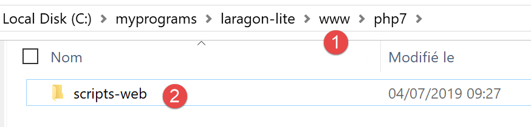

.. |image8| image:: ./chap-17/media/image9.png
   :width: 3.92165in
   :height: 1.08268in
.. |image9| image:: ./chap-17/media/image10.png
   :width: 3.7874in
   :height: 0.65354in
.. |image10| image:: ./chap-17/media/image11.png
   :width: 3.15354in
   :height: 1.72835in
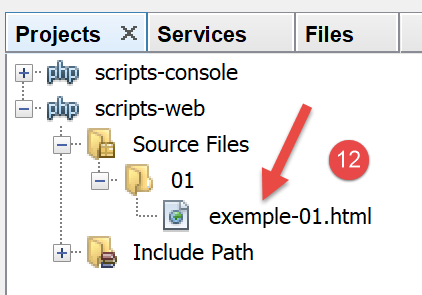
.. |image12| image:: ./chap-17/media/image13.png
   :width: 4.43661in
   :height: 1.4689in

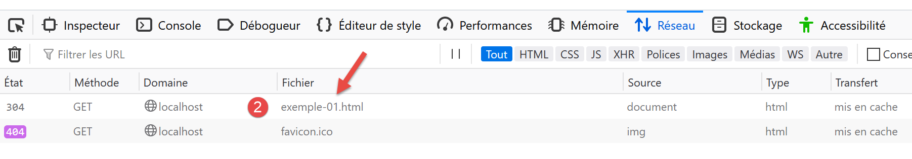
.. |image15| image:: ./chap-17/media/image16.png
   :width: 4.73622in
   :height: 0.60197in
.. |image16| image:: ./chap-17/media/image17.png
   :width: 3.62205in
   :height: 1.11024in
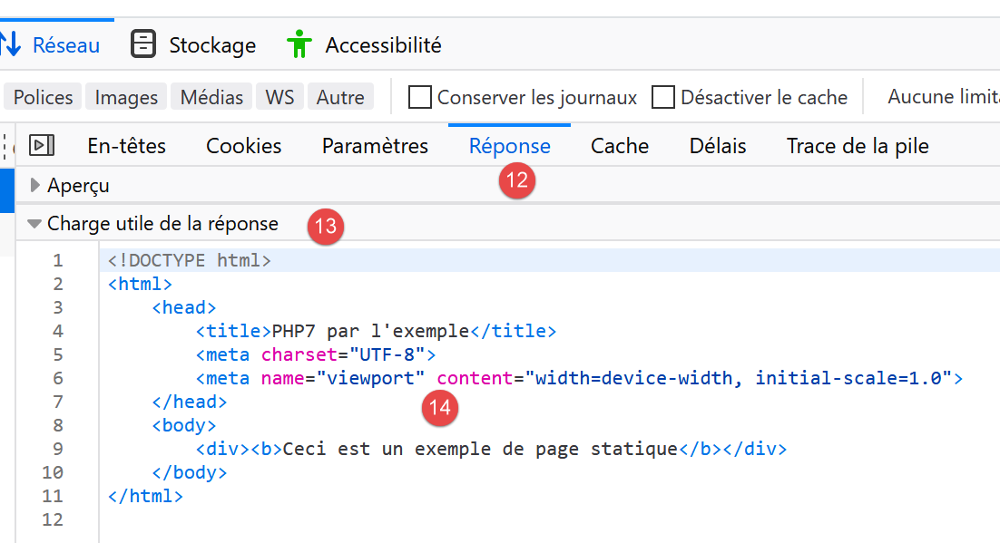
.. |image18| image:: ./chap-17/media/image19.png
   :width: 2.94528in
   :height: 2.42165in
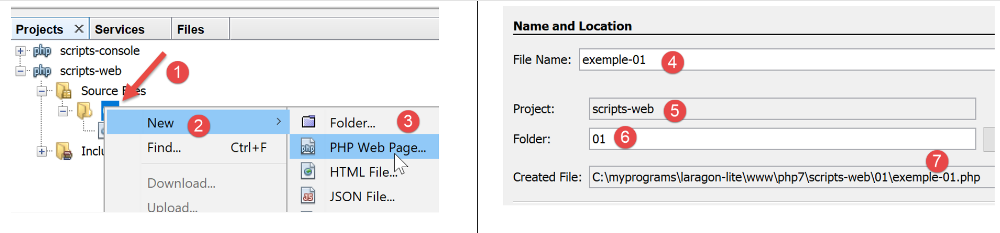
.. |image20| image:: ./chap-17/media/image21.png
   :width: 4.62992in
   :height: 1.07087in

.. |image22| image:: ./chap-17/media/image23.png
   :width: 2.60197in
   :height: 2.40984in
.. |image23| image:: ./chap-17/media/image24.png
   :width: 4.95709in
   :height: 0.3937in

.. |image27| image:: ./chap-17/media/image28.png
   :width: 3.03543in
   :height: 1.9689in

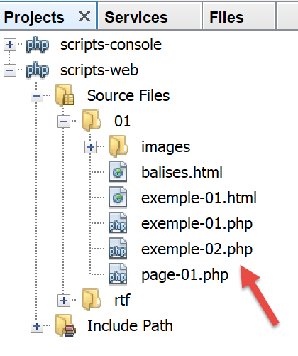

.. |image32| image:: ./chap-17/media/image33.png
   :width: 3.46457in
   :height: 1.62992in

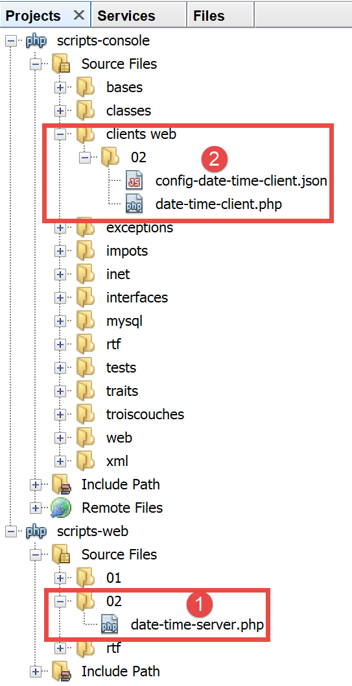
.. |image35| image:: ./chap-17/media/image36.png
   :width: 5.81535in
   :height: 2.92913in
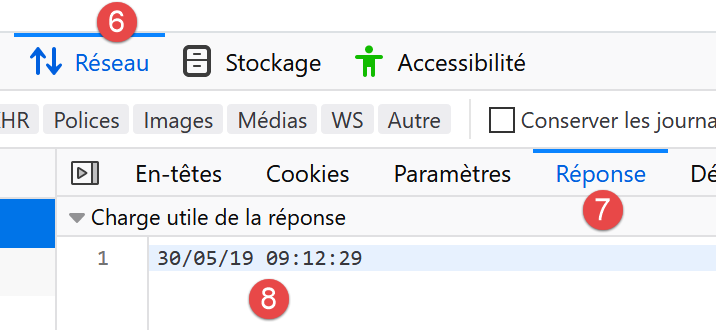
.. |image37| image:: ./chap-17/media/image38.png
   :width: 4.4689in
   :height: 1.67717in

.. |image40| image:: ./chap-17/media/image41.png
   :width: 5.22441in
   :height: 3.37441in

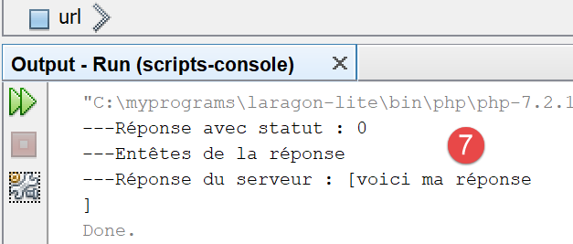
.. |image43| image:: ./chap-17/media/image44.png
   :width: 3.29528in
   :height: 1.15748in
.. |image44| image:: ./chap-17/media/image45.png
   :width: 4.5in
   :height: 3.51181in
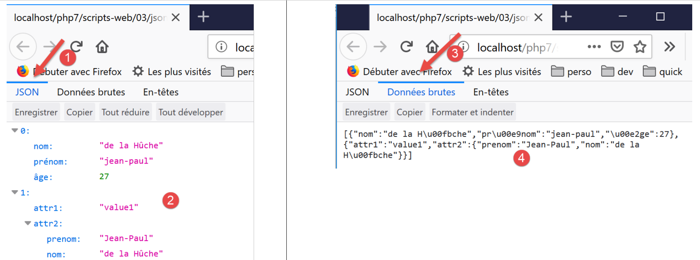
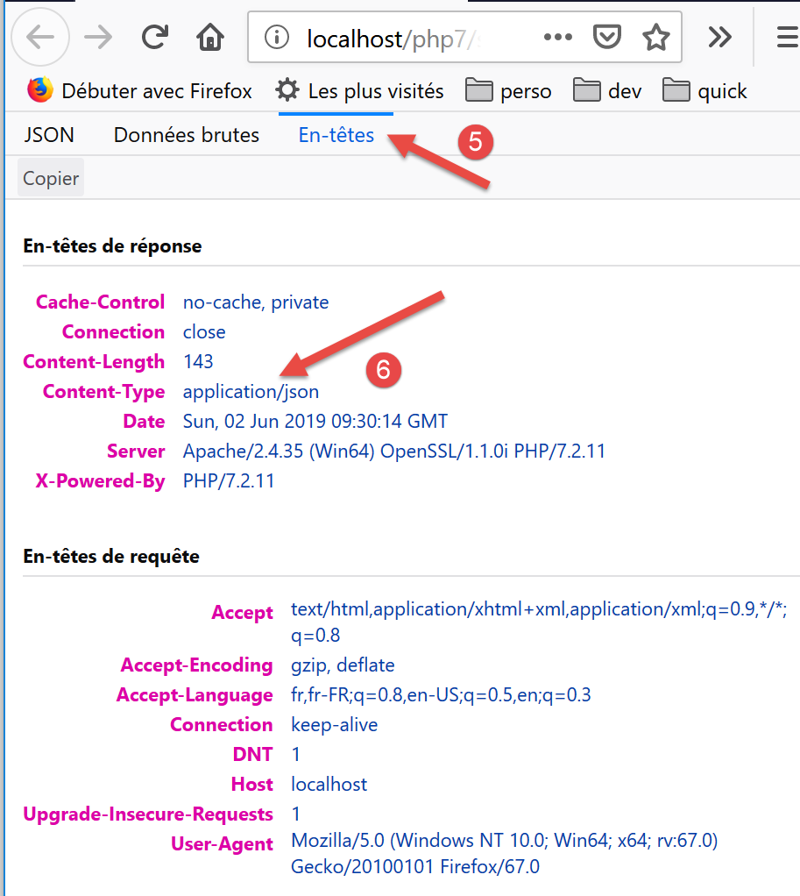
.. |image47| image:: ./chap-17/media/image48.png
   :width: 5.79173in
   :height: 0.47638in
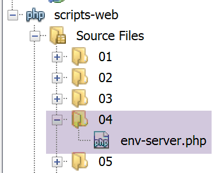
.. |image49| image:: ./chap-17/media/image50.png
   :width: 4.3937in
   :height: 1.40157in
.. |image50| image:: ./chap-17/media/image51.png
   :width: 6.46457in
   :height: 1.70827in

.. |image53| image:: ./chap-17/media/image54.png
   :width: 2.17717in
   :height: 1.70472in

.. |image55| image:: ./chap-17/media/image56.png
   :width: 5.98071in
   :height: 1.81102in

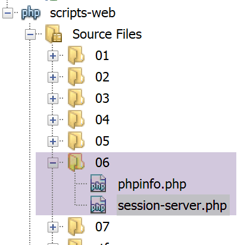
.. |image58| image:: ./chap-17/media/image59.png
   :width: 2.90551in
   :height: 1.33465in
.. |image59| image:: ./chap-17/media/image60.png
   :width: 1.65354in
   :height: 1.72835in
.. |image60| image:: ./chap-17/media/image61.png
   :width: 1.7563in
   :height: 3in
.. |image61| image:: ./chap-17/media/image62.png
   :width: 1.31102in
   :height: 1.6063in
.. |image62| image:: ./chap-17/media/image63.png
   :width: 4.89803in
   :height: 4.01614in
.. |image63| image:: ./chap-17/media/image64.png
   :width: 4.29921in
   :height: 2.29921in
.. |image64| image:: ./chap-17/media/image65.png
   :width: 4.22441in
   :height: 1.73622in
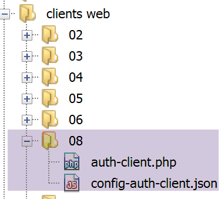
.. |image66| image:: ./chap-17/media/image67.png
   :width: 4.90551in
   :height: 0.74449in

.. |image68| image:: ./chap-17/media/image69.png
   :width: 3.96457in
   :height: 1.70079in
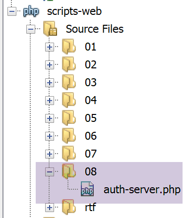
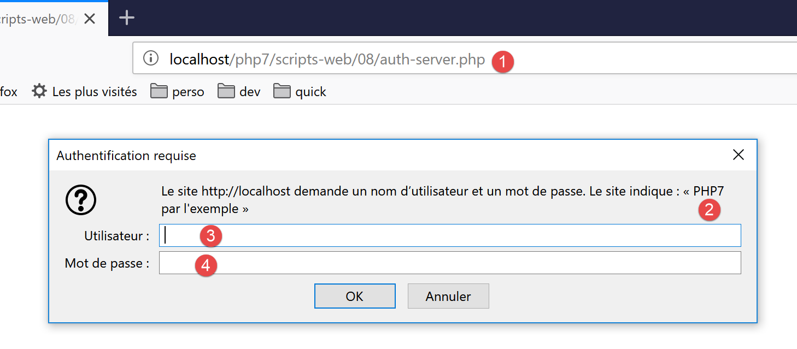
.. |image71| image:: ./chap-17/media/image72.png
   :width: 4.23622in
   :height: 1.47205in
.. |image72| image:: ./chap-17/media/image73.png
   :width: 3.64921in
   :height: 1.84252in

