Services web
============

**Note** : par *service web*, on entend ici tout application web
délivrant des données brutes consommées par un client, un script console
dans les exemples qui vont suivre. On ne s’intéresse pas à une
technologie particulière, REST (**RE**\ presentational **S**\ tate
**T**\ ransfer) ou SOAP (**S**\ imple **O**\ bject **A**\ ccess
**P**\ rotocol) par exemple, qui délivrent des données plus ou moins
brutes dans un format bien défini. REST délivre du jSON alors que pour
SOAP c’est du XML. Chacune de ces technologies décrit précisément la
façon dont le client doit interroger le serveur et la forme que doit
prendre la réponse de celui-ci. Dans ce cours, on sera beaucoup plus
souple quant à la nature de la requête client et celle de la réponse du
serveur. Cependant, les scripts écrits et les outils utilisés sont
proches de ceux de la technologie REST.

Introduction
------------

Les programmes PHP pouvant être exécutés par un serveur WEB, un tel
programme devient un programme serveur pouvant servir plusieurs clients.
Du point de vue du client, appeler un service web revient à demander
l'URL de ce service. Le client peut être écrit avec n'importe quel
langage, notamment en PHP. Dans ce dernier cas, on utilise alors les
fonctions réseau que nous venons de voir. Il nous faut par ailleurs
savoir "converser" avec un service web, c'est-à-dire comprendre le
protocole *http* de communication entre un serveur WEB et ses clients.
C'était le but du paragraphe `lien <#_Le_protocole_HTTP>`__.

Le client web décrit au paragraphe `lien <#_Exemple_6>`__ nous a permis
de découvrir une partie du protocole HTTP.

|image0|

Dans leur version la plus simple, les échanges client / serveur sont les
suivants :

-  le client ouvre une connexion avec le port 80 du serveur web ;

-  il fait une requête concernant un document ;

-  le serveur web envoie le document demandé et ferme la connexion ;

-  le client ferme à son tour la connexion ;

Le document peut être de nature diverse : un texte au format HTML, une
image, une vidéo… Ce peut être un document existant (document statique)
ou bien un document généré à la volée par un script (document
dynamique). Dans ce dernier cas, on parle de programmation web. Le
script de génération dynamique de documents peut être écrit dans divers
langages : PHP, Python, Perl, Java, Ruby, C#, VB.net…

Dans la suite, nous allons utiliser des scripts PHP pour générer
dynamiquement des documents texte.

|image1|

-  en **[1]**, le client ouvre une connexion avec le serveur, demande un
   script PHP, envoie ou non des paramètres à destination de ce script ;

-  en **[2]**, le serveur web fait exécuter le script PHP par
   l'interpréteur PHP. Le script génère un document qui est envoyé au
   client **[3] ;**

-  le serveur clôt la connexion. Le client en fait autant ;

Le serveur web peut traiter plusieurs clients à la fois.

Avec le paquetage logiciel **[Laragon]**, le serveur web est un serveur
Apache, un serveur open source de l'Apache Foundation
(http://www.apache.org/). Dans les applications qui suivent,
**[Laragon]** doit être lancé :

|image2|

Cela lance le serveur web Apache ainsi que le SGBD MySQL.

Les scripts exécutés par le serveur web seront écrits avec l'outil
Netbeans. Nous avons écrit jusqu'à maintenant des scripts PHP exécutés
dans un contexte console :

|image3|

L'utilisateur utilise la console pour demander l'exécution d'un script
PHP et en recevoir les résultats.

Dans les applications client /serveur qui vont suivre :

-  le script du client est exécuté dans un contexte console ;

-  le script du serveur est exécuté dans un contexte web ;

|image4|

Le script PHP du serveur ne peut pas être n'importe où dans le système
de fichiers. En effet, le serveur web cherche dans des endroits précisés
par configuration, les documents statiques et dynamiques qu'on lui
demande. La configuration par défaut de Laragon fait que les documents
sont cherchés dans le dossier *<Laragon>/www* où <*Laragon*> est le
dossier d'installation de Laragon. Ainsi si un client web demande un
document D avec l'URL **[http://localhost/D]**, le serveur web lui
servira le document D de chemin **[<Laragon>/www/D]**.

Dans les exemples qui suivent, nous mettrons les scripts serveur dans le
dossier **[www/php7/scripts-web]**. Si un script serveur s'appelle
*S.php*, il sera demandé au serveur web avec l'URL
**[http://localhost/php7/scripts-web/S.php]**. Le document
**[<Laragon>/www/php7/scripts-web/S.php]** lui sera alors servi.

|image5|

-  en **[1]**, le dossier **[<laragon>/www]** ;

-  en **[2]**, le dossier **[php7/scripts-web]** ;

Pour créer des scripts serveur avec Netbeans, nous procéderons de la
façon suivante :

|image6|

-  en **[1-2]**, nous créons un nouveau projet

-  en **[3-4]**, nous prenons la catégorie **[PHP]** et le projet **[PHP
   Application]**

|image7|

-  en **[5]**, le nom du projet ;

-  en **[6]**, le dossier du projet dans le système de fichiers. Notez
   que celui-ci est dans le dossier **[<laragon>/www]** où il doit
   être ;

-  en **[7-8]**, acceptez les valeurs par défaut proposées ;

-  en **[9-10]**, acceptez les valeurs par défaut proposées. En
   **[10]**, notez que l’URL des scripts que nous placerons dans ce
   projet commencera par le chemin
   **[http://localhost/php7/scripts-web/]** ;

|image8|

-  en **[11]**, des frameworks web écrits en PHP vous sont proposés. Ces
   frameworks sont indispensables dès que l’application web prend un peu
   d’ampleur ;

-  en **[12]**, on peut ajouter des bibliothèques PHP à l’aide de
   l’outil **[Composer]**. Nous avons utilisé cet outil à deux reprises
   dans une fenêtre **[Terminal]** de Laragon :

   -  pour installer la bibliothèque **[SwiftMailer]** qui permet
      d’envoyer des mails ;

   -  pour installer la bibliothèque **[php-mime-mail-parser]** qui
      permet de lire des mails ;

-  en **[13]**, une fois l’assistant de création du projet validé,
   celui-ci apparaît en **[13]** dans l’onglet des projets ;

Ecriture d’une page statique
----------------------------

**Note **: Pour la suite, il faut que **[Laragon]** soit lancé.

Nous allons montrer comment créer une page statique HTML (HyperText
Markup Language) à l’aide de Netbeans :

|image9|

-  en **[1-5]**, nous créons un dossier nommé **[01]** ;

|image10|

|image11|

-  en **[6-12]**, nous créons un fichier HTML **[exemple-01.html]** ;

Le fichier **[exemple-01.html]** est généré prérempli de la façon
suivante (mai 2019) :

.. code-block:: php 
   :linenos:

   <!DOCTYPE html>
   <!--
   To change this license header, choose License Headers in Project Properties.
   To change this template file, choose Tools | Templates
   and open the template in the editor.
   -->
   <html>
       <head>
           <title>TODO supply a title</title>
           <meta charset="UTF-8">
           <meta name="viewport" content="width=device-width, initial-scale=1.0">
       </head>
       <body>
           
TODO write content

       </body>
   </html>

Faisons évoluer son contenu de la façon suivante :

.. code-block:: php 
   :linenos:

   <!DOCTYPE html>
   <html>
       <head>
           <title>PHP7 par l'exemple</title>
           <meta charset="UTF-8">
           <meta name="viewport" content="width=device-width, initial-scale=1.0">
       </head>
       <body>
           
<b>Ceci est un exemple de page statique</b>

       </body>
   </html>

Nous avons changé le titre de la page (ligne 4) ainsi que son contenu
(ligne 9).

Maintenant faisons afficher cette page HTML par le serveur Apache de
Laragon :

|image12|

-  en **[1-2]**, nous faisons afficher la page par le serveur Apache de
   Laragon ;

-  en **[3]**, l’URL de la page affichée ;

-  en **[4]**, le titre que nous avons modifié ;

-  en **[5]**, le contenu que nous avons modifié ;

La page affichée est une page statique : on peut la charger autant de
fois que l’on veut dans le navigateur (F5), c’est toujours le même
contenu qui est affiché.

La plupart des navigateurs donnent accès aux données échangées entre le
client et le serveur, celles qui ont été décrites au paragraphe
`lien <#_Le_protocole_HTTP>`__. Avec le navigateur Firefox (mai 2019),
il faut faire F12 pour avoir accès à ces données :

|image13|

Comme indiqué en **[1]**, rechargeons la page (F5) :

|image14|

-  en **[2]**, le document chargé par le navigateur : nous le
   sélectionnons ;

|image15|

-  en **[5]**, le document à analyser est sélectionné ;

-  en **[3-4]**, nous demandons à voir les échanges client / serveur ;

-  en **[6]**, ces échanges ;

|image16|

-  en **[7]**, on sélectionne l’onglet des entêtes ;

-  en **[8]**, l’URL demandée par le navigateur ;

-  en **[9]**, la commande envoyée au serveur est **[GET
   http://localhost/php7/scripts-web/01/exemple-01.html HTTP/1.1]** ;

-  en **[10]**, les entêtes HTTP envoyés ensuite par le navigateur (le
   client) ;

-  en **[11]**, les entêtes HTTP de la réponse du serveur ;

|image17|

-  en **[12-14]**, la réponse du serveur envoyée après les entêtes
   HTTP ;

-  en **[14]**, on voit que le navigateur client a reçu la page HTML que
   nous avons construite. Il a ensuite interprété ce code pour afficher
   la chose suivante :

|image18|

Création d’une page dynamique en PHP
------------------------------------

Nous écrivons maintenant une page dynamique en PHP :

|image19|

|image20|

-  en **[1-8]**, nous créons une page **[exemple-01.php]** ;

Le fichier **[exemple-01.php]** est généré prérempli de la façon
suivante (mai 2019) :

.. code-block:: php 
   :linenos:

   <!DOCTYPE html>
   <!--
   To change this license header, choose License Headers in Project Properties.
   To change this template file, choose Tools | Templates
   and open the template in the editor.
   -->
   <html>
       <head>
           <meta charset="UTF-8">
           <title></title>
       </head>
       <body>
           <?php
           // put your code here
           ?>
       </body>
   </html>

Nous faisons évoluer le code ci-dessus de la façon suivante :

.. code-block:: php 
   :linenos:

   <!DOCTYPE html>
   <html>
       <head>
           <meta charset="UTF-8">
           <title>Exemple de page dynamique</title>
       </head>
       <body>
           <?php
           // time : nb de millisecondes entre le moment présent et le 01/01/1970
           // format affichage date-heure
           // d : jour sur 2 chiffres
           // m : mois sur 2 chiffres
           // y : année sur 2 chiffres
           // H : heure 0,23
           // I : minutes
           // s: secondes
           print "<b>Date et heure du jour : </b>" . date("d/m/y H:i:s", time());
           ?>
       </body>
   </html>

**Commentaires**

-  ligne 5 : nous avons changé le titre de la page ;

-  ligne 17 : écrit la date et l’heure du moment présent ;

Basiquement, le script PHP ci-dessus écrit l'heure courante sur la
console. Cependant, lorsqu'il est exécuté par un serveur web, le flux de
sortie de l’instruction **[print]** qui est habituellement associé à la
console d’exécution du script est redirigé ici vers la connexion qui lie
le serveur à son client. Donc, dans un contexte web, le script ci-dessus
envoie l'heure courante sous forme de texte au client, ici un
navigateur.

Exécutons le script **[exemple-01.php]** :

|image21|

-  en **[3]**, l’URL demandée au serveur web Apache ;

-  en **[4]**, le titre de la page que nous avons changé ;

-  en **[5]**, le contenu généré par l’instruction **[print]** ;

Nous avons ici une page **dynamique** car si on recharge plusieurs fois
la page dans le navigateur (F5), son contenu change (l’heure change).

Le navigateur a reçu un flux HTML. Pour connaître celui-ci, il faut
faire apparaître le code source de la page dans le navigateur :

|image22|

-  pour avoir le menu **[1]**, cliquer droit sur la page dans le
   navigateur ;

-  en **[2]**, l’URL de la page **[exemple-01.php]** mais préfixée par
   **[view-source :]** **[3]** ;

-  en **[4]**, le contenu HTML que le navigateur a affiché ;

Il faut donc se rappeler qu’un script PHP destiné à être exécuté par un
serveur web doit produire un flux HTML.

Regardons (F12) maintenant les entêtes HTTP envoyés par le serveur au
navigateur client :

|image23|

-  en **[3]**, un entête HTTP qui n’était pas présent lorsqu’on a
   demandé la page statique. Cet entête montre que la réponse du serveur
   a été générée par un script PHP ;

Nous avons vu que la réponse (le flux HTML ici) du serveur pouvait être
générée par un script PHP. Le script peut également générer les entêtes
HTTP et à peu près tous les éléments de la réponse du serveur.

Rudiments du langage HTML
-------------------------

Ce chapitre ne va pas s’appesantir sur la programmation WEB en PHP. Une
application web MVC est développée au paragraphe
`lien <#_Exercice_d’application_–>`__. Ce chapitre s’intéresse plutôt
aux **services web** : des pages PHP qui délivrent, via un serveur web,
des données à destination d’autres clients PHP. Néanmoins il nous a
semblé utile de donner quelques rudiments de HTML au lecteur.

Un navigateur web peut afficher divers documents, le plus courant étant
le document HTML (HyperText Markup Language). Celui-ci est un texte
formaté avec des balises de la forme *<balise>texte</balise>*. Ainsi le
texte *<b>important</b>* affichera le texte *important* en gras. Il
existe des balises seules, telles que la balise *
* qui affiche une
ligne horizontale. Nous ne passerons pas en revue les balises que l'on
peut trouver dans un texte HTML. Il existe de nombreux logiciels WYSIWYG
permettant de construire une page WEB sans écrire une ligne de code
HTML. Ces outils génèrent automatiquement le code HTML d'une mise en
page faite à l'aide de la souris et de contrôles prédéfinis. On peut
ainsi insérer (avec la souris) dans la page un tableau puis consulter le
code HTML généré par le logiciel pour découvrir les balises à utiliser
pour définir un tableau dans une page WEB. Ce n'est pas plus compliqué
que cela. Par ailleurs, la connaissance du langage HTML est
indispensable puisque les applications web dynamiques doivent générer
elles-mêmes le code HTML à envoyer aux clients WEB. Ce code est généré
par programme et il faut bien sûr savoir ce qu'il faut générer pour que
le client ait la page web qu'il désire.

Pour résumer, il n'est nul besoin de connaître la totalité du langage
HTML pour démarrer la programmation web. Cependant cette connaissance
est nécessaire et peut être acquise au travers de l'utilisation de
logiciels WYSIWYG de construction de pages WEB tels que DreamWeaver et
des dizaines d'autres. Une autre façon de découvrir les subtilités du
langage HTML est de parcourir le web et d'afficher le code source des
pages qui présentent des caractéristiques intéressantes et encore
inconnues pour vous.

Considérons l'exemple suivant qui présente quelques éléments qu'on peut
trouver dans un document WEB tels que :

-  un tableau ;

-  une image ;

-  un lien.

|image24|

Un document HTML a la forme générale suivante :

L'ensemble du document est encadré par les balises **<html>…</html>**.
Il est formé de deux parties :

1. **<head>…</head>** : c'est la partie non affichable du document. Elle
   donne des renseignements au navigateur qui va afficher le document.
   On y trouve souvent la balise **<title>…</title>** qui fixe le texte
   qui sera affiché dans la barre de titre du navigateur. On peut y
   trouver d'autres balises notamment des balises définissant les mots
   clés du document, mot clés utilisés ensuite par les moteurs de
   recherche. On peut trouver également dans cette partie des scripts,
   écrits le plus souvent en javascript ou vbscript et qui seront
   exécutés par le navigateur.

2. **<body attributs>…</body>** : c'est la partie qui sera affichée par
   le navigateur. Les balises HTML contenues dans cette partie indiquent
   au navigateur la forme visuelle "souhaitée" pour le document. Chaque
   navigateur va interpréter ces balises à sa façon. Deux navigateurs
   peuvent alors visualiser différemment un même document web. C'est
   généralement l'un des casse-têtes des concepteurs web.

Le code HTML de notre document exemple est le suivant :

.. code-block:: php 
   :linenos:

   <!DOCTYPE html>
   <html xmlns="http://www.w3.org/1999/xhtml">
       <head>
           <meta http-equiv="Content-Type" content="text/html; charset=utf-8" />
           <title>Quelques balises HTML</title>
       </head>

       <body style="background-image: url(images/standard.jpg)">
           <h1 style="text-align: left">Quelques balises HTML</h1>
           

           <table border="1">
               <thead>
                   <tr>
                       <th>Colonne 1</th>
                       <th>Colonne 2</th>
                       <th>Colonne 3</th>
                   </tr>
               </thead>
               <tbody>
                   <tr>
                       <td>cellule(1,1)</td>
                       <td style="text-align: center;">cellule(1,2)</td>
                       <td>cellule(1,3)</td>
                   </tr>
                   <tr>
                       <td>cellule(2,1)</td>
                       <td>cellule(2,2)</td>
                       <td>cellule(2,3</td>
                   </tr>
               </tbody>
           </table>
             
           <table border="0">
               <tr>
                   <td>Une image</td>
                   <td>
                       </td>
               </tr>
               <tr>
                   <td>Le site de Polytech'Angers</td>
                   <td><a href="http://www.polytech-angers.fr/fr/index.html">ici</a></td>
               </tr>
           </table>
       </body>
   </html>

+-------------------+-------------------------------------------------+
| Elément           | balises et exemples HTML                        |
+===================+=================================================+
| titre du document | <title>Quelques balises HTML</title> (ligne 5)  |
|                   |                                                 |
|                   | le texte **[Quelques balises HTML]** apparaîtra |
|                   | dans la barre de titre du navigateur qui        |
|                   | affichera le document                           |
+-------------------+-------------------------------------------------+
| barre horizontale | *
* : affiche un trait horizontal (ligne   |
|                   | 10)                                             |
+-------------------+-------------------------------------------------+
| tableau           | *<table attributs>….</table>* : pour définir le |
|                   | tableau (lignes 12, 32)                         |
|                   |                                                 |
|                   | *<thead>…</thead>* : pour définir les entêtes   |
|                   | des colonnes (lignes 13, 19)                    |
|                   |                                                 |
|                   | *<tbody>…</tbody>* : pour définir le contenu du |
|                   | tableau (ligne 20, 31)                          |
|                   |                                                 |
|                   | *<tr attributs>…</tr>* : pour définir une ligne |
|                   | (lignes 21, 25)                                 |
|                   |                                                 |
|                   | *<td attributs>…</td>* : pour définir une       |
|                   | cellule (ligne 22)                              |
|                   |                                                 |
|                   | **exemples** :                                  |
|                   |                                                 |
|                   | *<table border="1">…</table>* : l'attribut      |
|                   | border définit l'épaisseur de la bordure du     |
|                   | tableau                                         |
|                   |                                                 |
|                   | *<td style="text-align:                         |
|                   | center;">cellule(1,2)</td>* (ligne 23) :        |
|                   | définit une cellule dont le contenu sera        |
|                   | **cellule(1,2)**. Ce contenu sera centré        |
|                   | horizontalement (text-align :center).           |
+-------------------+-------------------------------------------------+
| image             | **   |
|                   | (ligne 38) : définit une image sans bordure     |
|                   | (border=0") dont le fichier source est          |
|                   | **[images/cerisier.jpg]** sur le serveur web    |
|                   | (src="images/cerisier.jpg"). Ce lien se trouve  |
|                   | sur un document web obtenu avec l'URL           |
|                   | **http://lo                                     |
|                   | calhost/php7/scripts-web/01**\ */balises.html*. |
|                   | Aussi, le navigateur demandera-t-il l'URL       |
|                   | **http://localhos                               |
|                   | t/php7/scripts-web/01**\ */images/cerisier.jpg* |
|                   | pour avoir l'image référencée ici.              |
+-------------------+-------------------------------------------------+
| lien              | *<a                                             |
|                   | href="http:/                                    |
|                   | /www.polytech-angers.fr/fr/index.html">ici</a>* |
|                   | (ligne 42) : fait que le texte *ici* sert de    |
|                   | lien vers l'URL                                 |
|                   | *http://www.polytech-angers.fr/fr/index.html*.  |
+-------------------+-------------------------------------------------+
| fond de page      | *<body style="background-image:                 |
|                   | url(images/standard.jpg)"> (ligne 8)* : indique |
|                   | que l'image qui doit servir de fond de page se  |
|                   | trouve à l'URL **[images/standard.jpg]** du     |
|                   | serveur WEB. Dans le contexte de notre exemple, |
|                   | le navigateur demandera l'URL                   |
|                   | *http://loc                                     |
|                   | alhost/php7/scripts-web/01/images/standard.jpg* |
|                   | pour obtenir cette image de fond.               |
+-------------------+-------------------------------------------------+

On voit dans ce simple exemple que pour construire l'intéralité du
document, le navigateur doit faire trois requêtes au serveur :

1. *http://localhost/php7/scripts-web/01/images/balises.html* pour avoir
   le source HTML du document

2. *http://localhost/php7/scripts-web/01/images/cerisier.jpg* pour avoir
   l'image *cerisier.jpg*

3. *http://localhost/php7/scripts-web/01/images/standard.jpg* pour
   obtenir l'image de fond *standard.jpg*

C’est ce que montrent les échanges réseau entre le client et le serveur
(F12 dans le navigateur) :

|image25|

-  en **[3-5]**, on voit les trois requêtes faites par le navigateur ;

Rendre dynamique une page statique
----------------------------------

Montrons comment nous pouvons dynamiser la page HTML
**[exemple-01.html]**. Copions le contenu

|image26|

Nous avons recopié le contenu de **[exemple-01.html]** dans le fichier
**[page-01.php]**. Si nous exécutons **[2]** ce script web, nous
obtenons la chose suivante dans le navigateur :

|image27|

-  en **[3]**, l’URL demandée ;

-  en **[4]**, le titre de la page ;

-  en **[5]**, le contenu de la page ;

Si on fait afficher le code reçu par le navigateur, on trouve ceci :

|image28|

-  en **[7]**, on a le code HTML placé dans le script
   **[exemple-01.php]**

L’interpréteur PHP a interprété le script **[page-01.php]** et a produit
le même flux HTML que la page statique **[exemple-01.html]**. Dans le
script **[page-01.php]**, il n’y avait pas de PHP, uniquement du HTML.
On apprend ainsi une chose : lorsque l’interpréteur PHP trouve du HTML
dans un script PHP, il n’y touche pas et l’envoie tel quel au client.

Maintenant mettons quelques instructions PHP dans le script
**[page-01.php]** pour que l’interpréteur PHP ait quelque chose à
faire :

.. code-block:: php 
   :linenos:

   <!DOCTYPE html>
   <html>
       <head>
           <title><?php print $page->title ?></title>
           <meta charset="UTF-8">
           <meta name="viewport" content="width=device-width, initial-scale=1.0">
       </head>
       <body>
           
<b><?php print $page->contents ?></b>

       </body>
   </html>

Lignes 4 et 9 on a mis du code PHP pour générer dynamiquement le titre
et le contenu de la page. On fait ici l’hypothèse que la variable
**[$page]** est un objet qui a les données à afficher.

Si nous exécutons ce nouveau code, on a le résultat suivant dans le
navigateur :

|image29|

-  en **[1]**, l’URL demandée ;

-  en **[2]**, le titre de la page n’a pu être affiché parce que la
   variable **[$page]** n’était pas définie ;

-  en **[3]**, pareil pour le contenu ;

Maintenant, écrivons le script web **[exemple-02.php]** suivant :

|image30|

Le script **[exemple-02.php]** sera le suivant :

.. code-block:: php 
   :linenos:

   <?php

   // on définit les éléments de la page à afficher
   $page=new \stdclass();
   $page->title="Un nouveau titre";
   $page->contents="Un nouveau contenu généré dynamiquement";
   // on fait afficher [page-01]
   require_once "page-01.php";

-  lignes 4-6 : on définit l’objet **[$page]** ;

-  ligne 8 : on inclut le script **[page-01.php]**. Le code de ce script
   va être interprété à son tour :

   -  la variable **[$page]** est maintenant définie et l’interpréteur
      PHP va l’utiliser ;

   -  le code HTML de **[page-01.php]** va être envoyé tel quel au
      client ;

   -  les résultats des opérations PHP **[print]** vont être inclus dans
      le flux texte envoyé au client ;

Maintenant si nous exécutons le script web **[exemple-02.php]**, nous
obtenons la chose suivante dans le navigateur :

|image31|

Si nous visualisons le contenu texte reçu par le navigateur :

|image32|

-  les codes PHP qui étaient en **[2]** et **[3]** ont été remplacés par
   les résultats des deux commandes **[print]** ;

De cet exemple, on retiendra deux choses :

-  les pages HTML destinées au navigateur peuvent être isolées dans des
   scripts PHP ne contenant que ce code HTML et quelques partie
   dynamiques générées par du code PHP. Il doit y avoir le moins de PHP
   possible dans ces pages ;

-  toute la logique qui génère les données dynamiques incluses dans les
   pages HTML doit être isolée dans des scripts PHP purs, ne comportant
   aucun code de présentation des pages (HTML, CSS, Javascript…) ;

Cela autorise une séparation des tâches :

-  la tâche de réalisation des pages web à afficher (HTML, CSS,
   Javascript…) ;

-  la tâche de la logique de l’application web que l’on construit. Cette
   logique pourra être implémentée avec une architecture trois couches,
   exactement comme nous l’avons fait avec les scripts console ;

Par la suite, nous allons construire des scripts web particuliers ;

-  ils n’enverront que des données au client et aucune décoration (HTML,
   CSS, Javascript). Ce seront donc des serveurs de données plutôt que
   des page web ;

-  les clients de ces scripts web seront des scripts console qui se
   chargeront de récupérer les données envoyées par le serveur et d’en
   faire quelque chose ;

Application client/ serveur de date/heure
-----------------------------------------

Nous nous plaçons maintenant dans la configuration suivante :

|image33|

Nous allons écrire :

-  un script web **[1]** qui envoie à son client la date et l’heure du
   moment présent ;

-  un script console **[2]** qui sera le client du script web : il va
   récupérer la date et heure envoyées par le script web et les afficher
   sur la console ;

|image34|

-  en **[1]**, le script web **[date-time-server.php]** ;

-  en **[2]**, le script console **[date-time-client]** client du script
   web ;

Le script serveur
~~~~~~~~~~~~~~~~~

Nous avons déjà écrit un script web générant la date et l’heure du
moment présent au paragraphe
`lien <#création-dune-page-dynamique-en-php>`__. C’était le script
**[exemple-01.php]** suivant :

.. code-block:: php 
   :linenos:

   <!DOCTYPE html>
   <html>
       <head>
           <meta charset="UTF-8">
           <title>Exemple de page dynamique</title>
       </head>
       <body>
           <?php
           // time : nb de millisecondes depuis 01/01/1970
           // format affichage date-heure
           // d: jour sur 2 chiffres
           // m: mois sur 2 chiffres
           // y : année sur 2 chiffres
           // H : heure 0,23
           // i : minutes
           // s: secondes
           print "<b>Date et heure du jour : </b>" . date("d/m/y H:i:s", time());
           ?>
       </body>
   </html>

Nous avons dit que nous allions écrire des serveurs de données : des
données brutes sans habillage HTML. Le script serveur
**[date-time-server.php]** sera alors le suivant :

.. code-block:: php 
   :linenos:

   <?php

   // on fixe l'entête HTP [Content-Type]
   header('Content-Type: text/plain; charset=UTF-8');
   //
   // on envoie date et heure
   // time : nb de millisecondes depuis 01/01/1970
   // format affichage date-heure
   // d: jour sur 2 chiffres
   // m: mois sur 2 chiffres
   // y : année sur 2 chiffres
   // H : heure 0,23
   // i : minutes
   // s: secondes
   print date("d/m/y H:i:s", time());

-  ligne 4 : on fixe l’entête HTTP **[Content-Type]** qui dit au client
   la nature du document qu’il va recevoir. Jusqu’à maintenant, le
   **[Content-Type]** était : **[Content-Type: text/html;
   charset=UTF-8]**. Ici, nous indiquons au client que le document est
   du texte sans habillage HTML. Ce n’est pas important pour notre
   client console qui ne cherchera pas à exploiter cet entête. C’est
   plus important pour les navigateurs clients qui eux exploitent cet
   entête ;

Exécutons ce script serveur :

|image35|

Si nous examinons dans le navigateur la réponse du serveur (F12), nous
voyons en **[5]** l’entête HTTP que le script serveur a fixé et en
**[8]**, le document texte reçu ;

|image36|

Le script client
~~~~~~~~~~~~~~~~

Au paragraphe `lien <#_Le_protocole_HTTP>`__ nous avons développé
plusieurs clients HTTP. Nous pourrions les utiliser pour récupérer le
document texte envoyé par le script serveur **[date-time-server.php]**.
Nous n’allons pas le faire. Comme nous l’avons fait pour les protocole
SMTP et IMAP, nous allons utiliser une bibliothèque tierce, à savoir le
composant **[HttpClient]** du framework Symfony
**[https://symfony.com/doc/master/components/http_client.html]**.

Comme pour les deux précédentes bibliothèques, on utilise l’outil
**[Composer]** pour installer le composant **[HttpClient]** de Symfony.
Dans une fenêtre **[Terminal]** de Laragon (cf paragraphe
`lien <#_Installation_de_Laragon>`__), on tape la commande suivante :

|image37|

-  en **[3]**, vérifiez que vous êtes positionné sur le dossier
   **[<laragon>/www/]** où <laragon> est le dossier d’installation de
   Laragon ;

-  en **[4]**, la commande **[composer]** qui installe la bibliothèque
   **[HttpClient]** de Symfony ;

-  en **[5]**, rien n’est installé car la bibliothèque **[HttpClient]**
   avait déjà été installée sur ce poste ;

-  en **[6-7]**, de nouveaux dossiers apparaissent dans
   **[<laragon>/www/vendor/symfony]** ;

A la place de **[5]**, vous devriez avoir quelque chose comme suit :

.. code-block:: php 
   :linenos:

   C:\myprograms\laragon-lite\www
   ? composer require symfony/http-client
   Using version ^4.3 for symfony/http-client
   ./composer.json has been updated
   Loading composer repositories with package information
   Updating dependencies (including require-dev)
   Package operations: 4 installs, 0 updates, 0 removals
     - Installing symfony/polyfill-php73 (v1.11.0): Downloading (100%)
     - Installing symfony/http-client-contracts (v1.1.1): Downloading (100%)
     - Installing psr/log (1.1.0): Loading from cache
     - Installing symfony/http-client (v4.3.0): Downloading (100%)
   Writing lock file
   Generating autoload files

Assurez-vous que le dossier **[<laragon>/www/vendor]** fait partie de la
branche **[Include Path]** de votre projet (cf paragraphe
`lien <#_Installation_de_l'IDE>`__) :

|image38|

Ceci fait, nous pouvons écrire le script console
**[date-time-client.php]** :

|image39|

Le script console **[date-time-client.php]** exploitera le fichier jSON
**[config-date-time-client.json]** suivant :

.. code-block:: php 
   :linenos:

   {
       "url": "http://localhost/php7/scripts-web/02/date-time-server.php"
   }

-  ligne 2 : l’URL du script serveur ;

Le script client **[date-time-client.php]** sera le suivant :

.. code-block:: php 
   :linenos:

   <?php

   // client du service date / heure
   //
   // gestion des erreurs
   //ini_set("error_reporting", E_ALL & ~ E_WARNING & ~E_DEPRECATED & ~E_NOTICE);
   //ini_set("display_errors", "off");
   //
   // dépendances
   require_once 'C:/myprograms/laragon-lite/www/vendor/autoload.php';
   use Symfony\Component\HttpClient\HttpClient;

   // la configuration du client
   const CONFIG_FILE_NAME = "config-date-time-client.json";

   // on récupère la configuration
   if (!file_exists(CONFIG_FILE_NAME)) {
     print "Le fichier de configuration [" . CONFIG_FILE_NAME . "] n'existe pas\n";
     exit;
   }
   if (!$config = \json_decode(\file_get_contents(CONFIG_FILE_NAME), true)) {
     print "Erreur lors de l'exploitation du fichier de configuration jSON [" . CONFIG_FILE_NAME . "]\n";
     exit;
   }

   // on crée un client HTTP
   $httpClient = HttpClient::create();

   try {
     // on fait la requête
     $response = $httpClient->request('GET', $config['url']);
     // statut de la réponse
     $statusCode = $response->getStatusCode();
     print "---Réponse avec statut : $statusCode\n";
     // on récupère les entêtes
     print "---Entêtes de la réponse\n";
     $headers = $response->getHeaders();
     foreach ($headers as $type => $value) {
       print "$type: " . $value[0] . "\n";
     }
     // on récupère le corps de la réponse
     $content = $response->getContent();
     // on l'affiche
     print "---Réponse du serveur : [$content]\n";
   } catch (TypeError | RuntimeException $ex) {
     // on affiche l'erreur
     print "Erreur de communication avec le serveur : " . $ex->getMessage() . "\n";
     exit;
   }

**Commentaires**

-  ligne 10 : comme nous l’avions fait pour les bibliothèques
   précédentes, nous chargeons le fichier
   **[<laragon>/www/vendor/autoload.php]** ;

-  ligne 11 : nous déclarons la classe **[HttpClient]** que nous allons
   utiliser ;

-  lignes 13-24 : on récupère la configuration du script dans le
   dictionnaire **[$config]** ;

-  ligne 27 : on crée un objet de type **[HttpClient]** ;

-  ligne 31 : on demande l’URL du script serveur à l’aide d’une commande
   GET : **[GET URL HTTTP/1.1]**. Cette opération est asynchrone.
   L’exécution se poursuit en ligne 33 sans attendre que la réponse soit
   obenue ;

-  ligne 33 : on demande le statut de la réponse. Ce statut se trouve
   dans le 1\ :sup:`er` entête HTTP renvoyé par le serveur. Ainsi si cet
   entête est **[HTTP/1.1 200 OK]**, le statut de la réponse est 200.
   Cette opération est bloquante : on n’en revient que lorsque le client
   a reçu toute la réponse du serveur ;

-  ligne 37 : on demande les entêtes HTTP de la réponse ;

-  ligne 42 : on demande le document renvoyé par le serveur : on sait
   que ce document est ici un texte.

-  lignes 45-49 : en cas d’erreur, on affiche le message d’erreur ;

Lorsqu’on exécute le script client (il faut que Laragon soit lancé pour
que le script serveur puisse être atteint), on obtient le résultat
suivant sur la console :

.. code-block:: php 
   :linenos:

   ---Réponse avec statut : 200
   ---Entêtes de la réponse
   date: Thu, 30 May 2019 14:42:03 GMT
   server: Apache/2.4.35 (Win64) OpenSSL/1.1.0i PHP/7.2.11
   x-powered-by: PHP/7.2.11
   content-length: 17
   content-type: text/plain; charset=UTF-8
   ---Réponse du serveur : [30/05/19 14:42:03]

On récupère bien la date et l’heure du moment présent en ligne 8.

On peut avoir la curiosité de savoir ce qu’à envoyé le script client au
serveur. Pour cela nous allons utiliser notre serveur TCP générique (cf
paragraphe `lien <#_Utilitaires_TCP>`__) :

|image40|

-  en **[1]**, le dossier des utilitaires ;

-  en **[2]**, le serveur TCP est lancé sur le port 100 ;

-  en **[3]**, attente d’une commande tapée au clavier ;

Nous modifions le fichier de configuration du script
**[date-time-client.php]** :

.. code-block:: php 
   :linenos:

   {
       "url": "http://localhost:100/php7/scripts-web/02/date-time-server.php"
   }

Cette fois-ci, le client contacte le serveur **[localhost]** sur le port
100. C’est donc notre serveur TCP générique qui va être sollicité.
Lorsque nous exécutons le script console **[date-time-client.php]**, la
console du serveur TCP générique évolue de la façon suivante :

|image41|

-  en **[3]**, la commande HTTP GET construite par le script client ;

-  en **[4]**, la signature du script console ;

-  en **[5]**, la réponse du serveur au script client. On notera que ce
   n’est pas une réponse HTTP valide :

   -  il devrait y avoir des entêtes HTTP ;

   -  puis une ligne vide ;

   -  puis le document texte envoyé au client ;

-  en **[6]**, on ferme la communication avec le script client pour que
   celui-ci détecte qu’il a eu la totalité de la réponse ;

Côté script client, on a l’affichage console suivant :

|image42|

-  en **[7]**, ce qu’a reçu le client Symfony ;

Le script serveur – version 2
~~~~~~~~~~~~~~~~~~~~~~~~~~~~~

De base, les fonctions PHP pour écrire un script web ne sont pas
orientées objet. Côté serveur, on est alors amenés à mélanger classes et
fonctions PHP classiques. Pour avoir une écriture plus homogène, nous
allons utiliser la bibliothèque **[HttpFoundation]** du framework
Symfony. Elle a encapsulé toutes les fonctions PHP classiques pour un
service web dans un système de classes et interfaces. La documentation
de la bibliothèque est disponible à l’URL
**[https://symfony.com/doc/current/components/http_foundation.html]**
(mai 2019).

Pour installer la bibliothèque, nous procédons de la façon suivante dans
un terminal Laragon (cf paragraphe
`lien <#_Installation_de_Laragon>`__) :

|image43|

-  **[2-3]** : assurez-vous d’être positionné dans le dossier
   **[<laragon>/www]** ;

-  **[4]** : la commande **[composer]** qui va installer la bibliothèque
   **[HttpFoundation]** ;

-  **[5]** : sur cet exemple, la bibliothèque était déjà installée ;

A la première installation, vous devriez avoir des logs console
ressemblant à ceci :

.. code-block:: php 
   :linenos:

   C:\myprograms\laragon-lite\www
   ? composer require symfony/http-foundation
   Using version ^4.3 for symfony/http-foundation
   ./composer.json has been updated
   Loading composer repositories with package information
   Updating dependencies (including require-dev)
   Package operations: 2 installs, 0 updates, 0 removals
     - Installing symfony/mime (v4.3.0): Downloading (100%)
     - Installing symfony/http-foundation (v4.3.0): Downloading (100%)
   Writing lock file
   Generating autoload files

La seconde version du serveur web **[date-time-server-2.php]** est la
suivante :

.. code-block:: php 
   :linenos:

   <?php

   // usage des bibliothèques de Symfony

   // dépendances
   require_once 'C:/myprograms/laragon-lite/www/vendor/autoload.php';
   use Symfony\Component\HttpFoundation\Response;

   // on fixe l'entête Content-Type
   $response=new Response();
   $response->headers->set("content-type","text/plain");
   $response->setCharset("utf-8");

   // on fixe le contenu de la réponse
   //
   // on envoie date et heure
   // time : nb de millisecondes depuis 01/01/1970
   // format affichage date-heure
   // d: jour sur 2 chiffres
   // m: mois sur 2 chiffres
   // y : année sur 2 chiffres
   // H : heure 0,23
   // i : minutes
   // s: secondes
   $response->setContent(date("d/m/y H:i:s", time()));

   // on envoie la réponse
   $response->send();

**Commentaires**

-  ligne 7 : la classe **[Response]** de la bibliothèque
   **[HttpFoundation]** de Symfony gère la totalité de la réponse aux
   clients du service web ;

-  ligne 10 : création d’une instance de la classe **[Response]** ;

-  ligne 11 : on indique que la réponse est de type **[text/plain]** ;

-  ligne 12 : la réponse est du texte UTF-8 ;

-  ligne 25 : on fixe le document de la réponse, ce qu’a demandé le
   client ;

-  ligne 28 : on envoie la réponse au client ;

Le script client – version 2
~~~~~~~~~~~~~~~~~~~~~~~~~~~~

Le script client ne change pas. On change seulement son fichier de
configuration **[config-date-time-client.json]** :

.. code-block:: php 
   :linenos:

   {
       "url": "http://localhost/php7/scripts-web/02/date-time-server-2.php"
   }

Les résultats sont les mêmes que dans la version 1.

Un serveur de données jSON
--------------------------

La réponse d’un script web peut être composée de plusieurs données qu’on
peut rassembler dans des tableaux et des objets. Le script peut alors
envoyer ces divers éléments au sein d’une chaîne jSON que le client
décodera.

|image44|

.. _le-script-serveur-1:

Le script serveur
~~~~~~~~~~~~~~~~~

Le script **[json-server.php]** utilise la classe **[Personne]**
suivante :

.. code-block:: php 
   :linenos:

   <?php

   namespace Modèles;

   class Personne implements \JsonSerializable {
     // attributs
     private $nom;
     private $prénom;
     private $âge;

     // conversion d'un tableau associatif vers un objet [Personne]
     public function setFromArray(array $assoc): Personne {
       // on initialise l'objet courant avec le tableau associatif
       foreach ($assoc as $attribute => $value) {
         $this->$attribute = $value;
       }
       // résultat
       return $this;
     }

     // getters et setters
     public function getNom() {
       return $this->nom;
     }

     public function getPrénom() {
       return $this->prénom;
     }

     public function setNom($nom) {
       $this->nom = $nom;
       return $this;
     }

     public function setPrénom($prénom) {
       $this->prénom = $prénom;
       return $this;
     }

     public function getÂge() {
       return $this->âge;
     }

     public function setÂge($âge) {
       $this->âge = $âge;
       return $this;
     }

     // toString
     public function __toString(): string {
       return "Personne [$this->prénom, $this->nom, $this->âge]";
     }

     // implémente l'interface JsonSerializable
     public function jsonSerialize(): array {
       // on rend un tableau associatif avec pour clés les attributs de l'objet
       // ce tableau pourra ensuite être encodé en jSON
       return get_object_vars($this);
     }

     // conversion d'un jSON vers un objet [Personne]
     public static function jsonUnserialize(string $json): Personne {
       // on crée une personne à partir de la chaîne jSON
       return (new Personne())->setFromArray(json_decode($json, true));
     }

   }

**Commentaires**

-  ligne 5 : la classe implémente l’interface PHP
   **[JsonSerializable]**. Cela lui impose d’implémenter la méthode
   **[jsonSerialize]** des lignes 55-59. La méthode doit rendre un
   tableau associatif qui devra être sérialisé en jSON. Lorsqu’on
   utilise l’expression **[json_encode($personne)]**, la fonction
   **[json_encode]** regarde si la classe **[Personne]** implémente
   l’interface **[JsonSerializable]**. Si oui, l’expression devient
   **[json_encode($personne→serialize())]** ;

-  lignes 12-19 : la classe n’a pas de constructeur mais un
   initialiseur. La classe **[Personne]** peut être alors instanciée par
   l’expression **[(new Personne())→setFromArray($array)]**. On peut
   avoir divers types d’initialiseurs alors qu’on ne peut avoir qu’un
   constructeur. Ces initialiseurs permettent divers modes
   d’instanciation du type **[(new Personne())→initialiseuri(…)]** ;

-  lignes 62-65 : la fonction statique **[jsonUnserialize]** permet de
   créer un objet **[Personne]** à partir de sa chaîne jSON ;

Le script **[json-server.php]** sera le suivant :

.. code-block:: php 
   :linenos:

   <?php

   // dépendances
   require_once __DIR__ . "/Personne.php";
   use \Modèles\Personne;
   require_once 'C:/myprograms/laragon-lite/www/vendor/autoload.php';
   use \Symfony\Component\HttpFoundation\Response;

   // on fixe l'entête Content-Type et la bibliothèque de caractères utilisée
   $response = new Response();
   $response->headers->set("content-type", "application/json");
   $response->setCharset("utf-8");

   // on crée un objet Personne
   $personne = (new Personne())->setFromArray([
     "nom" => "de la Hûche",
     "prénom" => "jean-paul",
     "âge" => 27]);
   // un tableau associatif
   $assoc = ["attr1" => "value1",
     "attr2" => [
       "prenom" => "Jean-Paul",
       "nom" => "de la Hûche"
     ]
   ];
   // le contenu de la réponse est du jSON
   $response->setContent(json_encode([$personne, $assoc]));

   // envoi de la réponse
   $response->send();

**Commentaires**

-  lignes 4-5 : on importe la classe **[Personne]** ;

-  ligne 11 : on indique que le document sera de type
   **[application/json]**. A la réception de cet entête, les navigateurs
   afficheront une mise en forme de la chaîne jSON plutôt que d’afficher
   du texte brut ;

-  ligne 12 : la chaîne jSON contiendra des caractères UTF-8 ;

-  lignes 15-18 : on crée un objet **[Personne]** ;

-  lignes 20-25 : on crée un tableau associatif à deux niveaux ;

-  ligne 27 : on envoie au client la chaîne jSON d’un tableau :

   -  l’élément **[$personne]** sera sérialisée en jSON grâce à sa
      méthode **[jsonSerialize]** ;

   -  l’élemént **[$assoc]** sera nativement sérialisé en jSON ;

Si on exécute ce script serveur (Laragon doit être lancé), on obtient la
réponse suivante dans un navigateur :

|image45|

|image46|

**Commentaires**

-  en **[2]**, la réponse jSON mise en forme ;

-  en **[4]**, la réponse jSON brute. On remarquera l’encodage des
   caractères accentués ;

-  en **[6]**, c’est le type de contenu **[application/json]** envoyé
   par le serveur qui a conduit le navigateur à faire cette mise en
   forme ;

Le client
~~~~~~~~~

|image47|

Le client **[json-client.php]** est configuré par le fichier jSON
**[config-json-client.json]** suivant :

.. code-block:: php 
   :linenos:

   {
       "url": "http://localhost/php7/scripts-web/03/json-server.php"
   }

Le script **[json-client.php]** est le suivant :

.. code-block:: php 
   :linenos:

   <?php

   // client d'un service jSON
   //
   // gestion des erreurs
   //ini_set("error_reporting", E_ALL & ~ E_WARNING & ~E_DEPRECATED & ~E_NOTICE);
   //ini_set("display_errors", "off");
   //
   // dépendances
   require_once 'C:/myprograms/laragon-lite/www/vendor/autoload.php';
   use Symfony\Component\HttpClient\HttpClient;
   require_once __DIR__ . "/Personne.php";
   use \Modèles\Personne;

   // la configuration du client
   const CONFIG_FILE_NAME = "config-json-client.json";

   // on récupère la configuration
   if (!file_exists(CONFIG_FILE_NAME)) {
     print "Le fichier de configuration [" . CONFIG_FILE_NAME . "] n'existe pas\n";
     exit;
   }
   if (!$config = \json_decode(\file_get_contents(CONFIG_FILE_NAME), true)) {
     print "Erreur lors de l'exploitation du fichier de configuration jSON [" . CONFIG_FILE_NAME . "]\n";
     exit;
   }

   // on crée un client HTTP
   $httpClient = HttpClient::create();

   try {
     // on fait la requête
     $response = $httpClient->request('GET', $config['url']);
     // statut de la réponse
     $statusCode = $response->getStatusCode();
     print "---Réponse avec statut : $statusCode\n";
     // on récupère les entêtes
     print "---Entêtes de la réponse\n";
     $headers = $response->getHeaders();
     foreach ($headers as $type => $value) {
       print "$type: " . $value[0] . "\n";
     }
     // on récupère le corps jSON de la réponse
     list($personne, $assoc) = json_decode($response->getContent(), true);
     // on instancie une personne à partir du tableau de ses attributs
     $personne = (new Personne())->setFromArray($personne);
     // on affiche la réponse du serveur
     print "---Réponse du serveur\n";
     print "$personne\n";
     print "tableau=" . json_encode($assoc, JSON_UNESCAPED_UNICODE) . "\n";
   } catch (TypeError | RuntimeException $ex) {
     // on affiche l'erreur
     print "Erreur de communication avec le serveur : " . $ex->getMessage() . "\n";
   }

**Commentaires**

-  lignes 12-13 : importation de la classe **[Personne]** ;

-  ligne 30 : création du client HTTP ;

-  ligne 44 : on décode la chaîne jSON envoyée par le serveur. On sait
   que ce qui a été encodé est un tableau à deux éléments comprenant
   deux tableaux associatifs ;

-  ligne 46 : on crée un objet **[Personne]** pour l’afficher ensuite en
   ligne 49 ;

-  ligne 50 : on affiche le 2\ :sup:`e` tableau associatif.
   L’instruction **[print]** ne sait pas afficher des tableaux. Aussi
   transforme-t-on celui-ci en chaîne jSON. Pour avoir correctement les
   caractères accentués, il faut mettre le second paramètre
   **[JSON_UNESCAPED_UNICODE]**. On a vu qu’effectivement les caractères
   accentués sont encodés dans la chaîne jSON ;

L’exécution du script client donne les résultats suivants :

.. code-block:: php 
   :linenos:

   ---Réponse avec statut : 200
   ---Entêtes de la réponse
   date: Sun, 02 Jun 2019 09:56:29 GMT
   server: Apache/2.4.35 (Win64) OpenSSL/1.1.0i PHP/7.2.11
   x-powered-by: PHP/7.2.11
   cache-control: no-cache, private
   content-length: 143
   connection: close
   content-type: application/json
   ---Réponse du serveur
   Personne [jean-paul, de la Hûche, 27]
   tableau={"attr1":"value1","attr2":{"prenom":"Jean-Paul","nom":"de la Hûche"}}

Lignes 11 et 12, on a récupéré correctement les caractères accentués.

Récupération des variables d'environnement du service web
---------------------------------------------------------

Un script serveur s'exécute dans un environnement web qu'il peut
connaître. Cet environnement est stocké dans le dictionnaire $_SERVER,
une variable globale de PHP. Si nous utilisons la bibliothèque
**[HttpFoundation]**, cet environnement sera trouvé dans le champ
**[Request→server]** où **[Request]** est la requête HTTP traitée par le
script web.

.. _le-script-serveur-2:

Le script serveur
~~~~~~~~~~~~~~~~~

Nous écrivons une application serveur qui envoie à ses clients son
environnement d’exécution.

|image48|

Le script web **[env-server.php]** est le suivant :

.. code-block:: php 
   :linenos:

   <?php

   // dépendances
   require_once 'C:/myprograms/laragon-lite/www/vendor/autoload.php';
   use \Symfony\Component\HttpFoundation\Response;
   use Symfony\Component\HttpFoundation\Request;

   // on récupère la requête
   $request = Request::createFromGlobals();
   // on élabore la réponse
   $response = new Response();
   // le contenu de la réponse est du json utf-8
   $response->headers->set("content-type", "application/json");
   $response->setCharset("utf-8");
   // on fixe le contenu jSON de la réponse
   $response->setContent(json_encode($request->server->all()));
   // envoi de la réponse
   $response->send();

-  ligne 9 : on récupère l’objet de type **[Request]** qui encapsule la
   totalité des informations disponibles sur la requête HTTP reçue par
   le script web ainsi que sur l’environnement d’exécution de celui-ci ;

-  lignes 13-14 : on va envoyer du texte brut avec caractères UTF-8 au
   client ;

-  ligne 16 : l’information envoyée au client sera une chaîne de
   caractères obtenue par sérialisation jSON de l’objet
   **[$request→server→all()]** : **[$request→server]** représente
   l’environnement d’exécution du script web. C’est un objet de type
   **[ServerBag]**, une sorte de dictionnaire.
   **[$request→server→all()]** est lui un vrai dictionnaire, celui du
   contenu du **[ServerBag]** ;

-  ligne 18 : on envoie l’information ;

Si on exécute ce script à partir de Netbeans, le navigateur affiche la
page suivante :

|image49|

-  en **[2]**, les différentes clés du dictionnaire de l’environnement ;

-  en **[3]**, les valeurs de ces clés ;

.. _le-script-client-1:

Le script client
~~~~~~~~~~~~~~~~

|image50|

Le script client **[env-client.php]** est configuré par le fichier jSON
**[config-env-client.json]** suivant :

.. code-block:: php 
   :linenos:

   {
       "url": "http://localhost/php7/scripts-web/04/env-server.php"
   }

Le script client **[env-client.php]** est le suivant :

.. code-block:: php 
   :linenos:

   <?php

   // environnement d'un script serveur
   //
   // gestion des erreurs
   //ini_set("error_reporting", E_ALL & ~ E_WARNING & ~E_DEPRECATED & ~E_NOTICE);
   //ini_set("display_errors", "off");
   //
   // dépendances
   require_once 'C:/myprograms/laragon-lite/www/vendor/autoload.php';
   use Symfony\Component\HttpClient\HttpClient;

   // la configuration du client
   const CONFIG_FILE_NAME = "config-env-client.json";

   // on récupère la configuration
   if (!file_exists(CONFIG_FILE_NAME)) {
     print "Le fichier de configuration [" . CONFIG_FILE_NAME . "] n'existe pas\n";
     exit;
   }
   if (!$config = \json_decode(\file_get_contents(CONFIG_FILE_NAME), true)) {
     print "Erreur lors de l'exploitation du fichier de configuration jSON [" . CONFIG_FILE_NAME . "]\n";
     exit;
   }

   // on crée un client HTTP
   $httpClient = HttpClient::create();
   try {
     // on fait la requête au serveur
     $response = $httpClient->request('GET', $config['url']);
     // statut de la réponse
     $statusCode = $response->getStatusCode();
     print "---Réponse avec statut : $statusCode\n";
     // on récupère les entêtes
     print "---Entêtes de la réponse\n";
     $headers = $response->getHeaders();
     foreach ($headers as $type => $value) {
       print "$type: " . $value[0] . "\n";
     }
     // on affiche la réponse du serveur
     print "---Réponse du serveur\n";
     $env = json_decode($response->getContent());
     foreach ($env as $key => $value) {
       print "[$key]=>$value\n";
     }
   } catch (TypeError | RuntimeException $ex) {
     // on affiche l'erreur
     print "Erreur de communication avec le serveur : " . $ex->getMessage() . "\n";
   }

**Commentaires**

-  ligne 42 : on désérialise la réponse jSON du serveur. On obtient un
   tableau associatif ;

-  lignes 43-45 : on affiche toutes les valeurs de ce tableau
   associatif ;

On obtient le résultat console suivant :

.. code-block:: php 
   :linenos:

   ---Réponse avec statut : 200
   ---Entêtes de la réponse
   date: Sun, 02 Jun 2019 17:35:50 GMT
   server: Apache/2.4.35 (Win64) OpenSSL/1.1.0i PHP/7.2.11
   x-powered-by: PHP/7.2.11
   cache-control: no-cache, private
   content-length: 1505
   connection: close
   content-type: application/json
   ---Réponse du serveur
   [HTTP_HOST]=>localhost
   [HTTP_USER_AGENT]=>Symfony HttpClient/Curl
   [HTTP_ACCEPT_ENCODING]=>deflate, gzip
   [PATH]=>C:\Program Files (x86)\Mail Enable\BIN;C:\windows\system32;C:\windows;C:\windows\System32\Wbem;C:\windows\System32\WindowsPowerShell\v1.0\;C:\windows\System32\OpenSSH\;C:\Program Files\dotnet\;C:\Program Files\Microsoft SQL Server\130\Tools\Binn\;C:\Program Files (x86)\Mail Enable\BIN64;C:\Users\serge\AppData\Local\Microsoft\WindowsApps;;C:\myprograms\Microsoft VS Code\bin
   [SystemRoot]=>C:\windows
   [COMSPEC]=>C:\windows\system32\cmd.exe
   [PATHEXT]=>.COM;.EXE;.BAT;.CMD;.VBS;.VBE;.JS;.JSE;.WSF;.WSH;.MSC
   [WINDIR]=>C:\windows
   [SERVER_SIGNATURE]=>
   [SERVER_SOFTWARE]=>Apache/2.4.35 (Win64) OpenSSL/1.1.0i PHP/7.2.11
   [SERVER_NAME]=>localhost
   [SERVER_ADDR]=>::1
   [SERVER_PORT]=>80
   [REMOTE_ADDR]=>::1
   [DOCUMENT_ROOT]=>C:/myprograms/laragon-lite/www
   [REQUEST_SCHEME]=>http
   [CONTEXT_PREFIX]=>
   [CONTEXT_DOCUMENT_ROOT]=>C:/myprograms/laragon-lite/www
   [SERVER_ADMIN]=>admin@example.com
   [SCRIPT_FILENAME]=>C:/myprograms/laragon-lite/www/php7/scripts-web/04/env-server.php
   [REMOTE_PORT]=>63744
   [GATEWAY_INTERFACE]=>CGI/1.1
   [SERVER_PROTOCOL]=>HTTP/1.1
   [REQUEST_METHOD]=>GET
   [QUERY_STRING]=>
   [REQUEST_URI]=>/php7/scripts-web/04/env-server.php
   [SCRIPT_NAME]=>/php7/scripts-web/04/env-server.php
   [PHP_SELF]=>/php7/scripts-web/04/env-server.php
   [REQUEST_TIME_FLOAT]=>1559496950.644
   [REQUEST_TIME]=>1559496950

Voici la signification de certaines des variables (pour windows. Sous
Linux, elles seraient différentes) :

+-------------------------+-------------------------------------------+
| ::                      | la valeur xxx de l’entête HTTP **[Host:   |
|                         | xxx]** envoyée par le client              |
|    HTTP_HOST            |                                           |
+=========================+===========================================+
| ::                      | la valeur xxx de l’entête HTTP            |
|                         | **[User_Agent: xxx]** envoyée par le      |
|    HTTP_USER_AGENT      | client                                    |
+-------------------------+-------------------------------------------+
| ::                      | la valeur xxx de l’entête HTTP            |
|                         | **[Accept-Encoding: xxx]** envoyée par le |
|    HTTP_ACCEPT_ENCODING | client                                    |
+-------------------------+-------------------------------------------+
| ::                      | le chemin des exécutables sur la machine  |
|                         | sur laquelle s'exécute le script serveur  |
|    PATH                 |                                           |
+-------------------------+-------------------------------------------+
| ::                      | le chemin de l'interpréteur de commandes  |
|                         | DOS                                       |
|    COMSPEC              |                                           |
+-------------------------+-------------------------------------------+
| ::                      | les extensions des fichiers exécutables   |
|                         |                                           |
|    PATHEXT              |                                           |
+-------------------------+-------------------------------------------+
| ::                      | le dossier d'installation de Windows      |
|                         |                                           |
|    WINDIR               |                                           |
+-------------------------+-------------------------------------------+
| ::                      | la signature du serveur web. Ici rien.    |
|                         |                                           |
|    SERVER_SIGNATURE     |                                           |
+-------------------------+-------------------------------------------+
| ::                      | le type du serveur web                    |
|                         |                                           |
|    SERVER_SOFTWARE      |                                           |
+-------------------------+-------------------------------------------+
| ::                      | le nom Internet de la machine du serveur  |
|                         | web                                       |
|    SERVER_NAME          |                                           |
+-------------------------+-------------------------------------------+
| ::                      | le port d'écoute du serveur web           |
|                         |                                           |
|    SERVER_PORT          |                                           |
+-------------------------+-------------------------------------------+
| ::                      | l'adresse IP de la machine du serveur     |
|                         | web, ici 127:0:0:1                        |
|    SERVER_ADDR          |                                           |
+-------------------------+-------------------------------------------+
| ::                      | l'adresse IP du client. Ici le client     |
|                         | était sur la même machine que le serveur. |
|    REMOTE_ADDR          |                                           |
+-------------------------+-------------------------------------------+
| ::                      | le port de communication du client        |
|                         |                                           |
|    REMOTE_PORT          |                                           |
+-------------------------+-------------------------------------------+
| ::                      | la racine de l'arborescence des documents |
|                         | servis par le serveur web                 |
|    DOCUMENT_ROOT        |                                           |
+-------------------------+-------------------------------------------+
| ::                      | le protocole TCP de la requête d’URL      |
|                         | http://localhost/php7/…                   |
|    REQUEST_SCHEME       |                                           |
+-------------------------+-------------------------------------------+
| ::                      | l'adresse électronique de                 |
|                         | l'administrateur du serveur web           |
|    SERVER_ADMIN         |                                           |
+-------------------------+-------------------------------------------+
| ::                      | le chemin complet du script serveur       |
|                         |                                           |
|    SCRIPT_FILENAME      |                                           |
+-------------------------+-------------------------------------------+
| ::                      | le port à partir duquel le client a fait  |
|                         | sa demende                                |
|    REMOTE_PORT          |                                           |
+-------------------------+-------------------------------------------+
| ::                      | la version du protocole HTTP utilisée par |
|                         | le serveur web                            |
|    SERVER_PROTOCOL      |                                           |
+-------------------------+-------------------------------------------+
| ::                      | l'ordre HTTP utilisé par le client. Il y  |
|                         | en a quatre : GET, POST, PUT, DELETE      |
|    REQUEST_METHOD       |                                           |
+-------------------------+-------------------------------------------+
| ::                      | les paramètres envoyés avec un ordre GET  |
|                         | /url?paramètres                           |
|    QUERY_STRING         |                                           |
+-------------------------+-------------------------------------------+
| ::                      | l'URL demandée par le client. Si le       |
|                         | navigateur demande l'URL                  |
|    REQUEST_URI          | http://machine\ **[:port]**/uri, on aura  |
|                         | REQUEST_URI=uri                           |
+-------------------------+-------------------------------------------+
| ::                      | $_SERVER\ **['S                           |
|                         | CRIPT_FILENAME']**\ =$_SERVER\ **['DOCUME |
|    SCRIPT_NAME          | NT_ROOT']**.$_SERVER\ **['SCRIPT_NAME']** |
+-------------------------+-------------------------------------------+

Récupération par le serveur de paramètres envoyés par un client
---------------------------------------------------------------

.. _introduction-1:

Introduction
~~~~~~~~~~~~

Dans le protocole HTTP, un client a deux méthodes pour passer des
paramètres au serveur WEB :

-  il demande l'URL du service sous la forme

..

   **GET**\ *url?param1=val1&param2=val2&param3=val3… HTTP/1.0*

   où les valeurs *vali* doivent au préalable subir un encodage afin que
   certains caractères réservés soient remplacés par leur valeur
   hexadécimale ;

-  il demande l'URL du service sous la forme

..

   **POST**\ *url HTTP/1.0*

   puis parmi les entêtes HTTP envoyés au serveur place l'entête
   suivant :

   *Content-length=N*

   La suite des entêtes envoyés par le client se terminent par une ligne
   vide. Il peut alors envoyer ses données sous la forme

   *val1&param2=val2&param3=val3…*

   où les valeurs *vali* doivent, comme pour la méthode GET, être
   préalablement encodées. Le nombre de caractères envoyés au serveur
   doit être N où N est la valeur déclarée dans l'entête

   *Content-length=N*

Le script PHP du service web qui récupère les paramètres *parami*
précédents envoyés par le client obtient leurs valeurs dans le tableau :

-  $_GET\ **["parami"]** pour une commande GET ;

-  $_POST\ **["parami"]** pour une commande POST ;

ceci pour les fonctions de base de PHP. Si on utilise la bibliothèque
**[HttpFoundation]**, ces paramètres seront trouvés dans :

-  **[Request]->query->get**\ (‘parami’) pour une commande GET ;

-  **[Request]->request->get**\ (‘parami’) pour une commande POST ;

où **[Request]** représente la totalité des informations sur la requête
reçue par le script web ;

Le client GET – version 1
~~~~~~~~~~~~~~~~~~~~~~~~~

|image51|

Les scripts clients sont configurés par le fichier jSON
**[config-parameters-client.json]** suivant :

.. code-block:: php 
   :linenos:

   {
       "url-get": "http://localhost/php7/scripts-web/05/parameters-server.php",
       "url-post": "http://localhost/php7/scripts-web/05/parameters-server.php"
   }

-  ligne 1 : l’URL du script web cible des clients GET ;

-  ligne 2 : l’URL du script web cible du client POST ;

Les clients GET envoient trois paramètres **[nom, prenom, age]** au
serveur. Le client **[parameters-get-client.php]** est le suivant :

.. code-block:: php 
   :linenos:

   <?php

   // client GET d'un serveur web
   //
   // gestion des erreurs
   //ini_set("error_reporting", E_ALL & ~ E_WARNING & ~E_DEPRECATED & ~E_NOTICE);
   //ini_set("display_errors", "off");
   //
   // dépendances
   require_once 'C:/myprograms/laragon-lite/www/vendor/autoload.php';
   use Symfony\Component\HttpClient\HttpClient;

   // la configuration du client
   const CONFIG_FILE_NAME = "config-parameters-client.json";

   // on récupère la configuration
   if (!file_exists(CONFIG_FILE_NAME)) {
     print "Le fichier de configuration [" . CONFIG_FILE_NAME . "] n'existe pas\n";
     exit;
   }
   if (!$config = \json_decode(\file_get_contents(CONFIG_FILE_NAME), true)) {
     print "Erreur lors de l'exploitation du fichier de configuration jSON [" . CONFIG_FILE_NAME . "]\n";
     exit;
   }

   // on crée un client HTTP
   $httpClient = HttpClient::create();

   try {
     // on prépare les paramètres
     list($prenom, $nom, $age) = array("jean-paul", "de la hûche", 45);
   // on encode les informations
     $parameters = "prenom=" . urlencode($prenom) .
       "&nom=" . urlencode($nom) .
       "&age=$age”;
     // on fait la requête
     $response = $httpClient->request('GET', $config['url-get'] . "?$parameters");
     // statut de la réponse
     $statusCode = $response->getStatusCode();
     print "---Réponse avec statut : $statusCode\n";
     // on récupère les entêtes
     print "---Entêtes de la réponse\n";
     $headers = $response->getHeaders();
     foreach ($headers as $type => $value) {
       print "$type: " . $value[0] . "\n";
     }
     // on affiche la réponse du serveur
     print "---Réponse du serveur [" . $response->getContent() . "]\n";
   } catch (TypeError | RuntimeException $ex) {
     // on affiche l'erreur
     print "Erreur de communication avec le serveur : " . $ex->getMessage() . "\n";
   }

**Commentaires**

-  lignes 33-35 : encodage des paramètres envoyés au serveur. Les
   paramètres **[$prenom, $nom]** qui peuvent avoir des caractères UTF-8
   sont encodés avec la fonction **[urlencode]**. Tous les caractères
   non alphanumériques (au sens des expressions relationnelles) sont
   remplacés par %xx où xx est la valeur hexadécimale du caractère. Les
   espaces sont eux remplacés par le signe + ;

-  ligne 37 : l'URL demandée est **$URL?$parameters** où $\ *parameters*
   est de la forme *nom=val1&prenom=val2&age=val3 *;

-  ligne 48 : le client se contentera d’afficher a réponse du client ;

On peut avoir la curiosité de voir ce que reçoit le serveur lors d’une
requête GET paramétrée. Pour cela, nous lançons notre serveur générique
**[RawTcpServer]** sur le port 100 de la machine locale à partir d’un
terminal Laragon (cf paragraphe `lien <#_Utilitaires_TCP>`__) :

|image52|

Vérifiez qu’en **[4]**, vous êtes bien dans le dossier des utilitaires.

Nous modifions le fichier jSON **[parameters-get-client.json]** qui
configure les clients GET et POST :

.. code-block:: php 
   :linenos:

   {
       "url-get": "http://localhost:100/php7/scripts-web/05/parameters-server.php",
       "url-post": "http://localhost/php7/scripts-web/05/parameters-server.php"
   }

-  ligne 2 : nous avons changé le port du serveur web. Ce sera donc
   **[RawTcpServer]** qui sera contacté ;

Nous exécutons le client. Dans la fenêtre de **[RawTcpServer]** nous
obtenons les informations suivantes :

|image53|

-  en **[1]**, la commande GET paramétrée envoyée par le client. On voit
   clairement l’encodage de certains caractères ;

Le serveur GET / POST
~~~~~~~~~~~~~~~~~~~~~

|image54|

Le script serveur **[parameters-server.php]** est le suivant :

.. code-block:: php 
   :linenos:

   <?php

   // dépendances
   require_once 'C:/myprograms/laragon-lite/www/vendor/autoload.php';
   use \Symfony\Component\HttpFoundation\Response;
   use Symfony\Component\HttpFoundation\Request;

   // on récupère la requête
   $request = Request::createFromGlobals();
   // on récupère les paramètres de la requête
   $getParameters = $request->query->all();
   $bodyParameters = $request->request->all();

   // on élabore la réponse
   $response = new Response();
   // le contenu de la réponse est du texte utf-8
   $response->headers->set("content-type", "application/json");
   $response->setCharset("utf-8");
   // contenu de la réponse - un tableau encodé en jSON
   $response->setContent(json_encode([
     "method" => $request->getMethod(),
     "uri" => $request->getRequestUri(),
     "getParameters" => $getParameters,
     "bodyParameters" => $bodyParameters
       ], JSON_UNESCAPED_UNICODE));
   // envoi de la réponse
   $response->send();

**Commentaires**

-  ligne 9 : création de l’objet **[Request]** du script web. Cet objet
   encapsule la totalité des informations que le script web a reçues du
   client ;

-  ligne 11 : l’objet **[Request→query]** est de type **[ParameterBag]**
   et rassemble les paramètres de l’éventuelle opération GET d’un
   client. L’expression **[Request→query→get(«X»)]** permet d’avoir le
   paramètre nommé X dans les paramètres du GET
   **[nom=val1&prenom=val2&age=val3]**. L’expression
   **[Request→query→all()]** permet d’avoir le dictionnaire des
   paramètres du GET ;

-  ligne 12 : l’objet **[Request→request]** est de type
   **[ParameterBag]** et rassemble les paramètres envoyés comme document
   du client au serveur. On dit également de ces paramètres qu’ils sont
   uploadés parce qu’ils appartiennent à un document que le client
   envoie au serveur. L’expression **[Request→request→get(«X»)]** permet
   d’avoir le paramètre nommé X dans les paramètres uploadés
   **[nom=val1&prenom=val2&age=val3]**. L’expression
   **[Request→request→all()]** permet d’avoir le dictionnaire des
   paramètres uploadés ;

-  lignes 17-18 : on indique au client qu’on va lui envoyer du jSON codé
   en UTF-8 ;

-  lignes 20-25 : le serveur renvoie au client tous les paramètres qu’il
   a reçus ainsi, le type d’opération **[GET / POST / …]** faite par le
   client, et l’URI demandée. Cette méthode est obtenue par l’expression
   **[$request→getMethod()]**. Le document envoyé au client est la
   chaîne jSON d’un tableau associatif dont certaines valeurs sont
   eux-mêmes des tableaux associatifs. Le paramètre
   **[JSON_UNESCAPED_UNICODE]** demande à ce que les caractères Unicode
   (comme les caractères accentués par exemple) soient envoyés tels
   quels et pas encodés ;

-  ligne 27 : la réponse est envoyée au client ;

L’exécution du script client donne les résultats suivants :

.. code-block:: php 
   :linenos:

   ---Réponse avec statut : 200
   ---Entêtes de la réponse
   date: Mon, 03 Jun 2019 10:08:45 GMT
   server: Apache/2.4.35 (Win64) OpenSSL/1.1.0i PHP/7.2.11
   x-powered-by: PHP/7.2.11
   cache-control: no-cache, private
   content-length: 207
   connection: close
   content-type: application/json
   ---Réponse du serveur [{"method":"GET","uri":"\/php7\/scripts-web\/05\/parameters-server.php?prenom=jean-paul&nom=de+la+h%C3%BBche&age=45","getParameters":{"prenom":"jean-paul","nom":"de la hûche","age":"45"},"bodyParameters":[]}]

-  ligne 10 :

   -  **[method]** : la méthode est GET ;

   -  **[uri]** : on voit les paramètres url-encodés de la requête GET
      dans l’URI demandée ;

   -  **[getParameters]** : le tableau des paramètres du GET ;

   -  **[bodyParameters]** : le tableau des paramètres uploadés : il est
      vide ;

Le client GET – version 2
~~~~~~~~~~~~~~~~~~~~~~~~~

Dans la version précédente du script client, nous avons url-encodé
nous-mêmes les paramètres envoyés au serveur, dans un but pédagogique.
L’objet **[HttpClient]** sait faire ce travail lui-même. C’est le script
**[parameters-get-client-2.php]** suivant :

.. code-block:: php 
   :linenos:

   <?php

   // client GET d'un serveur web
   //
   // gestion des erreurs
   //ini_set("error_reporting", E_ALL & ~ E_WARNING & ~E_DEPRECATED & ~E_NOTICE);
   //ini_set("display_errors", "off");
   //
   // dépendances
   require_once 'C:/myprograms/laragon-lite/www/vendor/autoload.php';
   use Symfony\Component\HttpClient\HttpClient;

   // la configuration du client
   const CONFIG_FILE_NAME = "config-parameters-client.json";

   // on récupère la configuration
   if (!file_exists(CONFIG_FILE_NAME)) {
     print "Le fichier de configuration [" . CONFIG_FILE_NAME . "] n'existe pas\n";
     exit;
   }
   if (!$config = \json_decode(\file_get_contents(CONFIG_FILE_NAME), true)) {
     print "Erreur lors de l'exploitation du fichier de configuration jSON [" . CONFIG_FILE_NAME . "]\n";
     exit;
   }

   // on crée un client HTTP
   $httpClient = HttpClient::create();
   try {
     // on prépare les paramètres
     list($prenom, $nom, $age) = array("jean-paul", "de la hûche", 45);
     // on fait la requête au serveur
     $response = $httpClient->request('GET', $config['url-get'],
       ["query" => [
           "prenom" => $prenom,
           "nom" => $nom,
           "age" => $age
     ]]);
     // statut de la réponse
     $statusCode = $response->getStatusCode();
     print "---Réponse avec statut : $statusCode\n";
     // on récupère les entêtes
     print "---Entêtes de la réponse\n";
     $headers = $response->getHeaders();
     foreach ($headers as $type => $value) {
       print "$type: " . $value[0] . "\n";
     }
     // on affiche la réponse du serveur
     print "---Réponse du serveur [" . $response->getContent() . "]\n";
   } catch (TypeError | RuntimeException $ex) {
     // on affiche l'erreur
     print "Erreur de communication avec le serveur : " . $ex->getMessage() . "\n";
   }

**Commentaires**

-  lignes 33-37 : l’ajout de paramètres à la requête GET de la ligne 32.
   L’objet **[HttpClient]** s’occupera lui-même de l’encodage de l’URL ;

Le client POST
~~~~~~~~~~~~~~

Un client HTTP envoie au serveur web la séquence de texte suivante :
*entêtes HTTP, ligne vide, document*. Dans le client précédent, cette
séquence était la suivante :

.. code-block:: php 
   :linenos:

   GET /url?paramètres HTTP/1.1
   … autres entêtes HTTP
   ligne vide

Il n'y avait pas de document. Il existe une autre façon de transmettre
des paramètres, la méthode dite POST. Dans ce cas, la séquence de texte
envoyée au serveur web est la suivante :

.. code-block:: php 
   :linenos:

   POST /url HTTP/1.1
   … autres entêtes HTTP
   ligne vide
   paramètres

Cette fois-ci, les paramètres qui pour le client GET étaient inclus dans
les entêtes HTTP, font partie, dans le client POST, du document envoyé
après les entêtes.

Le script du client POST **[parameters-postclient.php]** est le
suivant :

.. code-block:: php 
   :linenos:

   <?php

   // client POST d'un serveur web
   //
   // gestion des erreurs
   //ini_set("error_reporting", E_ALL & ~ E_WARNING & ~E_DEPRECATED & ~E_NOTICE);
   //ini_set("display_errors", "off");
   //
   // dépendances
   require_once 'C:/myprograms/laragon-lite/www/vendor/autoload.php';
   use Symfony\Component\HttpClient\HttpClient;

   // la configuration du client
   const CONFIG_FILE_NAME = "config-parameters-client.json";

   // on récupère la configuration
   if (!file_exists(CONFIG_FILE_NAME)) {
     print "Le fichier de configuration [" . CONFIG_FILE_NAME . "] n'existe pas\n";
     exit;
   }
   if (!$config = \json_decode(\file_get_contents(CONFIG_FILE_NAME), true)) {
     print "Erreur lors de l'exploitation du fichier de configuration jSON [" . CONFIG_FILE_NAME . "]\n";
     exit;
   }

   // on crée un client HTTP
   $httpClient = HttpClient::create();
   try {
     // on prépare les paramètres
     list($prenom, $nom, $age) = array("jean-paul", "de la hûche", 45);
     // on fait la requête au serveur
     $response = $httpClient->request('POST', $config['url-post'],
       ["body" => [
           "prenom" => $prenom,
           "nom" => $nom,
           "age" => $age
     ]]);
     // statut de la réponse
     $statusCode = $response->getStatusCode();
     print "---Réponse avec statut : $statusCode\n";
     // on récupère les entêtes
     print "---Entêtes de la réponse\n";
     $headers = $response->getHeaders();
     foreach ($headers as $type => $value) {
       print "$type: " . $value[0] . "\n";
     }
     // on affiche la réponse du serveur
     print "---Réponse du serveur [" . $response->getContent() . "]\n";
   } catch (TypeError | RuntimeException $ex) {
     // on affiche l'erreur
     print "Erreur de communication avec le serveur : " . $ex->getMessage() . "\n";
   }

-  ligne 32 : on a maintenant une requête HTTP de type POST ;

-  lignes 33-37 : les paramètres du POST sont appelés le corps (body) de
   la requête POST : c’est le document envoyé par le client au serveur.
   Ici, trois paramètres sont envoyés **[nom, prenom, age]** ;

-  ligne 48 : on affiche la réponse jSON du serveur ;

Les résultats de l’exécution du script client sont les suivants :

.. code-block:: php 
   :linenos:

   ---Réponse avec statut : 200
   ---Entêtes de la réponse
   date: Mon, 03 Jun 2019 11:43:02 GMT
   server: Apache/2.4.35 (Win64) OpenSSL/1.1.0i PHP/7.2.11
   x-powered-by: PHP/7.2.11
   cache-control: no-cache, private
   content-length: 163
   connection: close
   content-type: application/json
   ---Réponse du serveur [{"method":"POST","uri":"\/php7\/scripts-web\/05\/parameters-server.php","getParameters":[],"bodyParameters":{"prenom":"jean-paul","nom":"de la hûche","age":"45"}}]

-  ligne 10 : la méthode est **[Post]** et les paramètres sont de type
   **[bodyParameters]**. Il n’y a pas de paramètres **[getParameters]**
   comme le montre l’\ **[uri]** ;

On peut avoir la curiosité de voir ce que reçoit le serveur lors d’une
requête POST. Pour cela, nous lançons notre serveur générique
**[RawTcpServer]** sur le port 100 de la machine locale à partir d’un
terminal Laragon (cf paragraphe `lien <#_Utilitaires_TCP>`__) :

|image55|

Vérifiez qu’en **[4]**, vous êtes bien dans le dossier des utilitaires.

Nous modifions le fichier jSON **[config-parameters-client.json]** qui
configure le client POST :

.. code-block:: php 
   :linenos:

   {
       "url-get": "http://localhost:100/php7/scripts-web/05/parameters-server.php",
       "url-post": "http://localhost:100/php7/scripts-web/05/parameters-server.php"
   }

-  ligne 3 : nous avons changé le port du serveur web. Ce sera donc
   **[RawTcpServer]** qui sera contacté ;

Nous exécutons le client. Dans la fenêtre de **[RawTcpServer]** nous
obtenons les informations suivantes :

|image56|

-  en **[6]**, la commande POST ;

-  en **[7]** : l’entête HTTP **[Content-Length]** donne le nombre
   d’octets du document que va envoyer le client au serveur. L’entête
   HTTP **[Content-Type]** donne la nature de ce document. Le type
   **[application/x-www-form-urlencoded]** désigne un texte url-encodé ;

-  en **[8]**, la ligne vide qui annonce la fin des entêtes HTTP et le
   début du document de 44 octets. Ce que ne montre pas la copie d’écran
   c’est le document lui-même. C’est la chaîne url-encodée des
   paramètres : **[prenom=jean-paul&nom=de+la+h%C3%BBche&age=45]**. Le
   lecteur pourra vérifier qu’elle a bien 44 caractères ;

Un client POST mixte
~~~~~~~~~~~~~~~~~~~~

Dans un POST, on peut mixer les paramètres encodés dans l’URL et ceux
encodés dans le document envoyé par le client après les entêtes HTTP.
Voici un exemple **[parameters-mixte-postclient.php]** :

.. code-block:: php 
   :linenos:

   <?php

   // client POST d'un serveur web
   //
   // gestion des erreurs
   //ini_set("error_reporting", E_ALL & ~ E_WARNING & ~E_DEPRECATED & ~E_NOTICE);
   //ini_set("display_errors", "off");
   //
   // dépendances
   require_once 'C:/myprograms/laragon-lite/www/vendor/autoload.php';
   use Symfony\Component\HttpClient\HttpClient;

   // la configuration du client
   const CONFIG_FILE_NAME = "config-parameters-client.json";

   // on récupère la configuration
   if (!file_exists(CONFIG_FILE_NAME)) {
     print "Le fichier de configuration [" . CONFIG_FILE_NAME . "] n'existe pas\n";
     exit;
   }
   if (!$config = \json_decode(\file_get_contents(CONFIG_FILE_NAME), true)) {
     print "Erreur lors de l'exploitation du fichier de configuration jSON [" . CONFIG_FILE_NAME . "]\n";
     exit;
   }

   // on crée un client HTTP
   $httpClient = HttpClient::create();
   try {
     // on prépare les paramètres
     list($prenom, $nom, $age) = array("jean-paul", "de la hûche", 45);
     // on fait la requête au serveur
     $response = $httpClient->request('POST', $config['url-post'],
       [
         // paramètres du document (body)
         "body" => [
           "prenom" => $prenom,
           "nom" => $nom,
           "age" => $age
         ],
         // paramètres de l'URL (query)
         "query" => [
           "prenom2" => $prenom,
           "nom2" => $nom,
           "age2" => $age
     ]]);
     // statut de la réponse
     $statusCode = $response->getStatusCode();
     print "---Réponse avec statut : $statusCode\n";
     // on récupère les entêtes
     print "---Entêtes de la réponse\n";
     $headers = $response->getHeaders();
     foreach ($headers as $type => $value) {
       print "$type: " . $value[0] . "\n";
     }
     // on affiche la réponse du serveur
     print "---Réponse du serveur [" . $response->getContent() . "]\n";
   } catch (TypeError | RuntimeException $ex) {
     // on affiche l'erreur
     print "Erreur de communication avec le serveur : " . $ex->getMessage() . "\n";
   }

**Commentaires**

-  ligne 32 : une requête POST ;

-  lignes 40-45 : les paramètres url-encodés dans l’URL ;

-  lignes 35-39 : les paramètres url-encodés dans le corps (body,
   document) de la requête ;

A l’exécution, on obtient les résultats console suivants :

.. code-block:: php 
   :linenos:

   ---Réponse avec statut : 200
   ---Entêtes de la réponse
   date: Mon, 03 Jun 2019 12:34:23 GMT
   server: Apache/2.4.35 (Win64) OpenSSL/1.1.0i PHP/7.2.11
   x-powered-by: PHP/7.2.11
   cache-control: no-cache, private
   content-length: 270
   connection: close
   content-type: application/json
   ---Réponse du serveur [{"method":"POST","uri":"\/php7\/scripts-web\/05\/parameters-server.php?prenom2=jean-paul&nom2=de%20la%20h%C3%BBche&age2=45","getParameters":{"prenom2":"jean-paul","nom2":"de la hûche","age2":"45"},"bodyParameters":{"prenom":"jean-paul","nom":"de la hûche","age":"45"}}]

-  ligne 10 : on voit que le serveur a été capable de récupérer les deux
   types de paramètres ;

Un client GET mixte
~~~~~~~~~~~~~~~~~~~

On essaie de faire la même chose que précédemment avec une requête GET.
Le script **[parameters-mixte-get-client.php]** est le suivant :

.. code-block:: php 
   :linenos:

   <?php

   // client POST d'un serveur web
   //
   // gestion des erreurs
   //ini_set("error_reporting", E_ALL & ~ E_WARNING & ~E_DEPRECATED & ~E_NOTICE);
   //ini_set("display_errors", "off");
   //
   // dépendances
   require_once 'C:/myprograms/laragon-lite/www/vendor/autoload.php';
   use Symfony\Component\HttpClient\HttpClient;

   // la configuration du client
   const CONFIG_FILE_NAME = "config-parameters-client.json";

   // on récupère la configuration
   if (!file_exists(CONFIG_FILE_NAME)) {
     print "Le fichier de configuration [" . CONFIG_FILE_NAME . "] n'existe pas\n";
     exit;
   }
   if (!$config = \json_decode(\file_get_contents(CONFIG_FILE_NAME), true)) {
     print "Erreur lors de l'exploitation du fichier de configuration jSON [" . CONFIG_FILE_NAME . "]\n";
     exit;
   }

   // on crée un client HTTP
   $httpClient = HttpClient::create();
   try {
     // on prépare les paramètres
     list($prenom, $nom, $age) = array("jean-paul", "de la hûche", 45);
     // on fait la requête au serveur
     $response = $httpClient->request('GET', $config['url-post'],
       [
         // paramètres du document (body)
         "body" => [
           "prenom" => $prenom,
           "nom" => $nom,
           "age" => $age
         ],
         // paramètres de l'URL (query)
         "query" => [
           "prenom2" => $prenom,
           "nom2" => $nom,
           "age2" => $age
     ]]);
     // statut de la réponse
     $statusCode = $response->getStatusCode();
     print "---Réponse avec statut : $statusCode\n";
     // on récupère les entêtes
     print "---Entêtes de la réponse\n";
     $headers = $response->getHeaders();
     foreach ($headers as $type => $value) {
       print "$type: " . $value[0] . "\n";
     }
     // on affiche la réponse du serveur
     print "---Réponse du serveur [" . $response->getContent() . "]\n";
   } catch (TypeError | RuntimeException $ex) {
     // on affiche l'erreur
     print "Erreur de communication avec le serveur : " . $ex->getMessage() . "\n";
   }

**Commentaires**

-  ligne 32 : une requête POST ;

-  lignes 40-45 : les paramètres url-encodés dans l’URL ;

-  lignes 35-39 : les paramètres url-encodés dans le corps (body,
   document) de la requête ;

A l’exécution, on obtient les résultats console suivants :

.. code-block:: php 
   :linenos:

   ---Réponse avec statut : 200
   ---Entêtes de la réponse
   date: Mon, 03 Jun 2019 12:41:19 GMT
   server: Apache/2.4.35 (Win64) OpenSSL/1.1.0i PHP/7.2.11
   x-powered-by: PHP/7.2.11
   cache-control: no-cache, private
   content-length: 217
   connection: close
   content-type: application/json
   ---Réponse du serveur [{"method":"GET","uri":"\/php7\/scripts-web\/05\/parameters-server.php?prenom2=jean-paul&nom2=de%20la%20h%C3%BBche&age2=45","getParameters":{"prenom2":"jean-paul","nom2":"de la hûche","age2":"45"},"bodyParameters":[]}]

-  ligne 10 : on constate que le serveur n’a pas reçu de paramètres
   url-encodés dans le document envoyé par le client. Lorsqu’on regarde
   les entêtes HTTP envoyés par celui-ci, on s’aperçoit qu’il a bien
   envoyé un document de 44 caractères mais le serveur ne l’a pas
   exploité ;

Finalement quelle méthode choisir pour envoyer de l’information au
serveur ?

-  la méthode **[GET URL?param1=val1&param2=val2&…]** utilise une URL
   paramétrée qui peut servir de lien. C’est son principal avantage :
   l’utilisateur peut mettre dans son marque-pages de tels liens ;

-  dans d’autres applications, on peut ne pas souhaiter afficher dans
   une URL les paramètres envoyés au serveur. Pour des raisons de
   sécurité par exemple. Alors on utilisera une méthode **[POST]** et on
   mettra les paramètres url-encodés dans un document envoyé au
   serveur ;

Gestion des sessions web
------------------------

Dans les exemples client / serveur précédents on avait le fonctionnement
suivant :

-  le client ouvre une connexion vers le port 80 de la machine du
   service web ;

-  il envoie la séquence de texte : en-têtes HTTP, ligne vide,
   **[document] ;**

-  en réponse, le serveur envoie une séquence du même type ;

-  le serveur clôt la connexion vers le client ;

-  le client clôt la connexion vers le serveur ;

Si le même client fait peu après une nouvelle demande au serveur web,
une nouvelle connexion est créée entre le client et le serveur. Celui-ci
ne peut pas savoir si le client qui se connecte est déjà venu ou si
c'est une première demande. Entre deux connexions, le serveur "oublie"
son client. Pour cette raison, on dit que le protocole HTTP est un
protocole sans état. Il est pourtant utile que le serveur se souvienne
de ses clients. Ainsi si une application est sécurisée, le client va
envoyer au serveur un login et un mot de passe pour s'identifier. Si le
serveur "oublie" son client entre deux connexions, celui-ci devra
s'identifier à chaque nouvelle connexion, ce qui n'est pas envisageable.

Pour faire le suivi d'un client, le serveur procède de la façon
suivante : lors d'une première demande d'un client, il inclut dans sa
réponse un identifiant que le client doit ensuite lui renvoyer à chaque
nouvelle demande. Grâce à cet identifiant, différent pour chaque client,
le serveur peut reconnaître un client. Il peut alors gérer une mémoire
pour ce client sous la forme d'une mémoire associée de façon unique à
l'identifiant du client.

Techniquement cela se passe ainsi :

-  dans la réponse à un nouveau client, le serveur inclut l'en-tête HTTP
   *Set-Cookie : MotClé=Identifiant*. Il ne fait cela qu'à la première
   demande ;

-  dans ses demandes suivantes, le client va renvoyer son identifiant
   via l'en-tête HTTP *Cookie : MotClé=Identifiant* afin que le serveur
   le reconnaisse ;

On peut se demander comment le serveur fait pour savoir qu'il a affaire
à un nouveau client plutôt qu'à un client déjà venu. C'est la présence
de l'en-tête HTTP *Cookie* dans les en-têtes HTTP du client qui le lui
indique. Pour un nouveau client, cet en-tête est absent.

L'ensemble des connexions d'un client donné est appelé une session.

Le fichier de configuration [php.ini]
~~~~~~~~~~~~~~~~~~~~~~~~~~~~~~~~~~~~~

Pour que la gestion des sessions fonctionne correctement avec PHP, il
faut vérifier que celui-ci est correctement configuré. Sous windows, son
fichier de configuration est *php.ini*. Selon le contexte d'exécution
(console, web), le fichier de configuration **[php.ini]** doit être
recherché dans des dossiers différents. Pour découvrir ceux-ci, on
utilisera le script suivant :

.. code-block:: php 
   :linenos:

   <?php

   // infos PHP
   phpinfo();

Ligne 4, la fonction *phpinfo* donne des informations sur l'interpréteur
PHP qui exécute le script. Elle donne notamment le chemin du fichier de
configuration **[php.ini]** utilisé.

Nous avons déjà utilisé ce script dans un environnement console (cf
paragraphe `lien <#_Configuration_de_PHP>`__). Dans un environnement
web, on obtient le résultat suivant :

|image57|

-  en **[1-2]**, le fichier **[php.ini]** qui configure l’interpréteur
   des scripts web. On trouve dans ce fichier une section **session** :

.. code-block:: php 
   :linenos:

   [Session]
   session.save_handler = files
   session.save_path = "C:/myprograms/laragon-lite/tmp"
   session.use_strict_mode = 0
   session.use_cookies = 1
   session.use_only_cookies = 1
   session.name = PHPSESSID
   session.auto_start = 0
   session.cookie_lifetime = 0
   session.cookie_path = /
   session.cookie_domain =
   session.cookie_httponly =
   session.serialize_handler = php
   session.gc_probability = 1
   session.gc_divisor = 1000
   session.gc_maxlifetime = 36000
   session.referer_check =
   session.cache_limiter = nocache
   session.cache_expire = 180
   session.use_trans_sid = 0
   session.trans_sid_tags = "a=href,area=href,frame=src,form="
   session.sid_bits_per_character = 5

-  ligne 2 : les données d'une session client sont sauvegardées dans un
   fichier ;

-  ligne 3 : le dossier de sauvegarde des données de session. Si ce
   dossier n'existe pas, aucune erreur n'est signalée et la gestion des
   sessions ne fonctionne pas ;

-  lignes 4-6 : indiquent que l'identifiant de session est géré par les
   en-têtes HTTP *Set-Cookie* et *Cookie ;*

-  ligne 7 : l'entête *Set-Cookie* sera de la forme *Set-Cookie :
   PHPSESSID=identifiant_de_session ;*

-  ligne 8 : une session client n'est pas démarrée automatiquement. Le
   script serveur doit la demander explicitement par une instruction
   *session_start()* ;

-  ligne 9 : le cookie de session est valable tant que le navigateur
   client n’a pas été fermé ;

-  ligne 10 : le chemin pour lequel le cookie de session doit être
   renvoyé. Si **[session.cookie_path = /xxx]**, alors à chaque fois que
   le navigateur demande une URL de type **[/xxx/yyy/zzz]** alors il
   doit renvoyer le cookie. Ici le chemin **[/]** indique que le cookie
   doit être renvoyé pour toute URL du site ;

-  ligne 13 : certains objets mis en session doivent être sérialisés
   pour pouvoir être stockés dans un fichier. C’est PHP qui assure cette
   sérialisation / désérialisation avec les fonctions **[serialize /
   unserialize]** ;

-  ligne 16 : durée de vie au-delà de laquelle les objets de session
   stockés dans le fichier de sauvegarde sont considérés comme
   obsolètes ;

-  ligne 19 : durée de vie d’une session. Au-delà de cette durée, une
   nouvelle session est créée et les objets sauvegardés dans la
   précédente session sont perdus ;

Exemple 1
~~~~~~~~~

Le serveur
^^^^^^^^^^

|image58|

La gestion de l'identifiant de session est transparent pour un service
web. Cet identifiant est géré par le serveur web. Un service web a accès
à la session du client via l'instruction *session_start()*. A partir de
ce moment, le service web peut lire / écrire des données dans la session
du client via le dictionnaire $_SESSION. Si on utilise la bibliothèque
**[HttpFoundation]**, la session est disponible via l’expression
**[Request→getSession]**.

Le code suivant **[session-server.php]** montre la gestion en session de
trois compteurs. A chaque nouvelle requête, le script web incrémente ces
compteurs et les met en session pour qu’ils puissent être récupérés lors
de la requête suivante.

.. code-block:: php 
   :linenos:

   <?php
   // dépendances
   require_once 'C:/myprograms/laragon-lite/www/vendor/autoload.php';
   use \Symfony\Component\HttpFoundation\Response;
   use Symfony\Component\HttpFoundation\Request;
   use Symfony\Component\HttpFoundation\Session\Session;

   //
   // on récupère la requête
   $request = Request::createFromGlobals();
   // session
   $session = new Session();
   $session->start();
   // on récupère trois compteurs dans la session
   if ($session->has("N1")) {
     // incrémentation du compteur N1
     $session->set("N1", (int) $session->get("N1") + 1);
   } else {
     // le compteur N1 n'est pas en session - on le crée
     $session->set("N1", 0);
   }
   if ($session->has("N2")) {
     // incrémentation du compteur N2
     $session->set("N2", (int) $session->get("N2") + 1);
   } else {
     // le compteur N2 n'est pas en session - on le crée
     $session->set("N2", 10);
   }
   if ($session->has("N3")) {
     // incrémentation du compteur N3
     $session->set("N3", (int) $session->get("N3") + 1);
   } else {
     // le compteur N3 n'est pas en session - on le crée
     $session->set("N3", 100);
   }
   // on élabore la réponse
   $response = new Response();
   // le contenu de la réponse est du texte utf-8
   $response->headers->set("content-type", "application/json");
   $response->setCharset("utf-8");
   // la réponse sera le jSON d'un tableau contenant les trois compteurs
   $response->setContent(json_encode([
     "N1" => $session->get("N1"),
     "N2" => $session->get("N2"),
     "N3" => $session->get("N3")]));

   // envoi de la réponse
   $response->send();

-  ligne 10 : l’objet **[$request]** encapsule la totalité des
   informations sur la requête reçue par le script web ;

-  lignes 12-13 : on crée une session et on l’active. L’objet
   **[Session]** encapsule les données de la session correspondant au
   cookie de session envoyé par le client. Si celui-ci n’a pas envoyé un
   tel cookie, alors il n’y aucune donnée mémorisée dans **[Session]**.
   Le script web va inclure dans sa 1\ :sup:`re` réponse l’entête HTTP
   **[Set-Cookie : PHPSESSID=xxx]**. Dans ses requêtes ultérieures, le
   client enverra l’entête HTTP **[Cookie : PHPSESSID=xxx]** pour
   indiquer la session dont il veut utiliser le contenu. Une session est
   la mémoire d’un client ;

-  ligne 15 : on regarde si la session a une clé nommée **[N1]**. Ce
   sera le nom de notre 1\ :sup:`er` compteur. Si ce n’est pas le cas
   (ligne 20), on lui donne la valeur 0 et on le met en session. Si
   c’est le cas (ligne 23), on :

   -  le récupère dans la session ;

   -  incrémente de 1 sa valeur ;

   -  le remet dans la session ;

-  lignes 22-35 : on fait la même chose pour les deux autres compteurs
   N2 et N3 ;

-  lignes 36-40 : on prépare une réponse de type
   **[application/json]** ;

-  lignes 42-45 : la réponse sera la chaîne jSON d’un tableau contenant
   les trois compteurs ;

-  ligne 48 : on envoie la réponse au client ;

Dans la relation client / serveur, la gestion de la session client sur
le serveur dépend des deux acteurs, le client et le serveur :

-  le serveur a la charge d'envoyer un identifiant à son client lors de
   sa première demande

-  le client a la charge de renvoyer cet identifiant à chaque nouvelle
   demande. S'il ne le fait pas, le serveur croira que c'est un nouveau
   client et génèrera un nouvel identifiant pour une nouvelle session.

**Résultats**

Nous utilisons comme client, un navigateur web. Par défaut (par
configuration en fait), celui-ci renvoie bien au serveur les
identifiants de session que celui-ci lui envoie. Au fil des requêtes, le
navigateur va recevoir les trois compteurs envoyés par le serveur et va
voir leurs valeurs s'incrémenter.

|image59|

-  En **[2]**, la 1\ :sup:`re` demande au service web ;

-  en **[4]**, la 4\ :sup:`e` demande montre que les compteurs sont bien
   incrémentés. Il y a bien mémorisation des valeurs des compteurs au
   fil des demandes ;

Utilisons le mode développement pour voir les en-têtes HTTP échangés
entre le serveur et le client. Nous fermons Firefox pour terminer la
session courante avec le serveur, le rouvrons et activons le mode
développement (F12). Ceci va supprimer la session courante du navigateur
qui va donc en recommencer une nouvelle. Nous demandons le service
**[session-server.php]** :

|image60|

En **[5]**, on voit l'identifiant de session envoyé par le serveur dans
sa réponse à la 1\ :sup:`re` demande du client. Il utilise l'en-tête
HTTP *Set-Cookie*.

Faisons une nouvelle demande en rafraîchissant (F5) la page dans le
navigateur web :

|image61|

Ci-dessus on remarquera deux choses :

-  en **[11]**, le navigateur web renvoie l'identifiant de session avec
   l'en-tête HTTP *Cookie*.

-  En **[12]**, dans sa réponse, le service web n'inclut plus cet
   identifiant. C'est désormais le client qui a la charge de l'envoyer à
   chacune de ses demandes.

.. _le-client-1:

Le client
^^^^^^^^^

Nous écrivons maintenant un script client du script serveur précédent.
Dans sa gestion de la session, il doit se comporter comme le navigateur
web :

-  dans la réponse du serveur à sa première demande, il doit trouver
   l'identifiant de session que le serveur lui envoie. Il sait qu'il le
   trouvera dans l'en-tête HTTP *Set-Cookie*.

-  il doit, à chacune de ses demandes ultérieures, renvoyer au serveur
   l'identifiant qu'il a reçu. Il le fera avec l'en-tête HTTP *Cookie*.

|image62|

Le client **[session-client]** est configuré par le fichier jSON
**[config-session-client.json]** suivant :

.. code-block:: php 
   :linenos:

   {
       "url": "http://localhost/php7/scripts-web/06/session-server.php"
   }

Le code du client **[session-client]** est le suivant :

.. code-block:: php 
   :linenos:

   <?php

   // gestion d'une session
   //
   // gestion des erreurs
   //ini_set("error_reporting", E_ALL & ~ E_WARNING & ~E_DEPRECATED & ~E_NOTICE);
   //ini_set("display_errors", "off");
   //
   // dépendances
   require_once 'C:/myprograms/laragon-lite/www/vendor/autoload.php';
   use Symfony\Component\HttpClient\HttpClient;

   // la configuration du client
   const CONFIG_FILE_NAME = "config-session-client.json";

   // on récupère la configuration
   if (!file_exists(CONFIG_FILE_NAME)) {
     print "Le fichier de configuration [" . CONFIG_FILE_NAME . "] n'existe pas\n";
     exit;
   }
   if (!$config = \json_decode(\file_get_contents(CONFIG_FILE_NAME), true)) {
     print "Erreur lors de l'exploitation du fichier de configuration jSON [" . CONFIG_FILE_NAME . "]\n";
     exit;
   }

   // on crée un client HTTP
   $httpClient = HttpClient::create();
   try {
     // on va faire 10 requêtes
     for ($i = 0; $i < 10; $i++) {
       // on fait la requête au serveur
       if (!isset($sessionCookie)) {
         // sans session
         $response = $httpClient->request('GET', $config['url']);
       } else {
         // avec session
         $response = $httpClient->request('GET', $config['url'],
           ["headers" => ["Cookie" => $sessionCookie]]);
       }
       // statut de la réponse
       $statusCode = $response->getStatusCode();
       print "---Réponse avec statut : $statusCode\n";
       // on récupère les entêtes
       print "---Entêtes de la réponse\n";
       $headers = $response->getHeaders();
       foreach ($headers as $type => $value) {
         print "$type: " . $value[0] . "\n";
       }
       // on récupère le cookie de session s'il existe
       if (isset($headers["set-cookie"])) {
         // cookie de session ?
         foreach ($headers["set-cookie"] as $cookie) {
           $match = [];
           $match = preg_match("/^PHPSESSID=(.+?);/", $cookie, $champs);
           if ($match) {
             $sessionCookie = "PHPSESSID=" . $champs[1];
           }
         }
       }
     }
     // on affiche la réponse jSON du serveur
     print "---Réponse du serveur : {$response->getContent()}\n";
   } catch (TypeError | RuntimeException $ex) {
     // on affiche l'erreur
     print "Erreur de communication avec le serveur : " . $ex->getMessage() . "\n";
   }

**Commentaires**

-  ligne 27 : création du client HTTP ;

-  ligne 30 : on va faire 10 fois la même requête au server
   **[session-server.php]** ;

-  ligne 32 : la variable **[$sessionCookie]** aura pour valeur la
   valeur de l’entête HTTP **[Set-Cookie]** reçue par le client ;

-  lignes 32-34 : si cette variable n’existe pas c’est que la session
   n’a pas encore démarré. On envoie la commande **[GET]** sans l’entête
   **[Cookie]** ;

-  lignes 35-38 : sinon la session a démarré et on envoie la commande
   **[GET]** avec l’entête **[Cookie]**. La valeur de cet entête sera
   **[$sessionCookie]** ;

-  ligne 50 : si l’entête **[Set-Cookie]** fait partie des entêtes HTTP
   reçus, alors on cherche le cookie de session ;

-  ligne 52 : le serveur web peut envoyer plusieurs entêtes
   **[Set-Cookie]**. Le cookie de session n’est que l’un d’entre-eux.
   Dans notre exemple, il a la particularité d’être de la forme
   **[PHPSESSID=xxx;]** ;

-  lignes 53-57 : on utilise une expression régulière pour trouver le
   cookie de session ;

-  ligne 62 : une fois les 10 requêtes faites, on affiche la dernière
   réponse jSON du serveur ;

**Résultats**

L'exécution du script client provoque l'affichage suivant dans la
console Netbeans :

.. code-block:: php 
   :linenos:

   "C:\myprograms\laragon-lite\bin\php\php-7.2.11-Win32-VC15-x64\php.exe" "C:\Data\st-2019\dev\php7\poly\scripts-console\clients web\06\session-client.php"
   ---Réponse avec statut : 200
   ---Entêtes de la réponse
   date: Tue, 04 Jun 2019 13:41:34 GMT
   server: Apache/2.4.35 (Win64) OpenSSL/1.1.0i PHP/7.2.11
   x-powered-by: PHP/7.2.11
   cache-control: max-age=0, private, must-revalidate
   set-cookie: PHPSESSID=1cerjgsgdlc35e1mkenvtltmh8; path=/
   content-length: 25
   connection: close
   content-type: application/json
   ---Réponse avec statut : 200
   ---Entêtes de la réponse
   date: Tue, 04 Jun 2019 13:41:34 GMT
   server: Apache/2.4.35 (Win64) OpenSSL/1.1.0i PHP/7.2.11
   x-powered-by: PHP/7.2.11
   cache-control: max-age=0, private, must-revalidate
   content-length: 25
   connection: close
   content-type: application/json
   ---Réponse avec statut : 200
   ---Entêtes de la réponse
   date: Tue, 04 Jun 2019 13:41:34 GMT
   server: Apache/2.4.35 (Win64) OpenSSL/1.1.0i PHP/7.2.11
   x-powered-by: PHP/7.2.11
   cache-control: max-age=0, private, must-revalidate
   content-length: 25
   connection: close
   content-type: application/json
   ---Réponse avec statut : 200
   …………………………………………………………
   ---Réponse avec statut : 200
   ---Entêtes de la réponse
   date: Tue, 04 Jun 2019 13:41:34 GMT
   server: Apache/2.4.35 (Win64) OpenSSL/1.1.0i PHP/7.2.11
   x-powered-by: PHP/7.2.11
   cache-control: max-age=0, private, must-revalidate
   content-length: 25
   connection: close
   content-type: application/json
   ---Réponse du serveur : {"N1":9,"N2":19,"N3":109}

-  ligne 8 : dans sa première réponse, le serveur envoie l'identifiant
   de session. Dans les réponses suivantes, il ne l'envoie plus ;

-  ligne 41 : les trois compteurs **[N1, N2, N3]** ont bien été
   incrémentés 9 fois. Lors de la requête n° 1, ils ont été mis à zéro ;

L’exemple suivant montre qu'on peut aussi sauvegarder les valeurs d'un
tableau ou d'un objet dans la session.

Exemple 2
~~~~~~~~~

.. _le-serveur-1:

Le serveur
^^^^^^^^^^

|image63|

Nous allons mettre un objet **[Personne]** dans la session. La
définition de cette classe est la suivante :

.. code-block:: php 
   :linenos:

   <?php

   namespace Modèles;

   class Personne implements \JsonSerializable {
     // attributs
     private $nom;
     private $prénom;
     private $âge;

     // conversion d'un tableau associatif vers un objet [Personne]
     public function setFromArray(array $assoc): Personne {
       // on initialise l'objet courant avec le tableau associatif
       foreach ($assoc as $attribute => $value) {
         $this->$attribute = $value;
       }
       // résultat
       return $this;
     }

     // getters et setters
     public function getNom() {
       return $this->nom;
     }

     public function getPrénom() {
       return $this->prénom;
     }

     public function setNom($nom) {
       $this->nom = $nom;
       return $this;
     }

     public function setPrénom($prénom) {
       $this->prénom = $prénom;
       return $this;
     }

     public function getÂge() {
       return $this->âge;
     }

     public function setÂge($âge) {
       $this->âge = $âge;
       return $this;
     }

     // toString
     public function __toString(): string {
       return "Personne [$this->prénom, $this->nom, $this->âge]";
     }

     // implémente l'interface JsonSerializable
     public function jsonSerialize(): array {
       // on rend un tableau associatif avec pour clés les attributs de l'objet
       // ce tableau pourra ensuite être encodé en jSON
       return get_object_vars($this);
     }

     // conversion d'un jSON vers un objet [Personne]
     public static function jsonUnserialize(string $json): Personne {
       // on crée une personne à partir de la chaîne jSON
       return (new Personne())->setFromArray(json_decode($json, true));
     }

   }

Le script serveur sera le suivant :

.. code-block:: php 
   :linenos:

   <?php

   // dépendances
   require_once 'C:/myprograms/laragon-lite/www/vendor/autoload.php';
   use \Symfony\Component\HttpFoundation\Response;
   use \Symfony\Component\HttpFoundation\Request;
   use \Symfony\Component\HttpFoundation\Session\Session;
   require_once __DIR__ . "/Personne.php";
   use \Modèles\Personne;

   //
   // on récupère la requête courante
   $request = Request::createFromGlobals();

   // session
   $session = new Session();
   $session->start();

   // on récupère diverses données dans la session
   // tableau
   if ($session->has("tableau")) {
     // le tableau est dans la session - on incrémente toutes ses valeurs
     $tableau = $session->get("tableau");
     for ($i = 0; $i < count($tableau); $i++) {
       $tableau[$i] += 1;
     }
     // on remet le tableau dans la session
     $session->set("tableau", $tableau);
   } else {
     // le tableau n'est pas dans la session - on le crée
     $tableau = [0, 10, 100];
     // on le met dans la session
     $session->set("tableau", $tableau);
   }
   // dictionnaire
   if ($session->has("assoc")) {
     // [assoc] est dans la session - on incrémente tous ses éléments
     $assoc = $session->get("assoc");
     foreach ($assoc as $key => $value) {
       $assoc[$key] = $value + 1;
     }
     // on met $assoc dans la session
     $session->set("assoc", $assoc);
   } else {
     // [assoc] n'est pas dans la session - on le crée
     $assoc = ["un" => 0, "deux" => 10, "trois" => 100];
     // on met $assoc dans la session
     $session->set("assoc", $assoc);
   }
   // objet Personne
   if ($session->has("personne")) {
     // [personne] est dans la session - on incrémente son âge
     $personne = $session->get("personne");
     $personne->setÂge($personne->getÂge() + 1);
   } else {
     // [personne] n'est pas dans la session - on le crée
     $personne = (new Personne())->setFromArray(
       ["prénom" => "Léonard", "nom" => "Hûche", "âge" => 0]);
     // on met $personne dans la session
     $session->set("personne", $personne);
   }
   // on élabore la réponse
   $response = new Response();
   // le contenu de la réponse est du jSON utf-8
   $response->headers->set("content-type", "application/json");
   $response->setCharset("utf-8");
   $response->setContent(json_encode([
     "tableau" => $tableau,
     "assoc" => $assoc,
     "personne" => $personne], JSON_UNESCAPED_UNICODE));

   // envoi de la réponse
   $response->send();

**Commentaires**

-  lignes 16-17 : on récupère la session en cours et on l’active ;

-  lignes 21-34 : on gère un tableau **[tableau]** mis en session. A
   chaque nouvelle requête, ses éléments sont incrémentés de 1 ;

-  lignes 36-49 : on gère un tableau associatif **[assoc]** mis en
   session. A chaque nouvelle requête, ses éléments sont incrémentés de
   1 ;

-  lignes 51-61 : on gère un objet **[Personne]** mis en session. A
   chaque nouvelle requête, l’âge de cette personne est incrémentée de
   1 ;

-  lignes 62-73 : on envoie une réponse jSON au client : la chaîne jSON
   d’un tableau associatif ;

Exécutons ce script à partir de Netbeans. Les deux premières requêtes
donnent les résultats suivants (F5 dans le navigateur pour la
deuxième) :

|image64|

-  on voit qu’en **[6-8]**, tous les compteurs ont été incrémentés ;

.. _le-client-2:

Le client
^^^^^^^^^

|image65|

Le client est le même que dans l’exemple 1 (paragraphe
`lien <#le-client-1>`__). On ne modifie que son fichier de configuration
**[config-session-client]** :

.. code-block:: php 
   :linenos:

   {
       "url": "http://localhost/php7/scripts-web/07/session-server.php"
   }

L’exécution produit les résultats suivants :

.. code-block:: php 
   :linenos:

   ---Réponse avec statut : 200
   ---Entêtes de la réponse
   date: Tue, 04 Jun 2019 14:25:24 GMT
   server: Apache/2.4.35 (Win64) OpenSSL/1.1.0i PHP/7.2.11
   x-powered-by: PHP/7.2.11
   cache-control: max-age=0, private, must-revalidate
   set-cookie: PHPSESSID=qbfrj8clr20mod3eriur71mao6; path=/
   content-length: 119
   connection: close
   content-type: application/json
   ---Réponse avec statut : 200
   ………….……………………………………………………….
   ---Réponse avec statut : 200
   ---Entêtes de la réponse
   date: Tue, 04 Jun 2019 14:25:24 GMT
   server: Apache/2.4.35 (Win64) OpenSSL/1.1.0i PHP/7.2.11
   x-powered-by: PHP/7.2.11
   cache-control: max-age=0, private, must-revalidate
   content-length: 119
   connection: close
   content-type: application/json
   ---Réponse du serveur : {"tableau":[9,19,109],"assoc":{"un":9,"deux":19,"trois":109},"personne":{"nom":"Hûche","prénom":"Léonard","âge":9}}

-  en ligne **[22]**, on voit que tous les compteurs ont été
   incrémentés ;

Authentification
----------------

Nous nous intéressons maintenant aux services web destinés à certains
utilisateurs seulement. Le client doit alors s’identifier auprès du
service web avant d’avoir sa réponse.

.. _le-client-3:

Le client
~~~~~~~~~

|image66|

Le code du client **[auth-client.php]** est le suivant :

.. code-block:: php 
   :linenos:

   <?php

   // gestion d'une session
   //
   // gestion des erreurs
   //ini_set("error_reporting", E_ALL & ~ E_WARNING & ~E_DEPRECATED & ~E_NOTICE);
   //ini_set("display_errors", "off");
   //
   // dépendances
   require_once 'C:/myprograms/laragon-lite/www/vendor/autoload.php';
   use Symfony\Component\HttpClient\HttpClient;

   // la configuration du client
   const CONFIG_FILE_NAME = "config-auth-client.json";

   // on récupère la configuration
   if (!file_exists(CONFIG_FILE_NAME)) {
     print "Le fichier de configuration [" . CONFIG_FILE_NAME . "] n'existe pas\n";
     exit;
   }
   if (!$config = \json_decode(\file_get_contents(CONFIG_FILE_NAME), true)) {
     print "Erreur lors de l'exploitation du fichier de configuration jSON [" . CONFIG_FILE_NAME . "]\n";
     exit;
   }

   // on crée un client HTTP
   $httpClient = HttpClient::create([
       'auth_basic' => ['admin', 'admin'],
       // "verify_peer" => false,
       // "verify_host" => false
     ]);

   try {
     // on fait la requête au serveur
     $response = $httpClient->request('GET', $config['url']);
     // statut de la réponse
     $statusCode = $response->getStatusCode();
     print "---Réponse avec statut : $statusCode\n";
     // on récupère les entêtes
     print "---Entêtes de la réponse\n";
     $headers = $response->getHeaders();
     foreach ($headers as $type => $value) {
       print "$type: " . $value[0] . "\n";
     }
     // on affiche la réponse jSON du serveur
     print "---Réponse du serveur : {$response->getContent()}\n";
   } catch (TypeError | RuntimeException $ex) {
     // on affiche l'erreur
     print "Erreur de communication avec le serveur : " . $ex->getMessage() . "\n";
   }

**Commentaires**

-  lignes 27-31 : on a passé un paramètre à la méthode statique
   **[HttpClient::create]**, un tableau associatif ;

-  ligne 28 : la clé **[auth_basic]** a pour valeur un tableau à deux
   éléments **[user, password]**. C’est avec ces éléments que le client
   va s’authentifier auprès du service web. La clé **[auth_basic]**
   désigne un type d’authentification appelé **[Autorization Basic]** du
   nom de l’entête HTTP que va émettre le client. Il existe d’autres
   types d’authentification ;

-  en-dehors de ce code, le client est identique aux précédents ;

Pour voir les entêtes HTTP envoyés par le client, nous allons le
connecter au serveur TCP générique **[RawTcpServer]** comme nous l’avons
fait déjà de nombreuses fois :

|image67|

Nous lançons le client avec la configuration
**[config-auth-client.json]** suivante :

.. code-block:: php 
   :linenos:

   {
       "url": "http://localhost:100/php7/scripts-web/08/auth-server.php"
   }

Le serveur **[RawTcpServer]** reçoit alors les lignes suivantes :

|image68|

-  en **[5]**, on voit l’entête **[Autorization : Basic XXX]** envoyé
   par le client. La chaîne XXX est la chaîne **[user:password]** codé
   en Base64 ;

Pour vous en assurer, vous pouvez décoder la chaîne reçue sur le site
**[https://www.base64decode.org/]** :

|image69|

.. _le-serveur-2:

Le serveur
~~~~~~~~~~

|image70|

Le serveur **[auth-server.php]** est le suivant :

.. code-block:: php 
   :linenos:

   <?php

   // dépendances
   require_once 'C:/myprograms/laragon-lite/www/vendor/autoload.php';
   use \Symfony\Component\HttpFoundation\Response;
   use \Symfony\Component\HttpFoundation\Request;

   // utilisateurs autorisés
   $users = ["admin" => "admin"];
   //
   // on récupère la requête courante
   $request = Request::createFromGlobals();
   // authentification
   $requestUser = $request->headers->get('php-auth-user');
   $requestPassword = $request->headers->get('php-auth-pw');
   // l'utilisateur existe-t-il ?
   $trouvé = array_key_exists($requestUser, $users) && $users[$requestUser] === $requestPassword;
   // préparation de la réponse
   $response = new Response();
   // on fixe le code de statut de la réponse
   if (!$trouvé) {
     // pas trouvé - code 401
     $response->setStatusCode(Response::HTTP_UNAUTHORIZED);
     $response->headers->add(["WWW-Authenticate"=> "Basic realm=".utf8_decode("\"PHP7 par l'exemple\"")]);
   } else {
     // trouvé - code 200
     $response->setStatusCode(Response::HTTP_OK);
   }
   // la réponse n'a pas de contenu, seulement des entêtes HTTP
   $response->send();

**Commentaires**

-  ligne 9 : les utilisateurs autorisés, ici un seul de login
   **[admin]** avec le mot de passe **[admin]** ;

-  ligne 14 : l’identifiant de l’utilisateur est récupéré dans l’entête
   **[PHP-AUTH-USER]**. Ce n’est pas un entête que le client a envoyé,
   mais un entête que le PHP du serveur a construit ;

-  ligne 15 : le mot de passe de l’utilisateur est récupéré dans
   l’entête **[PHP-AUTH-PW]**, un entête construit par PHP ;

-  ligne 17 : on cherche l’utilisateur qui veut se connecter dans la
   liste des utilisateurs autorisés ;

-  lignes 23-24 : si l’utilisateur n’a pas été reconnu, on envoie au
   client

   -  ligne 23 : le code **[401 Unauthorized]** ;

   -  ligne 24 : un entête **[WWW-Authenticate: Basic realm=”quelque
      chose”]**. La plupart des navigateurs reconnaissent cet entête et
      vont faire apparaître une fenêtre d’authentification invitant
      l’utilisateur à s’authentifier. Les entêtes HTTP doivent être
      codés en ISO 8859-1. Les textes Netbeans sont eux codés en UTF-8.
      La fonction **[utf8_decode]** assure la conversion UTF-8 vers ISO
      8859-1. Ici, elle n’était pas nécessaire car les caractères de la
      chaîne **[PHP7 par l’exemple]** sont les mêmes en UTF-8 et ISO
      8859-1. La fonction n’est là que pour un rappel du codage utilisé
      par les entêtes HTTP ;

-  ligne 25 : si l’utilisateur a été reconnu, on envoie au client le
   code **[200 OK]** ;

Demandons l’URL **[auth-server.php]** avec un navigateur :

|image71|

On voit que le navigateur fait afficher une fenêtre d’authentification.
En **[2]**, on voit la valeur de l’entête **[WWW-Authenticate]** envoyé
par le serveur. Si on regarde les entêtes HTTP reçus par le navigateur,
on trouve la chose suivante :

.. code-block:: php 
   :linenos:

   HTTP/1.0 401 Unauthorized
   Date: Fri, 07 Jun 2019 09:11:23 GMT
   Server: Apache/2.4.35 (Win64) OpenSSL/1.1.0i PHP/7.2.11
   X-Powered-By: PHP/7.2.11
   Cache-Control: no-cache, private
   WWW-Authenticate: Basic realm="PHP7 par l'exemple"
   Content-Length: 0
   Connection: close
   Content-Type: text/html; charset=UTF-8

-  ligne 1 : le code **[401 Unauthorized]** de la réponse ;

-  ligne 6 : l’entête HTTP **[WWW-Authenticate]** ;

-  ligne 7 : le corps de la réponse est vide ;

Si en **[3-4]**, on tape **[admin]** deux fois, la réponse du serveur
est alors la suivante :

.. code-block:: php 
   :linenos:

   HTTP/1.0 200 OK
   Date: Fri, 07 Jun 2019 09:21:00 GMT
   Server: Apache/2.4.35 (Win64) OpenSSL/1.1.0i PHP/7.2.11
   X-Powered-By: PHP/7.2.11
   Cache-Control: no-cache, private
   Content-Length: 0
   Connection: close
   Content-Type: text/html; charset=UTF-8

-  ligne 1 : le code 200 OK de la réponse ;

-  ligne 6 : le corps de la réponse est vide ;

Si en **[3-4]**, on tape des identifiants erronés, le navigateur
**[Firefox]** utilisé pour les tests, représente indéfiniment le fenêtre
d’authentification jusqu’à ce que les identifiants corrects soient
tapés. A chaque fois un aller-retour avec le serveur a lieu avec
toujours la même réponse qui déclenche la fenêtre d’authentification du
navigateur.

Exécutons le client **[auth-client.php]** avec un utilisateur non
autorisé. La réponse du serveur est la suivante :

.. code-block:: php 
   :linenos:

   ---Réponse avec statut : 401
   ---Entêtes de la réponse
   Erreur de communication avec le serveur : HTTP/1.0 401 Unauthorized returned for "https://localhost/php7/scripts-web/08/auth-server.php".

-  En **[1]**, le client a bien reçu un code 401 ;

-  en **[3]**, une exception a été lancée dans le client. C’est le
   client Symfony **[HttpClient]** qui l’a lancée : il lance une
   exception lorsque que le code de statut de la réponse HTTP indique
   qu’il y a eu erreur côté serveur, et que le client essaie de lire les
   entêtes ou le contenu de la réponse du serveur. Le message de la
   ligne 3 nous permet de voir que le serveur a répondu par **[HTTP/1.0
   401 Unauthorized]** pour indiquer que l’utilisateur n’avait pas été
   reconnu ;

Exécutons maintenant le client **[auth-client.php]** avec l’utilisateur
autorisé **[‘admin’,’admin’]**. La réponse du serveur est alors la
suivante :

.. code-block:: php 
   :linenos:

   ---Réponse avec statut : 200
   ---Entêtes de la réponse
   date: Wed, 05 Jun 2019 10:11:02 GMT
   server: Apache/2.4.35 (Win64) OpenSSL/1.1.0i PHP/7.2.11
   x-powered-by: PHP/7.2.11
   cache-control: no-cache, private
   content-length: 0
   connection: close
   content-type: text/html; charset=UTF-8
   ---Réponse du serveur :

-  ligne 1 : le serveur a répondu **[HTTP/1. 200 OK]** ;

-  ligne 7 : la réponse n’a pas de contenu (0 octet) ;

Sécuriser la connexion client / serveur
~~~~~~~~~~~~~~~~~~~~~~~~~~~~~~~~~~~~~~~

Nous avons vu que pour s’authentifier auprès du serveur, le client
envoyait l’entête :

.. code-block:: php 
   :linenos:

   authorization: Basic YWRtaW46YWRtaW4=

Si cette ligne est interceptée par un programme espion, celui-ci pourra
aisément retrouver les identifiants **[login, mot de passe]** encodés en
base 64 dans la chaîne **[YWRtaW46YWRtaW4=]**. Pour cette raison, il
faut que l’authentification ait lieu dans une connexion sécurisée entre
le client et le serveur. Les URL sécurisées utilisent le protocole
**[HTTPS]** au lieu du protocole HTTP. Le protocole **[HTTPS]** est le
protocole HTTP au sein d’une connexion client / serveur sécurisée. Les
URL sécurisées sont de la forme **[https://chemin_document]**.

Tous les serveurs web n’acceptent pas les URL de cette forme. Il faut
les modifier pour qu’ils soient sécurisés. Le serveur Apache de Laragon
est un serveur sécurisé mais le protocole HTTPS n’est pas actif par
défaut. Il faut l’activer dans le menu de Laragon :

|image72|

-  en **[4]**, il faut activer le chiffrement SSL du serveur Apache ;

Ceci fait, le serveur Apache est automatiquement redémarré :

|image73|

-  en **[1]**, un cadenas vert apparaît : c’est le signe que le
   protocole HTTPS a été activé ;

-  en **[2]**, un nouveau port de service apparaît, le port 443 ici.
   C’est le port de service du protocole sécurisé HTTPS ;

Maintenant que nous avons un serveur sécurisé, modifions le fichier de
configuration **[config-auth-client.json]** du client de la façon
suivante :

.. code-block:: php 
   :linenos:

   {
       "url": "https://localhost:443/php7/scripts-web/08/auth-server.php"
   }

En **[2]**, le protocole est devenu **[https]** et le port **[443]**.

Maintenant exécutons le client **[auth-client.php]** avec l’utilisateur
autorisé **[admin, admin]**. Les résultats console sont les suivants :

.. code-block:: php 
   :linenos:

   Erreur de communication avec le serveur : Peer certificate cannot be authenticated with given CA certificates for"https://localhost/php7/scripts-web/08/auth-server.php".

Le client Symfony **[HttpClient]** a lancé une exception car le serveur
lui a envoyé un certificat de confiance que **[HttpClient]** n’a pas
accepté. La communication SSL se fait avec des certificats de confiance
certifiés par des organismes officiels. Lorsqu’on a activé le protocole
HTTPS sur le serveur Apache de Laragon, un certificat autosigné a été
généré pour le serveur Apache. Un certificat autosigné est un certificat
non validé par un organisme officiel. Le client Symfony **[HttpClient]**
a refusé ce certificat autosigné.

Il est possible de demander à **[HttpClient]** de ne pas vérifier la
validité du certificat envoyé par le serveur. Cela se fait avec des
options dans la méthode **[HttpClient::create]** :

.. code-block:: php 
   :linenos:

   // on crée un client HTTP
   $httpClient = HttpClient::create([
       'auth_basic' => ['admin', 'admin'],
       "verify_peer" => false
     ]);

La ligne 4 demande à ce que le certificat du serveur ne soit pas
vérifié. Nous avions déjà rencontré ce problème dans le script
**[http-02.php]** du paragraphe `lien <#_Exemple_6>`__. Ce script
utilisait la bibliothèque **[libcurl]** pour se connecter à des sites
HTTP et HTTPS. On avait alors utilisé la configuration suivante pour
cette bibliothèque :

.. code-block:: php 
   :linenos:

   // Initialisation d'une session cURL
     $curl = curl_init($url);
     if ($curl === FALSE) {
       // il y a eu une erreur
       return "Erreur lors de l'initialisation de la session cURL pour le site [$site]";
     }
     // options de curl
     $options = [
       // mode verbose
       CURLOPT_VERBOSE => true,
       // nouvelle connexion - pas de cache
       CURLOPT_FRESH_CONNECT => true,
       // timeout de la requête (en secondes)
       CURLOPT_TIMEOUT => $timeout,
       CURLOPT_CONNECTTIMEOUT => $timeout,
       // ne pas vérifier la validité des certificats SSL
       CURLOPT_SSL_VERIFYPEER => false,
       // suivre les redirections
       CURLOPT_FOLLOWLOCATION => true,
       // récupération du document demandé sous la forme d'une chaîne de caractères
       CURLOPT_RETURNTRANSFER => true
     ];

     // paramétrage de curl
   curl_setopt_array($curl, $options);

Ligne 17, la constante **[CURLOPT_SSL_VERIFYPEER]** contrôle la
vérification ou non du certificat envoyé par le serveur. Le client
**[HttpClient]** est en fait un client **[curl]** lorsque l’extension
**[curl]** est activée dans la configuration de PHP comme c’est le cas
ici. La classe instanciée par **[HttpClient::create]** est alors la
classe **[CurlHttpClient]**. Les constantes de **[curl]** sont
disponibles dans cette classe mais sous d’autres noms :

.. code-block:: php 
   :linenos:

   $curlopts = [
               CURLOPT_URL => $url,
               CURLOPT_USERAGENT => 'Symfony HttpClient/Curl',
               CURLOPT_TCP_NODELAY => true,
               CURLOPT_PROTOCOLS => CURLPROTO_HTTP | CURLPROTO_HTTPS,
               CURLOPT_REDIR_PROTOCOLS => CURLPROTO_HTTP | CURLPROTO_HTTPS,
               CURLOPT_FOLLOWLOCATION => true,
               CURLOPT_MAXREDIRS => 0 < $options['max_redirects'] ? $options['max_redirects'] : 0,
               CURLOPT_COOKIEFILE => '', // Keep track of cookies during redirects
               CURLOPT_CONNECTTIMEOUT_MS => 1000 * $options['timeout'],
               CURLOPT_PROXY => $options['proxy'],
               CURLOPT_NOPROXY => $options['no_proxy'] ?? $_SERVER['no_proxy'] ?? $_SERVER['NO_PROXY'] ?? '',
               CURLOPT_SSL_VERIFYPEER => $options['verify_peer'],
               CURLOPT_SSL_VERIFYHOST => $options['verify_host'] ? 2 : 0,
               CURLOPT_CAINFO => $options['cafile'],
               CURLOPT_CAPATH => $options['capath'],
               CURLOPT_SSL_CIPHER_LIST => $options['ciphers'],
               CURLOPT_SSLCERT => $options['local_cert'],
               CURLOPT_SSLKEY => $options['local_pk'],
               CURLOPT_KEYPASSWD => $options['passphrase'],
               CURLOPT_CERTINFO => $options['capture_peer_cert_chain'],
           ];

Nous avons surligné en jaune, les constantes utilisées par
**[CurlHttpClient]**.

Si maintenant, nous exécutons le client **[auth-client]** avec
l’utilisateur **[admin, admin]** nous obtenons le résultat suivant :

.. code-block:: php 
   :linenos:

   ---Réponse avec statut : 200
   ---Entêtes de la réponse
   date: Wed, 05 Jun 2019 10:44:37 GMT
   server: Apache/2.4.35 (Win64) OpenSSL/1.1.0i PHP/7.2.11
   x-powered-by: PHP/7.2.11
   cache-control: no-cache, private
   content-length: 0
   connection: close
   content-type: text/html; charset=UTF-8
   ---Réponse du serveur :

L’utilisateur a bien été reconnu. Si nous exécutons le client
**[auth-client]** avec un utilisateur autre que **[admin, admin]**, nous
obtenons le résultat suivant :

.. code-block:: php 
   :linenos:

   ---Réponse avec statut : 403
   ---Entêtes de la réponse
   Erreur de communication avec le serveur : HTTP/1.0 403 Forbidden returned for "https://localhost/php7/scripts-web/08/auth-server.php".

Désormais, nous savons nous authentifier auprès d’un serveur sécurisé.

.. |image0| image:: ./chap-17/media/image1.png
   :width: 4.4252in
   :height: 0.62992in
.. |image1| image:: ./chap-17/media/image2.png
   :width: 6.19291in
   :height: 0.83465in
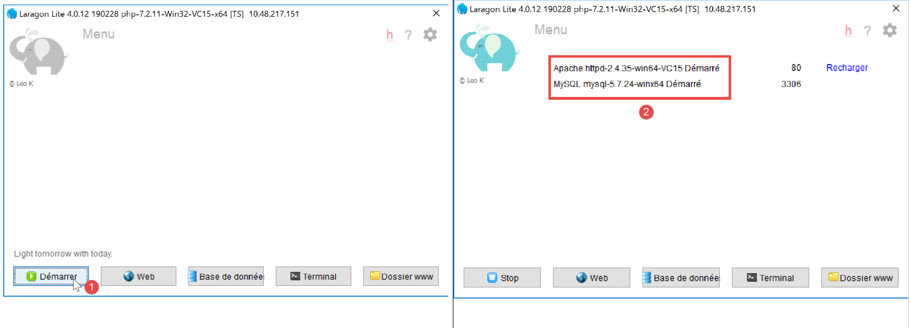

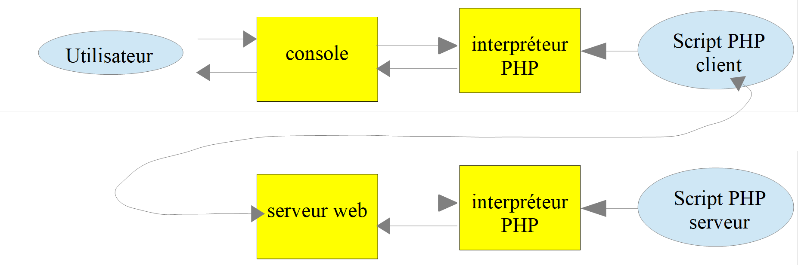
.. |image5| image:: ./chap-17/media/image6.png
   :width: 3.18465in
   :height: 0.76378in
.. |image6| image:: ./chap-17/media/image7.png
   :width: 6.09843in
   :height: 1.88976in
.. |image7| image:: ./chap-17/media/image8.png
   :width: 6.67716in
   :height: 2.08268in

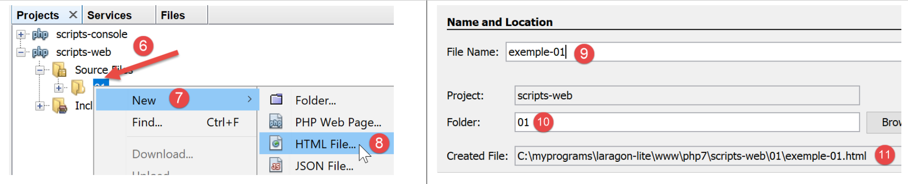
.. |image11| image:: ./chap-17/media/image12.png
   :width: 1.53976in
   :height: 1.0752in

.. |image13| image:: ./chap-17/media/image14.png
   :width: 5.53976in
   :height: 1.14921in
.. |image14| image:: ./chap-17/media/image15.png
   :width: 6.5752in
   :height: 1.15354in

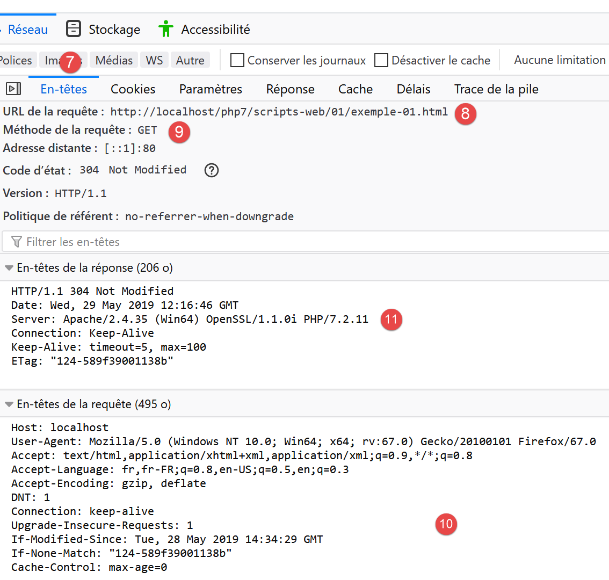
.. |image17| image:: ./chap-17/media/image18.png
   :width: 3.44528in
   :height: 1.87008in
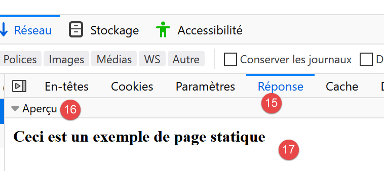
.. |image19| image:: ./chap-17/media/image20.png
   :width: 5.88622in
   :height: 1.37008in

.. |image21| image:: ./chap-17/media/image22.png
   :width: 5.90551in
   :height: 1.61378in

.. |image24| image:: ./chap-17/media/image25.png
   :width: 5.53976in
   :height: 3.52795in
.. |image25| image:: ./chap-17/media/image26.png
   :width: 5.34252in
   :height: 1.46024in
.. |image26| image:: ./chap-17/media/image27.png
   :width: 5.16102in
   :height: 2.13386in
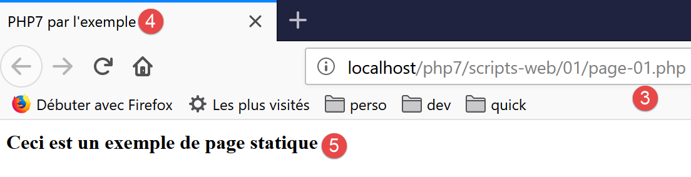
.. |image28| image:: ./chap-17/media/image29.png
   :width: 4.23189in
   :height: 1.76378in
.. |image29| image:: ./chap-17/media/image30.png
   :width: 5.94528in
   :height: 1.21654in
.. |image30| image:: ./chap-17/media/image31.png
   :width: 1.5311in
   :height: 1.82717in
.. |image31| image:: ./chap-17/media/image32.png
   :width: 4.18465in
   :height: 0.94842in
.. |image32| image:: ./chap-17/media/image33.png
   :width: 4.3189in
   :height: 1.7126in
.. |image33| image:: ./chap-17/media/image34.png
   :width: 5.79173in
   :height: 1.92913in
.. |image34| image:: ./chap-17/media/image35.png
   :width: 1.9689in
   :height: 3.85433in
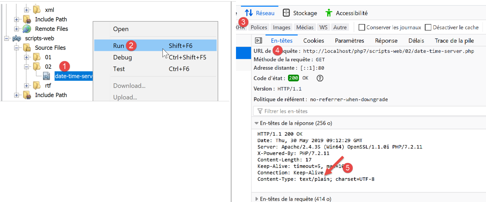
.. |image36| image:: ./chap-17/media/image37.png
   :width: 2.61024in
   :height: 1.20472in
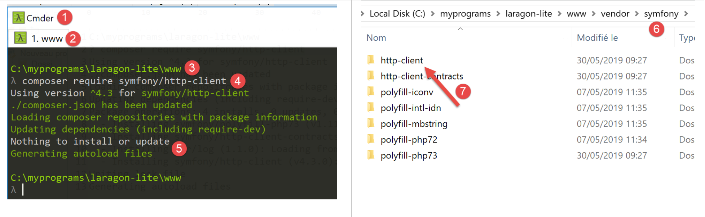
.. |image38| image:: ./chap-17/media/image39.png
   :width: 2.10197in
   :height: 3.45709in
.. |image39| image:: ./chap-17/media/image40.png
   :width: 1.8937in
   :height: 1.37008in

.. |image41| image:: ./chap-17/media/image42.png
   :width: 4.06654in
   :height: 1.95276in
.. |image42| image:: ./chap-17/media/image43.png
   :width: 2.2874in
   :height: 0.97205in
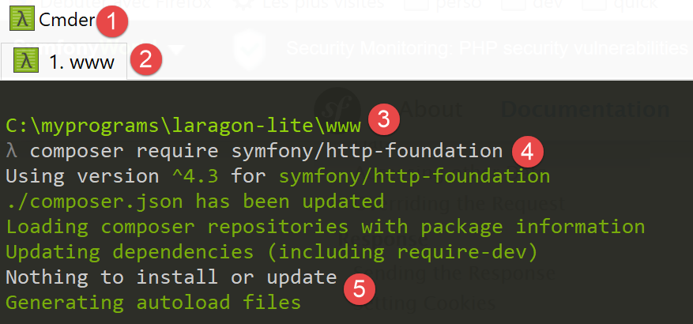

.. |image45| image:: ./chap-17/media/image46.png
   :width: 5.62992in
   :height: 2.09843in
.. |image46| image:: ./chap-17/media/image47.png
   :width: 2.85433in
   :height: 3.19291in

.. |image48| image:: ./chap-17/media/image49.png
   :width: 1.3626in
   :height: 1.08268in

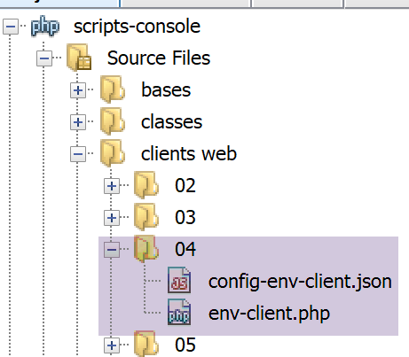
.. |image51| image:: ./chap-17/media/image52.png
   :width: 2.00748in
   :height: 2.1374in
.. |image52| image:: ./chap-17/media/image53.png
   :width: 3.52795in
   :height: 1.45709in

.. |image54| image:: ./chap-17/media/image55.png
   :width: 1.68898in
   :height: 1.17283in
.. |image55| image:: ./chap-17/media/image53.png
   :width: 4.11378in
   :height: 1.69646in
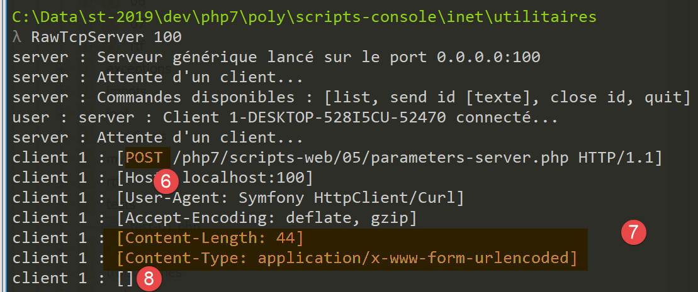
.. |image57| image:: ./chap-17/media/image57.png
   :width: 6.41339in
   :height: 3.18898in
.. |image58| image:: ./chap-17/media/image58.png
   :width: 1.5311in
   :height: 1.50433in

.. |image61| image:: ./chap-17/media/image61.png
   :width: 6.20827in
   :height: 3.80354in
.. |image62| image:: ./chap-17/media/image62.png
   :width: 1.87441in
   :height: 1.87795in
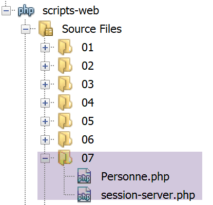
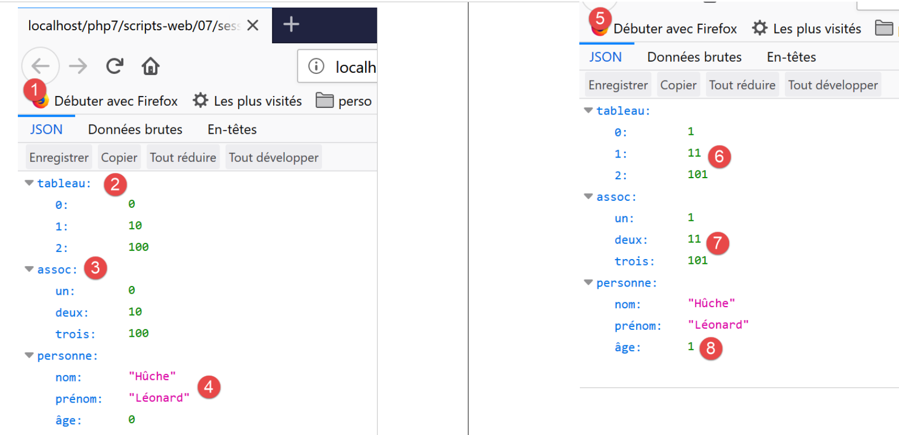

.. |image66| image:: ./chap-17/media/image66.png
   :width: 1.37008in
   :height: 1.23189in

.. |image68| image:: ./chap-17/media/image68.png
   :width: 4.11378in
   :height: 2.01929in
.. |image69| image:: ./chap-17/media/image69.png
   :width: 3.50433in
   :height: 3.62205in
.. |image70| image:: ./chap-17/media/image70.png
   :width: 1.38189in
   :height: 1.60197in
.. |image71| image:: ./chap-17/media/image71.png
   :width: 4.55472in
   :height: 1.99567in

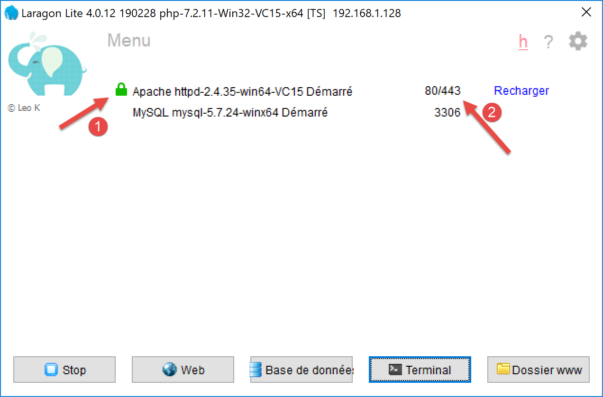
