Exercice d’application – version 8
==================================

Nous allons reprendre l’application exemple – version 5 (paragraphe
`lien <#_Exercice_d’application_–_1>`__) et allons en faire une
application client / serveur.

Introduction
------------

L’architecture de la version 5 était la suivante :

|image0|

-  la couche appelée **[dao]** (Data Access Objects) s'occupe des
   échanges avec la base de données MySQL et le système de fihiers
   local ;

-  la couche appelée **[métier]** fait le calcul de l'impôt ;

-  le script principal est le chef d’orchestre : il instancie les
   couches **[dao]** et **[métier]** puis dialogue avec la couche
   **[métier]** pour faire ce qu’il y a faire ;

Nous allons migrer cette architecture vers l’architecture client /
serveur suivante :

|image1|

-  en **[2]**, nous reprendrons la couche **[dao]** de la version 5 en
   lui enlevant les méthodes d’accès au système de fichiers local. Ces
   méthodes migreront dans la couche **[dao]** du client **[6, 7]** ;

-  en **[3]**, la couche **[métier]** restera celle de la version 5 sans
   ses méthodes **[executeBatchImpôts, saveResults]** qui migrent dans
   la couche **[dao]** **[7]** du client ;

-  en **[4]**, le script serveur est à écrire : il aura à :

   -  créer les couches **[métier]** et **[dao]** **[3, 2]** ;

   -  dialoguer avec le script client **[5, 7]** ;

-  en **[7]**, la couche **[dao]** du client est à écrire :

   -  elle sera un client HTTP du script serveur **[4, 5]** ;

   -  elle reprendra les méthodes d’accès au système de fichiers local
      de la couche **[dao]** de la version 5 ;

-  en **[8]**, la couche **[métier]** du client respectera l’interface
   **[InterfaceMetier]** de la version 5. Son implémentation sera
   cependant différente. Dans la version 5, la couche **[métier]**
   faisait le calcul de l’impôt. Ici, c’est la couche **[métier]** du
   serveur qui fait ce calcul. La couche **[métier]** fera donc appel à
   la couche **[dao]** **[7]**, pour dialoguer avec le serveur et lui
   demander de calculer l’impôt ;

-  en **[9]**, le script console aura à instancier les couches **[dao,
   métier]** du client et à lancer l’exécution de celui-ci ;

Le serveur
----------

Nous nous intéressons à la partie serveur de l’application.

|image2|

Cette architecture sera implémentée par les scripts suivants :

|image3|

Les entités échangées entre les couches
~~~~~~~~~~~~~~~~~~~~~~~~~~~~~~~~~~~~~~~

|image4|

Les entités échangées entre les couches sont celles de la version 5
décrites au paragraphe `lien <#_Les_entités>`__.

La couche [dao]
~~~~~~~~~~~~~~~

|image5|

La couche **[dao]** implémente l’interface **[InterfaceServerDao]**
suivante :

.. code-block:: php 
   :linenos:

   <?php

   // espace de noms
   namespace Application;

   interface InterfaceServerDao {

     // lecture des données de l'administration fiscale
     public function getTaxAdminData(): TaxAdminData;
   }

-  ligne 9 : la méthode **[getTaxAdminData]** va chercher les données de
   l’administration fiscale dans une base de données ;

L’interface **[InterfaceServerDao]** est implémentée par la classe
**[ServerDao]** suivante :

.. code-block:: php 
   :linenos:

   <?php

   // espace de noms
   namespace Application;

   // définition d'une classe ImpotsWithDataInDatabase
   class ServerDao implements InterfaceServerDao {
     // l'objet de type TaxAdminData qui contient les données des tranches d'impôts
     private $taxAdminData;
     // l'objet de type [Database] contennat les caractéristiques de la BD
     private $database;

     // constructeur
     public function __construct(string $databaseFilename) {
       // on mémorise la configuration JSON de la bd
       $this->database = (new Database())->setFromJsonFile($databaseFilename);
       // on prépare l'attribut
       $this->taxAdminData = new TaxAdminData();
       try {
         // on ouvre la connexion à la base de données
         $connexion = new \PDO($this->database->getDsn(), $this->database->getId(), $this->database->getPwd());
         // on veut qu'à chaque erreur de SGBD, une exception soit lancée
         $connexion->setAttribute(\PDO::ATTR_ERRMODE, \PDO::ERRMODE_EXCEPTION);
         // on démarre une transaction
         $connexion->beginTransaction();
         // on remplit la table des tranches d'impôt
         $this->getTranches($connexion);
         // on remplit la table des constantes
         $this->getConstantes($connexion);
         // on termine la transaction sur un succès
         $connexion->commit();
       } catch (\PDOException $ex) {
         // y-a-t-il une transaction en cours ?
         if (isset($connexion) && $connexion->inTransaction()) {
           // on termine la transaction sur un échec
           $connexion->rollBack();
         }
         // on remonte l'exception au code appelant
         throw new ExceptionImpots($ex->getMessage());
       } finally {
         // on ferme la connexion
         $connexion = NULL;
       }
     }

     // lecture des données de la base
     private function getTranches($connexion): void {
       …
     }

     // lecture de la table des constantes
     private function getConstantes($connexion): void {
       …
     }

     // retourne les données permettant le calcul de l'impôt
     public function getTaxAdminData(): TaxAdminData {
       return $this->taxAdminData;
     }

   }

Ce code a été présenté au paragraphe
`lien <#_La_classe_[ImpotsWithTaxAdminDataIn>`__.

La couche [métier]
~~~~~~~~~~~~~~~~~~

|image6|

|image7|

La couche **[métier]** implémente l’interface
**[InterfaceServerMetier]** suivante :

.. code-block:: php 
   :linenos:

   <?php

   // espace de noms
   namespace Application;

   interface InterfaceServerMetier {

     // calcul des impôts d'un contribuable
     public function calculerImpot(string $marié, int $enfants, int $salaire): array;
   }

L’interface **[InterfaceServerMetier]** est implémentée par la classe
**[ServerMetier]** suivante :

.. code-block:: php 
   :linenos:

   <?php

   // espace de noms
   namespace Application;

   class ServerMetier implements InterfaceServerMetier {
     // couche Dao
     private $dao;
     // données administration fiscale
     private $taxAdminData;

     //---------------------------------------------
     // setter couche [dao]
     public function setDao(InterfaceServerDao $dao) {
       $this->dao = $dao;
       return $this;
     }

     public function __construct(InterfaceServerDao $dao) {
       // on mémorise une référence sur la couche [dao]
       $this->dao = $dao;
       // on récupère les données permettant le calcul de l'impôt
       // la méthode [getTaxAdminData] peut lancer une exception ExceptionImpots
       // on la laisse alors remonter au code appelant
       $this->taxAdminData = $this->dao->getTaxAdminData();
     }

   // calcul de l'impôt
   // --------------------------------------------------------------------------
     public function calculerImpot(string $marié, int $enfants, int $salaire): array {
       …
       // résultat
       return ["impôt" => floor($impot), "surcôte" => $surcôte, "décôte" => $décôte, "réduction" => $réduction, "taux" => $taux];
     }

   // --------------------------------------------------------------------------
     private function calculerImpot2(string $marié, int $enfants, float $salaire): array {
       …
       // résultat
       return ["impôt" => $impôt, "surcôte" => $surcôte, "taux" => $coeffR[$i]];
     }

     // revenuImposable=salaireAnnuel-abattement
     // l'abattement a un min et un max
     private function getRevenuImposable(float $salaire): float {
       …
       // résultat
       return floor($revenuImposable);
     }

   // calcule une décôte éventuelle
     private function getDecôte(string $marié, float $salaire, float $impots): float {
       …
       // résultat
       return ceil($décôte);
     }

   // calcule une réduction éventuelle
     private function getRéduction(string $marié, float $salaire, int $enfants, float $impots): float {
       ..
       // résultat
       return ceil($réduction);
     }
   }

Ce code a déjà été vu et commenté dès la version 1 au paragraphe
`lien <#_L’algorithme>`__. Sa version objet avec une base de données a
été présentée au paragraphe `lien <#_La_couche_[métier]>`__.

Le script serveur
~~~~~~~~~~~~~~~~~

|image8|

|image9|

Le script serveur implémente la couche **[web]** **[4]**. Le script
**[impots-server]** est configuré par le fichier jSON
**[config-server.json]** suivant :

.. code-block:: php 
   :linenos:

   {
       "rootDirectory": "C:/myprograms/laragon-lite/www/php7/scripts-web/impots/version-08",
       "databaseFilename": "Data/database.json",
       "taxAdminDataFileName": "Data/taxadmindata.json",
       "relativeDependencies": [
           "/Entities/BaseEntity.php",
           "/Entities/ExceptionImpots.php",
           "/Entities/TaxAdminData.php",
           "/Entities/Database.php",
           "/Dao/InterfaceServerDao.php",
           "/Dao/ServerDao.php",
           "/Métier/InterfaceServerMetier.php",
           "/Métier/ServerMetier.php"
       ],
       "absoluteDependencies": ["C:/myprograms/laragon-lite/www/vendor/autoload.php"],
       "users": [
           {
               "login": "admin",
               "passwd": "admin"
           }
       ]
   }

-  ligne 1 : le dossier racine à partir duquel les chemins de fichiers
   seront mesurés ;

-  ligne 2 : le fichier jSON de configuration de la base de données
   MySQL ;

-  ligne 3 : le fichier jSON des données de l’administration fiscale ;

-  lignes 5-14 : les fichiers de l’application ;

-  ligne 15 : la dépendance nécessaire aux bibliothèques tierces, ici
   Symfony ;

-  lignes 16-20 : le tableau des utilisateurs autorisés à utiliser
   l’application ;

Les fichiers jSON **[database.json, taxadmindata.json]** sont ceux de la
version 5 décrit au paragraphe `lien <#_Les_entités>`__.

Le script **[impots-server]** implémente la couche **[web]** de la façon
suivante :

.. code-block:: php 
   :linenos:

   <?php

   // respect strict des types déclarés des paramètres de foctions
   declare (strict_types=1);

   // espace de noms
   namespace Application;

   // gestion des erreurs par PHP
   //ini_set("display_errors", "0");
   //
   // chemin du fichier de configuration
   define("CONFIG_FILENAME", "Data/config-server.json");

   // on récupère la configuration
   $config = \json_decode(file_get_contents(CONFIG_FILENAME), true);

   // on inclut les dépendances nécessaires au script
   $rootDirectory = $config["rootDirectory"];
   foreach ($config["relativeDependencies"] as $dependency) {
     require "$rootDirectory$dependency";
   }
   // dépendances absolues (bibliothèques tierces)
   foreach ($config["absoluteDependencies"] as $dependency) {
     require "$dependency";
   }

   // définition des constantes
   define("DATABASE_CONFIG_FILENAME", $config["databaseFilename"]);
   //
   // dépendances Symfony
   use \Symfony\Component\HttpFoundation\Response;
   use \Symfony\Component\HttpFoundation\Request;

   // préparation de la réponse JSON du serveur
   $response = new Response();
   $response->headers->set("content-type", "application/json");
   $response->setCharset("utf-8");

   // on récupère la requête courante
   $request = Request::createFromGlobals();
   // authentification
   $requestUser = $request->headers->get('php-auth-user');
   $requestPassword = $request->headers->get('php-auth-pw');
   // l'utilisateur existe-t-il ?
   $users = $config["users"];
   $i = 0;
   $trouvé = FALSE;
   while (!$trouvé && $i < count($users)) {
     $trouvé = ($requestUser === $users[$i]["login"] && $users[$i]["passwd"] === $requestPassword);
     $i++;
   }
   // on fixe le code de statut de la réponse
   if (!$trouvé) {
     // pas trouvé - code 401
     $response->setStatusCode(Response::HTTP_UNAUTHORIZED);
     $response->headers->add(["WWW-Authenticate" => "Basic realm=" . utf8_decode("\"Serveur de calcul d'impôts\"")]);
     // msg d'erreur
     $response->setContent(\json_encode(["réponse" => ["erreur" => "Echec de l'authentification [$requestUser, $requestPassword]"]], JSON_UNESCAPED_UNICODE));
     $response->send();
     // fin
     exit;
   }
   // on a un utilisateur valide - on vérifie les paramètres reçus
   $erreurs = [];
   // on doit avoir trois paramètres GET
   $method = strtolower($request->getMethod());
   $erreur = $method !== "get" || $request->query->count() != 3;
   // erreur ?
   if ($erreur) {
     $erreurs[] = "Méthode GET requise avec les seuls paramètres [marié, enfants, salaire]";
   }

   // on récupère le statut marital
   if (!$request->query->has("marié")) {
     $erreurs[] = "paramètre marié manquant";
   } else {
     $marié = trim(strtolower($request->query->get("marié")));
     $erreur = $marié !== "oui" && $marié !== "non";
     // erreur ?
     if ($erreur) {
       $erreurs[] = "paramètre marié [$marié] invalide";
     }
   }

   // on récupère le nombre d'enfants
   if (!$request->query->has("enfants")) {
     $erreurs[] = "paramètre enfants manquant";
   } else {
     $enfants = trim($request->query->get("enfants"));
     // le nombre d'enfants doit être un nombre entier >=0
     $erreur = !preg_match("/^\d+$/", $enfants);
     // erreur ?
     if ($erreur) {
       $erreurs[] = "paramètre enfants [$enfants] invalide";
     }
   }

   // on récupère le salaire annuel
   if (!$request->query->has("salaire")) {
     $erreurs[] = "paramètre salaire manquant";
   } else {
     // le salaire doit être un nombre entier >=0
     $salaire = trim($request->query->get("salaire"));
     $erreur = !preg_match("/^\d+$/", $salaire);
     // erreur ?
     if ($erreur) {
       $erreurs[] = "paramètre salaire [$salaire] invalide";
     }
   }

   // autres paramètres dans la requête ?
   foreach (\array_keys($request->query->all()) as $key) {
     // paramètre valide ?
     if (!\in_array($key, ["marié", "enfants", "salaire"])) {
       $erreurs[] = "paramètre [$key] invalide";}
   }

   // erreurs ?
   if ($erreurs) {
     // on envoie un code d'erreur 400 au client
     $response->setStatusCode(Response::HTTP_BAD_REQUEST);
     $response->setContent(json_encode(["réponse" => ["erreurs" => $erreurs]], JSON_UNESCAPED_UNICODE));
     $response->send();
     exit;
   }
   // on a tout ce qu'il faut pour travailler
   // création de l'architecture du serveur
   $msgErreur = "";
   try {
     // création de la couche [dao]
     $dao = new ServerDao($config["databaseFilename"]);
     // création de la couche [métier]
     $métier = new ServerMetier($dao);
   } catch (ExceptionImpots $ex) {
   // on note l'erreur
     $msgErreur = utf8_encode($ex->getMessage());
   }
   // erreur ?
   if ($msgErreur) {
     // on envoie un code d'erreur 500 au client
     $response->setStatusCode(Response::HTTP_INTERNAL_SERVER_ERROR);
     $response->setContent(\json_encode(["réponse" => ["erreur" => $msgErreur]], JSON_UNESCAPED_UNICODE));
     $response->send();
     exit;
   }
   // calcul de l'impôt
   $result = $métier->calculerImpot($marié, (int) $enfants, (int) $salaire);
   // on rend la réponse
   $response->setContent(json_encode(["réponse" => $result], JSON_UNESCAPED_UNICODE));
   $response->send();

**Commentaires**

-  ligne 16 : on exploite le fichier de configuration ;

-  lignes 18-26 : on charge toutes les dépendances ;

-  ligne 29 : le nom du fichier **[database.json]** ;

-  lignes 32-33 : on déclare les classes des bibliothèques tierces qu’on
   va utiliser ;

-  lignes 36-38 : on prépare une réponse jSON ;

-  lignes 40-52 : on vérifie que l’utilisateur qui fait la requête fait
   bien partie des utilisateurs autorisés ;

-  lignes 54-63 : si ce n’est pas le cas, on envoie le code HTTP 401 qui
   indique un refus d’accès. A réception de ce code et de l’entête HTTP
   **[WWW-Authenticate => Basic realm=]**, la plupart des navigateurs
   affichent une fenêtre d’authentification invitant l’utilisateur à
   s’authentifier ;

-  ligne 59 : la réponse jSON du serveur explique la cause de l’erreur.
   Toutes les réponses du serveur seront la chaîne jSON d’un tableau
   **[‘réponse’=>’qq chose’]** ;

-  lignes 64-117 : on vérifie la validité de la requête :

   -  une requête GET avec trois paramètres exactement ;

   -  un paramètre **[marié]** dont la valeur doit être ‘oui’ ou ‘non’ ;

   -  un paramètre **[enfants]** dont la valeur doit être un entier
      >=0 ;

   -  un paramètre **[salaire]** dont la valeur doit être un entier
      >=0 ;

-  ligne 65 : à chaque fois qu’une erreur est détectée, un message
   d’erreur est ajouté au tableau **[$erreurs]** ;

-  lignes 120-126 : si erreur il y a, alors on envoie le code HTTP
   **[400 Bad Request]** au client (ligne 122) ;

-  ligne 123 : la réponse jSON du serveur explique la cause de
   l’erreur ;

-  à partir de la ligne 132, tout a été vérifié. On peut instancier les
   couches **[dao, métier]**. Cette instanciation a un coût et il ne
   faut la faire que si on est sûr d’avoir une requête valide ;

-  lignes 130-138 : on crée l’architecture du serveur. La construction
   de la couche **[dao]** peut lancer une exception de type
   **[ExceptionImpots]**. Si cette exception se produit, on note
   l’erreur ;

-  lignes 135-138 : si exception il y a eu, alors on envoie le code HTTP
   500 au client. Ce code signifie que le serveur a bogué ;

-  ligne 143 : la réponse explique la cause de l’erreur ;

-  ligne 148  : le calcul de l’impôt est délégué à la couche
   **[métier]** ;

-  lignes 150-151 : envoi de la réponse ;

Testons ce script avec un navigateur. Demandons l’URL sécurisée
**[https://localhost:443/php7/scripts-web/impots/version-08/impots-server.php?marié=oui&enfants=5&salaire=100000]**:

|image10|

-  en **[1]**, l’URL sécurisée demandée ;

-  en **[2]**, les trois paramètres **[marié, enfants, salaire]** ;

-  en **[3]**, le serveur Apache de Laragon a envoyé un certificat SSL
   autosigné. Le navigateur l’a remarqué et affiche un avertissement de
   sécurité : il considère que le site du serveur n’est pas digne de
   confiance ;

-  en **[4]**, on continue ;

|image11|

-  en **[6]**, on continue ;

|image12|

-  en **[7]**, le navigateur affiche une fenêtre pour que l’utilisateur
   puisse s’authentifier ;

-  en **[9,10]**, on tape **[admin]** et **[admin]** ;

|image13|

-  en **[13]**, la réponse jSON du serveur ;

Faisons quelques tests d’erreur :

On demande l’URL
**[https://localhost/php7/scripts-web/impots/version-08/impots-server.php?marié=x&enfants=x&salaire=x&w=x]**

On obtient le résultat suivant :

|image14|

On coupe le SGBD MySQL et on demande l’URL
**[https://localhost/php7/scripts-web/impots/version-08/impots-server.php?marié=oui&enfants=3&salaire=60000]** :

|image15|

Tests [Codeception]
~~~~~~~~~~~~~~~~~~~

A chaque fois que nous construirons une nouvelle version du serveur,
nous testerons les couches **[métier]** et **[dao]** comme il a été fait
depuis la version 04 (cf paragraphes `lien <#_Tests_de_la>`__ et
`lien <#_Tests_de_la_1>`__).

Tout d’abord, nous associons le projet **[scripts-web]** aux tests
**[Codeception]**. Pour cela, suivez la même procédure suivie pour le
projet **[scripts-console]** au paragraphe
`lien <#_Installation_du_framework>`__. Nous obtenons un projet
**[scripts-web]** avec un dossier **[Test Files]** :

|image16|

Nous allons créer un test pour la couche **[dao]** et un pour la couche
**[métier]**.

Tests de la couche [dao]
^^^^^^^^^^^^^^^^^^^^^^^^

|image17|

Le test **[ServerDaoTest]** sera le suivant :

.. code-block:: php 
   :linenos:

   <?php

   // respect strict des types déclarés des paramètres de foctions
   declare (strict_types=1);

   // espace de noms
   namespace Application;

   // définition des constantes
   define("ROOT", "C:/myprograms/laragon-lite/www/php7/scripts-web/impots/version-08");
   // chemin du fichier de configuration
   define("CONFIG_FILENAME", ROOT . "/Data/config-server.json");

   // on récupère la configuration
   $config = \json_decode(\file_get_contents(CONFIG_FILENAME), true);
   // on inclut les dépendances nécessaires au script
   $rootDirectory = $config["rootDirectory"];
   foreach ($config["relativeDependencies"] as $dependency) {
     require "$rootDirectory$dependency";
   }
   // dépendances absolues (bibliothèques tierces)
   foreach ($config["absoluteDependencies"] as $dependency) {
     require "$dependency";
   }

   // test -----------------------------------------------------

   class ServerDaoTest extends \Codeception\Test\Unit {
     // TaxAdminData
     private $taxAdminData;

     public function __construct() {
       // parent
       parent::__construct();
       // on récupère la configuration
       $config = \json_decode(\file_get_contents(CONFIG_FILENAME), true);
       // création de la couche [dao]
       $dao = new ServerDao(ROOT . "/" . $config["databaseFilename"]);
       $this->taxAdminData = $dao->getTaxAdminData();
     }

     // tests
     public function testTaxAdminData() {
       …
     }

   }

**Commentaires**

-  lignes 9-24 : on construit le même environnement de travail que celui
   du serveur **[impots-server.php]**. Cela se fait en lignes 9-12 avec
   la définitions des deux constantes dont dépend l’environnement ;

-  lignes 32-40 : on construit une instance de la couche **[dao]** à
   tester comme il était fait dans le script serveur
   **[impots-server.php]** ;

-  à partir de maintenant on est dans les mêmes conditions que le script
   serveur **[impots-server.php]** : on peut démarrer les tests ;

-  lignes 43-45 : la méthode **[testTaxAdminData]** est celle décrite au
   paragraphe `lien <#_Tests_de_la>`__ ;

Les résultats du test sont les suivants :

|image18|

Tests de la couche [métier]
^^^^^^^^^^^^^^^^^^^^^^^^^^^

|image19|

Le test **[ServerMetierTest]** sera le suivant :

.. code-block:: php 
   :linenos:

   <?php

   // respect strict des types déclarés des paramètres de foctions
   declare (strict_types=1);

   // espace de noms
   namespace Application;

   // définition des constantes
   define("ROOT", "C:/myprograms/laragon-lite/www/php7/scripts-web/impots/version-08");
   // chemin du fichier de configuration
   define("CONFIG_FILENAME", ROOT . "/Data/config-server.json");
   // on récupère la configuration
   $config = \json_decode(\file_get_contents(CONFIG_FILENAME), true);
   // on inclut les dépendances nécessaires au script
   $rootDirectory = $config["rootDirectory"];
   foreach ($config["relativeDependencies"] as $dependency) {
     require "$rootDirectory$dependency";
   }
   // dépendances absolues (bibliothèques tierces)
   foreach ($config["absoluteDependencies"] as $dependency) {
     require "$dependency";
   }

   // classe de test
   class ServerMetierTest extends \Codeception\Test\Unit {
     // couche métier
     private $métier;

     public function __construct() {
       parent::__construct();
       // on récupère la configuration
       $config = \json_decode(\file_get_contents(CONFIG_FILENAME), true);
       // création de la couche [dao]
       $dao = new ServerDao(ROOT . "/" . $config["databaseFilename"]);
       // création de la couche [métier]
       $this->métier = new ServerMetier($dao);
     }

     // tests
     public function test1() {
      …
     }

     public function test2() {
       …
     }

     ..

     public function test11() {
       …
     }

   }

**Commentaires**

-  lignes 9-24 : on construit le même environnement de travail que celui
   du serveur **[impots-server.php]**. Cela se fait en lignes 9-12 avec
   la définitions des deux constantes dont dépend l’environnement ;

-  lignes 30-38 : on construit une instance de la couche **[métier]** à
   tester comme il était fait dans le script serveur
   **[impots-server.php]** ;

-  à partir de maintenant on est dans les mêmes conditions que le script
   serveur **[impots-server.php]** : on peut démarrer les tests ;

-  lignes 40-53 : les méthodes **[test1, test2…, test11]** sont celles
   décrites au paragraphe `lien <#_Tests_de_la_1>`__ ;

Les résultats du test sont les suivants :

|image20|

Le client
---------

Nous nous intéressons à la partie cliente de l’application.

|image21|

Cette architecture sera implémentée par les scripts suivants :

|image22|

Les entités échangées entre couches
~~~~~~~~~~~~~~~~~~~~~~~~~~~~~~~~~~~

|image23|

Les entités ci-dessus ont toutes été décrites et déjà utilisées :

-  **[BaseEntity]** au paragraphe `lien <#_La_classe_de>`__ ;

-  **[ExceptionImpots]** au paragraphe
   `lien <#_L’exception_[ExceptionImpots]>`__ ;

-  **[TaxPayerData]** au paragraphe `lien <#_L’entité_[TaxPayerData]>`__
   ;

.. _la-couche-dao-1:

La couche [dao]
~~~~~~~~~~~~~~~

|image24|

La couche **[dao]** implémente l’interface **[InterfaceClientDao]**
suivante :

.. code-block:: php 
   :linenos:

   <?php

   // espace de noms
   namespace Application;

   interface InterfaceClientDao {

     // lecture des données contribuables
     public function getTaxPayersData(string $taxPayersFilename, string $errorsFilename): array;

     // calcul des impôts d'un contribuable
     public function calculerImpot(string $marié, int $enfants, int $salaire): array;

     // enregistrement des résultats
     public function saveResults(string $resultsFilename, array $taxPayersData): void;
   }

-  ligne 9 : la fonction **[getTaxPayersData]** amène en mémoire les
   données des contribuables du fichier **[$taxPayersFilename]**. Si
   erreurs il y a, elles sont consignées dans le fichier
   **[$errorsFilename]** ;

-  ligne 12 : la fonction **[calculerImpots]** calcule l’impôt d’un
   contribuable ;

-  ligne 15 : la fonction **[saveResults]** sauvegarde dans le fichier
   **[$resultsFilename]** les données du tableau **[$taxPayersData]**
   qui représentent les résultats de plusieurs calculs d’impôt ;

L’interface **[InterfaceClientDao]** est implémentée par la classe
**[ClientDao]** suivante :

.. code-block:: php 
   :linenos:

   <?php

   namespace Application;

   // dépendances
   use \Symfony\Component\HttpClient\HttpClient;

   class ClientDao implements InterfaceClientDao {
     // utilisation d'un Trait
     use TraitDao;
     // attributs
     private $urlServer;
     private $user;

     // constructeur
     public function __construct(string $urlServer, array $user) {
       $this->urlServer = $urlServer;
       $this->user = $user;
     }

     // calcul de l'impôt
     public function calculerImpot(string $marié, int $enfants, int $salaire): array {
       // on crée un client HTTP
       $httpClient = HttpClient::create([
           'auth_basic' => [$this->user["login"], $this->user["passwd"]],
           "verify_peer" => false
       ]);
       // on fait la requête au serveur
       $response = $httpClient->request('GET', $this->urlServer,
         ["query" => [
             "marié" => $marié,
             "enfants" => $enfants,
             "salaire" => $salaire
       ]]);
       // on récupère la réponse
       $json = $response->getContent(false);
       $array = \json_decode($json, true);
       $réponse = $array["réponse"];
       // logs
       // print "$json=json\n";
       // on récupère le statut de la réponse
       $statusCode = $response->getStatusCode();
       // erreur ?
       if ($statusCode !== 200) {
         // on a une erreur - on lance une exception
         $réponse = ["statut HTTP" => $statusCode] + $réponse;
         $message = \json_encode($réponse, JSON_UNESCAPED_UNICODE);
         throw new ExceptionImpots($message);
       }
       // on rend la réponse
       return $réponse;
     }

   }

**Commentaires**

-  ligne 10 : on insère **[TraitDao]** (cf paragraphe
   `lien <#_Le_trait_[TraitDao]>`__) qui implémente les méthodes
   **[getTaxPayersData]** et **[saveResults]**. Ne reste donc que la
   méthode **[calculerImpots]** à implémenter. Celle-ci est implémentée
   aux lignes 22-49 ;

-  lignes 16-19 : le constructeur de la classe **[ClientDao]** reçoit
   deux paramètres :

   -  l’URL **[$urlServer]** du serveur de calcul d’impôt ;

   -  le tableau **[$user]** de clés ‘login’ et ‘passwd’ qui définit
      l’utilisateur qui fait la requête ;

-  ligne 22 : la méthode **[calculerImpots]** reçoit les trois
   paramètres à envoyer au serveur de calcul d’impôts ;

-  lignes 24-27 : on crée un client HTTP avec :

   -  ligne 25 : les identifiants de l’utilisateur qui fait la requête ;

   -  ligne 26 : l’option qui fait que le client HTTP ne vérifiera pas
      la validité du certificat SSL envoyé par le serveur ;

-  lignes 29-34 : le serveur est interrogé avec les trois paramètres
   qu’il attend ;

-  ligne 36 : on récupère la réponse jSON du serveur. Si on ne met pas
   le paramètre **[false]** à la méthode **[Response::getContent]**,
   alors si le statut de la réponse du serveur est dans l’intervalle
   **[3xx-5xx]** (cas d’erreur), l’objet **[Response]** lance une
   exception dès qu’on cherche à obtenir le contenu de la réponse
   **[Response::getContent]** ou ses entêtes HTTP
   **[Response::getHeaders]**. Ici quelque soit le statut HTTP de la
   réponse, on veut pouvoir avoir accès au contenu de celle-ci, ne
   serait-ce que pour le loguer (ligne 40) ;

-  lignes 37-38 : la réponse du serveur est la chaîne jSON d’un tableau
   **[‘réponse’=>qqChose]**. On récupère le **[qqChose]** ;

-  ligne 40 : on logue la réponse jSON en mode développement ;

-  ligne 42 : on récupère le code de statut de la réponse ;

-  lignes 44-49 : si le code de statut HTTP n’est pas 200, alors c’est
   que notre serveur a rencontré un problème. On lance alors une
   exception de type **[ExceptionImpots]** avec pour message, la réponse
   jSON du serveur augmentée du code HTTP de la réponse ;

-  ligne 51 : on rend le résultat qui est un tableau associatif avec les
   clés **[impôt, surcôte, décôte, réduction, taux]** ;

.. _la-couche-métier-1:

La couche [métier]
~~~~~~~~~~~~~~~~~~

|image25|

|image26|

La couche **[métier]** **[8]** implémente l’interface
**[InterfaceClientMetier]** suivante :

.. code-block:: php 
   :linenos:

   <?php

   // espace de noms
   namespace Application;

   interface InterfaceClientMetier {

     // calcul des impôts d'un contribuable
     public function calculerImpot(string $marié, int $enfants, int $salaire): array;

     // calcul des impôts en mode batch
     public function executeBatchImpots(string $taxPayersFileName, string $resultsFileName, string $errorsFileName): void;
   }

-  ligne 9 : la fonction **[calculerImpots]** calcule l’impôt ;

-  ligne 12 : la fonction **[executeBatchImpots]** calcule l’impôt des
   contribuables dont les données sont dans le fichier
   **[$taxPayersFileName]**, met les résultats obtenus dans le fichier
   **[$resultsFileName]** et les erreurs rencontrées dans le fichier
   **[$errorsFileName]** ;

L’interface **[InterfaceClientMetier]** est implémentée par la classe
**[ClientMetier]** suivante :

.. code-block:: php 
   :linenos:

   <?php

   // espace de noms
   namespace Application;

   class ClientMetier implements InterfaceClientMetier {
     // attribut
     private $clientDao;

     // constructeur
     public function __construct(InterfaceClientDao $clientDao) {
       // on mémorise la référence sur la couche [dao]
       $this->clientDao = $clientDao;
     }
     
     // calcul de l'impôt
     public function calculerImpot(string $marié, int $enfants, int $salaire): array {
       return $this->clientDao->calculerImpot($marié, $enfants, $salaire);
     }

     // calcul des impôts en mode batch
     public function executeBatchImpots(string $taxPayersFileName, string $resultsFileName, string $errorsFileName): void {
       // on laisse remonter les exceptions qui proviennent de la couche [dao]
       // on récupère les données contribuables
       $taxPayersData = $this->clientDao->getTaxPayersData($taxPayersFileName, $errorsFileName);
       // tableau des résultats
       $results = [];
       // on les exploite
       foreach ($taxPayersData as $taxPayerData) {
         // on calcule l'impôt
         $result = $this->calculerImpot(
           $taxPayerData->getMarié(),
           $taxPayerData->getEnfants(),
           $taxPayerData->getSalaire());
         // on complète [$taxPayerData]
         $taxPayerData->setFromArrayOfAttributes($result);
         // on met le résultat dans le tableau des résultats
         $results [] = $taxPayerData;
       }
       // enregistrement des résultats
       $this->clientDao->saveResults($resultsFileName, $results);
     }

   }

**Commentaires**

-  lignes 11-14 : le constructeur de la classe **[ClientMetier]** reçoit
   comme paramètre une référence sur la couche **[dao]** ;

-  lignes 17-19 : le calcul de l’impôt est délégué à la couche
   **[dao]** ;

-  lignes 20-38 : la fonction **[executeBatchImpots]** a été décrite au
   paragraphe `lien <#_La_classe_[Metier]>`__ ;

Le script principal
~~~~~~~~~~~~~~~~~~~

|image27|

|image28|

Le script client **[MainImpotsClient.php]** implémente la couche
**[console]** **[9]**. Il est configuré par le fichier jSON
**[conf-client.json]** suivant :

.. code-block:: php 
   :linenos:

   {
       "rootDirectory": "C:/Data/st-2019/dev/php7/poly/scripts-console/impots/version-08",
       "taxPayersDataFileName": "Data/taxpayersdata.json",
       "resultsFileName": "Data/results.json",
       "errorsFileName": "Data/errors.json",
       "dependencies": [
           "Entities/BaseEntity.php",
           "Entities/TaxPayerData.php",
           "Entities/ExceptionImpots.php",
           "Utilities/Utilitaires.php",
           "Dao/InterfaceClientDao.php",
           "Dao/TraitDao.php",
           "Dao/ClientDao.php",
           "Métier/InterfaceClientMetier.php",
           "Métier/ClientMetier.php"
       ],
       "absoluteDependencies": [
           "C:/myprograms/laragon-lite/www/vendor/autoload.php"
       ],
       "user": {
           "login": "admin",
           "passwd": "admin"
       },
       "urlServer": "https://localhost:443/php7/scripts-web/impots/version-08/impots-server.php"
   }

-  ligne 1 : le dossier racine du client ;

-  ligne 2 : le fichier jSON des données contribuables ;

-  ligne 3 : le fichier jSON des résultats ;

-  ligen 4 : le fichier jSON des erreurs ;

-  lignes 6-19 : les différentes dépendances du projet client ;

-  lignes 20-23 : l’utilisateur faisant les requêtes au serveur de
   calcul d’impôts ;

-  ligne 24 : l’URL sécurisée du serveur de calcul d’impôts ;

Le code du script **[MainImpotsClient.php]** est le suivant :

.. code-block:: php 
   :linenos:

   <?php

   // respect strict des types déclarés des paramètres de foctions
   declare (strict_types=1);

   // espace de noms
   namespace Application;

   // gestion des erreurs par PHP
   //ini_set("display_errors", "0");
   //
   // chemin du fichier de configuration
   define("CONFIG_FILENAME", "../Data/config-client.json");

   // on récupère la configuration
   $config = \json_decode(file_get_contents(CONFIG_FILENAME), true);

   // on inclut les dépendances nécessaires au script
   $rootDirectory = $config["rootDirectory"];
   foreach ($config["dependencies"] as $dependency) {
     require "$rootDirectory/$dependency";
   }
   // dépendances absolues (bibliothèques tierces)
   foreach ($config["absoluteDependencies"] as $dependency) {
     require "$dependency";
   }

   // définition des constantes
   define("TAXPAYERSDATA_FILENAME", "$rootDirectory/{$config["taxPayersDataFileName"]}");
   define("RESULTS_FILENAME", "$rootDirectory/{$config["resultsFileName"]}");
   define("ERRORS_FILENAME", "$rootDirectory/{$config["errorsFileName"]}");
   //
   // dépendances Symfony
   use Symfony\Component\HttpClient\HttpClient;

   // création de la couche [dao]
   $clientDao = new ClientDao($config["urlServer"], $config["user"]);
   // création de la couche [métier]
   $clientMetier = new ClientMetier($clientDao);

   // calcul de l'impôts en mode batch
   try {
     $clientMetier->executeBatchImpots(TAXPAYERSDATA_FILENAME, RESULTS_FILENAME, ERRORS_FILENAME);
   } catch (\RuntimeException $ex) {
     // on affiche l'erreur
     print "L'erreur suivante s'est produite : " . $ex->getMessage() . "\n";
   }
   // fin
   print "Terminé\n";
   exit;

**Commentaires**

-  ligne 13 : chemin du fichier de configuration ;

-  ligne 16 : exploitation du fichier de configuration ;

-  lignes 18-26 : chargement des dépendances ;

-  ligne 37 : création de la couche **[dao]**. On passe au constructeur
   de la couche, les deux informations qu’il attend :

   -  l’URL du serveur de calcul d’impôts ;

   -  les identifiants de l’utilisateur qui va faire les requêtes ;

-  ligne 39 : création de la couche **[métier]**. On passe au
   constructeur de la couche, une référence sur la couche **[dao]** qui
   vient d’être créée ;

-  ligne 43 : on demande à la couche **[métier]** de :

   -  calculer les impôts de tous les contribuables du fichier
      $config\ **["taxPayerDataFileName"]** ;

   -  mettre les résultats dans le fichier
      $config\ **["resultsFileName"]** ;

   -  mettre les erreurs dans le fichier
      $config\ **["errorsFileName"]** ;

-  la ligne 43 peut lancer des exceptions ;

-  ligne 46 : affichage du message d’erreur de l’exception ;

L’exécution du client amène les mêmes résultats que les versions
précédentes. Vérifiez les fichiers suivants :

-  **[Data/taxpayersdata.json]** : données des contribuables pour
   lesquel on calcule le montant de l’impôt ;

-  **[Data/results.json]** : résultats pour les différents contribuables
   du fichier **[Data/taxpayersdata.json]** ;

-  **[Data/errors.json]** : les erreurs qui ont pu être rencontrées dans
   l’exploitation du fichier **[Data/taxpayersdata.json]** ;

Regardons les cas d’erreur possibles. Tout d’abord, arrêtons le serveur
Laragon. Les résultats dans la console du client sont alors les
suivants :

.. code-block:: php 
   :linenos:

   Couldn't connect to server for"https://localhost/php7/scripts-web/impots/version-08/impots-server.php?mari%C3%A9=oui&enfants=2&salaire=55555".
   Terminé

Maintenant lançons seulement le serveur Apache et pas le SGBD MySQL :

|image29|

Les résultats dans la console du client sont alors les suivants :

.. code-block:: php 
   :linenos:

   L'erreur suivante s'est produite : {"statut HTTP":500,"erreur":"SQLSTATE[HY000] [2002] Aucune connexion n’a pu être établie car l’ordinateur cible l’a expressément refusée.\r\n"}
   Terminé

Maintenant, lançons MySQL puis modifions dans **[config-client]**
l’utilisateur qui se connecte :

.. code-block:: php 
   :linenos:

       "user": {
           "login": "x",
           "passwd": "x"
   },

Les résultats dans la console du client sont alors les suivants :

.. code-block:: php 
   :linenos:

   L'erreur suivante s'est produite : {"statut HTTP":401,"erreur":"Echec de l'authentification [x, x]"}
   Terminé

.. _tests-codeception-1:

Tests [Codeception]
~~~~~~~~~~~~~~~~~~~

Comme il a été fait pour les version précédentes, nous allons écrire des
tests **[Codeception]** pour la version 08.

|image30|

Test de la couche [métier]
^^^^^^^^^^^^^^^^^^^^^^^^^^

Le test **[ClientMetierTest.php]** est le suivant :

.. code-block:: php 
   :linenos:

   <?php

   // respect strict des types déclarés des paramètres de foctions
   declare (strict_types=1);

   // espace de noms
   namespace Application;

   // définition des constantes
   define("ROOT", "C:/Data/st-2019/dev/php7/poly/scripts-console/impots/version-08");

   // chemin du fichier de configuration
   define("CONFIG_FILENAME", ROOT . "/Data/config-client.json");

   // on récupère la configuration
   $config = \json_decode(file_get_contents(CONFIG_FILENAME), true);

   // on inclut les dépendances nécessaires au script
   $rootDirectory = $config["rootDirectory"];
   foreach ($config["dependencies"] as $dependency) {
     require "$rootDirectory/$dependency";
   }
   // dépendances absolues (bibliothèques tierces)
   foreach ($config["absoluteDependencies"] as $dependency) {
     require "$dependency";
   }
   //
   // classe de test
   class ClientMetierTest extends \Codeception\Test\Unit {
     // couche métier
     private $métier;

     public function __construct() {
       parent::__construct();
       // on récupère la configuration
       $config = \json_decode(\file_get_contents(CONFIG_FILENAME), true);
       // création de la couche [dao]
       $clientDao = new ClientDao($config["urlServer"], $config["user"]);
       // création de la couche [métier]
       $this->métier = new ClientMetier($clientDao);
     }

     // tests
     public function test1() {
       …
     }

     -------------

     public function test11() {
       …
     }

   }

**Commentaires**

-  lignes 10-26 : définition de l’environnement du test. Nous utilisons
   le même que celui utilisé par le script principal
   **[MainImpotsClient]** décrit au paragraphe
   `lien <#le-script-principal>`__ ;

-  lignes 33-41 : construction des couches **[dao]** et **[métier]** ;

-  ligne 40 : l’attribut **[$this→métier]** référence la couche
   **[métier]** ;

-  lignes 44-51 : les méthodes **[test1, test2…, test11]** sont celles
   décrites au paragraphe `lien <#_Tests_de_la_1>`__ ;

Les résultats du test sont les suivants :

|image31|

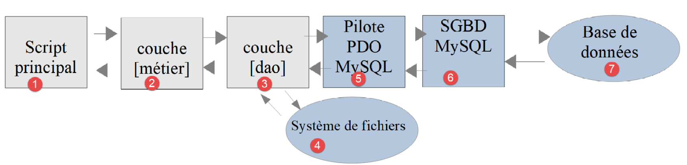
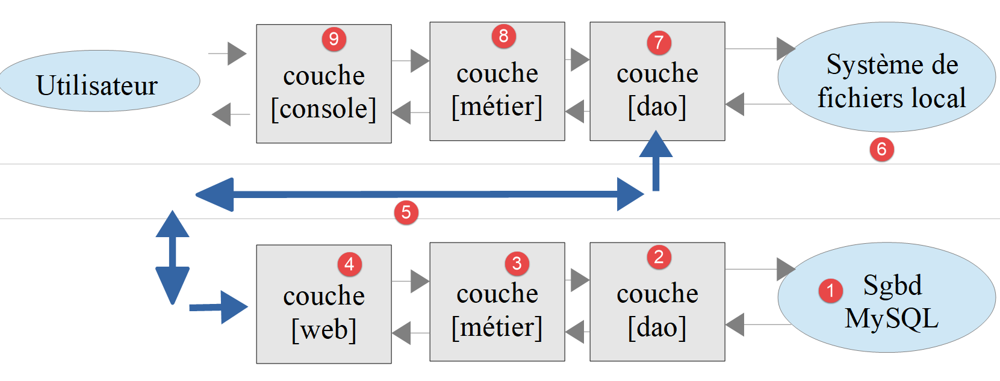
.. |image2| image:: ./chap-18/media/image3.png
   :width: 4.85433in
   :height: 1.09449in
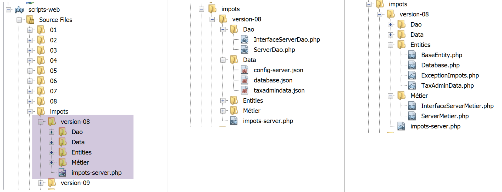
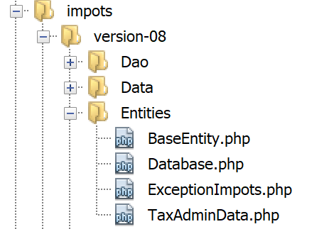
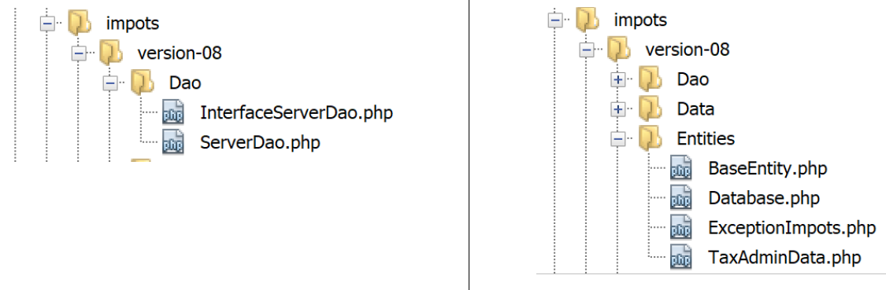

.. |image7| image:: ./chap-18/media/image3.png
   :width: 4.85433in
   :height: 1.09449in
.. |image8| image:: ./chap-18/media/image3.png
   :width: 4.85433in
   :height: 1.09449in

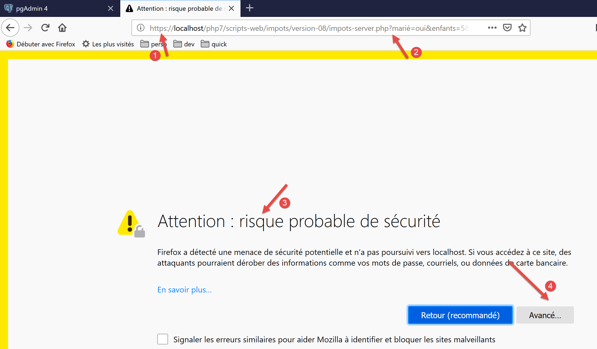

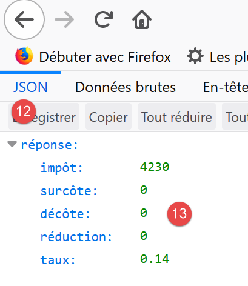
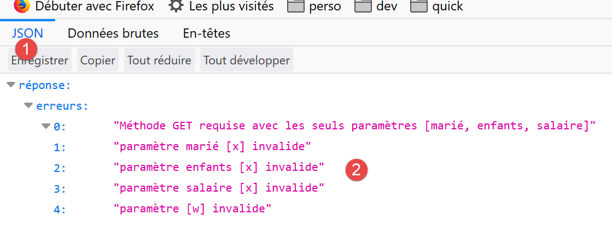
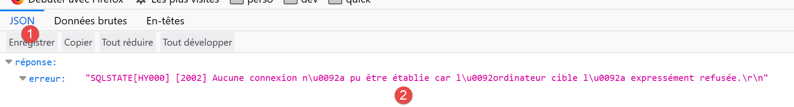

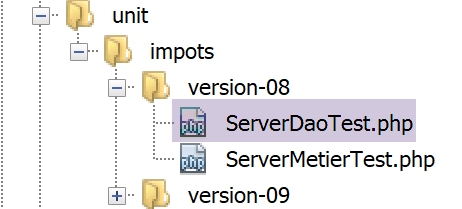

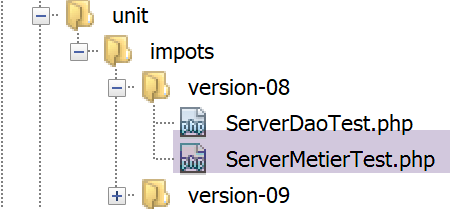
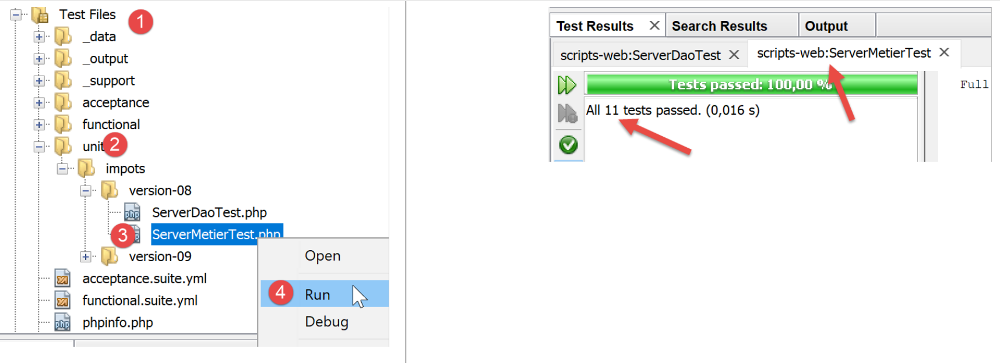
.. |image21| image:: ./chap-18/media/image19.png
   :width: 4.82717in
   :height: 1.12559in
.. |image22| image:: ./chap-18/media/image20.png
   :width: 6.61024in
   :height: 2.16535in

.. |image25| image:: ./chap-18/media/image19.png
   :width: 4.82717in
   :height: 1.12559in
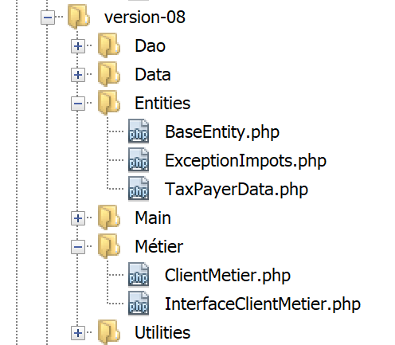
.. |image27| image:: ./chap-18/media/image19.png
   :width: 4.82717in
   :height: 1.12559in

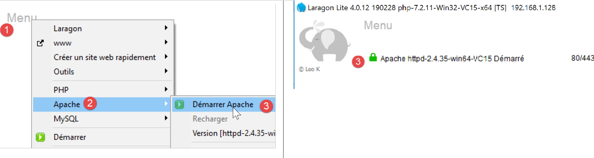

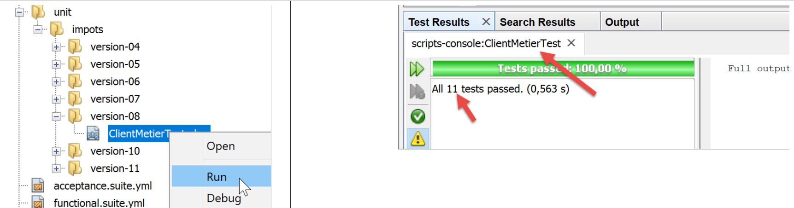
