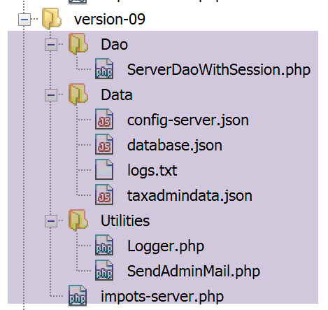
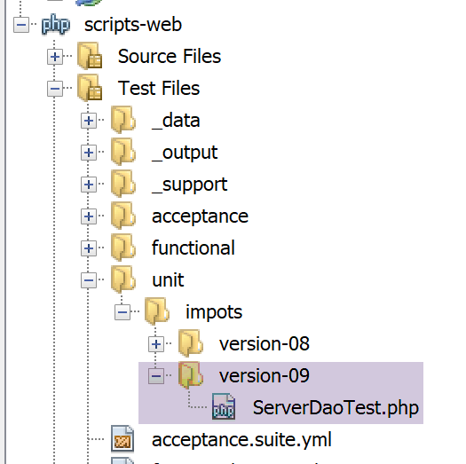
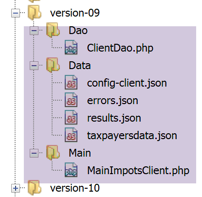
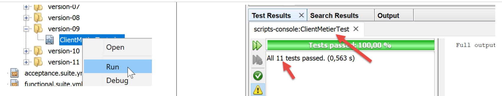
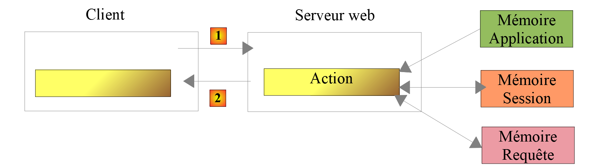

Exercice d’application – version 9
==================================

Dans cette version, nous allons améliorer le serveur de la façon
suivante :

-  actuellement, à chaque requête les données de l’administration
   fiscale sont cherchées dans la base de données. Nous allons utiliser
   une session :

   -  lors de la 1\ :sup:`re` requête d’un utilisateur, de
      l’administration fiscale sont cherchées dans la base de données et
      mises en session ;

   -  lors des requêtes suivantes du même utilisateur, de
      l’administration fiscale sont cherchées dans la session. On peut
      espérer un léger gain de temps d’exécution car les requêtes en
      base de données coûtent cher ;

-  le serveur va loguer dans un fichier texte, les moments importants :

   -  l’authentification réussie ou ratée ;

   -  la validité ou non des paramètres envoyés par le client ;

   -  le résultat du calcul d’impôt ;

   -  les différents cas d’erreur ;

-  en cas d’erreur fatale, un mail sera envoyé à l’administrateur de
   l’application ;

Le client devra lui aussi être modifié pour gérer le cookie de session
qu’on va lui envoyer.

Le serveur
----------

Nous nous intéressons à la partie serveur de l’application.

|image0|

Cette architecture sera implémentée par les scripts suivants :

|image1|

Utilitaires
~~~~~~~~~~~

|image2|

La classe [Logger]
^^^^^^^^^^^^^^^^^^

La classe **[Logger]** sera utilisée pour écrire des logs dans un
fichier texte :

.. code-block:: php 
   :linenos:

   <?php

   namespace Application;

   class Logger {
     // attribut
     private $resource;

     // constructeur
     public function __construct(string $logsFilename) {
       // ouverture du fichier
       $this->resource = fopen($logsFilename, "a");
       if (!$this->resource) {
         throw new ExceptionImpots("Echec lors de la création du fichier de logs [$logsFilename]");
       }
     }

     // écriture d'un message dans les logs
     public function write(string $message) {
       fputs($this->resource, (new \DateTime())->format("d/m/y H:i:s:v") . " : $message");
     }

     // fermeture du fichier des logs
     public function close() {
       fclose($this->resource);
     }

   }

**Commentaires**

-  ligne 7 : la ressource du fichier de logs ;

-  ligne 10 : le constructeur de la classe reçoit comme paramètre le nom
   du fichier de logs ;

-  ligne 12 : on ouvre le fichier texte en mode ajout (a+) : le fichier
   sera ouvert, son contenu préservé. Les écritures se feront derrière
   le contenu actuel ;

-  lignes 13-15 : si l’ouverture n’a pu se faire, une exception est
   lancée ;

-  lignes 19-21 : la méthode **[write]** permet d’écrire le message
   **[$message]** dans le fichier de logs, précédé de la date et de
   l’heure ;

-  lignes 24-16 : la méthode **[close]** permet permet de fermer le
   fichier de logs ;

**Note** : l’application serveur est susceptible de servir plusieurs
clients simultanément. Or on a un seul fichier de logs pour tous. Il y a
donc un risque d’accès concurrents pour écrire dans le fichier. Il
faudrait donc synchroniser les écritures pour éviter que celles-ci ne se
mélangent. Pour cela PHP dispose de sémaphores
**[https://www.php.net/manual/fr/book.sem.php]**. Nous ignorerons la
synchronisation des écritures ici mais il faut rester conscient du
problème.

La classe [SendAdminMail]
^^^^^^^^^^^^^^^^^^^^^^^^^

La classe **[SendAdminMail]** permet d’envoyer un mail à
l’administrateur de l’application en cas de plantage de celle-ci :

.. code-block:: php 
   :linenos:

   <?php

   namespace Application;

   class SendAdminMail {
     // attributs
     private $config;
     private $logger;

     // constructeur
     public function __construct(array $config, Logger $logger = NULL) {
       $this->config = $config;
       $this->logger = $logger;
     }

     public function send() {
       // envoie $this->config['message'] au serveur smtp $this->config['smtp-server'] sur le port $infos[smt-port]
       // si $this->config['tls'] est vrai, le support TLS sera utilisé
       // le mail est envoyé de la part de $this->config['from']
       // pour le destinataire $this->config['to']
       // le message a le sujet $this->config['subject']
       // on attache au mail les attachements de $this->config['attachments']
       // le résultat de la méthode
       try {
         // création du message
         $message = (new \Swift_Message())
           // sujet du message
           ->setSubject($this->config["subject"])
           // expéditeur
           ->setFrom($this->config["from"])
           // destinataires avec un dictionnaire (setTo/setCc/setBcc)
           ->setTo($this->config["to"])
           // texte du message
           ->setBody($this->config["message"])
         ;
         // attachements
         foreach ($this->config["attachments"] as $attachment) {
           // chemin de l'attachement
           $fileName = __DIR__ . $attachment;
           // on vérifie que le fichier existe
           if (file_exists($fileName)) {
             // on attache le document au message
             $message->attach(\Swift_Attachment::fromPath($fileName));
           } else {
             if ($this->logger !== NULL) {
               // erreur
               $this->logger->write("L'attachement [$fileName] n'existe pas\n");
             }
           }
         }
         // protocole TLS ?
         if ($this->config["tls"] === "TRUE") {
           // TLS
           $transport = (new \Swift_SmtpTransport($this->config["smtp-server"], $this->config["smtp-port"], 'tls'))
             ->setUsername($this->config["user"])
             ->setPassword($this->config["password"]);
         } else {
           // pas de TLS
           $transport = (new \Swift_SmtpTransport($this->config["smtp-server"], $this->config["smtp-port"]));
         }
         // le gestionnaire de l'envoi
         $mailer = new \Swift_Mailer($transport);
         // envoi du message
         $mailer->send($message);
         // fin
         if ($this->logger !== NULL) {
           $this->logger->write("Message [{$this->config["message"]}] envoyé à {$this->config["to"]}\n");
         }
       } catch (\Throwable $ex) {
         // erreur
         if ($this->logger !== NULL) {
           $this->logger->write("Erreur lors de l'envoi du message [{$this->config["message"]}] à {$this->config["to"]}\n");
         }
       }
     }

   }

**Commentaires**

-  ligne 11 : le constructeur reçoit deux paramètres :

   -  **[$config]** : un tableau associatif contenant toutes les
      informations nécessaires à l’envoi du mail ;

   -  **[$logger]** : un logger permettant de loguer les moments
      importants de l’envoi du mail ;

Le tableau associatif aura la forme suivante :

.. code-block:: php 
   :linenos:

   {
           "smtp-server": "localhost",
           "smtp-port": "25",
           "from": "guest@localhost",
           "to": "guest@localhost",
           "subject": "plantage du serveur de calcul d'impôts",
           "tls": "FALSE",
           "attachments": []
   }

-  lignes 16-76 : la méthode **[send]** permet d’envoyer le mail. Ce
   code a été présenté et décrit au paragraphe
   `lien <#_Client_POP3_/>`__ ;

La couche [dao]
~~~~~~~~~~~~~~~

|image3|

Le script **[ServeurDaoWithSession.php]** est le suivant :

.. code-block:: php 
   :linenos:

   <?php

   // espace de noms
   namespace Application;

   // définition d'une classe ImpotsWithDataInDatabase
   class ServerDaoWithSession extends ServerDao {

     // constructeur
     public function __construct(string $databaseFilename = NULL, TaxAdminData $taxAdminData = NULL) {
       // cas le + simple
       if ($taxAdminData !== NULL) {
         $this->taxAdminData = $taxAdminData;
       } else {
         // on passe la main à la classe parent
         parent::__construct($databaseFilename);
       }
     }

   }

**Commentaires**

-  ligne 7 : la classe **[ServerDaoWithSession]** de la version 09 étend
   la classe **[ServerDao]** de la version 08. En effet, la classe
   **[ServerDao]** sait utiliser la base de données. Il ne nous reste
   plus qu’à prévoir le cas où les données de l’administration fiscale
   ont déjà été acquises :

-  ligne 10 : le constructeur reçoit maintenant deux paramètres :

   -  **[string $databaseFilename]** : nom du fichier contenant les
      informations permettant de se connecter à la base de données si
      les données de l’administration fiscale n’ont pas encore été
      acquises, NULL sinon ;

   -  **[TaxAdminData $taxAdminData]** : les données de l’administration
      fiscale si déjà acquises, NULL sinon ;

Lors du démarrage d’une session web, la couche **[dao]** sera construite
avec un objet **[$databaseFilename]** non NULL et un objet
**[taxAdminData]** NULL. Les données de l’administration fiscale seront
alors recherchées en base et mémorisées dans la session. Lors des
requêtes ultérieures de la même session, la couche **[dao]** sera
construite avec un objet **[databaseFilename]** NULL et un objet
**[taxAdminData]** provenant de la session et non NULL. Il n’y aura donc
pas de recherche en base.

Le script serveur
~~~~~~~~~~~~~~~~~

Le script serveur **[impots-server.php]** est configuré par le fichier
jSON **[config-server.json]** suivant :

.. code-block:: php 
   :linenos:

   {
       "rootDirectory": "C:/myprograms/laragon-lite/www/php7/scripts-web/impots/version-09",
       "databaseFilename": "Data/database.json",
       "relativeDependencies": [
           "/../version-08/Entities/BaseEntity.php",
           "/../version-08/Entities/ExceptionImpots.php",
           "/../version-08/Entities/TaxAdminData.php",
           "/../version-08/Entities/Database.php",
           "/../version-08/Dao/InterfaceServerDao.php",
           "/../version-08/Dao/ServerDao.php",
           "/Dao/ServerDaoWithSession.php",
           "/../version-08/Métier/InterfaceServerMetier.php",
           "/../version-08/Métier/ServerMetier.php",
           "/Utilities/Logger.php",
           "/Utilities/SendAdminMail.php"
       ],
       "absoluteDependencies": ["C:/myprograms/laragon-lite/www/vendor/autoload.php"],
       "users": [
           {
               "login": "admin",
               "passwd": "admin"
           }
       ],
       "adminMail": {
           "smtp-server": "localhost",
           "smtp-port": "25",
           "from": "guest@localhost",
           "to": "guest@localhost",
           "subject": "plantage du serveur de calcul d'impôts",
           "tls": "FALSE",
           "attachments": []
       },
       "logsFilename": "Data/logs.txt"
   }

Le script serveur **[impots-server.php]** évolue de la façon suivante :

.. code-block:: php 
   :linenos:

   <?php

   // respect strict des types déclarés des paramètres de foctions
   declare (strict_types=1);

   // espace de noms
   namespace Application;

   // gestion des erreurs par PHP
   ini_set("display_errors", "0");
   //
   // chemin du fichier de configuration
   define("CONFIG_FILENAME", "Data/config-server.json");

   // on récupère la configuration
   $config = \json_decode(file_get_contents(CONFIG_FILENAME), true);

   // on inclut les dépendances nécessaires au script
   $rootDirectory = $config["rootDirectory"];
   foreach ($config["relativeDependencies"] as $dependency) {
     require "$rootDirectory$dependency";
   }
   // dépendances absolues (bibliothèques tierces)
   foreach ($config["absoluteDependencies"] as $dependency) {
     require "$dependency";
   }
   //
   // dépendances Symfony
   use \Symfony\Component\HttpFoundation\Response;
   use \Symfony\Component\HttpFoundation\Request;
   use \Symfony\Component\HttpFoundation\Session\Session;

   // session
   $session = new Session();
   $session->start();

   // préparation de la réponse JSON du serveur
   $response = new Response();
   $response->headers->set("content-type", "application/json");
   $response->setCharset("utf-8");

   // création du fichier des logs
   try {
     $logger = new Logger($config['logsFilename']);
   } catch (ExceptionImpots $ex) {
     // internal server error
     doInternalServerError($ex->getMessage(), $response, NULL, $config['adminMail']);
     // terminé
     exit;
   }

   // 1er log
   $logger->write("\n---nouvelle requête\n");

   // on récupère la requête courante
   $request = Request::createFromGlobals();
   // authentification seulement la 1re fois
   if (!$session->has("user")) {
     // log
     $logger->write("Autentification en cours…\n");
     // authentification
     …
     }
     // a-t-on trouvé l'utilisateur ?
     if (!$trouvé) {
       // pas trouvé - code 401 HTTP_UNAUTHORIZED
       sendResponse(
         $response,
         ["erreur" => "Echec de l'authentification [$requestUser, $requestPassword]"],
         Response::HTTP_UNAUTHORIZED,
         ["WWW-Authenticate" => "Basic realm=" . utf8_decode("\"Serveur de calcul d'impôts\"")],
         $logger
       );
       // terminé
       exit;
     } else {
       // on note dans la session qu'on a authentifié l'utilisateur
       $session->set("user", TRUE);
       // log
       $logger->write("Authentification réussie [$requestUser, $requestPassword]\n");
     }
   } else {
     // log
     $logger->write("Authentification prise en session…\n");
   }
   // on a un utilisateur valide - on vérifie les paramètres reçus
   $erreurs = [];
   // on doit avoir trois paramètres GET
   …

   // erreurs ?
   if ($erreurs) {
   // on envoie un code d'erreur 400 HTTP_BAD_REQUEST au client
     sendResponse($response, ["erreurs" => $erreurs], Response::HTTP_BAD_REQUEST, [], $logger);
     // terminé
     exit;
   } else {
     // logs
     $logger->write("paramètres ['marié'=>$marié, 'enfants'=>$enfants, 'salaire'=>$salaire] valides\n");
   }
   // on a tout ce qu'il faut pour travailler
   // création de la couche [dao]
   if (!$session->has("taxAdminData")) {
     // les données sont prises dans la base de données
     $logger->write("données fiscales prises en base de données\n");
     try {
       // construction de la couche [dao]
       $dao = new ServerDaoWithSession($config["databaseFilename"], NULL);
       // on met les données en session
       $session->set("taxAdminData", $dao->getTaxAdminData());
     } catch (\RuntimeException $ex) {
       // on note l'erreur
       doInternalServerError(utf8_encode($ex->getMessage()), $response, $logger, $config['adminMail']);
       // terminé
       exit;
     }
   } else {
     // les données sont prises dans la session
     $dao = new ServerDaoWithSession(NULL, $session->get("taxAdminData"));
     // logs
     $logger->write("données fiscales prises en session\n");
   }
   // création de la couche [métier]
   $métier = new ServerMetier($dao);
   // calcul de l'impôt
   $result = $métier->calculerImpot($marié, (int) $enfants, (int) $salaire);
   // on rend la réponse
   sendResponse($response, $result, Response::HTTP_OK, [], $logger);
   // fin
   exit;

   function doInternalServerError(string $message, Response $response, Logger $logger = NULL, array $infos) {
     // on envoie un mail à l'administrateur
     // SendAdminMail intercepte toutes les exception et les logue lui-même
     $infos['message'] = $message;
     $sendAdminMail = new SendAdminMail($infos, $logger);
     $sendAdminMail->send();
     // on envoie un code d'erreur 500 au client
     sendResponse($response, ["erreur" => $message], Response::HTTP_INTERNAL_SERVER_ERROR, [], $logger);
   }

   // fonction d'envoi de la réponse HTTP au client
   function sendResponse(Response $response, array $result, int $statusCode, array $headers, Logger $logger) {
     // $response : réponse HTTP
     // $result : tableau des résultats
     // $statusCode : statut HTTP de la réponse
     // $headers : entêtes HTTP à mettre dans la réponse
     // $logger : le logueur de l'application
     //
     // statut HTTTP
     $response->setStatusCode($statusCode);
     // body
     $body = \json_encode(["réponse" => $result], JSON_UNESCAPED_UNICODE);
     $response->setContent($body);
     // headers
     $response->headers->add($headers);
     // envoi
     $response->send();
     // log
     if ($logger != NULL) {
       $logger->write("$body\n");
       $logger->close();
     }
   }

**Commentaires**

-  lignes 34-35 : on démarre une session ;

-  lignes 38-40 : on prépare une réponse jSON ;

-  lignes 42-50 : on essaie de créer le fichier de logs. Si exception il
   y a, la méthode **[doInternalServer]** (lignes 132-140) est appelée ;

-  ligne 132 : la méthode **[doInternalServer]** accepte quatre
   paramètres :

   -  **[$message]** : le message à loguer. Doit être codé en UTF-8 ;

   -  **[$response]** : l’objet **[Response]** qui encapsule la réponse
      du serveur à son client ;

   -  **[$logger]** : l’objet **[Logger]** permettant de faire les
      logs ;

   -  **[$infos]** : les informations permettant d’envoyer un mail à
      l’administrateur de l’application ;

-  lignes 135-137 : on envoie un mail à l’administrateur de
   l’application ;

-  ligne 139 : on envoie la réponse au client :

   -  $response : réponse HTTP ;

   -  $result : le serveur envoie la chaîne jSON du tableau
      **[‘réponse’=>["erreur" => $message]**] ;

   -  $statusCode : **[Response::HTTP_INTERNAL_SERVER_ERROR]**, code
      500 ;

   -  $headers : [], pas d’entêtes HTTP à ajouter à la réponse ;

   -  $logger : le logueur de l’application ;

-  ligne 58 : grâce à la session mise en place on ne fera
   l’authentification du client qu’une seule fois :

   -  une fois le client authentifié, on mettra une clé **[user]** dans
      la session (ligne 78) ;

   -  lors de la requête suivante du même client, la ligne 58 évite une
      authentification devenue inutile ;

-  ligne 103 : grâce à la session mise en place on ne cherchera les
   données en base qu’une seule fois :

   -  lors de la première requête, la recherche en base se fera (ligne
      108). Les données récupérées sont ensuite mises en session (ligne
      110) associées à la clé **[taxAdminData]** ;

   -  lors des requêtes suivantes, la clé **[taxAdminData]** sera
      trouvée en session (ligne 103) et alors les données discales
      seront directement communiquées à la couche **[dao]** (ligne
      119) ;

-  lignes 111-116 : la recherche des données fiscales en base peut
   échouer. Dans ce cas, on envoie au client un code **[500 Internal
   Server Error]** ;

-  ligne 113 : le message d’erreur de l’exception du pilote MySQL est
   codé en ISO 8859-1. On le convertit en UTF-8 pour être correctement
   logué ;

-  le reste du code est quasi identique à celui de la version
   précédente ;

-  lignes 143-164 : la fonction **[sendResponse]** envoie toutes les
   réponses au client ;

-  lignes 144-148 : signification des paramètres ;

-  ligne 153 : la réponse est toujours la chaîne jSON d’un tableau
   **[‘résultat’=>qqChose]** ;

-  ligne 156 : parfois il y a des entêtes HTTP à ajouter à la réponse.
   C’est le cas en ligne 71 ;

-  ligne 158 : la réponse est envoyée ;

-  lignes 160-163 : la réponse est loguée et le logueur fermé ;

Tests [Codeception]
~~~~~~~~~~~~~~~~~~~

|image4|

Nous n’allons tester que la couche **[dao]** qui est la seule à avoir
changé.

Le code du test **[ServerDaoTest]** est le suivant :

.. code-block:: php 
   :linenos:

   <?php

   // respect strict des types déclarés des paramètres de foctions
   declare (strict_types=1);

   // espace de noms
   namespace Application;

   // définition des constantes
   define("ROOT", "C:/myprograms/laragon-lite/www/php7/scripts-web/impots/version-09");
   // chemin du fichier de configuration
   define("CONFIG_FILENAME", ROOT . "/Data/config-server.json");

   // on récupère la configuration
   $config = \json_decode(\file_get_contents(CONFIG_FILENAME), true);
   // on inclut les dépendances nécessaires au script
   $rootDirectory = $config["rootDirectory"];
   foreach ($config["relativeDependencies"] as $dependency) {
     require "$rootDirectory$dependency";
   }
   // dépendances absolues (bibliothèques tierces)
   foreach ($config["absoluteDependencies"] as $dependency) {
     require "$dependency";
   }

   // test -----------------------------------------------------

   class ServerDaoTest extends \Codeception\Test\Unit {
     // TaxAdminData
     private $taxAdminData;

     public function __construct() {
       // parent
       parent::__construct();
       // on récupère la configuration
       $config = \json_decode(\file_get_contents(CONFIG_FILENAME), true);
       // création de la couche [dao]
       $dao = new ServerDaoWithSession(ROOT . "/" . $config["databaseFilename"]);
       $this->taxAdminData = $dao->getTaxAdminData();
     }

     // tests
     public function testTaxAdminData() {
       …
     }

   }

-  lignes 9-24 : on crée un environnement d’exécution identique à celui
   du script serveur **[impots-server]** ;

-  ligne 38 : pour construire la couche **[dao]**, on instancie la
   classe **[ServerDaoWithSession]** ;

Le résultat des tests est le suivant :

|image5|

Le client
---------

Nous nous intéressons à la partie cliente de l’application.

|image6|

Cette architecture sera implémentée par les scripts suivants :

|image7|

Dans la nouvelle version, seuls changent :

-  le fichier de configuration **[config-client.json]** ;

-  la couche **[dao]** du client ;

.. _la-couche-dao-1:

La couche [dao]
~~~~~~~~~~~~~~~

La couche **[Dao]** évolue de la façon suivante :

.. code-block:: php 
   :linenos:

   <?php

   namespace Application;

   // dépendances
   use \Symfony\Component\HttpClient\HttpClient;

   class ClientDao implements InterfaceClientDao {
     // utilisation d'un Trait
     use TraitDao;
     // attributs
     private $urlServer;
     private $user;
     private $sessionCookie;

     // constructeur
     public function __construct(string $urlServer, array $user) {
       $this->urlServer = $urlServer;
       $this->user = $user;
     }

     // calcul de l'impôt
     public function calculerImpot(string $marié, int $enfants, int $salaire): array {
       // cookie de session ?
       if (!$this->sessionCookie) {
         // on crée un client HTTP
         $httpClient = HttpClient::create([
             'auth_basic' => [$this->user["login"], $this->user["passwd"]],
             "verify_peer" => false
         ]);
         // on fait la requête au serveur sans cookie de session
         $response = $httpClient->request('GET', $this->urlServer,
           ["query" => [
               "marié" => $marié,
               "enfants" => $enfants,
               "salaire" => $salaire
             ]
         ]);
       } else {
         // on fait la requête au serveur avec le cookie de session
         // on crée un client HTTP
         $httpClient = HttpClient::create([
             "verify_peer" => false
         ]);
         $response = $httpClient->request('GET', $this->urlServer,
           ["query" => [
               "marié" => $marié,
               "enfants" => $enfants,
               "salaire" => $salaire
             ],
             "headers" => ["Cookie" => $this->sessionCookie]
         ]);
       }
       // on récupère la réponse
       $json = $response->getContent(false);
       $array = \json_decode($json, true);
       $réponse = $array["réponse"];
       // logs
       print "$json=json\n";
       // on récupère le statut de la réponse
       $statusCode = $response->getStatusCode();
       // erreur ?
       if ($statusCode !== 200) {
         // on a une erreur - on lance une exception
         $réponse = ["statut HTTP" => $statusCode] + $réponse;
         $message = \json_encode($réponse, JSON_UNESCAPED_UNICODE);
         throw new ExceptionImpots($message);
       }
       if (!$this->sessionCookie) {
         // on récupère le cookie de session
         $headers = $response->getHeaders();
         if (isset($headers["set-cookie"])) {
           // cookie de session ?
           foreach ($headers["set-cookie"] as $cookie) {
             $match = [];
             $match = preg_match("/^PHPSESSID=(.+?);/", $cookie, $champs);
             if ($match) {
               $this->sessionCookie = "PHPSESSID=" . $champs[1];
             }
           }
         }
       }
       // on rend la réponse
       return $réponse;
     }

   }

**Commentaires**

La modification de la couche **[dao]** consiste à maintenant gérer une
session :

-  ligne 14 : le cookie de la session ;

-  lignes 25-39 : lors de la 1\ :sup:`re` requête ce cookie n’existe
   pas : on fait alors la requête auprès du serveur en envoyant les
   informations d’authentification (ligne 28) ;

-  lignes 40-53 : lors des requêtes suivantes, on a normalement le
   cookie de session. On n’envoie pas alors les informations
   d’authentification (lignes 42-44) ;

-  lignes 69-82 : la réponse du serveur à la 1\ :sup:`re` requête va
   comporter un cookie de session. On le récupère. Ce code a déjà été
   utilisé et expliqué au paragraphe `lien <#_Le_client>`__ ;

-  ligne 78 : le cookie de session récupéré est mémorisé dans l’attribut
   de classe **[$sessionCookie]** ;

**Note** : on aurait pu garder l’ancienne version de la couche **[dao]**
et faire l’authentification à chaque requête car celle-ci a un coût
négligeable. Par souci pédagogique, on a voulu rappeler comment un
client HTTP pouvait gérer une session.

Le fichier de configuration
~~~~~~~~~~~~~~~~~~~~~~~~~~~

Le fichier de configuration jSON évolue de la façon suivante :

.. code-block:: php 
   :linenos:

   {
       "rootDirectory": "C:/Data/st-2019/dev/php7/poly/scripts-console/impots/version-09",
       "taxPayersDataFileName": "Data/taxpayersdata.json",
       "resultsFileName": "Data/results.json",
       "errorsFileName": "Data/errors.json",
       "dependencies": [
           "/../version-08/Entities/BaseEntity.php",
           "/../version-08/Entities/TaxPayerData.php",
           "/../version-08/Entities/ExceptionImpots.php",
           "/../version-08/Utilities/Utilitaires.php",
           "/../version-08/Dao/InterfaceClientDao.php",
           "/../version-08/Dao/TraitDao.php",
           "/Dao/ClientDao.php",
           "/../version-08/Métier/InterfaceClientMetier.php",
           "/../version-08/Métier/ClientMetier.php"
       ],
       "absoluteDependencies": [
           "C:/myprograms/laragon-lite/www/vendor/autoload.php"
       ],
       "user": {
           "login": "admin",
           "passwd": "admin"
       },
       "urlServer": "https://localhost:443/php7/scripts-web/impots/version-09/impots-server.php"
   }

Seule l’URL de la ligne 24 change.

Quelques tests
--------------

Test 1
~~~~~~

Tout d’abord nous exécutons le client dans un environnement sans
erreurs. Les résultats sont toujours ceux des versions précédentes. Mais
maintenant côté serveur, on a un fichier de logs **[logs.txt]** :

.. code-block:: php 
   :linenos:

   04/07/19 13:16:08:523 :
   ---nouvelle requête
   04/07/19 13:16:08:529 : Autentification en cours…
   04/07/19 13:16:08:529 : Authentification réussie [admin, admin]
   04/07/19 13:16:08:529 : paramètres ['marié'=>oui, 'enfants'=>2, 'salaire'=>55555] valides
   04/07/19 13:16:08:529 : tranches d'impôts prises en base de données
   04/07/19 13:16:08:534 : {"réponse":{"impôt":2814,"surcôte":0,"décôte":0,"réduction":0,"taux":0.14}}
   04/07/19 13:16:08:643 :
   ---nouvelle requête
   04/07/19 13:16:08:648 : Authentification prise en session…
   04/07/19 13:16:08:648 : paramètres ['marié'=>oui, 'enfants'=>2, 'salaire'=>50000] valides
   04/07/19 13:16:08:648 : tranches d'impôts prises en session
   04/07/19 13:16:08:648 : {"réponse":{"impôt":1384,"surcôte":0,"décôte":384,"réduction":347,"taux":0.14}}
   04/07/19 13:16:08:769 :
   ---nouvelle requête
   04/07/19 13:16:08:775 : Authentification prise en session…
   04/07/19 13:16:08:775 : paramètres ['marié'=>oui, 'enfants'=>3, 'salaire'=>50000] valides
   04/07/19 13:16:08:775 : tranches d'impôts prises en session
   04/07/19 13:16:08:775 : {"réponse":{"impôt":0,"surcôte":0,"décôte":720,"réduction":0,"taux":0.14}}
   04/07/19 13:16:08:888 :
   ---nouvelle requête
   …

-  lignes 3-7 : lors de la 1\ :sup:`re` requête, il y a authentification
   et recherche des données en base ;

-  lignes 9-14 : lors de la requête suivante, il n’y a plus
   d’authentification et les données sont prises en session. Cela se
   répète lors des requêtes suivantes (lignes 15 et au-delà) ;

Test 2
~~~~~~

Maintenant coupons la base de données MySQL. Côté client, on a le
résultat console suivant :

.. code-block:: php 
   :linenos:

   L'erreur suivante s'est produite : {"statut HTTP":500,"erreur":"SQLSTATE[HY000] [2002] Aucune connexion n’a pu être établie car l’ordinateur cible l’a expressément refusée.\r\n"}
   Terminé

Côté serveur, on a les logs **[logs.txt]** suivant :

.. code-block:: php 
   :linenos:

   04/07/19 13:19:52:396 :
   ---nouvelle requête
   04/07/19 13:19:52:405 : Autentification en cours…
   04/07/19 13:19:52:405 : Authentification réussie [admin, admin]
   04/07/19 13:19:52:405 : paramètres ['marié'=>oui, 'enfants'=>2, 'salaire'=>55555] valides
   04/07/19 13:19:52:405 : tranches d'impôts prises en base de données
   04/07/19 13:19:54:461 : {"réponse":{"erreur":"SQLSTATE[HY000] [2002] Aucune connexion n’a pu être établie car l’ordinateur cible l’a expressément refusée.\r\n"}}
   04/07/19 13:19:55:602 : Message [SQLSTATE[HY000] [2002] Aucune connexion n’a pu être établie car l’ordinateur cible l’a expressément refusée.
   ] envoyé à guest@localhost
   04/07/19 13:19:55:706 :
   ---nouvelle requête
   …

Pour avoir le mail reçu par l’administrateur de l’application, on
utilise le script **[imap-03.php]** du paragraphe
`lien <#_Le_script_[imap-03.php]>`__ avec le fichier de configuration
**[config-imap-01.json]** suivant :

.. code-block:: php 
   :linenos:

   {
       "{localhost:110/pop3}": {
           "imap-server": "localhost",
           "imap-port": "110",
           "user": "guest@localhost",
           "password": "guest",
           "pop3": "TRUE",
           "output-dir": "output/localhost-pop3"
       }
   }

On obtient le résultat suivant :

|image8|

Le fichier **[message_1.txt]** contient le texte suivant :

.. code-block:: php 
   :linenos:

   return-path: guest@localhost
   received: from localhost (localhost [127.0.0.1]) by DESKTOP-528I5CU with ESMTP ; Thu, 4 Jul 2019 15:20:22 +0200
   message-id: <c82d26df5fb352e10a51577cd1b9ed87@localhost>
   date: Thu, 04 Jul 2019 13:20:20 +0000
   subject: plantage du serveur de calcul d'impôts
   from: guest@localhost
   to: guest@localhost
   mime-version: 1.0
   content-type: text/plain; charset=utf-8
   content-transfer-encoding: quoted-printable

   SQLSTATE[HY000] [2002] Aucune connexion n’a pu être établie car l’ordinateur cible l’a expressément refusée.

Test 3
~~~~~~

Maintenant faison en sorte que le fichier **[logs.txt]** ne puisse être
créé. Pour cela, il suffit de créer un dossier **[logs.txt]** :

|image9|

Ceci fait, exécutons le client.

Côté client, on a les résultats console suivants :

.. code-block:: php 
   :linenos:

   L'erreur suivante s'est produite : {"statut HTTP":500,"erreur":"Echec lors de la création du fichier de logs [Data\/logs.txt]"}
   Terminé

Côté serveur, il n’y a pas de logs mais l’administrateur reçoit le mail
suivant :

.. code-block:: php 
   :linenos:

   return-path: guest@localhost
   received: from localhost (localhost [127.0.0.1]) by DESKTOP-528I5CU with ESMTP ; Thu, 4 Jul 2019 15:31:49 +0200
   message-id: <b2cee274f3437952231d62152ba1cdb3@localhost>
   date: Thu, 04 Jul 2019 13:31:48 +0000
   subject: plantage du serveur de calcul d'impôts
   from: guest@localhost
   to: guest@localhost
   mime-version: 1.0
   content-type: text/plain; charset=utf-8
   content-transfer-encoding: quoted-printable

   Echec lors de la création du fichier de logs [Data/logs.txt]

Test 4
~~~~~~

Cette fois-ci, donnons, dans le fichier de configuration du client, des
identifiants erronés au client qui se connecte.

Le client affiche les résultats console suivants :

.. code-block:: php 
   :linenos:

   L'erreur suivante s'est produite : {"statut HTTP":401,"erreur":"Echec de l'authentification [x, x]"}
   Terminé

Côté serveur, les logs suivants apparaissent :

.. code-block:: php 
   :linenos:

   ---nouvelle requête
   04/07/19 13:36:05:789 : Autentification en cours…
   04/07/19 13:36:05:789 : {"réponse":{"erreur":"Echec de l'authentification [x, x]"}}

Test 5
~~~~~~

Remettons le bon utilisateur **[admin, admin]** dans le fichier de
configuration du client.

Maintenant demandons l’URL
**[http://localhost/php7/scripts-web/impots/version-08/impots-server.php]**
du serveur directement dans un navigateur sans passer de paramètres :

Dans le fichier de logs **[logs.txt]** du serveur, on a les lignes
suivantes :

.. code-block:: php 
   :linenos:

   ---nouvelle requête
   04/07/19 13:37:33:711 : Autentification en cours…
   04/07/19 13:37:33:711 : Authentification réussie [admin, admin]
   04/07/19 13:37:33:711 : {"réponse":{"erreurs":["Méthode GET requise avec les seuls paramètres [marié, enfants, salaire]","paramètre marié manquant","paramètre enfants manquant","paramètre salaire manquant"]}}

.. _tests-codeception-1:

Tests [Codeception]
-------------------

Comme il a été fait pour les version précédentes, nous allons écrire des
tests **[Codeception]** pour la version 09.

|image10|

Test de la couche [métier]
~~~~~~~~~~~~~~~~~~~~~~~~~~

Le test **[ClientMetierTest.php]** est le suivant :

.. code-block:: php 
   :linenos:

   <?php

   // respect strict des types déclarés des paramètres de foctions
   declare (strict_types=1);

   // espace de noms
   namespace Application;

   // définition des constantes
   define("ROOT", "C:/Data/st-2019/dev/php7/poly/scripts-console/impots/version-09");

   // chemin du fichier de configuration
   define("CONFIG_FILENAME", ROOT . "/Data/config-client.json");

   // on récupère la configuration
   $config = \json_decode(file_get_contents(CONFIG_FILENAME), true);

   // on inclut les dépendances nécessaires au script
   $rootDirectory = $config["rootDirectory"];
   foreach ($config["dependencies"] as $dependency) {
     require "$rootDirectory/$dependency";
   }
   // dépendances absolues (bibliothèques tierces)
   foreach ($config["absoluteDependencies"] as $dependency) {
     require "$dependency";
   }
   //
   // uses
   use Codeception\Test\Unit;
   use const CONFIG_FILENAME;
   use const ROOT;

   // classe de test
   class ClientMetierTest extends Unit {
     …
   }

**Commentaires**

-  par rapport à la classe de test de la version 08, seule change la
   ligne 10 qui spécifie le dossier racine du client à tester ;

Les résultats du test sont les suivants :

|image11|

Il est intéressant d’aller voir les logs du serveur **[logs.txt]** :

.. code-block:: php 
   :linenos:

   04/07/19 13:48:48:525 :
   ---nouvelle requête
   04/07/19 13:48:48:536 : Autentification en cours…
   04/07/19 13:48:48:536 : Authentification réussie [admin, admin]
   04/07/19 13:48:48:536 : paramètres ['marié'=>oui, 'enfants'=>2, 'salaire'=>55555] valides
   04/07/19 13:48:48:536 : données fiscales prises en base de données
   04/07/19 13:48:48:548 : {"réponse":{"impôt":2814,"surcôte":0,"décôte":0,"réduction":0,"taux":0.14}}
   04/07/19 13:48:48:635 :
   ---nouvelle requête
   04/07/19 13:48:48:645 : Autentification en cours…
   04/07/19 13:48:48:645 : Authentification réussie [admin, admin]
   04/07/19 13:48:48:645 : paramètres ['marié'=>oui, 'enfants'=>2, 'salaire'=>50000] valides
   04/07/19 13:48:48:645 : données fiscales prises en base de données
   04/07/19 13:48:48:655 : {"réponse":{"impôt":1384,"surcôte":0,"décôte":384,"réduction":347,"taux":0.14}}
   04/07/19 13:48:48:751 :
   ---nouvelle requête
   04/07/19 13:48:48:762 : Autentification en cours…
   04/07/19 13:48:48:762 : Authentification réussie [admin, admin]
   04/07/19 13:48:48:762 : paramètres ['marié'=>oui, 'enfants'=>3, 'salaire'=>50000] valides
   04/07/19 13:48:48:762 : données fiscales prises en base de données
   04/07/19 13:48:48:773 : {"réponse":{"impôt":0,"surcôte":0,"décôte":720,"réduction":0,"taux":0.14}}
   04/07/19 13:48:48:865 :
   ---nouvelle requête
   …
   ---nouvelle requête
   04/07/19 13:48:49:546 : Autentification en cours…
   04/07/19 13:48:49:546 : Authentification réussie [admin, admin]
   04/07/19 13:48:49:546 : paramètres ['marié'=>oui, 'enfants'=>3, 'salaire'=>200000] valides
   04/07/19 13:48:49:546 : données fiscales prises en base de données
   04/07/19 13:48:49:551 : {"réponse":{"impôt":42842,"surcôte":17283,"décôte":0,"réduction":0,"taux":0.41}}

On constate que les données de l’administration fiscale sont toujours
prises dans la base de données et jamais dans la session. Revenons au
code du test exécuté :

.. code-block:: php 
   :linenos:

   <?php

   // respect strict des types déclarés des paramètres de foctions
   declare (strict_types=1);

   // espace de noms
   namespace Application;

   …

   // classe de test
   class ClientMetierTest extends Unit {
     // couche métier
     private $métier;

     public function __construct() {
       parent::__construct();
       // on récupère la configuration
       $config = \json_decode(\file_get_contents(CONFIG_FILENAME), true);
       // création de la couche [dao]
       $clientDao = new ClientDao($config["urlServer"], $config["user"]);
       // création de la couche [métier]
       $this->métier = new ClientMetier($clientDao);
     }

     // tests
     public function test1() {
       …
     }

     public function test2() {
       …
     }

     public function test3() {
       …
     }

     …

   }

Dans une classe de test **[Codeception]** **le constucteur est exécuté
pour chaque test**.

-  ligne 21 : un nouveau **[ClientDao]** est donc créé pour chaque test
   avec un cookie de session NULL. Ceci explique que ce client ne
   profite d’aucune session ;

Cet exemple nous montre que la session n’est pas le bon endroit pour
stocker les données de l’administration fiscale. En effet, celles-ci
sont communes à tous les utilisateurs de l’application. Or ici, elles
sont dupliquées dans chacune des sessions de ceux-ci.

En programmation web, on distingue trois types de visibilité pour les
données partagées :

-  des données **partagées par tous les utilisateurs** de l'application
   web. Ce sont en général des données en lecture seule. PHP ne dispose
   pas nativement de cette mémoire ;

-  des données partagées par les requêtes d'**un même client**. Ces
      données sont mémorisées dans la session. On parle alors de
      **session client** pour désigner la mémoire du client. Toutes les
      requêtes d'un client ont accès à cette session. Elles peuvent y
      stocker et y lire des informations. Dans les scripts précédents,
      cette session est implémentée par l’objet Symfony
      **[HttpFoundation\Session\Session]** ;

-  la **mémoire de requête**, ou contexte de requête. La requête d'un
      utilisateur peut être traitée par plusieurs actions successives.
      Le contexte de la requête permet à une action 1 de transmettre de
      l'information à une action 2. Dans les scripts précédents, la
      requête est implémentée par l’objet Symfony
      **[HttpFoundation\Request]** et sa mémoire par l’attribut
      **[HttpFoundation\Request::attributes]** ;

|image12|

Des bibliothèques tierces existent pour donner à PHP une mémoire
d’application. La nouvelle version de l’exercices d’application montre
l’usage de l’une d’elles.

.. |image0| image:: ./chap-19/media/image1.png
   :width: 4.85433in
   :height: 1.09449in

.. |image6| image:: ./chap-19/media/image7.png
   :width: 4.82717in
   :height: 1.12559in

