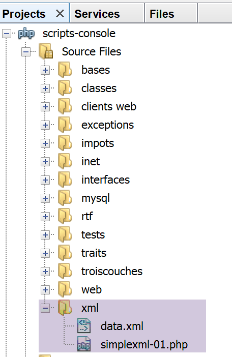

Exercice d’application – version 10
===================================

La version précédente a montré que les données fiscales, partagées par
tous les utilisateurs de l’application, devraient être stockées dans une
mémoire de portée **[Application]**. Nous allons utiliser un serveur
Redis **[https://redis.io]** pour implémenter celle-ci.

Redis
-----

La mémoire de portée **[Application]** sera implémentée par un serveur
Redis. Les scripts PHP ayant besoin de cette mémoire d’application
seront des clients de ce serveur :

|image0|

Installation de Redis
---------------------

Laragon vient avec un serveur Redis non activé par défaut. Il faut donc
commencer par l’activer :

|image1|

-  en **[3]**, activer le serveur **[Redis]** ;

-  en **[4]**, laisser le port **[6379]** que les clients Redis
   utilisent par défaut ;

Les services Laragon sont automatiquement relancés après activation de
Redis :

|image2|

Le client Redis en mode commande
--------------------------------

Le serveur Redis peut être interrogé en mode commande. On ouvre un
terminal Laragon (cf paragraphe `lien <#_Installation_de_Laragon>`__) :

|image3|

-  en **[1]**, la commande **[redis-cli]** lance le client en mode
   commande du serveur Redis ;

En juillet 2019, le client Redis peut utiliser 172 commandes pour
dialoguer avec le serveur **[https://redis.io/commands#list]**. L’une
d’elles **[command count]** **[2]**, affiche ce nombre **[3]**.

Nous n’allons présenter que celles dont nous allons avoir besoin dans
notre application PHP. Nous allons utiliser Redis pour une unique
chose : stocker un tableau **[‘attribut’=>’valeur’]** dans la mémoire de
Redis. Cela se fait avec la commande Redis **[set attribut valeur]**
**[4]**. La valeur peut ensuite être récupérée avec la commande **[get
attribut]** **[5]**. C’est tout ce dont nous aurons besoin.

Il peut être nécessaire de vider la mémoire de Redis. Cela se fait avec
la commande **[flushdb]** **[6]**. Ensuite si on demande la valeur de
l’attribut **[titre]** **[7]**, on obtient une référence **[nil]**
**[8]** indiquant que l’attribut n’a pas été trouvé. On peut également
utiliser la commande **[exists]** **[9-10]** pour vérifier l’existence
d’un attribut.

Pour quitter le client Redis, taper la commande **[quit]** **[11]**.

Installation d’un client Redis pour PHP
---------------------------------------

Il nous faut maintenant installer un client Redis pour PHP :

|image4|

Il existe plusieurs bibliothèques implémentant un client Redis. Nous
utiliserons la bibliothèque **[Predis]**
**[https://github.com/nrk/predis]** (juillet 2019). Celle-ci comme les
précédentes s’installe avec **[composer]** dans un terminal Laragon :

|image5|

Code du serveur
---------------

|image6|

Le fichier de configuration **[config-server.json]** évolue de la façon
suivante :

.. code-block:: php 
   :linenos:

   {
       "rootDirectory": "C:/myprograms/laragon-lite/www/php7/scripts-web/impots/version-10",
       "databaseFilename": "Data/database.json",
       "relativeDependencies": [
           "/../version-08/Entities/BaseEntity.php",
           "/../version-08/Entities/ExceptionImpots.php",
           "/../version-08/Entities/TaxAdminData.php",
           "/../version-08/Entities/Database.php",
           "/../version-08/Dao/InterfaceServerDao.php",
           "/../version-08/Dao/ServerDao.php",
           "/../version-09/Dao/ServerDaoWithSession.php",
           "/../version-08/Métier/InterfaceServerMetier.php",
           "/../version-08/Métier/ServerMetier.php",
           "/../version-09/Utilities/Logger.php",
           "/../version-09/Utilities/SendAdminMail.php"
       ],
       "absoluteDependencies": [
           "C:/myprograms/laragon-lite/www/vendor/autoload.php",
           "C:/myprograms/laragon-lite/www/vendor/predis/predis/autoload.php"
       ],
       "users": [
           {
               "login": "admin",
               "passwd": "admin"
           }
       ],
       "adminMail": {
           "smtp-server": "localhost",
           "smtp-port": "25",
           "from": "guest@localhost",
           "to": "guest@localhost",
           "subject": "plantage du serveur de calcul d'impôts",
           "tls": "FALSE",
           "attachments": []
       },
       "logsFilename": "Data/logs.txt"
   }

**Commentaires**

-  lignes 5-15 : la version 10 n’amène rien de nouveau en dehors du
   script **[impots-server.php]**. Elle utilise des éléments des verions
   08 et 09 ;

-  ligne 19 : une dépendance nécessaire à la bibliothèque **[predis]**
   que l’on vient d’installer ;

Le code du serveur **[impots-server.php]** évolue de la façon suivante :

.. code-block:: php 
   :linenos:

   <?php

   // respect strict des types déclarés des paramètres de foctions
   declare (strict_types=1);

   // espace de noms
   namespace Application;

   // gestion des erreurs par PHP
   ini_set("display_errors", "0");
   //
   // chemin du fichier de configuration
   define("CONFIG_FILENAME", "Data/config-server.json");
   // alias de classe
   use \Application\ServerDaoWithSession as ServerDaoWithRedis;

   // session
   $session = new Session();
   $session->start();
   …
   …
   // 1er log
   $logger->write("\n---nouvelle requête\n");

   // on récupère la requête courante
   $request = Request::createFromGlobals();
   // authentification seulement la 1re fois
   if (!$session->has("user")) {
     …
   } else {
     // log
     $logger->write("Authentification prise en session…\n");
   }

   // on a un utilisateur valide - on vérifie les paramètres reçus
   $erreurs = [];
   // on doit avoir trois paramètres GET
   $method = strtolower($request->getMethod());
   …

   // erreurs ?
   if ($erreurs) {
   // on envoie un code d'erreur 400 HTTP_BAD_REQUEST au client
     sendResponse($response, ["erreurs" => $erreurs], Response::HTTP_BAD_REQUEST, [], $logger);
     // terminé
     exit;
   } else {
     // logs
     $logger->write("paramètres ['marié'=>$marié, 'enfants'=>$enfants, 'salaire'=>$salaire] valides\n");
   }

   // on a tout ce qu'il faut pour travailler
   // Redis
   \Predis\Autoloader::register();
   try {
     // client [predis]
     $redis = new \Predis\Client();
     // on se connecte au serveur pour voir s'il est là
     $redis->connect();
   } catch (\Predis\Connection\ConnectionException $ex) {
     // internal server error
     doInternalServerError("[redis], " . utf8_encode($ex->getMessage()), $response, $config['adminMail'], $logger);
     // terminé
     exit;
   }

   // création de la couche [dao]
   if (!$redis->get("taxAdminData")) {
     // les données fiscales sont prises dans la base de données
     $logger->write("données fiscales prises en base de données\n");
     try {
       // construction de la couche [dao]
       $dao = new ServerDaoWithRedis($config["databaseFilename"], NULL);
       // on met les données fiscales dans la mémoire de portée [application]
       // la méthode [TaxAdminData]->__toString va être appelée implicitement
       $redis->set("taxAdminData", $dao->getTaxAdminData());
     } catch (\RuntimeException $ex) {
       // on note l'erreur
       doInternalServerError("[dao], " . utf8_encode($ex->getMessage()), $response, $config['adminMail'], $logger, $redis);
       // terminé
       exit;
     }
   } else {
     // les données fiscales sont prises dans la mémoire de portée [application]
     $arrayOfAttributes = \json_decode($redis->get("taxAdminData"), true);
     $taxAdminData = (new TaxAdminData())->setFromArrayOfAttributes($arrayOfAttributes);
     // isntanciation de la couche [dao]
     $dao = new ServerDaoWithRedis(NULL, $taxAdminData);
     // logs
     $logger->write("données fiscales prises dans redis\n");
   }
   // création de la couche [métier]
   $métier = new ServerMetier($dao);
   // calcul de l'impôt
   $result = $métier->calculerImpot($marié, (int) $enfants, (int) $salaire);
   // on rend la réponse
   sendResponse($response, $result, Response::HTTP_OK, [], $logger, $redis);
   // fin
   exit;

   function doInternalServerError(string $message, Response $response, array $infos,
     Logger $logger = NULL, \Predis\Client $predisClient = NULL) {
     // $message : le message d'erreur
     // $response : réponse HTTP
     // $infos : tableau d'informations pour l'envoi du mail
     // $result : tableau des résultats
     // $logger : le logueur de l'application
     // $predisClient : un client [predis]
     //
     // on envoie un mail à l'administrateur
     // SendAdminMail intercepte toutes les exception et les logue lui-même
     $infos['message'] = $message;
     $sendAdminMail = new SendAdminMail($infos, $logger);
     $sendAdminMail->send();
     // on envoie un code d'erreur 500 au client
     sendResponse($response, ["erreur" => $message], Response::HTTP_INTERNAL_SERVER_ERROR, [], $logger, $predisClient);
   }

   // fonction d'envoi de la réponse HTTP au client
   function sendResponse(Response $response, array $result, int $statusCode,
     array $headers, Logger $logger = NULL, \Predis\Client $predisClient = NULL) {
     // $response : réponse HTTP
     // $result : tableau des résultats
     // $statusCode : statut HTTP de la réponse
     // $headers : entêtes HTTP à mettre dans la réponse
     // $logger : le logueur de l'application
     // $predisClient : un client [predis]
     //
     // statut HTTTP
     $response->setStatusCode($statusCode);
     // body
     $body = \json_encode(["réponse" => $result], JSON_UNESCAPED_UNICODE);
     $response->setContent($body);
     // headers
     $response->headers->add($headers);
     // envoi
     $response->send();
     // log
     if ($logger != NULL) {
       $logger->write("$body\n");
       $logger->close();
     }
     // fermeture de la connexion [redis]
     if ($predisClient != NULL) {
       $predisClient->disconnect();
     }
   }

**Commentaires**

-  ligne 15 : on donne l’alias **[ServerDaoWithRedis]** à la classe
   **[\Application\ServerDaoWithSession]** pour refléter le changement
   d’implémentation du script serveur ;

-  lignes 18-19 : la session est conservée. Nous avons ici deux
   informations à mémoriser :

   -  le fait que l’utilisateur se soit authentifié correctement. Cette
      information est de portée **[session]** : elle est liée à un
      utilisateur précis et n’est pas valable pour les autres
      utilisateurs ;

   -  les données de l’administration fiscale. Cette information est de
      portée **[application]** : elle n’est pas liée à un utilisateur
      précis mais est valable pour tous les utilisateurs ;

-  lignes 54-64 : création du client **[redis]** qui va communiquer avec
   le serveur **[redis]**. Ce client va communiquer avec le port par
   défaut du serveur. Si celui-ci ne communiquait pas sur son port par
   défaut ou s’il n’était pas sur la machine **[localhost]**, il
   faudrait passer ces informations au constructeur de la classe
   **[\Predis\Client]** ;

-  ligne 59 : on connecte tout de suite le client au serveur pour savoir
   si celui-ci répond ;

-  lignes 60-65 : si la connexion au serveur Redis échoue, on envoie une
   réponse d’erreur au client et un mail sera envoyé à l’administrateur
   de l’application ;

-  ligne 67 : on demande au serveur **[redis]**, la clé
   **[taxAdminData]**. Si elle n’est pas trouvée, alors les données
   fiscales sont prises en base de données (ligne 72) ;

-  ligne 75 : la clé **[taxAdminData]** est placée dans la mémoire
   **[redis]** associée à la chaîne jSON de la variable
   **[$taxAdminData]** qui est un objet de type **[TaxAdminData]**. La
   méthode **[$redis→set]** s’attend à une chaîne de caractères pour la
   valeur de la clé. Elle va donc chercher à transformer l’objet de type
   **[TaxAdminData]** en type **[string]**. C’est alors implicitement,
   la méthode **[TaxAdminData->__toString]** qui va être appelée.
   Celle-ci produit la chaîne jSON de l’objet **[TaxAdminData]** ;

-  ligne 84 : la clé **[taxAdminData]** est dans la
   mémoire\ **[redis]**, alors on récupère sa valeur. On sait que c’est
   la chaîne jSON d’un objet **[TaxAdminData]**. On décode alors
   celle-ci pour obtenir un tableau d’attributs ;

-  ligne 85 : à partir de ce tableau, un nouvel objet **[TaxAdminData]**
   est instancié ;

-  ligne 87 : la couche **[dao]** est instanciée ;

Code du client
--------------

|image7|

La version 10 du client est identique à la version 9. Seul change le
fichier de configuration **[config-client.json]** :

.. code-block:: php 
   :linenos:

   {
       "rootDirectory": "C:/Data/st-2019/dev/php7/poly/scripts-console/impots/version-10",
       "taxPayersDataFileName": "Data/taxpayersdata.json",
       "resultsFileName": "Data/results.json",
       "errorsFileName": "Data/errors.json",
       "dependencies": [
           "/../version-08/Entities/BaseEntity.php",
           "/../version-08/Entities/TaxPayerData.php",
           "/../version-08/Entities/ExceptionImpots.php",
           "/../version-08/Utilities/Utilitaires.php",
           "/../version-08/Dao/InterfaceClientDao.php",
           "/../version-08/Dao/TraitDao.php",
           "/../version-09/Dao/ClientDao.php",
           "/../version-08/Métier/InterfaceClientMetier.php",
           "/../version-08/Métier/ClientMetier.php"
       ],
       "absoluteDependencies": [
           "C:/myprograms/laragon-lite/www/vendor/autoload.php"
       ],
       "user": {
           "login": "admin",
           "passwd": "admin"
       },
       "urlServer": "https://localhost:443/php7/scripts-web/impots/version-10/impots-server.php"
   }

Seule change, ligne 24, l’URL du serveur.

Les résultats sont les mêmes que dans la version 09. Testons simplement
un nouveau cas d’erreur :

|image8|

Le résultat dans la console est le suivant :

.. code-block:: php 
   :linenos:

   L'erreur suivante s'est produite : {"statut HTTP":500,"erreur":"[redis], Aucune connexion n’a pu être établie car l’ordinateur cible l’a expressément refusée. [tcp:\/\/127.0.0.1:6379]"}
   Terminé

Tests [Codeception] du client
-----------------------------

|image9|

La classe de test **[ClientMetierTest]** de la version 10 est identique
à celle de la version 09 à une exception près :

.. code-block:: php 
   :linenos:

   <?php

   // respect strict des types déclarés des paramètres de foctions
   declare (strict_types=1);

   // espace de noms
   namespace Application;

   // définition des constantes
   define("ROOT", "C:/Data/st-2019/dev/php7/poly/scripts-console/impots/version-10");

   …

   }

-  ligne 10 : l’environnement du test est celui du client de la version
   10 ;

Avant de commencer les tests, supprimons à l’aide du client
**[redis-cli]** la clé **[taxAdminData]** de la mémoire du serveur
**[redis]** :

|image10|

Maintenant, exécutons le test :

|image11|

Maintenant examinons les logs **[logs.txt]** du serveur :

.. code-block:: php 
   :linenos:

   05/07/19 08:52:16:396 :
   ---nouvelle requête
   05/07/19 08:52:16:403 : Autentification en cours…
   05/07/19 08:52:16:403 : Authentification réussie [admin, admin]
   05/07/19 08:52:16:403 : paramètres ['marié'=>oui, 'enfants'=>2, 'salaire'=>55555] valides
   05/07/19 08:52:16:407 : données fiscales prises en base de données
   05/07/19 08:52:16:420 : {"réponse":{"impôt":2814,"surcôte":0,"décôte":0,"réduction":0,"taux":0.14}}
   05/07/19 08:52:16:546 :
   ---nouvelle requête
   05/07/19 08:52:16:555 : Autentification en cours…
   05/07/19 08:52:16:555 : Authentification réussie [admin, admin]
   05/07/19 08:52:16:556 : paramètres ['marié'=>oui, 'enfants'=>2, 'salaire'=>50000] valides
   05/07/19 08:52:16:559 : données fiscales prises dans redis
   05/07/19 08:52:16:559 : {"réponse":{"impôt":1384,"surcôte":0,"décôte":384,"réduction":347,"taux":0.14}}
   05/07/19 08:52:16:668 :
   ---nouvelle requête
   05/07/19 08:52:16:675 : Autentification en cours…
   05/07/19 08:52:16:675 : Authentification réussie [admin, admin]
   05/07/19 08:52:16:675 : paramètres ['marié'=>oui, 'enfants'=>3, 'salaire'=>50000] valides
   05/07/19 08:52:16:678 : données fiscales prises dans redis
   05/07/19 08:52:16:678 : {"réponse":{"impôt":0,"surcôte":0,"décôte":720,"réduction":0,"taux":0.14}}
   05/07/19 08:52:16:776 :
   ---nouvelle requête
   …

On a déjà dit qu’à chaque test, le constructeur de la classe de test est
réexécuté, ce qui fait que la classe **[ClientDao]** testée est à chaque
test instanciée avec un cookie de session inexistant. Tout se passe donc
comme si les 11 tests représentaient 11 utilisateurs différents, avec 11
sessions différentes.

-  ligne 6 : les données fiscales sont prises en base de données ;

-  lignes 13, 20 : les données fiscales sont prises dans la mémoire
   **[redis]**. On a donc bien là une mémoire de portée
   **[application]** partagée par tous les utilisateurs de
   l’application ;

Interface web du serveur [Redis]
--------------------------------

Nous avons vu que le serveur **[Redis]** pouvait être géré en mode
commande. Il peut également être géré grâce à une interface web :

|image12|

-  en **[4]**, l’URL d’aministration ;

-  en **[5]**, les clés mémorisées par le serveur ;

-  en **[6]**, l’état actuel du serveur ;

En cliquant sur **[5]**, on obtient des informations sur la clé
**[taxAdminData]** :

|image13|

-  en **[7]**, l’URL qui donne accès aux informations de la clé
   **[taxAdminData]** **[8]** ;

-  en **[9]**, le statut de la clé ;

-  en **[10]**, sa valeur : on reconnaît la chaîne jSON d’un objet de
   type **[TaxAdminData]** ;

-  en **[11]**, on peut supprimer la clé ;

-  en **[12]**, on peut en ajouter une autre ;

.. |image8| image:: ./chap-21/media/image9.png
   :width: 5.70472in
   :height: 2.22835in

