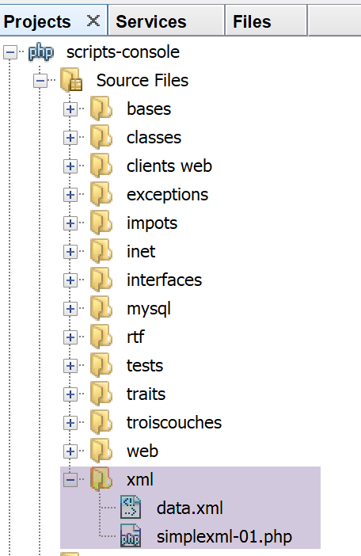

Traitement de documents XML
===========================

|image0|

Nous considérons le fichier XML **[data.xml]** suivant :

.. code-block:: php 
   :linenos:

   <?xml version="1.0" encoding="UTF-8"?>

   <tribu>
       <enseignant>
           <personne sexe="M">
               <nom>dupont</nom>
               <prenom>jean</prenom>
               <age>28</age>
               ceci est un commentaire
           </personne>
           <section>27</section>
       </enseignant>
       <etudiant>
           <personne sexe="F">
               <nom>martin</nom>
               <prenom>charline</prenom>
               <age>22</age>
           </personne>
           <formation>dess IAIE</formation>
       </etudiant>
   </tribu>

Nous analysons ce document avec le script suivant :

.. code-block:: php 
   :linenos:

   <?php

   // fichier XML à exploiter
   $FILE_NAME = "data.xml";
   // exploitation
   $xml = simplexml_load_file($FILE_NAME);
   print_r($xml);
   print_r($xml->enseignant->personne['sexe']);
   $nom=$xml->enseignant->personne->nom;
   print "nom=$nom\n";
   $sexe=$xml->enseignant->personne['sexe'];
   print "sexe=$sexe\n";
   $formation=$xml->etudiant->formation;
   print "formation=$formation\n";
   print "isset=".isset($xml->enseignant->personne->nom)."\n";
   print "isset=".isset($xml->enseignant->personne->xx)."\n";

Nous utilisons ici un module PHP appelé **[simpleXML]** qui permet
d'exploiter des documents XML.

-  ligne 6 : chargement du fichier XML ;

-  ligne 7 : affichage du document XML ;

-  ligne 8 : affichage de la valeur de l'attribut '*sexe*' d'une
   personne enseignante : *<enseignant><personne sexe='…'> ;*

-  ligne 9 : affichage de la valeur de la 1\ :sup:`re` balise
   *<enseignant><personne><nom> ;*

On notera que la balise racine <tribu> n’intervient pas dans le code.
Elle pourrait être n’importe quoi ;

**Résultats console**

.. code-block:: php 
   :linenos:

   SimpleXMLElement Object
   (
       [enseignant] => SimpleXMLElement Object
           (
               [personne] => SimpleXMLElement Object
                   (
                       [@attributes] => Array
                           (
                               [sexe] => M
                           )

                       [nom] => dupont
                       [prenom] => jean
                       [age] => 28
                   )

               [section] => 27
           )

       [etudiant] => SimpleXMLElement Object
           (
               [personne] => SimpleXMLElement Object
                   (
                       [@attributes] => Array
                           (
                               [sexe] => F
                           )

                       [nom] => martin
                       [prenom] => charline
                       [age] => 22
                   )

               [formation] => dess IAIE
           )

   )
   SimpleXMLElement Object
   (
       [0] => M
   )
   nom=dupont
   sexe=M
   formation=dess IAIE
   isset=1
   isset=

-  lignes 1-37 : le document XML sous la forme d'un objet de type
   **[simpleXML]**.

Le script précédent ne nous montre pas toutes les possibilités du module
**[simpleXML]** mais il nous suffit pour écrire une nouvelle version de
l'exercice d’application.

