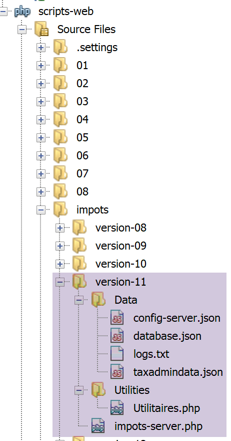
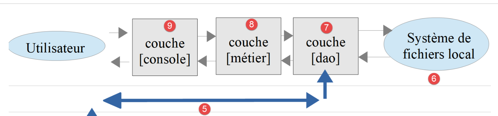

Exercice d’application – version 11
===================================

Il est encore fréquent que des services web envoient leur réponse sous
la forme d’un flux XML plutôt que d’un flux jSON :

-  le flux jSON est plus léger mais il faut un mode d’emploi pour le
   comprendre ;

-  le flux XML est plus verbeux mais il est autodocumenté. Sa
   compréhension est immédiate ;

Nous modifions la version 11 client / serveur pour que le serveur envoie
désormais un flux XML comme réponse à ses clients :

|image0|

Le serveur
----------

|image1|

Cette architecture sera implémentée par les scripts suivants :

|image2|

La classe [Utilitaires]
~~~~~~~~~~~~~~~~~~~~~~~

Nous reprenons la classe **[Utilitaires]** utilisée dès la version 03
(cf paragraphe `lien <#_La_classe_[Utilitaires]>`__) :

.. code-block:: php 
   :linenos:

   <?php

   // espace de noms
   namespace Application;

   // une classe de fonctions utilitaires
   abstract class Utilitaires {

     public static function cutNewLinechar(string $ligne): string {
       …
     }

     // from https://stackoverflow.com/questions/1397036/how-to-convert-array-to-simplexml
     public static function getXmlForArrayOfAttributes(array $arrayOfAttributes,
       \SimpleXmlElement &$node): void {
       // on scanne les attributs du tableau
       foreach ($arrayOfAttributes as $attribute => $value) {
         // l'attribut est-il numérique ?
         if (is_numeric($attribute)) {
           // cas de l'index de tableau (mais aussi autres cas)
           $attribute = 'i' . $attribute;
         }
         // $value est-il un tableau ?
         if (is_array($value)) {
           // on va explorer le tableau [$value] à son tour
           // on ajoute un nœud au graphe XML
           $subnode = $node->addChild($attribute);
           // appel récursif pour explorer le tableau [$value]
           Utilitaires::getXmlForArrayOfAttributes($value, $subnode);
         } else {
           // on ajoute le nœud au graphe XML
           $node->addChild("$attribute", htmlspecialchars("$value"));
         }
       }
     }

   }

**Commentaires**

-  lignes 14-36 : nous introduisons la méthode statique
   **[getXmlForArrayOfAttributes]** qui rend la chaîne XML d’un tableau
   **[arrayOfAttributes]** passé en paramètre. Le second paramètre est
   la référence d’un nœud d’un graphe XML, de type
   **[SimpleXmlElement]**. Après exécution, ce nœud contient le graphe
   XML du tableau **[arrayOfAttributes]** ;

Nous écrivons le test **[testXml.php]** suivant :

|image3|

.. code-block:: php 
   :linenos:

   <?php

   // dépendance
   require __DIR__ . "/Utilitaires.php";
   // tableau associatif
   $array = ["nom" => "amédée", "prénom" => "sylvain", "âge" => 40,
     "enfants" => [["nom" => "amédée", "prénom" => "béatrice", "âge" => 6],
       ["nom" => "amédée", "prénom" => "bertrand", "âge" => 4]]];
   // xml
   header("Content-Type: application/xml");
   $node = new \SimpleXMLElement("<?xml version='1.0' encoding='UTF-8'?><root></root>");
   \Application\Utilitaires::getXmlForArrayOfAttributes($array, $node);
   print $node->asXML();

Lorsqu’on exécute ce script **[2]**, nous obtenons la chose suivante
dans un navigateur Chrome :

|image4|

Le script serveur
~~~~~~~~~~~~~~~~~

Le script serveur **[impots-server.php]** doit être modifié ainsi que
son fichier de configuration **[config-server.json]** :

.. code-block:: php 
   :linenos:

   {
       "rootDirectory": "C:/myprograms/laragon-lite/www/php7/scripts-web/impots/version-11",
       "databaseFilename": "Data/database.json",
       "relativeDependencies": [
           "/../version-08/Entities/BaseEntity.php",
           "/../version-08/Entities/ExceptionImpots.php",
           "/../version-08/Entities/TaxAdminData.php",
           "/../version-08/Entities/Database.php",
           "/../version-08/Dao/InterfaceServerDao.php",
           "/../version-08/Dao/ServerDao.php",
           "/../version-09/Dao/ServerDaoWithSession.php",
           "/../version-08/Métier/InterfaceServerMetier.php",
           "/../version-08/Métier/ServerMetier.php",
           "/../version-09/Utilities/Logger.php",
           "/../version-09/Utilities/SendAdminMail.php",
           "/Utilities/Utilitaires.php"
       ],
       "absoluteDependencies": [
           "C:/myprograms/laragon-lite/www/vendor/autoload.php",
           "C:/myprograms/laragon-lite/www/vendor/predis/predis/autoload.php"
       ],
       "users": [
           {
               "login": "admin",
               "passwd": "admin"
           }
       ],
       "adminMail": {
           "smtp-server": "localhost",
           "smtp-port": "25",
           "from": "guest@localhost",
           "to": "guest@localhost",
           "subject": "plantage du serveur de calcul d'impôts",
           "tls": "FALSE",
           "attachments": []
       },
       "logsFilename": "Data/logs.txt"
   }

**Commentaires**

-  la racine du projet est désormais le dossier de la version 11 ;

-  ligne 16 : on inclut la nouvelle classe **[Utilitaires]** ;

Les modifications du script serveur sont les suivantes :

.. code-block:: php 
   :linenos:

   <?php

   // respect strict des types déclarés des paramètres de foctions
   declare (strict_types=1);

   // espace de noms
   namespace Application;

   …
   // préparation de la réponse JSON du serveur
   $response = new Response();
   $response->headers->set("content-type", "application/xml");
   $response->setCharset("utf-8");
   …
   // création de la couche [métier]
   $métier = new ServerMetier($dao);
   // calcul de l'impôt
   $result = $métier->calculerImpot($marié, (int) $enfants, (int) $salaire);
   // on rend la réponse
   sendResponse($response, $result, Response::HTTP_OK, [], $logger, $redis);
   // fin
   exit;

   function doInternalServerError(string $message, Response $response, array $infos,
     …
   }

   // fonction d'envoi de la réponse HTTP au client
   function sendResponse(Response $response, array $result, int $statusCode,
     array $headers, Logger $logger = NULL, \Predis\Client $predisClient = NULL) {
     // $response : réponse HTTP
     // $result : tableau des résultats
     // $statusCode : statut HTTP de la réponse
     // $headers : entêtes HTTP à mettre dans la réponse
     // $logger : le logueur de l'application
     // $predisClient : un client [predis]
     //
     // statut HTTTP
     $response->setStatusCode($statusCode);
     // body XML
     $node = new \SimpleXMLElement("<?xml version='1.0' encoding='UTF-8'?><réponse></réponse>");
     Utilitaires::getXmlForArrayOfAttributes($result, $node);
     $response->setContent($node->asXML());
     // headers
     $response->headers->add($headers);
     // envoi
     $response->send();
     // log
     if ($logger != NULL) {
       // log en jSON
       $log = \json_encode(["réponse" => $result], JSON_UNESCAPED_UNICODE);
       $logger->write("$log\n");
       $logger->close();
     }
     // fermeture de la connexion [redis]
     if ($predisClient != NULL) {
       $predisClient->disconnect();
     }
   }

**Commentaires**

-  ligne 12 : on indique que la réponse est de type
   **[application/xml]** ;

-  lignes 29-59 : la réponse du serveur est désormais du XML ;

-  ligne 41 : création du nœud racine **[<réponse></réponse>]** du
   graphe XML ;

-  ligne 42 : ce graphe est complété avec le graphe XML du tableau
   **[$result]** des résultats à envoyer au client ;

-  ligne 43 : le graphe XML est converti en chaîne XML pour envoi au
   client ;

**Test**

Directement dans un navigateur Chrome, on tape l’URL
**[http://localhost/php7/scripts-web/impots/version-11/impots-server.php?mari%C3%A9=oui&enfants=2&salaire=60000]**.
On obtient le résultat suivant **[1]** dans un navigateur Chrome :

|image5|

Le client
---------

Nous nous intéressons maintenant à la partie client de l’application.

|image6|

Cette architecture sera implémentée par les scripts suivants :

|image7|

Dans la nouvelle version, seuls changent :

-  le fichier de configuration **[config-client.json]** ;

-  la couche **[dao]** du client ;

Le fichier de configuration **[config-client.json]** devient le
suivant :

.. code-block:: php 
   :linenos:

   {
       "rootDirectory": "C:/Data/st-2019/dev/php7/poly/scripts-console/impots/version-11",
       "taxPayersDataFileName": "Data/taxpayersdata.json",
       "resultsFileName": "Data/results.json",
       "errorsFileName": "Data/errors.json",
       "dependencies": [
           "/../version-08/Entities/BaseEntity.php",
           "/../version-08/Entities/TaxPayerData.php",
           "/../version-08/Entities/ExceptionImpots.php",
           "/../version-08/Utilities/Utilitaires.php",
           "/../version-08/Dao/InterfaceClientDao.php",
           "/../version-08/Dao/TraitDao.php",
           "/Dao/ClientDao.php",
           "/../version-08/Métier/InterfaceClientMetier.php",
           "/../version-08/Métier/ClientMetier.php"
       ],
       "absoluteDependencies": [
           "C:/myprograms/laragon-lite/www/vendor/autoload.php"
       ],
       "user": {
           "login": "admin",
           "passwd": "admin"
       },
       "urlServer": "https://localhost:443/php7/scripts-web/impots/version-11/impots-server.php"
   }

La couche [dao]
~~~~~~~~~~~~~~~

Le client **[ClientDao.php]** (ligne 13 ci-dessus) est modifié pour
tenir compte du nouveau format de la réponse. On utilise **[simpleXML]**
pour traiter celle-ci :

.. code-block:: php 
   :linenos:

   <?php

   namespace Application;

   // dépendances
   use \Symfony\Component\HttpClient\HttpClient;

   class ClientDao implements InterfaceClientDao {
     // utilisation d'un Trait
     use TraitDao;
     // attributs
     private $urlServer;
     private $user;
     private $sessionCookie;

     // constructeur
     public function __construct(string $urlServer, array $user) {
       $this->urlServer = $urlServer;
       $this->user = $user;
     }

     // calcul de l'impôt
     public function calculerImpot(string $marié, int $enfants, int $salaire): array {
       …
       // on récupère la réponse XML
       $réponse = $response->getContent(false);
       $xml = new \SimpleXMLElement($réponse);
       // logs
       // print "$réponse\n";
       // on récupère le statut de la réponse
       $statusCode = $response->getStatusCode();
       // erreur ?
       if ($statusCode !== 200) {
         // on a une erreur - on lance une exception
         $message = \json_encode(["statut HTTP" => $statusCode, "réponse" => $xml], JSON_UNESCAPED_UNICODE);
         throw new ExceptionImpots($message);
       }
       if (!$this->sessionCookie) {
         // on récupère le cookie de session
         $headers = $response->getHeaders();
         if (isset($headers["set-cookie"])) {
           // cookie de session ?
           foreach ($headers["set-cookie"] as $cookie) {
             $match = [];
             $match = preg_match("/^PHPSESSID=(.+?);/", $cookie, $champs);
             if ($match) {
               $this->sessionCookie = "PHPSESSID=" . $champs[1];
             }
           }
         }
       }
       // on rend la réponse sous forme d'un tableau
       return \json_decode(\json_encode($xml, JSON_UNESCAPED_UNICODE), true);
     }

   }

**Commentaires**

-  lignes 26-27 : la réponse du serveur est lue. C'est un document XML
   **[<réponse>…</réponse>]**. Un objet **[SimpleXMLElement]** est
   construit à partir du document XML reçu ;

-  lignes 33-37 : en cas d’erreur, le message de l’exception sera la
   chaîne jSON de la réponse du serveur plutôt que la chaîne XML recue.
   En effet, la chaîne jSON est plus concise ;

-  ligne 53 : on rend le tableau des résultats en deux étapes :

   -  l’objet **[$xml]** de type **[\SimpleXMLElement]** est passé en
      jSON ;

   -  on transforme la chaîne jSON obtenue en tableau associatif. C’est
      le résultat à rendre ;

**Test**

Si on lance le client avec un environnement correct (base de données,
authentification, logs), on obtient les résultats habituels (vérifiez
les fichiers **[taxpayersdata.json, results.txt, errors.json]**. Côté
serveur, les logs sont eux les suivants :

.. code-block:: php 
   :linenos:

   06/07/19 07:41:32:877 :
   ---nouvelle requête
   06/07/19 07:41:32:882 : Autentification en cours…
   06/07/19 07:41:32:883 : Authentification réussie [admin, admin]
   06/07/19 07:41:32:883 : paramètres ['marié'=>oui, 'enfants'=>2, 'salaire'=>55555] valides
   06/07/19 07:41:32:908 : données fiscales prises en base de données
   06/07/19 07:41:32:959 : {"réponse":{"impôt":2814,"surcôte":0,"décôte":0,"réduction":0,"taux":0.14}}
   06/07/19 07:41:33:070 :
   ---nouvelle requête
   06/07/19 07:41:33:077 : Authentification prise en session…
   06/07/19 07:41:33:077 : paramètres ['marié'=>oui, 'enfants'=>2, 'salaire'=>50000] valides
   06/07/19 07:41:33:099 : données fiscales prises dans redis
   06/07/19 07:41:33:100 : {"réponse":{"impôt":1384,"surcôte":0,"décôte":384,"réduction":347,"taux":0.14}}
   06/07/19 07:41:33:189 :
   ---nouvelle requête
   06/07/19 07:41:33:202 : Authentification prise en session…
   06/07/19 07:41:33:202 : paramètres ['marié'=>oui, 'enfants'=>3, 'salaire'=>50000] valides
   06/07/19 07:41:33:233 : données fiscales prises dans redis
   06/07/19 07:41:33:233 : {"réponse":{"impôt":0,"surcôte":0,"décôte":720,"réduction":0,"taux":0.14}}
   06/07/19 07:41:33:318 :
   …

Tests [Codeception]
~~~~~~~~~~~~~~~~~~~

|image8|

Le test **[ClientMetierTest]** est le suivant :

.. code-block:: php 
   :linenos:

   <?php

   // respect strict des types déclarés des paramètres de foctions
   declare (strict_types=1);

   // espace de noms
   namespace Application;

   // définition des constantes
   define("ROOT", "C:/Data/st-2019/dev/php7/poly/scripts-console/impots/version-11");

   // chemin du fichier de configuration
   define("CONFIG_FILENAME", ROOT . "/Data/config-client.json");

   // on récupère la configuration
   $config = \json_decode(file_get_contents(CONFIG_FILENAME), true);

   …
   // classe de test
   class ClientMetierTest extends Unit {
     // couche métier
     private $métier;

     public function __construct() {
       parent::__construct();
       // on récupère la configuration
       $config = \json_decode(\file_get_contents(CONFIG_FILENAME), true);
       // création de la couche [dao]
       $clientDao = new ClientDao($config["urlServer"], $config["user"]);
       // création de la couche [métier]
       $this->métier = new ClientMetier($clientDao);
     }

     // tests
     …
   }

Les résultats du test sont les suivants :

|image9|

.. |image0| image:: ./chap-22/media/image1.png
   :width: 5.18898in
   :height: 1.70079in

