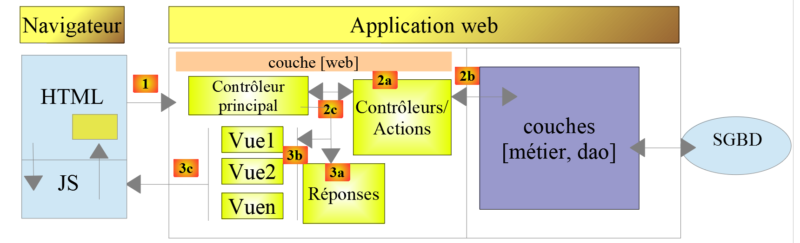
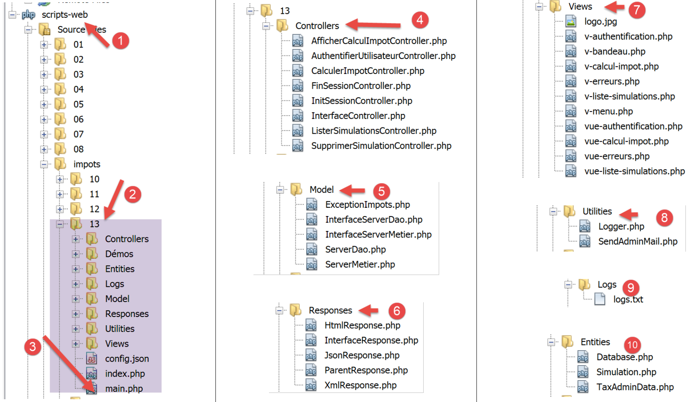
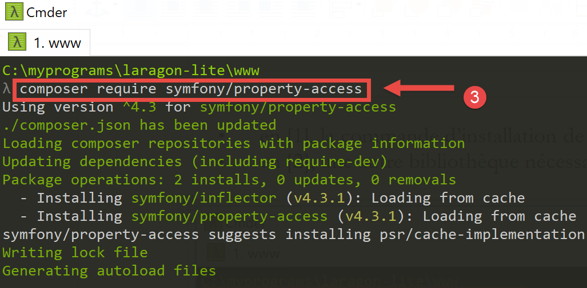
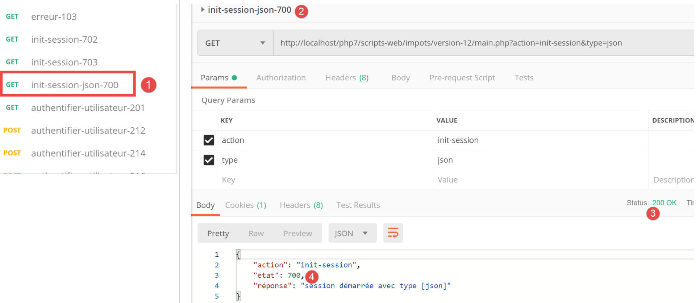
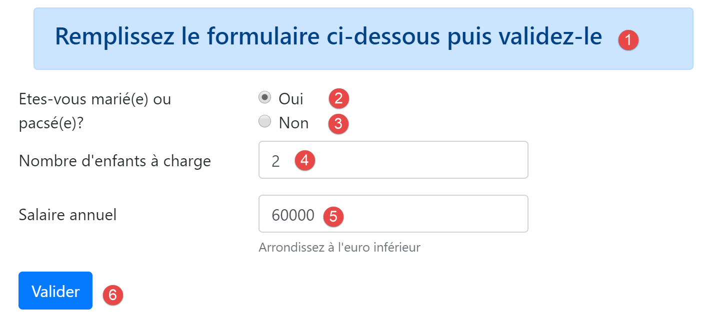
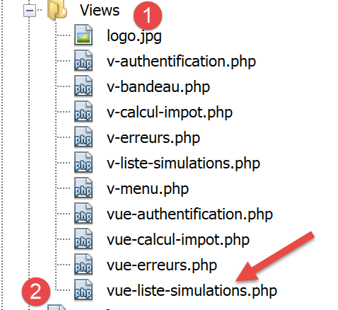
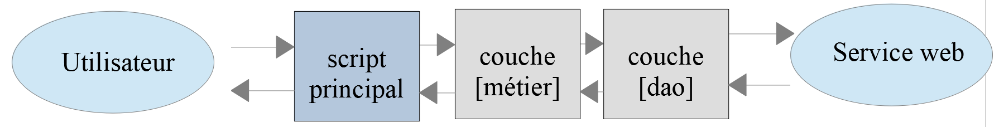

Exercice d’application – version 12
===================================

Nous allons dans ce chapitre écrire une application web respectant
l’architecture MVC (Modèle-Vue-Contrôleur). L’application pourra
délivrer ses réponses dans trois formats : jSON, XML, HTML. Il y a un
saut de complexité entre ce que nous allons faire maintenant et ce qui a
été fait précédemment. Nous allons réutiliser la plupart des concepts
vus jusqu’à maintenant et nous allons détailler toutes les étapes menant
à l’application finale.

Architecture MVC
----------------

Nous allons implémenter le modèle d'architecture dit MVC (Modèle – Vue –
Contrôleur) de la façon suivante :

|image0|

Le traitement d'une demande d'un client se déroulera de la façon
suivante :

-  **1 - demande**

..

   Les URL demandées seront de la forme
   *http://machine:port/contexte/….?action=uneAction&param1=v1&param2=v2&…*
   Le **[Contrôleur principal]** utilisera un fichier de configuration
   pour " router " la demande vers le bon contrôleur et la bonne action
   au sein de ce contrôleur. Pour cela, il utilisera le champ
   **[action]** de l'URL. Le reste de l'URL **[param1=v1&param2=v2&…]**
   est formé de paramètres facultatifs qui seront transmis à l'action.
   Le **C** de MVC est ici la chaîne **[Contrôleur principal, Contrôleur
   / Action]**. Si aucun contrôleur ne peut traiter l'action demandée,
   le serveur web répondra que l'URL demandée n'a pas été trouvée.

-  **2 - traitement**

-  l'action choisie **[2a]** peut exploiter les paramètres *parami* que
   le **[Contrôleur principal]** lui a transmis. Ceux-ci peuvent
   provenir de plusieurs sources :

-  du chemin **[/param1/param2/…]** de l'URL,

-  des paramètres **[param1=v1&param2=v2]** de l'URL\ *,*

-  de paramètres postés par le navigateur avec sa demande ;

-  dans le traitement de la demande de l'utilisateur, l'action peut
   avoir besoin de la couche **[métier]** **[2b]**. Une fois la demande
   du client traitée, celle-ci peut appeler diverses réponses. Un
   exemple classique est :

-  une réponse d'erreur si la demande n'a pu être traitée correctement ;

-  une réponse de confirmation sinon ;

-  le **[Contrôleur / Action]** rendra sa réponse **[2c]** au contrôleur
   principal ainsi qu’un code d’état. Ces codes d’état représenteront de
   façon unique l’état dans lequel se trouve l’application. Ce seront
   soit des codes de réussite, soit des codes d’erreur ;

-  **3 - réponse**

-  selon que le client a demandé une réponse jSON, XML ou HTML, le
   **[Contrôleur principal]** instanciera **[3a]** le type de réponse
   appropriée et demandera à celle-ci d’envoyer la réponse au client. Le
   **[Contrôleur principal]** lui transmettra et la réponse et le code
   d’état fournis par le **[Contrôleur / Action]** qui a été exécuté ;

-  si la réponse souhaitée est de type jSON ou XML, la réponse
   sélectionnée mettra en forme la réponse du **[Contrôleur / Action]**
   qu’on lui a donnée et l’enverra **[3c]**. Le client capable
   d’exploiter cette réponse peut être un script console PHP ou un
   script Javascript logé dans une page HTML ;

-  si la réponse souhaitée est de type HTML, la réponse sélectionnée
   sélectionnera **[3b]** une des **vues** HTML **[Vuei]** à l’aide du
   code d’état qu’on lui a donné. C’est le **V** de MVC. A un code
   d’état correspond une unique vue. Cette vue **V** va afficher la
   réponse du **[Contrôleur / Action]** qui a été exécuté. Elle habille
   avec du HTML, CSS, Javascript les données de cette réponse. On
   appelle ces données le **modèle de la vue**. C'est le **M** de MVC.
   Le client est alors le plus souvent un navigateur ;

Maintenant, précisons le lien entre architecture web MVC et architecture
en couches. Selon la définition qu'on donne au **modèle**, ces deux
concepts sont liés ou non. Prenons une application web MVC à une
couche :

|image1|

Ci-dessus, les **[Contrôleur / Action]** intègrent chacun une partie des
couches **[métier]** et **[dao]**. Dans la couche **[web]** on a bien
une architecture MVC mais l’ensemble de l’application n’a pas une
architecture en couches. Ici il n’y a qu’une couche qui fait tout.

Maintenant, considérons une architecture web multicouche :

|image2|

La couche **[web]** peut être implémentée sans suivre le modèle MVC. On
a bien alors une architecture multicouche mais la couche web
n'implémente pas le modèle MVC.

Par exemple, dans le monde .NET la couche **[web]** ci-dessus peut être
implémentée avec ASP.NET MVC et on a alors une architecture en couches
avec une couche **[web]** de type MVC. Ceci fait, on peut remplacer
cette couche ASP.NET MVC par une couche ASP.NET classique (WebForms)
tout en gardant le reste (métier, DAO, Pilote) **à l'identique**. On a
alors une architecture en couches avec une couche **[web]** qui n'est
plus de type MVC.

Dans MVC, nous avons dit que le modèle M était celui de la vue V, c.a.d.
l'ensemble des données affichées par la vue V. Une autre définition du
modèle M de MVC est donnée :

|image3|

Beaucoup d'auteurs considèrent que ce qui est à droite de la couche
**[web]** forme le modèle M du MVC. Pour éviter les ambigüités on peut
parler :

-  du **modèle du domaine** lorsqu'on désigne tout ce qui est à droite
   de la couche **[web]** ;

-  du **modèle de la vue** lorsqu'on désigne les données affichées par
   une vue V ;

Arborescence du projet Netbeans
-------------------------------

Nous adopterons pour le projet Netbeans une architecture reflétant le
modèle MVC :

|image4|

-  **[3]** : **[main.php]** est le contrôleur principal de notre modèle
   MVC. C’est le C de MVC ;

-  **[4]** : le dossier **[Controllers]** contiendra les contrôleurs
   secondaires. Chacun traite une action particulière. Cette action est
   indiquée dans l’URL, par exemple
   **[…/main.php?action=authentifier-utilisateur]**. Avec cette action,
   le **[Contrôleur principal]** **[main.php]** va sélectionner un
   **[Contrôleur secondaire]**, ici
   **[AuthentifierUtilisateurController]** pour traiter l’action
   demandée. Ces contrôleurs font aussi partie du C de MVC ;

-  **[5]** : le dossier **[Model]** contiendra les couches **[métier]**
   et **[dao]** de l’application. Selon les termes adoptés précédemment,
   ces éléments représentent le modèle du domaine et selon la
   terminologie adoptée pour le M peuvent représenter le M de MVC ;

-  **[6]** : le dossier **[Responses]** contient les classes chargées
   d’envoyer la réponse au client. Il y a une classe par type de réponse
   souhaitée :

   -  **[JsonResponse]** : pour une réponse jSON ;

   -  **[XmlResponse]** : pour une réponse XML ;

   -  **[HtmlResponse]** : pour une réponse HTML ;

-  **[7]** : le dossier **[Views]** contient les vues HTML lorsqu’une
   réponse HTML est souhaitée. C’est le V de MVC. Elles sont activées
   par la classe **[HtmlResponse]** qui leur transmet les données à
   afficher. Ces données sont le modèle de la vue. Selon la terminologie
   adoptée pour le M, ces données peuvent être le M de MVC ;

-  **[8]** : le dossier **[Utilities]** contient des utilitaires :

   -  **[Logger]** : la classe qui permet de faire des logs dans un
      fichier texte ;

   -  **[Sendmail]** : la classe qui permet d’envoyer des mails ;

-  **[9]** : le dossier **[Logs]** contient le fichier de logs
   **[logs.txt]** ;

-  **[10]** : le dossier **[Entities]** contient des classes utilisées
   par les différents contrôleurs ;

A l’aide de cette arborescence, on peut décrire le cheminement du
traitement d’une action demandée par un client :

-  **[main.php]** **[3]** reçoit la demande ;

-  après avoir fait quelques vérifications préliminaires (l’action
   fait-elle partie des actions acceptées ?), il transmet la demande au
   contrôleur secondaire **[4]** chargé de traiter cette action ;

-  le contrôleur secondaire fait ce qu’il a à faire. Dans son travail,
   il peut avoir besoin des couches **[métier]** et **[dao]** **[5]**
   ainsi que des entités du dossier **[10]**. Il rend sa réponse au
   contrôleur principal **[main.php]** qui l’a activé ;

-  selon le type de réponse **[jSON, XML, HTML]** souhaité par le
   client, le contrôleur principal **[main.php]** active l’une des
   réponses du dossier **[Responses]** **[6]** ;

-  les réponses **[JsonResponse, XmlResponse]** envoient respectivement
   la réponse jSON ou XML au client ;

-  la réponse **[HtmlResponse]** utilise l’une des vues du dossier
   **[Views]** **[7]** pour envoyer une réponse HTML au client ;

-  les différents contrôleurs ont accès à la classe **[Logger]** du
   dossier **[8]** pour écrire des logs dans le fichier des logs du
   dossier **[9]**. Sont logués :

   -  l’action demandée ;

   -  la réponse de son contrôleur. Celle-ci est enregistrée au format
      jSON quelque soit le type **[jSON, XML, HTML]** demandé ;

-  lors d’une erreur fatale (HTTP_INTERNAL_SERVER_ERROR), le contrôleur
   principal **[main.php]** envoie un mail à l’administrateur à l’aide
   de la classe **[SendMail]** du dossier **[8]** ;

Les actions de l’application
----------------------------

Le client transmet au serveur web l’action à exécuter sous la forme d’un
paramètre **[action]** dans l’URL **[/main.php?action=xxx]**. Les
actions autorisées sont listées dans le fichier **[config.json]** qui
configure le contrôleur principal **[main.php]** :

.. code-block:: php 
   :linenos:

   "actions":
               {
                   "init-session": "\\InitSessionController",
                   "authentifier-utilisateur": "\\AuthentifierUtilisateurController",
                   "calculer-impot": "\\CalculerImpotController",
                   "lister-simulations": "\\ListerSimulationsController",
                   "supprimer-simulation": "\\SupprimerSimulationController",
                   "fin-session": "\\FinSessionController",
                   "afficher-calcul-impot": "\\AfficherCalculImpotController"
   },

-  ligne 1 : la clé **[actions]** du dictionnaire jSON ;

-  lignes 3-9 : un dictionnaire **[action:contrôleur]**. A chaque action
   est associé le contrôleur secondaire chargé de la traiter ;

-  ligne 3 : **[init-session]** : démarre une session de simulations de
   calculs d’impôts. Cette action indique le type de réponses souhaitées
   **[jSON, XML, HTML]** ;

-  ligne 4 : une fois le type de session fixé, le client devra
   s’authentifier avec l’action **[authentifier-utilisateur]**. Tant
   qu’il n’est pas identifié, toutes les autres actions sont interdites
   à l’exception de **[init-session]** ;

-  ligne 5 : une fois identifié, le client pourra faire une série de
   calculs d’impôt avec l’action **[calculer-impot]** ;

-  ligne 6 : à tout moment, le client peut demander à voir la liste des
   simulations qu’il a faites avec l’action **[lister-simulations]** ;

-  ligne 7 : il pourra en supprimer certaines avec l’action
   **[supprimer-simulation]** ;

-  ligne 8 : le client termine sa session de simulations avec l’action
   **[fin-session]**. A partir de ce moment, il devra s’authentifier de
   nouveau s’il veut utiliser l’application ;

-  ligne 9 : dans l’application HTML, l’action
   **[afficher-calcul-impot]** demande l’affichage du formulaire
   permettant le calcul de l’impôt ;

Configuration de l’application web
----------------------------------

L’application est configurée par le fichier jSON **[config.json]**
suivant :

.. code-block:: php 
   :linenos:

   {
       "databaseFilename": "database.json",
       "rootDirectory": "C:/myprograms/laragon-lite/www/php7/scripts-web/impots/version-12",
       "relativeDependencies": [

           "/Entities/BaseEntity.php",
           "/Entities/Simulation.php",
           "/Entities/Database.php",
           "/Entities/TaxAdminData.php",
           "/Entities/ExceptionImpots.php",

           "/Utilities/Logger.php",
           "/Utilities/SendAdminMail.php",        

           "/Model/InterfaceServerDao.php",
           "/Model/ServerDao.php",
           "/Model/ServerDaoWithSession.php",
           "/Model/InterfaceServerMetier.php",
           "/Model/ServerMetier.php",

           "/Responses/InterfaceResponse.php",
           "/Responses/ParentResponse.php",
           "/Responses/JsonResponse.php",
           "/Responses/XmlResponse.php",
           "/Responses/HtmlResponse.php",

           "/Controllers/InterfaceController.php",
           "/Controllers/InitSessionController.php",
           "/Controllers/ListerSimulationsController.php",
           "/Controllers/AuthentifierUtilisateurController.php",
           "/Controllers/CalculerImpotController.php",
           "/Controllers/SupprimerSimulationController.php",
           "/Controllers/FinSessionController.php",
           "/Controllers/AfficherCalculImpotController.php"
       ],
       "absoluteDependencies": [
           "C:/myprograms/laragon-lite/www/vendor/autoload.php",
           "C:/myprograms/laragon-lite/www/vendor/predis/predis/autoload.php"
       ],
       "users": [
           {
               "login": "admin",
               "passwd": "admin"
           }
       ],
       "adminMail": {
           "smtp-server": "localhost",
           "smtp-port": "25",
           "from": "guest@localhost",
           "to": "guest@localhost",
           "subject": "plantage du serveur de calcul d'impôts",
           "tls": "FALSE",
           "attachments": []
       },
       "logsFilename": "Logs/logs.txt",
       "actions":
               {
                   "init-session": "\\InitSessionController",
                   "authentifier-utilisateur": "\\AuthentifierUtilisateurController",
                   "calculer-impot": "\\CalculerImpotController",
                   "lister-simulations": "\\ListerSimulationsController",
                   "supprimer-simulation": "\\SupprimerSimulationController",
                   "fin-session": "\\FinSessionController",
                   "afficher-calcul-impot": "\\AfficherCalculImpotController"
               },
       "types": {
           "json": "\\JsonResponse",
           "html": "\\HtmlResponse",
           "xml": "\\XmlResponse"
       },
       "vues": {
           "vue-authentification.php": [700, 221, 400],
           "vue-calcul-impot.php": [200, 300, 341, 350, 800],
           "vue-liste-simulations.php": [500, 600]
       },
       "vue-erreurs": "vue-erreurs.php"
   }

**Commentaires**

-  ligne 2 : nom du fichier jSON contenant la configuration de l’accès à
   la base de données ;

-  lignes 3-39 : configuration des dépendances du projet. On liste ici
   la totalité des scripts PHP de l’arborescence du projet ;

-  lignes 40-44 : l’utilisateur autorisé à utiliser l’application ;

-  lignes 46-54 : les coordonnées mail de l’administrateur de
   l’application ;

-  ligne 55 : le chemin du fichier des logs ;

-  lignes 56-65 : associations **[action => contrôleur secondaire chargé
   de la traiter]** ;

-  lignes 66-70 : associations **[type de réponse => classe Response
   chargée d’envoyer la réponse au client]** ;

-  lignes 71-75 : associations **[vue HTML => tableau des codes d’état
   menant à cette vue]** ;

-  ligne 76 : la vue **[vue-erreurs]** est affichée dans une session
   HTML à chaque fois qu’il se produit une erreur anormale :

   -  une application jSON ou XML est habituellement interrogée avec un
      client programmé. Celui-ci passe au serveur des paramètres qui
      peuvent absents ou erronés. L’ensemble des contrôleurs traitent
      ces cas et renvoient au client des codes d’erreur. Tous les cas
      d’erreur possibles doivent être traités ;

   -  avec une application HTML, c’est un peu différent. Utilisée
      normalement, l’application web n’utilise qu’une partie des cas
      d’utilisation possibles des clients jSON et XML. Prenons un
      exemple : l’action **[calculer-impot]** attend trois paramètres
      postés (envoyés par un POST) : **[marié, enfants, salaire]**.

      -  si on a un client jSON permettant de taper des URL à la main,
         on peut demander l’action **[calculer-impot]** avec un GET
         plutôt qu’un POST, ou avec un POST sans aucun paramètre posté
         alors qu’il en faut trois, etc… Le serveur jSON doit traiter
         tous ces cas ;

      -  avec une application web, l’action **[calculer-impot]** sera
         demandée à partir d’un formulaire web où aucun des deux cas
         précédents ne sera possible : l’action **[calculer-impot]**
         sera demandée avec un POST et les trois paramètres **[marié,
         enfants, salaire]**. Certains de ces paramètres pourront avoir
         une valeur incorrecte mais ils seront présents. Cependant,
         l’utilisateur peut reproduire certaines erreurs en tapant
         lui-même des URL dans le navigateur. Par sécurité, on doit
         gérer ce cas ;

      -  la vue **[vue-erreurs]** sera affichée à chaque fois qu’un
         contrôleur secondaire rendra un code d’état incompatible avec
         l’application web, ç-à-d un code d’état non présent aux lignes
         72-74 du fichier de configuration. Nous optons pour cette
         solution dans un souci pédagogique. Une autre option possible
         serait de ne rien faire et de se contenter de réafficher la vue
         actuellement affichée dans le navigateur du client pour que
         l’utilisateur ait l’impression que le serveur ne répond pas à
         ses URL fabriquées à la main ;

Installation d’outils et de bibliothèques
-----------------------------------------

Postman
~~~~~~~

**[Postman]** est l’outil qui va nous permettre d’interroger les
différentes URL de notre application web. Il nous permet :

-  d’utiliser n’importe quelle URL : celles-ci sont fabriquées à la
   main ;

-  de requêter le serveur web par un GET, POST, PUT, OPTIONS… ;

-  de préciser les paramètres du GET ou du POST ;

-  de fixer les entêtes HTTP de la requête ;

-  de recevoir une réponse au format jSON, XML, HTML,

-  d’avoir accès aux entêtes HTTP de la réponse. On a donc ainsi accès à
   la réponse HTTP complète du serveur ;

Puisque nous fabriquons à la main les URL interrogées, nous allons
pouvoir tester tous les cas d’erreur possibles et voir comment le
serveur réagit.

**[Postman]** est disponible à l’URL
**[https://www.getpostman.com/downloads/]**. La version disponible en
juin 2019 est la 7.2. Cette version présente une anomalie : lorsqu’on
fait des requêtes successives au serveur web interrogé, le client
**[Postman 7.2]** ne renvoie pas automatiquement les cookies que le
serveur lui envoie, notamment le cookie de session. Pour maintenir la
session, il faut alors recopier à la main le cookie de session dans les
entêtes HTTP des requêtes successives. Ce n’est pas bien compliqué mais
ce n’est pas pratique. C’est un bug qui n’existait pas dans les versions
précédentes. Conscient du bug, l’équipe de **[Postman]** l’a corrigé
dans une version alpha (peut être instable) appelée **[Postman Canary]**
disponible à l’URL **[https://www.getpostman.com/downloads/canary]**.
C’est cette version qui est utilisée ici. Nous allons décrire son
installation. Si une version stable **[Postman 7.3]** ou ultérieure est
disponible, vous pouvez la télécharger : le bug aura probablement été
corrigé.

Procédez à l’installation de votre version de **[Postman]**. Au cours de
l’installation, on vous demandera de créer un compte : celui-ci sera
inutile ici. Le compte **[Postman]** sert à synchroniser différents
appareils afin que la configuration de l’un soit répliqué sur un autre.
Rien de tout ceci n’est utile ici.

Une fois installé, **[Postman]** présente l’interface suivante :

|image5|

-  en **[2-3]**, on a accès au paramétrage du produit ;

|image6|

-  en **[6]**, la version utilisée dans ce document ;

-  si vous avez créé un compte, une synchronisation se fait entre votre
   poste et un serveur **[Postman]** distant. Cela est symbolisé par la
   roue **[7]** qui tourne à chaque fois que vous faites des
   modifications dans le projet **[Postman]**. Pour arrêter cette
   synchronisation inutile, déconnectez-vous en **[8-9]** ;

La bibliothèque Symfony / Serializer
~~~~~~~~~~~~~~~~~~~~~~~~~~~~~~~~~~~~

Pour sérialiser des objets en jSON et XML, nous allons utiliser la
bibliothèque **[Symfony / Serializer]**. Elle présente ici deux
avantages :

-  elle est homogène dans son utilisation pour sérialiser en jSON ou
   XML : cela évite d’apprendre deux bibliothèques aux API (Application
   Programming Interface) différentes ;

-  nativement, elle sait sérialiser en jSON ou XML des objets, même si
   les attributs de ceux-ci sont privés. On se rappelle qu’en jSON, pour
   sérialiser un objet, il fallait que la classe de celui-ci implémente
   l’interface **[\JsonSerializable]**. Le résultat obtenu alors était
   la chaîne jSON d’un tableau associatif ayant les attributs de la
   classe pour clés. Lorsqu’on désérialisait cette chaîne jSON, on
   retrouvait le tableau associatif primitif, qu’il fallait alors
   transformer en un objet de la classe qui avait été sérialisée. Avec
   **[Symfony / Serializer]**, la désérialisation produit tout de suite
   un objet de la classe sérialisée. C’est plus simple ;

La documentation de la bibliothèque **[Symfony / Serializer]** est
disponible à l’URL :
**[https://symfony.com/doc/current/components/serializer.html]** (juin
2019).

Pour installer cette bibliothèque, ouvrez un terminal Laragon (cf
paragraphe `lien <#_Installation_de_Laragon>`__) et tapez la commande
suivante :

|image7|

-  en **[1]**, la commande d’installation de la bibliothèque
   **[symfony/serializer]** ;

-  en **[2]**, une autre bibliothèque nécessaire à notre projet : permet
   la sérialisation des objets ;

|image8|

Les entités de l’application
----------------------------

|image9|

Les entités **[BaseEntity, Database, ExceptionImpots, TaxAdminData]**
ont été utilisées dès la version 08 du service web (cf paragraphe
`lien <#_Le_code>`__).

La classe **[Simulation]** va servir à encapsuler les éléments d’une
simulation de calcul d’impôt :

.. code-block:: php 
   :linenos:

   <?php

   namespace Application;

   class Simulation extends BaseEntity {
     // attributs d'une simulation de calcul d'impôt
     protected $marié;
     protected $enfants;
     protected $salaire;
     protected $impôt;
     protected $surcôte;
     protected $décôte;
     protected $réduction;
     protected $taux;

     // getters
     public function getMarié() {
       return $this->marié;
     }

     public function getEnfants() {
       return $this->enfants;
     }

     public function getSalaire() {
       return $this->salaire;
     }

     public function getImpôt() {
       return $this->impôt;
     }

     public function getSurcôte() {
       return $this->surcôte;
     }

     public function getDécôte() {
       return $this->décôte;
     }

     public function getRéduction() {
       return $this->réduction;
     }

     public function getTaux() {
       return $this->taux;
     }

   }

**Commentaires**

-  ligne 5 : la classe **[Simulation]** étend la classe **[BaseEntity]**
   et hérite donc des méthodes :

   -  **[setFromArrayOfAttributes($arrayOfAttributes)]** : qui permet
      d’initialiser des attributs de la classe ;

   -  **[__toString]** : qui rend la chaîne jSON de l’objet ;

-  lignes 7-14 : les attributs de la simulation ;

-  lignes 16-47 : les getters de la classe ;

Les Utilitaires de l’application
--------------------------------

|image10|

La classe **[Logger]** permet de loguer des événements dans un fichier
texte. Cette classe a été décrite au paragraphe
`lien <#_La_classe_[Logger]>`__.

La classe **[SendAdminMail]** permet d’envoyer un mail à
l’administrateur de l’application. Cette classe a été décrite au
paragraphe `lien <#_La_classe_[SendAdminMail]>`__.

Les couches [métier] et [dao]
-----------------------------

|image11|

|image12|

Les classes et interfaces des couches **[métier]** et **[dao]** sont
rassemblées dans le dossier **[Model]**. Elles ont toutes été définies
et utilisées dans des versions précédentes :

+---------------------------+-----------------------------------------+
| **ExceptionImpots**       | La classe des exceptions lancées par la |
|                           | couche **[dao]**. Définie au paragraphe |
|                           | `lien <#_La_classe_[TaxAdminData]>`__.  |
+===========================+=========================================+
| **InterfaceServerDao**    | Interface implémentée par la couche     |
|                           | **[dao]** du serveur. Définie au        |
|                           | paragraphe                              |
|                           | `lien <#_La_couche_[dao]>`__.           |
+---------------------------+-----------------------------------------+
| **ServerDao**             | Implémentation de l’interface           |
|                           | **[InterfaceServerDao]**. Implémente la |
|                           | couche **[dao]** du serveur. Définie au |
|                           | paragraphe                              |
|                           | `lien <#_La_couche_[dao]>`__.           |
+---------------------------+-----------------------------------------+
| **ServerDaoWithSession**  | Implémentation de l’interface           |
|                           | **[InterfaceServerDao]**. Implémente la |
|                           | couche **[dao]** du serveur. Définie au |
|                           | paragraphe                              |
|                           | `lien <#_La_classe_[SendAdminMail]>`__. |
+---------------------------+-----------------------------------------+
| **InterfaceServerMetier** | Interface implémentée par la couche     |
|                           | **[métier]** du serveur. Définie au     |
|                           | paragraphe                              |
|                           | `lien <#_La_couche_[métier]_1>`__.      |
+---------------------------+-----------------------------------------+
| **ServerMetier**          | Implémentation de l’interface           |
|                           | **[InterfaceMetier]**. Implémente la    |
|                           | couche **[metier]** du serveur. Définie |
|                           | au paragraphe                           |
|                           | `lien <#_La_couche_[métier]_1>`__.      |
+---------------------------+-----------------------------------------+

L’application en cours d’écriture utilise beaucoup d’éléments déjà
présentés et utilisés :

-  les couches **[métier]** et **[dao]** ;

-  les utilitaires **[Logger]** et **[SendAdminMail]** ;

-  les entités **[ExceptionImpots, TaxAdminData, Database]** ;

Nous allons nous concentrer sur la couche **[web]** de l’application :

|image13|

Le contrôleur principal [main.php]
----------------------------------

Introduction
~~~~~~~~~~~~

|image14|

-  **[1-2]** : le contrôleur principal **[main.php]** **[1]** est
   configuré par le fichier **[config.json]** **[2]** ;

Rappelons la position du contrôleur principal dans notre architecture
MVC :

|image15|

En **[1]**, le contrôleur principal **[main.php]** est le 1\ :sup:`er`
élément de l’architecture MVC à traiter la requête du client. Il a
plusieurs rôles :

-  il fait d’abord les vérifications de base :

   -  est-ce que son fichier de configuration existe et est valide ;

   -  chargement de toutes les dépendances du projet. Cela revient à
      charger tous les éléments de l’architecture MVC ;

   -  est-ce que l’action demandée a été précisée ? Si oui, est-elle
      valide ?

   -  si l’action demandée est valide, sélectionner **[2a]** le
      contrôleur secondaire qui va la traiter et lui passer les
      informations dont il a besoin : la requête HTTP, la session, la
      configuration de l’application ;

   -  récupérer **[2c]** la réponse du contrôleur secondaire. Selon le
      type (jSON, XML, HTML) d’application demandé par le client,
      sélectionner **[3a]** la réponse (JsonResponse, XmlResponse,
      HtmlResponse) chargée d’envoyer la réponse au client et lui passer
      toutes les informations dont elle a besoin (la requête HTTP, la
      session, la configuration de l’application, la réponse du
      contrôleur secondaire) ;

   -  une fois cette réponse envoyée **[3c]**, procéder à la libération
      des ressources qui ont pu être mobilisées pour le traitement de la
      requête ;

[main.php] - 1
~~~~~~~~~~~~~~

Le code du contrôleur principal **[main.php]** est le suivant :

.. code-block:: php 
   :linenos:

   <?php

   // respect strict des types déclarés des paramètres de foctions
   declare (strict_types=1);

   // espace de noms
   namespace Application;

   // dépendances Symfony
   use Symfony\Component\HttpFoundation\Request;
   use Symfony\Component\HttpFoundation\Response;
   use Symfony\Component\HttpFoundation\Session\Session;

   // gestion des erreurs par PHP
   //ini_set("display_errors", "0");
   error_reporting(E_ALL && !E_WARNING && !E_NOTICE);
   // on récupère la configuration
   $configFilename = "config.json";
   $fileContents = \file_get_contents($configFilename);
   $erreur = FALSE;
   // erreur ?
   if (!$fileContents) {
     // on note l'erreur
     $état = 131;
     $erreur = TRUE;
     $message = "Le fichier de configuration [$configFilename] n'existe pas";
   }
   if (!$erreur) {
     // on récupère le code JSON du fichier de configuration dans un tableau associatif
     $config = \json_decode($fileContents, true);
     // erreur ?
     if (!$config) {
       // on note l'erreur
       $erreur = TRUE;
       $état = 132;
       $message = "Le fichier de configuration [$configFilename] n'a pu être exploité correctement";
     }
   }
   // erreur ?
   if ($erreur) {
     // préparation de la réponse JSON du serveur
     // on ne peut pas s'aider du fichier de configuration
     // dépendances symfony
     require_once "C:/myprograms/laragon-lite/www/vendor/autoload.php";
     // préparation réponse
     $response = new Response();
     $response->headers->set("content-type", "application/json");
     $response->setCharset("utf-8");
     // code de statut
     $response->setStatusCode(Response::HTTP_INTERNAL_SERVER_ERROR);
     // contenu
     $response->setContent(json_encode(["action" => "", "état" => $état, "réponse" => $message], JSON_UNESCAPED_UNICODE));
     // envoi
     $response->send();
     // fin
     exit;
   }
   …

**Commentaires**

-  lignes 10-12 : le contrôleur principal utilise les objets suivants de
   Symfony :

   -  **[Request]** : la requête HTTP en cours de traitement ;

   -  **[Session]** : la session de l’application web ;

   -  **[Response]** : la réponse HTTP au client ;

-  ligne 15 : pendant tout le développement on gardera cette ligne en
   commentaires : les erreurs PHP sont alors intégrées dans le flux
   texte envoyé au client. Si ce client est un navigateur, cela permet
   de voir les erreurs rencontrées par le serveur. C’est une aide au
   débogage ;

-  ligne 16 : toutes les erreurs sont signalées (E_ALL) sauf les
   avertissements (! E_WARNING) et les informations non fatales (!
   E_NOTICE). Par exemple, si un fichier ne peut être ouvert, PHP émet
   une erreur de type **[E_NOTICE]**. Si la ligne 15 permet l’affichage
   des erreurs, l’erreur d’ouverture du fichier apparaît dans le
   navigateur client. C’est bien si vous avez oublié de tester le
   résultat de l’ouverture du fichier, moins bien si vous avez prévu le
   test : une ligne de **[notice]** vient alors polluer la réponse du
   serveur au client. En phase de développement, la ligne 16 devrait
   elle-aussi être commentée : vous ne voulez rater aucune erreur ;

-  ligne 19 : le fichier de configuration est lu ;

-  lignes 22-27 : si cette lecture s’est mal passée, on note l’erreur
   (ligne 25), on met l’application dans l’état **[131]** et on prépare
   un message d’erreur ;

-  ligne 30 : on décode la chaîne jSON du fichier de configuration ;

-  lignes 32-37 : si ce décodage se passe mal, on note l’erreur (ligne
   34), on met l’application dans l’état **[132]** et on prépare un
   message d’erreur ;

-  lignes 40-57 : en cas d’erreur de lecture du fichier de
   configuration, on ne peut plus avancer. On prépare alors une réponse
   jSON au client :

-  ligne 44 : comme le fichier de configuration n’a pas été lu, il faut
   importer à la main le fichier **[autoload]** nécessaire à
   **[Symfony]** ;

-  lignes 46-47 : on prépare une réponse jSON ;

-  ligne 50 : le code HTTP de la réponse sera 500
   INTERNAL_SERVER_ERROR ;

-  ligne 52 : on fixe le contenu jSON de la réponse. Toutes les réponses
   faites par l’application web étudiée auront trois clés :

   -  **[action]** : l’action demandée par le client ;

   -  **[état]** : l’état de l’application après exécution de cette
      action ;

   -  **[réponse]** : la réponse du serveur web ;

-  ligne 54 : la réponse jSON est envoyée au client ;

Tests [Postman] - 1
~~~~~~~~~~~~~~~~~~~

Nous allons vérifier le comportement du serveur lorsque fichier de
configuration est absent ou incorrect :

|image16|

Nous allons rassembler les différentes requêtes que notre client
**[Postman]** va émettre vers le serveur d’impôts dans des collections.

-  en **[1]**, créez une nouvelle collection ;

-  en **[2]**, donnez-lui un nom ;

-  en **[3]**, la description est facultative ;

|image17|

-  dans les collections **[4]**, apparaît maintenant une collection
   nommée **[impots-server-tests-version12]** **[5]** ;

-  en **[6]**, on peut ajouter une nouvelle requête à la collection ;

|image18|

-  en **[7]**, on donne un nom à la requête ;

-  en **[8]**, la description est facultative ;

|image19|

-  en **[9-11]**, la requête ajoutée à la collection ;

-  en **[12]**, choix du type de la requête, ici une requête **[GET]**.
   En **[19]**, les différents types de requête disponibles ;

-  en **[13]**, on tape ici l’URL du serveur ;

-  en **[14]**, on met ici les paramètres ajoutés à l’URL et qui seront
   donc des paramètres du GET. L’intérêt de les mettre ici plutôt que
   directement dans l’URL est qu’ils seront URL-encodés par
   **[Postman]**. Si vous les mettez vous-mêmes dans l’URL ce sera à
   vous de les URL-encoder ;

-  en **[15]**, **[Authorization]** sert à définir l’utilisateur qui va
   se connecter. Nous n’aurons pas à utiliser cette possibilité ;

-  en **[16]**, les entêtes HTTP qui accompagneront la requête. Un
   certain nombre d’entêtes sont automatiquement inclus dans la requête.
   Vous pouvez ici en ajouter de nouveaux ;

-  en **[17]**, **[Body]** désigne les paramètres d’une opération
   **[POST]**. Nous aurons à utiliser cette option ;

Nous allons faire le test suivant :

-  dans **[main.php]**, on indique que le fichier de configuration est
   **[config2.json]** qui n’existe pas :

|image20|

-  la ligne 16 du code doit être décommentée ;

-  ligne 18 : l’erreur sur le nom du fichier de configuration ;

Entrons dans **[Postman]** **[13, 20]**, l’URL du serveur web de calcul
d’impôt et exécutons-la **[21]** :

|image21|

La réponse renvoyée par le serveur (il faut bien sûr que Laragon soit
actif) est la suivante :

|image22|

-  en **[22]**, le serveur a renvoyé un code HTTP **[500 Internal Server
   Error]** ;

-  en **[23]**, **[Body]** désigne le corps de la réponse, ç-à-d le
   document envoyé par le serveur derrière les entêtes HTTP **[28]** ;

-  en **[26]**, on voit que **[Postman]** a reçu une réponse jSON ;

-  en **[27]**, la réponse jSON mise en forme ;

-  en **[28]**, la réponse jSON brute sans mise en forme ;

-  en **[29]**, le mode **[Preview]** est utilisé lorsque la réponse est
   du HTML. Le mode **[Preview]** affiche alors la page reçue ;

-  en **[30]**, la réponse jSON du serveur. C’est bien celle que nous
   attendions ;

En **[25]**, les entêtes HTTP envoyés dans la réponse du serveur sont
les suivants :

|image23|

-  en **[32]**, le type jSON de la réponse ;

Ce premier test nous a permis de voir qu’on :

-  peut envoyer tout type de requête au serveur testé ;

-  peut fixer les paramètres du GET ou du POST ;

-  a la totalité de la réponse : entêtes HTTP et le document qui suit
   ces entêtes **[Body]** ;

Maintenant, faisons un second test :

|image24|

-  en **[1-3]**, le fichier **[config3.json]** est un fichier jSON
   syntaxiquement incorrect ;

-  en **[4]**, **[main.php]** est configuré pour utiliser
   **[config3.json]** ;

Nous ajoutons une nouvelle requête dans **[Postman]** :

|image25|

-  **[1-3]**, on clique droit sur **[2]** et on prend l’option
   **[duplicate]** pour dupliquer la requête **[2]** ;

-  en **[4]**, la nouvelle requête a un nom prédéfini qu’on change en
   **[5]** ;

|image26|

-  en **[6]**, la requête renommée ;

-  en **[9-10]**, on envoie la même requête GET que précédemment ;

|image27|

-  en **[11]**, la réponse jSON du serveur ;

Nous avons montré ici comment allaient être testées les différentes
actions du service web du calcul de l’impôt.

[main.php] – 2
~~~~~~~~~~~~~~

Nous reprenons l’étude du code du contrôleur principal **[main.php]** :

.. code-block:: php 
   :linenos:

   <?php

   // respect strict des types déclarés des paramètres de foctions
   declare (strict_types=1);

   // espace de noms
   namespace Application;

   // dépendances Symfony
   use Symfony\Component\HttpFoundation\Request;
   use Symfony\Component\HttpFoundation\Response;
   use Symfony\Component\HttpFoundation\Session\Session;

   // gestion des erreurs par PHP
   //ini_set("display_errors", "0");
   error_reporting(E_ALL && !E_WARNING && !E_NOTICE);
   // on récupère la configuration
   $configFilename = "config.json";
   …
   // on inclut les dépendances nécessaires au script
   $rootDirectory = $config["rootDirectory"];
   foreach ($config["relativeDependencies"] as $dependency) {
     require_once "$rootDirectory$dependency";
   }
   // dépendances absolues (bibliothèques tierces)
   foreach ($config["absoluteDependencies"] as $dependency) {
     require_once "$dependency";
   }

   // création du fichier des logs
   try {
     $logger = new Logger($config['logsFilename']);
   } catch (ExceptionImpots $ex) {
     // on n'a pas pu créer le fichier de logs - internal server error
     $état = 133;
     (new JsonResponse())->send(
       NULL, NULL, $config,
       Response::HTTP_INTERNAL_SERVER_ERROR,
       ["action" => "non déterminée", "état" => $état, "réponse" => "Le fichier de logs [{$config['logsFilename']}] n'a pu être créé"],
       []);
     // terminé
     exit;
   }

**Commentaires**

-  ligne 18 : on a un fichier de configuration **[config.json]**
   désormais existant et syntaxiquement correct. Il faudrait de plus
   tester que les clés attendues dans ce fichier sont bien présentes.
   Nous considèrerons que cela fait partie du travail normal de débogage
   du développeur. Nous aurions pu faire ce même raisonnement pour les
   deux précédentes erreurs ;

-  lignes 20-28 : on inclut toutes les dépendances nécessaires au projet
   web. Nous avons déjà rencontré ce code plusieurs fois ;

-  ligne 31-43 : on essaie de créer l’objet **[Logger]** qui va nous
   permettre de loguer des événements dans le fichier
   **[$config['logsFilename']**]. Cette création peut échouer ;

-  lignes 33-43 : gestion de l’erreur de création de l’objet
   **[Logger]** ;

-  ligne 35 : on fixe un n° d’état ;

-  lignes 36-40 : on envoie une réponse jSON ;

-  ligne 42 : on arrête le script ;

Toutes les réponses envoyées au client implémentent l’interface
**[InterfaceResponse]** suivante :

|image28|

Le code de l’interface **[InterfaceResponse]** est le suivant :

.. code-block:: php 
   :linenos:

   <?php

   namespace Application;

   // dépendances Symfony
   use Symfony\Component\HttpFoundation\Request;
   use Symfony\Component\HttpFoundation\Session\Session;

   interface InterfaceResponse {

     // Request $request : requête en cours de traitement
     // Session $session : la session de l'application web
     // array $config : la configuration de l'application
     // int statusCode : le code HTTP de statut de la réponse
     // array $content : la réponse du serveur
     // array $headers : les entêtes HTTP à ajouter à la réponse
     // Logger $logger : le logueur pour écrire des logs
     
     public function send(
       Request $request = NULL,
       Session $session = NULL,
       array $config,
       int $statusCode,
       array $content,
       array $headers,
       Logger $logger = NULL): void;
   }

-  lignes 19-27 : l’interface **[InterfaceResponse]** a une unique
   méthode **[send]** pour envoyer la réponse au client ;

-  lignes 11-17 : la signification des différents paramètres de la
   méthode **[send]** ;

-  lignes 23-25 : les paramètres **[$statusCode, $content, $headers]**
   sont dans le résultat standard des contrôleurs secondaires de
   l’application. Cependant la réponse peut avoir besoin d’autres
   informations. Aussi lui donne-t-on les trois premiers paramètres
   (lignes 20-22) qui lui donnent accès à la totalité des informations
   concernant la requête, la session, la configuration ;

-  ligne 26 : la réponse a besoin du **[Logger]** car elle va loguer la
   réponse envoyée au client ;

La classe **[JsonResponse]** implémente l’interface
**[InterfaceResponse]** de la façon suivante :

.. code-block:: php 
   :linenos:

   <?php

   namespace Application;

   // dépendances Symfony
   use Symfony\Component\Serializer\Encoder\JsonEncode;
   use Symfony\Component\Serializer\Encoder\JsonEncoder;
   use Symfony\Component\Serializer\Normalizer\ObjectNormalizer;
   use Symfony\Component\Serializer\Serializer;
   use \Symfony\Component\HttpFoundation\Request;
   use \Symfony\Component\HttpFoundation\Session\Session;

   class JsonResponse extends ParentResponse implements InterfaceResponse {

     // Request $request : requête en cours de traitement
     // Session $session : la session de l'application web
     // array $config : la configuration de l'application
     // int statusCode : le code HTTP de statut de la réponse
     // array $content : la réponse du serveur
     // array $headers : les entêtes HTTP à ajouter à la réponse
     // Logger $logger : le logueur pour écrire des logs

     public function send(
       Request $request = NULL,
       Session $session = NULL,
       array $config,
       int $statusCode,
       array $content,
       array $headers,
       Logger $logger = NULL): void {

       // préparation sérialiseur symfony
       $serializer = new Serializer(
         [
         // nécessaire pour la sérialisation d'objets
         new ObjectNormalizer()],
         // encodeur jSON
         // pour les options, faire des OU entre les différentes options
         [new JsonEncoder(new JsonEncode([JsonEncode::OPTIONS => JSON_UNESCAPED_UNICODE]))]
       );
       // sérialisation jSON
       $json = $serializer->serialize($content, 'json');
       // headers
       $headers = array_merge($headers, ["content-type" => "application/json"]);
       // envoi réponse
       parent::sendResponse($statusCode, $json, $headers);
       // log
       if ($logger !== NULL) {
         $logger->write("réponse=$json\n");
       }
     }

   }

**Commentaires**

-  ligne 13 : la classe implémente l’interface **[InterfaceResponse]** ;

-  ligne 13 : la classe étend la classe **[ParentResponse]**. Tous les
   types de **[Response]** étendent cette classe. C’est cette classe
   parent qui envoie la réponse au client (ligne 46). C’est parce que
   cet code était commun à tous les types de **[Response]** qu’il a été
   factorisé dans une classe parent ;

-  lignes 33-40 : instanciation du sérialiseur **[Symfony]** qui va
   traduire la réponse du serveur **[$content]** en chaîne jSON (ligne
   42) ;

-  lignes 34-36 : le 1\ :sup:`er` paramètre du constructeur de
   **[Serializer]** est un tableau. Dans celui-ci, on met une instance
   de la classe **[ObjectNormalizer]** nécessaire à la sérialisation
   d’objets. Ce cas se présente dans cette application avec une liste de
   simulations où chaque simulation est une instance de la classe
   **[Simulation]** ;

-  ligne 39 : le second paramètre du constructeur de **[Serializer]**
   est également un tableau : on y met tous les encodeurs utilisés dans
   une sérialisation (XML, jSON, CSV…) ;

-  ligne 39 : il n’y aura qu’un encodeur ici, de type **[JsonEncoder]**.
   Le constructeur sans paramètres aurait pu être suffisant. Ici, nous
   avons passé un paramètre **[JsonEncode]** au constructeur, uniquement
   pour passer des options d’encodage jSON ;

-  ligne 39 : le paramètre du constructeur **[JsonEncode]** est un
   tableau d’options. Ici on utilise l’option
   **[JSON_UNESCAPED_UNICODE]** pour demander que les caractères UTF-8
   de la chaîne jSON soient rendus nativement et non pas « échappés » ;

-  ligne 42 : le corps de la réponse HTTP est sérialisé en jSON grâce au
   sérialiseur précédent ;

-  ligne 44 : on ajoute l’entête HTTP qui dit au client qu’on va lui
   envoyer du jSON ;

-  ligne 46 : on demande à la classe parent d’envoyer la réponse au
   client ;

-  lignes 48-50 : on logue la réponse jSON ;

Le code de la classe parent **[ParentResponse]** est le suivant :

.. code-block:: php 
   :linenos:

   <?php

   namespace Application;

   // dépendances Symfony
   use Symfony\Component\HttpFoundation\Response;

   class ParentResponse {

     // int $statusCode : le code HTTP de statut de la réponse
     // string $content : le corps de la réponse à envoyer
     // selon les cas, c'est une chaîne jSON, XML, HTML
     // array $headers : les entêtes HTTP à ajouter à la réponse

     public function sendResponse(
       int $statusCode,
       string $content,
       array $headers): void {

       // préparation de la réponse texte du serveur
       $response = new Response();
       $response->setCharset("utf-8");
       // code de statut
       $response->setStatusCode($statusCode);
       // headers
       foreach ($headers as $text => $value) {
         $response->headers->set($text, $value);
       }
       // on envoie la réponse
       $response->setContent($content);
       $response->send();
     }
   }

**Commentaires**

-  lignes 10-13 : la signification des trois paramètres de la méthode
   **[send]** ;

-  ligne 17 : on notera que le corps de la réponse est de type
   **[string]** et donc prêt à être envoyé (ligne 30) ;

-  ligne 22 : la réponse aura des caractères UTF-8 ;

-  ligne 24 : code de statut HTTP de la réponse ;

-  lignes 26-28 : ajout des entêtes HTTP donnés par le code appelant ;

-  lignes 30-31 : envoi de la réponse au client ;

Nous avons détaillé tout le cycle d’une réponse jSON. Nous ne
reviendrons pas dessus dans la suite. Il faut simplement se rappeler la
signature de l’interface **[InterfaceResponse]** :

.. code-block:: php 
   :linenos:

   interface InterfaceResponse {

     // Request $request : requête en cours de traitement
     // Session $session : la session de l'application web
     // array $config : la configuration de l'application
     // int statusCode : le code HTTP de statut de la réponse
     // array $content : la réponse du serveur
     // array $headers : les entêtes HTTP à ajouter à la réponse
     // Logger $logger : le logueur pour écrire des logs
     
     public function send(
       Request $request = NULL,
       Session $session = NULL,
       array $config,
       int $statusCode,
       array $content,
       array $headers,
       Logger $logger = NULL): void;
   }

Le contrôleur principal **[main.php]** devra respecter cette signature à
chaque fois qu’il demandera l’envoi de la réponse au client.

Tests [Postman] – 2
~~~~~~~~~~~~~~~~~~~

Nous modifions le fichier **[config.json]** de la façon suivante :

|image29|

-  en **[1]**, nous indiquons que le fichier de logs est **[Logs]** qui
   est un dossier **[2]**. La création du fichier **[Logs]** devrait
   donc échouer ;

Nous créons une nouvelle requête **[Postman]** **[3]**, appelée
**[erreur-133]** :

|image30|

-  **[2-4]** : nous définissons la même requête que dans les deux tests
   précédents ;

-  **[5-7]** : nous récupérons bien la réponse jSON attendue ;

[main.php] – 3
~~~~~~~~~~~~~~

Continuons l’étude du contrôleur principal **[main.php]** :

.. code-block:: php 
   :linenos:

   <?php

   // respect strict des types déclarés des paramètres de foctions
   declare (strict_types=1);

   // espace de noms
   namespace Application;

   // dépendances Symfony
   use Symfony\Component\HttpFoundation\Request;
   use Symfony\Component\HttpFoundation\Response;
   use Symfony\Component\HttpFoundation\Session\Session;

   // gestion des erreurs par PHP
   …

   // création du fichier des logs
   …

   // 1er log
   $logger->write("\n---nouvelle requête\n");
   // requête courante
   $request = Request::createFromGlobals();

   // session
   $session = new Session();
   $session->start();
   // liste d'erreurs
   $erreurs = [];
   $erreur = FALSE;
   // on gère l'action demandée
   if (!$request->query->has("action")) {
     $erreurs[] = "paramètre [action] manquant";
     $erreur = TRUE;
     $état = 101;
     $action = "";
   } else {
     // on mémorise l'action
     $action = strtolower($request->query->get("action"));
   }
   // on logue l'action
   $logger->write("action [$action] demandée\n");

   // l'action existe-t-elle ?
   if (!$erreur && !array_key_exists($action, $config["actions"])) {
     $erreurs[] = "action [$action] invalide";
     $erreur = TRUE;
     $état = 102;
   }

   // le type de session doit être connu avant de faire certaines actions
   if (!$erreur && !$session->has("type") && $action !== "init-session") {
     $erreurs[] = "pas de session en cours. Commencer par action [init-session]";
     $erreur = TRUE;
     $état = 103;
   }

   // pour certaines actions on doit être authentifié
   if (!$erreur && !$session->has("user") && $action !== "authentifier-utilisateur" && $action !== "init-session") {
     $erreurs[] = "action demandée par utilisateur non authentifié";
     $erreur = TRUE;
     $état = 104;
   }

   // erreurs ?
   if ($erreurs) {
     // on prépare la réponse sans l'envoyer  
     $statusCode = Response::HTTP_BAD_REQUEST;
     $content = ["réponse" => $erreurs];
     $headers = [];
   } else {
     // ---------------------------
     // on exécute l'action à l'aide de son contrôleur
     $controller = __NAMESPACE__ . $config["actions"][$action];
     $logger->write("contrôleur : $controller\n");
     list($statusCode, $état, $content, $headers) = (new $controller())->execute($config, $request, $session);
   }

   // --------------------- on envoie la réponse
   // cas de l'erreur fatale HTTP_INTERNAL_SERVER_ERROR
   // on envoie un mail à l'administrateur si on peut
   if ($statusCode === Response::HTTP_INTERNAL_SERVER_ERROR && $config['adminMail'] != NULL) {
     $infosMail = $config['adminMail'];
     $infosMail['message'] = json_encode($content, JSON_UNESCAPED_UNICODE);
     $sendAdminMail = new SendAdminMail($infosMail, $logger);
     $sendAdminMail->send();
   }
   // la réponse dépend du type de la session
   if ($session->has("type")) {
     // le type de session est dans la session
     $type = $session->get("type");
   } else {
     // si pas de type dans session, alors par défaut ce sera une réponse en jSON
     $type = "json";
   }
   // on ajoute les clés [action, état] à la réponse du contrôleur
   $content = ["action" => $action, "état" => $état] + $content;
   // on instancie l'objet [Response] chargée d'envoyer la réponse au client
   $response = __NAMESPACE__ . $config["types"][$type]["response"];
   (new $response())->send($request, $session, $config, $statusCode, $content, $headers, $logger);

   // la réponse a été envoyée - on libère les ressources
   $logger->close();
   exit;

**Commentaires**

-  une fois que les premières vérifications ont été faites et qu’il sait
   qu’il peut travailler, le contrôleur principal s’intéresse à l’action
   qu’on lui a demandée : elle doit remplir certaines conditions ;

-  ligne 21 : on logue le fait qu’on a une nouvelle requête. On ne
   pouvait pas le faire avant car on n’était pas sûr d’avoir un fichier
   de logs valide ;

-  ligne 23 : on encapsule toutes les informations de la requête du
   client dans l’objet Symfony **[Request]** ;

-  ligne 26 : on démarre une nouvelle session où on récupère la session
   existante si elle existe ;

-  ligne 27 : la session est activée ;

-  ligne 29 : un tableau de messages d’erreur ;

-  ligne 30 : un booléen qui au fil des tests nous dit si on a rencontré
   ou pas une erreur ;

-  ligne 32 : le paramètre **[action]** doit faire partie de l’URL sous
   la forme **[main.php?action=uneAction]**. Le paramètre **[action]**
   fait alors partie des paramètres **[$request→query]** ;

-  lignes 33-36 : cas de l’absence du paramètre **[action]** dans l’URL.
   L’erreur est notée et un état **[101]** lui est attribué ;

-  ligne 39 : si le paramètre **[action]** est présent dans l’URL, il
   est mémorisé ;

-  ligne 42 : le type de l’action est logué ;

-  lignes 45-49 : si le paramètre **[action]** est présent, il doit
   alors être valide. Toutes les actions autorisées sont définies dans
   le tableau associatif **[$config["actions"]**] ;

-  lignes 46-48 : si l’action est invalide, l’erreur est notée et l’état
   **[102]** lui est attribué ;

-  lignes 52-56 : on a une action valide. Elle doit encore remplir
   d’autres conditions. L’application web fournit trois types de réponse
   (jSON, XML, HTML). Ce type est fixé par l’action **[init-session]**.
   Cette action place le type de la session dans la clé **[type]** ;

-  ligne 52 : en-dehors de l’action **[init-session]**, tout autre
   action doit se dérouler avec une clé **[type]** dans la session ;

-  lignes 53-55 : si ce n’est pas le cas, l’erreur est notée et l’état
   **[103]** lui est attribué ;

-  lignes 58-63 : en-dehors des actions **[init-session]** et
   **[authentifier-utilisateur]**, toutes les autres actions doivent se
   faire après authentification. Celle-ci se fait à l’aide de l’action
   **[authentifier-utilisateur]**, qui si l’authentification réussit met
   une clé **[user]** dans la session ;

-  ligne 59 : si l’action n’est ni **[init-session]** ni
   **[authentifier-utilisateur]** et que la clé **[user]** n’est pas
   dans la session, alors on a une erreur ;

-  lignes 60-62 : on note l’erreur et lui attribue l’état **[104]** ;

-  lignes 66-71 : on teste si le tableau **[$erreurs]** est non vide. Si
   c’est le cas, alors l’action demandée ou son contexte d’exécution
   sont erronés ;

-  lignes 68-70 : on prépare la réponse à envoyer au client mais on ne
   l’envoie pas encore ;

-  ligne 68 : code de statut HTTP ;

-  ligne 69 : corps de la réponse ;

-  ligne 70 : entêtes à ajouter à la réponse, aucun ici ;

-  ligne 73 : on a une action valide. On va demander à son contrôleur
   (secondaire) de la traiter ;

-  ligne 74 : on construit le nom de la classe du contrôleur à exécuter.
   **[__NAMESPACE__]** est l’espace de noms dans lequel on se trouve,
   ici **[Application]** (ligne 7) ;

-  les noms des classes de contrôleur secondaire sont dans le fichier
   **[config.json]** :

.. code-block:: php 
   :linenos:

   "actions":
               {
                   "init-session": "\\InitSessionController",
                   "authentifier-utilisateur": "\\AuthentifierUtilisateurController",
                   "calculer-impot": "\\CalculerImpotController",
                   "lister-simulations": "\\ListerSimulationsController",
                   "supprimer-simulation": "\\SupprimerSimulationController",
                   "fin-session": "\\FinSessionController",
                   "afficher-calcul-impot": "\\AfficherCalculImpotController"
               },

..

   A chaque action correspond un contrôleur secondaire. Si l’action est
   **[authentifier-utilisateur]**, la variable **[$controller]** de la
   ligne 74 aura donc la valeur
   **[Application/AuthentifierUtilisateurController]** ;

-  ligne 75 : on logue le nom du contrôleur secondaire, pour
   vérification en cours de développement ;

-  ligne 76 : le contrôleur secondaire est exécuté. Nous reviendrons sur
   les contrôleurs secondaires un peu plus loin ;

-  ligne 76 : tous les contrôleurs secondaires rendent le même type de
   résultat qui est un tableau :

   -  le 1\ :sup:`er` élement du tableau **[$statusCode]** est le code
      de statut HTTP de la réponse à envoyer ;

   -  le second élément **[$état]** est l’état de l’application après
      exécution du contrôleur ;

   -  le troisième élément **[$content]** est un tableau associatif avec
      l’unique clé **[réponse]** qui est le corps de la réponse à
      envoyer au client ;

   -  le quatrième élément **[$headers]** est un tableau d’entêtes HTTP
      à ajouter à la réponse envoyée au client ;

-  ligne 79 : on arrive ici :

   -  soit parce qu’il y a eu erreur (lignes 68-70) ;

   -  soit après exécution d’un contrôleur (lignes 72-76) ;

   -  dans les deux cas, les éléments **[$statusCode, $état, $content,
      $headers]** nécessaires à l’élaboration de la réponse au client
      sont connus ;

-  lignes 82-87 : traitent le cas particulier du code de statut **[500
   Internal Server Error]**. Si un contrôleur a mis ce code de statut,
   c’est que l’application ne peut pas fonctionner. C’est par exemple le
   cas du calcul de l’impôt si le SGBD utilisé n’a pas été lancé ou ne
   répond plus. On envoie alors un mail à l’administrateur de
   l’application pour l’avertir. Nous ne commenterons pas
   particulièrement ce code. L’utilisation de la classe
   **[SendAdminMail]** a déjà été présentée (paragraphe
   `lien <#_La_couche_[métier]_1>`__) ;

-  lignes 89-95 : on détermine le type **[jSON, XML, HTML]** de
   l’application web. Si l’action **[init-session]** a été exécutée avec
   succès, ce type est dans la session associé à la clé **[type]**
   (ligne 91). Si ce n’est pas le cas, alors on fixe arbitrairement un
   type pour la réponse, le type jSON (ligne 94) ;

-  ligne 97 : **[$content]** est un tableau avec une unique clé
   **[réponse]** et une unique valeur, le corps de la réponse à envoyer
   au client. On lui ajoute les clés **[action]** et **[état]**. La clé
   **[action]** permettra de mieux suivre les logs du fichier
   **[logs.txt]**. La clé **[état]** aura deux rôles :

   -  elle permettra aux clients jSON et XML de connaître l’état dans
      lequel l’action exécutée a mis l’application web ;

   -  dans le cas d’une réponse HTML, elle permettra de choisir la vue
      HTML qu’il faut envoyer au navigateur client ;

-  ligne 99 : on choisit le type de classe **[Response]** à exécuter
   pour envoyer la réponse au client ;

Nous avons déjà présenté la classe **[JsonResponse]** au paragraphe
`lien <#main.php-2>`__. Elle implémente l’interface
**[InterfaceResponse]** et étend la classe **[ParentResponse]**. C’est
le cas des deux autres classes **[XmlResponse]** et **[HtmlResponse]**.

Les réponses sont rassemblées dans le dossier **[Responses]** :

|image31|

Toutes ces classes implémentent l’interface **[InterfaceResponse]**
présentée également au paragraphe `lien <#_La_couche_[métier]_1>`__ :

.. code-block:: php 
   :linenos:

   <?php

   namespace Application;

   // dépendances Symfony
   use Symfony\Component\HttpFoundation\Request;
   use Symfony\Component\HttpFoundation\Session\Session;

   interface InterfaceResponse {

     // Request $request : requête en cours de traitement
     // Session $session : la session de l'application web
     // array $config : la configuration de l'application
     // int statusCode : le code HTTP de statut de la réponse
     // array $content : la réponse du serveur
     // array $headers : les entêtes HTTP à ajouter à la réponse
     // Logger $logger : le logueur pour écrire des logs
     
     public function send(
       Request $request = NULL,
       Session $session = NULL,
       array $config,
       int $statusCode,
       array $content,
       array $headers,
       Logger $logger = NULL): void;
   }

Cette interface a une unique méthode **[send]** chargée d’envoyer la
réponse au client. Cette méthode a les 7 paramètres décrits aux lignes
11-17. Toutes les classes et interfaces du dossier **[Responses]** sont
dans l’espace de noms **[Application]** (ligne 3).

Revenons au code de **[main.php]** :

.. code-block:: php 
   :linenos:

   …
   // on ajoute les clés [action, état] à la réponse du contrôleur
   $content = ["action" => $action, "état" => $état] + $content;
   // on instancie l'objet [Response] chargée d'envoyer la réponse au client
   $response = __NAMESPACE__ . $config["types"][$type];
   (new $response())->send($request, $session, $config, $statusCode, $content, $headers, $logger);

   // la réponse a été envoyée - on libère les ressources
   $logger->close();
   exit;

-  ligne 5 : on instancie la classe **[Response]** qui convient au type
   de l’application. Ces classes sont définies dans le fichier
   **[config.json]** de la façon suivante :

a) "types": {

b) "json": *"\\JsonResponse"*,

c) "html": *"\\HtmlResponse"*,

d) "xml": *"\\XmlResponse"*

e) },

-  ligne 5 : le nom de la classe est préfixée par son espace de noms ;

-  ligne 6 : la classe **[Response]** est instanciée et sa méthode
   **[send]** appelée avec les 7 paramètres qu’elle attend. Ces
   paramètres sont ceux de l’interface **[InterfaceResponse]** que tous
   les classes de réponse implémentent. Cela envoie la réponse au
   client ;

-  ligne 9 : on ferme le fichier de logs ;

-  ligne 10 : le contrôleur principal a terminé son travail ;

Tests [Postman] – 3
~~~~~~~~~~~~~~~~~~~

On va tester divers cas d’erreur du paramètre **[action]** de l’URL.

|image32|

-  en **[1]** :

   -  **[erreur-101]** : cas du paramètre **[action]** manquant dans
      l’URL ;

   -  **[erreur-102]** : cas du paramètre **[action]** présent dans
      l’URL mais non reconnu ;

   -  **[erreur-103]** : cas du paramètre **[action]** présent dans
      l’URL, reconnu mais sans que le type de réponse attendue **[json,
      xml, html]** ait été défini ;

Chaque requête est exécutée. Nous présentons directement les résultats
obtenus :

Ci-dessus :

-  en **[2-4]**, une requête sans le paramètre **[action]** dans l’URL
   **[4]** ;

-  en **[5-7]**, le résultat jSON ;

|image33|

Ci-dessus :

-  en **[5-9]**, une requête avec un paramètre **[action]** invalide ;

-  en **[10-13]**, la réponse jSON ;

|image34|

Ci-dessus :

-  en **[14-19]**, une action reconnue mais le type (json, xml, html)
   n’a pas encore été précisé ;

-  en **[20-23]**, la réponse jSON du serveur ;

Les contrôleurs secondaires
---------------------------

Chaque action est exécutée par un des contrôleurs du dossier
**[Controllers]** :

|image35|

|image36|

Dans l’architecture générale de l’application ci-dessus, les contrôleurs
secondaires sont en **[2a]**.

Chaque contrôleur implémente l’interface **[InterfaceController]**
suivante :

.. code-block:: php 
   :linenos:

   <?php

   namespace Application;

   // dépendances Symfony
   use Symfony\Component\HttpFoundation\Request;
   use Symfony\Component\HttpFoundation\Session\Session;

   interface InterfaceController {

     // $config est la configuration de l'application
     // traitement d'une requête Request
     // utile la session Session et peut la modifier
     // $infos sont des informations supplémentaires propres à chaque contrôleur
     
     // rend un tableau [$statusCode, $état, $content, $headers]
     public function execute(
       array $config,
       Request $request,
       Session $session,
       array $infos=NULL): array;
   }

**Commentaires**

-  tous les contrôleurs secondaires sont exécutés via la méthode
   **[execute]** de la ligne 17. On passe à cette méthode les
   informations connues du contrôleur principa :

   -  ligne 18 : **[array $config]** qui encapsule la configuration de
      l’application ;

   -  ligne 19 : **[Request $request]** qui est la requête HTTP en cours
      de traitement ;

   -  ligne 20 : **[Session $session]** qui est la session courante de
      l’application web ;

   -  ligne 21 : **[array $infos=NULL]** qui est un tableau
      supplémentaire d’informations pour le contrôleur au cas où les
      trois premiers paramètres de la méthode ne suffiraient pas. Dans
      cette application, ce paramètre n’a jamais été utilisé. Il est là
      par prudence ;

-  ligne 21 : la méthode **[execute]** rend le tableau **[$statusCode,
   $état, $content, $headers]**

   -  **[int $statusCode]** : le code de statut de la réponse HTTP ;

   -  **[int $état]** : l’état dans lequel se trouve l’application à la
      fin de l’exécution ;

   -  **[array $content]** : un tableau associatif
      **[réponse=>résultat]** où **[résultat]** est de type quelconque :
      c’est le résultat produit par le contrôleur et qui sera envoyé au
      client, une fois ce résultat sérialisé sous la forme d’une chaîne
      de caractères ;

   -  **[array $headers]** : la liste des entêtes HTTP à incorporer à la
      réponse HTTP du serveur ;

Chaque contrôleur secondaire est appelé par le code suivant du
contrôleur principal :

.. code-block:: php 
   :linenos:

    // on exécute l'action à l'aide de son contrôleur
    $controller = __NAMESPACE__ . $config["actions"][$action];
    list($statusCode, $état, $content, $headers) = (new $controller())->execute($config, $request, $session);

Ligne 3, on voit que le 4\ :sup:`e` paramètre **[array $infos=NULL]** de
la méthode **[execute]** n’est pas utilisé.

Les actions
-----------

Nous passons maintenant en revue les différentes actions possibles du
service web :

+----------------------+----------------------+----------------------+
| **Action**           | **Rôle**             | **Contexte           |
|                      |                      | d’exécution**        |
+======================+======================+======================+
| init-session         | Sert à fixer le type | Requête **GET        |
|                      | (json, xml, html)    | main.php?action=i    |
|                      | des réponses         | nit-session&type=x** |
|                      | souhaitées           |                      |
|                      |                      | peut être émise à    |
|                      |                      | tout moment          |
+----------------------+----------------------+----------------------+
| auth                 | Autorise ou non un   | Requête **POST       |
| entifier-utilisateur | utilisateur à se     | ma                   |
|                      | connecter            | in.php?action=authen |
|                      |                      | tifier-utilisateur** |
|                      |                      |                      |
|                      |                      | La requête doit      |
|                      |                      | avoir deux           |
|                      |                      | paramètres postés    |
|                      |                      | **[user, password]** |
|                      |                      |                      |
|                      |                      | Ne peut être émise   |
|                      |                      | que si le type de la |
|                      |                      | session (json, xml,  |
|                      |                      | html) est connu      |
+----------------------+----------------------+----------------------+
| calculer-impot       | Fait une simulation  | Requête **POST       |
|                      | de calcul d’impôt    | main.php?act         |
|                      |                      | ion=calculer-impot** |
|                      |                      |                      |
|                      |                      | La requête doit      |
|                      |                      | avoir trois          |
|                      |                      | paramètres postés    |
|                      |                      | **[marié, enfants,   |
|                      |                      | salaire]**           |
|                      |                      |                      |
|                      |                      | Ne peut être émise   |
|                      |                      | que si le type de la |
|                      |                      | session (json, xml,  |
|                      |                      | html) est connu et   |
|                      |                      | l’utilisateur        |
|                      |                      | authentifié          |
+----------------------+----------------------+----------------------+
| lister-simulations   | Demande à voir la    | Requête **GET        |
|                      | liste des            | main.php?action=     |
|                      | simulations opérées  | lister-simulations** |
|                      | depuis le début de   |                      |
|                      | la session           | La requête n’accepte |
|                      |                      | aucun autre          |
|                      |                      | paramètre            |
|                      |                      |                      |
|                      |                      | Ne peut être émise   |
|                      |                      | que si le type de la |
|                      |                      | session (json, xml,  |
|                      |                      | html) est connu et   |
|                      |                      | l’utilisateur        |
|                      |                      | authentifié          |
+----------------------+----------------------+----------------------+
| supprimer-simulation | Supprime une         | Requête **GET        |
|                      | simulation de la     | main.                |
|                      | liste des            | php?action=lister-si |
|                      | simulations          | mulations&numéro=x** |
|                      |                      |                      |
|                      |                      | La requête n’accepte |
|                      |                      | aucun autre          |
|                      |                      | paramètre            |
|                      |                      |                      |
|                      |                      | Ne peut être émise   |
|                      |                      | que si le type de la |
|                      |                      | session (json, xml,  |
|                      |                      | html) est connu et   |
|                      |                      | l’utilisateur        |
|                      |                      | authentifié          |
+----------------------+----------------------+----------------------+
| fin-session          | Termine la session   | Techniquement        |
|                      | de simulations.      | l’ancienne session   |
|                      |                      | web est supprimée et |
|                      |                      | une nouvelle session |
|                      |                      | est créée            |
|                      |                      |                      |
|                      |                      | Ne peut être émise   |
|                      |                      | que si le type de la |
|                      |                      | session (json, xml,  |
|                      |                      | html) est connu et   |
|                      |                      | l’utilisateur        |
|                      |                      | authentifié          |
+----------------------+----------------------+----------------------+

Tous les contrôleurs secondaires procèdent de la même façon :

-  ils vérifient leurs paramètres. Ceux-ci sont trouvés dans l’objet
   **[Request→query]** pour les paramètres présents dans l’URL et dans
   l’objet **[Request→request]** pour ceux qui sont postés (requête
   POST) ;

-  un contrôleur s’apparente à une foncion ou méthode qui vérifie la
   validité de ses paramètres. Pour le contrôleur c’est cependant un peu
   plus compliqué :

   -  les paramètres attendus peuvent être absents ;

   -  les paramètres attendus sont tous des chaînes de caractères, alors
      qu’une fonction peut fixer le type de ses paramètres. Si le
      paramètre attendu est un nombre, alors il faut vérifier que la
      chaîne du paramètre est bien celui d’un nombre ;

   -  une fois vérifié, que les paramètres attendus sont présents et
      syntaxiquement corrects, il faut vérifier qu’ils sont valides dans
      le contexte d’exécution du moment. Ce contexte est présent dans la
      session. L’exemple de l’authentification est un exemple de
      contexte d’exécution. Certaines actions ne doivent être traitées
      qu’une fois le client authentifié. Généralement, une clé dans la
      session indique si cette authentification a eu lieu ou pas ;

   -  une fois, les vérifications précédentes faites, le contrôleur
      secondaire peut travailler. Ce travail de vérification des
      paramètres est très important. On ne peut pas accepter qu’un
      client nous envoie n’importe quoi à n’importe quel moment de la
      vie de l’application. On doit contrôler totalement la vie de
      celle-ci ;

   -  une fois son travail fait, le contrôleur secondaire rend le
      tableau **[$statusCode, $état, $content, $headers]** attendu par
      le contrôleur principal qui l’a appelé ;

Nous allons maintenant passer en revue les différents contrôleurs ou ce
qui revient au même les différentes actions qui rythment la vie de
l’application web.

L’action [init-session]
~~~~~~~~~~~~~~~~~~~~~~~

L’action **[init-session]** est traitée par le contrôleur
**[InitSessionController]** suivant :

.. code-block:: php 
   :linenos:

   <?php

   namespace Application;

   // dépendances Symfony
   use Symfony\Component\HttpFoundation\Request;
   use Symfony\Component\HttpFoundation\Response;
   use Symfony\Component\HttpFoundation\Session\Session;

   class InitSessionController implements InterfaceController {

     // $config est la configuration de l'application
     // traitement d'une requête Request
     // utile la session Session et peut la modifier
     // $infos sont des informations supplémentaires propres à chaque contrôleur
     
     // rend un tableau [$statusCode, $état, $content, $headers]
     public function execute(
       array $config,
       Request $request,
       Session $session,
       array $infos = NULL): array {

       // on doit avoir un GET et un unique paramètre autre que [action]
       $method = strtolower($request->getMethod());
       $erreur = $method !== "get" || $request->query->count() != 2;
       if ($erreur) {
         $état = 701;
         $message = "méthode GET exigée avec paramètres [action, type] dans l'URL";
         return [Response::HTTP_BAD_REQUEST, $état, ["réponse" => $message], []];
       }
       // on récupère le paramètres du GET
       $erreur = FALSE;
       // type
       if (!$request->query->has("type")) {
         $erreur = TRUE;
         $état = 702;
         $message = "paramètre [type] manquant";
       } else {
         $type = strtolower($request->query->get("type"));
       }
       // vérification du type
       if (!$erreur && !array_key_exists($type, $config["types"])) {
         $erreur = TRUE;
         $état = 703;
         $message = "paramètre type [$type] invalide";
       }
       // erreur ?
       if ($erreur) {
         return [Response::HTTP_BAD_REQUEST, $état, ["réponse" => $message], []];
       }
       // on met le type de session dans la session
       $session->set("type", $type);
       // message de réussite
       $message = "session démarrée avec type [$type]";
       $état = 700;
       return [Response::HTTP_OK, $état, ["réponse" => $message], []];
     }

   }

**Commentaires**

-  on attend une requête **[GET main.php?action=init-session&type=xxx]**

-  lignes 25-26 : on vérifie que la requête est une requête GET avec
   deux paramètres dans l’URL ;

-  lignes 27-31 : si ce n’est pas le cas, on note l’erreur et on envoie
   un résultat **[$statusCode, $état, $content, $headers]** au
   contrôleur principal ;

-  lignes 35-39 : on vérifie que le paramètre **[type]** est bien
   présent dans l’URL. Si ce n’est pas le cas, on note l’erreur ;

-  ligne 40 : on note le type de la session ;

-  lignes 43-47 : on vérifie que le type de la session est l’un des
   termes (json, xml, html). Si ce n’est pas le cas, on note l’erreur ;

-  lignes 49-51 : s’il y a eu erreur, on envoie un résultat
   **[$statusCode, $état, $content, $headers]** au contrôleur
   principal ;

-  ligne 53 : le type de la session est mis dans la session de
   l’application web ;

-  lignes 55-57 : le contrôleur a fini son travail. On envoie un
   résultat **[$statusCode, $état, $content, $headers]** de succès au
   contrôleur principal ;

Rappelons ce que fait le contrôleur principal de la réponse des
contrôleurs secondaires :

.. code-block:: php 
   :linenos:

   // erreurs ?
   if ($erreurs) {
     // on prépare la réponse sans l'envoyer  
     $statusCode = Response::HTTP_BAD_REQUEST;
     $content = ["réponse" => $erreurs];
     $headers = [];
   } else {
     // ---------------------------
     // on exécute l'action à l'aide de son contrôleur
     $controller = __NAMESPACE__ . $config["actions"][$action];
     $logger->write("contrôleur : $controller\n");
     list($statusCode, $état, $content, $headers) = (new $controller())->execute($config, $request, $session);
   }

   // --------------------- on envoie la réponse
   // cas de l'erreur fatale HTTP_INTERNAL_SERVER_ERROR
   // on envoie un mail à l'administrateur si on peut
   if ($statusCode === Response::HTTP_INTERNAL_SERVER_ERROR && $config['adminMail'] != NULL) {
     $infosMail = $config['adminMail'];
     $infosMail['message'] = json_encode($content, JSON_UNESCAPED_UNICODE);
     $sendAdminMail = new SendAdminMail($infosMail, $logger);
     $sendAdminMail->send();
   }
   // la réponse dépend du type de la session
   if ($session->has("type")) {
     // le type de session est dans la session
     $type = $session->get("type");
   } else {
     // si pas de type dans session, alors par défaut ce sera une réponse en jSON
     $type = "json";
   }
   // on ajoute les clés [action, état] à la réponse du contrôleur
   $content = ["action" => $action, "état" => $état] + $content;
   // on instancie l'objet [Response] chargée d'envoyer la réponse au client
   $response = __NAMESPACE__ . $config["types"][$type]["response"];
   (new $response())->send($request, $session, $config, $statusCode, $content, $headers, $logger);

   // la réponse a été envoyée - on libère les ressources
   $logger->close();
   exit;

-  ligne 12 : le contrôleur principal récupère le résultat du contrôleur
   secondaire ;

-  lignes 35-36 : après quelques vérifications, il envoie la réponse en
   instanciant l’une des classes **[JsonResponse, XmlResponse,
   HtmlResponse]** selon le type (json, xml, html) de la session en
   cours ;

Dans la suite, nous ferons des tests **[Postman]** dans le cadre d’une
session de simulations avec le type **[json]**. Le fonctionnement de la
classe **[JsonResponse]** a été présenté au paragraphe
`lien <#_La_couche_[métier]_1>`__.

Tests [Postman]
~~~~~~~~~~~~~~~

|image37|

Ci-dessus :

-  en **[2]**, trois nouveaux tests ;

-  en **[3-7]**, l’action **[init-session]** avec le paramètre
   **[type]** manquant ;

-  en **[8-11]**, la réponse jSON du serveur ;

|image38|

Ci-dessus :

-  en **[1-7]**, l’action **[init-session]** avec un paramètre
   **[type]** incorrect ;

-  en **[8-11]**, la réponse jSON du serveur ;

|image39|

Ci-dessus :

-  en **[1-8]**, l’action **[init-session]** avec le type jSON ;

-  en **[9-12]**, la réponse jSON du serveur ;

L’action [authentifier-utilisateur]
~~~~~~~~~~~~~~~~~~~~~~~~~~~~~~~~~~~

L’action **[authentifier-utilisateur]** est exécutée par le contrôleur
**[AuthentifierUtilisateurController]** suivant :

.. code-block:: php 
   :linenos:

   <?php

   namespace Application;

   // dépendances Symfony
   use \Symfony\Component\HttpFoundation\Response;
   use \Symfony\Component\HttpFoundation\Request;
   use \Symfony\Component\HttpFoundation\Session\Session;

   class AuthentifierUtilisateurController implements InterfaceController {

     // $config est la configuration de l'application
     // traitement d'une requête Request
     // utile la session Session et peut la modifier
     // $infos sont des informations supplémentaires propres à chaque contrôleur
     // rend un tableau [$statusCode, $état, $content, $headers]
     public function execute(
       array $config,
       Request $request,
       Session $session,
       array $infos = NULL): array {

       // on doit avoir un POST et un unique paramètre GET
       $method = strtolower($request->getMethod());
       $erreur = $method !== "post" || $request->query->count() != 1;
       if ($erreur) {
         $état = 201;
         $message = "méthode POST requise, paramètre [action] dans l'URL, paramètres postés [user,password]";
         // on rend le résultat au contrôleur principal
         return [Response::HTTP_BAD_REQUEST, $état, ["réponse" => $message], []];
       }
       // on récupère les paramètres du POST
       $erreurs = [];
       // user
       $état = 210;
       if (!$request->request->has("user")) {
         $état += 2;
         $erreurs[] = "paramètre [user] manquant";
       } else {
         $user = $request->request->get("user");
       }
       // password
       if (!$request->request->has("password")) {
         $état += 4;
         $erreurs[] = "paramètre [password] manquant";
       } else {
         $password = trim($request->request->get("password"));
       }
       // erreur ?
       if ($erreurs) {
         // on rend le résultat au contrôleur principal
         return [Response::HTTP_BAD_REQUEST, $état, ["réponse" => $erreurs], []];
       }
       // vérification des identifiants de l'utilisateur
       // l'utilisateur existe-t-il ?
       $users = $config["users"];
       $i = 0;
       $trouvé = FALSE;
       while (!$trouvé && $i < count($users)) {
         $trouvé = ($user === $users[$i]["login"] && $users[$i]["passwd"] === $password);
         $i++;
       }
       // trouvé ?
       if (!$trouvé) {
         // message d'erreur
         $message = "Echec de l'authentification [$user, $password]";
         $état = 221;
         // on rend le résultat au contrôleur principal
         return [Response::HTTP_UNAUTHORIZED, $état, ["réponse" => $message], []];
       } else {
         // on note dans la session qu'on a authentifié l'utilisateur
         $session->set("user", TRUE);
         // message de réussite
         $message = "Authentification réussie [$user, $password]";
         $état = 200;
         // on rend le résultat au contrôleur principal
         return [Response::HTTP_OK, $état, ["réponse" => $message], []];
       }
     }

   }

**Commentaires**

-  on attend une requête **[POST
   main.php?action=authentifier-utilisateur]** avec deux paramètres
   postés **[user, password]** ;

-  lignes 24-25 : on vérifie qu’on a une requête POST avec un unique
   paramètre dans l’URL ;

-  lignes 26-31 : si erreur il y a, on la note et on rend un résultat
   **[$statusCode, $état, $content, $headers]** au contrôleur
   principal ;

-  lignes 36-39 : on vérifie la présence du paramètre **[user]** dans
   les valeurs postées. S’il n’est pas présent, on note l’erreur ;

-  lignes 43-45 : on vérifie la présence du paramètre **[password]**
   dans les valeurs postées. S’il n’est pas présent, on note l’erreur ;

-  lignes 50-53 : si l’une des valeurs postées est manquante, un
   résultat **[$statusCode, $état, $content, $headers]** est rendu au
   contrôleur principal ;

-  lignes 56-62 : on vérifie que le couple **[$user,$password]**
   récupéré est présent dans le tableau **[$config[‘users’]**] du
   fichier de configuration ;

-  lignes 64-69 : si ce n’est pas le cas, l’erreur est notée. Le code de
   statut HTTP est mis à **[Response::HTTP_UNAUTHORIZED]** et le
   résultat **[$statusCode, $état, $content, $headers]** rendu au
   contrôleur principal ;

-  ligne 72 : l’authentification a réussi. On le note dans la session en
   plaçant dans celle-ci la clé **[user]**. C’est la présence de cette
   clé qui indique une authentification réussie ;

-  lignes 73-77 : on rend un résultat **[$statusCode, $état, $content,
   $headers]** de réussite au contrôleur principal ;

.. _tests-postman-1:

Tests [Postman]
~~~~~~~~~~~~~~~

Nous procédons aux tests **[Postman]** du contrôleur
**[AuthentifierUtilisateurController]** en mode jSON ;

|image40|

Ci-dessus :

-  en **[1-6]**, l’action **[authentifier-utilisateur]** avec un GET
   **[2]**, alors qu’il faut un POST ;

-  en **[7-10]**, la réponse jSON du serveur ;

Remplaçons le GET par un POST **[2]** sans mettre de paramètres dans le
corps de la réponse **[7]** :

|image41|

Ci-dessus :

-  en **[1-7]**, le POST sans paramètres postés en **[7]** ;

-  en **[8-11]**, la réponse jSON du serveur ;

Ajoutons maintenant un paramètre **[password]** dans le corps (body)
**[4]** de la requête :

|image42|

Ci-dessus :

-  en **[1-6]**, un requête POST **[2]** avec un paramètre
   **[password]** posté **[4-6]**. Les paramètres postés doivent être
   ajoutés dans le corps (body) de la requête **[4]**. Il y a plusieurs
   façons de poster des valeurs au serveur. Nous choisissons la méthode
   **[x-www-form-urlencoded]** **[5]** ;

-  en **[8-10]**, la réponse jSON du serveur ;

Maintenant définissons le paramètre **[user]** sans le paramètre
**[password]** :

|image43|

Ci-dessus :

-  en **[1-7]**, une requête POST sans le paramètre **[password]**
   **[4-7]** ;

-  en **[8-11]**, la réponse jSON du serveur ;

Maintenant définissons les deux paramètres postés **[user, password]**
mais avec des valeurs qui font que l’authentification échoue :

|image44|

Ci-dessus :

-  en **[1-9]**, une requête POST avec des paramètres postés **[user,
   password]** incorrects ;

-  en **[10-13]**, la réponse jSON du serveur. On remarquera le code de
   statut **[401 Unauthorized]** **[10]** de la réponse ;

Maintenant une requête POST avec des identifiants valides :

|image45|

Ci-dessus :

-  en **[1-9]**, la requête POST **[2]** avec des identifiants valides
   **[6-9]** ;

-  en **[10-13]**, la réponse jSON du serveur. On remarquera le code de
   statut HTTP **[200 OK]** en **[10]** ;

L’action [calculer-impot]
~~~~~~~~~~~~~~~~~~~~~~~~~

L’action **[calculer-impot]** est traitée par le contrôleur
**[CalculerImpotController]** suivant :

.. code-block:: php 
   :linenos:

   <?php

   namespace Application;

   // dépendances Symfony
   use \Symfony\Component\HttpFoundation\Response;
   use \Symfony\Component\HttpFoundation\Request;
   use \Symfony\Component\HttpFoundation\Session\Session;
   // alias de la couche [dao]
   use \Application\ServerDaoWithSession as ServerDaoWithRedis;

   class CalculerImpotController implements InterfaceController {

     // $config est la configuration de l'application
     // traitement d'une requête Request
     // utile la session Session et peut la modifier
     // $infos sont des informations supplémentaires propres à chaque contrôleur
     // rend un tableau [$statusCode, $état, $content, $headers]
     public function execute(
       array $config,
       Request $request,
       Session $session,
       array $infos = NULL): array {

       // on doit avoir un paramètre GET et trois paramètres POST
       $method = strtolower($request->getMethod());
       $erreur = $method !== "post" || $request->query->count() != 1;
       if ($erreur) {
         // on note l'erreur
         $message = "il faut utiliser la méthode [post] avec [action] dans l'URL et les paramètres postés [marié, enfants, salaire]";
         $état = 301;
         // retour résultat au contrôleur principal
         return [Response::HTTP_BAD_REQUEST, $état, ["réponse" => $message], []];
       }
       // on récupère les paramètres du POST
       $erreurs = [];
       $état = 310;
       // statut marital
       if (!$request->request->has("marié")) {
         $état += 2;
         $erreurs[] = "paramètre [marié] manquant";
       } else {
         $marié = trim(strtolower($request->request->get("marié")));
         $erreur = $marié !== "oui" && $marié !== "non";
         if ($erreur) {
           $état += 4;
           $erreurs[] = "valeur [$marié] invalide pour le paramètre [marié]";
         }
       }
       // on récupère le nombre d'enfants
       if (!$request->request->has("enfants")) {
         $état += 8;
         $erreurs[] = "paramètre [enfants] manquant";
       } else {
         $enfants = trim($request->request->get("enfants"));
         $erreur = !preg_match("/^\d+$/", $enfants);
         if ($erreur) {
           $état += 9;
           $erreurs[] = "valeur [$enfants] invalide pour le paramètre [enfants]";
         }
       }
       // on récupère le salaire annuel
       if (!$request->request->has("salaire")) {
         $erreurs[] = "paramètre [salaire] manquant";
         $état += 16;
       } else {
         $salaire = trim($request->request->get("salaire"));
         $erreur = !preg_match("/^\d+$/", $salaire);
         if ($erreur) {
           $état += 17;
           $erreurs[] = "valeur [$salaire] invalide pour le paramètre [salaire]";
         }
       }
       // erreur ?
       if ($erreurs) {
         // retour résultat au contrôleur principal
         return [Response::HTTP_BAD_REQUEST, $état, ["réponse" => $erreurs], []];
       }

       // on a tout ce qu'il faut pour travailler
       // Redis
       \Predis\Autoloader::register();
       try {
         // client [predis]
         $redis = new \Predis\Client();
         // on se connecte au serveur pour voir s'il est là
         $redis->connect();
       } catch (\Predis\Connection\ConnectionException $ex) {
         // ça s'est mal passé
         // retour résultat avec erreur au contrôleur principal
         $état = 350;
         return [Response::HTTP_INTERNAL_SERVER_ERROR, $état,
           ["réponse" => "[redis], " . utf8_encode($ex->getMessage())], []];
       }

       // on a des paramètres valides
       // création de la couche [dao]
       if (!$redis->get("taxAdminData")) {
         try {
           // on va chercher les données fiscales en base
           $dao = new ServerDaoWithRedis($config["databaseFilename"], NULL);
           // on met dans redis les données récupérées
           $redis->set("taxAdminData", $dao->getTaxAdminData());
         } catch (\RuntimeException $ex) {
           // ça s'est mal passé
           // retour résultat avec erreur au contrôleur principal
           $état = 340;
           return [Response::HTTP_INTERNAL_SERVER_ERROR, $état,
             ["réponse" => utf8_encode($ex->getMessage())], []];
         }
       } else {
         // les données fiscales sont prises dans la mémoire de portée [application]
         $arrayOfAttributes = \json_decode($redis->get("taxAdminData"), true);
         $taxAdminData = (new TaxAdminData())->setFromArrayOfAttributes($arrayOfAttributes);
         // isntanciation de la couche [dao]
         $dao = new ServerDaoWithRedis(NULL, $taxAdminData);
       }
       // création de la couche [métier]
       $métier = new ServerMetier($dao);

       // on a tout ce qu'il faut pour travailler - calcul de l'impôt
       $résultat = $métier->calculerImpot($marié, (int) $enfants, (int) $salaire);
       // on ajoute dans la session la simulation qui vient d'être faite
       $simulation = new Simulation();
       $résultat = ["marié" => $marié, "enfants" => $enfants, "salaire" => $salaire] + $résultat;
       $simulation->setFromArrayOfAttributes($résultat);
       // existe-t-il une liste de simulations en session ?
       if (!$session->has("simulations")) {
         $simulations = [];
       } else {
         $simulations = $session->get("simulations");
       }
       // ajout de la simulation à la liste de simulations
       $simulations[] = $simulation;
       // on remet les simulations en session
       $session->set("simulations", $simulations);
       // retour résultat au contrôleur principal
       $état = 300;
       return [Response::HTTP_OK, $état, ["réponse" => $résultat], []];
     }

   }

**Commentaires**

-  la requête attendue est **[POST main.php?action=calculer-impot]**
   avec trois paramètres postés **[marié, enfants, salaire]** :

   -  **[marié]** doit avoir sa valeur dans **[oui, non]** ;

   -  **[enfants, salaire]** doivent être des entiers positifs ou nuls ;

-  lignes 26-27 : on vérifie qu’on a bien un POST avec un unique
   paramètre dans l’URL ;

-  lignes 28-34 : si ce n’est pas le cas, un résultat d’erreur est
   envoyé au contrôleur principal ;

-  ligne 36 : on va cumuler les messages d’erreur dans le tableau
   **[$erreurs]** ;

-  lignes 39-41 : on vérifie la présence du paramètre **[marié]**. S’il
   n’est pas présent, l’erreur est notée ;

-  lignes 43-49 : on vérifie que **[marié]** a sa valeur dans **[oui,
   non]**. Si ce n’est pas le cas, l’erreur est notée ;

-  lignes 51-54 : on vérifie la présence du paramètre **[enfants]**.
   S’il n’est pas présent, l’erreur est notée ;

-  lignes 55-61 : on vérifie que la valeur du paramètre **[enfants]**
   est un nombre positif ou nul. Si ce n’est pas le cas, l’erreur est
   notée ;

-  lignes 63-66 : on vérifie la présence du paramètre **[salaire]**.
   S’il n’est pas présent, l’erreur est notée ;

-  lignes 67-72 : on vérifie que la valeur du paramètre **[salaire]**
   est un nombre positif ou nul. Si ce n’est pas le cas, l’erreur est
   notée ;

-  lignes 75-78 : si le tableau **[$erreurs]** n’est pas vide, c’est
   qu’il y a eu des erreurs. On met le tableau des erreurs dans la
   réponse et on rend le résultat au contrôleur principal ;

-  ligne 80 : on a des paramètres valides. On peut calculer l’impôt. Il
   faut pour cela construire les couches **[dao]** et **[métier]** qui
   savent faire ce calcul ;

-  lignes 82-94 : on crée un client **[Redis]** ;

-  lignes 88-94 : si on n’a pas pu se connecter au serveur **[Redis]**,
   on envoie un code **[500 Internal Server Error]** au client ;

-  ligne 98 : on regarde si le serveur **[Redis]** a la clé
   **[taxAdminData]**. Cette clé représente les données de
   l’administration fiscale. Si la clé n’est pas présente, alors les
   données fiscales doivent être cherchées dans la base de données ;

-  ligne 101 : construction de la couche **[dao]** lorsque les données
   fiscales doivent être prises en base. La classe
   **[ServerDaoWithRedis]** a été décrite au paragraphe
   `lien <#_Code_du_serveur>`__ ;

-  ligne 103 : les données récupérées en base sont mises en mémoire
   **[Redis]** avec la clé **[taxAdminData]** ;

-  lignes 104-110 : si la recherche en base s’est mal passée, on note
   l’erreur renvoyée par la couche **[dao]** et on l’intègre au résultat
   renvoyé au contrôleur principal ;

-  ligne 109 : le message d’erreur renvoyé par la couche **[PDO]** est
   codé en **[iso-8859-1]**. On le code en **[utf-8]** ;

-  lignes 111-117 : si la clé **[taxAdminData]** existe dans la mémoire
   **[Redis]**, alors les données fiscales sont passées directement au
   constructeur de la couche **[dao]** ;

-  ligne 119 : la couche **[métier]** est créée. La classe
   **[ServerMetier]** a été décrite au paragraphe
   `lien <#_La_couche_[métier]_2>`__ ;

-  lignes 124-126 : avec le montant de l’impôt calculé, un objet
   **[Simulation]** est créé. La classe **[Simulation]** encapsule les
   données d’une simulation et a été décrite au paragraphe
   `lien <#les-entités-de-lapplication>`__ ;

-  lignes 128-132 : la simulation qui vient d’être construite doit être
   ajoutée à la liste des simulations déjà calculées. Cette liste se
   trouve en session sauf si aucune simulation n’a encore été faite ;

-  ligne 133-136 : la simulation est ajoutée à la liste des simulations
   et celle-ci est remise en session ;

-  lignes 137-139 : on rend le résultat au contrôleur principal ;

.. _tests-postman-4:

Tests [Postman]
~~~~~~~~~~~~~~~

Nous procédons aux tests **[Postman]** du contrôleur
**[CalculerImpotController]** en mode jSON ;

|image46|

Ci-dessus :

-  en **[1-7]** on fait une requête **[GET]** au lieu de **[POST]** ;

-  en **[8-11]**, la réponse jSON du serveur ;

Maintenant, utilisons une méthode **[POST]**, avec ou sans paramètres
postés ainsi qu’avec des paramètres postés invalides :

|image47|

Ci-dessus :

-  on fait une requête **[POST]** **[2]** avec des paramètres postés
   **[6-11]** **[marié, enfants, salaire]** invalides. On peut ne pas
   poster l’un de ces paramètres en décochant sa case dans **[16]**.
   Cela vous permettra de tester différents cas de figure. Sur la copie
   d’écran ci-dessus, les trois paramètres sont présents et tous
   invalides ;

-  en **[12-15]**, la réponse jSON du serveur ;

Maintenant décochons deux des trois paramètres postés :

|image48|

Ci-dessus,

-  en **[5-8]**, seul le paramètre **[salaire]** est posté et de plus il
   est invalide ;

-  en **[9-11]**, le résultat jSON du serveur ;

Maintenant faisons un calcul d’impôt avec des paramètres valides :

|image49|

Ci-dessus :

-  en **[1118]**, une demande avec des paramètres valides **[6-8]** ;

-  en **[12-14]**, la réponse jSON du serveur ;

L’action [lister-simulations]
~~~~~~~~~~~~~~~~~~~~~~~~~~~~~

L’action **[lister-simulations]** est traitée par le contrôleur
secondaire **[ListerSimulationsController]** suivant :

.. code-block:: php 
   :linenos:

   <?php

   namespace Application;

   // dépendances Symfony
   use \Symfony\Component\HttpFoundation\Response;
   use \Symfony\Component\HttpFoundation\Request;
   use \Symfony\Component\HttpFoundation\Session\Session;

   class ListerSimulationsController {

     // $config est la configuration de l'application
     // traitement d'une requête Request
     // utile la session Session et peut la modifier
     // $infos sont des informations supplémentaires propres à chaque contrôleur
     // rend un tableau [$statusCode, $état, $content, $headers]
     public function execute(
       array $config,
       Request $request,
       Session $session,
       array $infos = NULL): array {

       // on doit avoir un unique paramètre GET
       $method = strtolower($request->getMethod());
       $erreur = $method !== "get" || $request->query->count() != 1;
       if ($erreur) {
         $état = 501;
         $message = "GET requis, avec l'unique paramètre [action] dans l'URL";
         // on rend un résultat avec erreur au contrôleur principal
         return [Response::HTTP_BAD_REQUEST, $état, ["réponse" => $message], []];
       }
       // on récupère la liste des simulations dans la session
       if (!$session->has("simulations")) {
         $simulations = [];
       } else {
         $simulations = $session->get("simulations");
       }
       // on rend un résultat avec sucès au contrôleur principal
       $état = 500;
       return [Response::HTTP_OK, $état, ["réponse" => $simulations], []];
     }

   }

**Commentaires**

-  requête **[GET main.php?action=lister-simulations]** ;

-  lignes 24-25 : on vérifie qu’on a une requête GET avec un unique
   paramètre ;

-  lignes 26-31 : si ce n’est pas le cas, un résultat avec erreur est
   rendu au contrôleur principal ;

-  lignes 33-37 : on récupère la liste des simulations dans la session
   si elle s’y trouve (ligne 36), sinon cette liste est vide (ligne
   34) ;

-  lignes 39-40 : on rend la liste des simulations au contrôleur
   principal ;

.. _tests-postman-5:

Tests [Postman]
~~~~~~~~~~~~~~~

Nous allons créer deux tests, un d’erreur et un réussi.

|image50|

Ci-dessus :

-  en **[1-8]**, on fait une requête **[GET]** avec un paramètre
   **[param1]** en trop dans l’URL **[3, 7-8]** ;

-  en **[9-12]**, la réponse jSON du serveur ;

Maintenant faisons une requête valide :

|image51|

Ci-dessus :

-  en **[1-5]**, une requête valide ;

Le résultat de la requête est le suivant :

|image52|

-  en **[3-6]**, la réponse jSON du serveur. Avant ce test, le test
   **[Postman]** **[calculer-impot-300]** avait été exécuté plusieurs
   fois pour créer des simulations dans la session web du serveur ;

L’action [supprimer-simulation]
~~~~~~~~~~~~~~~~~~~~~~~~~~~~~~~

L’action **[supprimer-simulation]** est traitée par le contrôleur
secondaire **[SupprimerSessionController]** suivant :

.. code-block:: php 
   :linenos:

   <?php

   namespace Application;

   // dépendances Symfony
   use \Symfony\Component\HttpFoundation\Response;
   use \Symfony\Component\HttpFoundation\Request;
   use \Symfony\Component\HttpFoundation\Session\Session;

   class SupprimerSimulationController {

     /// $config est la configuration de l'application
     // traitement d'une requête Request
     // utile la session Session et peut la modifier
     // $infos sont des informations supplémentaires propres à chaque contrôleur
     // rend un tableau [$statusCode, $état, $content, $headers]
     public function execute(
       array $config,
       Request $request,
       Session $session,
       array $infos = NULL): array {

       // on doit avoir deux paramètres GET
       $method = strtolower($request->getMethod());
       $erreur = $method !== "get" || $request->query->count() != 2;
       $état = 600;
       if ($erreur) {
         $état += 2;
         $message = "GET requis, avec les paramètres [action, numéro]";
       }
       // le paramètre [numéro] doit exister
       if (!$erreur) {
         $état += 4;
         $erreur = !$request->query->has("numéro");
         if ($erreur) {
           $message = "paramètre [numéro] manquant";
         }
       }
       // le paramètre [numéro] doit être valide
       if (!$erreur) {
         $état += 8;
         $numéro = $request->query->get("numéro");
         $erreur = !preg_match("/^\d+$/", $numéro);
         if ($erreur) {
           $message = "paramètre [$numéro] invalide";
         }
       }
       // le paramètre [numéro] doit être dans l'intervalle [0,n-1]
       // si n est le nombre de simulations
       if (!$erreur) {
         $numéro = (int) $numéro;
         $erreur = !$session->has("simulations");
         if (!$erreur) {
           $simulations = $session->get("simulations");
           $erreur = $numéro < 0 || $numéro >= count($simulations);
         }
         if ($erreur) {
           $état += 16;
           $message = "la simulation n° [$numéro] n'existe pas";
         }
       }
       // erreur ?
       if ($erreur) {
         // on rend le résultat au contrôleur principal
         return [Response::HTTP_BAD_REQUEST, $état, ["réponse" => $message], []];
       }
       // on supprime la simulation $numéro
       unset($simulations[$numéro]);
       $simulations = array_values($simulations);
       // on remet les simulations dans la session
       $session->set("simulations", $simulations);
       // on rend la liste des simulations au client
       $état = 600;
       return [Response::HTTP_OK, $état, ["réponse" => $simulations], []];
     }

   }

**Commentaires**

-  requête **[GET main.php?action=supprimer-simulation&numéro=x]** ;

-  lignes 24-30 : on vérifie qu’on a une requête GET avec deux
   paramètres ;

-  lignes 32-38 : on vérifie que le paramètre **[numéro]** existe dans
   les paramètres de l’URL ;

-  lignes 40-47 : on vérifie que la valeur du paramètre **[numéro]** est
   syntaxiquement correcte ;

-  lignes 50-61 : on vérifie que la simulation n° **[numéro]** existe
   bien. Il y a deux cas d’erreur :

   -  la liste de simulations ne peut être trouvée dans la session
      (ligne 52) ;

   -  le n° **[numéro]** de la simulation à supprimer n’existe pas dans
      la liste des simulations ;

-  lignes 63-66 : en cas d’erreur, un résultat avec erreur est rendu au
   contrôleur principal ;

-  ligne 68 : la simulation n° **[numéro]** est supprimée ;

-  ligne 69 : l’opération **[unset]** ne change pas les index **[0,
   n-1]** de la liste. Pour les mettre à jour, on demande les valeurs du
   tableau **[$simulations]** pour éliminer la simulation manquante ;

-  ligne 71 : on remet le nouveau tableau des simulations dans la
   session ;

-  lignes 73-74 : on rend au contrôleur principal la nouvelle liste des
   simulations ;

.. _tests-postman-6:

Tests [Postman]
~~~~~~~~~~~~~~~

Nous allons faire des tests d’erreur et de succès :

|image53|

Ci-dessus :

-  en **[1-6]**, une requête GET sans le paramètre **[numéro]** ;

-  en **[7-10]**, la réponse jSON du serveur ;

Maintenant une requête avec un n° syntaxiquement incorrect :

|image54|

Ci-dessus :

-  en **[1-5]**, une requête GET avec un paramtre **[numéro]** invalide
   **[3, 5]** ;

-  en **[6-9]**, la réponse jSON du serveur ;

Maintenant une requête avec un n° de simulation qui n’existe pas :

|image55|

Ci-dessus :

-  en **[1-5]**, une requête avec un n° de simulation égal à 100 qui
   n’existe pas dans la liste des simulations ;

-  en **[6-9]**, la réponse jSON du serveur ;

Maintenant, nous allons supprimer la simulation n° 0 de la liste, donc
la première simulation. Tout d’abord redemandons cette liste avec la
requête **[lister-simulations-500]** :

|image56|

-  en **[1]**, il y a actuellement 2 simulations ;

On supprime la 1\ :sup:`re` simulation (numéro 0) :

|image57|

Ci-dessus :

-  en **[1-5]**, on supprime la simulation n° 0 **[5]** ;

-  en **[6-9]**, la réponse jSON du serveur. On voit que la simulation
   n° 0 a été supprimée ;

Répétons cette opération :

|image58|

Ci-dessus :

-  en **[1]**, il ne reste plus de simulations dans la session web du
   serveur ;

L’action [fin-session]
~~~~~~~~~~~~~~~~~~~~~~

L’action **[fin-session]** est traitée par le contrôleur secondaire
**[FinSessionController]** suivant :

.. code-block:: php 
   :linenos:

   <?php

   namespace Application;

   // dépendances Symfony
   use \Symfony\Component\HttpFoundation\Response;
   use \Symfony\Component\HttpFoundation\Request;
   use \Symfony\Component\HttpFoundation\Session\Session;

   class FinSessionController implements InterfaceController {

     // $config est la configuration de l'application
     // traitement d'une requête Request
     // utile la session Session et peut la modifier
     // $infos sont des informations supplémentaires propres à chaque contrôleur
     // rend un tableau [$statusCode, $état, $content, $headers]

     public function execute(
       array $config,
       Request $request,
       Session $session,
       array $infos = NULL): array {

       // on doit avoir un unique paramètre GET
       $method = strtolower($request->getMethod());
       $erreur = $method !== "get" || $request->query->count() != 1;
       // erreur ?
       if ($erreur) {
         $état = 401;
         // résultat au contrôleur principal
         $message = "GET requis avec le seul paramètre [action] dans l'URL";
         return [Response::HTTP_BAD_REQUEST, $état, ["réponse" => $message], []];
       }

       // on mémorise le type de session
       $type = $session->get("type");
       // on invalide la session courante
       $session->invalidate();
       // on remet le type dans la nouvelle session
       $session->set("type", $type);
       // envoi de la réponse
       $état = 400;
       // résultat au contrôleur principal
       $content = ["réponse" => "session supprimée"];
       return [Response::HTTP_OK, $état, $content, []];
     }

   }

**Commentaires**

-  requête **[GET main.php?action=fin-session]** ;

-  lignes 25-33 : on vérifie que l’action est un GET avec l’unique
   paramètre **[fin-action]** ;

-  ligne 38 : on invalide la session courante. Cela supprime les données
   enregistrées dans celle-ci et une nouvelle session est démarrée ;

-  ligne 36 : avant la fin de la session, on mémorise le type **[json,
   xml, html]** de celle-ci ;

-  ligne 40 : le type de la session précédente est replacé dans la
   nouvelle session. Finalement on repart avec une nouvelle session
   ayant l’uniqué clé **[type]** ;

-  lignes 44-45 : on rend le résultat au contrôleur principal ;

.. _tests-postman-7:

Tests [Postman]
~~~~~~~~~~~~~~~

Nous allons faire un test d’erreur et un test de réussite :

|image59|

Ci-dessus :

-  en **[1-5]**, on demande la fin de session **[5]** avec un POST
   **[2]** au lieu du GET attendu ;

-  en **[6-9]**, la réponse jSON du serveur ;

Maintenant un exemple de réussite. Regardons tout d’abord le cookie de
session échangé entre le client **[Postman]** et le serveur lors du
dernier test réalisé :

|image60|

Ci-dessus :

-  en **[3]**, le cookie de session envoyé par le client **[Postman]**
   au serveur ;

Regardons maintenant les entêtes HTTP envoyés par le serveur dans sa
réponse :

|image61|

Ci-dessus :

-  en **[3-4]**, le cookie de session n’est pas dans la réponse du
   serveur. C’est normal. Celui-ci ne l’envoie qu’une fois : au début
   d’une nouvelles session web ;

Maintenant exécutons une action **[fin-session]** valide :

|image62|

Ci-dessus :

-  en **[1-3]**, une action **[fin-session]** valide ;

-  en **[4-7]**, la réponse jSON du serveur ;

Regardons les entêtes HTTP envoyés dans la réponse du serveur :

|image63|

-  en **[3]**, le serveur envoie l’entête **[Set-Cookie]** montrant par
   là qu’une nouvelle session web démarre ;

Les types de réponse du serveur
-------------------------------

.. _introduction-1:

Introduction
~~~~~~~~~~~~

Revenons sur l’architecture générale de l’application :

|image64|

Nous allons présenter les types de réponse possibles **[3a]**. Celles-ci
sont rassemblées dans le dossier **[Responses]** du projet :

|image65|

Nous avons déjà présenté la classe **[JsonResponse]** au paragraphe
`lien <#main.php-2>`__. Elle implémente l’interface
**[InterfaceResponse]** et étend la classe **[ParentResponse]**. C’est
le cas des deux autres classes **[XmlResponse]** et **[HtmlResponse]**.

Rappelons la définition de l’interface **[InterfaceResponse]** :

.. code-block:: php 
   :linenos:

   <?php

   namespace Application;

   // dépendances Symfony
   use Symfony\Component\HttpFoundation\Request;
   use Symfony\Component\HttpFoundation\Session\Session;

   interface InterfaceResponse {

     // Request $request : requête en cours de traitement
     // Session $session : la session de l'application web
     // array $config : la configuration de l'application
     // int statusCode : le code HTTP de statut de la réponse
     // array $content : la réponse du serveur
     // array $headers : les entêtes HTTP à ajouter à la réponse
     // Logger $logger : le logueur pour écrire des logs
     
     public function send(
       Request $request = NULL,
       Session $session = NULL,
       array $config,
       int $statusCode,
       array $content,
       array $headers,
       Logger $logger = NULL): void;
   }

-  lignes 19-27 : l’interface **[InterfaceResponse]** a une unique
   méthode **[send]** pour envoyer la réponse au client ;

-  lignes 11-17 : la signification des différents paramètres de la
   méthode **[send]** ;

-  lignes 23-25 : les paramètres **[$statusCode, $content, $headers]**
   sont la réponse standard des contrôleurs secondaires de
   l’application. Cependant la réponse peut avoir besoin d’autres
   informations. Aussi lui donne-t-on les trois premiers paramètres
   (lignes 20-22) qui lui donnent accès à la totalité des informations
   concernant la requête, la session, la configuration ;

-  ligne 26 : la réponse a besoin du **[Logger]** car elle va loguer la
   réponse envoyée au client ;

Rappelons maintenant le code de la classe **[ParentResponse]**, classe
parent des trois types de réponse qui factorise ce qui leur est commun :
l’envoi effectif d’une réponse texte au client :

.. code-block:: php 
   :linenos:

   <?php

   namespace Application;

   // dépendances Symfony
   use Symfony\Component\HttpFoundation\Response;

   class ParentResponse {

     // int $statusCode : le code HTTP de statut de la réponse
     // string $content : le corps de la réponse à envoyer
     // selon les cas, c'est une chaîne jSON, XML, HTML
     // array $headers : les entêtes HTTP à ajouter à la réponse

     public function sendResponse(
       int $statusCode,
       string $content,
       array $headers): void {

       // préparation de la réponse texte du serveur
       $response = new Response();
       $response->setCharset("utf-8");
       // code de statut
       $response->setStatusCode($statusCode);
       // headers
       foreach ($headers as $text => $value) {
         $response->headers->set($text, $value);
       }
       // on envoie la réponse
       $response->setContent($content);
       $response->send();
     }
   }

**Commentaires**

-  lignes 10-13 : la signification des trois paramètres de la méthode
   **[send]** ;

-  ligne 17 : on notera que le corps de la réponse est de type
   **[string]** et donc prêt à être envoyé (ligne 30) ;

-  ligne 22 : la réponse aura des caractères UTF-8 ;

-  ligne 24 : code de statut HTTP de la réponse ;

-  lignes 26-28 : ajout des entêtes HTTP donnés par le code appelant ;

-  lignes 30-31 : envoi de la réponse au client ;

Rappelons enfin le code du contrôleur principal qui demande l’envoi de
la réponse au client :

.. code-block:: php 
   :linenos:

   // on ajoute les clés [action, état] à la réponse du contrôleur
   $content = ["action" => $action, "état" => $état] + $content;
   // on instancie l'objet [Response] chargée d'envoyer la réponse au client
   $response = __NAMESPACE__ . $config["types"][$type]["response"];
   (new $response())->send($request, $session, $config, $statusCode, $content, $headers, $logger);

   // la réponse a été envoyée - on libère les ressources
   $logger->close();
   exit;

-  ligne 4 : on fixe le nom de la classe **[Response]** à instancier ;

-  ligne 5 : on l’instancie et on envoie la réponse au client grâce à la
   méthode **[send($request, $session, $config, $statusCode, $content,
   $headers, $logger)]**. Parce qu’elles implémentent la même interface
   **[InterfaceResponse]**, les méthodes **[send]** des différents types
   de réponse ont toutes la même signature ;

La classe [JsonResponse]
~~~~~~~~~~~~~~~~~~~~~~~~

Elle a déjà présentée au paragraphe `lien <#main.php-2>`__. Nous
redonnons cependant son code pour mieux souligner l’homogénéité des
trois classes de réponse :

La classe **[JsonResponse]** implémente l’interface
**[InterfaceResponse]** de la façon suivante :

.. code-block:: php 
   :linenos:

   <?php

   namespace Application;

   // dépendances Symfony
   use Symfony\Component\Serializer\Encoder\JsonEncode;
   use Symfony\Component\Serializer\Encoder\JsonEncoder;
   use Symfony\Component\Serializer\Normalizer\ObjectNormalizer;
   use Symfony\Component\Serializer\Serializer;
   use \Symfony\Component\HttpFoundation\Request;
   use \Symfony\Component\HttpFoundation\Session\Session;

   class JsonResponse extends ParentResponse implements InterfaceResponse {

     // Request $request : requête en cours de traitement
     // Session $session : la session de l'application web
     // array $config : la configuration de l'application
     // int statusCode : le code HTTP de statut de la réponse
     // array $content : la réponse du serveur
     // array $headers : les entêtes HTTP à ajouter à la réponse
     // Logger $logger : le logueur pour écrire des logs

     public function send(
       Request $request = NULL,
       Session $session = NULL,
       array $config,
       int $statusCode,
       array $content,
       array $headers,
       Logger $logger = NULL): void {

       // préparation sérialiseur symfony
       $serializer = new Serializer(
         [
         // nécessaire pour la sérialisation d'objets
         new ObjectNormalizer()],
         // encodeur jSON
         // pour les options, faire des OU entre les différentes options
         [new JsonEncoder(new JsonEncode([JsonEncode::OPTIONS => JSON_UNESCAPED_UNICODE]))]
       );
       // sérialisation jSON
       $json = $serializer->serialize($content, 'json');
       // headers
       $headers = array_merge($headers, ["content-type" => "application/json"]);
       // envoi réponse
       parent::sendResponse($statusCode, $json, $headers);
       // log
       if ($logger !== NULL) {
         $logger->write("réponse=$json\n");
       }
     }

   }

**Commentaires**

-  ligne 13 : la classe implémente l’interface **[InterfaceResponse]** ;

-  ligne 13 : la classe étend la classe **[ParentResponse]**. Tous les
   types de **[Response]** étendent cette classe. C’est cette classe
   parent qui envoie la réponse au client (ligne 46). C’est parce que ce
   code était commun à tous les types de **[Response]** qu’il a été
   factorisé dans une classe parent ;

-  lignes 33-40 : instanciation du sérialiseur **[Symfony]** qui va
   traduire la réponse du serveur **[$content]** en chaîne jSON (ligne
   42) ;

-  lignes 34-36 : le 1\ :sup:`er` paramètre du constructeur de
   **[Serializer]** est un tableau. Dans celui-ci, on met une instance
   de la classe **[ObjectNormalizer]** nécessaire à la sérialisation
   d’objets. Ce cas se présente dans cette application avec une liste de
   simulations où chaque simulation est une instance de la classe
   **[Simulation]** ;

-  ligne 39 : le second paramètre du constructeur de **[Serializer]**
   est également un tableau : on y met tous les encodeurs utilisés dans
   une sérialisation (XML, jSON, CSV…) ;

-  ligne 39 : il n’y aura qu’un encodeur ici, de type **[JsonEncoder]**.
   Le constructeur sans paramètres aurait pu être suffisant. Ici, nous
   avons passé un paramètre **[JsonEncode]** au constructeur, uniquement
   pour passer des options d’encodage jSON ;

-  ligne 39 : le paramètre du constructeur **[JsonEncode]** est un
   tableau d’options. Ici on utilise l’option
   **[JSON_UNESCAPED_UNICODE]** pour demander que les caractères UTF-8
   de la chaîne jSON soient rendus nativement et non pas « échappés » ;

-  ligne 42 : le corps de la réponse HHTP est sérialisé en jSON grâce au
   sérialiseur précédent ;

-  ligne 44 : on ajoute l’entête HTTP qui dit au client qu’on va lui
   envoyer du jSON ;

-  ligne 46 : on demande à la classe parent d’envoyer la réponse au
   client ;

-  lignes 48-50 : on logue la réponse jSON ;

La classe [XmlResponse]
~~~~~~~~~~~~~~~~~~~~~~~

La classe **[XmlResponse]** implémente l’interface
**[InterfaceResponse]** de la façon suivante :

.. code-block:: php 
   :linenos:

   <?php

   namespace Application;

   // dépendances Symfony
   use Symfony\Component\HttpFoundation\Request;
   use Symfony\Component\HttpFoundation\Session\Session;
   use Symfony\Component\Serializer\Encoder\JsonEncode;
   use Symfony\Component\Serializer\Encoder\JsonEncoder;
   use Symfony\Component\Serializer\Encoder\XmlEncoder;
   use Symfony\Component\Serializer\Normalizer\ObjectNormalizer;
   use Symfony\Component\Serializer\Serializer;

   class XmlResponse extends ParentResponse implements InterfaceResponse {

     // Request $request : requête en cours de traitement
     // Session $session : la session de l'application web
     // array $config : la configuration de l'application
     // int statusCode : le code HTTP de statut de la réponse
     // array $content : la réponse du serveur
     // array $headers : les entêtes HTTP à ajouter à la réponse
     // Logger $logger : le logueur pour écrire des logs

     public function send(
       Request $request = NULL,
       Session $session = NULL,
       array $config,
       int $statusCode,
       array $content,
       array $headers,
       Logger $logger = NULL): void {

       // préparation sérialiseur symfony
       $serializer = new Serializer(
         // nécessaire pour la sérialisation d'objets
         [new ObjectNormalizer()],
         [
         // sérialisation XML
         new XmlEncoder(
           [
           XmlEncoder::ROOT_NODE_NAME => 'root',
           XmlEncoder::ENCODING => 'utf-8'
           ]
         ),
         // sérialisation jSON
         new JsonEncoder(new JsonEncode([JsonEncode::OPTIONS => JSON_UNESCAPED_UNICODE]))
         ]
       );
       // sérialisation XML
       $xml = $serializer->serialize($content, 'xml');
       // headers
       $headers = array_merge($headers, ["content-type" => "application/xml"]);
       // envoi réponse
       parent::sendResponse($statusCode, $xml, $headers);
       // log
       if ($logger !== NULL) {
         // log en jSON
         $log = $serializer->serialize($content, 'json');
         $logger->write("réponse=$log\n");
       }
     }

   }

**Commentaires**

-  lignes 34-48 : instanciation d’un sérialiseur Symfony. Le
   constructeur admet deux paramètres de type tableau ;

-  ligne 36 : le 1\ :sup:`er` tableau comprend une instance de type
   **[ObjectNormalizer]** qui intervient dans la sérialisation
   d’objets ;

-  lignes 37-47 : le second tableau contient les encodeurs utilisés pour
   la sérialisation. On peut prévoir divers types de sérialisation avec
   le même sérialiseur ;

-  lignes 38-44 : l’encodeur XML ;

-  ligne 41 : on fixe la racine du code XML généré. Celui-ci aura la
   forme <root>\ **[autres balises XML]**\ </root> ;

-  ligne 42 : l’encodage utilisera des caractères UTF-8 ;

-  ligne 46 ; l’encodeur jSON. Celui-ci sera utilisé pour le log de la
   réponse dans le fichier **[logs.txt]** qui est fait en jSON ;

-  ligne 50 : le corps de la réponse envoyée au client est sérialisée en
   XML ;

-  ligne 52 : on ajoute aux entêtes reçus en paramètre (ligne 30)
   l’entête HTTP qui indique au client qu’on lui envoie un document
   XML ;

-  ligne 54 : envoi effectif de la réponse au client par la classe
   parent ;

-  lignes 56-60 : log en jSON de la réponse ;

.. _tests-postman-8:

Tests [Postman]
~~~~~~~~~~~~~~~

Nous avons déjà fait tous les tests d’erreurs possibles en jSON. Il n’y
a rien à faire de plus en XML. Nous montrons deux exemples de réponse
XML :

|image66|

Ci-dessus :

-  en **[1-3]**, la requête de début de session XML ;

-  en **[4-7]**, la réponse XML du serveur ;

A partir de maintenant, toutes les réponses du serveur seront en XML. On
peut reprendre toutes les requêtes déjà utilisées dans **[Postman]**
sans les changer et on aura pour chacune d’elles une réponse XML.
Faisons par exemple une authentification réussie :

|image67|

Ci-dessus :

-  en **[1-3]**, une demande d’authentification valide ;

-  en **[4-7]**, la réponse XML du serveur ;

La réponse [HtmlResponse]
~~~~~~~~~~~~~~~~~~~~~~~~~

Lorsque le type de la session est **[html]** un objet de type
**[HtmlResponse]** est instancié pour envoyer la réponse au client.
Celle-ci va envoyer au client un flux HTML qui dépend du code d’état
rendu par le contrôleur secondaire qui a traité l’action. Cette
correspondance **[état=>vue]** est inscrite dans le fichier de
configuration **[config.json]** de la façon suivante :

.. code-block:: php 
   :linenos:

   "vues": {
           "vue-authentification.php": [700, 221, 400],
           "vue-calcul-impot.php": [200, 300, 341, 350, 800],
           "vue-liste-simulations.php": [500, 600]
       },
   "vue-erreurs": "vue-erreurs.php"

Cette configuration se lit de la façon suivante : **[‘nom de la vue’ =>
‘états associés à cette vue’]**

-  ligne 2 : si le contrôleur secondaire a rendu un état du tableau
   **[700, 221, 400]**, alors il faut afficher la vue
   **[vue-authentification.php]** ;

-  ligne 3 : si le contrôleur secondaire a rendu un état du tableau
   **[200, 300, 341, 350, 800]**, alors il faut afficher la vue
   **[vue-calcul-impot.php]** ;

-  ligne 4 : si le contrôleur secondaire a rendu un état du tableau
   **[500, 600]**, alors il faut afficher la vue
   **[vue-liste-simulations.php]** ;

-  ligne 6 : si le contrôleur secondaire a rendu un état qui n’est dans
   aucun des tableaux précédents, alors il faut afficher la vue
   **[vue-erreurs.php]** ;

Les vues sont rassemblées dans le dossier **[Views]** du projet :

|image68|

Le code de la classe **[HtmlResponse]** est le suivant :

.. code-block:: php 
   :linenos:

   <?php

   namespace Application;

   // dépendances Symfony
   use Symfony\Component\HttpFoundation\Request;
   use Symfony\Component\HttpFoundation\Session\Session;
   use Symfony\Component\Serializer\Encoder\JsonEncode;
   use Symfony\Component\Serializer\Encoder\JsonEncoder;
   use Symfony\Component\Serializer\Normalizer\ObjectNormalizer;
   use Symfony\Component\Serializer\Serializer;

   class HtmlResponse extends ParentResponse implements InterfaceResponse {

     // Request $request : requête en cours de traitement
     // Session $session : la session de l'application web
     // array $config : la configuration de l'application
     // int statusCode : le code HTTP de statut de la réponse
     // array $content : la réponse du serveur
     // array $headers : les entêtes HTTP à ajouter à la réponse
     // Logger $logger : le logueur pour écrire des logs

     public function send(
       Request $request = NULL,
       Session $session = NULL,
       array $config,
       int $statusCode,
       array $content,
       array $headers,
       Logger $logger = NULL): void {

       // préparation sérialiseur symfony
       $serializer = new Serializer(
         [
         // pour la sérialisation des objets
         new ObjectNormalizer()],
         [
         // pour la sérialisation jSON du log de la réponse
         new JsonEncoder(new JsonEncode([JsonEncode::OPTIONS => JSON_UNESCAPED_UNICODE]))
         ]
       );
       // la réponse HTML dépend du code d'état rendu par le contrôleur
       $état = $content["état"];
       // à un état, correspond une vue - on cherche celle-ci dans la configuration de l'application
       // la liste des vues
       $vues = array_keys($config["vues"]);
       $trouvé = false;
       $i = 0;
       // on parcourt la liste des vues
       while (!$trouvé && $i < count($vues)) {
         // états associés à la vue n° i
         $états = $config["vues"][$vues[$i]];
         // est-ce que l'état cherché se trouve dans les états associés à la vue n° I ?
         if (in_array($état, $états)) {
           // la vue affichée sera la vue n° i
           $vueRéponse = $vues[$i];
           $trouvé = true;
         }
         // vue suivante
         $i++;
       }
       // trouvé ?
       if (!$trouvé) {
         // si aucune vue n'existe pour l'état actuel de l'application
         // on rend la vue d'erreurs
         $vueRéponse = $config["vue-erreurs"];
       }
       // on récupère la vue HTML à afficher dans une chaîne de caractères
       ob_start();
       require __DIR__ . "/../Views/$vueRéponse";
       $html = ob_get_clean();
       // on indique dans les entêtes qu'on va envoyer du HTML
       $headers = array_merge($headers, ["content-type" => "text/html"]);
       // la classe parent s'occupe de l'envoi effectif de la réponse
       parent::sendResponse($statusCode, $html, $headers);
       // log en jSON de la réponse sans le HTML
       if ($logger !== NULL) {
         // log en jSON de la réponse du contrôleur secondaire qui a traité l'action
         $log = $serializer->serialize($content, 'json');
         $logger->write("réponse=$log\n");
       }
     }

   }

**Commentaires**

-  lignes 32-41 : on instancie un sérialiseur Symfony. Celui-ci est
   nécessaire pour le log jSON de la réponse du contrôleur qui a traité
   l’action (lignes 72-82) ;

-  lignes 42-57 : on cherche dans la configuration de l’application, la
   vue qui doit être affichée. Celle-ci dépend du code d’état rendu par
   le contrôleur qui a traité l’action. Ce code est dans
   **[$content[‘état’]**] (ligne 43) ;

-  lignes 42-61 : on cherche la vue qui correspond à cet état ;

-  lignes 62-67 : si aucune vue n’a été trouvée alors on est dans une
   situation d’un code d’état anormal pour l’application HTML. On
   explicitera plus loin cette notion d’états anormaux. Dans ce cas, on
   affiche une vue d’erreur ;

-  lignes 68-70 : on interprète le code PHP de la vue sélectionnée et on
   met le résultat dans la variable **[$html]** (ligne 71) ;

-  ce code mérite quelques explications. Imaginons que la vue
   sélectionnée soit **[vue-authentification.php]** qui présente un
   formulaire web d’authentification :

   -  ligne 69 : la fonction **[ob_start]** démarre ce que la
      documentation appelle une temporisation de sortie. Tout ce qui est
      écrit par des opérations print, require… et qui normalement est
      immédiatement envoyé au client, va dans un tampon de sortie
      (ob=output buffer) sans être envoyé au client ;

   -  ligne 70 : on charge la vue **[vue-authentification.php]** qui est
      une vue HTML dynamique contenant du code PHP. Se passent alors
      deux choses :

      -  le code PHP de la vue **[vue-authentification.php]** est chargé
         et interprété. Le résultat est une vue qu’on appellera
         **[vue-authentification.html]** qui ne contient que du code
         HTML, voire CSS et Javascript mais plus de PHP ;

      -  ce code HTML est normalement envoyé au client. C’est en fait le
         cas de tout texte rencontré par l’interpréteur PHP et qui n’est
         pas du code PHP. A cause de la temporisation de sortie, ce code
         HTML est mis dans le tampon de sortie sans être envoyé au
         client ;

   -  ligne 71 : la fonction **[ob_get_clean]** fait deux choses :

      -  elle met dans la variable **[$html]** le contenu du buffer de
         sortie, donc la page **[vue-authentification.html]** qu’on y a
         mise ;

      -  elle vide le buffer de sortie. Pour celui-ci, tout se passe
         comme si rien ne s’était produit. Par ailleurs, le client n’a
         toujours rien reçu ;

-  ligne 70 : on est ici en cours d’exécution de la classe
   **[HtmlResponse]** qui se trouve dans le dossier **[Responses]**.
   Pour touver la vue, il faut donc remonter d’un niveau **[..]** puis
   passer dans le dossier **[Views]**. **[__DIR__]** est le nom absolu
   du dossier dans lequel se trouve le script en cours d’exécution, dans
   notre exemple le dossier
   **[C:/myprograms/laragon-lite/www/php7/scripts-web/impots/13/Responses]** ;

-  ligne 73 : on ajoute aux entêtes HTTP reçus en paramètre (ligne 29),
   l’entête qui dit au client qu’on va lui envoyer du HTML ;

-  ligne 75 : on demande à la classe parent de procéder à l’envoi
   effectif de la réponse au client ;

-  lignes 77-81 : on logue en jSON la réponse **[$content]** fournie par
   le contrôleur secondaire qui a traité l’action en cours ;

.. _tests-postman-9:

Tests [Postman]
~~~~~~~~~~~~~~~

Pour tester véritablement le mode HTML de la session, il nous faudrait
passer en revue toutes les vues. Nous allons le faire ultérieurement.
Nous allons faire le test suivant :

Regardons la liste des vues dans le fichier de configuration :

.. code-block:: php 
   :linenos:

   "vues": {
           "vue-authentification.php": [700, 221, 400],
           "vue-calcul-impot.php": [200, 300, 341, 350, 800],
           "vue-liste-simulations.php": [500, 600]
       },
       "vue-erreurs": "vue-erreurs.php"

On peut trouver le contexte produisant certains des codes d’état
ci-dessus en regardant les tests **[Postman]** réalisés :

|image69|

On voit que le code d’état **[700]** est celui d’une action
**[init-session]** réussie **[2]**. Ci-dessus, on a une réponse jSON
mais elle peut être de type XML ou HTML. C’est ce dernier cas qui va
être testé. D’après le fichier de configuration, c’est la vue
**[vue-authentification.php]** qui constitue la réponse HTML. Vérifions.

|image70|

Ci-dessus :

-  en **[1-3]**, on initialise une session HTML. On attend donc une
   réponse HTML ;

-  en **[4-8]**, la réponse HTML du serveur ;

-  l’onglet **[8]** permet d’avoir une prévisualisation du code HTML
   reçu ;

|image71|

-  en **[8-9]**, un aperçu de la vue HTML ;

L’application web HTML
----------------------

Présentation des vues
~~~~~~~~~~~~~~~~~~~~~

L’application web HTML utilisera quatre vues :

La vue d’authentification :

|image72|

La vue de calcul de l’impôt :

|image73|

La vue de la liste des simulations :

|image74|

La vue des erreurs inattendues :

|image75|

Nous allons décrire ces vues l’une après l’autre.

La vue d’authentification
~~~~~~~~~~~~~~~~~~~~~~~~~

Présentation de la vue
^^^^^^^^^^^^^^^^^^^^^^

La vue d’authentification est la suivante :

|image76|

La vue est composée de deux éléments qu’on appellera des fragments :

-  le fragment **[1]** est généré par un script **[v-bandeau.php]** ;

-  le fragment **[2]** est généré par un script
   **[v-authentification.php]** ;

La vue d’authentification est générée par la page
**[vue-authentification.php]** suivante :

.. code-block:: php 
   :linenos:

   <?php
   // données de test de la page
   // on encapsule les données de la pagé dans $page
   …
   ?>

   <!doctype html>
   <html lang="fr">
       <head>
           <!-- Required meta tags -->
           <meta charset="utf-8">
           <meta name="viewport" content="width=device-width, initial-scale=1, shrink-to-fit=no">
           <!-- Bootstrap CSS -->
           <link rel="stylesheet" href="https://stackpath.bootstrapcdn.com/bootstrap/4.1.3/css/bootstrap.min.css" integrity="sha384-MCw98/SFnGE8fJT3GXwEOngsV7Zt27NXFoaoApmYm81iuXoPkFOJwJ8ERdknLPMO" crossorigin="anonymous">
           <title>Application impots</title>
       </head>
       <body>
           

               <!-- bandeau sur 1 ligne et 12 colonnes -->
               <?php require "v-bandeau.php"; ?>
               <!-- formulaire d'authentification sur 9 colonnes -->
               

                   

                       <?php require "v-authentification.php" ?>
                   

               
  
               <?php
               // si erreur - on affiche une alerte d'erreur
               if ($modèle->error) {
                 print <<<EOT
               
                
                   

                       

                         Les erreurs suivantes se sont produites :
                         <ul>$modèle->erreurs</ul>
                       

                   

               

   EOT;
               }
               ?>
           

       </body>
   </html>

**Commentaires**

-  ligne 7 : un document HTML commence avec cette ligne ;

-  lignes 8-44 : la page HTML est encapsulée dans les balises <**html**>
   <**/html**> ;

-  lignes 9-16 : entête (**head**) du document HTML ;

-  ligne 11 : la balise <**meta charset**> indique que le document est
   codé en UTF-8 ;

-  ligne 12 : la balise <**meta name=’viewport’**> fixe l’affichage
   initial de la vue : sur toute la largeur de l’écran qui l’affiche
   (width) à sa taille initiale (**initial-scale**) sans
   redimensionnement pour s’adapter à une taille plus petite d’écran
   (**shrink-to-fit**) ;

-  ligne 14 : la balise <**link rel=’stylesheet’**> fixe le fichier CSS
   qui gouverne l’apparence de la vue. Nous utilisons ici le framework
   CSS Bootstrap 4.1.3
   **[https://getbootstrap.com/docs/4.0/getting-started/introduction/]**
   ;

-  ligne 15 : la balise <**title**> fixe le titre de la page :

|image77|

-  lignes 17-43 : le corps de la page web est encapsulé dans les balises
   **<body></body>** ;

-  lignes 18-42 : la balise 
 délimite une section de la page
   affichée. Les attributs **[class]** utilisés dans la vue se réfèrent
   tous au framework CSS Bootstrap. La balise <**div
   class=’container’**> délimite un conteneur Bootstrap ;

-  ligne 20 : on inclut le script **[v-bandeau.php]**. Ce script génère
   le bandeau **[1]** de la page. Nous le décrirons bientôt ;

-  lignes 22-26 : la balise <**div class=’row’**> délimite une ligne
   Bootstrap. Ces lignes sont constituées de 12 colonnes ;

-  ligne 23 : la balise <**div class=’col-md-9’**> délimite une section
   de 9 colonnes ;

-  ligne 24 : on inclut le script **[v-authentification.php]** qui
   affiche le formulaire d’authentification **[2]** de la page. Nous le
   décrirons bientôt ;

-  ligne 27 : la balise **<?php** introduit du code PHP à l’intérieur de
   la page HTML. Ce code est exécuté avant l’affichage de la page HTML
   et peut modifier celle-ci ;

-  ligne 29 : la totalité des données dynamique de la vue affichée sera
   encapsulée dans un objet **[$modèle]** de type **[stdClass]**. C’est
   un choix arbitraire. On aurait pu choisir un tableau associatif à la
   place pour le même résultat ;

-  ligne 29 : l’authentification échoue si l’utilisateur entre des
   identifiants incorrects. Dans ce cas, la vue d’authentification est
   réaffichée avec un message d’erreur. L’attribut **[$modèle→error]**
   indique s’il faut afficher ce message d’erreur ;

-  lignes 30-39 : cette syntaxe écrit tout le texte placé entre les
   symbole PHP <<<EOT (ligne 30 – on peut mettre ce qu’on veut à la
   place de EOT=End Of Text) et le symbole EOT de la ligne 39 (doit être
   identique au symbole utilisé ligne 30). Le symbole doit être écrit
   dans la 1\ :sup:`re` colonne de la ligne 39. Les variables PHP
   situées dans le texte entre les deux symboles EOT sont interprétées ;

-  lignes 33-36 : délimitent une zone à fond rose (**class**\ ="alert
   alert-danger") (ligne 33) ;

|image78|

-  ligne 34 : un texte ;

-  ligne 35 : la balise HTML <**ul**> (unordered list) affiche une liste
   à puces. Chaque élément de la liste doit avoir la syntaxe
   **<li>élément</li>** ;

Retenons de ce code les éléments dynamiques à définir :

-  **[$modèle→error]** : pour afficher un message d’erreur ;

-  **[$modèle→erreurs]** : une liste (au sens HTML du terme) de messages
   d’erreur ;

Le fragment [v-bandeau.php]
^^^^^^^^^^^^^^^^^^^^^^^^^^^

Le fragment **[v-bandeau.php]** affiche le bandeau supérieur de toutes
les vues de l’application web :

|image79|

Le code du fragment **[v-bandeau.php]** est le suivant :

.. code-block:: php 
   :linenos:

   <!-- Bootstrap Jumbotron -->
   

       

           

               " alt="Cerisier en fleurs" />
           

           

               <h1>
                   Calculez votre impôt
               </h1>
           

       

   

**Commentaires**

-  lignes 2-13 : le bandeau est encapsulé dans une section Bootstrap de
   type Jumbotron **[
]**. Cette classe Bootstrap
   stylise d’une façon particulière le contenu affiché pour le faire
   ressortir ;

-  lignes 3-12 : une ligne Bootstrap ;

-  lignes 4-6 : une image **[img]** est placée dans les quatre premières
   colonnes de la ligne ;

-  ligne 5 : la syntaxe **[<?= $logo ?>]** est équivalente à la syntaxe
   **[<?php print $logo ?>]**. Dit autrement la valeur de l’attribut
   **[src]** sera la valeur de la variable PHP **[$logo]** ;

-  lignes 7-11 : les 8 autres colonnes de la ligne (on rappelle qu’il y
   en a 12 au total) serviront à placer un texte (ligne 9) en gros
   caractères (<h1>, lignes 8-10) ;

Eléments dynamiques :

-  **[$logo]** : URL de l’image affichée dans le bandeau ;

Le fragment [v-authentification.php]
^^^^^^^^^^^^^^^^^^^^^^^^^^^^^^^^^^^^

Le fragment **[v-authentification .php]** affiche le formulaire
d’authentification de l’application web :

|image80|

Le code du fragment **[v-authentification.php]** est le suivant :

.. code-block:: php 
   :linenos:

   <!-- formulaire HTML - on poste ses valeurs avec l'action [authentifier-utilisateur] -->
   <form method="post" action="main.php?action=authentifier-utilisateur">

       <!-- titre -->
       

           <h4>Veuillez vous authentifier</h4>
       

       <!-- formulaire Bootstrap -->
       <fieldset class="form-group">
           <!-- 1re ligne -->
           

               <!-- libellé -->
               <label for="user" class="col-md-3 col-form-label">Nom d'utilisateur</label>
               

                   <!-- zone de saisie texte -->
                   <input type="text" class="form-control" id="user" name="user"
                          placeholder="Nom d'utilisateur" value="<?= $modèle->login ?>">
               

           

           <!-- 2e ligne -->
           

               <!-- libellé -->
               <label for="password" class="col-md-3 col-form-label">Mot de passe</label>
               <!-- zone de saisie texte -->
               

                   <input type="password" class="form-control" id="password" name="password"
                          placeholder="Mot de passe">
               

           

           <!-- bouton de type [submit] sur une 3e ligne-->
           

               

                   <button type="submit" class="btn btn-primary">Valider</button>
               

           

       </fieldset>

   </form>

**Commentaires**

-  lignes 2-39 : la balise <form> délimite un formulaire HTML. Celui-ci
   a en général les caractéristiques suivantes :

   -  il définit des zones de saisies (balises <**input**> des lignes 17
      et 27 ;

   -  il a un bouton de type **[submit]** (ligne 34) qui envoie les
      valeurs saisies à l’URL indiqué dans l’attribut **[action]** de la
      balise **[form]** (ligne 2). La méthode HTTP utilisée pour
      requêter cette URL est précisée dans l’attribut **[method]** de la
      balise **[form]** (ligne 2) ;

   -  ici, lorsque l’utilisateur va cliquer sur le bouton **[Valider]**
      (ligne 34), le navigateur va poster (ligne 2) les valeurs saisies
      dans le formulaire à l’URL
      **[main.php?action=authentifier-utilisateur]** (ligne 2) ;

   -  les valeurs postées sont les valeurs saisies par l’utilisateur
      dans les zones de saisie des lignes 17 et 27. Elles seront postées
      sous la forme **[user=xx&password=yy]**. Les noms des paramètres
      **[user, password]** sont ceux des attributs **[name]** des zones
      de saisie des lignes 17 et 27 ;

-  ligne 5-7 : une section Bootstrap pour afficher un titre dans un fond
   bleu :

|image81|

-  lignes 10-37 : un formulaire Bootstrap. Tous les éléments du
   formulaire vont alors être stylisés d’une certaine façon ;

-  lignes 12-20 : définissent la 1\ :sup:`re` ligne du formulaire :

|image82|

-  la ligne 14 définit le libellé **[1]** sur trois colonnes. L’attribut
   **[for]** de la balise **[label]** relie le libellé à l’attribut
   **[id]** de la zone de saisie de la ligne 17 ;

-  lignes 15-19 : met la zone de saisie dans un ensemble de quatre
   colonnes ;

-  ligne 17 : la balise HTML **[input]** décrit une zone de saisie. Elle
   a plusieurs paramètres :

   -  **[type=’text’]** : c’est une zone de saisie texte. On peut y
      taper n’importe quoi ;

   -  **[class=’form-control’]** : style Bootstrap pour la zone de
      saisie ;

   -  **[id=’user’]** : identifiant de la zone de saisie. Cet
      identifiant est en général utilisé par le CSS et le code
      Javascript ;

   -  **[name=’user’]** : nom de la zone de saisie. C’est sous ce nom
      que la valeur saisie par l’utilisateur sera postée par le
      navigateur **[user=xx]** ;

   -  **[placeholder=’invite’]** : le texte affiché dans la zone de
      saisie lorsque l’utilisateur n’a encore rien tapé ;

|image83|

-  **[value=’valeur’]** : le texte ‘valeur’ sera affiché dans la zone de
   saisie dès que celle-ci sera affichée, avant donc que l’utilisateur
   ne saisisse autre chose. Ce mécanisme est utilisé en cas d’erreur
   pour afficher la saisie qui a provoqué l’erreur. Ici cette valeur
   sera la valeur de la variable PHP **[$modèle→login]** ;

-  lignes 21-30 : un code analogue pour la saisie du mot de passe ;

-  ligne 27 : **[type=’password’]** fait qu’on a une zone de saisie
   texte (on peut taper n’importe quoi) mais les caractètres tapés sont
   cachés :

|image84|

-  lignes 32-36 : une 3\ :sup:`e` ligne pour le bouton **[Valider]** ;

-  ligne 34 : parce qu’il a l’attribut **[type=submit]**, un clic sur ce
   bouton déclenche l’envoi au serveur par le navigateur des valeurs
   saisies comme il a été expliqué précédemment. L’attribut CSS
   **[class="btn btn-primary"]** affiche un bouton bleu :

|image85|

Il nous reste à expliquer une dernière chose. Ligne 2, l’attribut
**[action="main.php?action=authentifier-utilisateur"]** définit une URL
incomplète (elle ne commence pas par http://machine:port/chemin). Dans
notre exemple, toutes les URL de l’application sont de la forme
**[http://localhost/php7/scripts-web/impots/version-12/main.php?action=xx]**.
La vue de l’authentification va être obtenue avec diverses URL :

-  **[http://localhost/php7/scripts-web/impots/version-12/main.php?action=init-session&type=html]**;

-  **[http://localhost/php7/scripts-web/impots/version-12/main.php?action=authentifier-utilisateur]**

Ces URL désignent un document **[main.php]** dans le chemin
**[http://localhost/php7/scripts-web/impots/version-12]**. Ce sera le
cas de toutes les URL de cette application. Le paramètre
**[action="main.php?action=authentifier-utilisateur"]** sera préfixé par
ce chemin au moment de l’envoi des valeurs saisies. Celles-ci seront
donc postées à l’URL
**[http://localhost/php7/scripts-web/impots/version-12/main.php?action=authentifier-utilisateur]**.

Tests visuels
^^^^^^^^^^^^^

On peut procéder aux tests des vues bien avant leur intégration dans
l’application. Il s’agit ici de tester leur aspect visuel. Nous
rassemblerons toutes les vues de test dans le dossier **[Tests]** du
projet :

|image86|

Pour tester la vue **[vue-authentification.php]**, il nous faut créer le
modèle de données qu’elle va afficher :

.. code-block:: php 
   :linenos:

   <?php
   // données de test de la page
   //
   // on calcule le modèle de la vue
   $modèle = getModelForThisView();

   function getModelForThisView(): object {
     // on encapsule les données de la pagé dans $modèle
     $modèle = new \stdClass();
     // identifiant utilisateur
     $modèle->login = "albert";
     // liste d'erreurs
     $modèle->error = TRUE;
     $erreurs = ["erreur1", "erreur2"];
     // on construit une liste HTML des erreurs
     $content = "";
     foreach ($erreurs as $erreur) {
       $content .= "<li>$erreur</li>";
     }
     $modèle->erreurs = $content;
     // image du bandeau
     $modèle->logo = "http://localhost/php7/scripts-web/impots/version-12/Tests/logo.jpg";
     // on rend le modèle
     return $modèle;
   }
   ?>

   <!-- document HTML -->
   <!doctype html>
   <html lang="fr">
       <head>
           <!-- Required meta tags -->
           …
       </head>
       <body>
           ….
       </body>
   </html>

**Commentaires**

-  lignes 1-5 : la vue d’authentification a des parties dynamiques
   contrôlées par l’objet **[$modèle]**. On appelle cet objet le
   **modèle de la vue**. Selon l’une des deux définitions données pour
   le sigle MVC, on a là le M du MVC ;

-  ligne 5 : le modèle de la vue est calculé par la fonction
   **[getModelForThisView]** ;

-  ligne 9 : le modèle de la vue sera encapsulé dans un type
   **[stdClass]** ;

-  lignes 10-22 : on définit des valeurs de tests pour les éléments
   dynamiques de la vue d’authentification ;

Le test visuel peut se faire à partir de Netbeans :

|image87|

On poursuit ces tests visuels jusqu’à être satisfait du résultat.

Calcul du modèle de la vue
^^^^^^^^^^^^^^^^^^^^^^^^^^

Une fois l’aspect visuel de la vue déterminé, on peut procéder au calcul
du modèle de la vue en conditions réelles. Rappelons les codes d’état
qui mènent à cette vue. On les trouve dans le fichier de configuration :

.. code-block:: php 
   :linenos:

   "vues": {
           "vue-authentification.php": [700, 221, 400],
           "vue-calcul-impot.php": [200, 300, 341, 350, 800],
           "vue-liste-simulations.php": [500, 600]
       },
   "vue-erreurs": "vue-erreurs.php"

Ce sont donc les codes d’état **[700, 221, 400]** qui font afficher la
vue d’authentifcation. Pour retrouver la signification de ces codes, on
peut s’aider des tests **[Postman]** réalisés sur l’application jSON :

-  **[init-session-json-700]** : 700 est le code d’état à l’issue d’une
   action **[init-session]** réussie : on présente alors le formulaire
   d’authentification vide ;

-  **[authentifier-utilisateur-221]** : 221 est le code d’état à l’issue
   d’une action **[authentifier-utilisateur]** ayant échoué
   (identifiants non reconnus) : on présente alors le formulaire
   d’authentification pour qu’il soit corrigé ;

-  **[fin-session-400]** : 400 est le code d’état à l’issue d’une action
   **[fin-session]** réussie : on présente alors le formulaire
   d’authentification vide ;

Maintenant que nous savons à quels moments doit être affiché le
formulaire d’authentification, on peut calculer son modèle dans
**[vue-authentification.php]** :

|image88|

Le code de calcul du modèle de la vue **[vue-authentification.php]** est
le suivant :

.. code-block:: php 
   :linenos:

   <?php
   // on hérite des variables suivantes
   // Request $request : la requête en cours
   // Session $session : la session de l'application
   // array $config : la configuration de l'application
   // array $content : la réponse du contrôleur
   //
   // dépendances Symfony
   use Symfony\Component\HttpFoundation\Request;
   use Symfony\Component\HttpFoundation\Session\Session;

   // on calcule le modèle de la vue
   $modèle = getModelForThisView($request, $session, $config, $content);

   function getModelForThisView(Request $request, Session $session, array $config, array $content): object {
     // on encapsule les données de la pagé dans $modèle
     $modèle = new stdClass();
     // état de l'application
     $état = $content["état"];
     // le modèle dépend de l'état
     switch ($état) {
       case 700:
       case 400:
         // cas de l'affichage du formulaire vide
         $modèle->login = "";
         // il n'y pas d'erreur à afficher
         $modèle->error = FALSE;
         break;
       case 221:
         // authentification erronée
         // on réaffiche l'utilisateur initialement saisi
         $modèle->login = $request->request->get("user");
         // il y a une erreur à afficher
         $modèle->error = TRUE;
         // liste HTML de msg d'erreur - ici un seul
         $modèle->erreurs = "<li>Echec de l'authentification</li>";
     }
     // résultat
     return $modèle;
   }
   ?>

   <!-- document HTML -->
   <!doctype html>
   <html lang="fr">
       <head>
           …
       </head>
       <body>
           …
       </body>
   </html>

**Commentaires**

-  lignes 3-6 : on rappelle les variables héritées de la classe
   **[HtmlResponse]** qui fait afficher par un **[require]** la vue
   **[vue-authentification.php]** ;

-  lignes 9-10 : les classes Symfony utilisées dans le code de la vue ;

-  lignes 15-40 : la fonction **[getModelForThisView]** est chargée de
   calculer le modèle de la vue ;

-  ligne 19 : on récupère le code d’état rendu par le contrôleur qui a
   traité l’action en cours ;

-  lignes 21-37 : le modèle dépend de ce code d’état ;

-  lignes 22-28 : cas où on doit afficher un formulaire
   d’authentification vierge ;

-  lignes 29-37 : cas de l’authentification erronée : on raffiche
   l’identifiant saisi pour l’utilisateur et on affiche un message
   d’erreur. L’utilisateur au clavier peut alors réessayer une autre
   authentification ;

Un modèle particulier a été écrit pour le bandeau **[v-bandeau.php]** :

.. code-block:: php 
   :linenos:

   <?php
     // logo
     $scheme = $request->server->get('REQUEST_SCHEME'); // http
     $host = $request->server->get('SERVER_NAME'); // localhost
     $port = $request->server->get('SERVER_PORT'); // 80
     $uri = $request->server->get('REQUEST_URI'); // /php7/scripts-web/impots/version-12/main.php?action=xxx
     $champs = [];
     preg_match("/(.+)\/.+?$/", $uri, $champs);
     $root = $champs[1]; // /php7/scripts-web/impots/version-12
     $modèle->logo = "$scheme://$host:$port$root/Views/logo.jpg"; // http://localhost:80/php7/scripts-web/impots/version-12/Views/logo.jpg
   ?>
   <!-- Bootstrap Jumbotron -->
   

       

           

               logo ?>" alt="Cerisier en fleurs" />
           

           

               <h1>
                   Calculez votre impôt
               </h1>
           

       

   

**Commentaires**

-  la ligne 16 utilise la variable **[$modèle→logo]** qui est l’URL du
   logo du bandeau. Plutôt que de calculer cette variable quatre fois
   pour les quatre vues de l’application, ce calcul est factorisé dans
   le fragment **[v-bandeau.php]** ;

-  les lignes 1-11 montrent comment construire l’URL
   **[http://localhost:80/php7/scripts-web/impots/version-12/Views/logo.jpg]**
   à partir des informations trouvées dans l’environnement du serveur
   **[$request→server]** ;

.. _tests-postman-10:

Tests [Postman]
^^^^^^^^^^^^^^^

Nous avons déjà créé des requêtes produidant les codes **[700, 221,
400]** qui affichent la vue d’authentification. Rappelons-les :

-  **[init-session-html-700]** : 700 est le code d’état à l’issue d’une
   action **[init-session]** réussie : on présente alors le formulaire
   d’authentification vide ;

-  **[authentifier-utilisateur-221]** : 221 est le code d’état à l’issue
   d’une action **[authentifier-utilisateur]** ayant échoué
   (identifiants non reconnus) : on présente alors le formulaire
   d’authentification pour qu’il soit corrigé ;

-  **[fin-session-400]** : 400 est le code d’état à l’issue d’une action
   **[fin-session]** réussie : on présente alors le formulaire
   d’authentification vide ;

Il suffit de les réutiliser et de voir s’ils affichent bien la vue
d’authentification. On ne montrera ici que deux tests :

-  **[init-session-html-700]** : début d’une session HTML ;

|image89|

-  **[authentifier-utilisateur-221]** : authentification de
   l’utilisateur **[x, x]** ;

|image90|

Ci-dessus :

-  la requête avait posté la chaîne **[user=x&password=x]** ;

-  en **[4]**, un message d’erreur est affiché ;

-  en **[3]**, l’utilisateur erroné a été réaffiché ;

Conclusion
^^^^^^^^^^

Nous avons pu tester la vue **[vue-authentification.php]** sans avoir
écrit les autres vues. Cela a été possible parce que :

-  tous les contrôleurs sont écrits ;

-  **[Postman]** nous permet d’émettre des requêtes vers le serveur sans
   avoir besoin des vues. Lorsqu’on écrit les contrôleurs, il faut être
   conscient que n’importe qui peut faire cela. Il faut donc être prêt à
   traiter des requêtes qu’aucune vue ne permettrait. Elles sont
   fabriquées à la main dans **[Postman]**. On ne doit jamais se dire a
   priori « cette requête est impossible » . Il faut vérifier ;

La vue de calcul de l’impôt
~~~~~~~~~~~~~~~~~~~~~~~~~~~

.. _présentation-de-la-vue-1:

Présentation de la vue
^^^^^^^^^^^^^^^^^^^^^^

La vue de calcul de l’impôt est la suivante :

|image91|

La vue a trois parties :

-  1 : le bandeau supérieur est généré par le fragment
   **[v-bandeau.php]** déjà présenté ;

-  2 : le formulaire de calcul de l’impôt généré par le fragment
   **[v-calcul-impot.php]** ;

-  3 : un menu présentant deux liens, généré par le fragment
   **[v-menu.php]** ;

La vue de calcul de l’impôt est générée par le script
**[vue-calcul-impot.php]** suivant :

|image92|

.. code-block:: php 
   :linenos:

   <?php
   // on hérite des variables suivantes
   // Request $request : la requête en cours
   // Session $session : la session de l'application
   // array $config : la configuration de l'application
   // array $content : la réponse du contrôleur qui a traité l'action
   //
   // dépendances Symfony
   use Symfony\Component\HttpFoundation\Request;
   use Symfony\Component\HttpFoundation\Session\Session;

   // on calcule le modèle de la vue
   $modèle = getModelForThisView($request, $session, $config, $content);

   function getModelForThisView(Request $request, Session $session, array $config, array $content): object {
     // on encapsule les données de la pagé dans $modèle
     $modèle = new \stdClass();
     …
     // on rend le modèle
     return $modèle;
   }
   ?>
   <!-- document HTML -->
   <!doctype html>
   <html lang="fr">
       <head>
           <!-- Required meta tags -->
           <meta charset="utf-8">
           <meta name="viewport" content="width=device-width, initial-scale=1, shrink-to-fit=no">
           <!-- Bootstrap CSS -->
           <link rel="stylesheet" href="https://stackpath.bootstrapcdn.com/bootstrap/4.1.3/css/bootstrap.min.css" integrity="sha384-MCw98/SFnGE8fJT3GXwEOngsV7Zt27NXFoaoApmYm81iuXoPkFOJwJ8ERdknLPMO" crossorigin="anonymous">
           <title>Application impots</title>
       </head>
       <body>
           

               <!-- bandeau -->
               <?php require "v-bandeau.php"; ?>
               <!-- ligne à deux colonnes -->
               

                   <!-- le menu -->
                   

                       <?php require "v-menu.php" ?>
                   

                   <!-- le formulaire de calcul -->
                   

                       <?php require "v-calcul-impot.php" ?>
                   

               
  
               <!-- cas du succès -->
               <?php
               if ($modèle->success) {
                 // on affiche une alerte de réussite
                 print <<<EOT1
               

                   

                   

                   

                       

                           $modèle->impôt 
                           $modèle->décôte \n
                           $modèle->réduction \n
                           $modèle->surcôte \n
                           $modèle->taux \n
                       

                   

               

   EOT1;
               }
               ?>
               <?php
               if ($modèle->error) {
                 // liste des erreurs sur 9 colonnes
                 print <<<EOT2
                   

                     

                     

                     

                         

                           L'erreur suivante s'est produite :
                           <ul>$modèle->erreurs</ul>
                         

                     

                   

   EOT2;
               }
               ?>
           

       </body>
   </html>

**Commentaires**

-  nous ne commentons que des nouveautés encore non rencontrées ;

-  ligne 37 : inclusion du bandeau supérieur de la vue dans la première
   ligne Bootstrap de la vue ;

-  lignes 41-43 : inclusion du menu qui occupera trois colonnes de la
   seconde ligne Bootstrap de la vue ;

-  lignes 45-47 : inclusion du formulaire de calcul d’impôt qui occupera
   neuf colonnes de la seconde ligne Bootstrap de la vue ;

-  lignes 51-69 : si le calcul de l’impôt réussit
   **[$modèle→success=TRUE]**, alors le résultat du calcul de l’impôt
   est affiché dans un cadre vert (lignes 59-65). Ce cadre est dans la
   troisième ligne Bootstrap de la vue (ligne 54) et occupe neuf
   colonnes (ligne 58) à droite de trois colonnes vides (lignes 55-57).
   Ce cadre sera donc immédiatement dessous le formulaire de calcul de
   l’impôt ;

-  lignes 71-87 : si le calcul de l’impôt échoue
   **[$modèle→error=TRUE]**, alors un message d’erreur est affiché dans
   un cadre rose (lignes 80-83). Ce cadre est dans la troisième ligne
   Bootstrap de la vue (ligne 75) et occupe neuf colonnes (ligne 79) à
   droite de trois colonnes vides (lignes 76-78). Ce cadre sera donc
   immédiatement dessous le formulaire de calcul de l’impôt ;

Le fragment [v-calcul-impot.php]
^^^^^^^^^^^^^^^^^^^^^^^^^^^^^^^^

Le fragment **[v-calcul-impot.php]** affiche le formulaire
d’authentification de l’application web :

|image93|

Le code du fragment **[v-calcul-impot.php]** est le suivant :

.. code-block:: php 
   :linenos:

   <!-- formulaire HTML posté -->
   <form method="post" action="main.php?action=calculer-impot">
       <!-- message sur 12 colonnes sur fond bleu -->
       

           

               <h4>Remplissez le formulaire ci-dessous puis validez-le</h4>
           

       

       <!-- éléments du formulaire -->
       <fieldset class="form-group">
           <!-- première ligne sur 9 colonnes -->
           

               <!-- libellé sur 4 colonnes -->
               <legend class="col-form-label col-md-4 pt-0">Etes-vous marié(e) ou pacsé(e)?</legend>
               <!-- boutons radio sur 5 colonnes-->
               

                   

                       <input class="form-check-input" type="radio" name="marié" id="gridRadios1" value="oui" <?= $modèle->checkedOui ?>>
                       <label class="form-check-label" for="gridRadios1">
                           Oui
                       </label>
                   

                   

                       <input class="form-check-input" type="radio" name="marié" id="gridRadios2" value="non" <?= $modèle->checkedNon ?>>
                       <label class="form-check-label" for="gridRadios2">
                           Non
                       </label>
                   

               

           

           <!-- deuxième ligne sur 9 colonnes -->
           

               <!-- libellé sur 4 colonnes -->
               <label for="enfants" class="col-md-4 col-form-label">Nombre d'enfants à charge</label>
               <!-- zone de saisie numérique du nombre d'enfants sur 5 colonnes -->
               

                   <input type="number" min="0" step="1" class="form-control" id="enfants" name="enfants" placeholder="Nombre d'enfants à charge" value="<?= $modèle->enfants ?>">
               

           

           <!-- troisème ligne sur 9 colonnes -->
           

               <!-- libellé sur 4 colonnes -->
               <label for="salaire" class="col-md-4 col-form-label">Salaire annuel</label>
               <!-- zone de saisie numérique pour le salaire sur 5 colonnes -->
               

                   <input type="number" min="0" step="1" class="form-control" id="salaire" name="salaire" placeholder="Salaire annuel" aria-describedby="salaireHelp" value="<?= $modèle->salaire ?>">
                   <small id="salaireHelp" class="form-text text-muted">Arrondissez à l'euro inférieur</small>
               

           

           <!-- quatrième ligne, bouton [submit] sur 5 colonnes -->
           

               

                   <button type="submit" class="btn btn-primary">Valider</button>
               

           

       </fieldset>

   </form>

**Commentaires**

-  ligne 2 : le formulaire HTML sera posté (attribut **[method]**) à
   l’URL **[main.php?action=calculer-impot]** (attribut **[action]**).
   Les valeurs postées seront les valeurs des zones de saisie :

   -  la valeur du bouton radio coché sous la forme :

      -  **[marié=oui]** si le bouton radio **[Oui]** est coché (lignes
         16-22). **[marié]** est la valeur de l’attribut **[name]** de
         la ligne 18, **[oui]** la valeur de l’attribut **[value]** de
         la ligne 18 ;

      -  **[marié=non]** si le bouton radio **[Non]** est coché (lignes
         23-28). **[marié]** est la valeur de l’attribut **[name]** de
         la ligne 24, **[non]** la valeur de l’attribut **[value]** de
         la ligne 24 ;

   -  la valeur de la zone de saisie numérique de la ligne 37 sous la
      forme **[enfants=xx]** où **[enfants]** est la valeur de
      l’attribut **[name]** de la ligne 37, et **[xx]** la valeur saisie
      par l’utilisateur au clavier ;

   -  la valeur de la zone de saisie numérique de la ligne 46 sous la
      forme **[salaire=xx]** où **[salaire]** est la valeur de
      l’attribut **[name]** de la ligne 46, et **[xx]** la valeur saisie
      par l’utilisateur au clavier ;

..

   Finalement, la valeur postée aura la forme
   **[marié=xx&enfants=yy&salaire=zz]**.

-  les valeurs saisies seront postées lorsque l’utilisateur cliquera sur
   le bouton de type **[submit]** de la ligne 53 ;

-  lignes 16-30 : les deux boutons radio :

|image94|

   Les deux boutons radio font partie du même groupe de boutons radio
   car ils ont le même attribut **[name]** (lignes 18, 24). Le
   navigateur s’assure que dans un groupe de boutons radio, un seul est
   coché à un moment donné. Donc cliquer sur l’un désactive celui qui
   était coché auparavant ;

-  ce sont des boutons radio à cause de l’attribut **[type="radio"]**
   (lignes 18, 24) ;

-  à l’affichage du formulaire (avant saisie), l’un des boutons radio
   devra être coché : il suffit pour cela d’ajouter l’attribut
   **[checked=’checked’]** à la balise <input **type=**"radio">
   concernée. Cela est réalisé avec des variables dynamiques :

   -  **[<?= $modèle->checkedOui ?>]** à la ligne 18 ;

   -  **[<?= $modèle->checkedNon ?>]** à la ligne 24 ;

..

   Ces variables feront partie du modèle de la vue.

-  ligne 37 : une zone de saisie numérique **[type="number"]** avec une
   valeur minimale de 0 **[min="0"]**. Dans les navigateurs récents,
   cela signifie que l’utilisateur ne pourra saisir qu’un nombre >=0.
   Sur ces mêmes navigateurs récents, la saisie peut être faite avec un
   variateur qu’on peut cliquer à la hausse ou à la baisse. L’attribut
   **[step="1"]** de la ligne 37 indique que le variateur opèrera avec
   des sauts de 1 unité. Cela a pour conséquence que le variateur ne
   prendra pour valeur que des entiers progressant de 0 à n avec un pas
   de 1. Pour la saisie manuelle, cela signifie que les nombres avec
   virgule ne seront pas acceptés ;

|image95|

-  ligne 37 : lors de certains affichages, la zone de saisie des enfants
   devra être préremplie avec la dernière saisie faite dans cette zone.
   On utilise pour cela l’attribut **[value]** qui fixe la valeur à
   afficher dans la zone de saisie. Cette valeur sera dynamique et
   générée par la variable **[$modèle→enfants]** ;

-  ligne 46 : mêmes explications pour la saisie du salaire que pour
   celle des enfants ;

-  ligne 53 : le bouton de type **[submit]** qui déclenche le POST des
   valeurs saisies à l’URL **[main.php?action=calculer-impot]** ;

|image96|

Le fragment [v-menu.php]
^^^^^^^^^^^^^^^^^^^^^^^^

Ce fragment affiche un menu à gauche du formulaire de calcul de
l’impôt :

|image97|

Le code de ce fragment est le suivant :

.. code-block:: php 
   :linenos:

   <!-- menu Bootstrap -->
   <nav class="nav flex-column">
       <?php
       // affichage d'une liste de liens HTML
       foreach($modèle->optionsMenu as $texte=>$url){
         print <<<EOT3
         <a class="nav-link" href="$url">$texte</a>
   EOT3;
       }
       ?>
   </nav>

**Commentaires**

-  lignes 2-11 : la balise HTML **[nav]** encadre une portion de
   document HTML présentant des liens de navigation vers d’autres
   documents ;

-  ligne 7 : la balise HTML **[a]** introduit un lien de navigation :

   -  **[$url]** : est l’URL vers laquelle on navigue lorsqu’on clique
      sur le lien **[$texte]**. C’est alors une opération **[GET $url]**
      qui est faite par le navigateur. Si **[$url]** est une URL
      relative alors elle est préfixée par la racine de l’URL
      actuellement affichée dans l’adresse du navigateur. Ainsi pour
      obtenir le lien **[1]**, alors que l’URL actuelle du navigateur
      est du type **[http://chemin/main.php?paramètres]**, on créera le
      lien :

..

   <a href=’main.php?action=liste-simulation’>Liste des simulations</a>

-  ligne 5 : le modèle **[$modèle→optionsMenu]** du fragment sera un
   tableau de la forme :

..

   [‘ Liste des simulations’=>’main.php?action=liste-simulations’,

   ‘ Fin de session’=>’main.php?action=fin-session’]

-  lignes 2, 7 : les classes CSS **[nav, flex-column, nav-link]** sont
   des classes Bootstrap qui donnent son apparence au menu ;

Test visuel
^^^^^^^^^^^

Nous rassemblons ces différents éléments dans le dossier **[Tests]** et
nous créons un modèle de test pour la vue **[vue-calcul-impot.php]** :

|image98|

Le modèle de données de la vue **[vue-calcul-impot]** sera le suivant :

.. code-block:: php 
   :linenos:

   <?php
   // données de test de la page
   //
   // on calcule le modèle de la vue
   $modèle = getModelForThisView();

   function getModelForThisView(): object {
     // on encapsule les données de la pagé dans $modèle
     $modèle = new \stdClass();
     // formulaire
     $modèle->checkedOui = "";
     $modèle->checkedNon = 'checked="checked"';
     $modèle->enfants = 2;
     $modèle->salaire = 300000;
     // message de réussite
     $modèle->success = TRUE;
     $modèle->impôt = "Montant de l'impôt : 1000 euros";
     $modèle->décôte = "Décôte : 15 euros";
     $modèle->réduction = "Réduction : 20 euros";
     $modèle->surcôte = "Surcôte : 0 euros";
     $modèle->taux = "Taux d'imposition : 14 %";
     // message d'erreur
     $modèle->error = TRUE;
     $erreurs = ["erreur1", "erreur2"];
     // on construit une liste HTML des erreurs
     $content = "";
     foreach ($erreurs as $erreur) {
       $content .= "<li>$erreur</li>";
     }
     $modèle->erreurs = $content;
     // menu
     $modèle->optionsMenu = [
       'Liste des simulations' => 'main.php?action=liste-simulations',
       'Fin de session' => 'main.php?action=fin-session'];
     // image du bandeau
     $modèle->logo = "http://localhost/php7/scripts-web/impots/version-12/Tests/logo.jpg";
     // on rend le modèle
     return $modèle;
   }

   ?>
   <!-- document HTML -->
   <!doctype html>
   <html lang="fr">
       <head>
           …
       </head>
       <body>
           …
       </body>
   </html>

**Commentaires**

-  lignes 7-39 : on initialise toutes les parties dynamiques de la vue
   **[vue-calcul-impot.php]** et des fragments **[v-calcul-impot.php]**
   et **[v-menu.php]** ;

On teste la vue **[vue-calcul-impot.php]** :

|image99|

On obtient le résultat suivant :

|image100|

On travaille sur cette vue jusqu’à ce que le résultat obtenu
visuellement nous convienne. On peut ensuite passer à l’intégration de
la vue dans l’application web en cours d’écriture.

.. _calcul-du-modèle-de-la-vue-1:

Calcul du modèle de la vue
^^^^^^^^^^^^^^^^^^^^^^^^^^

|image101|

Une fois l’aspect visuel de la vue déterminé, on peut procéder au calcul
du modèle de la vue en conditions réelles. Rappelons les codes d’état
qui mènent à cette vue. On les trouve dans le fichier de configuration :

.. code-block:: php 
   :linenos:

   "vues": {
           "vue-authentification.php": [700, 221, 400],
           "vue-calcul-impot.php": [200, 300, 341, 350, 800],
           "vue-liste-simulations.php": [500, 600]
       },
   "vue-erreurs": "vue-erreurs.php"

Ce sont donc les codes d’état **[200, 300, 341, 350, 800]** qui font
afficher la vue d’authentifcation. Pour retrouver la signification de
ces codes, on peut s’aider des tests **[Postman]** réalisés sur
l’application jSON :

-  **[authentifier-utilisateur-200]** : 200 est le code d’état à l’issue
   d’une action **[authentifier-itilisateur]** réussie : on présente
   alors le formulaire de calcul d’impôt vide ;

-  **[calculer-impot-300]** : 300 est le code d’état à l’issue d’une
   action **[calculer-impot]** réussie. On affiche alors le formulaire
   de calcul avec les données qui y ont été saisies et le montant de
   l’impôt. L’utilisateur peut alors refaire un autre calcul ;

-  **[fin-session-400]** : 400 est le code d’état à l’issue d’une action
   **[fin-session]** réussie : on présente alors le formulaire
   d’authentification vide ;

-  le code d’état **[341]** est celui obtenu pour un calcul d’impôt
   valide mais l’absence de connexion au SGBD provoque une erreur ;

-  le code d’état **[350]** est celui obtenu pour un calcul d’impôt
   valide mais l’absence de connexion au serveur **[Redis]** provoque
   une erreur ;

-  le codes d’état **[800]** sera présenté ultérieurement. Nous ne
   l’avons pas encore rencontré ;

-  on a fait ici l’hypothèse que l’utilisateur utilise un navigateur
   récent. Ainsi avec le formulaire étudié, il n’est pas possible de
   taper des nombres négatifs, des chaines de caractères non numériques,
   des nombres à virgule dans les champs de saisie **[enfants,
   salaire]**. Avec des navigateurs plus anciens, ce serait possible. On
   traitera ces erreurs comme des erreurs inattendues et on affichera
   alors la vue **[vue-erreurs]** ;

Maintenant que nous savons à quels moments doit être affiché le
formulaire de calcul de l’impôt, on peut calculer son modèle dans
**[vue-calcul-impot.php]** :

.. code-block:: php 
   :linenos:

   <?php
   // on hérite des variables suivantes
   // Request $request : la requête en cours
   // Session $session : la session de l'application
   // array $config : la configuration de l'application
   // array $content : la réponse du contrôleur qui a traité l'action
   //
   // dépendances Symfony
   use Symfony\Component\HttpFoundation\Request;
   use Symfony\Component\HttpFoundation\Session\Session;

   // on calcule le modèle de la vue
   $modèle = getModelForThisView($request, $session, $config, $content);

   function getModelForThisView(Request $request, Session $session, array $config, array $content): object {
     // on encapsule les données de la pagé dans $modèle
     $modèle = new \stdClass();
     // état de l'application
     $état = $content["état"];
     // le modèle dépend de l'état
     switch ($état) {
       case 200 :
       case 800:
         // affichage initial d'un formulaire vide
         $modèle->success = FALSE; $modèle->errror = FALSE;
         $modèle->checkedNon = 'checked="checked"';
         $modèle->checkedOui = "";
         $modèle->enfants = "";
         $modèle->salaire = "";
         break;
       case 300:
         // réussite du calcul - affichage du résultat
         $modèle->success = TRUE;
         $modèle->error = FALSE;
         $modèle->impôt = "Montant de l'impôt : {$content["réponse"]["impôt"]} euros";
         $modèle->décôte = "Décôte : {$content["réponse"]["décôte"]} euros";
         $modèle->réduction = "Réduction : {$content["réponse"]["réduction"]} euros";
         $modèle->surcôte = "Surcôte : {$content["réponse"]["surcôte"]} euros";
         $modèle->taux = "Taux d'imposition : " . ($content["réponse"]["taux"] * 100) . " %";
         // formulaire rétabli avec les valeurs saisies
         $modèle->checkedOui = $request->request->get("marié") === "oui" ? 'checked="checked"' : "";
         $modèle->checkedNon = $request->request->get("marié") === "oui" ? "" : 'checked="checked"';
         $modèle->enfants = $request->request->get("enfants");
         $modèle->salaire = $request->request->get("salaire");
         break;
       case 341:
       // base de données HS
       case 350:
         // serveur Redis HS
         // formulaire rétabli avec les valeurs saisies
         $modèle->checkedOui = $request->request->get("marié") === "oui" ? 'checked="checked"' : "";
         $modèle->checkedNon = $request->request->get("marié") === "oui" ? "" : 'checked="checked"';
         $modèle->enfants = $request->request->get("enfants");
         $modèle->salaire = $request->request->get("salaire");
         // erreur
         $modèle->success = FALSE;
         $modèle->error = TRUE;
         $modèle->erreurs = "<li>{$content["réponse"]}</li>";
         break;
     }
     //menu
     $modèle->optionsMenu = [
       "Liste des simulations" => "main.php?action=lister-simulations",
       "Fin de session" => "main.php?action=fin-session"];
     // on rend le modèle
     return $modèle;
   }
   ?>
   <!-- document HTML -->
   <!doctype html>
   <html lang="fr">
       <head>
           …
           <title>Application impots</title>
       </head>
       <body>
           …
       </body>
   </html>

**Commentaires**

-  lignes 22-30 : affichage d’un formulaire vide ;

-  lignes 31-45 : cas du calcul d’impôt réussi. On réaffiche les valeurs
   saisies ainsi que le montant de l’impôt ;

-  lignes 46-59 : cas de l’échec du calcul d’impôt à cause d’une
   indisponibilité d’un des serveurs **[Redis]** ou **[MySQL]** ;

-  lignes 62-64 : calcul des deux options du menu ;

.. _tests-postman-11:

Tests [Postman]
^^^^^^^^^^^^^^^

Le test **[calculer-impot-300]** nous permet d’avoir le code d’état 300.
Il correspond à un calcul d’impôt réussi :

|image102|

-  en **[3]**, les valeurs ayant amené au résultat **[2]** ;

Essayons un cas d’erreur : l’erreur **[350]** dûe à une indisponibilité
du serveur **[Redis]** :

|image103|

La vue de la liste des simulations
~~~~~~~~~~~~~~~~~~~~~~~~~~~~~~~~~~

.. _présentation-de-la-vue-2:

Présentation de la vue
^^^^^^^^^^^^^^^^^^^^^^

La vue qui présente la liste des simulations est la suivante :

|image104|

La vue générée par le script **[vue-liste-simulations]** a trois
parties :

-  1 : le bandeau supérieur est généré par le fragment
   **[v-bandeau.php]** déjà présenté ;

-  2 : le tableau des simulations généré par le fragment
   **[v-liste-simulations.php]** ;

-  3 : un menu présentant deux liens, généré par le fragment
   **[v-menu.php]** ;

La vue des simulations est générée par le script
**[vue-liste-simulations.php]** suivant :

|image105|

.. code-block:: php 
   :linenos:

   <?php

   // on calcule le modèle de la vue
   $modèle = getModelForThisView();

   function getModelForThisView(Request $request, Session $session, array $config, array $content): object {
     // on encapsule les données de la pagé dans $modèle
     $modèle = new \stdClass();
     …
     // on rend le modèle
     return $modèle;
   }
   ?>
   <!-- document HTML -->
   <!doctype html>
   <html lang="fr">
       <head>
           <!-- Required meta tags -->
           <meta charset="utf-8">
           <meta name="viewport" content="width=device-width, initial-scale=1, shrink-to-fit=no">
           <!-- Bootstrap CSS -->
           <link rel="stylesheet" href="https://stackpath.bootstrapcdn.com/bootstrap/4.1.3/css/bootstrap.min.css" integrity="sha384-MCw98/SFnGE8fJT3GXwEOngsV7Zt27NXFoaoApmYm81iuXoPkFOJwJ8ERdknLPMO" crossorigin="anonymous">
           <title>Application impots</title>
       </head>
       <body>
           

               <!-- bandeau -->
               <?php require "v-bandeau.php"; ?>
               <!-- ligne à deux colonnes -->
               

                   <!-- menu sur trois colonnes-->
                   

                       <?php require "v-menu.php" ?>
                   

                   <!-- liste des simulations sur 9 colonnes-->
                   

                       <?php require "v-liste-simulations.php" ?>
                   

               
  
           

       </body>
   </html>

**Commentaires**

-  ligne 28 : inclusion du bandeau de l’application **[1]** ;

-  ligne 33 : inclusion du menu **[2]**. Il sera affiché sur trois
   colonnes sous le bandeau ;

-  ligne 37 : inclusion du tableau des simulations **[3]**. Il sera
   affiché sur neuf colonnes sous le bandeau et à droite du menu ;

Nous avons déjà commenté deux des trois fragments de cette vue :

-  **[v-bandeau.php]** : au paragraphe
   `lien <#le-fragment-v-bandeau.php>`__ ;

-  **[v-menu.php]** : au paragraphe `lien <#le-fragment-v-menu.php>`__ ;

Le fragment **[v-liste-simulations.php]** est le suivant :

.. code-block:: php 
   :linenos:

   <!-- message sur fond bleu -->
   

       <h4>Liste de vos simulations</h4>
   

   <!-- tableau des simulations -->
   <table class="table table-sm table-hover table-striped">
       <!-- entêtes des six colonnes du tableau -->
       <thead>
           <tr>
               <th scope="col">#</th>
               <th scope="col">Marié</th>
               <th scope="col">Nombre d'enfants</th>
               <th scope="col">Salaire annuel</th>
               <th scope="col">Montant impôt</th>
               <th scope="col">Surcôte</th>
               <th scope="col">Décôte</th>
               <th scope="col">Réduction</th>
               <th scope="col">Taux</th>
               <th scope="col"></th>
           </tr>
       </thead>
       <!-- corps du tableau (données affichées) -->
       <tbody>
           <?php
           $i = 0;
           // on affiche chaque simulation en parcourant le tableau des simulations
           foreach ($modèle->simulations as $simulation) {
             // affichage d'une ligne du tableau avec 6 colonnes - balise <tr>
             // colonne 1 : entête ligne (n° simulation) - balise <th scope='row'>
             // colonne 2 : valeur paramètre [marié] - balise <td>
             // colonne 3 : valeur paramètre [enfants] - balise <td>
             // colonne 4 : valeur paramètre [salaire] - balise <td>
             // colonne 5 : valeur paramètre [impôt] (de l'impôt) - balise <td>
             // colonne 6 : valeur paramètre [surcôte] - balise <td>
             // colonne 7 : valeur paramètre [décôte] - balise <td>
             // colonne 8 : valeur paramètre [réduction] - balise <td>
             // colonne 9 : valeur paramètre [taux] (de l'impôt) - balise <td>
             // colonne 10 : lien de suppression de la simulation - balise <td>
             print <<<EOT
           <tr>
             <th scope="row">$i</th>
             <td>{$simulation["marié"]}</td>
             <td>{$simulation["enfants"]}</td>
             <td>{$simulation["salaire"]}</td>
             <td>{$simulation["impôt"]}</td>
             <td>{$simulation["surcôte"]}</td>
             <td>{$simulation["décôte"]}</td>
             <td>{$simulation["réduction"]}</td>
             <td>{$simulation["taux"]}</td>
             <td><a href="main.php?action=supprimer-simulation&numéro=$i">Supprimer</a></td>
           </tr>
   EOT;
             $i++;
           }
           ?>
           </tr>
       </tbody>
   </table>

**Commentaires**

-  un tableau HTML est réalisé avec la balise <table> (lignes 6 et 58) ;

-  les entêtes des colonnes du tableau se font à l’intérieur d’une
   balise <thead> (table head, lignes 8, 21). La balise <tr> (*table
   row*, lignes 9 et 20) délimitent une ligne. Lignes 10-15, la balise
   <th> (*table header*) définit un entête de colonne. Il y en a donc
   dix. **[scope="col"]** indique que l’entête s’applique à la colonne.
   **[scope="row"]** indique que l’entête s’applique à la ligne ;

-  lignes 23-57 : la balise <tbody> encadre les données affichées par le
   tableau ;

-  lignes 40-51 : la balise <tr> encadre une ligne du tableau ;

-  ligne 41 : la balise <th scope=’row’> définit l’entête de la ligne ;

-  lignes 42-50 : chaque balise <td> définit une colonne de la ligne ;

-  ligne 27 : la liste des simulations sera trouvée dans le modèle
   **[$modèle→simulations]** qui est un tableau associatif ;

-  ligne 50 : un lien pour supprimer la simulation. L’URL reprend le n°
   affiché dans la 1\ :sup:`re` colonne du tableau (ligne 41) ;

.. _test-visuel-1:

Test visuel
^^^^^^^^^^^

Nous rassemblons ces différents éléments dans le dossier **[Tests]** et
nous créons un modèle de test pour la vue
**[vue-liste-simulations.php]** :

|image106|

Le modèle de données de la vue **[vue-liste-simulations]** sera le
suivant :

.. code-block:: php 
   :linenos:

   <?php
   // on calcule le modèle de la vue
   $modèle = getModelForThisView();

   function getModelForThisView(): object {
     // on encapsule les données de la pagé dans $modèle
     $modèle = new \stdClass();
     // on met les simulations au format attendu par la page
     $modèle->simulations = [
       [
         "marié" => "oui",
         "enfants" => 2,
         "salaire" => 60000,
         "impôt" => 448,
         "décôte" => 100,
         "réduction" => 20,
         "surcôte" => 0,
         "taux" => 0.14
       ],
       [
         "marié" => "non",
         "enfants" => 2,
         "salaire" => 200000,
         "impôt" => 25600,
         "décôte" => 0,
         "réduction" => 0,
         "surcôte" => 8400,
         "taux" => 0.45
       ]
     ];
     // les options de menu
     $modèle->optionsMenu = [
       "Calcul de l'impôt" => "main.php?action=afficher-calcul-impot",
       "Fin de session" => "main.php?action=fin-session"];
     // image du bandeau
     $modèle->logo = "http://localhost/php7/scripts-web/impots/version-12/Tests/logo.jpg";
     // on rend le modèle
     return $modèle;
   }
   ?>
   <!-- document HTML -->
   <!doctype html>
   <html lang="fr">
       <head>
           …
       </head>
       <body>
           …
       </body>
   </html>

**Commentaires**

-  lignes 9-30 : le tableau des simulations affichées par la table
   HTML ;

-  lignes 32-34 : le tableau des options de menu ;

Affichons cette vue :

|image107|

On obtient le résultat suivant :

|image108|

On travaille sur cette vue jusqu’à ce que le résultat obtenu
visuellement nous convienne. On peut ensuite passer à l’intégration de
la vue dans l’application web en cours d’écriture.

.. _calcul-du-modèle-de-la-vue-2:

Calcul du modèle de la vue
^^^^^^^^^^^^^^^^^^^^^^^^^^

|image109|

Une fois l’aspect visuel de la vue déterminé, on peut procéder au calcul
du modèle de la vue en conditions réelles. Rappelons les codes d’état
qui mènent à cette vue. On les trouve dans le fichier de configuration :

.. code-block:: php 
   :linenos:

   "vues": {
           "vue-authentification.php": [700, 221, 400],
           "vue-calcul-impot.php": [200, 300, 341, 350, 800],
           "vue-liste-simulations.php": [500, 600]
       },
   "vue-erreurs": "vue-erreurs.php"

Ce sont donc les codes d’état **[500, 600]** qui font afficher la vue
des simulations. Pour retrouver la signification de ces codes, on peut
s’aider des tests **[Postman]** réalisés sur l’application jSON :

-  **[lister-simulations-500]** : 500 est le code d’état à l’issue d’une
   action **[lister-simulations]** réussie : on présente alors la liste
   des simulations réalisées par l’utilisateur ;

-  **[supprimer-simulation-600]** : 600 est le code d’état à l’issue
   d’une action **[supprimer-simulation]** réussie. On présente alors la
   nouvelle liste des simulations obtenue après cette suppression ;

Maintenant que nous savons à quels moments doit être affichée la liste
des simulations, on peut calculer son modèle dans
**[vue-liste-simulations.php]** :

.. code-block:: php 
   :linenos:

   <?php
   // on hérite des variables suivantes
   // Request $request : la requête en cours
   // Session $session : la session de l'application
   // array $config : la configuration de l'application
   // array $content : la réponse du contrôleur
   // pas d'erreurs possibles
   // array $content : la réponse du contrôleur
   //
   // dépendances Symfony
   use Symfony\Component\HttpFoundation\Request;
   use Symfony\Component\HttpFoundation\Session\Session;

   // on calcule le modèle de la vue
   $modèle = getModelForThisView($request, $session, $config, $content);

   function getModelForThisView(Request $request, Session $session, array $config, array $content): object {
     // on encapsule les données de la pagé dans $modèle
     $modèle = new \stdClass();
     // on met les simulations au format attendu par la page
     // elles sont trouvées dans la réponse du contrôleur qui a exécuté l'action
     // sous la forme d'un tableau d'objets de type [Simulation]
     $objetsSimulation = $content["réponse"];
     // chaque objet [Simulation] va être transformé en tableau associatif
     $modèle->simulations = [];
     foreach ($objetsSimulation as $objetSimulation) {
       $modèle->simulations[] = [
         "marié" => $objetSimulation->getMarié(),
         "enfants" => $objetSimulation->getEnfants(),
         "salaire" => $objetSimulation->getSalaire(),
         "impôt" => $objetSimulation->getImpôt(),
         "surcôte" => $objetSimulation->getSurcôte(),
         "décôte" => $objetSimulation->getdécôte(),
         "réduction" => $objetSimulation->getRéduction(),
         "taux" => $objetSimulation->getTaux()
       ];
     }
     // les options de menu
     $modèle->optionsMenu = [
       "Calcul de l'impôt" => "main.php?action=afficher-calcul-impot",
       "Fin de session" => "main.php?action=fin-session"];
     // on rend le modèle
     return $modèle;
   }
   ?>
   <!-- document HTML -->
   <!doctype html>
   <html lang="fr">
       <head>
           …
       </head>
       <body>
          …
       </body>
   </html>

**Commentaires**

-  lignes 26-36 : calcul du modèle **[$modèle→simulations]** utilisé par
   le fragment **[v-liste-simulations.php]** ;

-  lignes 39-41 : calcul du modèle **[$modèle→optionsMenu]** utilisé par
   le fragment **[v-menu.php]** ;

.. _tests-postman-12:

Tests [Postman]
^^^^^^^^^^^^^^^

Le test **[lister-simulations-500]** nous permet d’avoir le code d’état
500. Il correspond à une demande pour voir les simulations :

|image110|

Le test **[supprimer-simulation-600]** nous permet d’avoir le code
d’état 600. Il correspond à la suppression réussie de la simulation n°
0. Le résultat renvoyé est une liste de simulations avec une simulation
en moins :

|image111|

La vue des erreurs inattendues
~~~~~~~~~~~~~~~~~~~~~~~~~~~~~~

On appelle ici, erreur inattendue, une erreur qui n’aurait pas dû se
produire dans le cadre d’une utilisation normale de l’application web.

Prenons comme exemple, le test **[Postman]** **[calculer-impot-3xx]**
défini comme suit :

|image112|

-  en **[1-3]**, une requête POST avec l’action **[calculer-impot]** ;

-  en **[4-6]** : ici on peut définir ce qu’on veut pour les trois
   paramètres du POST :

   -  **[4]** : le paramètre **[marié]** est manquant ;

   -  **[5-6]** : les paramètres **[enfants, salaire]** sont présents
      mais invalides ;

-  en **[9]**, ces trois erreurs sont signalées avec le code d’état
   338 ;

Or dans le formulaire HTML de l’application web, ce cas ne peut pas se
produire :

-  tous les paramètres sont présents ;

-  le paramètre **[marié]** qui prend sa valeur dans les attributs
   **[value]** de deux boutons radio, a forcément l’une des valeurs
   **[oui]** ou **[non]** ;

-  avec un navigateur récent, les attributs <input type=’number’ min=’0’
   step=’1’ …> font que les saisies pour les enfants et le salaire sont
   forcément des nombres entiers >=0 ;

Cependant, rien n’empêche un utilisateur de prendre **[Postman]** et
d’envoyer à notre serveur, le test **[calcul-impot-3xx]** ci-dessus. On
a vu que notre application web savait répondre correctement à cette
requête. On appellera, **erreur inattendue**, une erreur qui ne devrait
pas se produire dans le cadre de l’application HTML. Si elle se produit,
c’est que probablement quelqu’un essaie de ‘hacker’ l’application. Par
souci de pédagogie, on a décidé d’afficher une vue d’erreurs pour ces
cas. Dans la réalité, on pourrait réafficher la dernière page envoyée au
client. Il suffit pour cela d’enregistrer en session, la dernière
réponse HTML envoyée. En cas d’erreur inattendue, on renvoie cette
réponse. Ainsi l’utilisateur aura l’impression que le serveur ne répond
pas à ses erreurs puisque la page affichée ne change pas.

.. _présentation-de-la-vue-3:

Présentation de la vue
^^^^^^^^^^^^^^^^^^^^^^

La vue qui présente les erreurs inattendues est la suivante :

|image113|

La vue générée par le script **[vue-erreurs.php]** a trois parties :

-  1 : le bandeau supérieur est généré par le fragment
   **[v-bandeau.php]** déjà présenté ;

-  2 : la ou les erreurs inattendues ;

-  3 : un menu présentant trois liens, généré par le fragment
   **[v-menu.php]** ;

La vue des erreurs inattendues est générée par le script
**[vue-erreurs.php]** suivant :

|image114|

.. code-block:: php 
   :linenos:

   <?php
   // on calcule le modèle de la vue
   $modèle = getModelForThisView();

   function getModelForThisView(): object {
     // on encapsule les données de la pagé dans $modèle
     $modèle = new \stdClass();
   …
     // on retourne le modèle
     return $modèle;
   }
   ?>
   <!-- document HTML -->
   <!doctype html>
   <html lang="fr">
       <head>
           <!-- Required meta tags -->
           <meta charset="utf-8">
           <meta name="viewport" content="width=device-width, initial-scale=1, shrink-to-fit=no">
           <!-- Bootstrap CSS -->
           <link rel="stylesheet" href="https://stackpath.bootstrapcdn.com/bootstrap/4.1.3/css/bootstrap.min.css" integrity="sha384-MCw98/SFnGE8fJT3GXwEOngsV7Zt27NXFoaoApmYm81iuXoPkFOJwJ8ERdknLPMO" crossorigin="anonymous">
           <title>Application impots</title>
       </head>
       <body>
           

               <!-- bandeau sur 12 colonnes -->
               <?php require "v-bandeau.php"; ?>
               <!-- ligne à deux colonnes -->
               

                   <!-- menu sur 3 colonnes-->
                   

                       <?php require "v-menu.php" ?>
                   

                   <!-- liste des erreurs -->
                   

                       <?php
                       print <<<EOT
                         

                           Les erreurs inattendues suivantes se sont produites :
                           <ul>$modèle->erreurs</ul>
                         

   EOT;
                       ?>
                   

               

           

       </body>
   </html>

**Commentaires**

-  ligne 27 : inclusion du bandeau de l’application **[1]** ;

-  ligne 32 : inclusion du menu **[2]**. Il sera affiché sur trois
   colonnes sous le bandeau ;

-  lignes 34-44 : affichage de la zone d’erreurs sur neuf colonnes ;

-  lignes 37-44 : l’opération **[print]** qui affiche les erreurs
   inattendues ;

-  ligne 38 : cet affichage se fera dans un cadre Bootstrap à fond
   rose ;

-  ligne 39 : un texte de présentation ;

-  ligne 40 : la balise <ul> encadre une liste à puces. Cette liste à
   puces est fournie par le modèle **[$modèle->erreurs]** ;

Nous avons déjà commenté les deux fragments de cette vue :

-  **[v-bandeau.php]** : au paragraphe
   `lien <#le-fragment-v-bandeau.php>`__ ;

-  **[v-menu.php]** : au paragraphe `lien <#le-fragment-v-menu.php>`__ ;

.. _test-visuel-2:

Test visuel
^^^^^^^^^^^

Nous rassemblons ces différents éléments dans le dossier **[Tests]** et
nous créons un modèle de test pour la vue **[vue-erreurs.php]** :

|image115|

Le modèle de données de la vue **[vue-erreurs.php]** sera le suivant :

.. code-block:: php 
   :linenos:

   <?php
   // on calcule le modèle de la vue
   $modèle = getModelForThisView();

   function getModelForThisView(): object {
     // on encapsule les données de la pagé dans $modèle
     $modèle = new \stdClass();

     // le tableau des erreurs inattendues
     $erreurs = ["erreur1", "erreur2"];
     // on construit la liste HTML des erreurs
     $modèle->erreurs = "";
     foreach ($erreurs as $erreur) {
       $modèle->erreurs .= "<li>$erreur</li>";
     }
     // options du menu
     $modèle->optionsMenu = [
       "Calcul de l'impôt" => "main.php?action=afficher-calcul-impot",
       "Liste des simulations" => "main.php?action=lister-simulations",
       "Fin de session" => "main.php?action=fin-session",];
     // image du bandeau
     $modèle->logo = "http://localhost/php7/scripts-web/impots/version-12/Tests/logo.jpg";
     // on retourne le modèle
     return $modèle;
   }
   ?>
   <!-- document HTML -->
   <!doctype html>
   <html lang="fr">
       <head>
           …
       </head>
       <body>
           …
       </body>
   </html>

**Commentaires**

-  lignes 9-15 : construction de la liste HTML des erreurs ;

-  lignes 17-20 : le tableau des options de menu ;

Affichons cette vue :

|image116|

On obtient le résultat suivant :

|image117|

On travaille sur cette vue jusqu’à ce que le résultat obtenu
visuellement nous convienne. On peut ensuite passer à l’intégration de
la vue dans l’application web en cours d’écriture.

.. _calcul-du-modèle-de-la-vue-3:

Calcul du modèle de la vue
^^^^^^^^^^^^^^^^^^^^^^^^^^

|image118|

Une fois l’aspect visuel de la vue déterminé, on peut procéder au calcul
du modèle de la vue en conditions réelles. Rappelons les codes d’état
qui mènent à cette vue. On les trouve dans le fichier de configuration :

.. code-block:: php 
   :linenos:

   "vues": {
           "vue-authentification.php": [700, 221, 400],
           "vue-calcul-impot.php": [200, 300, 341, 350, 800],
           "vue-liste-simulations.php": [500, 600]
       },
   "vue-erreurs": "vue-erreurs.php"

Ce sont donc les codes d’état qui ne sont pas dans ceux des lignes
**[2-4]** qui font afficher la vue des erreurs inattendues.

Le code de calcul du modèle de la vue **[vue-erreurs.php]** est le
suivant :

.. code-block:: php 
   :linenos:

   <?php
   // on hérite des variables suivantes
   // Request $request : la requête en cours
   // Session $session : la session de l'application
   // array $config : la configuration de l'application
   // array $content : la réponse du contrôleur
   //
   // dépendances Symfony
   use Symfony\Component\HttpFoundation\Request;
   use Symfony\Component\HttpFoundation\Session\Session;

   // on calcule le modèle de la vue
   $modèle = getModelForThisView($request, $session, $config, $content);

   function getModelForThisView(Request $request, Session $session, array $config, array $content): object {
     // on encapsule les données de la pagé dans $modèle
     $modèle = new \stdClass();

     // on récupère les erreurs dans la réponse du contrôleur
     $réponse = $content["réponse"];
     if (!is_array($réponse)) {
       // un seul message d'erreur
       $erreurs = [$réponse];
     } else {
       // plusieurs messages d'erreur
       $erreurs = $réponse;
     }
     // on construit la liste HTML des erreurs
     $modèle->erreurs = "";
     foreach ($erreurs as $erreur) {
       $modèle->erreurs .= "<li>$erreur</li>";
     }
     // options du menu
     $modèle->optionsMenu = [
       "Calcul de l'impôt" => "main.php?action=afficher-calcul-impot",
       "Liste des simulations" => "main.php?action=lister-simulations",
       "Fin de session" => "main.php?action=fin-session",];

     // on retourne le modèle
     return $modèle;
   }
   ?>
   <!-- document HTML -->
   <!doctype html>
   <html lang="fr">
       <head>
           …
       </head>
       <body>
           …
       </body>
   </html>

**Commentaires**

-  lignes 19-32 : calcul du modèle **[$modèle→erreurs]** utilisé par la
   vue **[vue-erreurs.php]** ;

-  lignes 34-37 : calcul du modèle **[$modèle→optionsMenu]** utilisé par
   le fragment **[v-menu.php]** ;

.. _tests-postman-13:

Tests [Postman]
^^^^^^^^^^^^^^^

Le test **[calculer-impot-3xx]** nous permet d’avoir le code d’état 338
qui n’est pas un code d’état attendu. La réponse HTML est alors la
suivante :

|image119|

Implémentation des actions du menu de l’application
~~~~~~~~~~~~~~~~~~~~~~~~~~~~~~~~~~~~~~~~~~~~~~~~~~~

Nous allons ici traiter de l’implémentation des actions du menu.
Rappelons la signification des liens que nous avons rencontrés

+----------------+----------------+----------------+----------------+
| **Vue**        | **Lien**       | **Cible**      | **Rôle**       |
+================+================+================+================+
| **Calcul de    | **[Liste des   | **[main.php?   | Demander la    |
| l’impôt**      | simulations]** | action=lister- | liste des      |
|                |                | simulations]** | simulations    |
+----------------+----------------+----------------+----------------+
|                | **[Fin de      | **[ma          | Demander la    |
|                | session]**     | in.php?action= | fin de la      |
|                |                | fin-session]** | session        |
+----------------+----------------+----------------+----------------+
| **Liste des    | **[Calcul de   | *              | Afficher la    |
| simulations**  | l’impôt]**     | *[main.php?act | vue du calcul  |
|                |                | ion=afficher-c | d’impôt        |
|                |                | alcul-impot]** |                |
+----------------+----------------+----------------+----------------+
|                | **[Fin de      | **[ma          | Demander la    |
|                | session]**     | in.php?action= | fin de la      |
|                |                | fin-session]** | session        |
+----------------+----------------+----------------+----------------+
| **Erreurs      | **[Calcul de   | *              | Afficher la    |
| inattendues**  | l’impôt]**     | *[main.php?act | vue du calcul  |
|                |                | ion=afficher-c | d’impôt        |
|                |                | alcul-impot]** |                |
+----------------+----------------+----------------+----------------+
|                | **[Liste des   | **[main.php?   | Demander la    |
|                | simulations]** | action=lister- | liste des      |
|                |                | simulations]** | simulations    |
+----------------+----------------+----------------+----------------+
|                | **[Fin de      | **[ma          | Demander la    |
|                | session]**     | in.php?action= | fin de la      |
|                |                | fin-session]** | session        |
+----------------+----------------+----------------+----------------+

Il faut rappeler qu’un clic sur un lien provoque un GET vers la cible du
lien. Les actions **[lister-simulations, fin-session]** ont été
implémentées avec une opération GET, ce qui nous permet de les mettre
comme cibles de liens. Lorsque l’action se fait par un POST,
l’utilisation d’un lien n’est plus possible sauf à l’associer avec du
Javascript.

Des actions ci-dessus, il apparaît que l’action
**[afficher-calcul-impot]** n’a pas encore été implémentée. C’est une
opération de navigation entre deux vues : le serveur jSON ou XML n’a
aucune raison de l’implémenter car ils n’ont pas la notion de vue. C’est
le serveur HTML qui introduit cette notion.

Il nous faut donc implémenter l’action **[afficher-calcul-impot]**. Cela
va nous permettre de réviser le mode opératoire de l’implémentation
d’une action au sein du serveur.

Tout d’abord, il nous faut ajouter un nouveau contrôleur secondaire.
Nous l’appellerons **[AfficherCalculImpotController]** :

|image120|

Ce contrôleur doit être ajouté dans le fichier de configuration
**[config.json]** :

.. code-block:: php 
   :linenos:

   {
       "databaseFilename": "database.json",
       "rootDirectory": "C:/myprograms/laragon-lite/www/php7/scripts-web/impots/version-12",
       "relativeDependencies": [

           …

           "/Controllers/InterfaceController.php",
           "/Controllers/InitSessionController.php",
           "/Controllers/ListerSimulationsController.php",
           "/Controllers/AuthentifierUtilisateurController.php",
           "/Controllers/CalculerImpotController.php",
           "/Controllers/SupprimerSimulationController.php",
           "/Controllers/FinSessionController.php",
           "/Controllers/AfficherCalculImpotController.php"
       ],
       "absoluteDependencies": [
           "C:/myprograms/laragon-lite/www/vendor/autoload.php",
           "C:/myprograms/laragon-lite/www/vendor/predis/predis/autoload.php"
       ],
       …
       "actions":
               {
                   "init-session": "\\InitSessionController",
                   "authentifier-utilisateur": "\\AuthentifierUtilisateurController",
                   "calculer-impot": "\\CalculerImpotController",
                   "lister-simulations": "\\ListerSimulationsController",
                   "supprimer-simulation": "\\SupprimerSimulationController",
                   "fin-session": "\\FinSessionController",
                   "afficher-calcul-impot": "\\AfficherCalculImpotController"
               },
       …
       "vues": {
           "vue-authentification.php": [700, 221, 400],
           "vue-calcul-impot.php": [200, 300, 341, 350, 800],
           "vue-liste-simulations.php": [500, 600]
       },
       "vue-erreurs": "vue-erreurs.php"
   }

-  ligne 15 : le nouveau contrôleur ;

-  ligne 30 : la nouvelle action et son contrôleur ;

-  ligne 35 : le nouveau contrôleur rendra le code d’état 800. Sur un
   changement de vues, il ne peut y avoir d’erreur ;

Le contrôleur **[AfficherCalculImpotController.php]** sera le suivant :

.. code-block:: php 
   :linenos:

   <?php

   namespace Application;

   // dépendances Symfony
   use Symfony\Component\HttpFoundation\Request;
   use Symfony\Component\HttpFoundation\Session\Session;
   use Symfony\Component\HttpFoundation\Response;

   class AfficherCalculImpotController implements InterfaceController {

     // $config est la configuration de l'application
     // traitement d'une requête Request
     // utile la session Session et peut la modifier
     // $infos sont des informations supplémentaires propres à chaque contrôleur
     // rend un tableau [$statusCode, $état, $content, $headers]
     
     public function execute(
       array $config,
       Request $request,
       Session $session,
       array $infos = NULL): array {

       // changement de vue - juste un code d'état à positionner
       return [Response::HTTP_OK, 800, ["réponse" => ""], []];
     }

   }

**Commentaires**

-  ligne 10 : comme les autres contrôleurs secondaires, le nouveau
   contrôleur implémente l’interface **[InterfaceController]** ;

-  les changements de vue sont simples à implémenter : il suffit de
   rendre le code d’état associé à la vue cible, ici le code 800 comme
   il a été vu plus haut ;

Tests en conditions réelles
~~~~~~~~~~~~~~~~~~~~~~~~~~~

Le code a été écrit et chaque action testée avec **[Postman]**. Il nous
reste à tester l’enchaînement des vues en situation réelle. Il nous faut
un moyen d’initialiser la session HTML. On sait qu’il faut envoyer au
serveur les paramètres **[action=init-session&type=html]**. Pour éviter
d’avoir à les taper dans la zone d’adresse du navigateur, on va ajouter
le script **[index.php]** à notre application :

|image121|

Le script **[index.php]** sera le suivant :

.. code-block:: php 
   :linenos:

   <?php

   // redirection vers [main.php] en mode [html]
   header('Location: main.php?action=init-session&type=html');

-  ligne 4 : **[header]** est une fonction PHP ajoutant un entête HTTP à
   la réponse. L’entête HTTP **[Location:
   main.php?action=init-session&type=html]** demande au navigateur
   client de se rediriger vers l’URL cible indiquée dans **[Location]**.
   Le script **[index.php]** est demandé avec l’URL
   **[http://localhost/php7/scripts-web/impots/version-12/index.php]**.
   Lorsque le navigateur client va recevoir la redirection vers l’URL
   relative **[main.php?action=init-session&type=html]**, il va demander
   l’URL absolue
   **[http://localhost/php7/scripts-web/impots/version-12/main.php?action=init-session&type=html]**
   et la session HTML va démarrer ;

L’URL de démarrage peut être simplifiée en
**[http://localhost/php7/scripts-web/impots/version-12/]**. Dans le cas
où aucune page n’est précisée dans l’URL, les pages **[index.html,
index.php]** sont utilisées par défaut. Ici le script **[index.php]**
sera donc utilisé ;

Allons y : nous présentons maintenant quelques enchaînements de vues.

Dans notre navigateur, nous activons le suivi des requêtes (F12 sur
Firefox) et nous demandons l’URL de démarrage
**[https://localhost/php7/scripts-web/impots/version-12/]** :

|image122|

-  en **[4]**, la 1\ :sup:`re` réponse du serveur est une redirection
   302 :

-  en **[5]**, une nouvelle requête est faite vers l’URL
   **[http://localhost/php7/scripts-web/impots/13/main.php?action=init-session&type=html]** ;

Regardons de plus près, la redirection 302 :

|image123|

-  en **[8]**, le code HTTP **[302]** est un code de redirection : on
   dit au navigateur client que l’URL demandée a été déplacée. La
   nouvelle URL est précisée en **[9]**. Le navigateur va suivre cette
   redirection avec une nouvelle requête GET :

|image124|

-  en **[12-13]**, la nouvelle requête faite par le navigateur ;

Remplissons le formulaire que nous avons reçu ;

|image125|

Puis faisons quelques simulations :

|image126|

|image127|

Demandons la liste des simulations :

|image128|

Supprimons la 1\ :sup:`re` simulation :

|image129|

Terminons la session :

|image130|

Le lecteur est invité à faire d’autres tests.

Client du service web jSON
--------------------------

Architecture client / serveur
~~~~~~~~~~~~~~~~~~~~~~~~~~~~~

|image131|

Nous nous intéressons maintenant au client jSON **[A]** du service web
**[B]**. Le client **[A]**, comme le service web **[B]** a une structure
en couches :

|image132|

Cette architecture est reflétée par l’organisation du code suivante :

|image133|

La plupart des classes ont déjà été rencontrées et expliquées :

=============== ======================================================
BaseEntity      paragraphe `lien <#_La_classe_de>`__.
=============== ======================================================
TaxPayerData    paragraphe `lien <#_L’entité_[TaxPayerData]>`__.
Simulation      paragraphe `lien <#les-entités-de-lapplication>`__.
ExceptionImpots paragraphe `lien <#_L’exception_[ExceptionImpots]>`__.
TraitDao        paragraphe `lien <#_Le_trait_[TraitDao]>`__.
Utilitaires     paragraphe `lien <#_La_classe_[Utilitaires]>`__.
=============== ======================================================

La couche [dao]
~~~~~~~~~~~~~~~

|image134|

Interface
^^^^^^^^^

L’interface de la couche **[dao]** sera la suivante
**[InterfaceClientDao.php]** :

.. code-block:: php 
   :linenos:

   <?php

   // espace de noms
   namespace Application;

   interface InterfaceClientDao {

     // lecture des données contribuables
     public function getTaxPayersData(string $taxPayersFilename, string $errorsFilename): array;

     // calcul des impôts d'un contribuable
     public function calculerImpot(string $marié, int $enfants, int $salaire): Simulation;

     // enregistrement des résultats
     public function saveResults(string $resultsFilename, array $simulations): void;

     // authentification
     public function authentifierUtilisateur(String $user, string $password): void;

     // liste des simulations
     public function listerSimulations(): array;

     // supprimer une simulation
     public function supprimerSimulation(int $numéro): array;

     // début de session
     public function initSession(string $type = 'json'): void;

     // fin de session
     public function finSession(): void;
   }

**Commentaires**

-  ligne 9 : la méthode **[getTaxPayersData]** permet d’exploiter le
   fichier jSON des données des contribuables. Cette méthode est
   implémentée par le trait **[TraitDao]** déjà commenté (paragraphe
   `lien <#_Le_trait_[TraitDao]>`__) ;

-  ligne 15 : la méthode **[saveResults]** permet de sauvegarder les
   résultats de plusieurs calculs d’impôt dans un fichier jSON. Là
   également, cette méthode est implémentée par le trait **[TraitDao]**
   déjà commenté (paragraphe `lien <#_Le_trait_[TraitDao]>`__) ;

-  lignes 12, 18, 21, 27, 30 : on a créé une méthode pour chacune des
   actions acceptées par le service web ;

Implémentation
^^^^^^^^^^^^^^

L’interface **[InterfaceClientDao]** est implémentée par la classe
**[ClientDao]** suivante :

.. code-block:: php 
   :linenos:

   <?php

   namespace Application;

   // dépendances
   use Symfony\Component\HttpClient\HttpClient;
   use Symfony\Component\HttpClient\Response\CurlResponse;

   class ClientDao implements InterfaceClientDao {
     // utilisation d'un Trait
     use TraitDao;
     // attributs
     private $urlServer;
     private $sessionCookie;
     private $verbose;

     // constructeur
     public function __construct(string $urlServer, bool $verbose = TRUE) {
       $this->urlServer = $urlServer;
       $this->verbose = $verbose;
     }
   …
   }

**Commentaires**

-  lignes 18-21 : le consructeur reçoit deux paramètres :

   -  l’URL **[$urlServer]** du service web jSON ;

   -  un booléen **[$verbose]** qui à TRUE indique que la classe doit
      afficher les réponses du serveur sur la console ;

-  ligne 14 : le cookie de session. Le rôle de celui-ci a été décrit
   dans la version 09 du client (paragraphe
   `lien <#_La_couche_[dao]_1>`__) ;

-  ligne 11 : la classe utilise le trait **[TraitDao]** qui implémente
   deux méthodes de l’interface :

   -  **[getTaxPayersData(string $taxPayersFilename, string
      $errorsFilename): array]** ;

   -  **[function calculerImpot(string $marié, int $enfants, int
      $salaire): Simulation]** ;

      1. .. rubric:: Méthode [initSession]
            :name: méthode-initsession

La méthode **[initSession]** est implémentée de la façon suivante :

.. code-block:: php 
   :linenos:

   public function initSession(string $type = 'json'): void {
       // on crée un client HTTP
       $httpClient = HttpClient::create();
       // on fait la requête au serveur sans authentification
       $response = $httpClient->request('GET', $this->urlServer,
         ["query" => [
             "action" => "init-session",
             "type" => $type
           ],
           "verify_peer" => false
       ]);
       // on récupère la réponse
       $this->getResponse($response);
       // on récupère le cookie de session
       $headers = $response->getHeaders();
       if (isset($headers["set-cookie"])) {
         // cookie de session ?
         foreach ($headers["set-cookie"] as $cookie) {
           $match = [];
           $match = preg_match("/^PHPSESSID=(.+?);/", $cookie, $champs);
           if ($match) {
             $this->sessionCookie = "PHPSESSID=" . $champs[1];
           }
         }
       }
     }

L’action **[init-session]** devant être la 1\ :sup:`re` action demandée
au service web, la méthode **[initSession]** sera la 1\ :sup:`re`
méthode de la couche **[dao]** à être appelée.

**Commentaires**

-  ligne 1 : le type de session désirée est passé en paramètre. En
   l’absence de paramètre, ce sera une session jSON qui sera démarrée ;

-  lignes 5-11 : une requête GET est faite au service web ;

-  lignes 7-8 : les deux paramètres du GET ;

-  ligne 10 : en cas d’échanges sécurisés (schéma https), le certificat
   de sécurité envoyé par le service web ne sera pas vérifié ;

-  ligne 13 : la méthode **[getResponse]** récupère la réponse du
   serveur. Elle la rend sous forme d’un tableau. Ici, le résultat de la
   méthode n’est pas exploité. La méthode **[getResponse]** lance une
   exception si le code HTTP de la réponse du service web est différent
   de 200 OK ;

-  lignes 14-25 : comme la méthode **[initSession]** est la 1\ :sup:`re`
   méthode de la couche **[dao]** à être exécutée, on récupère le cookie
   de session pour que les méthodes suivantes puissent le renvoyer au
   service web. Ce code a déjà été commenté dans la version 09 ;

   1. .. rubric:: La méthode [getResponse]
         :name: la-méthode-getresponse

La méthode **[getResponse]** est chargée d’exploiter la réponse du
service web :

.. code-block:: php 
   :linenos:

   private function getResponse(CurlResponse $response) {
       // on récupère la réponse
       $json = $response->getContent(false);
       // logs
       if ($this->verbose) {
         print "$json\n";
       }
       // on récupère le statut de la réponse
       $statusCode = $response->getStatusCode();
       // erreur ?
       if ($statusCode !== 200) {
         // on a une erreur
         throw new ExceptionImpots($json);
       }
       // on rend sa réponse
       $array = json_decode($json, true);
       return $array["réponse"];
     }

**Commentaires**

-  ligne 1 : la méthode est privée ;

-  ligne 1 : le paramètre de la méthode est la réponse du service web de
   type **[Symfony\Component\HttpClient\Response\CurlResponse]**, le
   type de réponse Symfony, lorsque **[HttpClient]** est implémenté par
   **[CurlClient]**, ç-à-d par la bibliothèque **[curl]** ;

-  ligne 3 : on récupère la réponse jSON du serveur. On rappelle que le
   paramètre **[false]** est là pour empêcher Symfony de lancer une
   exception lorsque le statut de la réponse HTTP du serveur est dans le
   domaine **[3xx, 4xx, 5xx]** ;

-  lignes 5-7 : si on est en mode **[$verbose]** alors on affiche la
   réponse du serveur sur la console ;

-  lignes 9-14 : si le statut de la réponse HTTP du serveur est
   différent de 200, alors on lance une exception avec pour message
   d’erreur la réponse jSON du serveur ;

-  ligne 16 : la chaîne jSON est décodée dans un tableau ;

-  ligne 17 : les informations utiles sont dans
   **[$array["réponse"]**] ;

   1. .. rubric:: La méthode [authentifierUtilisateur]
         :name: la-méthode-authentifierutilisateur

La méthode **[authentifierUtilisateur]** est la suivante :

.. code-block:: php 
   :linenos:

   public function authentifierUtilisateur(string $user, string $password): void {
       // on crée un client HTTP
       $httpClient = HttpClient::create();
       // on fait la requête au serveur avec authentification
       $response = $httpClient->request('POST', $this->urlServer,
         ["query" => [
             "action" => "authentifier-utilisateur"
           ],
           "body" => [
             "user" => $user,
             "password" => $password
           ],
           "verify_peer" => false,
           "headers" => ["Cookie" => $this->sessionCookie]
       ]);
       // on récupère la réponse
       $this->getResponse($response);
     }

**Commentaires**

-  ligne 5 : la requête du client est un POST ;

-  lignes 6-8 : paramètres dans l’URL ;

-  lignes 9-12 : paramètres du POST ;

-  ligne 14 : le cookie de session ;

-  ligne 17 : on lit la réponse. On sait qu’en cas d’erreur (code HTTP
   différent de 200), la méthode **[getResponse]** lance elle-même une
   exception ;

   1. .. rubric:: La méthode [calculerImpot]
         :name: la-méthode-calculerimpot

.. code-block:: php 
   :linenos:

   public function calculerImpot(string $marié, int $enfants, int $salaire): Simulation {
       // on crée un client HTTP
       $httpClient = HttpClient::create();
       // on fait la requête au serveur sans authentification mais avec le cookie de session
       $response = $httpClient->request('POST', $this->urlServer,
         ["query" => [
             "action" => "calculer-impot"],
           "body" => [
             "marié" => $marié,
             "enfants" => $enfants,
             "salaire" => $salaire
           ],
           "verify_peer" => false,
           "headers" => ["Cookie" => $this->sessionCookie]
       ]);
       // on récupère la réponse
       $array = $this->getResponse($response);
       return (new Simulation())->setFromArrayOfAttributes($array);
     }

**Commentaires**

-  ligne 6-7 : l’unique paramètre de l’URL ;

-  lignes 8-12 : les trois paramètres du POST (ligne 5) ;

-  ligne 17 : la réponse est exploitée ;

-  ligne 18 : si on arrive là c’est que la méthode **[getResponse]** n’a
   pas lancé d’exception. On rend un objet **[Simulation]** initialisé
   avec le tableau rendu par **[getResponse]** ;

   1. .. rubric:: La méthode [listerSimulations]
         :name: la-méthode-listersimulations

.. code-block:: php 
   :linenos:

   public function listerSimulations(): array {
       // on crée un client HTTP
       $httpClient = HttpClient::create();
       // on fait la requête au serveur sans authentification mais avec le cookie de session
       $response = $httpClient->request('GET', $this->urlServer,
         ["query" => [
             "action" => "lister-simulations"
           ],
           "verify_peer" => false,
           "headers" => ["Cookie" => $this->sessionCookie]
       ]);
       // on récupère la réponse
       return $this->getSimulations($response);
     }

**Commentaires**

-  ligne 5 : méthode GET ;

-  lignes 6-8 : l’unique paramètre du GET ;

-  ligne 13 : la récupération des simulations est confiée à la méthode
   privée **[getSimulations]** ;

   1. .. rubric:: La méthode [getSimulations]
         :name: la-méthode-getsimulations

.. code-block:: php 
   :linenos:

   private function getSimulations(CurlResponse $response): array {
       // on récupère la réponse JSON
       $array = $this->getResponse($response);
       // on a un tableau d'bjets associatifs
       // on va en faire un tableau d'objets Simulation
       $simulations = [];
       foreach ($array as $simulation) {
         $simulations [] = (new Simulation())->setFromArrayOfAttributes($simulation);
       }
       // on rend la liste d'objets Simulation
       return $simulations;
   }

**Commentaires**

-  ligne 3 : on récupère le tableau issu de la réponse. C’est un tableau
   de tableaux, chacun de ces derniers ayant tous les attributs d’un
   objet **[Simulation]** ;

-  ligne 6 : si on arrive là, c’est que la méthode **[getResponse]** n’a
   pas lancé d’exception ;

-  lignes 6-9 : on exploite la réponse pour construire un tableau
   d’objets **[Simulation]** ;

-  ligne 11 : on rend ce tableau ;

   1. .. rubric:: La méthode [SupprimerSimulation]
         :name: la-méthode-supprimersimulation

.. code-block:: php 
   :linenos:

   public function supprimerSimulation(int $numéro): array {
       // on crée un client HTTP
       $httpClient = HttpClient::create();
       // on fait la requête au serveur sans authentification mais avec le cookie de session
       $response = $httpClient->request('GET', $this->urlServer,
         ["query" => [
             "action" => "supprimer-simulation",
             "numéro" => $numéro
           ],
           "verify_peer" => false,
           "headers" => ["Cookie" => $this->sessionCookie]
       ]);
       // on récupère la réponse
       return $this->getSimulations($response);
     }

**Commentaires**

-  ligne 5 : on fait une requête GET ;

-  lignes 6-9 : les deux paramètres de l’URL ;

-  ligne 14 : après une suppression, le serveur rend le nouveau tableau
   des simulations. On rend ce tableau ;

   1. .. rubric:: La méthode [finSession]
         :name: la-méthode-finsession

Une session de travail avec le service web se termine normalement par
l’appel à la méthode **[finSession]** :

.. code-block:: php 
   :linenos:

   public function finSession(): void {
       // on crée un client HTTP
       $httpClient = HttpClient::create();
       // on fait la requête au serveur sans authentification mais avec le cookie de session
       $response = $httpClient->request('GET', $this->urlServer,
         ["query" => [
             "action" => "fin-session"
           ],
           "verify_peer" => false,
           "headers" => ["Cookie" => $this->sessionCookie]
       ]);
       // on récupère la réponse
       $this->getResponse($response);
     }

**Commentaires**

-  ligne 5 : on fait une requête GET ;

-  lignes 6-8 : l’unique paramètre de l’URL ;

-  ligne 13 : on lit la réponse. Une exception sera lancée si le code
   HTTP de la réponse est différent de 200 ;

La couche [métier]
~~~~~~~~~~~~~~~~~~

|image135|

L’interface
^^^^^^^^^^^

L’interface de la couche **[métier]** est la suivante
**[InterfaceClientMetier.php]** :

.. code-block:: php 
   :linenos:

   <?php

   // espace de noms
   namespace Application;

   interface InterfaceClientMetier {

     // calcul des impôts d'un contribuable
     public function calculerImpot(string $marié, int $enfants, int $salaire): Simulation;

     // calcul des impôts en mode batch
     public function executeBatchImpots(string $taxPayersFileName, string $resultsFilename, string $errorsFileName): void;

     // authentification
     public function authentifierUtilisateur(String $user, string $password): void;

     // liste des simulations
     public function listerSimulations(): array;

     // enregistrement des résultats
     public function saveResults(string $resultsFilename, array $simulations): void;

     // supprimer une simulation
     public function supprimerSimulation(int $numéro): array;

     // début de session
     public function initSession(string $type = 'json'): void;

     // fin de session
     public function finSession(): void;
   }

**Commentaires**

-  seule la méthode **[executeBatchImpots]** de la ligne 12 est
   spécifique à la couche **[métier]**. Toutes les autres appartiennent
   à la couche **[dao]** qui les implémente ;

La classe [ClientMetier]
^^^^^^^^^^^^^^^^^^^^^^^^

La classe implémentant la couche **[métier]** est la suivante :

.. code-block:: php 
   :linenos:

   <?php

   namespace Application;

   class ClientMetier implements InterfaceClientMetier {
     // attribut
     private $clientDao;

     // constructeur
     public function __construct(InterfaceClientDao $clientDao) {
       $this->clientDao = $clientDao;
     }

     // calcul de l'impôt
     public function calculerImpot(string $marié, int $enfants, int $salaire): Simulation {
       return $this->clientDao->calculerImpot($marié, $enfants, $salaire);
     }

     // calcul des impôts en mode batch
     public function executeBatchImpots(string $taxPayersFileName, string $resultsFileName, string $errorsFileName): void {
       // on laisse remonter les exceptions qui proviennent de la couche [dao]
       // on récupère les données contribuables
       $taxPayersData = $this->clientDao->getTaxPayersData($taxPayersFileName, $errorsFileName);
       // tableau des résultats
       $simulations = [];
       // on les exploite
       foreach ($taxPayersData as $taxPayerData) {
         // on calcule l'impôt     
         $simulations [] = $this->calculerImpot(
           $taxPayerData->getMarié(),
           $taxPayerData->getEnfants(),
           $taxPayerData->getSalaire());
       }
       // enregistrement des résultats
       if ($resultsFileName !== NULL) {
         $this->clientDao->saveResults($resultsFileName, $simulations);
       }
     }

     public function authentifierUtilisateur(String $user, string $password): void {
       $this->clientDao->authentifierUtilisateur($user, $password);
     }

     public function listerSimulations(): array {
       return $this->clientDao->listerSimulations();
     }

     public function saveResults(string $resultsFilename, array $simulations): void {
       $this->clientDao->saveResults($resultsFilename, $simulations);
     }

     public function supprimerSimulation(int $numéro): array {
       return $this->clientDao->supprimerSimulation($numéro);
     }

     public function finSession(): void {
       $this->clientDao->finSession();
     }

     public function initSession(string $type = 'json'): void {
       $this->clientDao->initSession($type);
     }

   }

**Commentaires**

-  lignes 10-12 : pour se construire, la couche **[métier]** a besoin
   d’une référence sur la couche **[dao]** ;

-  lignes 20-38 : seule la méthode **[executeBatchImpots]** est
   spécifique à la couche **[métier]**. L’implémentation des autres
   méthodes délègue le travail à faire aux méthodes de mêmes noms dans
   la couche **[dao]** ;

-  ligne 23 : on s’adresse à la couche **[dao]** pour obtenir dans un
   tableau d’objets de type **[TaxPayerData]** les données des
   contribuables ;

-  ligne 25 : on va cumuler dans le tableau **[$simulations]** les
   différentes simulations calculées ;

-  lignes 27-33 : on calcule l’impôt de chacun des contribuables du
   tableau **[$taxPayersData]** ;

-  lignes 35-37 : les résultats obtenus dans le tableau
   **[$simulations]** sont sauvegardés dans un fichier jSON ;

**Note** : La couche **[métier]** ne fait quasiment rien. On pourrait
décider de la supprimer et de tout rassembler dans la couche **[dao]**.

Le script principal
~~~~~~~~~~~~~~~~~~~

|image136|

Le script principal est configuré par le fichier **[config.json]**
suivant :

.. code-block:: php 
   :linenos:

   {
       "taxPayersDataFileName": "Data/taxpayersdata.json",
       "resultsFileName": "Data/results.json",
       "errorsFileName": "Data/errors.json",
       "rootDirectory": "C:/Data/st-2019/dev/php7/poly/scripts-console/impots/version-12",
       "dependencies": [
           "/Entities/BaseEntity.php",
           "/Entities/TaxPayerData.php",
           "/Entities/Simulation.php",
           "/Entities/ExceptionImpots.php",
           "/Utilities/Utilitaires.php",
           "/Model/InterfaceClientDao.php",        
           "/Model/TraitDao.php",
           "/Model/ClientDao.php",
           "/Model/InterfaceClientMetier.php",
           "/Model/ClientMetier.php"
       ],
       "absoluteDependencies": [
           "C:/myprograms/laragon-lite/www/vendor/autoload.php"
       ],
       "user": {
           "login": "admin",
           "passwd": "admin"
       },
       "urlServer": "https://localhost:443/php7/scripts-web/impots/version-12/main.php"
   }

Le script principal **[main.php]** est le suivant :

.. code-block:: php 
   :linenos:

   <?php

   // respect strict des types déclarés des paramètres de foctions
   declare(strict_types = 1);

   // espace de noms
   namespace Application;

   // gestion des erreurs par PHP
   // ini_set("display_errors", "0");
   //
   // chemin du fichier de configuration
   define("CONFIG_FILENAME", "../Data/config.json");

   // on récupère la configuration
   $config = \json_decode(file_get_contents(CONFIG_FILENAME), true);

   // on inclut les dépendances nécessaires au script
   $rootDirectory = $config["rootDirectory"];
   foreach ($config["dependencies"] as $dependency) {
     require "$rootDirectory/$dependency";
   }
   // dépendances absolues (bibliothèques tierces)
   foreach ($config["absoluteDependencies"] as $dependency) {
     require "$dependency";
   }

   // définition des constantes
   define("TAXPAYERSDATA_FILENAME", "$rootDirectory/{$config["taxPayersDataFileName"]}");
   define("RESULTS_FILENAME", "$rootDirectory/{$config["resultsFileName"]}");
   define("ERRORS_FILENAME", "$rootDirectory/{$config["errorsFileName"]}");
   //
   // dépendances Symfony
   use Symfony\Component\HttpClient\HttpClient;

   // création de la couche [dao]
   $clientDao = new ClientDao($config["urlServer"]);
   // création de la couche [métier]
   $clientMetier = new ClientMetier($clientDao);

   // calcul de l'impôts en mode batch
   try {
     // initialisation de la session
     $clientMetier->initSession('json');
     // authentification
     $clientMetier->authentifierUtilisateur($config["user"]["login"], $config["user"]["passwd"]);
     // calcul d'impots sans sauvegarde des résultats
     $clientMetier->executeBatchImpots(TAXPAYERSDATA_FILENAME, NULL, ERRORS_FILENAME);
     // liste des simulations
     $clientMetier->listerSimulations();
     // suppression d'une simulation
     $simulations = $clientMetier->supprimerSimulation(1);
     // sauvegarde des résultats
     $clientMetier->saveResults(RESULTS_FILENAME, $simulations);
     // fin de session
     $clientMetier->finSession();
     // action sans être authentifié - doit planter
     $clientMetier->listerSimulations();
   } catch (ExceptionImpots $ex) {
     // on affiche l'erreur
     print "Une erreur s'est produite : " . $ex->getMessage() . "\n";
   }
   // fin
   print "Terminé\n";
   exit();

**Commentaires**

-  lignes 12-16 : exploitation du fichier de configuration
   **[config.json]** ;

-  lignes 18-26 : chargement de toutes les dépendances ;

-  lignes 28-34 : définition de constantes et d’alias ;

-  lignes 36-39 : construction des couches **[dao]** et **[métier]** ;

-  ligne 44 : initialisation d’une session jSON ;

-  ligne 46 : on s’authentifie auprès du serveur ;

-  ligne 48 : calcul de l’impôt d’une série de contribuables. On ne
   sauvegarde pas les résultats (2\ :sup:`e` paramètre NULL) ;

-  ligne 50 : on demande les résultats de tous ces calculs ;

-  ligne 52 : on supprime la simulation n° 1 (la 2\ :sup:`e` de la
   liste) ;

-  ligne 54 : on sauvegarde les simulations qui restent ;

-  ligne 56 : on termine la session. Cela signifie que le cookie de
   session est détruit ;

-  ligne 58 : on demande la liste des simulations. Comme le cookie de
   session a été détruit, l’authentification doit être refaite. On doit
   donc avoir une exception disant qu’on n’est pas authentifié ;

Le fichier **[taxpayersdata.json]** est le suivant :

.. code-block:: php 
   :linenos:

   [
       {
           "marié": "oui",
           "enfants": 2,
           "salaire": 55555
       },
       {
           "marié": "ouix",
           "enfants": "2x",
           "salaire": "55555x"
       },
       {
           "marié": "oui",
           "enfants": "2",
           "salaire": 50000
       },
       {
           "marié": "oui",
           "enfants": 3,
           "salaire": 50000
       },
       {
           "marié": "non",
           "enfants": 2,
           "salaire": 100000
       },
       {
           "marié": "non",
           "enfants": 3,
           "salaire": 100000
       },
       {
           "marié": "oui",
           "enfants": 3,
           "salaire": 100000
       },
       {
           "marié": "oui",
           "enfants": 5,
           "salaire": 100000
       },
       {
           "marié": "non",
           "enfants": 0,
           "salaire": 100000
       },
       {
           "marié": "oui",
           "enfants": 2,
           "salaire": 30000
       },
       {
           "marié": "non",
           "enfants": 0,
           "salaire": 200000
       },
       {
           "marié": "oui",
           "enfants": 3,
           "salaire": 20000
       }
   ]

Il y a 12 contribuables dont 1 est incorrect. Cela fait donc 11
simulations au total. L’une d’elles va être supprimée. Il doit en rester
10.

Après exécution du script principal, le fichier jSON **[results.json]**
est le suivant :

.. code-block:: php 
   :linenos:

   [
   	{
   		"marié": "oui",
   		"enfants": "2",
   		"salaire": "55555",
   		"impôt": 2814,
   		"surcôte": 0,
   		"décôte": 0,
   		"réduction": 0,
   		"taux": 0.14
   	},
   	{
   		"marié": "oui",
   		"enfants": "3",
   		"salaire": "50000",
   		"impôt": 0,
   		"surcôte": 0,
   		"décôte": 720,
   		"réduction": 0,
   		"taux": 0.14
   	},
   	{
   		"marié": "non",
   		"enfants": "2",
   		"salaire": "100000",
   		"impôt": 19884,
   		"surcôte": 4480,
   		"décôte": 0,
   		"réduction": 0,
   		"taux": 0.41
   	},
   	{
   		"marié": "non",
   		"enfants": "3",
   		"salaire": "100000",
   		"impôt": 16782,
   		"surcôte": 7176,
   		"décôte": 0,
   		"réduction": 0,
   		"taux": 0.41
   	},
   	{
   		"marié": "oui",
   		"enfants": "3",
   		"salaire": "100000",
   		"impôt": 9200,
   		"surcôte": 2180,
   		"décôte": 0,
   		"réduction": 0,
   		"taux": 0.3
   	},
   	{
   		"marié": "oui",
   		"enfants": "5",
   		"salaire": "100000",
   		"impôt": 4230,
   		"surcôte": 0,
   		"décôte": 0,
   		"réduction": 0,
   		"taux": 0.14
   	},
   	{
   		"marié": "non",
   		"enfants": "0",
   		"salaire": "100000",
   		"impôt": 22986,
   		"surcôte": 0,
   		"décôte": 0,
   		"réduction": 0,
   		"taux": 0.41
   	},
   	{
   		"marié": "oui",
   		"enfants": "2",
   		"salaire": "30000",
   		"impôt": 0,
   		"surcôte": 0,
   		"décôte": 0,
   		"réduction": 0,
   		"taux": 0
   	},
   	{
   		"marié": "non",
   		"enfants": "0",
   		"salaire": "200000",
   		"impôt": 64210,
   		"surcôte": 7498,
   		"décôte": 0,
   		"réduction": 0,
   		"taux": 0.45
   	},
   	{
   		"marié": "oui",
   		"enfants": "3",
   		"salaire": "20000",
   		"impôt": 0,
   		"surcôte": 0,
   		"décôte": 0,
   		"réduction": 0,
   		"taux": 0
   	}
   ]

Il y a bien 10 simulations.

Le fichier jSON **[errors.json]** a le contenu suivant :

.. code-block:: php 
   :linenos:

   {
   	"numéro": 1,
   	"erreurs": [
   		{
   			"marié": "ouix"
   		},
   		{
   			"enfants": "2x"
   		},
   		{
   			"salaire": "55555x"
   		}
   	]
   }

Les résultats console sont les suivants (en mode verbose, les réponses
jSON du serveur sont affichées sur la console) :

.. code-block:: php 
   :linenos:

   {"action":"init-session","état":700,"réponse":"session démarrée avec type [json]"}
   {"action":"authentifier-utilisateur","état":200,"réponse":"Authentification réussie [admin, admin]"}
   {"action":"calculer-impot","état":300,"réponse":{"marié":"oui","enfants":"2","salaire":"55555","impôt":2814,"surcôte":0,"décôte":0,"réduction":0,"taux":0.14}}
   {"action":"calculer-impot","état":300,"réponse":{"marié":"oui","enfants":"2","salaire":"50000","impôt":1384,"surcôte":0,"décôte":384,"réduction":347,"taux":0.14}}
   {"action":"calculer-impot","état":300,"réponse":{"marié":"oui","enfants":"3","salaire":"50000","impôt":0,"surcôte":0,"décôte":720,"réduction":0,"taux":0.14}}
   {"action":"calculer-impot","état":300,"réponse":{"marié":"non","enfants":"2","salaire":"100000","impôt":19884,"surcôte":4480,"décôte":0,"réduction":0,"taux":0.41}}
   {"action":"calculer-impot","état":300,"réponse":{"marié":"non","enfants":"3","salaire":"100000","impôt":16782,"surcôte":7176,"décôte":0,"réduction":0,"taux":0.41}}
   {"action":"calculer-impot","état":300,"réponse":{"marié":"oui","enfants":"3","salaire":"100000","impôt":9200,"surcôte":2180,"décôte":0,"réduction":0,"taux":0.3}}
   {"action":"calculer-impot","état":300,"réponse":{"marié":"oui","enfants":"5","salaire":"100000","impôt":4230,"surcôte":0,"décôte":0,"réduction":0,"taux":0.14}}
   {"action":"calculer-impot","état":300,"réponse":{"marié":"non","enfants":"0","salaire":"100000","impôt":22986,"surcôte":0,"décôte":0,"réduction":0,"taux":0.41}}
   {"action":"calculer-impot","état":300,"réponse":{"marié":"oui","enfants":"2","salaire":"30000","impôt":0,"surcôte":0,"décôte":0,"réduction":0,"taux":0}}
   {"action":"calculer-impot","état":300,"réponse":{"marié":"non","enfants":"0","salaire":"200000","impôt":64210,"surcôte":7498,"décôte":0,"réduction":0,"taux":0.45}}
   {"action":"calculer-impot","état":300,"réponse":{"marié":"oui","enfants":"3","salaire":"20000","impôt":0,"surcôte":0,"décôte":0,"réduction":0,"taux":0}}
   {"action":"lister-simulations","état":500,"réponse":[{"marié":"oui","enfants":"2","salaire":"55555","impôt":2814,"surcôte":0,"décôte":0,"réduction":0,"taux":0.14,"arrayOfAttributes":null},{"marié":"oui","enfants":"2","salaire":"50000","impôt":1384,"surcôte":0,"décôte":384,"réduction":347,"taux":0.14,"arrayOfAttributes":null},{"marié":"oui","enfants":"3","salaire":"50000","impôt":0,"surcôte":0,"décôte":720,"réduction":0,"taux":0.14,"arrayOfAttributes":null},{"marié":"non","enfants":"2","salaire":"100000","impôt":19884,"surcôte":4480,"décôte":0,"réduction":0,"taux":0.41,"arrayOfAttributes":null},{"marié":"non","enfants":"3","salaire":"100000","impôt":16782,"surcôte":7176,"décôte":0,"réduction":0,"taux":0.41,"arrayOfAttributes":null},{"marié":"oui","enfants":"3","salaire":"100000","impôt":9200,"surcôte":2180,"décôte":0,"réduction":0,"taux":0.3,"arrayOfAttributes":null},{"marié":"oui","enfants":"5","salaire":"100000","impôt":4230,"surcôte":0,"décôte":0,"réduction":0,"taux":0.14,"arrayOfAttributes":null},{"marié":"non","enfants":"0","salaire":"100000","impôt":22986,"surcôte":0,"décôte":0,"réduction":0,"taux":0.41,"arrayOfAttributes":null},{"marié":"oui","enfants":"2","salaire":"30000","impôt":0,"surcôte":0,"décôte":0,"réduction":0,"taux":0,"arrayOfAttributes":null},{"marié":"non","enfants":"0","salaire":"200000","impôt":64210,"surcôte":7498,"décôte":0,"réduction":0,"taux":0.45,"arrayOfAttributes":null},{"marié":"oui","enfants":"3","salaire":"20000","impôt":0,"surcôte":0,"décôte":0,"réduction":0,"taux":0,"arrayOfAttributes":null}]}
   {"action":"supprimer-simulation","état":600,"réponse":[{"marié":"oui","enfants":"2","salaire":"55555","impôt":2814,"surcôte":0,"décôte":0,"réduction":0,"taux":0.14,"arrayOfAttributes":null},{"marié":"oui","enfants":"3","salaire":"50000","impôt":0,"surcôte":0,"décôte":720,"réduction":0,"taux":0.14,"arrayOfAttributes":null},{"marié":"non","enfants":"2","salaire":"100000","impôt":19884,"surcôte":4480,"décôte":0,"réduction":0,"taux":0.41,"arrayOfAttributes":null},{"marié":"non","enfants":"3","salaire":"100000","impôt":16782,"surcôte":7176,"décôte":0,"réduction":0,"taux":0.41,"arrayOfAttributes":null},{"marié":"oui","enfants":"3","salaire":"100000","impôt":9200,"surcôte":2180,"décôte":0,"réduction":0,"taux":0.3,"arrayOfAttributes":null},{"marié":"oui","enfants":"5","salaire":"100000","impôt":4230,"surcôte":0,"décôte":0,"réduction":0,"taux":0.14,"arrayOfAttributes":null},{"marié":"non","enfants":"0","salaire":"100000","impôt":22986,"surcôte":0,"décôte":0,"réduction":0,"taux":0.41,"arrayOfAttributes":null},{"marié":"oui","enfants":"2","salaire":"30000","impôt":0,"surcôte":0,"décôte":0,"réduction":0,"taux":0,"arrayOfAttributes":null},{"marié":"non","enfants":"0","salaire":"200000","impôt":64210,"surcôte":7498,"décôte":0,"réduction":0,"taux":0.45,"arrayOfAttributes":null},{"marié":"oui","enfants":"3","salaire":"20000","impôt":0,"surcôte":0,"décôte":0,"réduction":0,"taux":0,"arrayOfAttributes":null}]}
   {"action":"fin-session","état":400,"réponse":"session supprimée"}
   {"action":"lister-simulations","état":103,"réponse":["pas de session en cours. Commencer par action [init-session]"]}
   Une erreur s'est produite : {"action":"lister-simulations","état":103,"réponse":["pas de session en cours. Commencer par action [init-session]"]}
   Terminé

Tests [Codeception]
~~~~~~~~~~~~~~~~~~~

Comme pour les précédents clients, le client de la version 12 peut faire
l’objet de tests **[Codeception]** :

|image137|

Le code de la classe de test de la couche **[métier]** du client est
analogue à celui des classes de test des précédents clients :

.. code-block:: php 
   :linenos:

   <?php

   // respect strict des types déclarés des paramètres de foctions
   declare (strict_types=1);

   // espace de noms
   namespace Application;

   // définition des constantes
   define("ROOT", "C:/Data/st-2019/dev/php7/poly/scripts-console/impots/version-12");
   // chemin du fichier de configuration
   define("CONFIG_FILENAME", ROOT . "/Data/config.json");

   // on récupère la configuration
   $config = \json_decode(\file_get_contents(CONFIG_FILENAME), true);

   // on inclut les dépendances nécessaires au script
   $rootDirectory = $config["rootDirectory"];
   foreach ($config["dependencies"] as $dependency) {
     require "$rootDirectory$dependency";
   }
   // dépendances absolues (bibliothèques tierces)
   foreach ($config["absoluteDependencies"] as $dependency) {
     require "$dependency";
   }
   // dépendances Symfony
   use Symfony\Component\HttpClient\HttpClient;

   // classe de test
   class ClientDaoTest extends \Codeception\Test\Unit {
     // couche dao
     private $clientDao;

     public function __construct() {
       parent::__construct();
       // on récupère la configuration
       $config = \json_decode(\file_get_contents(CONFIG_FILENAME), true);
       // création de la couche [dao]
       $clientDao = new ClientDao($config["urlServer"]);
       // création de la couche [métier]
       $this->métier = new ClientMetier($clientDao);
       // initialisation session
       $this->métier->initSession("json");
       // authentification
       $this->métier->authentifierUtilisateur("admin", "admin");
     }

     // tests
     public function test1() {
       $simulation = $this->métier->calculerImpot("oui", 2, 55555);
       $this->assertEqualsWithDelta(2815, $simulation->getImpôt(), 1);
       $this->assertEqualsWithDelta(0, $simulation->getSurcôte(), 1);
       $this->assertEqualsWithDelta(0, $simulation->getDécôte(), 1);
       $this->assertEqualsWithDelta(0, $simulation->getRéduction(), 1);
       $this->assertEquals(0.14, $simulation->getTaux());
     }

     public function test2() {
       ….
     }

     …
     public function test11() {
       …
     }

   }

**Commentaires**

-  lignes 34-46 : on rappelle que le constructeur de la classe de test
   est exécuté avant chaque test ;

-  lignes 38-41 : construction des couches **[dao]** et **[métier]** ;

-  lignes 42-45 : les méthodes de test **[test1…, test11]** testent la
   méthode **[calculerImpot]**. Pour que cela soit possible, il faut
   auparavant initialiser une session jSON et s’authentifier ;

Les résultats du test sont les suivants :

|image138|

Beaucoup d’autres tests devraient être faits :

-  tester les différentes méthodes de la couche **[dao]** ;

-  tester les états rendus par le serveur web. Ces états sont importants
   puisque leur valeur décide de la page HTML à afficher ;

.. |image5| image:: ./chap-23/media/image6.png
   :width: 6.35827in
   :height: 2.6063in

.. |image21| image:: ./chap-23/media/image22.png
   :width: 5.94528in
   :height: 1.22441in

.. |image32| image:: ./chap-23/media/image33.png
   :width: 6.00748in
   :height: 2.67717in

.. |image46| image:: ./chap-23/media/image47.png
   :width: 6.20472in
   :height: 2.20827in

.. |image54| image:: ./chap-23/media/image55.png
   :width: 6.09843in
   :height: 2.85079in

.. |image58| image:: ./chap-23/media/image59.png
   :width: 6.1374in
   :height: 2.6374in

.. |image63| image:: ./chap-23/media/image64.png
   :width: 5.58268in
   :height: 3.53543in
.. |image64| image:: ./chap-23/media/image65.png
   :width: 5.61024in
   :height: 1.63386in

.. |image70| image:: ./chap-23/media/image71.png
   :width: 6.9252in
   :height: 4.12559in

.. |image79| image:: ./chap-23/media/image80.png
   :width: 5.58661in
   :height: 1.22441in

.. |image89| image:: ./chap-23/media/image90.png
   :width: 4.90551in
   :height: 4.24449in

.. |image97| image:: ./chap-23/media/image98.png
   :width: 2.02795in
   :height: 1.94528in

