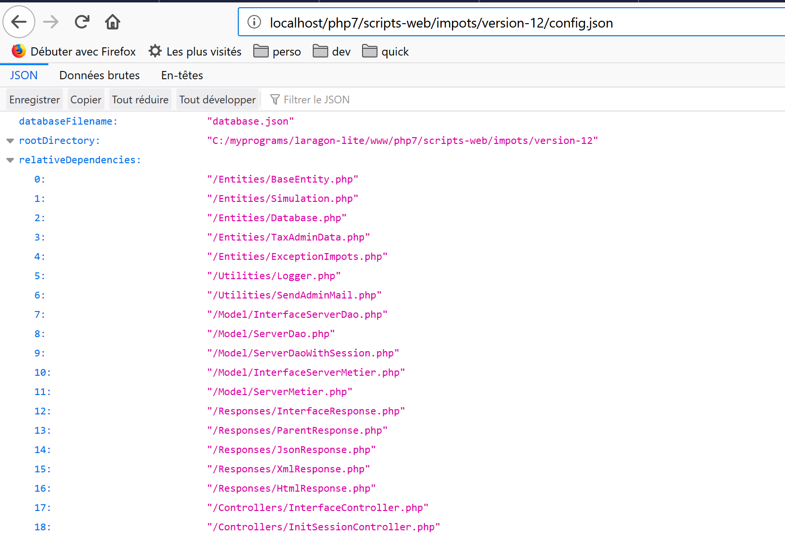
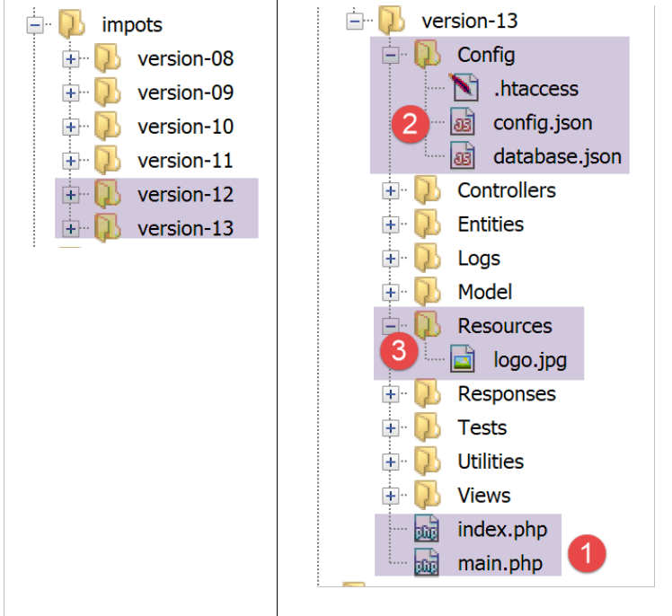
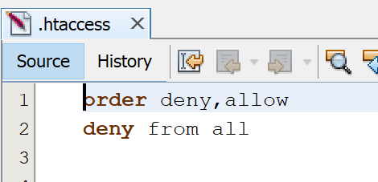
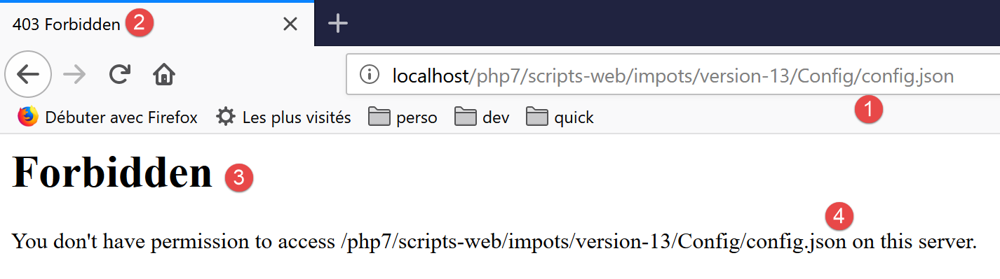
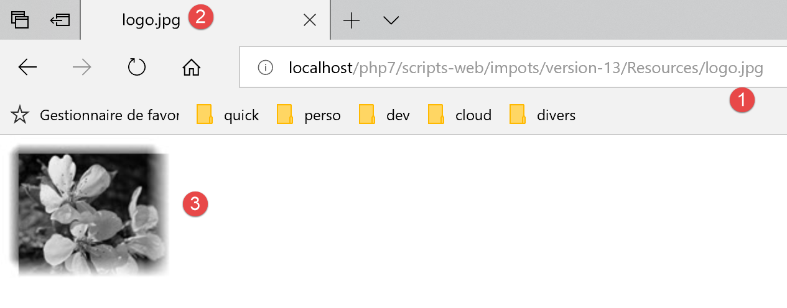
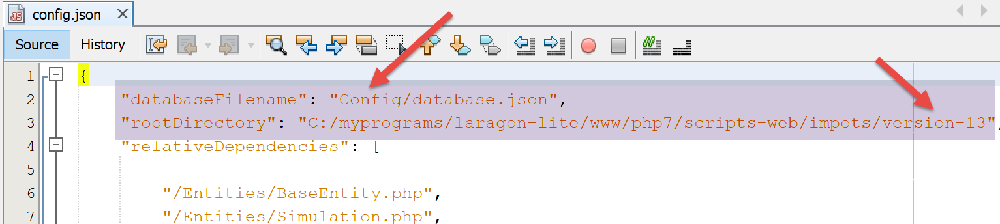
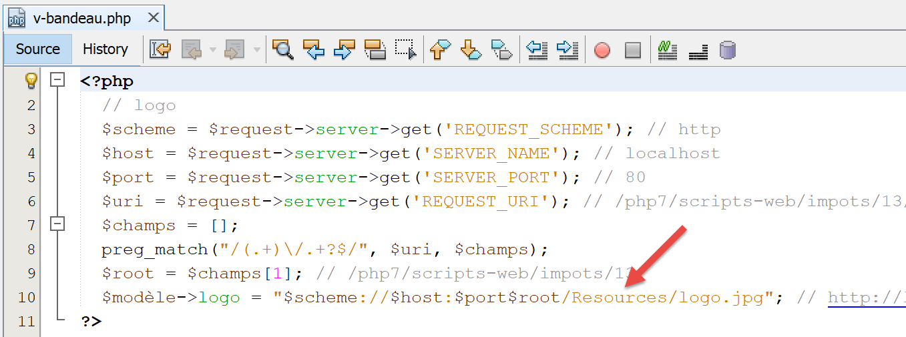

Exercice d’application – version 13
===================================

La version 13 amène peu de changements : elle sécurise l’accès aux
fichiers de l’application.

Avec la version 12, on peut demander l’URL suivante
**[http://localhost/php7/scripts-web/impots/version-12/config.json]**.
On obtient alors la page suivante (Firefox) :

|image0|

Or ce fichier **[config.json]** contient des informations sensibles tels
les identifiants des utilisateurs autorisés à utiliser l’application. Il
ne faut pas qu’il soit accessible aux utilisateurs. Il en est de même
pour tous les fichiers de l’application à l’exception des fichiers
**[main.php, index.php, Views/logo.jpg]** qui eux doivent être
accessibles de l’extérieur. En effet les vues ont besoin d’avoir un
accès HTTP au logo de l’application. La version 13 amène une solution
simple à ce problème.

Dans Netbeans, nous faisons un copier-coller du dossier **[version-12]**
dans **[version-13]** :

|image1|

-  en **[1]**, dans le dossier racine de l’application, nous ne laissons
   que les scripts **[index.php, main.php]** ;

-  en **[2]**, les fichiers de configuration sont placés dans un dossier
   **[Config]** ;

-  en **[3]**, l’image **[logo.jpg]** est placée dans un dossier
   **[Resources]** ;

Le serveur HTTP utilisé est ici un serveur Apache. Celui-ci permet de
contrôler l’accès à un dossier via un fichier **[.htaccess]**. Dans tous
les dossiers auxquels nous voulons interdire un accès direct par URL,
nous créons le fichier **[.htaccess]** suivant :

|image2|

Ces deux lignes font que tout accès au dossier est interdit à tous.

Nous plaçons ce fichier dans tous les dossiers de l’application sauf
dans le dossier racine et le dossier **[Resources]**. Finalement seuls
trois fichiers sont accessibles de l’extérieur : **[index.php, main.php,
Resources/logo.jpg]**.

Faisons quelques essais :

|image3|

|image4|

|image5|

|image6|

|image7|

Quelques modifications doivent être faites dans le code :

Dans le fichier **[Config/config.json]** :

|image8|

Dans le fichier **[main.php]** :

|image9|

Dans le fichier **[Views/v-bandeau.php]** :

|image10|

.. |image9| image:: ./chap-24/media/image10.png
   :width: 3.09843in
   :height: 0.93346in

